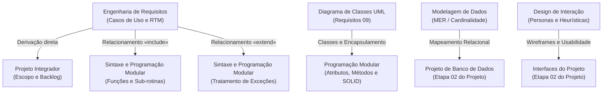

# Mapa de aprendizagem do semestre: visão transversal do eixo 2 (2026/2)

> **Contexto:** Painel transversal de acompanhamento do aprendizado acadêmico no curso de Tecnologia em Análise e Desenvolvimento de Sistemas (PUC Minas EAD). Este mapa reúne o estado de domínio conceitual, as pontes interdisciplinares entre matérias e os focos de revisão prioritários baseados estritamente em evidências reais de estudo.

---

## 1. Critérios objetivos de estado de aprendizagem

Para evitar autoavaliações ilusórias ou avanço artificial, cada tópico ou unidade do curso é classificado com base em evidências verificáveis do vault:

| Estado | Significado pedagógico | Evidência mínima exigida |
| :--- | :--- | :--- |
| **Ainda não estudado** | Conteúdo previsto na grade curricular cujas aulas ou leituras ainda não foram iniciadas. | Ausência de notas de estudo ou anotações no vault. |
| **Em estudo** | Aulas assistidas, anotações capturadas ou textos em processo de compreensão e síntese. | Notas criadas com anotações de aula, dúvidas registradas ou exercícios em andamento. |
| **Compreendido** | Domínio do modelo mental, capacidade de explicar via Técnica de Feynman e resolução correta de problemas/código. | Unidade concluída no roadmap, implementação validada em projeto ou acerto consistente em simuladores. |
| **Revisar** | Dificuldade identificada, erros recorrentes em simuladores ou necessidade de reforço antes de entregas/provas. | Registro de erro em diagnósticos, dúvidas conceituais abertas ou alerta em reuniões de projeto. |

---

## 2. Quadro de maturidade e acompanhamento por disciplina

Abaixo está o panorama transversal das disciplinas com base no desenvolvimento real das notas e atividades do 2º semestre:

| ID | Disciplina | Unidade / Módulo representativo | Estado atual | Evidências no vault |
| :--- | :--- | :--- | :--- | :--- |
| `01` | **[[01. Programacao Modular/00. Programação modular - Resumo\|Programação Modular]]** | Unidades 1, 2 e 3 (Fundamentos, Polimorfismo e SOLID/GoF) | **Compreendido** | 24 artigos concluídos, catálogo de TADs, simuladores completos e matriz GoF. |
| `02` | **[[02. Modelagem de Dados/00. Modelagem de Dados - Resumo\|Modelagem de Dados]]** | Módulos 1 e 2 (Fundamentos, ANSI/SPARC, MER, Cardinalidade) | **Em estudo** | 6 artigos estruturados, técnica de leitura de cardinalidades e anotações integradas. |
| `03` | **[[03. Manipulacao de Dados SQL/00. Manipulacao de Dados SQL - Resumo\|Manipulação de Dados SQL]]** | DDL, DML, Consultas e Junções relacionais | **Ainda não estudado** | Aguardando avanço do cronograma das aulas teóricas. |
| `04` | **[[04. Algoritmos e Estruturas de Dados/00. Algoritmos e Estruturas de Dados - Resumo\|Algoritmos e Estruturas de Dados]]** | Complexidade assintótica, coleções e vetores | **Em estudo** | Nota introdutória sobre C# e arrays e código de teste compilado. |
| `05` | **[[05. Desenvolvimento Web Back-End/00. Desenvolvimento Web Back-End - Resumo\|Desenvolvimento Web Back-End]]** | Arquitetura cliente-servidor e APIs | **Ainda não estudado** | Aguardando início do módulo no semestre. |
| `06` | **[[06. Projeto - Aplicacao Interativa/00. Projeto - Aplicacao Interativa - Resumo\|Projeto: Aplicação Interativa]]** | Etapa 01 concluída; Etapa 02 (Arquitetura e Modelagem) | **Em estudo** | Transcrições das reuniões 4, 5 e 6 com Profa. Rosilane; 3 CRUDs e escopo definidos. |
| `07` | **[[07. Engenharia de Requisitos/00. Engenharia de Requisitos - Resumo\|Engenharia de Requisitos]]** | Módulos 1 e 2 (Elicitação, Casos de Uso, Diagrama de Classes e Pacotes) | **Compreendido** | 11 artigos completos, critérios ISO/IEEE 29148 e conexões interdisciplinares. |
| `08` | **[[08. Design de Interacao/00. Design de Interacao - Resumo\|Design de Interação]]** | Módulos 1 e 2 (IHC, Norman vs Clarisse, Usabilidade, Heurísticas, SUS) | **Compreendido** | 24 artigos técnicos, síntese comparativa de avaliação e métodos empíricos. |
| `09` | **[[09. Redes de Computadores/00. Redes de Computadores - Resumo\|Redes de Computadores]]** | Modelos OSI, TCP/IP e protocolos | **Ainda não estudado** | Aguardando avanço do cronograma. |
| `10` | **[[10. Lideranca e Competencias/00. Lideranca e Competencias - Resumo\|Liderança e Competências]]** | Soft skills, comunicação e inteligência emocional | **Ainda não estudado** | Aguardando cronograma de atividades. |
| `11` | **[[11. Desafios Contemporaneos/00. Desafios Contemporaneos - Resumo\|Desafios Contemporâneos]]** | Ética, sociedade e impacto da computação | **Ainda não estudado** | Aguardando cronograma de atividades. |

---

## 3. Matriz transversal de pontes conceituais (Teoria → Modelagem → Código)

Conforme estabelecido nas diretrizes de interlinkagem qualitativa, as conexões intelectuais entre disciplinas conectam o aprendizado em um ecossistema coerente:

---

## 4. Registro de pontos críticos e tópicos para revisão

Espaço reservado para documentar conceitos onde houve dúvida teórica, erro em simulador ou apontamento em reunião de orientação:

### Tópicos sob atenção ativa
1. **Modelagem de dados:** Prática contínua da técnica de fixar um lado da relação e perguntar a cardinalidade máxima e mínima ao outro lado (evitar leitura invertida no DER de Chen).
2. **Engenharia de requisitos vs. código:** Garantir que os limites de `«include»` e `«extend»` definidos nos casos de uso estejam estritamente refletidos nas sub-rotinas e fluxos condicionais da implementação do projeto integrador.
3. **Padrões de projeto GoF:** Revisitar periodicamente a matriz bidimensional (escopo de classe vs. objeto cruzado com propósito criacional, estrutural e comportamental) antes dos simuladores globais.

---

## 5. Navegação e atalhos rápidos
* **Página inicial do portal:** [[index.md|Portal Acadêmico PUC Minas]]
* **Resumo de reuniões do projeto:** [[06. Projeto - Aplicacao Interativa/00. Projeto - Aplicacao Interativa - Resumo|Painel do Projeto Integrador]]
* **Guia de sintaxe multilinguagem:** [[00. Sintaxe Multilinguagem/00. Guia multilinguagem de sintaxe e praticas - Índice|Índice de Sintaxe]]
