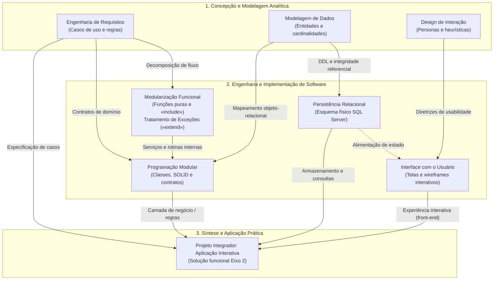
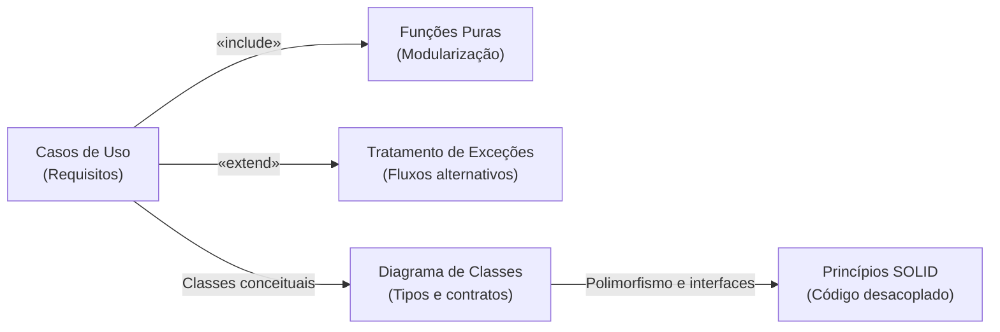
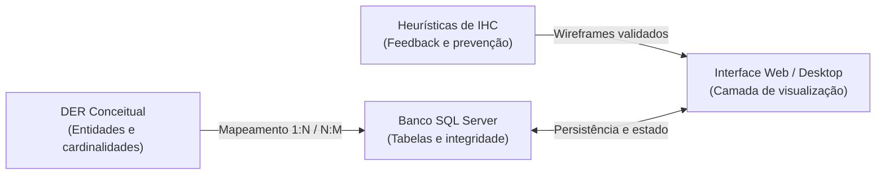

# Mapa de aprendizagem do semestre: visão transversal do eixo 2 (2026/2)

> **Contexto:** Painel transversal de acompanhamento do aprendizado acadêmico no curso de Tecnologia em Análise e Desenvolvimento de Sistemas (PUC Minas EAD). Este mapa reúne o estado de domínio conceitual, as pontes interdisciplinares entre matérias e os focos de revisão prioritários baseados estritamente em evidências reais de estudo.

---

## 1. Critérios objetivos de estado de aprendizagem

Para evitar autoavaliações ilusórias ou avanço artificial, cada tópico ou unidade do curso é classificado com base em evidências verificáveis do vault:

| Estado | Significado pedagógico | Evidência mínima exigida |
| :--- | :--- | :--- |
| **Ainda não estudado** | Conteúdo previsto na grade curricular cujas aulas ou leituras ainda não foram iniciadas. | Ausência de notas de estudo ou anotações no vault. |
| **Em estudo** | Aulas assistidas, anotações capturadas ou textos em processo de compreensão e síntese. | Notas criadas com anotações de aula, dúvidas registradas ou exercícios em andamento. |
| **Compreendido** | Domínio do modelo mental, capacidade de explicar via Técnica de Feynman e resolução correta de problemas/código. | Unidade concluída no roadmap, implementação validada em projeto ou acerto consistente em simuladores. |
| **Revisar** | Dificuldade identificada, erros recorrentes em simuladores ou necessidade de reforço antes de entregas/provas. | Registro de erro em diagnósticos, dúvidas conceituais abertas ou alerta em reuniões de projeto. |

---

## 2. Quadro de maturidade e acompanhamento por disciplina

Abaixo está o panorama transversal das disciplinas com base na diferenciação estrita entre cobertura de conteúdo, progresso da disciplina e evidências reais de aprendizagem do estudante:

| ID | Disciplina | Módulo representativo | Cobertura no vault | Progresso da disciplina | Estado de aprendizagem | Evidências de aprendizagem |
| :--- | :--- | :--- | :--- | :--- | :--- | :--- |
| `01` | **[[01. Programacao Modular/00. Programação modular - Resumo\|Programação Modular]]** | Unidades 1, 2 e 3 (Fundamentos, Polimorfismo, SOLID e GoF) | Extensa (24 artigos e catálogo TAD) | Concluída (Unidades 1 a 3) | **Compreendido** | Domínio do modelo mental, simuladores com correção taxonômica, exemplos compilados em C# e aplicação de invariantes. |
| `02` | **[[02. Modelagem de Dados/00. Modelagem de Dados - Resumo\|Modelagem de Dados]]** | Módulos 1 e 2 (ANSI/SPARC, MER conceitual e cardinalidades) | Inicial (6 artigos) | Em andamento (Módulo 2) | **Em estudo** | Prática da técnica de leitura de cardinalidades e anotações de aula integradas; aguardando consolidação em exercícios práticos. |
| `03` | **[[03. Manipulacao de Dados SQL/00. Manipulacao de Dados SQL - Resumo\|Manipulação de Dados SQL]]** | DDL, DML, consultas relacionais e junções | Ementa/Prompts | Cronograma futuro | **Ainda não estudado** | Disciplina ainda não iniciada na rotina de estudos. |
| `04` | **[[04. Algoritmos e Estruturas de Dados/00. Algoritmos e Estruturas de Dados - Resumo\|Algoritmos e Estruturas de Dados]]** | Complexidade assintótica (Big O) e vetores | Básica (Arrays em C#) | Em andamento inicial | **Em estudo** | Testes atômicos com arrays em C# e compilação local; aguardando estruturas dinâmicas e análise de complexidade. |
| `05` | **[[05. Desenvolvimento Web Back-End/00. Desenvolvimento Web Back-End - Resumo\|Desenvolvimento Web Back-End]]** | Arquitetura MVC, APIs REST e autenticação | Ementa/Prompts | Cronograma futuro | **Ainda não estudado** | Disciplina ainda não iniciada na rotina de estudos. |
| `06` | **[[06. Projeto - Aplicacao Interativa/00. Projeto - Aplicacao Interativa - Resumo\|Projeto: Aplicação Interativa]]** | Etapas 01 (Concepção) e 02 (Arquitetura e Modelagem) | Robusta (Resumos e 3 transcrições) | Em andamento (Etapa 02) | **Em estudo** | Etapa 01 entregue (ODS 4, 3 CRUDs e casos de uso validados pela orientadora); modelagem da Etapa 02 em execução prática. |
| `07` | **[[07. Engenharia de Requisitos/00. Engenharia de Requisitos - Resumo\|Engenharia de Requisitos]]** | Módulos 1 e 2 (Elicitação, Casos de Uso, Classes e Pacotes UML) | Ampla (11 artigos) | Módulos 1 e 2 concluídos | **Em estudo** | Casos de uso e requisitos aplicados no projeto integrador; aguardando validação por baterias de simuladores para consolidação. |
| `08` | **[[08. Design de Interacao/00. Design de Interacao - Resumo\|Design de Interação]]** | Módulos 1 e 2 (IHC, Semiótica vs Cognitiva, Heurísticas e SUS) | Ampla (24 artigos) | Módulos 1 e 2 concluídos | **Em estudo** | Personas e fluxos modelados para o projeto; em consolidação teórica dos métodos de avaliação e semiótica antes das provas. |
| `09` | **[[09. Redes de Computadores/00. Redes de Computadores - Resumo\|Redes de Computadores]]** | Modelos OSI e TCP/IP, roteamento e protocolos | Ementa/Prompts | Cronograma futuro | **Ainda não estudado** | Disciplina ainda não iniciada na rotina de estudos. |
| `10` | **[[10. Lideranca e Competencias/00. Lideranca e Competencias - Resumo\|Liderança e Competências]]** | Inteligência emocional, trabalho em equipe e liderança | Ementa/Prompts | Cronograma futuro | **Ainda não estudado** | Disciplina ainda não iniciada na rotina de estudos. |
| `11` | **[[11. Desafios Contemporaneos/00. Desafios Contemporaneos - Resumo\|Desafios Contemporâneos]]** | Ética, impacto da IA e cidadania digital | Ementa/Prompts | Cronograma futuro | **Ainda não estudado** | Disciplina ainda não iniciada na rotina de estudos. |

---

## 3. Matriz transversal de pontes conceituais (Teoria → Modelagem → Código)

A formação técnica do Eixo 2 apoia-se na convergência entre modelagem conceitual, arquitetura de software, persistência relacional e experiência do usuário. Conforme as diretrizes cognitivas do vault, essa relação é organizada em duas camadas complementares:

### 3.1 Visão global integrada: O ecossistema do Eixo 2

O mapa a seguir apresenta a arquitetura sistêmica completa do semestre, conectando a concepção analítica ao código executável e à entrega funcional no Projeto Integrador:

---

### 3.2 Detalhamento focal: Subsistemas e pontes específicas

Para o estudo concentrado de frentes de trabalho pontuais, as relações acima desdobram-se em dois fluxos focais:

#### Foco A: Da especificação de requisitos ao código modular e OO

#### Foco B: Dos modelos de dados e IHC à interface de persistência

---

## 4. Registro de pontos críticos e tópicos para revisão

Espaço reservado para documentar conceitos onde houve dúvida teórica, erro em simulador ou apontamento em reunião de orientação:

### Tópicos sob atenção ativa
1. **Modelagem de dados:** Prática contínua da técnica de fixar um lado da relação e perguntar a cardinalidade máxima e mínima ao outro lado (evitar leitura invertida no DER de Chen).
2. **Engenharia de requisitos vs. código:** Garantir que os limites de `«include»` e `«extend»` definidos nos casos de uso estejam estritamente refletidos nas sub-rotinas e fluxos condicionais da implementação do projeto integrador.
3. **Padrões de projeto GoF:** Revisitar periodicamente a matriz bidimensional (escopo de classe vs. objeto cruzado com propósito criacional, estrutural e comportamental) antes dos simuladores globais.

---

## 5. Navegação e atalhos rápidos
* **Página inicial do portal:** [[index.md|Portal Acadêmico PUC Minas]]
* **Resumo de reuniões do projeto:** [[06. Projeto - Aplicacao Interativa/00. Projeto - Aplicacao Interativa - Resumo|Painel do Projeto Integrador]]
* **Guia de sintaxe multilinguagem:** [[00. Sintaxe Multilinguagem/00. Guia multilinguagem de sintaxe e praticas - Índice|Índice de Sintaxe]]
