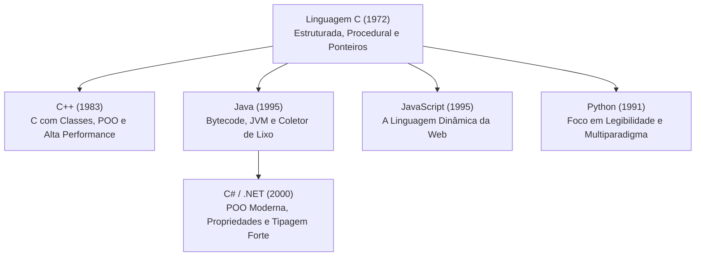
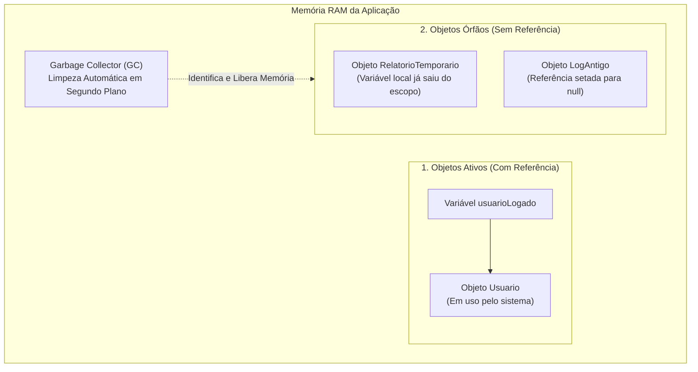

# 00. Evolução das linguagens e genealogia do C (C, C++, Java, C#, JS, Python)

> **Contexto:** Estudo genealógico e evolutivo da família de linguagens de programação derivadas do C. Análise da transição da manipulação direta de hardware e ponteiros para a orientação a objetos, ambientes gerenciados com Garbage Collector, tipagem dinâmica na Web e as estruturas de pensamento que moldaram a computação moderna explicadas pela Técnica de Feynman.

---

## 1. A árvore genealógica da família C (Técnica de Feynman)

Pense na história das linguagens como a **evolução das ferramentas de transporte**:

* **C (O motor sem cinto de segurança):** Rápido, leve e com controle manual direto das engrenagens, mas qualquer erro estoura o motor ou bate na parede (vazamento de memória).
* **C++ (O carro com carroceria blindada):** Acrescenta classes e Tipos Abstratos de Dados em cima do motor do C, dando poder modular, mas mantendo a complexidade do controle manual de combustível.
* **Java & C# (Os carros automáticos com airbag e piloto automático):** Criam uma camada de proteção (Máquina Virtual / Runtime) e um coletor de lixo automático (*Garbage Collector*). Você dirige com segurança total sem se preocupar em limpar a memória na mão.
* **JavaScript & Python (Os patinetes elétricos de partida imediata):** Focados em produtividade máxima, dinamismo e execução rápida sem burocracia de compilação pesada prévia.



---

## 2. Linha do tempo e motivação de cada evolução

### a. Linguagem C (Dennis Ritchie, 1972)
* **Problema a resolver:** Era necessário reescrever o sistema operacional UNIX em uma linguagem mais legível que o Assembly, mas que ainda mantivesse controle total sobre a memória RAM.
* **Inovações:** Sintaxe de chaves `{ }`, comandos estruturados (`if`, `while`, `for`), ponteiros diretos de memória e compilação nativa ultra-eficiente.
* **O que faltava:** Não possuía encapsulamento nativo nem classes (dados ficavam em `structs` abertas e separadas das funções).

### b. C++ (Bjarne Stroustrup, 1983)
* **Problema a resolver:** Sistemas grandes (como simuladores e interfaces gráficas) ficavam caóticos apenas com funções soltas e structs.
* **Inovações:** Adicionou **Classes**, Herança, Polimorfismo e Sobrecarga de Operadores diretamente sobre o C. Criou a base para os Tipos Abstratos de Dados de alta performance.
* **O desafio:** O desenvolvedor ainda precisava alocar e liberar memória manualmente (`new` e `delete`), causando vazamentos de memória frequentes (*memory leaks*).

### c. Java (James Gosling / Sun Microsystems, 1995)
* **Problema a resolver:** "Escreva uma vez, rode em qualquer lugar" (*Write once, run anywhere*). O código precisava rodar em múltiplos dispositivos sem ser recompilado para cada processador.
* **Inovações:** 
  - **Máquina virtual (JVM):** O código compila para um formato universal (*bytecode*).
  - **Garbage collector (GC - Coletor de lixo):** Um processo em segundo plano que monitora a memória RAM. Sempre que um objeto criado com `new` perde todas as suas referências (ou seja, nenhuma variável mais aponta para ele), o Garbage Collector o identifica como "lixo" e devolve aquela memória para o sistema operacional automaticamente, eliminando os temidos vazamentos de memória (*memory leaks*).
  - Eliminação de ponteiros explícitos para evitar corrupção de memória.

### d. C# e a plataforma .NET (Anders Hejlsberg / Microsoft, 2000)
* **Problema a resolver:** Criar uma linguagem moderna, elegante e fortemente integrada ao ecossistema corporativo.
* **Inovações:** 
  - Sintaxe enriquecida com **propriedades** (`get`/`set`), coleções genéricas robustas (`System.Collections.Generic`), delegados, eventos e LINQ.
  - **Runtime moderno (CLR - Common Language Runtime):** Fornece um Garbage Collector de última geração dividido em gerações (Gen 0, Gen 1, Gen 2), otimizando a limpeza de objetos de vida curta vs. objetos de longa duração.

### e. JavaScript (Brendan Eich, 1995)
* **Problema a resolver:** Dar dinamismo e interatividade às páginas web estáticas nos navegadores (Netscape).
* **Inovações:** 
  - Sintaxe visual herdada do C/Java, mas com modelo dinâmico e flexível.
  - Orientação a objetos baseada em protótipos e funções de primeira classe (*First-Class Functions*).

### f. Python (Guido van Rossum, 1991)
* **Problema a resolver:** Facilitar o aprendizado e aumentar a produtividade humana, reduzindo a sobrecarga sintática de chaves e declarações verbosas.
* **Inovações:** 
  - Indentação obrigatória como delimitador de escopo (elimina `{ }`).
  - Tipagem dinâmica e rica biblioteca padrão (*batteries included*).

---

## 3. O que é o Garbage Collector? (Técnica de Feynman)

Para entender a revolução trazida por Java e C#, precisamos analisar como a memória era tratada antes e depois da invenção do **Garbage Collector (GC)**.

### A analogia do restaurante e da praça de alimentação

* **O mundo sem Garbage Collector (C e C++):** Imagine uma praça de alimentação onde cada cliente é obrigado a comer, levantar, lavar seu próprio prato e guardá-lo no armário (`free()` ou `delete`). Se você esquecer de lavar um único prato, a mesa fica ocupada para sempre. Conforme o dia passa, o restaurante fica sem mesas disponíveis e quebra (*Memory Leak* ou Vazamento de Memória).
* **O mundo com Garbage Collector (Java, C#, Python, JS):** O desenvolvedor apenas senta, come e vai embora (`new Conta(...)`). Existe um **garçom invisível em segundo plano (o Garbage Collector)** que inspeciona continuamente as mesas:
  1. Ele verifica se ainda existe alguém sentado na mesa ou conversando com ela (*se alguma variável do código ainda aponta para aquele objeto*).
  2. Se ninguém mais tiver a referência do objeto, ele recolhe a louça e devolve o espaço de memória para o sistema operacional instantaneamente.



### Como isso se reflete no código?

Veja o que acontece no ciclo de vida de um método em C#:

```csharp
void GerarExtratoMensal() 
{
    // 1. O objeto é criado e alocado na memória RAM
    Conta contaTemporaria = new Conta(5000, DateTime.Now);
    
    Console.WriteLine("Saldo atual: {0}", contaTemporaria.Saldo);

    // 2. O método termina aqui!
} // A variável 'contaTemporaria' deixa de existir (saiu do escopo).
  // O objeto Conta na memória agora é um ÓRFÃO.
  // O Garbage Collector detecta o abandono e libera a memória sozinho!
```

> **Por que isso é um marco histórico?** Antes do Garbage Collector, mais de 50% dos bugs em softwares comerciais de grande porte eram causados por corrupção de memória ou ponteiros esquecidos. Com o GC, linguagens como Java e C# tornaram o desenvolvimento de sistemas muito mais seguro, estável e previsível.

---

## 4. Comparativo sintático da evolução histórica: criando um TAD

Observe como a mesma estrutura de pensamento (um TAD de Conta Bancária que encapsula um saldo) foi expressa ao longo das gerações:

### 1ª Geração: C (estrutura procedural)
```c
// Em C puro, os dados ficam abertos na struct e as funções ficam soltas
typedef struct {
    double saldo;
} Conta;

void depositar(Conta* c, double valor) {
    if (valor > 0) c->saldo += valor;
}
```

### 2ª Geração: C++ (POO com gerenciamento manual)
```cpp
class Conta {
private:
    double _saldo; // Atributo protegido

public:
    Conta(double saldoInicial) : _saldo(saldoInicial) {}
    void Depositar(double valor) {
        if (valor > 0) _saldo += valor;
    }
    double GetSaldo() const { return _saldo; }
};
```

### 3ª Geração: C# e Java (POO gerenciada com Garbage Collector)
```csharp
public class Conta 
{
    private double _saldo;

    public Conta(double saldoInicial) => _saldo = saldoInicial;

    public void Depositar(double quantia) {
        if (quantia > 0) _saldo += quantia;
    }

    public double Saldo => _saldo; // Propriedade moderna
}
```

### 4ª Geração: Python e JavaScript moderno (dinamismo e expressividade)
```javascript
class Conta {
    #saldo; // Campo privado nativo do JS moderno (#)

    constructor(saldoInicial) {
        this.#saldo = saldoInicial;
    }

    depositar(valor) {
        if (valor > 0) this.#saldo += valor;
    }

    get saldo() {
        return this.#saldo;
    }
}
```

---

## 5. Resumo comparativo dos paradigmas e gerenciamento

| Linguagem | Ano | Paradigma Principal | Gerenciamento de Memória | Tipagem | Ponto Forte Histórico |
| --- | --- | --- | --- | --- | --- |
| **C** | 1972 | Procedural / Estruturado | Manual (Ponteiros / `malloc` / `free`) | Estática / Fraca | Controle de hardware e SOs |
| **C++** | 1983 | Multiparadigma / POO | Manual (`new` / `delete` / RAII) | Estática / Forte | Games, motores gráficos e alta performance |
| **Java** | 1995 | Orientado a Objetos Puro | Automático (*Garbage Collector*) | Estática / Forte | Portabilidade corporativa e Android |
| **C#** | 2000 | Multiparadigma / POO | Automático (*Garbage Collector*) | Estática / Forte | Desenvolvimento corporativo, Desktop, Web e Unity |
| **JavaScript** | 1995 | Multiparadigma / Funcional / Protótipos | Automático (*Garbage Collector*) | Dinâmica / Fraca | O motor de toda a Web e Front-end |
| **Python** | 1991 | Multiparadigma / Scripting | Automático (*Garbage Collector*) | Dinâmica / Forte | Ciência de dados, IA, automação e clareza |

---

## Navegação

* **Ir para o Tópico 01:** [[00. Sintaxe Multilinguagem/01. Variáveis, tipos e atribuição|01. Variáveis, Tipos e Atribuição]]
* **Voltar ao Índice Geral:** [[00. Sintaxe Multilinguagem/00. Guia multilinguagem de sintaxe e praticas - Índice]]
