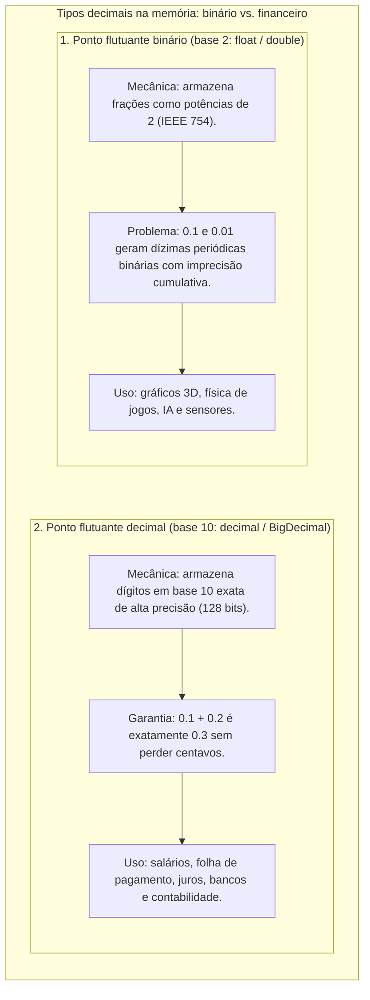

# 01. Variáveis, tipos e atribuição

> **Contexto:** Estudo prático da declaração de variáveis, sistemas de tipagem e comandos de atribuição em C#, Java, Python e JavaScript.

---

## 1. Como funciona

A execução sequencial é o fluxo padrão de um algoritmo: as instruções são executadas de cima para baixo. A atribuição armazena o resultado de uma expressão em uma região de memória rotulada por um nome (variável).

---

| Linguagem | Tipagem | Declaração de variável | Declaração de constante |
| --- | --- | --- | --- |
| **C#** | Estática / Forte | `int idade = 25; string nome = "Ana";` | `public const double Pi = 3.14159;` ou `readonly int Max = 100;` |
| **Java** | Estática / Forte | `int idade = 25; String nome = "Ana";` | `public static final double PI = 3.14159;` |
| **Python** | Dinâmica / Forte | `idade = 25; nome = "Ana"` | `PI = 3.14159` *(convenção em maiúsculas; não possui palavra-chave)* |
| **JavaScript** | Dinâmica / Fraca | `let idade = 25;` | `const PI = 3.14159;` |

---

## 2. Tipos numéricos com casas decimais: `float`, `double` e `decimal` (precisão binária vs. financeira)

Nem todo número com vírgula funciona da mesma forma na memória. A ciência da computação divide números decimais em duas categorias fundamentais:

### A analogia de Feynman: a régua em polegadas vs. a régua em centímetros

* **`float` e `double` são como medir em frações de polegada ($1/2, 1/4, 1/8$):** Se você precisar medir $1/10$ de centímetro com uma régua de polegadas, terá que fazer uma aproximação que nunca baterá 100% perfeitamente.
* **`decimal` é a régua milimétrica exata em base 10:** Ela foi feita especificamente para o sistema decimal humano. Se você conta centavos e notas de dinheiro, nenhuma fração fica de fora.

### Comparativo multilinguagem:

| Conceito | C# (.NET) | Java | Python | JavaScript |
| :--- | :--- | :--- | :--- | :--- |
| **Flutuante simples (32 bits / Base 2)** | `float` (sufixo `f`: `10.5f`) | `float` (sufixo `f`: `10.5f`) | Não possui nativo (usa `float` 64-bit) | `Number` (sempre 64 bits) |
| **Flutuante duplo (64 bits / Base 2)** | `double` (padrão: `10.5`) | `double` (padrão: `10.5`) | `float` (`10.5`) | `Number` (`10.5`) |
| **Alta precisão / Financeiro (Base 10)** | `decimal` (sufixo `m`: `10.50m`) | `BigDecimal` (`new BigDecimal("10.50")`) | `Decimal` (`from decimal import Decimal`) | `BigInt` (apenas inteiros) ou libs (`decimal.js`) |
| **Exemplo de soma `0.1 + 0.2`** | `0.1m + 0.2m == 0.3m` *(true)* | `b1.add(b2).equals(b3)` *(true)* | `Decimal('0.1') + Decimal('0.2') == Decimal('0.3')` | `0.1 + 0.2 === 0.30000000000000004` *(false)* |

---

## 3. Constantes e imutabilidade (`const`, `final`, `readonly`)

Uma **constante** é um identificador cujo valor associado é **fixado e imutável** durante toda a vida útil do programa:
* **Em C#:** `const` é estática e resolvida em **tempo de compilação** (*compile-time*). Para valores calculados em tempo de execução, usa-se `readonly` ou `static readonly`.
* **Em Java:** Usa-se o modificador `final` (ex.: `public static final double TAXA = 0.05;`).
* **Em JavaScript:** `const` impede a reatribuição da variável (`const x = 10; x = 20;` gera erro `TypeError`).
* **Em Python:** Não há proteção a nível de linguagem; adota-se a convenção PEP 8 com nomes em letras MAIÚSCULAS (`TAXA_SERVICO = 10.0`).

---

## 4. Convenções de nomenclatura (*Naming Conventions: camelCase, PascalCase, snake_case*)

Cada ecossistema de linguagem possui convenções culturais e de estilo consolidadas para nomear identificadores:

| Elemento | C# (.NET) | Java | Python (PEP 8) | JavaScript / TypeScript |
| :--- | :--- | :--- | :--- | :--- |
| **Classes / Tipos** | `PascalCase` (`ContaBancaria`) | `PascalCase` (`ContaBancaria`) | `PascalCase` (`ContaBancaria`) | `PascalCase` (`ContaBancaria`) |
| **Métodos / Funções** | `PascalCase` (`CalcularTotal`) | `camelCase` (`calcularTotal`) | `snake_case` (`calcular_total`) | `camelCase` (`calcularTotal`) |
| **Propriedades** | `PascalCase` (`Saldo`) | Métodos `getSaldo()` | `@property def saldo(self):` | `get saldo()` / `camelCase` |
| **Variáveis locais** | `camelCase` (`valorTotal`) | `camelCase` (`valorTotal`) | `snake_case` (`valor_total`) | `camelCase` (`valorTotal`) |
| **Parâmetros** | `camelCase` (`novoPreco`) | `camelCase` (`novoPreco`) | `snake_case` (`novo_preco`) | `camelCase` (`novoPreco`) |
| **Atributos privados** | `_camelCase` (`_saldo`) | `camelCase` (`saldo` / `private`) | `_snake_case` (`_saldo`) | `#camelCase` ou `_camelCase` |
| **Constantes** | `PascalCase` (`TaxaFixa`) | `SCREAMING_SNAKE` (`TAXA_FIXA`) | `SCREAMING_SNAKE` (`TAXA_FIXA`) | `SCREAMING_SNAKE` ou `camelCase` |

---

## 5. Armadilhas comuns

* **Diferença entre `=`, `==` e `===`:**
  * **`=` (Atribuição):** Guarda um valor dentro de uma variável (ex.: `let idade = 25;`).
  * **`==` (Comparação frouxa / com coerção):** Compara apenas o valor, convertendo os tipos automaticamente se forem diferentes. Em JavaScript e PHP: `'5' == 5` retorna `true` (o texto `'5'` é convertido em número).
  * **`===` (Comparação estrita / sem coerção):** Compara **o valor E o tipo de dado** ao mesmo tempo. `'5' === 5` retorna `false` (porque um é texto `string` e o outro é número `number`). É a melhor prática em JavaScript.
* **Escopo de variáveis:** Declarar uma variável dentro de um bloco e tentar acessá-la fora gera erro em C#/Java/JS (`let`).

---

## 6. Exercício de prática

* **Desafio:** Crie um algoritmo que leia a temperatura em Celsius, converta para Fahrenheit ($F = C \times 1.8 + 32$) e exiba o resultado formatado em C# e Python respeitando rigorosamente as convenções de nomenclatura de cada linguagem (`PascalCase` vs. `snake_case`).

---

## Navegação

* **Voltar ao índice geral:** [[00. Sintaxe Multilinguagem/00. Guia multilinguagem de sintaxe e praticas - Índice]]
* **Próximo tópico:** [[00. Sintaxe Multilinguagem/02. Estruturas condicionais (if, else, switch)|02. Estruturas Condicionais (if, else, switch)]]
* **Ver na disciplina:** [[01. Programacao Modular/01. Introdução à programação modular]] | [[04. Algoritmos e Estruturas de Dados/Recordando C# e arrays]]
