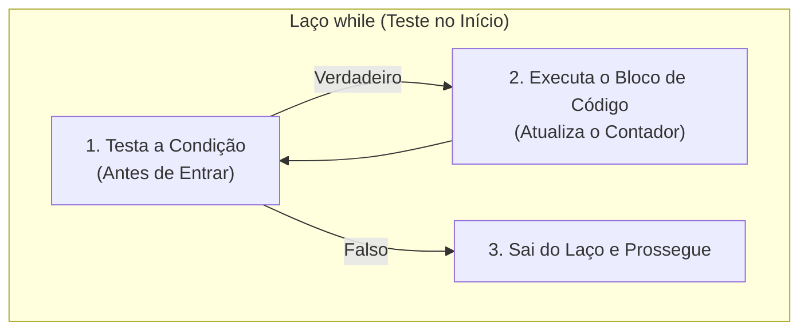
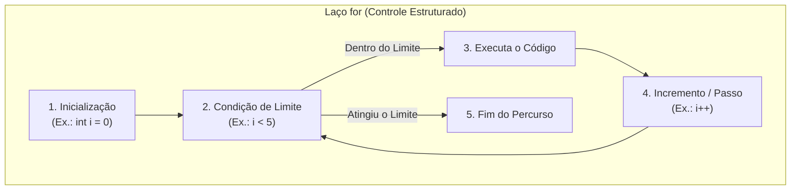
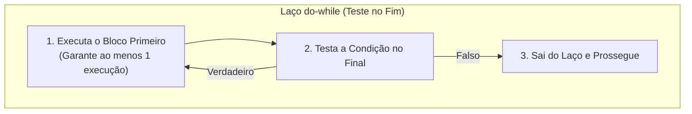

# 03. Estruturas de repetição (while, for, do-while)

> **Contexto:** Estudo das três principais estruturas de repetição e laços de iteração: pré-testadas (`while`), contadas (`for`) e pós-testadas (`do-while`) em C#, Java, Python e JavaScript, com analogias do mundo real explicadas através da Técnica de Feynman.

---

## 1. Repetição pré-testada (`while` - "Enquanto a condição for verdadeira, faça")

### A intuição do mundo real (Técnica de Feynman)
Pense em um **banho com chuveiro elétrico**:
1. Antes de colocar o corpo embaixo da água, você estica a mão e **testa a temperatura da água primeiro** (*pré-teste*).
2. Se a água ainda estiver gelada, você não entra no banho.
3. Se estiver agradável, você toma banho e, a cada minuto, continua se perguntando: *"Ainda estou ensaboado?"*.
4. **Enquanto** a resposta for **Sim**, você continua no banho. No instante em que a resposta for **Não**, você fecha o registro e sai.



> **Regra de ouro:** Como o teste é feito no início, se a condição for falsa logo de primeira, o código dentro do bloco **não roda nenhuma vez**.

### Comparativo multilinguagem

#### C# / Java / JavaScript
```csharp
int contador = 1;

// 1. Testa antes de entrar: 1 <= 5 ? Sim!
while (contador <= 5) 
{
    Console.WriteLine("Número: {0}", contador);
    contador++; // 2. Incremento obrigatório para não travar em loop infinito
}
```

#### Python
```python
contador = 1

while contador <= 5:
    print(f"Número: {contador}")
    contador += 1
```

---

## 2. Repetição contada (`for` - "Para cada volta do percurso, faça")

### A intuição do mundo real (Técnica de Feynman)
Pense em um **treino de corrida em uma pista de atletismo**:
1. O treinador diz: *"Você vai dar exatamente **5 voltas** na pista"*.
2. Você já sabe de antemão:
   - **Início:** Volta 1 (`int i = 1`).
   - **Limite:** Até completar a volta 5 (`i <= 5`).
   - **Passo:** A cada volta concluída, você soma +1 no seu relógio (`i++`).
3. O laço `for` é a forma mais compacta e organizada de escrever um laço quando você **já sabe com precisão o ponto de partida, o limite final e o passo da contagem**.



### Comparativo multilinguagem

#### C# / Java / JavaScript
```csharp
// Agrupa: (Inicialização; Condição de parada; Incremento)
for (int i = 0; i < 5; i++) 
{
    Console.WriteLine("Volta da pista: {0}", i);
}
```

#### Python
```python
# O range(5) gera a sequência: 0, 1, 2, 3, 4
for i in range(5):
    print(f"Volta da pista: {i}")
```

---

## 3. Repetição pós-testada (`do-while` - "Faça primeiro, pergunte depois")

### A intuição do mundo real (Técnica de Feynman)
Pense em **provar uma comida nova ou usar um Caixa Eletrônico**:
1. Você não tem como saber se gosta de um prato sem provar pelo menos uma garfada.
2. Então você **come a primeira garfada primeiro** (`do`) e só **depois pergunta**: *"Quer mais uma garfada?"* (`while`).
3. Em sistemas de software, essa estrutura é perfeita para **menus interativos**: o programa sempre precisa exibir o menu na tela pelo menos uma vez para que o usuário possa digitar a opção desejada.



> **Regra de ouro:** O bloco `do-while` tem a garantia absoluta de executar **pelo menos uma vez**, mesmo que a condição de repetição seja falsa.

### Comparativo multilinguagem

#### C# / Java / JavaScript
```csharp
int opcao;

do 
{
    Console.WriteLine("1. Ver Saldo | 2. Sacar | 0. Sair");
    opcao = int.Parse(Console.ReadLine());
    
} while (opcao != 0); // Testa só depois que o usuário já digitou!
```

#### Python (Emulação com `while True` + `break`)
> **Nota de sintaxe:** Python não possui a palavra-chave `do-while` nativamente. A convenção da linguagem é criar um loop infinito e interromper com `break` no final:

```python
while True:
    opcao = int(input("1. Ver Saldo | 2. Sacar | 0. Sair: "))
    
    # Testa a condição no final
    if opcao == 0:
        break
```

---

## 4. Tabela comparativa dos modelos de repetição

| Estrutura | Momento do Teste | Mínimo de Execuções | Quando Utilizar? |
| --- | --- | --- | --- |
| **`while`** | No início (pré-testada) | **0 vezes** | Quando você não sabe quantas repetições serão necessárias e pode nem precisar executar nenhuma (ex.: ler linhas de um arquivo até acabar). |
| **`for`** | No início (contada) | **0 vezes** | Quando o número de iterações ou o tamanho da coleção/array já é conhecido previamente (ex.: percorrer de 0 a 100). |
| **`do-while`** | No final (pós-testada) | **1 vez (Garantida)** | Quando a primeira execução é indispensável antes de testar a regra de parada (ex.: menus de opções e validação de entrada de dados). |

---

## Navegação

* **Tópico anterior:** [[00. Sintaxe Multilinguagem/02. Estruturas condicionais (if, else, switch)|02. Estruturas Condicionais (if, else, switch)]]
* **Próximo tópico:** [[00. Sintaxe Multilinguagem/04. Sub-rotinas (funções e procedimentos)|04. Sub-rotinas (Funções e Procedimentos)]]
* **Voltar ao Índice Geral:** [[00. Sintaxe Multilinguagem/00. Guia multilinguagem de sintaxe e praticas - Índice]]
