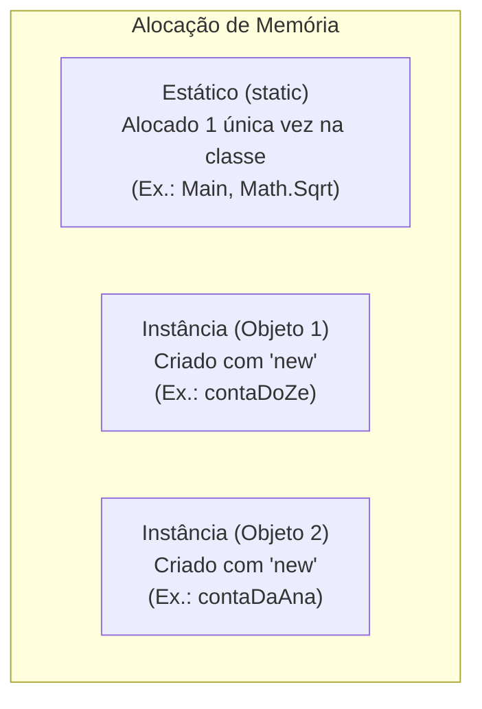

# 06. Modificadores de acesso, escopo e a palavra-chave static

> **Contexto:** Estudo detalhado dos componentes de cabeçalho em C# e Java (`using System`, `using System.Collections.Generic`, `class Program`, `void`, `return`, `static void Main`), com foco no papel das importações de namespaces, do sublinhado (`_`) para atributos privados, do modificador `static`, da visibilidade (`public` vs `private`) e o uso da Técnica de Feynman.

---

## 1. Desconstrução dos cabeçalhos em C# (Técnica de Feynman)

Quando abrimos um arquivo em C#, nos deparamos com as diretivas de importação e a estrutura da classe:

```csharp
using System;
using System.Collections.Generic;

class Program 
{
    static void Main(string[] args) 
    {
        Console.WriteLine("Olá, Mundo!");
    }
}
```

### A intuição por trás de cada diretiva `using` (Feynman):

1. **O que é um `namespace` e por que usamos `using`?**
   - **Analogia:** Pense na biblioteca inteira do .NET/C# como uma **grande oficina com milhares de gavetas organizadas**. Cada gaveta temática chama-se **Namespace**.
   - Em vez de você ter que escrever o caminho completo toda vez (ex.: `System.Console.WriteLine(...)` ou `System.DateTime.Now`), o comando `using` abre a gaveta logo no início do arquivo. Assim, você pode usar os recursos diretamente pelo nome (`Console.WriteLine(...)`, `DateTime.Now`).

2. **Por que usamos `using System;`?**
   - **O que contém:** É a **gaveta de ferramentas essenciais e tipos primitivos** do C#.
   - **Recursos principais:** Fornece a classe `Console` (para ler e imprimir na tela com `ReadLine` e `WriteLine`), a estrutura `DateTime` (para datas e horários), a classe matemática `Math` e tipos de exceções básicas (`ArgumentException`, `Exception`).

3. **Por que usamos `using System.Collections.Generic;`?**
   - **O que contém:** É a **gaveta de estruturas de dados modernas e dinâmicas** (coleções genéricas).
   - **Recursos principais:** Permite criar e manipular estruturas como:
     - `List<T>` (Listas dinâmicas que crescem automaticamente sem tamanho fixo).
     - `Dictionary<TKey, TValue>` (Tabelas de chave e valor / dicionários).
     - `Queue<T>` (Filas FIFO para TADs) e `Stack<T>` (Pilhas LIFO para TADs).
   - **Por que "Generic"?** Porque elas são flexíveis: você pode criar uma lista de números (`List<int>`), uma lista de textos (`List<string>`) ou uma lista de contas bancárias (`List<Conta>`) usando a mesma estrutura segura com tipagem estrita.

---

## 2. Componentes da classe principal (`class Program`, `void`, `Main`)

1. **`class Program` (O Módulo Principal / O Recipiente do Programa):**
   - **Por que `class`?** Em linguagens orientadas a objetos como C# e Java, **nenhum código pode ficar "solto" no ar**. Tudo precisa obrigatoriamente estar dentro de um bloco delimitado por uma `class`.
   - **Por que `Program`?** É simplesmente o **nome dado ao módulo principal** que guarda a execução do seu aplicativo. Você poderia dar qualquer nome (ex.: `class MeuAplicativo`), mas por convenção os modelos padrão criam a classe principal como `Program`.

2. **`void` (O Procedimento Sem Retorno de Valor):**
   - **Significado Literal:** A palavra *void* significa literalmente **"vazio"** ou **"nada"**.
   - **O que ela faz?** Ela avisa ao compilador que aquele bloco de código é um **Procedimento** (uma ação pura). Ele vai executar as ordens (imprimir na tela, salvar um arquivo), mas ao terminar **não devolve nenhuma resposta ou valor numérico** para quem o chamou.

3. **`static void Main(string[] args)` (O Botão de Ligar o Motor):**
   - **`Main`:** É o ponto de entrada oficial. Quando o sistema operacional executa seu programa, ele procura exatamente pelo botão chamado `Main`.
   - **`string[] args`:** Uma lista de textos (parâmetros) que o programa pode receber via linha de comando ao ser iniciado.

---

## 3. Por que usar o sublinhado (`_`) no início de atributos (`_saldo`, `_criacao`)?

### A intuição (Técnica de Feynman)
Imagine um construtor de classe que recebe parâmetros para criar uma conta bancária:

```csharp
public class Conta 
{
    private double _saldo;   // Atributo privado da classe (guardado na memória do objeto)
    private DateTime _criacao;

    // Construtor: recebe parâmetros externos 'saldo' e 'criacao'
    public Conta(double saldo, DateTime criacao) 
    {
        _saldo = saldo;    // Copia o parâmetro recebido 'saldo' para o atributo privado '_saldo'
        _criacao = criacao;
    }
}
```

### Para que serve o `_` (underline)?

1. **Evitar Conflitos de Nomes (Ambiguidade):**
   Sem o `_`, se o atributo privado se chamasse `saldo` e o parâmetro do construtor também fosse `saldo`, a atribuição ficaria `saldo = saldo;` (o compilador não saberia quem é a variável da classe e quem é o valor que veio de fora!).
   Com o `_`, fica 100% claro: `_saldo` (atributo privado interno da classe) recebe `saldo` (parâmetro que veio de fora).

2. **Convenção Oficial do C# (.NET Naming Guidelines):**
   No C#, é a regra de estilo oficial colocar o **sublinhado + camelCase** (`_saldo`, `_criacao`, `_nomeCliente`) em variáveis e atributos **privados** (`private`).

3. **Leitura Rápida:**
   Ao olhar para o código dentro de qualquer método, você sabe instantaneamente:
   - Começa com `_` (ex.: `_saldo`) $\rightarrow$ É um **atributo privado da classe**.
   - Sem `_` (ex.: `saldoInicial` ou `quantia`) $\rightarrow$ É um **parâmetro ou variável local** do método.

---

## 4. A palavra-chave `static`: Membro da Classe vs. Membro da Instância

### A intuição (Técnica de Feynman)
Imagine o projeto de um carro (`class Carro`):
* **Comportamento de Instância (Sem `static`):** O método `Acelerar()` ou o atributo `cor` pertencem a um **carro específico** (a um objeto criado na memória com `new Carro()`). O carro do Zé pode acelerar a 100km/h enquanto o seu está parado.
* **Comportamento Estático (`static`):** É algo que pertence ao **projeto da fábrica inteira**, e não a um carro individual. Por exemplo, a variável `totalDeCarrosFabricados` é uma só para toda a fábrica. Você não precisa criar um carro para saber quantos foram fabricados no total.



---

## 5. Quando usar `static` e quando NÃO usar?

### Quando USAR `static`:
1. **Métodos Utilitários / Matemática:** Funções puras de cálculo que não dependem do estado de um objeto específico (ex.: `Math.Sqrt(9)`, `Math.Abs(-5)`).
2. **Ponto de Entrada (`Main`):** O método `Main` precisa ser `static` porque o sistema operacional precisa chamá-lo antes mesmo de qualquer objeto ter sido criado na memória!
3. **Contadores Globais da Classe:** Para contar quantas instâncias foram criadas.

### Quando NÃO USAR `static`:
* Em atributos e métodos que representam a individualidade de um objeto (ex.: `saldo`, `nomeCliente`, `Sacar()`). Se o saldo for `static`, **todas as contas bancárias do sistema compartilharão o mesmo dinheiro!**

---

## 6. Combinações de visibilidade e escopo

Combinamos modificadores de acesso (`public` / `private`) com o comportamento estático (`static`):

```csharp
public class Exemplo 
{
    // 1. Atributo privado de instância (Cada objeto tem o seu saldo protegido)
    private double _saldo;

    // 2. Atributo privado estático (Variável única compartilhada por todas as instâncias)
    private static int _totalDeContasCriadas;

    // 3. Método público de instância (Precisa de um objeto criado para ser chamado)
    public void Depositar(double valor) {
        _saldo += valor;
    }

    // 4. Procedimento público estático (Pode ser chamado diretamente via NomeDaClasse)
    public static void ExibirAjuda() {
        Console.WriteLine("Instruções do sistema...");
    }

    // 5. Procedimento privado estático (Utilitário interno usado apenas dentro da própria classe)
    private static bool ValidarValor(double valor) {
        return valor > 0;
    }
}
```

### Resumo Comparativo:

| Modificador | Onde é visto? (Visibilidade) | Como é chamado? (Acesso) |
| --- | --- | --- |
| `public void Ação()` | Qualquer lugar do projeto | Requer objeto criado: `objeto.Ação()` |
| `private void Ação()` | Apenas dentro da própria classe | Requer objeto criado dentro da classe |
| `public static void Ação()` | Qualquer lugar do projeto | **Sem objeto:** `Classe.Ação()` |
| `private static void Ação()` | Apenas dentro da própria classe | **Sem objeto:** chamado internamente |

---

## 7. Comparativo Multilinguagem (`static` e Importações)

### C#
```csharp
using System;
using System.Collections.Generic;

public class Calculadora 
{
    // Método estático chamado via Calculadora.Somar(2, 3)
    public static int Somar(int a, int b) => a + b;
}
```

### Java
```java
import java.util.List;
import java.util.ArrayList;

public class Calculadora {
    // Método estático chamado via Calculadora.somar(2, 3)
    public static int somar(int a, int b) {
        return a + b;
    }
}
```

### Python
```python
# Em Python não precisa importar tipos básicos, mas módulos específicos usam 'import'
import math

class Calculadora:
    @staticmethod
    def somar(a, b):
        return a + b
```

### JavaScript
```javascript
// Em JS moderno módulos são importados com 'import { ... } from "..."'
class Calculadora {
    static somar(a, b) {
        return a + b;
    }
}
```

---

## Navegação

* **Tópico anterior:** [[00. Sintaxe Multilinguagem/05. Abstração e encapsulamento com classes (TADs)|05. Abstração e Encapsulamento com Classes (TADs)]]
* **Voltar ao Índice:** [[00. Sintaxe Multilinguagem/00. Guia multilinguagem de sintaxe e praticas - Índice]]
