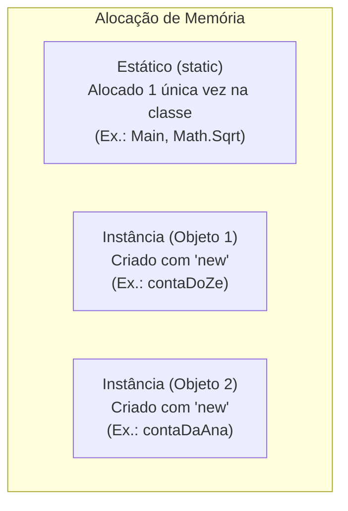

# 06. Modificadores de acesso, escopo e a palavra-chave static

> **Contexto:** Estudo detalhado dos componentes de cabeçalho em C# e Java (`using System`, `class Program`, `void`, `return`, `static void Main`), com foco no papel da palavra-chave `void`, do modificador `static`, da visibilidade (`public` vs `private`) e o uso da Técnica de Feynman.

---

## 1. Desconstrução do cabeçalho clássico em C# (Técnica de Feynman)

Quando abrimos um programa básico em C#, nos deparamos com a seguinte estrutura:

```csharp
using System;

class Program 
{
    static void Main(string[] args) 
    {
        Console.WriteLine("Olá, Mundo!");
    }
}
```

### A intuição por trás de cada palavra (Feynman):

1. **`using System;` (A Caixa de Ferramentas):**
   - **Analogia:** Imagine que você vai fazer um desenho. Antes de começar, você pega a caixa de lápis de cor. O `using System;` diz ao compilador: *"Traga a caixa de ferramentas básica do sistema C# (que inclui o `Console` para ler e escrever na tela)"*.

2. **`class Program` (O Módulo Principal / O Recipiente do Programa):**
   - **Por que `class`?** Em linguagens orientadas a objetos como C# e Java, **nenhum código pode ficar "solto" no ar**. Tudo precisa obrigatoriamente estar dentro de um bloco delimitado por uma `class`.
   - **Por que `Program`?** É simplesmente o **nome dado ao módulo principal** que guarda a execução do seu aplicativo. Você poderia dar qualquer nome (ex.: `class MeuAplicativo`), mas por convenção os modelos padrão criam a classe principal como `Program`.
   - **O que ela faz?** Funciona como a **estrutura da casa**. Ela agrupa todos os métodos e variáveis que farão o aplicativo inicial rodar.

3. **`void` (O Procedimento Sem Retorno de Valor):**
   - **Significado Literal:** A palavra *void* significa literalmente **"vazio"** ou **"nada"**.
   - **O que ela faz?** Ela avisa ao compilador que aquele bloco de código é um **Procedimento** (uma ação pura). Ele vai executar as ordens (imprimir na tela, salvar um arquivo), mas ao terminar **não devolve nenhuma resposta ou valor numérico** para quem o chamou.
   - **Diferença de uma Função com Retorno:** Se o método calculasse um troco, a assinatura seria `int` ou `double` e terminaria com `return valor;`. Sendo `void`, ele apenas faz o trabalho e encerra sem `return`.

4. **`static void Main(string[] args)` (O Botão de Ligar o Motor):**
   - **`Main`:** É o ponto de entrada oficial. Quando o sistema operacional executa seu programa, ele procura exatamente pelo botão chamado `Main`.
   - **`string[] args`:** Uma lista de textos (parâmetros) que o programa pode receber via linha de comando ao ser iniciado.

---

## 2. A palavra-chave `static`: Membro da Classe vs. Membro da Instância

### A intuição (Técnica de Feynman)
Imagine o projeto de um carro (`class Carro`):
* **Comportamento de Instância (Sem `static`):** O método `Acelerar()` ou o atributo `cor` pertencem a um **carro específico** (a um objeto criado na memória com `new Carro()`). O carro do Zé pode acelerar a 100km/h enquanto o seu está parado.
* **Comportamento Estático (`static`):** É algo que pertence ao **projeto da fábrica inteira**, e não a um carro individual. Por exemplo, a variável `totalDeCarrosFabricados` é uma só para toda a fábrica. Você não precisa criar um carro para saber quantos foram fabricados no total.



---

## 3. Quando usar `static` e quando NÃO usar?

### Quando USAR `static`:
1. **Métodos Utilitários / Matemática:** Funções puras de cálculo que não dependem do estado de um objeto específico (ex.: `Math.Sqrt(9)`, `Math.Abs(-5)`).
2. **Ponto de Entrada (`Main`):** O método `Main` precisa ser `static` porque o sistema operacional precisa chamá-lo antes mesmo de qualquer objeto ter sido criado na memória!
3. **Contadores Globais da Classe:** Para contar quantas instâncias foram criadas.

### Quando NÃO USAR `static`:
* Em atributos e métodos que representam a individualidade de um objeto (ex.: `saldo`, `nomeCliente`, `Sacar()`). Se o saldo for `static`, **todas as contas bancárias do sistema compartilharão o mesmo dinheiro!**

---

## 4. Combinações de visibilidade e escopo

Combinamos modificadores de acesso (`public` / `private`) com o comportamento estático (`static`):

```csharp
public class Exemplo 
{
    // 1. Atributo privado de instância (Cada objeto tem o seu saldo protegido)
    private double _saldo;

    // 2. Atributo privado estático (Variável única compartilhada por todas as instâncias)
    private static int _totalDeContasCriadas;

    // 3. Método público de instância (Precisa de um objeto criado para ser chamado)
    public void Depositar(double valor) {
        _saldo += valor;
    }

    // 4. Procedimento público estático (Pode ser chamado diretamente via NomeDaClasse)
    public static void ExibirAjuda() {
        Console.WriteLine("Instruções do sistema...");
    }

    // 5. Procedimento privado estático (Utilitário interno usado apenas dentro da própria classe)
    private static bool ValidarValor(double valor) {
        return valor > 0;
    }
}
```

### Resumo Comparativo:

| Modificador | Onde é visto? (Visibilidade) | Como é chamado? (Acesso) |
| --- | --- | --- |
| `public void Ação()` | Qualquer lugar do projeto | Requer objeto criado: `objeto.Ação()` |
| `private void Ação()` | Apenas dentro da própria classe | Requer objeto criado dentro da classe |
| `public static void Ação()` | Qualquer lugar do projeto | **Sem objeto:** `Classe.Ação()` |
| `private static void Ação()` | Apenas dentro da própria classe | **Sem objeto:** chamado internamente |

---

## 5. Comparativo Multilinguagem (`static`)

### C#
```csharp
public class Calculadora 
{
    // Método estático chamado via Calculadora.Somar(2, 3)
    public static int Somar(int a, int b) => a + b;
}
```

### Java
```java
public class Calculadora {
    // Método estático chamado via Calculadora.somar(2, 3)
    public static int somar(int a, int b) {
        return a + b;
    }
}
```

### Python
```python
class Calculadora:
    @staticmethod
    def somar(a, b):
        return a + b
```

### JavaScript
```javascript
class Calculadora {
    static somar(a, b) {
        return a + b;
    }
}
```

---

## Navegação

* **Tópico anterior:** [[00. Sintaxe Multilinguagem/05. Abstração e encapsulamento com classes (TADs)|05. Abstração e Encapsulamento com Classes (TADs)]]
* **Voltar ao Índice:** [[00. Sintaxe Multilinguagem/00. Guia multilinguagem de sintaxe e praticas - Índice]]
