# 08. Estruturas de dados fundamentais (materialização de modelos mentais em código)

> **Contexto:** Guia prático de sintaxe comparada das principais estruturas de dados e coleções genéricas (Pilha, Fila, Lista, Dicionário e Conjunto) em C#, Java, Python e JavaScript, demonstrando como cada modelo mental de pensamento se materializa em código real.

---

## 1. Do modelo mental ao código (Técnica de Feynman)

Quando programamos, não criamos essas estruturas do zero a cada projeto; nós usamos as **classes e coleções nativas** fornecidas pelas bibliotecas padrão das linguagens (como o namespace `System.Collections.Generic` em C#).

```mermaid
graph TD
    subgraph Par1 ["1. Retrocesso e Desfazer"]
        LIFO["Modelo Mental:<br>LIFO (Último a entrar é o primeiro a sair)"]
        S["Código Nativo:<br>Stack&lt;T&gt;"]
        LIFO --> S
    end

    subgraph Par2 ["2. Ordem de Chegada"]
        FIFO["Modelo Mental:<br>FIFO (Primeiro a entrar é o primeiro a sair)"]
        Q["Código Nativo:<br>Queue&lt;T&gt;"]
        FIFO --> Q
    end

    subgraph Par3 ["3. Sequência Indexada"]
        SEQ["Modelo Mental:<br>Lista Flexível (Acesso por índice)"]
        L["Código Nativo:<br>List&lt;T&gt; / ArrayList"]
        SEQ --> L
    end

    subgraph Par4 ["4. Chave-Valor Instantânea"]
        HASH["Modelo Mental:<br>Busca Direta por Identificador"]
        D["Código Nativo:<br>Dictionary&lt;TKey, TValue&gt; / Map"]
        HASH --> D
    end

    subgraph Par5 ["5. Unicidade de Elementos"]
        UNIQ["Modelo Mental:<br>Conjunto Sem Duplicatas"]
        ST["Código Nativo:<br>HashSet&lt;T&gt; / Set"]
        UNIQ --> ST
    end
```



---

## 2. Pilha (*Stack* - Modelo LIFO / Desfazer)

### C#
```csharp
using System;
using System.Collections.Generic;

Stack<string> historico = new Stack<string>();

// Empilhar (push)
historico.Push("pagina1.html");
historico.Push("pagina2.html");

// Espiar o topo sem remover (peek)
Console.WriteLine(historico.Peek()); // "pagina2.html"

// Desempilhar (pop)
string anterior = historico.Pop(); // Remove e retorna "pagina2.html"
```

### Java
```java
import java.util.ArrayDeque;
import java.util.Deque;

Deque<String> historico = new ArrayDeque<>();
historico.push("pagina1.html");
historico.push("pagina2.html");

String topo = historico.peek();
String anterior = historico.pop();
```

### Python
```python
# Em Python listas nativas funcionam como pilhas eficientes
historico = []

historico.append("pagina1.html") # Push
historico.append("pagina2.html")

topo = historico[-1]             # Peek
anterior = historico.pop()        # Pop
```

### JavaScript
```javascript
const historico = [];
historico.push("pagina1.html");
historico.push("pagina2.html");

const topo = historico[historico.length - 1];
const anterior = historico.pop();
```

---

## 3. Fila (*Queue* - Modelo FIFO / Ordem de Chegada)

### C#
```csharp
using System;
using System.Collections.Generic;

Queue<string> filaDeEspera = new Queue<string>();

// Enfileirar (enqueue)
filaDeEspera.Enqueue("Cliente A");
filaDeEspera.Enqueue("Cliente B");

// Espiar o primeiro da fila (peek)
Console.WriteLine(filaDeEspera.Peek()); // "Cliente A"

// Desenfileirar / Atender (dequeue)
string atendido = filaDeEspera.Dequeue(); // Remove "Cliente A"
```

### Java
```java
import java.util.ArrayDeque;
import java.util.Queue;

Queue<String> fila = new ArrayDeque<>();
fila.offer("Cliente A");
fila.offer("Cliente B");

String primeiro = fila.peek();
String atendido = fila.poll();
```

### Python
```python
from collections import deque

fila = deque()
fila.append("Cliente A")  # Enqueue
fila.append("Cliente B")

primeiro = fila[0]        # Peek
atendido = fila.popleft() # Dequeue
```

### JavaScript
```javascript
const fila = [];
fila.push("Cliente A");   // Enqueue
fila.push("Cliente B");

const primeiro = fila[0]; // Peek
const atendido = fila.shift(); // Dequeue (remove do início)
```

---

## 4. Lista Dinâmica (*List* - Sequência Indexada)

### C#
```csharp
using System;
using System.Collections.Generic;

List<string> compras = new List<string>();
compras.Add("Arroz");
compras.Add("Feijão");
compras.Insert(1, "Azeite"); // Insere na posição 1

Console.WriteLine(compras[0]); // Acesso direto por índice: "Arroz"
compras.Remove("Feijão");
```

### Java
```java
import java.util.ArrayList;
import java.util.List;

List<String> compras = new ArrayList<>();
compras.add("Arroz");
compras.add("Feijão");
compras.add(1, "Azeite");

String item = compras.get(0);
compras.remove("Feijão");
```

### Python
```python
compras = ["Arroz", "Feijão"]
compras.insert(1, "Azeite")

item = compras[0]
compras.remove("Feijão")
```

### JavaScript
```javascript
const compras = ["Arroz", "Feijão"];
compras.splice(1, 0, "Azeite");

const item = compras[0];
const index = compras.indexOf("Feijão");
if (index > -1) compras.splice(index, 1);
```

---

## 5. Tabela Hash / Dicionário (*Dictionary / Map* - Busca por Chave Única)

### C#
```csharp
using System;
using System.Collections.Generic;

Dictionary<string, double> precos = new Dictionary<string, double>();
precos["Livro"] = 59.90;
precos["Caneta"] = 3.50;

if (precos.ContainsKey("Livro")) {
    Console.WriteLine("Preço: {0}", precos["Livro"]);
}
```

### Java
```java
import java.util.HashMap;
import java.util.Map;

Map<String, Double> precos = new HashMap<>();
precos.put("Livro", 59.90);
precos.put("Caneta", 3.50);

if (precos.containsKey("Livro")) {
    System.out.println("Preço: " + precos.get("Livro"));
}
```

### Python
```python
precos = {
    "Livro": 59.90,
    "Caneta": 3.50
}

if "Livro" in precos:
    print("Preço:", precos["Livro"])
```

### JavaScript
```javascript
const precos = new Map();
precos.set("Livro", 59.90);
precos.set("Caneta", 3.50);

if (precos.has("Livro")) {
    console.log("Preço:", precos.get("Livro"));
}
```

---

## 6. Conjunto (*Set* - Unicidade sem Repetição)

### C#
```csharp
using System;
using System.Collections.Generic;

HashSet<int> numerosSorteados = new HashSet<int>();
numerosSorteados.Add(10);
numerosSorteados.Add(25);
numerosSorteados.Add(10); // Ignorado automaticamente! Não aceita duplicata

Console.WriteLine("Total de números únicos: {0}", numerosSorteados.Count); // 2
```

### Java
```java
import java.util.HashSet;
import java.util.Set;

Set<Integer> numeros = new HashSet<>();
numeros.add(10);
numeros.add(25);
numeros.add(10); // Ignorado

System.out.println("Tamanho: " + numeros.size()); // 2
```

### Python
```python
numeros = {10, 25}
numeros.add(10) # Ignorado

print("Tamanho:", len(numeros)) # 2
```

### JavaScript
```javascript
const numeros = new Set();
numeros.add(10);
numeros.add(25);
numeros.add(10); // Ignorado

console.log("Tamanho:", numeros.size); // 2
```

---

## 7. Tabela Comparativa de Métodos e Operações

| Estrutura / TAD | Modelo de Pensamento | C# (`System.Collections.Generic`) | Java (`java.util`) | Python | JavaScript |
| --- | --- | --- | --- | --- | --- |
| **Pilha** | LIFO | `Push()`, `Pop()`, `Peek()` | `push()`, `pop()`, `peek()` | `append()`, `pop()`, `[-1]` | `push()`, `pop()`, `[len-1]` |
| **Fila** | FIFO | `Enqueue()`, `Dequeue()`, `Peek()` | `offer()`, `poll()`, `peek()` | `append()`, `popleft()`, `[0]` | `push()`, `shift()`, `[0]` |
| **Lista** | Sequencial | `Add()`, `Insert()`, `Remove()` | `add()`, `add(idx, v)`, `remove()` | `append()`, `insert()`, `remove()` | `push()`, `splice()` |
| **Dicionário** | Chave-Valor | `[k] = v`, `ContainsKey()` | `put(k, v)`, `containsKey()` | `d[k] = v`, `k in d` | `set(k, v)`, `has(k)` |
| **Conjunto** | Unicidade | `Add()`, `Contains()` | `add()`, `contains()` | `add()`, `in` | `add()`, `has()` |

---

## Navegação

* **Tópico anterior:** [[00. Sintaxe Multilinguagem/07. Getters, setters e propriedades (acesso e modificação de estado)|07. Getters, Setters e Propriedades (Acesso e Modificação de Estado)]]
* **Voltar ao Índice:** [[00. Sintaxe Multilinguagem/00. Guia multilinguagem de sintaxe e praticas - Índice]]
