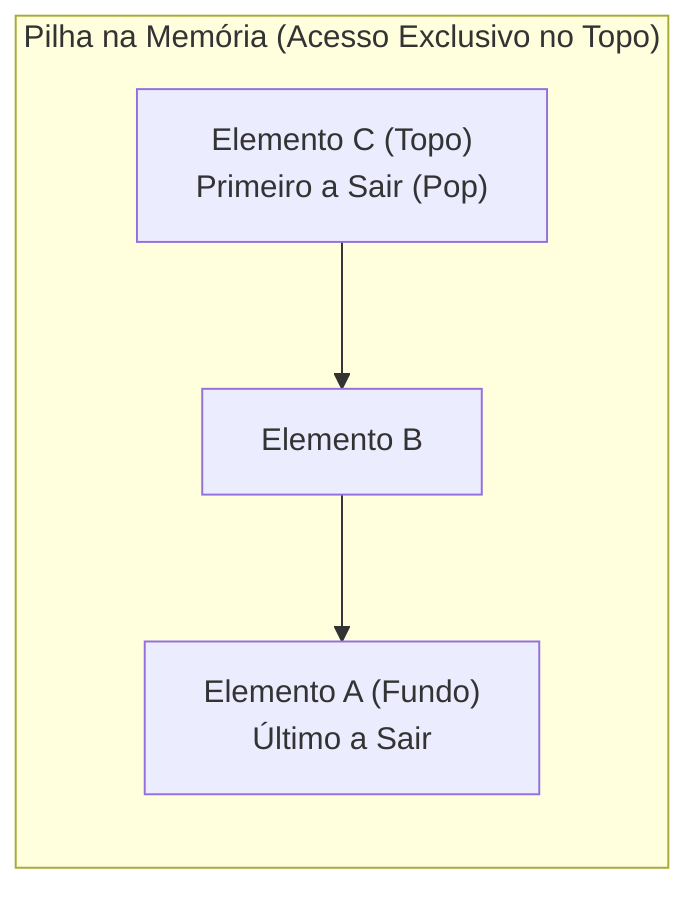
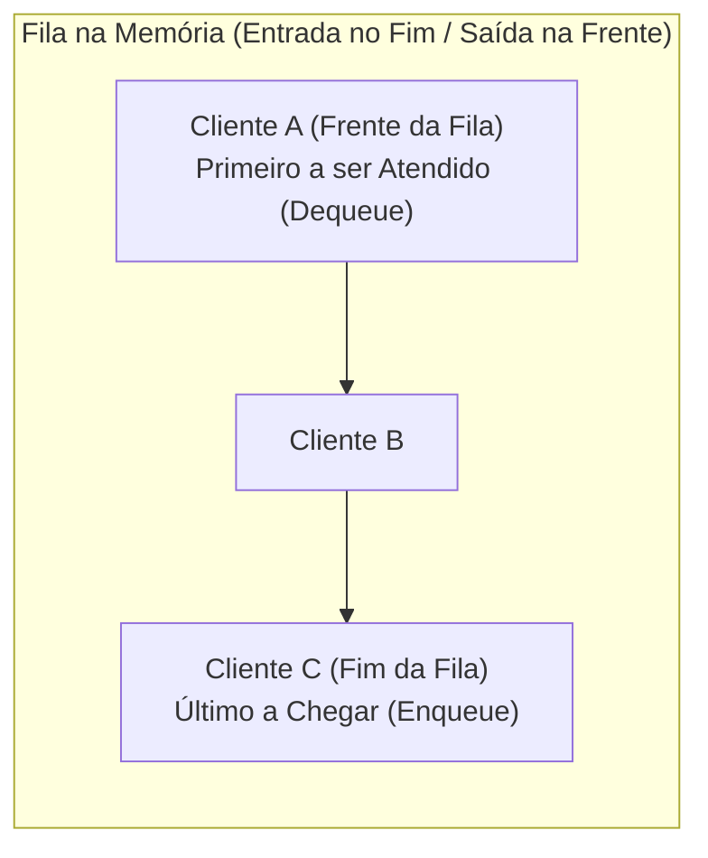
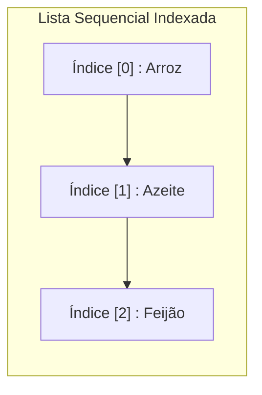
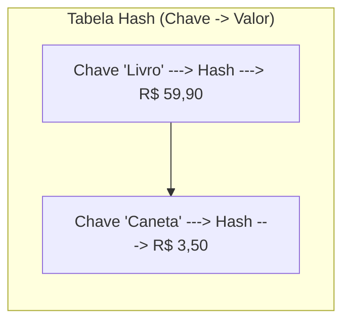
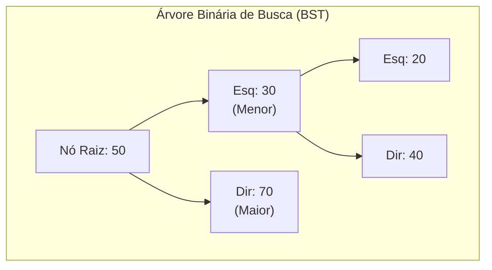
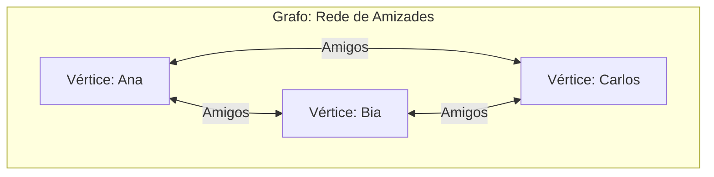
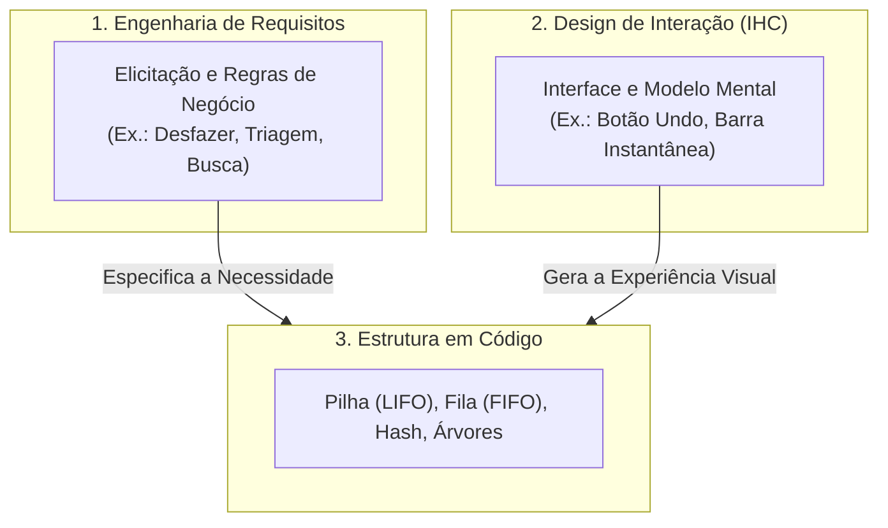
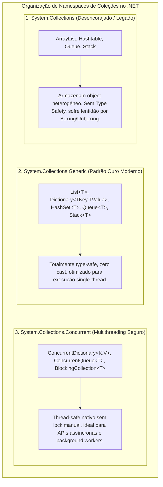

# 08. Estruturas de dados fundamentais (materialização de modelos mentais em código)

> **Contexto:** Guia prático de sintaxe comparada das principais estruturas de dados e coleções genéricas (Lineares, de Associação e Não-Lineares como Árvores, Grafos e Heaps) em C#, Java, Python e JavaScript, demonstrando como cada modelo mental de pensamento se materializa em código real e como se conecta diretamente com a Engenharia de Requisitos e o Design de Interação (IHC).

---

## 1. Do modelo mental ao código (Técnica de Feynman)

Quando programamos, dividimos as estruturas em dois grandes grupos:
1. **Estruturas Prontas (Coleções Nativas):** Pilhas, Filas, Listas, Dicionários e Conjuntos já vêm implementados na biblioteca padrão das linguagens.
2. **Estruturas Personalizadas e Não-Lineares (Árvores e Grafos):** Como seus relacionamentos são mais complexos (ramos e redes), nós as materializamos criando classes de **Nós (*Nodes*) interconectados** ou combinando dicionários com listas.

---

## 2. Pilha (*Stack* - Modelo LIFO / Desfazer)

### Estrutura visual da pilha


### C#
```csharp
using System;
using System.Collections.Generic;

Stack<string> historico = new Stack<string>();

// Empilhar (push)
historico.Push("pagina1.html");
historico.Push("pagina2.html");

// Espiar o topo sem remover (peek)
Console.WriteLine(historico.Peek()); // "pagina2.html"

// Desempilhar (pop)
string anterior = historico.Pop(); // Remove e retorna "pagina2.html"
```

### Java
```java
import java.util.ArrayDeque;
import java.util.Deque;

Deque<String> historico = new ArrayDeque<>();
historico.push("pagina1.html");
historico.push("pagina2.html");

String topo = historico.peek();
String anterior = historico.pop();
```

### Python
```python
# Em Python listas nativas funcionam como pilhas eficientes
historico = []

historico.append("pagina1.html") # Push
historico.append("pagina2.html")

topo = historico[-1]             # Peek
anterior = historico.pop()        # Pop
```

### JavaScript
```javascript
const historico = [];
historico.push("pagina1.html");
historico.push("pagina2.html");

const topo = historico[historico.length - 1];
const anterior = historico.pop();
```

---

## 3. Fila (*Queue* - Modelo FIFO / Ordem de Chegada)

### Estrutura visual da fila


### C#
```csharp
using System;
using System.Collections.Generic;

Queue<string> filaDeEspera = new Queue<string>();

// Enfileirar (enqueue)
filaDeEspera.Enqueue("Cliente A");
filaDeEspera.Enqueue("Cliente B");

// Espiar o primeiro da fila (peek)
Console.WriteLine(filaDeEspera.Peek()); // "Cliente A"

// Desenfileirar / Atender (dequeue)
string atendido = filaDeEspera.Dequeue(); // Remove "Cliente A"
```

### Java
```java
import java.util.ArrayDeque;
import java.util.Queue;

Queue<String> fila = new ArrayDeque<>();
fila.offer("Cliente A");
fila.offer("Cliente B");

String primeiro = fila.peek();
String atendido = fila.poll();
```

### Python
```python
from collections import deque

fila = deque()
fila.append("Cliente A")  # Enqueue
fila.append("Cliente B")

primeiro = fila[0]        # Peek
atendido = fila.popleft() # Dequeue
```

### JavaScript
```javascript
const fila = [];
fila.push("Cliente A");   // Enqueue
fila.push("Cliente B");

const primeiro = fila[0]; // Peek
const atendido = fila.shift(); // Dequeue (remove do início)
```

---

## 4. Lista Dinâmica (*List* - Sequência Indexada)

### Estrutura visual da lista


### C#
```csharp
using System;
using System.Collections.Generic;

List<string> compras = new List<string>();
compras.Add("Arroz");
compras.Add("Feijão");
compras.Insert(1, "Azeite"); // Insere na posição 1

Console.WriteLine(compras[0]); // Acesso direto por índice: "Arroz"
compras.Remove("Feijão");
```

### Java
```java
import java.util.ArrayList;
import java.util.List;

List<String> compras = new ArrayList<>();
compras.add("Arroz");
compras.add("Feijão");
compras.add(1, "Azeite");

String item = compras.get(0);
compras.remove("Feijão");
```

### Python
```python
compras = ["Arroz", "Feijão"]
compras.insert(1, "Azeite")

item = compras[0]
compras.remove("Feijão")
```

### JavaScript
```javascript
const compras = ["Arroz", "Feijão"];
compras.splice(1, 0, "Azeite");

const item = compras[0];
const index = compras.indexOf("Feijão");
if (index > -1) compras.splice(index, 1);
```

---

## 5. Tabela hash e dicionário (*Dictionary / Map* - busca por chave única)

### Estrutura visual da tabela hash


### C#
```csharp
using System;
using System.Collections.Generic;

Dictionary<string, double> precos = new Dictionary<string, double>();
precos["Livro"] = 59.90;
precos["Caneta"] = 3.50;

if (precos.ContainsKey("Livro")) {
    Console.WriteLine("Preço: {0}", precos["Livro"]);
}
```

### Java
```java
import java.util.HashMap;
import java.util.Map;

Map<String, Double> precos = new HashMap<>();
precos.put("Livro", 59.90);
precos.put("Caneta", 3.50);

if (precos.containsKey("Livro")) {
    System.out.println("Preço: " + precos.get("Livro"));
}
```

### Python
```python
precos = {
    "Livro": 59.90,
    "Caneta": 3.50
}

if "Livro" in precos:
    print("Preço:", precos["Livro"])
```

### JavaScript
```javascript
const precos = new Map();
precos.set("Livro", 59.90);
precos.set("Caneta", 3.50);

if (precos.has("Livro")) {
    console.log("Preço:", precos.get("Livro"));
}
```

---

## 6. Conjunto (*Set* - unicidade sem repetição)

### C#
```csharp
using System;
using System.Collections.Generic;

HashSet<int> numerosSorteados = new HashSet<int>();
numerosSorteados.Add(10);
numerosSorteados.Add(25);
numerosSorteados.Add(10); // Ignorado automaticamente! Não aceita duplicata

Console.WriteLine("Total de números únicos: {0}", numerosSorteados.Count); // 2
```

### Java
```java
import java.util.HashSet;
import java.util.Set;

Set<Integer> numeros = new HashSet<>();
numeros.add(10);
numeros.add(25);
numeros.add(10); // Ignorado

System.out.println("Tamanho: " + numeros.size()); // 2
```

### Python
```python
numeros = {10, 25}
numeros.add(10) # Ignorado

print("Tamanho:", len(numeros)) # 2
```

### JavaScript
```javascript
const numeros = new Set();
numeros.add(10);
numeros.add(25);
numeros.add(10); // Ignorado

console.log("Tamanho:", numeros.size); // 2
```

---

## 7. Árvore binária de busca (*Binary Search Tree - BST*)

### Estrutura visual da árvore binária


### A intuição (técnica de Feynman)
Como uma árvore não é uma linha reta, ela é construída criando uma classe de **Nó (*Node*)**, onde cada nó guarda seu valor e possui **dois braços (ponteiros/referências)**: um apontando para o filho da esquerda (valores menores) e outro para o filho da direita (valores maiores).

### C#
```csharp
public class NoArvore 
{
    public int Valor;
    public NoArvore Esquerda;
    public NoArvore Direita;

    public NoArvore(int valor) 
    {
        Valor = valor;
        Esquerda = null;
        Direita = null;
    }
}

// Inserção em árvore binária
public class ArvoreBinaria 
{
    public NoArvore Raiz;

    public void Inserir(int valor) 
    {
        Raiz = InserirRecursivo(Raiz, valor);
    }

    private NoArvore InserirRecursivo(NoArvore atual, int valor) 
    {
        if (atual == null) return new NoArvore(valor);
        if (valor < atual.Valor) atual.Esquerda = InserirRecursivo(atual.Esquerda, valor);
        else if (valor > atual.Valor) atual.Direita = InserirRecursivo(atual.Direita, valor);
        return atual;
    }
}
```

### Python
```python
class NoArvore:
    def __init__(self, valor):
        self.valor = valor
        self.esquerda = None
        self.direita = None

def inserir(raiz, valor):
    if raiz is None:
        return NoArvore(valor)
    if valor < raiz.valor:
        raiz.esquerda = inserir(raiz.esquerda, valor)
    elif valor > raiz.valor:
        raiz.direita = inserir(raiz.direita, valor)
    return raiz
```

---

## 8. Fila de prioridade (*PriorityQueue / Heap*)

### A intuição (técnica de Feynman)
Diferente da fila normal (FIFO) onde quem chega primeiro sai primeiro, a **Fila de prioridade** garante que o elemento com o valor mais urgente sempre é retirado primeiro. No .NET moderno (C# 9+), ela já é uma coleção nativa!

### C#
```csharp
using System;
using System.Collections.Generic;

// Fila de Prioridade: Elemento (string), Prioridade (int - menor número = mais prioritário)
PriorityQueue<string, int> prontoSocorro = new PriorityQueue<string, int>();

prontoSocorro.Enqueue("Paciente com Resfriado", 3);
prontoSocorro.Enqueue("Paciente com Infarto", 1);
prontoSocorro.Enqueue("Paciente com Fratura", 2);

// O paciente mais urgente (prioridade 1) sai primeiro!
string atendido = prontoSocorro.Dequeue(); // "Paciente com Infarto"
Console.WriteLine("Atendido com urgência: {0}", atendido);
```

### Python
```python
import heapq

# Em Python usamos o módulo 'heapq' sobre uma lista comum
pronto_socorro = []

# heapq ordena pelo primeiro elemento da tupla (prioridade)
heapq.heappush(pronto_socorro, (3, "Paciente com Resfriado"))
heapq.heappush(pronto_socorro, (1, "Paciente com Infarto"))
heapq.heappush(pronto_socorro, (2, "Paciente com Fratura"))

prioridade, atendido = heapq.heappop(pronto_socorro) # Sai o de prioridade 1
print("Atendido com urgência:", atendido)
```

---

## 9. Grafo (*Graph* - representação por lista de adjacência)

### Estrutura visual do grafo


### A intuição (técnica de Feynman)
Como um grafo representa redes (redes sociais, conexões de voos ou estradas), a forma mais elegante e comum de materializá-lo em código é usando um **Dicionário onde cada chave é uma cidade/pessoa e o valor é uma Lista de seus vizinhos/amigos**.

### C#
```csharp
using System;
using System.Collections.Generic;

public class Grafo 
{
    // Lista de Adjacência: Vértice -> Lista de Conexões
    private Dictionary<string, List<string>> _adjacencias = new Dictionary<string, List<string>>();

    public void AdicionarVertice(string vertice) 
    {
        if (!_adjacencias.ContainsKey(vertice))
            _adjacencias[vertice] = new List<string>();
    }

    public void AdicionarAresta(string origem, string destino) 
    {
        AdicionarVertice(origem);
        AdicionarVertice(destino);
        _adjacencias[origem].Add(destino); // Conecta origem -> destino
    }

    public void ExibirRotas() 
    {
        foreach (var par in _adjacencias) {
            Console.WriteLine("{0} conecta com: {1}", par.Key, string.Join(", ", par.Value));
        }
    }
}
```

### JavaScript
```javascript
class Grafo {
    constructor() {
        this.adjacencias = new Map();
    }

    adicionarVertice(vertice) {
        if (!this.adjacencias.has(vertice)) {
            this.adjacencias.set(vertice, []);
        }
    }

    adicionarAresta(origem, destino) {
        this.adicionarVertice(origem);
        this.adicionarVertice(destino);
        this.adjacencias.get(origem).push(destino);
    }
}
```

---

## 10. Tabela comparativa geral de materialização

| Estrutura / TAD | Modelo de Pensamento | Como se Materializa em Código? | Exemplo C# | Exemplo Python |
| --- | --- | --- | --- | --- |
| **Pilha** | LIFO | Classe nativa | `Stack<T>` | `list.append() / pop()` |
| **Fila** | FIFO | Classe nativa | `Queue<T>` | `collections.deque` |
| **Lista** | Sequencial | Coleção dinâmica | `List<T>` | `list` nativa |
| **Dicionário** | Chave-Valor | Tabela Hash | `Dictionary<TKey, TValue>` | `dict` `{ }` |
| **Conjunto** | Unicidade | Tabela Hash sem duplicação | `HashSet<T>` | `set` `{ }` |
| **Árvore** | Hierárquica / Ramos | Classe `Node` com ponteiros `Esq`/`Dir` | `class NoArvore { No Esquerda; ... }` | `class No: left, right` |
| **Heap** | Prioridade / Urgência | Árvore binária completa em Array | `PriorityQueue<TItem, TPriority>` | `heapq.heappush()` |
| **Grafo** | Rede / Conexões | Dicionário de Listas (Lista de Adjacência) | `Dictionary<string, List<string>>` | `dict[node] = [vizinhos]` |

---

## 11. Conexões com engenharia de requisitos e design de interação

Estruturas de dados não vivem isoladas: elas são o elo formal que traduz as **necessidades do negócio** em **comportamentos visíveis e intuitivos na interface**.



### 1. Pilha (*Stack* / LIFO)
* **Design de interação:** Fundamenta a **Heurística de Nielsen nº 3 (Controle e Liberdade do Usuário)** para as ações de **Desfazer (*Undo / Ctrl+Z*)**, histórico de navegação e fechamento de telas modais sobrepostas → [[08. Design de Interacao/18. Princípios e regras de design - psicologia da gestalt e regras de ouro|Regras de Design em IHC]].
* **Engenharia de requisitos:** Especifica **Requisitos Funcionais (RF)** de versionamento e recuperação de estado do usuário → [[07. Engenharia de Requisitos/04. Requisitos funcionais e não-funcionais|Requisitos Funcionais e Não-Funcionais]].

### 2. Fila (*Queue* / FIFO) e fila de prioridade (*PriorityQueue*)
* **Design de interação:** Reduz a ansiedade do usuário com feedback de progresso e previsibilidade (*"Seu pedido é o 3º da fila"*).
* **Engenharia de requisitos:** Materializa **Regras de Negócio (RN)** de triagem de urgência (pronto-socorro, chamados VIP) e **Requisitos Não-Funcionais (RNF)** de tempo de resposta assíncrono.

### 3. Tabela hash e dicionário (*Dictionary / Map*)
* **Design de interação:** Proporciona busca e autocompletar instantâneos em tempo real ($O(1)$) sem travamentos na interface.
* **Engenharia de requisitos:** Modela entidades com identificadores únicos (CPF, SKU de produtos, UUIDs) identificados na modelagem de domínio → [[07. Engenharia de Requisitos/09. Modelagem estrutural com diagrama de classes da uml|Modelagem com Diagrama de Classes UML]].

### 4. Árvores e grafos (*Trees & Graphs*)
* **Design de interação:** Árvores estruturam a **Arquitetura de Informação** de menus e migalhas de pão (*breadcrumbs*). Grafos modelam redes sociais e fluxos de recomendação (*"Pessoas que você talvez conheça"*).
* **Engenharia de requisitos:** Modela matrizes de rastreabilidade de requisitos (análise de impacto de mudanças) e hierarquias de casos de uso → [[07. Engenharia de Requisitos/08. Modelagem de requisitos com casos de uso e especificações textuais|Modelagem de Casos de Uso]].

---

## 9. Arquitetura de coleções no .NET: `System.Collections` vs. `Generic` vs. `Concurrent`

No ecossistema C# / .NET, as coleções são distribuídas em três namespaces fundamentais:



### Por que não se usa mais o `System.Collections` legado?
1. **Falta de segurança de tipos:** Erros de conversão não são detectados na compilação e causam falhas graves em tempo de execução (`InvalidCastException`).
2. **Perda de performance:** Tipos primitivos sofrem *Boxing* contínuo no *Heap*, sobrecarregando o *Garbage Collector*.
3. **Código prolixo:** Requer *casts* manuais em toda leitura de dados.

> [!NOTE]
> Para o estudo formal da análise de complexidade assintótica (Big-O) e o catálogo completo de decisões de coleções, consulte o **[[01. Programacao Modular/21. Coleções genéricas em C# (estruturas de dados, propósitos e performance assintótica)|Artigo 21 (Coleções genéricas em C#)]]**.

---

## Navegação

* **Tópico anterior:** [[00. Sintaxe Multilinguagem/07. Getters, setters e propriedades (acesso e modificação de estado)|07. Getters, Setters e Propriedades (Acesso e Modificação de Estado)]]
* **Próximo tópico:** [[00. Sintaxe Multilinguagem/09. Tratamento de exceções e erros (try, catch, finally, throw)|09. Tratamento de Exceções e Erros]]
* **Voltar ao índice geral:** [[00. Sintaxe Multilinguagem/00. Guia multilinguagem de sintaxe e praticas - Índice]]
* **Ver Artigo Teórico de Coleções (C#):** [[01. Programacao Modular/21. Coleções genéricas em C# (estruturas de dados, propósitos e performance assintótica)]]
* **Ver conexão em engenharia de requisitos:** [[07. Engenharia de Requisitos/04. Requisitos funcionais e não-funcionais]]
* **Ver conexão em design de interação:** [[08. Design de Interacao/07. Atributos de qualidade em sistemas interativos - usabilidade, comunicabilidade, acessibilidade e experiência de uso]]
