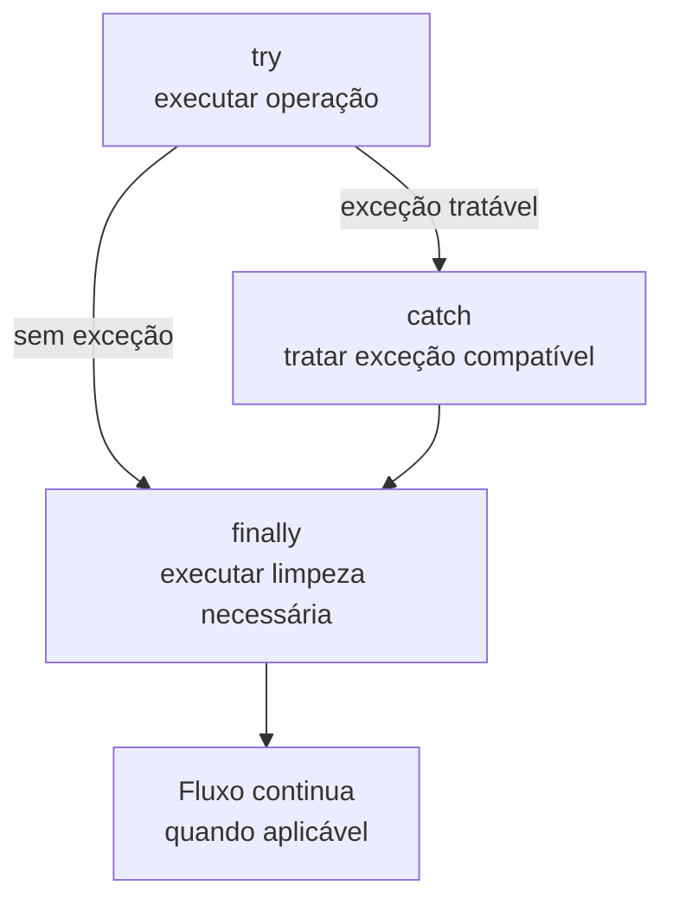

# Tratamento de exceções e erros (try, catch, finally, throw)

> **Contexto:** Guia prático de sintaxe comparada para tratamento defensivo de erros e exceções em C#, Java, Python e JavaScript, analisando a anatomia dos blocos `try`, `catch` / `except`, `finally`, lançamento de erros (`throw` / `raise`) e o impacto direto na **Robustez** e **Degradação Graciosa** do software através da Técnica de Feynman.

---

## Exceções separam o fluxo normal do tratamento de falhas

Imagine uma apresentação de **acrobacia em um circo**:



Na Ciência da Computação:
* **`try` (tente executar):** O bloco de código que contém operações arriscadas sujeitas a falhas externas que fogem do controle do algoritmo (ex.: abrir um arquivo do disco que pode ter sido deletado, conectar a um banco de dados com rede instável ou dividir por zero).
* **`catch` / `except` (capture e trate):** O bloco de contingência que é acionado **apenas se uma exceção ocorrer** dentro do `try`. Ele impede que o programa quebre de forma catastrófica (*crash*), registra logs e permite executar uma **degradação graciosa**.
* **`finally` (sempre execute):** O bloco de limpeza garantida que **sempre roda**, quer tenha ocorrido erro ou sucesso. É usado obrigatoriamente para liberar recursos escassos do sistema operacional (fechar conexões com banco de dados, fechar arquivos abertos e liberar portas de rede).
* **`throw` / `raise` (dispare o alerta):** A instrução que você usa no seu próprio código quando detecta que uma regra de negócio ou estado inválido foi violado e precisa interromper a execução normal.

---

## Comparação entre linguagens

### C#
```csharp
using System;
using System.IO;

try 
{
    // Operação arriscada: ler arquivo
    string conteudo = File.ReadAllText("relatorio.txt");
    Console.WriteLine(conteudo);
}
catch (FileNotFoundException ex) 
{
    // Trata erro específico de arquivo não encontrado
    Console.WriteLine("Aviso: O arquivo não existe. Criando arquivo padrão...");
}
catch (Exception ex) 
{
    // Trata qualquer outro erro inesperado
    Console.WriteLine("Erro genérico: {0}", ex.Message);
}
finally 
{
    // Executa SEMPRE (limpeza de recursos)
    Console.WriteLine("Operação finalizada com segurança.");
}

// Lançando uma exceção manualmente (throw)
void Sacar(double valor, double saldo) 
{
    if (valor > saldo) 
    {
        throw new InvalidOperationException("Saldo insuficiente para o saque.");
    }
}
```

---

### Java
> **Particularidade do Java (Checked Exceptions):** Java é a única linguagem moderna que diferencia formalmente exceções checadas em tempo de compilação (*Checked Exceptions*, que obrigam a usar `try-catch` ou declarar `throws` na assinatura do método) de exceções em tempo de execução (*Unchecked / RuntimeException*).

```java
import java.io.BufferedReader;
import java.io.FileReader;
import java.io.IOException;

public class ExemploTratamento {
    public static void main(String[] args) {
        BufferedReader leitor = null;
        try {
            leitor = new BufferedReader(new FileReader("relatorio.txt"));
            System.out.println(leitor.readLine());
        } catch (IOException ex) {
            System.out.println("Erro de entrada/saída: " + ex.getMessage());
        } finally {
            try {
                if (leitor != null) leitor.close();
            } catch (IOException e) {
                // Silêncio no fechamento
            }
            System.out.println("Recursos liberados.");
        }
    }

    // Disparando erro no Java
    public static void validarIdade(int idade) {
        if (idade < 18) {
            throw new IllegalArgumentException("Apenas maiores de 18 anos permitidos.");
        }
    }
}
```

---

### Python
> **Particularidade do Python:** Usa as palavras-chave `except` em vez de `catch`, e possui a cláusula opcional `else` (que roda apenas se **nenhum** erro ocorreu). Lança erros com a instrução `raise`.

```python
try:
    with open("relatorio.txt", "r") as arquivo:
        conteudo = arquivo.read()
        print(conteudo)
except FileNotFoundError as ex:
    print(f"Aviso: Arquivo não encontrado ({ex}). Usando dados padrão.")
except Exception as ex:
    print(f"Erro inesperado: {ex}")
else:
    print("Sucesso absoluto: arquivo lido sem nenhuma falha.")
finally:
    print("Bloco de limpeza concluído.")

# Disparando erro manualmente em Python (raise)
def transferir(valor, saldo):
    if valor > saldo:
        raise ValueError("Saldo insuficiente para realizar a transferência.")
```

---

### JavaScript / TypeScript
```javascript
try {
    const dados = JSON.parse('{"nome": "Ana"}'); // Pode falhar se o JSON estiver quebrado
    console.log("Usuário logado:", dados.nome);
} catch (erro) {
    console.error("Falha ao processar JSON:", erro.message);
} finally {
    console.log("Encerrando ciclo de requisição.");
}

// Disparando erro no JavaScript (throw new Error)
function dividir(a, b) {
    if (b === 0) {
        throw new Error("Divisão por zero não permitida.");
    }
    return a / b;
}
```

---

## Comparação entre palavras-chave de exceção

| Conceito | C# | Java | Python | JavaScript |
| :--- | :--- | :--- | :--- | :--- |
| **Bloco de Teste** | `try { }` | `try { }` | `try:` | `try { }` |
| **Bloco de Captura** | `catch (Exception ex) { }` | `catch (Exception ex) { }` | `except Exception as ex:` | `catch (erro) { }` |
| **Bloco de Limpeza** | `finally { }` | `finally { }` | `finally:` | `finally { }` |
| **Disparo Manual** | `throw new Exception();` | `throw new Exception();` | `raise Exception()` | `throw new Error();` |
| **Bloco de Sucesso** | *Não possui* | *Não possui* | `else:` | *Não possui* |

---

## Boas práticas e armadilhas no tratamento de exceções

1. **Evitar o "Catch Vazio / Silencioso" (*Swallowing Exceptions*):**
   - **Má prática:** `catch (Exception ex) { }` (capturar o erro e não fazer nada). Isso esconde bugs críticos e faz o programa falhar misteriosamente sem deixar rastros.
   - **Boa prática:** Sempre registre o erro em um sistema de log ou trate com uma mensagem adequada.

2. **Não use Exceções para Controle de Fluxo Normal:**
   - Exceções são computacionalmente caras (elas capturam toda a pilha de chamadas /*stack trace*/ da memória).
   - Use validações simples com `if / else` para situações comuns previsíveis (ex.: verificar se uma string é nula antes de usá-la) e reserve o `try-catch` para falhas imprevisíveis e recursos externos.

3. **Capture Sempre a Exceção Mais Específica Primeiro:**
   - Coloque `FileNotFoundException` ou `InvalidOperationException` antes de um `catch (Exception)` genérico para poder tratar cada tipo de problema com a estratégia correta.

---

## Conexão com a modelagem de software: o tratamento de exceções como o `«extend»` da UML

O mecanismo de tratamento de exceções em linguagens de programação é a **implementação técnica direta do relacionamento de extensão (`«extend»`)** estudado na modelagem de sistemas:

* **Na Engenharia de Requisitos ([[07. Engenharia de Requisitos/08. Modelagem de requisitos com casos de uso e especificações textuais.md#Relacionamento de extensão («extend»)|Casos de Uso da UML]]):** O relacionamento `«extend»` modela fluxos excepcionais ou desvios condicionais que só são executados sob circunstâncias específicas. O caso de uso `Notificar Saldo Insuficiente` estende `Realizar Saque` apenas quando o limite da conta é violado.
* **No Código (`try-catch-throw`):** O método de negócio roda no bloco `try`. Ao constatar a violação (`if (valor > saldo)`), o código dispara uma exceção (`throw new InvalidOperationException()`), transferindo o controle imediatamente para o bloco `catch`.
* **Desacoplamento e Autonomia:** Na UML, o caso de uso base não conhece o caso de extensão. No código, a função de negócio não precisa saber quem vai capturar o erro; ela apenas lança a exceção e delega o tratamento para a camada superior da arquitetura.

---

## Estouro de inteiros no contrato de estoque

No [[01. Programacao Modular/13. Métodos de acesso e propriedades (publicação de contratos e garantia de invariantes)|artigo de propriedades]], `QuantidadeEmEstoque = checked(QuantidadeEmEstoque + quantidade);` primeiro calcula a soma em contexto verificado. Se ela exceder o intervalo de `int`, lança `OverflowException` antes de executar a atribuição. É como conferir se o total cabe no contador antes de substituir sua leitura.

| Linguagem | Como tratar a soma fora do intervalo |
| :--- | :--- |
| C# | `checked(a + b)` verifica a operação inteira abrangida. |
| Java | `Math.addExact(a, b)` lança `ArithmeticException` em caso de estouro. |
| Python | `int` cresce conforme necessário; limites de domínio ou persistência exigem validação explícita. |
| JavaScript | `Number` perde precisão fora do intervalo de inteiros seguros; valide com `Number.isSafeInteger` ou use `BigInt` conforme o contrato. |

## Artigos relacionados

* **Tópico anterior:** [[00. Sintaxe Multilinguagem/08. Estruturas de dados fundamentais (materialização de modelos mentais em código)|08. Estruturas de Dados Fundamentais]]
* **Voltar ao índice geral:** [[00. Sintaxe Multilinguagem/00. Guia multilinguagem de sintaxe e praticas - Índice]]
* **Ver fatores de qualidade (robustez):** [[01. Programacao Modular/05. Fatores externos de qualidade de software]]
* **Ver modelagem de requisitos (casos de uso):** [[07. Engenharia de Requisitos/08. Modelagem de requisitos com casos de uso e especificações textuais.md]]
