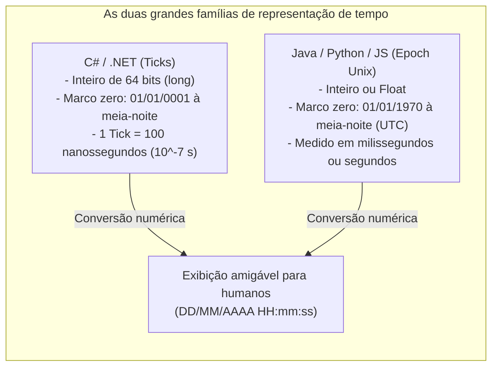

# 10. Manipulação e representação de datas e horários (DateTime, fusos e formatos)

> **Contexto:** Estudo da representação computacional de tempo, datas e intervalos cronológicos. Como os computadores guardam tempo sob a forma de inteiros puros (*Ticks* no .NET vs. *Epoch Unix* em outras linguagens), a anatomia do `DateTime` em C#, a API moderna de datas no Java 8+, o módulo `datetime` em Python e o objeto `Date` em JavaScript, explicados passo a passo pela Técnica de Feynman.

---

## 1. Como computadores guardam datas e tempo? (A intuição de Feynman)

Humanos pensam em datas divididas em dias, meses, anos, horas, minutos e segundos (`23/08/2026 11:30:00`). Para o processador e a memória RAM, armazenar texto ou múltiplos números soltos seria extremamente lento para cálculos de diferença e ordenação.

* **A solução computacional:** Todo sistema de data guarda o tempo como **um único número inteiro gigante (um contador contínuo)** que representa a quantidade de pulsos/unidades decorridas desde uma data de referência inicial (*marco zero / época*).
* **Analogia de Feynman (O odômetro do carro):**
  - O relógio do computador é como o **odômetro de um carro** que começou a rodar a 0 km no dia da inauguração da fábrica.
  - Se você sabe quantos metros o carro rodou desde o marco zero, você consegue calcular com exatidão matemática a cidade onde ele está hoje sem depender de calendários de papel.



---

## 2. A anatomia do `DateTime` em C#

No .NET (C#), o `DateTime` é uma `struct` (tipo de valor alocado na *Stack*) que encapsula internamente um único inteiro de 64 bits (`ulong` de 8 bytes):

1. **Os 62 bits inferiores (Ticks):** Armazenam o número de intervalos de **100 nanossegundos** decorridos desde `01/01/0001 00:00:00` (ano 1 da Era Cristã).
   - $1 \text{ segundo} = 10.000.000 \text{ Ticks}$.
2. **Os 2 bits superiores (Kind):** Indicam o tipo de fuso horário associado:
   - `DateTimeKind.Utc` (Horário Universal Coordenado de Greenwich).
   - `DateTimeKind.Local` (Fuso horário do computador local do usuário).
   - `DateTimeKind.Unspecified` (Data solta sem informação de fuso).

---

## 3. Comparativo multilinguagem de datas

Abaixo está como instanciar, formatar e manipular tempo nas quatro principais linguagens:

### a. C# (.NET)
```csharp
using System;
using System.Globalization;

// 1. Criar data atual e data específica
DateTime agora = DateTime.Now;
DateTime dataNascimento = new DateTime(1995, 5, 20, 14, 30, 0);

// 2. Operações e cálculos de diferença (TimeSpan)
DateTime futuro = agora.AddDays(15);
TimeSpan diferenca = futuro - agora;
Console.WriteLine($"Dias de diferença: {diferenca.TotalDays}");

// 3. Formatação amigável (Interpolação / Custom Format)
string formatada = agora.ToString("dd/MM/yyyy HH:mm:ss", CultureInfo.InvariantCulture);
Console.WriteLine($"Ticks brutos em C#: {agora.Ticks}");
```

---

### b. Java (API moderna `java.time` - Java 8+)
```java
import java.time.LocalDateTime;
import java.time.LocalDate;
import java.time.format.DateTimeFormatter;
import java.time.temporal.ChronoUnit;

// 1. Criar data atual e data específica
LocalDateTime agora = LocalDateTime.now();
LocalDate nascimento = LocalDate.of(1995, 5, 20);

// 2. Operações de tempo
LocalDateTime futuro = agora.plusDays(15);
long dias = ChronoUnit.DAYS.between(agora, futuro);

// 3. Formatação
DateTimeFormatter formato = DateTimeFormatter.ofPattern("dd/MM/yyyy HH:mm:ss");
System.out.println(agora.format(formato));
```

---

### c. Python (`datetime`)
```python
from datetime import datetime, timedelta

# 1. Criar data atual e data específica
agora = datetime.now()
data_nascimento = datetime(1995, 5, 20, 14, 30, 0)

# 2. Operações com timedelta
futuro = agora + timedelta(days=15)
diferenca = futuro - agora
print(f"Dias de diferença: {diferenca.days}")

# 3. Formatação (strftime) e Timestamp Unix
print(agora.strftime("%d/%m/%Y %H:%M:%S"))
print(f"Timestamp Unix (segundos): {agora.timestamp()}")
```

---

### d. JavaScript (Objeto `Date` e `Intl`)
```javascript
// 1. Criar data atual e data específica (Atenção: mês 0-indexado no construtor legado!)
const agora = new Date();
const dataNascimento = new Date(1995, 4, 20, 14, 30, 0); // Mês 4 = Maio!

// 2. Cálculos de tempo (Diferença em milissegundos desde Epoch Unix 1970)
const futuro = new Date(agora.getTime() + 15 * 24 * 60 * 60 * 1000);
const diferencaDias = (futuro - agora) / (1000 * 60 * 60 * 24);

// 3. Formatação moderna com Intl
const formatador = new Intl.DateTimeFormat('pt-BR', { dateStyle: 'short', timeStyle: 'medium' });
console.log(formatador.format(agora));
console.log(`Epoch Unix (milissegundos): ${agora.getTime()}`);
```

---

## 4. Tabela de correspondência conceitual

| Linguagem | Tipo / módulo principal | Marco zero (*epoch*) | Unidade interna do contador | Imutabilidade |
| :--- | :--- | :--- | :--- | :--- |
| **C#** | `DateTime` / `DateTimeOffset` | `01/01/0001 00:00:00` | **100 nanossegundos** (*ticks*) | Imutável (`struct`) |
| **Java** | `LocalDateTime` / `Instant` | `01/01/1970 00:00:00 (UTC)` | **Nanossegundos** sobre segundos | Imutável (`java.time`) |
| **Python** | `datetime.datetime` | `01/01/1970 00:00:00 (UTC)` | **Microssegundos** | Imutável |
| **JavaScript** | `Date` (legado) / `Temporal` | `01/01/1970 00:00:00 (UTC)` | **Milissegundos** | Mutável (`Date`) |

---

## 5. Armadilhas críticas no trabalho com datas

1. **A pegadinha do mês zero em JavaScript:**
   - No construtor tradicional do JS `new Date(2026, 0, 1)`, o mês `0` é **Janeiro** e `11` é **Dezembro**. Passar `8` cria uma data em Setembro, e não Agosto!
2. **Ignorar o fuso horário (UTC vs. horário local):**
   - Sempre armazene datas no banco de dados e APIs em **UTC** (`DateTime.UtcNow` no C# ou `Instant` no Java) e converta para o fuso local do usuário apenas na interface visual.
3. **Imutabilidade em C# e Java:**
   - Métodos como `agora.AddDays(5)` **não alteram** o objeto original; eles retornam uma **nova instância com a data calculada**. Se você não atribuir a uma variável (`agora = agora.AddDays(5);`), o cálculo é perdido!

---

## Referências bibliográficas

* MICROSOFT. **Estrutura DateTime (System) no .NET**. Microsoft Learn, 2023. Disponível em: [https://learn.microsoft.com/pt-br/dotnet/api/system.datetime](https://learn.microsoft.com/pt-br/dotnet/api/system.datetime).
* ORACLE. **Trail: Date Time - The Java Tutorials**. Oracle Java Documentation, 2023. Disponível em: [https://docs.oracle.com/javase/tutorial/datetime/](https://docs.oracle.com/javase/tutorial/datetime/).
* PYTHON SOFTWARE FOUNDATION. **datetime — Basic date and time types**. Python 3.12 Documentation, 2023. Disponível em: [https://docs.python.org/3/library/datetime.html](https://docs.python.org/3/library/datetime.html).

---

## Navegação

* **Artigo anterior:** [[00. Sintaxe Multilinguagem/09. Tratamento de exceções e erros (try, catch, finally, throw)]]
* **Voltar ao índice geral:** [[00. Sintaxe Multilinguagem/00. Guia multilinguagem de sintaxe e praticas - Índice]]
