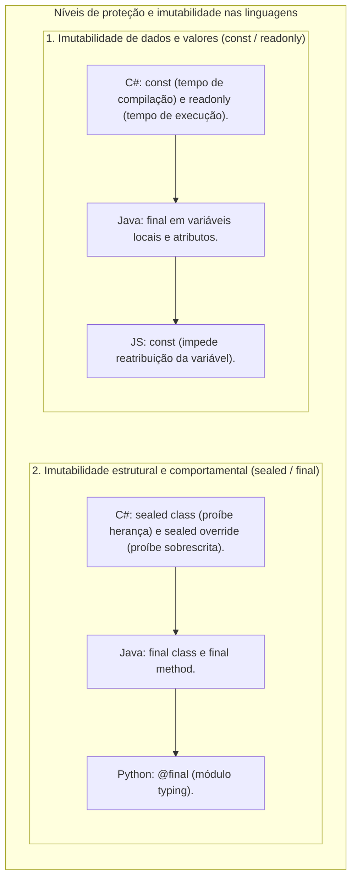

# 11. Herança, superclasses e subclasses (sintaxe comparada e extensibilidade)

> **Contexto:** Guia prático de sintaxe e nomenclatura em torno do mecanismo de **Herança** nas quatro principais linguagens do mercado (C#, Java, Python e JavaScript/TypeScript). Analisamos o vocabulário técnico de hierarquias, os operadores de extensão, a invocação de construtores ancestrais e o comportamento de substituição de subtipos.

---

## 1. Glossário de terminologias equivalentes em hierarquias de classes

Na literatura técnica e na documentação oficial das diferentes linguagens, você encontrará diversos pares de nomes para designar o mesmo conceito de herança:

| Nível na hierarquia | Termos comuns na literatura e no mercado | O que representa? | Analogia de Feynman |
| :--- | :--- | :--- | :--- |
| **Nível Superior (Ancestral / Genérico)** | **Superclasse**, **Classe Pai**, **Classe Base**, **Classe Mãe**, **Tipo Generalizado** | A classe que contém os atributos e métodos genéricos compartilhados por toda a família. | A **categoria Mamífero** (esqueleto e respiração pulmonar). |
| **Nível Inferior (Descendente / Específico)** | **Subclasse**, **Classe Filha**, **Classe Derivada**, **Tipo Especializado** | A classe que herda a base e adiciona novas propriedades ou comportamentos especializados. | O **Cachorro** ou a **Baleia** (habilidades especializadas). |

---

## 2. A intuição de herança e construtores ancestrais (técnica de Feynman)

Imagine uma **fábrica de veículos**:

* **A superclasse / classe pai (`Veiculo`):** Define que todo veículo precisa de `Placa`, `Ano` e `Motor`.
* **A subclasse / classe filha (`Caminhao`):** O caminhão é um veículo, mas adiciona a capacidade de carga em toneladas (`CapacidadeCargaToneladas`).
* **A regra do construtor ancestral (`base` / `super`):** Para montar a caçamba do caminhão (a classe filha), a fábrica precisa primeiro montar o chassi e o motor básicos (a classe pai). Toda linguagem possui uma palavra-chave para repassar os dados ao construtor do pai (`base(...)` em C#, `super(...)` em Java, Python e JS).

---

## 3. Matriz comparativa de sintaxe multilinguagem

| Recurso | C# | Java | Python | JavaScript / TypeScript |
| :--- | :--- | :--- | :--- | :--- |
| **Declaração de Herança** | `class Filha : Pai` | `class Filha extends Pai` | `class Filha(Pai):` | `class Filha extends Pai` |
| **Chamar Construtor Pai** | `: base(args)` | `super(args);` | `super().__init__(args)` | `super(args);` |
| **Chamar Método do Pai** | `base.Metodo()` | `super.metodo();` | `super().metodo()` | `super.metodo()` |
| **Permissão de Sobrescrita** | Exige `virtual` no pai e `override` no filho | Automático (recomenda `@Override`) | Automático (sobrescreve direto) | Automático (sobrescreve direto) |

---

## 4. Código comparativo nas 4 linguagens

### C#
```csharp
// SUPERCLASSE (Classe Pai / Base)
public class Funcionario 
{
    public string Nome { get; init; }
    public decimal SalarioBase { get; protected set; }

    public Funcionario(string nome, decimal salarioBase) 
    {
        Nome = nome;
        SalarioBase = salarioBase;
    }

    public virtual decimal CalcularSalarioTotal() => SalarioBase;
}

// SUBCLASSE (Classe Filha / Derivada)
public class Gerente : Funcionario 
{
    public decimal BonusGestao { get; init; }

    // Repassa parâmetros ao construtor pai via : base(...)
    public Gerente(string nome, decimal salarioBase, decimal bonusGestao)
        : base(nome, salarioBase) 
    {
        BonusGestao = bonusGestao;
    }

    public override decimal CalcularSalarioTotal() => SalarioBase + BonusGestao;
}
```

---

### Java
```java
// SUPERCLASSE (Superclass / Parent Class)
public class Funcionario {
    private String nome;
    protected double salarioBase;

    public Funcionario(String nome, double salarioBase) {
        this.nome = nome;
        this.salarioBase = salarioBase;
    }

    public double calcularSalarioTotal() {
        return this.salarioBase;
    }
}

// SUBCLASSE (Subclass / Child Class)
public class Gerente extends Funcionario {
    private double bonusGestao;

    public Gerente(String nome, double salarioBase, double bonusGestao) {
        super(nome, salarioBase); // Invoca construtor pai
        this.bonusGestao = bonusGestao;
    }

    @Override
    public double calcularSalarioTotal() {
        return this.salarioBase + this.bonusGestao;
    }
}
```

---

### Python
```python
# SUPERCLASSE (Classe Pai / Base Class)
class Funcionario:
    def __init__(self, nome: str, salario_base: float):
        self.nome = nome
        self._salario_base = salario_base

    def calcular_salario_total(self) -> float:
        return self._salario_base

# SUBCLASSE (Classe Filha / Derived Class)
class Gerente(Funcionario):
    def __init__(self, nome: str, salario_base: float, bonus_gestao: float):
        super().__init__(nome, salario_base) # Invoca construtor pai
        self.bonus_gestao = bonus_gestao

    def calcular_salario_total(self) -> float:
        return self._salario_base + self.bonus_gestao
```

---

### JavaScript (ES6+ / TypeScript)
```javascript
// SUPERCLASSE
class Funcionario {
    constructor(nome, salarioBase) {
        this.nome = nome;
        this.salarioBase = salarioBase;
    }

    calcularSalarioTotal() {
        return this.salarioBase;
    }
}

// SUBCLASSE
class Gerente extends Funcionario {
    constructor(nome, salarioBase, bonusGestao) {
        super(nome, salarioBase); // Chamada obrigatória antes de usar 'this'
        this.bonusGestao = bonusGestao;
    }

    calcularSalarioTotal() {
        return this.salarioBase + this.bonusGestao;
    }
}
```

---

## 5. Fechamento de herança e a filosofia da imutabilidade (`sealed`, `final`, `const`, `readonly`)

Na engenharia de software e na sintaxe das linguagens, o modificador **`sealed`** faz parte de uma família mais ampla de mecanismos de **fechamento e garantia de imutabilidade**:



### Paralelo sintático: Imutabilidade de dados vs. imutabilidade de hierarquia

* **Para variáveis e valores (`const` / `readonly` / `final`):**
  - Impede que o **conteúdo de uma variável ou campo** seja alterado após sua inicialização (veja [[00. Sintaxe Multilinguagem/01. Variáveis, tipos e atribuição#3. Constantes e imutabilidade (const, final, readonly)|Guia de Sintaxe 01 (Constantes)]]).
* **Para métodos e comportamentos (`sealed override` / `final`):**
  - Impede que a **lógica de execução de uma função** seja adulterada por subclasses em tempo de execução.
* **Para classes inteiras (`sealed class` / `final class`):**
  - Impede que a **árvore genealógica** seja expandida, fechando o tipo contra derivação.

### Comparativo multilinguagem completo:

| Recurso | C# (.NET) | Java | Python | JavaScript / TypeScript |
| :--- | :--- | :--- | :--- | :--- |
| **Constante em tempo de compilação** | `const double Pi = 3.14;` | *(Não possui nativo; usa `static final`)* | Convenção `PI = 3.14` | `const PI = 3.14;` |
| **Valor imutável em tempo de execução** | `readonly int Id;` | `final int id;` | Não possui nativo | `readonly id: number;` *(TS)* |
| **Proibir herança de classe** | `public sealed class A` | `public final class A` | `@final class A:` *(typing)* | `// @sealed` *(TS)* ou `Object.freeze` |
| **Proibir sobrescrita de método** | `public sealed override void M()` | `public final void m()` | `@final def m(self):` | `readonly` em propriedades |
| **Garantia no compilador** | Erros CS0509 e CS0239 | Erros `cannot inherit from final` | Checagem estática via `mypy` | Verificação do compilador `tsc` |

### A intuição de Feynman:
* **`const` e `readonly`:** É a **tatuagem permanente na pele**. Uma vez desenhado o valor, ele não muda mais enquanto o programa viver.
* **`sealed` e `final`:** É o **lacre inviolável na tampa da garrafa**. Ninguém pode abrir a estrutura para misturar novos comportamentos ou diluir a fórmula original.

---

## Navegação

* **Tópico anterior:** [[00. Sintaxe Multilinguagem/10. Manipulação e representação de datas e horários (DateTime, fusos e formatos)|10. Manipulação e Representação de Datas e Horários]]
* **Voltar ao índice geral de sintaxe:** [[00. Sintaxe Multilinguagem/00. Guia multilinguagem de sintaxe e praticas - Índice]]
* **Ver variáveis e constantes:** [[00. Sintaxe Multilinguagem/01. Variáveis, tipos e atribuição|01. Variáveis, tipos e atribuição (const e readonly)]]
* **Artigo teórico de herança na disciplina:** [[01. Programacao Modular/15. Herança (generalização, especialização e extensibilidade modular)|15. Herança (generalização, especialização e extensibilidade modular)]]
* **Artigo teórico de classes seladas:** [[01. Programacao Modular/19. Classes e membros selados (sealed)|19. Classes e membros selados (sealed)]]
* **Glossário da disciplina:** [[01. Programacao Modular/Glossário de conceitos#62. Classe selada (Sealed Class / Final Class)|Glossário 62 (Classe selada)]] e [[01. Programacao Modular/Glossário de conceitos#63. Membro selado (Sealed Member / Sealed Override)|Glossário 63 (Membro selado)]]
