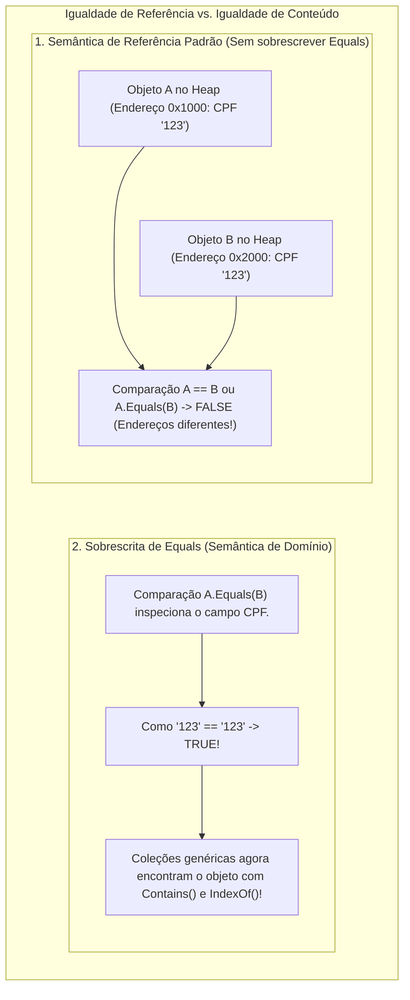
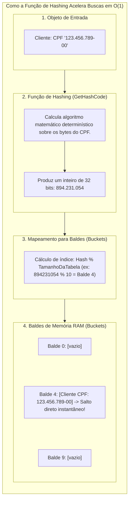

# 13. Igualdade de objetos, comparação e hashing (Equals, GetHashCode, hashCode, \_\_eq\_\_)

> **Contexto:** Estudo comparativo e prático sobre a **sobrescrita de igualdade de objetos (`Equals`)** e **geração de código hash (`GetHashCode`)** entre C#, Java, Python e JavaScript. Aborda a diferença crucial entre **igualdade por referência (endereço de memória)** e **igualdade por valor/conteúdo (semântica de negócio)**, o contrato sagrado do `GetHashCode`, e como isso dita o funcionamento interno de **coleções genéricas (`List<T>`, `Dictionary<TKey, TValue>`, `HashSet<T>`)**.

---

## 1. A intuição da igualdade (Técnica de Feynman)

Imagine **dois cartões de crédito físicos idênticos**:
* **Igualdade por Referência (Identidade Física - `==` padrão em objetos):** 
  - Você segura dois cartões de plástico nas mãos. Fisicamente, são **dois pedaços de plástico distintos ocupando lugares diferentes no espaço (endereços de memória diferentes)**. Se você perguntar: *"São o mesmo objeto físico de plástico?"*, a resposta é **NÃO**.
* **Igualdade por Valor / Conteúdo (`Equals` customizado):** 
  - Ambos os cartões pertencem ao mesmo cliente, possuem o mesmo número gravado (`4123 5678 9012 3456`) e debitam da mesma conta. Se você perguntar para a máquina da loja: *"Eles representam a mesma conta bancária?"*, a resposta é **SIM**.



---

## 2. A conexão direta com o [[01. Programacao Modular/20. Tipos genéricos (generics, type safety e coleções homogêneas)|Artigo 20 (Tipos Genéricos)]]

Por que todo desenvolvedor precisa dominar `Equals` e `GetHashCode` ao trabalhar com coleções genéricas?

1. **Busca em listas lineares (`List<T>.Contains` e `List<T>.IndexOf`):**
   - Quando você chama `listaContas.Contains(conta)`, a classe genérica `List<T>` percorre seus elementos internos invocando `Equals()` para comparar a instância procurada com cada item. Se você não sobrescrever o `Equals`, o `Contains()` falhará mesmo que os dados sejam idênticos!
2. **Tabelas Hash e Dicionários (`Dictionary<TKey, TValue>` e `HashSet<T>`):**
   - As coleções genéricas baseadas em dispersão (*hashing*) utilizam **duas etapas**:
     1. Usam `GetHashCode()` na chave `TKey` para saltar instantaneamente para o balde (*bucket*) de memória correto em complexidade $O(1)$.
     2. Usam `Equals()` dentro do balde para confirmar se a chave encontrada é exatamente a desejada (resolução de colisões).

> [!IMPORTANT]
> **O Contrato Sagrado da Igualdade:** Se dois objetos são considerados **iguais** pelo método `Equals()`, eles **DEVEM obrigatoriamente produzir o mesmo código inteiro retornado por `GetHashCode()`**. Violar essa regra quebra silenciosamente qualquer `Dictionary` ou `HashSet`!

## 3. O que é uma função de hashing (*Hash Function*) e como ela funciona?

Para entender o `GetHashCode` (C#), `hashCode` (Java) ou `__hash__` (Python), precisamos desmistificar o que é uma **função de espalhamento (*hashing*)**:

Uma **função de hashing** é um algoritmo matemático determinístico que recebe como entrada os dados de um objeto de qualquer tamanho (textos longos, instâncias de classes, números) e gera como saída um **único número inteiro fixo de 32 bits (*hash code*)**.



---

### A analogia de Feynman: O guarda-volumes de um parque de diversões

Imagine um parque de diversões com **100 mil armários de guarda-volumes**:
* **Busca linear sem hashing (`List<T>`):** Se você perder sua mochila, o funcionário teria que andar armário por armário abrindo um por um (do 1 ao 100.000) até achar a sua. Em 100 mil itens, isso leva horas (complexidade $O(N)$).
* **Busca com função de hashing (`Dictionary<K, V>` ou `HashSet<T>`):** Quando você chega, a recepcionista pega o seu CPF, soma os dígitos e calcula o resto da divisão por 100: digamos que deu **armário 37**.
  1. O sistema pula **diretamente para o armário 37** em menos de 1 segundo (complexidade constante $O(1)$).
  2. Dentro do armário 37, se houver duas mochilas parecidas (colisão de hash), ela usa o **`Equals`** para ler o seu nome na etiqueta e entregar a mochila exata!

---

### Propriedades fundamentais de uma boa função de hashing:
1. **Determinismo absoluto:** A mesma instância com os mesmos valores de atributos **deve sempre produzir exatamente o mesmo número inteiro**, em qualquer momento da execução.
2. **Distribuição uniforme (baixo índice de colisões):** A função deve espalhar os números de forma equilibrada por toda a faixa de inteiros, evitando que milhares de objetos caiam no mesmo balde de memória.
3. **Execução ultrarrápida:** O cálculo matemático deve envolver operações simples de deslocamento de bits (*bitwise*) e multiplicações por números primos para não consumir tempo excessivo de CPU.

---

## 4. Matriz comparativa entre as 4 linguagens

| Recurso | C# (.NET) | Java | Python | JavaScript / TypeScript |
| :--- | :--- | :--- | :--- | :--- |
| **Método de Igualdade** | `public override bool Equals(object obj)` | `@Override public boolean equals(Object obj)` | `def __eq__(self, other):` | `equals(other)` (método customizado) |
| **Interface Genérica Específica** | `IEquatable<T>` (evita *Boxing*) | *(Usa `equals(Object)` padrão)* | *(Baseado em `__eq__`)* | *(Não há nativa)* |
| **Função de Hashing** | `public override int GetHashCode()` | `@Override public int hashCode()` | `def __hash__(self):` | *(Não há suporte nativo a hashcode de objetos)* |
| **Operador `==` em Objetos** | Compara referências (salvo se sobrecarregado) | Compara **sempre referências** em objetos | Invoca automaticamente `__eq__` | `===` compara sempre referências |

---

## 4. Implementação comparada nas 4 linguagens

### C# (.NET) — Padrão profissional completo com `IEquatable<T>`

Em C#, o padrão corporativo moderno implementa a interface genérica `IEquatable<T>`, que garante que coleções genéricas como `List<T>` comparem instâncias diretamente **sem sofrer *Boxing* de `object`**:

```csharp
using System;
using System.Collections.Generic;

public class Cliente : IEquatable<Cliente> 
{
    public string Cpf { get; init; }
    public string Nome { get; set; }

    public Cliente(string cpf, string nome) 
    {
        Cpf = cpf;
        Nome = nome;
    }

    // 1. Sobrescrita polimórfica universal de Object.Equals:
    public override bool Equals(object? obj) 
    {
        return Equals(obj as Cliente);
    }

    // 2. Implementação da interface fortemente tipada IEquatable<Cliente> (Zero Boxing!):
    public bool Equals(Cliente? other) 
    {
        if (other is null) return false;
        if (ReferenceEquals(this, other)) return true;
        return Cpf == other.Cpf; // Regra de negócio: CPF define a identidade
    }

    // 3. Contrato sagrado: GetHashCode baseado no mesmo campo de Equals:
    public override int GetHashCode() 
    {
        return HashCode.Combine(Cpf);
    }
}

// Demonstração com coleções genéricas:
var lista = new List<Cliente> { new Cliente("123.456.789-00", "Leo Ruas") };
var busca = new Cliente("123.456.789-00", "Leo Desconhecido");

Console.WriteLine(lista.Contains(busca)); // TRUE! Encontrado por igualdade de valor.
```

---

### Java — Padrão `equals` e `hashCode`

Em Java, a biblioteca padrão depende estritamente do par `equals` e `hashCode`:

```java
import java.util.Objects;

public class Cliente {
    private final String cpf;
    private String nome;

    public Cliente(String cpf, String nome) {
        this.cpf = cpf;
        this.nome = nome;
    }

    @Override
    public boolean equals(Object o) {
        if (this == o) return true;
        if (o == null || getClass() != o.getClass()) return false;
        Cliente cliente = (Cliente) o;
        return Objects.equals(cpf, cliente.cpf);
    }

    @Override
    public int hashCode() {
        return Objects.hash(cpf);
    }
}
```

---

### Python — Métodos mágicos `__eq__` e `__hash__`

Em Python, o operador `==` aciona diretamente o método dunder `__eq__`. Para usar o objeto em conjuntos (`set`) ou dicionários (`dict`), implementa-se `__hash__`:

```python
class Cliente:
    def __init__(self, cpf: str, nome: str):
        self.cpf = cpf
        self.nome = nome

    def __eq__(self, other: object) -> bool:
        if not isinstance(other, Cliente):
            return False
        return self.cpf == other.cpf

    def __hash__(self) -> int:
        return hash(self.cpf)

# Demonstração:
c1 = Cliente("123.456.789-00", "Leo")
c2 = Cliente("123.456.789-00", "Leo Clone")

print(c1 == c2) # True! Invoca __eq__
```

---

### JavaScript / TypeScript

Como o JavaScript não possui métodos de sobrecarga de operadores nem função nativa de hashing para `Map` e `Set` (que comparam instâncias por referência de ponteiro `===`), adota-se um método utilitário manual `equals`:

```typescript
class Cliente {
  constructor(public readonly cpf: string, public nome: string) {}

  equals(other: unknown): boolean {
    if (!(other instanceof Cliente)) return false;
    return this.cpf === other.cpf;
  }
}

const c1 = new Cliente("123.456.789-00", "Leo");
const c2 = new Cliente("123.456.789-00", "Leo Clone");

console.log(c1.equals(c2)); // true
```

---

## 6. As 4 regras de ouro da equivalência matemática

Para que a sobrescrita de `Equals` seja formalmente correta (relação de equivalência na teoria dos conjuntos), ela deve cumprir:
1. **Reflexiva:** $x.\text{Equals}(x)$ deve ser sempre `true`.
2. **Simétrica:** $x.\text{Equals}(y)$ deve retornar o mesmo valor que $y.\text{Equals}(x)$.
3. **Transitiva:** Se $x.\text{Equals}(y)$ é `true` e $y.\text{Equals}(z)$ é `true`, então $x.\text{Equals}(z)$ deve ser `true`.
4. **Consistente:** Múltiplas invocações devem retornar sempre o mesmo resultado, desde que os campos comparados não sofram mutação.

---

## Artigos relacionados e navegação

* **Voltar ao índice de sintaxe:** [[00. Guia multilinguagem de sintaxe e praticas - Índice]]
* **Ver Tipos Genéricos e Coleções Homogêneas:** [[01. Programacao Modular/20. Tipos genéricos (generics, type safety e coleções homogêneas)]]
* **Ver Representação Textual:** [[12. Sobrescrita de métodos e representação textual (ToString, toString, __str__)]]
* **Glossário geral:** [[01. Programacao Modular/Glossário de conceitos]]
