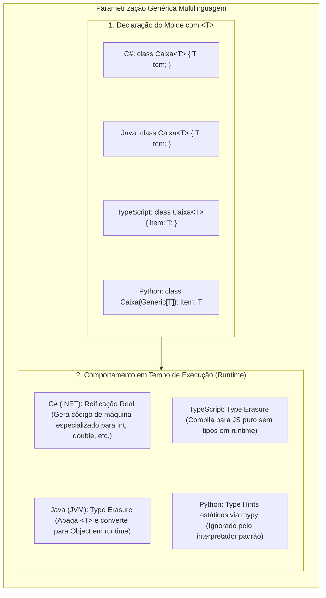

# 14. Tipos genéricos e polimorfismo paramétrico (Generics, TypeVar, Any, Templates)

> **Contexto:** Estudo comparativo e transversal da sintaxe de **Tipos Genéricos (*Generics*)** entre **C#, Java, Python e TypeScript/JavaScript**. Analisa como cada ecossistema implementa a parametrização de tipos (`<T>`), o comportamento interno em tempo de execução (*Reification* no .NET vs. *Type Erasure* na JVM), as restrições (*Constraints* / *Bounds*), o uso de `TypeVar` no Python moderno e a garantia estrita de segurança de tipos (*Type Safety*).

---

## 1. A intuição dos Generics (Técnica de Feynman)

Imagine uma **fôrma de gelo de silicone**:

* **Sem Generics (Coleções heterogêneas de `object` / `Any`):** A fôrma aceita qualquer líquido misturado: você coloca água mineral em uma cavidade, refrigerante na outra e detergente na terceira. Na hora de consumir, você nunca sabe com 100% de certeza o que está ingerindo e pode acabar "bebendo detergente" (um erro fatal de *cast* em tempo de execução / `InvalidCastException`).
* **Com Generics (`Forma<T>`):** Você define a etiqueta do lote: *"Esta é uma fôrma exclusiva de água de coco (`Forma<AguaDeCoco>`) "*. O compilador inspeciona a fôrma antes de ir para o congelador; se alguém tentar colocar detergente, o processo é abortado imediatamente na portaria da fábrica (tempo de compilação).



---

## 2. A conexão direta com o [[01. Programacao Modular/20. Tipos genéricos (generics, type safety e coleções homogêneas)|Artigo 20 (Tipos Genéricos)]]

O conceito de **Polimorfismo Paramétrico** é o alicerce das coleções modernas de software:
1. **Homogeneidade estrutural:** Garante que todos os elementos de uma coleção (ou as chaves de um mapa) pertençam ao mesmo domínio de tipos.
2. **Eliminação de coerção (*Zero Casts*):** Ao ler um elemento de `List<T>`, o tipo retornado já é exatamente `T`, dispensando verificações manuais de tipo.
3. **Desempenho e alocação:** Em linguagens reificadas como C#, evita a sobrecarga de empacotamento (*Boxing/Unboxing*) para tipos primitivos (`int`, `double`, `DateTime`).

---

## 3. Matriz comparativa entre as 4 linguagens

| Recurso | C# (.NET) | Java | Python (PEP 484) | TypeScript / JS |
| :--- | :--- | :--- | :--- | :--- |
| **Sintaxe de Classe Genérica** | `class Caixa<T> { ... }` | `class Caixa<T> { ... }` | `class Caixa(Generic[T]):` | `class Caixa<T> { ... }` |
| **Sintaxe de Método Genérico** | `void Trocar<T>(ref T a, ref T b)` | `<T> void trocar(T a, T b)` | `def trocar(a: T, b: T) -> T:` | `function trocar<T>(a: T, b: T): T` |
| **Múltiplos Parâmetros** | `Dictionary<TKey, TValue>` | `Map<K, V>` | `Dict[TKey, TValue]` | `Map<K, V>` |
| **Sintaxe de Restrições (*Constraints*)** | `where T : class, new(), IContrato` | `<T extends Superclasse & IContrato>` | `T = TypeVar('T', bound=Classe)` | `<T extends Interface>` |
| **Mecanismo de Execução** | **Reificação Real (*Reified Generics*)** | **Apagamento de Tipos (*Type Erasure*)** | **Verificação Estática (*Type Hints*)** | **Apagamento de Tipos (*Transpilação*)** |
| **Instanciar `new T()` diretamente** | **Permitido** (com `where T : new()`) | **Proibido** diretamente em runtime | **Proibido** sem fábrica manual | **Proibido** sem construtor como parâmetro |

---

## 4. Implementação comparada nas 4 linguagens

### C# (.NET) — Reificação de alto desempenho e restrições expressivas

Em C#, o compilador JIT (*Just-In-Time*) cria representações físicas especializadas na memória para cada tipo primitivo instanciado:

```csharp
using System;
using System.Collections.Generic;

// 1. Classe genérica com restrição de interface e construtor sem parâmetros
public class Armazenador<T> where T : class, IComparable<T>, new() 
{
    private readonly List<T> _itens = new();

    public void Adicionar(T item) => _itens.Add(item);

    public T CriarInstanciaPadrao() => new T(); // Permitido por causa de 'where T : new()'

    public T ObterMaior(T a, T b) 
    {
        // Permitido invocar CompareTo graças a 'where T : IComparable<T>'
        return a.CompareTo(b) >= 0 ? a : b;
    }
}

// 2. Método genérico estático
public static class Operacoes 
{
    public static void ImprimirDupla<T1, T2>(T1 primeiro, T2 segundo) 
    {
        Console.WriteLine($"Item 1: {primeiro} | Item 2: {segundo}");
    }
}

// Uso:
Operacoes.ImprimirDupla<string, int>("Idade", 28);
```

---

### Java — Herança de contratos com `extends` e *Type Erasure*

Em Java, a JVM apaga os parâmetros genéricos em tempo de execução (*Type Erasure*), substituindo `T` por `Object` (ou pelo primeiro limite superior):

```java
import java.util.ArrayList;
import java.util.List;

// Em Java, usa-se 'extends' tanto para classes quanto para interfaces!
public class Armazenador<T extends Comparable<T>> {
    private final List<T> itens = new ArrayList<>();

    public void adicionar(T item) {
        itens.add(item);
    }

    public T obterMaior(T a, T b) {
        return a.compareTo(b) >= 0 ? a : b;
    }

    // Método genérico independente:
    public static <T1, T2> void imprimirDupla(T1 primeiro, T2 segundo) {
        System.out.println("Item 1: " + primeiro + " | Item 2: " + segundo);
    }
}
```

---

### Python — Tipagem paramétrica com `typing.TypeVar` e `Generic`

No Python moderno (3.8+), o suporte a genéricos é viabilizado pelo módulo `typing` e verificado por analisadores estáticos (como *Mypy* e *Pyright*):

```python
from typing import TypeVar, Generic, List

# 1. Declaração das variáveis de tipo com nomes em maiúsculo
T = TypeVar('T')
TKey = TypeVar('TKey')
TValue = TypeVar('TValue')

# 2. Classe genérica herdando de Generic[T]
class PilhaCustomizada(Generic[T]):
    def __init__(self) -> None:
        self._elementos: List[T] = []

    def empilhar(self, item: T) -> None:
        self._elementos.append(item)

    def desempilhar(self) -> T:
        if not self._elementos:
            raise IndexError("Pilha vazia.")
        return self._elementos.pop()

# 3. Função genérica com múltiplos tipos
def formatar_par(chave: TKey, valor: TValue) -> str:
    return f"{chave} => {valor}"

# Uso com tipagem estática:
pilha_numeros: PilhaCustomizada[int] = PilhaCustomizada()
pilha_numeros.empilhar(10)
# pilha_numeros.empilhar("Texto") -> Mypy acusa erro de tipagem estática!
```

---

### TypeScript / JavaScript — Segurança estática para a Web

Em TypeScript, os genéricos fornecem segurança estrita de tipos em tempo de desenvolvimento antes da transpilação para JavaScript puro:

```typescript
// 1. Interface genérica para respostas de API
interface RespostaApi<TConteudo> {
  codigoStatus: number;
  dados: TConteudo;
  mensagem: string;
}

// 2. Classe genérica com restrição de chave (keyof)
class RepositorioEmMemoria<T extends { id: number | string }> {
  private itens: Map<number | string, T> = new Map();

  salvar(item: T): void {
    this.itens.set(item.id, item);
  }

  buscarPorId(id: number | string): T | undefined {
    return this.itens.get(id);
  }
}

// 3. Função genérica
function criarPar<T1, T2>(primeiro: T1, segundo: T2): [T1, T2] {
  return [primeiro, segundo];
}

const par = criarPar<string, number>("Nota", 9.8);
```

---

## 5. A grande diferença arquitetônica: Reificação (.NET) vs. *Type Erasure* (Java e TypeScript)

A diferença mais profunda entre as linguagens reside em **como o runtime lida com os tipos genéricos**:

1. **Reificação Real (.NET / C#):**
   - O compilador preserva as informações de tipo no binário IL. Quando você instancia `List<int>`, o JIT gera código de máquina exclusivo onde cada elemento é um inteiro puro de 4 bytes na memória. A verificação `typeof(T)` ou `if (x is T)` funciona perfeitamente em tempo de execução.
2. **Apagamento de Tipos (*Type Erasure* - Java e TypeScript):**
   - Na JVM e no JavaScript, os genéricos são uma **ilusão de tempo de compilação**. O compilador Java remove todos os `<T>` do arquivo `.class` e os substitui por `Object` com *casts* implícitos. Por essa razão, em Java é impossível escrever `new T()` ou `if (x instanceof T)`.

---

## Artigos relacionados e navegação

* **Voltar ao índice de sintaxe:** [[00. Guia multilinguagem de sintaxe e praticas - Índice]]
* **Ver Artigo Teórico de Generics (PUC Minas):** [[01. Programacao Modular/20. Tipos genéricos (generics, type safety e coleções homogêneas)]]
* **Ver Estruturas de Dados Fundamentais:** [[08. Estruturas de dados fundamentais (materialização de modelos mentais em código)]]
* **Ver Igualdade e Hashing (Equals e GetHashCode):** [[13. Igualdade de objetos, comparação e hashing (Equals, GetHashCode, hashCode, __eq__)]]
* **Glossário geral da disciplina:** [[01. Programacao Modular/Glossário de conceitos]]
