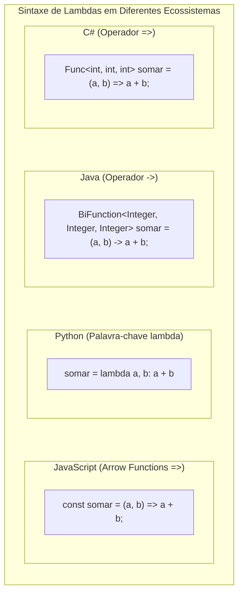

# 15. Expressões lambda, delegates e funções de primeira classe (callbacks, arrow functions, closures)

> **Contexto:** Guia comparativo de sintaxe para passagem de funções como dados em C#, Java, Python e JavaScript/TypeScript. Entenda o conceito de **Funções de Primeira Classe (*First-Class Citizens*)**, a anatomia das **Expressões Lambda** e como cada linguagem implementa a execução desacoplada de comportamento.

---

## 1. O que são funções de primeira classe? (Técnica de Feynman)

Em muitas linguagens primitivas, números e textos eram tratados como "cidadãos de primeira classe" (podiam ser guardados em variáveis e passados por parâmetro), enquanto funções eram apenas instruções fixas no código executável.

Nas linguagens modernas, **uma função é um dado como qualquer outro**:
* Você pode guardar uma função dentro de uma variável.
* Você pode passar uma função como argumento para outro método (*Callback*).
* Você pode fazer um método retornar uma nova função criada na hora (*Closure*).

---

### A analogia de Feynman: O pen drive com instruções

Imagine que você contratou um assistente:
* **Passar dados:** É entregar ao assistente uma caixa com ferramentas físicas (números, strings).
* **Passar uma função (Lambda/Delegate):** É entregar ao assistente um **pen drive com uma receita de bolo em PDF**. O assistente não sabe o que tem dentro do arquivo, mas quando chega a hora de cozinhar, ele abre o pen drive e executa as instruções passo a passo.

---

## 2. Comparativo multilinguagem: Anatomia das Expressões Lambda



---

## 3. Matriz comparativa entre linguagens

| Linguagem | Tipo / Mecanismo | Sintaxe de Expressão Lambda | Exemplo de Filtragem de Lista |
| :--- | :--- | :--- | :--- |
| **C#** | `delegate`, `Func<T, R>`, `Action<T>`, `Predicate<T>` | `(x, y) => x + y` | `numeros.FindAll(x => x % 2 == 0)` |
| **Java** | Interfaces Funcionais (`Function<T, R>`, `Consumer<T>`, `Predicate<T>`) | `(x, y) -> x + y` | `numeros.stream().filter(x -> x % 2 == 0)` |
| **Python** | Objetos de Função (`Callable`), `lambda` | `lambda x, y: x + y` | `list(filter(lambda x: x % 2 == 0, numeros))` |
| **JavaScript / TypeScript** | Funções de Primeira Classe, `Function`, `(x) => y` | `(x, y) => x + y` | `numeros.filter(x => x % 2 === 0)` |

---

## 4. Exemplos práticos nas 4 linguagens

### C# (.NET)
```csharp
using System;
using System.Collections.Generic;

// 1. Atribuição a delegate genérico Func
Func<int, int, int> multiplicar = (a, b) => a * b;
Console.WriteLine(multiplicar(6, 7)); // 42

// 2. Action (sem retorno)
Action<string> saudar = nome => Console.WriteLine($"Olá, {nome}!");
saudar("Leo Ruas");

// 3. Predicate em List<T>
List<int> valores = new List<int> { 10, 15, 20, 25 };
List<int> pares = valores.FindAll(v => v % 2 == 0);
```

---

### Java (JVM)
```java
import java.util.Arrays;
import java.util.List;
import java.util.function.BiFunction;
import java.util.function.Consumer;
import java.util.stream.Collectors;

public class ExemploLambdas {
    public static void main(String[] args) {
        // 1. BiFunction
        BiFunction<Integer, Integer, Integer> multiplicar = (a, b) -> a * b;
        System.out.println(multiplicar.apply(6, 7)); // 42

        // 2. Consumer
        Consumer<String> saudar = nome -> System.out.println("Olá, " + nome + "!");
        saudar.accept("Leo Ruas");

        // 3. Predicate via Stream API
        List<Integer> valores = Arrays.asList(10, 15, 20, 25);
        List<Integer> pares = valores.stream()
            .filter(v -> v % 2 == 0)
            .collect(Collectors.toList());
    }
}
```

---

### Python
```python
# 1. Função lambda anônima inline
multiplicar = lambda a, b: a * b
print(multiplicar(6, 7)) # 42

# 2. Procedimento via função de primeira classe
def saudar(nome: str) -> None:
    print(f"Olá, {nome}!")

executar = saudar
executar("Leo Ruas")

# 3. Filtragem com lambda
valores = [10, 15, 20, 25]
pares = list(filter(lambda v: v % 2 == 0, valores))
print(pares) # [10, 20]
```

---

### JavaScript / TypeScript
```javascript
// 1. Arrow function com retorno implícito
const multiplicar = (a, b) => a * b;
console.log(multiplicar(6, 7)); // 42

// 2. Arrow function como callback
const saudar = (nome) => console.log(`Olá, ${nome}!`);
saudar("Leo Ruas");

// 3. Filtragem funcional em Array nativo
const valores = [10, 15, 20, 25];
const pares = valores.filter(v => v % 2 === 0);
console.log(pares); // [10, 20]
```

---

## Navegação

* **Tópico anterior:** [[00. Sintaxe Multilinguagem/14. Tipos genéricos e polimorfismo paramétrico (Generics, TypeVar, Any, Templates)|14. Tipos Genéricos e Polimorfismo Paramétrico]]
* **Voltar ao índice geral:** [[00. Sintaxe Multilinguagem/00. Guia multilinguagem de sintaxe e praticas - Índice]]
* **Ver Artigo Teórico de Delegates e Eventos (C#):** [[01. Programacao Modular/22. Delegates, funções anônimas, expressões lambda e eventos em C#]]
