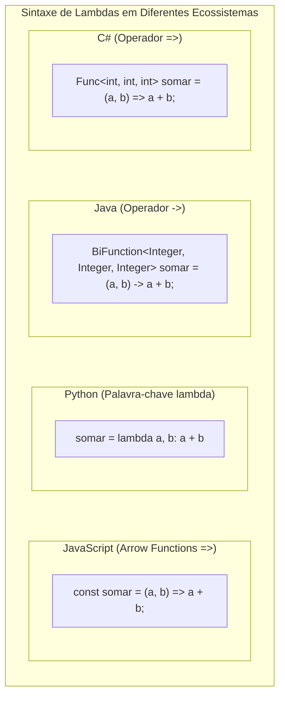
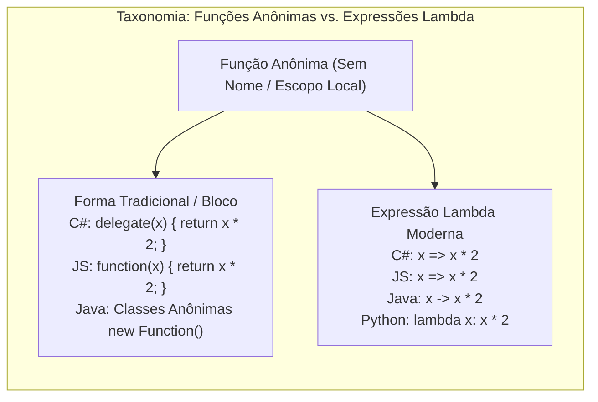

# 15. Expressões lambda, delegates e funções de primeira classe (callbacks, arrow functions, closures)

> **Contexto:** Guia comparativo de sintaxe para passagem de funções como dados em C#, Java, Python e JavaScript/TypeScript. Entenda o conceito de **Funções de Primeira Classe (*First-Class Citizens*)**, a anatomia das **Expressões Lambda** e como cada linguagem implementa a execução desacoplada de comportamento.

---

## 1. O que são funções de primeira classe? (Técnica de Feynman)

Em muitas linguagens primitivas, números e textos eram tratados como "cidadãos de primeira classe" (podiam ser guardados em variáveis e passados por parâmetro), enquanto funções eram apenas instruções fixas no código executável.

Nas linguagens modernas, **uma função é um dado como qualquer outro**:
* Você pode guardar uma função dentro de uma variável.
* Você pode passar uma função como argumento para outro método (*Callback*).
* Você pode fazer um método retornar uma nova função criada na hora (*Closure*).

---

### A analogia de Feynman: O pen drive com instruções

Imagine que você contratou um assistente:
* **Passar dados:** É entregar ao assistente uma caixa com ferramentas físicas (números, strings).
* **Passar uma função (Lambda/Delegate):** É entregar ao assistente um **pen drive com uma receita de bolo em PDF**. O assistente não sabe o que tem dentro do arquivo, mas quando chega a hora de cozinhar, ele abre o pen drive e executa as instruções passo a passo.

---

## 2. Comparativo multilinguagem: Anatomia das Expressões Lambda



---

## 2. O que é uma função anônima e como ela se diferencia da expressão lambda?

Uma **função anônima** é uma sub-rotina que **não possui um identificador (nome)** associado na tabela de símbolos da classe. Ela é definida diretamente onde será consumida.

### A distinção entre função anônima e expressão lambda:
* **Função Anônima (Conceito Geral):** Qualquer função sem nome. Pode ser escrita com blocos completos de chaves (`{ ... }`), múltiplas linhas de instruções e retornos explícitos.
* **Expressão Lambda (Sintaxe Moderna):** É uma forma ultra-concisa de escrever uma função anônima baseada na notação matemática $\lambda$ (com operadores como `=>` ou `->`), permitindo inferência automática de tipos e retorno implícito.



---

## 3. Matriz comparativa entre linguagens

| Linguagem | Sintaxe de Função Anônima Tradicional | Sintaxe de Expressão Lambda Moderna | Exemplo de Filtragem Funcional |
| :--- | :--- | :--- | :--- |
| **C#** | `delegate(int x) { return x % 2 == 0; }` | `x => x % 2 == 0` | `numeros.FindAll(x => x % 2 == 0)` |
| **Java** | Classe Anônima `new Predicate<Integer>() { ... }` | `x -> x % 2 == 0` | `numeros.stream().filter(x -> x % 2 == 0)` |
| **Python** | Não possui bloco anônimo multilinhas | `lambda x: x % 2 == 0` | `list(filter(lambda x: x % 2 == 0, numeros))` |
| **JavaScript** | `function(x) { return x % 2 === 0; }` | `x => x % 2 === 0` | `numeros.filter(x => x % 2 === 0)` |

---

## 4. Exemplos práticos nas 4 linguagens

### C# (.NET) - Delegates customizados, genéricos e expressões lambda

Em C#, temos três formas de trabalhar com passagem de funções:

#### A. O delegate customizado tradicional (Contrato formal com nome)
```csharp
using System;

// 1. Declaração do tipo delegate (assinatura esperada)
public delegate void Notificador(string mensagem);

public class Program
{
    public static void EnviarEmail(string msg) => Console.WriteLine($"Email: {msg}");
    public static void EnviarSms(string msg) => Console.WriteLine($"SMS: {msg}");

    public static void Main()
    {
        // 2. Apontando para método (Type-safe function pointer)
        Notificador canal = EnviarEmail;
        canal("Servidor reiniciado");

        // 3. Delegate multicast (dispara ambos em sequência com +=)
        canal += EnviarSms;
        canal("Alerta crítico!"); // Dispara Email E SMS
    }
}
```

#### B. Delegates genéricos modernos (`Func`, `Action`, `Predicate`) e Lambdas (`=>`)
```csharp
// 1. Func<T1, T2, TResult>: recebe inteiros e retorna inteiro
Func<int, int, int> multiplicar = (a, b) => a * b;
Console.WriteLine(multiplicar(6, 7)); // 42

// 2. Action<T>: recebe string e retorna void
Action<string> saudar = nome => Console.WriteLine($"Olá, {nome}!");
saudar("Leo Ruas");

// 3. Predicate<T>: recebe item e retorna bool (filtro de lista)
List<int> valores = new List<int> { 10, 15, 20, 25 };
List<int> pares = valores.FindAll(v => v % 2 == 0); // [10, 20]
```

---

### Java (JVM)
```java
import java.util.Arrays;
import java.util.List;
import java.util.function.BiFunction;
import java.util.function.Consumer;
import java.util.stream.Collectors;

public class ExemploLambdas {
    public static void main(String[] args) {
        // 1. BiFunction
        BiFunction<Integer, Integer, Integer> multiplicar = (a, b) -> a * b;
        System.out.println(multiplicar.apply(6, 7)); // 42

        // 2. Consumer
        Consumer<String> saudar = nome -> System.out.println("Olá, " + nome + "!");
        saudar.accept("Leo Ruas");

        // 3. Predicate via Stream API
        List<Integer> valores = Arrays.asList(10, 15, 20, 25);
        List<Integer> pares = valores.stream()
            .filter(v -> v % 2 == 0)
            .collect(Collectors.toList());
    }
}
```

---

### Python
```python
# 1. Função lambda anônima inline
multiplicar = lambda a, b: a * b
print(multiplicar(6, 7)) # 42

# 2. Procedimento via função de primeira classe
def saudar(nome: str) -> None:
    print(f"Olá, {nome}!")

executar = saudar
executar("Leo Ruas")

# 3. Filtragem com lambda
valores = [10, 15, 20, 25]
pares = list(filter(lambda v: v % 2 == 0, valores))
print(pares) # [10, 20]
```

---

### JavaScript / TypeScript
```javascript
// 1. Arrow function com retorno implícito
const multiplicar = (a, b) => a * b;
console.log(multiplicar(6, 7)); // 42

// 2. Arrow function como callback
const saudar = (nome) => console.log(`Olá, ${nome}!`);
saudar("Leo Ruas");

---

## 5. O padrão de Callback (Função de Retorno) nas 4 linguagens

Um **Callback** é uma função passada para um processo assíncrono ou demorado para ser chamada de volta quando o resultado estiver pronto.

### A analogia de Feynman: O mecânico e o telefone
Você deixa seu carro na oficina e entrega um papel com seu telefone dizendo: *"Não vou ficar esperando aqui. Quando o motor estiver consertado, me ligue de volta (*call back*)"*.

### Como implementar callbacks em cada linguagem:

#### C# (via `Action<T>` ou `Func<T, R>`)
```csharp
public static void ProcessarArquivo(string caminho, Action<bool, string> onConcluido)
{
    // Simula processamento
    bool sucesso = true;
    onConcluido(sucesso, "Arquivo processado com 100% de sucesso!");
}

// Consumo do callback:
ProcessarArquivo("dados.csv", (ok, msg) => Console.WriteLine($"Status: {msg}"));
```

#### JavaScript / TypeScript (via funções de primeira classe / Arrow functions)
```javascript
function processarArquivo(caminho, onConcluido) {
    setTimeout(() => {
        onConcluido(true, "Arquivo processado com sucesso!");
    }, 1000);
}

// Consumo do callback:
processarArquivo("dados.csv", (ok, msg) => console.log(`Status: ${msg}`));
```

#### Python (via `Callable`)
```python
from typing import Callable

def processar_arquivo(caminho: str, on_concluido: Callable[[bool, str], None]) -> None:
    # Simula processamento
    on_concluido(True, "Arquivo processado com sucesso!")

# Consumo do callback:
processar_arquivo("dados.csv", lambda ok, msg: print(f"Status: {msg}"))
```

#### Java (via `BiConsumer<T, U>`)
```java
import java.util.function.BiConsumer;

public class ServicoArquivo {
    public static void processar(String caminho, BiConsumer<Boolean, String> onConcluido) {
        onConcluido.accept(true, "Arquivo processado com sucesso!");
    }

    public static void main(String[] args) {
        processar("dados.csv", (ok, msg) -> System.out.println("Status: " + msg));
    }
}
```

---

## 6. O padrão de Hook e Unhook (Enganchar e Desenganchar Eventos)

**Enganchar (*Hook / Attach*)** e **desenganchar (*Unhook / Detach*)** é a prática de conectar e desconectar manipuladores em tempo de execução para estender comportamento e **evitar vazamentos de memória (*Memory Leaks*)**.

### A matriz de sintaxe: Hook vs. Unhook

| Linguagem | Sintaxe de Enganchar (*Hook*) | Sintaxe de Desenganchar (*Unhook*) | Cuidados com Funções Anônimas / Lambdas |
| :--- | :--- | :--- | :--- |
| **C#** | `botao.Click += TratarClique;` | `botao.Click -= TratarClique;` | **Cuidado:** Lambdas `+= (s, e) => ...` não podem ser desenganchadas com `-=` porque cada lambda cria uma instância diferente na memória. Guarde a referência ou use método nomeado! |
| **JavaScript** | `elem.addEventListener("click", tratar);` | `elem.removeEventListener("click", tratar);` | Exige a **mesma referência de função**; lambdas anônimas inline nunca são removidas. |
| **Python** | `dispatcher.connect(tratar_evento)` | `dispatcher.disconnect(tratar_evento)` | Requer referência ao método ou objeto *Callable*. |
| **Java** | `botao.addActionListener(ouvinte);` | `botao.removeActionListener(ouvinte);` | Requer guardar a instância do *Listener* para remoção. |

---

### Exemplo em C# (.NET):
```csharp
public class JanelaModal : IDisposable
{
    private readonly ServicoGlobal _servico;

    public JanelaModal(ServicoGlobal servico)
    {
        _servico = servico;
        // HOOK (Enganchar):
        _servico.DadosAtualizados += OnDadosAtualizados;
    }

    private void OnDadosAtualizados(object? sender, EventArgs e)
    {
        Console.WriteLine("Atualizando interface da modal...");
    }

    public void Dispose()
    {
        // UNHOOK (Desenganchar): Previne Memory Leak no Garbage Collector!
        _servico.DadosAtualizados -= OnDadosAtualizados;
    }
}
```

---

## Navegação

* **Tópico anterior:** [[00. Sintaxe Multilinguagem/14. Tipos genéricos e polimorfismo paramétrico (Generics, TypeVar, Any, Templates)|14. Tipos Genéricos e Polimorfismo Paramétrico]]
* **Voltar ao índice geral:** [[00. Sintaxe Multilinguagem/00. Guia multilinguagem de sintaxe e praticas - Índice]]
* **Ver Artigo Teórico de Delegates e Eventos (C#):** [[01. Programacao Modular/22. Delegates, funções anônimas, expressões lambda e eventos em C#]]
