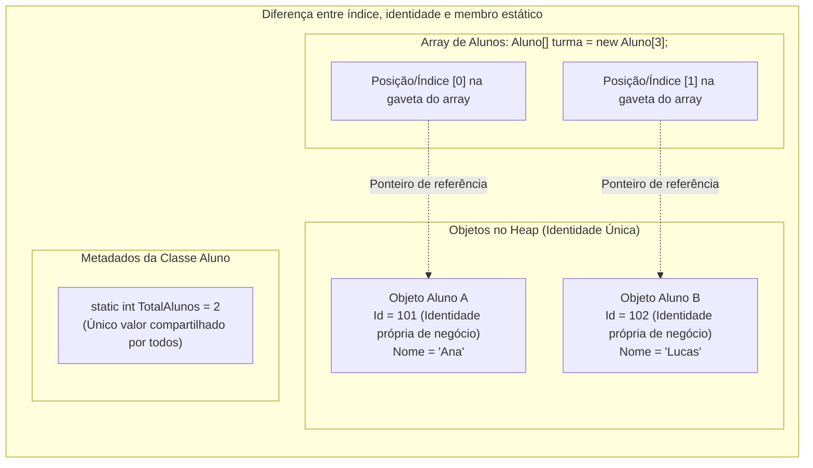

# Programação Modular

## Visão geral
Estudo dos conceitos de modularidade, encapsulamento de estado, reutilização de código, tipos abstratos de dados (TADs), baixo acoplamento e desenvolvimento de sistemas modulares robustos e de alta qualidade.

---

## Artigos técnicos e conteúdos
* [[01. Introdução à programação modular]] — A evolução da abstração em três estágios (decomposição, modularização e gestão do próprio estado), o Teorema de Böhm-Jacopini e a superação da instrução `GOTO`.
* [[02. Funções e procedimentos]] — A distinção formal entre Funções (abstração de expressão com retorno) e Procedimentos (abstração de comando com `void`), boas práticas e escopo.
* [[03. Tipos abstratos de dados]] — Definição pela teoria dos conjuntos (valores + operações), o princípio de ocultação de informação, a analogia do Caixa Eletrônico e o catálogo dos TADs essenciais (Pilha, Fila, Lista, Árvores e Grafos).
* [[04. Programação orientada a objetos e acoplamento]] — A POO como materialização de TADs, a analogia do Smartphone (Estado, Comportamento e Identidade), a metáfora da célula biológica de Alan Kay e a busca pelo baixo acoplamento.
* [[05. Fatores externos de qualidade de software]] — A perspectiva do usuário segundo Bertrand Meyer, a analogia do automóvel, detalhamento dos 7 fatores fundamentais, degradação graciosa (*Graceful Degradation*) e o modelo formal da ISO/IEC 25010 da PUC Minas.
* [[06. Fatores internos de qualidade de software]] — A perspectiva do desenvolvedor, a fundação invisível do código, os 7 critérios essenciais (modularidade, coesão, baixo acoplamento, legibilidade, encapsulamento, testabilidade), elementos de código e a sustentação dos fatores externos.
* [[07. Atributos e métodos (classes, objetos e definição de membros)]] — A estrutura fundamental de classes e objetos na POO, atributos (estado) vs. métodos (comportamento), ciclo de instanciação, encapsulamento e diferenças com variáveis locais.
* [[08. Construtores (inicialização, sobrecarga e garantia de invariantes)]] — Inicialização de objetos na memória Heap, construtor padrão vs. parametrizado, sobrecarga com `this(...)`, proteção de invariantes de classe e impacto na correção e robustez.
* [[09. Atributos estáticos e propriedades (compartilhamento de estado e encapsulamento)]] — Membros estáticos (`static`), escopo de classe vs. escopo de instância, compartilhamento de estado em tempo real, propriedades completas e auto-properties em C#.
* [[10. Destrutores e finalizadores (desalocação de memória e liberação de recursos)]] — Desalocação de memória pelo Garbage Collector, recursos gerenciados vs. não gerenciados, sintaxe de destrutores (`~Classe()`), padrão `IDisposable` e a instrução `using`.
* [[11. Princípio da ocultação da informação (information hiding e encapsulamento)]] — O critério de decomposição modular de David Parnas, isolamento de decisões de projeto voláteis (*secret*), Information Hiding vs. Encapsulamento e redução de acoplamento.
* [[12. Modificadores de acesso (visibilidade e níveis de proteção no encapsulamento)]] — Níveis de acesso (`public`, `private`, `protected`, `internal`), regras de visibilidade de tipos e membros, analogia do condomínio fechado e boas práticas de proteção de dados.
* [[13. Métodos de acesso e propriedades (publicação de contratos e garantia de invariantes)]] — Ocultação de atributos e publicação de métodos, Getters e Setters, propriedades completas, auto-properties, somente leitura, calculadas e validação de invariantes.
* [[14. Namespaces e partial classes (espaços de nomes e modularização em larga escala)]] — Espaços de nomes como unidades lógicas superiores à classe, prevenção de colisões de identificadores, sintaxe de bloco vs. *file-scoped*, diretiva `using`, *aliases* e particionamento físico de classes com `partial`.
* [[15. Herança (generalização, especialização e extensibilidade modular)]] — O conceito de herança na POO, modelagem por Generalização (Bottom-Up) e Especialização (Top-Down), relação semântica *"é um"*, invocação de construtores com `base(...)`, modificador `protected` e o Princípio Aberto/Fechado (OCP).
* [[16. Construtores em classes filhas (ordem de inicialização e a cláusula base)]] — Ciclo de vida e ordem de inicialização de subclasses na memória Heap, delegação obrigatória com `: base(...)`, combinação de `: this(...)` e `: base(...)`, e a proibição de métodos virtuais em construtores.

---

## Mapa de conteúdo (Study Roadmap)
- [x] **Módulo 1:** Introdução e conceitos iniciais
  - [[01. Introdução à programação modular]]
  - [[02. Funções e procedimentos]]
  - [[03. Tipos abstratos de dados]]
  - [[04. Programação orientada a objetos e acoplamento]]
  - [[05. Fatores externos de qualidade de software]]
  - [[06. Fatores internos de qualidade de software]]
  - [[07. Atributos e métodos (classes, objetos e definição de membros)]]
  - [[08. Construtores (inicialização, sobrecarga e garantia de invariantes)]]
  - [[09. Atributos estáticos e propriedades (compartilhamento de estado e encapsulamento)]]
  - [[10. Destrutores e finalizadores (desalocação de memória e liberação de recursos)]]
  - [[11. Princípio da ocultação da informação (information hiding e encapsulamento)]]
  - [[12. Modificadores de acesso (visibilidade e níveis de proteção no encapsulamento)]]
  - [[13. Métodos de acesso e propriedades (publicação de contratos e garantia de invariantes)]]
  - [[14. Namespaces e partial classes (espaços de nomes e modularização em larga escala)]]
- [x] **Módulo 2:** Aprofundamento prático e extensibilidade
  - [[15. Herança (generalização, especialização e extensibilidade modular)]]
  - [[16. Construtores em classes filhas (ordem de inicialização e a cláusula base)]]
- [ ] **Glossário e referência prática multilinguagem:**
  - [[Glossário de conceitos|Glossário de conceitos (tipos, operações, módulos, atributos e fatores de qualidade)]]
  - [[00. Sintaxe Multilinguagem/00. Guia multilinguagem de sintaxe e praticas - Índice|Guia multilinguagem de sintaxe e práticas (C#, Java, Python, JS)]]
- [ ] **Módulo 3:** Aplicações reais
- [ ] **Módulo 4:** Revisão e consolidação

---

## Consolidação conceitual e modelos mentais de execução (diagnóstico da unidade 1)

Esta seção consolida as distinções mais críticas de execução identificadas na avaliação e nos exercícios práticos da Unidade 1, fortalecendo o modelo mental de como o compilador e a memória *Heap/Stack* operam:

---

### 1. Membro de instância vs. membro estático (`static`): o modelo mental de acesso

* **A regra de ouro:** Um membro estático pertence à **classe como um todo**, enquanto um membro de instância pertence a um **objeto específico alocado na memória *Heap***.
* **A barreira de acesso:** Um método `static` **NÃO possui o ponteiro implícito `this`**. Por isso, ele **não pode acessar diretamente nenhum atributo ou método de instância** sem receber explicitamente a referência de um objeto criado.

#### Exemplo em C#:
```csharp
public class Aluno 
{
    public string Nome { get; set; }          // Atributo de instância (cada aluno tem o seu)
    public static string Escola { get; set; }  // Atributo estático (único para toda a classe)

    public void ExibirNome() 
    {
        // VÁLIDO: Método de instância pode ler dados da instância (this.Nome) e dados estáticos (Escola)
        Console.WriteLine($"{Nome} estuda na {Escola}");
    }

    public static void ExibirAvisoGeral() 
    {
        // ERRO DE COMPILAÇÃO CS0120 se tentar: Console.WriteLine(Nome);
        // O método estático não sabe de QUAL aluno você está falando!

        // VÁLIDO: Acessar dados da instância apenas se receber o objeto explicitamente:
        Console.WriteLine($"Aviso geral para a escola {Escola}");
    }

    public static void ImprimirBoletim(Aluno a) 
    {
        // VÁLIDO: Recebe a referência 'a' e acessa o membro de instância através dela:
        Console.WriteLine($"Boletim de {a.Nome}");
    }
}
```

* **Tradução em linguagem natural:**
  - *"O método estático é o interfone da recepção da escola (estático). Ele pode dar avisos gerais sobre o colégio (`Escola`). Mas se ele quiser ler o caderno de um aluno (`Nome`), ele não pode adivinhar o caderno do além: alguém precisa levar o aluno `a` até a recepção (`ImprimirBoletim(Aluno a)`) para ele poder abrir o caderno daquele aluno específico!"*

---

### 2. Desmistificando: índice do array vs. identidade do objeto vs. atributo estático

Um dos maiores pontos de confusão é misturar a posição de um item em uma coleção com o identificador do objeto ou com um contador estático:



| Conceito | O que representa? | Onde vive? | Exemplo |
| :--- | :--- | :--- | :--- |
| **Índice no array (`i`)** | A **posição física da gaveta** em uma coleção. Se os elementos forem reordenados, o índice muda. | Na estrutura de indexação do array. | `turma[0]` |
| **Identidade do objeto (`Id` / Campo de instância)** | O **número de matrícula ou CPF** daquele objeto específico. É permanente para aquela instância. | No corpo do próprio objeto no *Heap*. | `aluno.Id = 101;` |
| **Atributo estático (`static Id` / `Total`)** | Uma **única variável global da classe**, compartilhada por todos. Não serve como RG individual! | Na área de metadados da classe no *runtime*. | `Aluno.TotalAlunos` |

* **Tradução em linguagem natural:**
  - O **índice** `0` é a carteira da primeira fileira da sala (o lugar onde a pessoa sentou hoje).
  - O **campo de instância** `Id` é o CPF do estudante (pertence a ele onde quer que ele sente).
  - O **campo estático** `static TotalAlunos` é a placa na porta da sala dizendo *"25 alunos matriculados"* (um único número para a sala inteira).

---

### 3. Construtores: *default* implícito da linguagem vs. sem parâmetros do desenvolvedor

* **Construtor *default* gerado pelo compilador:** Se você **não escrever nenhum construtor** na classe, o compilador C# gera automaticamente um construtor público sem parâmetros (`public MinhaClasse() { }`) que zera os campos.
* **Construtor sem parâmetros explícito do desenvolvedor:** É quando você digita manualmente `public MinhaClasse() { ... }` para definir valores de inicialização padronizados.
* **Sobrecarga de construtores (*Constructor Overloading*):** Uma classe pode ter múltiplos construtores desde que suas **assinaturas sejam diferentes** (variação na quantidade, tipo e ordem dos parâmetros):
  ```csharp
  public class Produto 
  {
      public string Codigo { get; init; }
      public decimal Preco { get; set; }

      // 1. Construtor canônico completo:
      public Produto(string codigo, decimal preco) 
      {
          Codigo = codigo;
          Preco = preco;
      }

      // 2. Construtor sobrecarregado de conveniência (delega para o canônico com preço zero):
      public Produto(string codigo) : this(codigo, 0m) { }
  }
  ```

---

### 4. Encapsulamento: ocultação de informação não exige *getters* e *setters* para tudo

* **O erro comum:** Achar que toda propriedade privada precisa de um método `Get` e um método `Set`.
* **A visão correta da PUC Minas e de David Parnas:** Ocultação de informação significa que a classe **guarda segredos**. Se o saldo de uma conta só deve mudar através de `Depositar()` e `Sacar()`, criar um `SetSaldo()` destruiria o encapsulamento e a garantia de invariantes!
* **Acesso `private` é inviolável:** Nenhum código de fora da classe (nem mesmo classes filhas) pode ler ou escrever diretamente em um campo `private`.

---

## Minhas notas
*(Escreva suas anotações pessoais aqui durante as aulas)*

---

## Referências bibliográficas

### Bibliografia básica
* BÖHM, Corrado; JACOPINI, Giuseppe. **Flow diagrams, Turing machines and languages with only two formation rules**. Communications of the ACM, v. 9, n. 5, p. 366-371, May 1966. Disponível em: [https://dl.acm.org/doi/10.1145/355592.365646](https://dl.acm.org/doi/10.1145/355592.365646).
* LISKOV, Barbara; ZILLES, Stephen. **Programming with Abstract Data Types**. ACM SIGPLAN Notices, v. 9, n. 4, p. 50-59, April 1974. Disponível em: [https://dl.acm.org/doi/10.1145/942572.807045](https://dl.acm.org/doi/10.1145/942572.807045).
* MARTIN, Robert C.; MARTIN, Micah. **Princípios, padrões e práticas ágeis em C#**. Porto Alegre: Bookman, 2011. xv, 735 p. ISBN 9788577808410. Disponível em: [https://bib.pucminas.br/acervo/454490/](https://bib.pucminas.br/acervo/454490/).
* MARTIN, Robert C. **Código Limpo: Habilidades Práticas do Agile Software**. Rio de Janeiro: Alta Books, 2011.
* MCGEE, Pat. **C#: A Beginner's Guide**. 1. ed. McGraw-Hill Education, 2015. 496 p. Disponível em: [https://bib.pucminas.br/acervo/5400358/](https://bib.pucminas.br/acervo/5400358/).
* MEYER, Bertrand. **Object-Oriented Software Construction**. 2. ed. Prentice Hall, 1997.
* PARNAS, David L. **On the Criteria to Be Used in Decomposing Systems into Modules**. Communications of the ACM, v. 15, n. 12, p. 1053-1058, Dec. 1972. Disponível em: [https://dl.acm.org/doi/10.1145/361598.361623](https://dl.acm.org/doi/10.1145/361598.361623).
* SOMMERVILLE, Ian. **Engenharia de Software**. 10. ed. São Paulo: Pearson, 2019.
* WIRTH, Niklaus. **Algorithms + Data Structures = Programs**. Englewood Cliffs: Prentice-Hall, 1976.

### Bibliografia complementar
* ARCOS-MEDINA, G.; MAURICIO, D. **The Influence of the Application of Agile Practices in Software Quality Based on ISO/IEC 25010 Standard**. International Journal of Information Technologies and Systems Approach (IJITSA), v. 13, n. 2, p. 27-53, 2020. DOI: [10.4018/IJITSA.2020070102](http://doi.org/10.4018/IJITSA.2020070102).
* DE PAULA, Hugo. **Programação Modular: Exemplos de Classes, Objetos e Encapsulamento em C#**. GitHub, 2023. Disponível em: [https://github.com/hugodepaula/programacao-modular-ead](https://github.com/hugodepaula/programacao-modular-ead).
* DIJKSTRA, Edsger W. **Go To Statement Considered Harmful**. Communications of the ACM, v. 11, n. 3, p. 147-148, 1968.
* FAKHROUTDINOV, Kirill. **UML Class and Object Diagrams Overview**. UML-Diagrams.org, 2020. Disponível em: [https://www.uml-diagrams.org/class-diagrams-overview.html](https://www.uml-diagrams.org/class-diagrams-overview.html).
* FOWLER, Martin. **Refatoração: Aperfeiçoando o Design de Códigos Existentes**. 2. ed. São Paulo: Novatec, 2019.
* GAMMA, Erich et al. **Padrões de Projeto: Soluções Reutilizáveis de Software Orientado a Objetos**. Porto Alegre: Bookman, 2000.
* ISO/IEC. **ISO/IEC 25010: Systems and software engineering — Systems and software Quality Requirements and Evaluation (SQuaRE) — System and software quality models**. ISO, 2011. Disponível em: [https://iso25000.com/index.php/en/iso-25000-standards/iso-25010](https://iso25000.com/index.php/en/iso-25000-standards/iso-25010).
* KAY, Alan. **The Early History of Smalltalk**. ACM SIGPLAN Notices, v. 28, n. 3, p. 69-95, 1993.
* MICROSOFT. **Guia de Programação em C#**. Microsoft Learn / Docs, 2021. Disponível em: [https://docs.microsoft.com/pt-br/dotnet/csharp/programming-guide/](https://docs.microsoft.com/pt-br/dotnet/csharp/programming-guide/).
* NIELSEN, Jakob. **Usability Engineering**. Morgan Kaufmann, 1994.
* PARNAS, David L. **Information Distribution Aspects of Design Methodology**. In: FREIMAN, Charles V.; GRIFFITH, John E.; ROSENFELD, Jack L. (Ed.). Proceedings of IFIP Congress 1971. North-Holland, 1971. v. 1, p. 339–344. DOI: [10.1184/R1/6606470.V1](https://kilthub.cmu.edu/articles/journal_contribution/Information_distribution_aspects_of_design_methodology/6606470/1). Disponível em: [https://cseweb.ucsd.edu/~wgg/CSE218/Parnas-IFIP71-information-distribution.PDF](https://cseweb.ucsd.edu/~wgg/CSE218/Parnas-IFIP71-information-distribution.PDF).
* PRESSMAN, Roger S.; MAXIM, Bruce R. **Engenharia de Software: Uma Abordagem Profissional**. 8. ed. Porto Alegre: AMGH, 2016.
* RICHTER, Jeffrey. **CLR via C#**. 4. ed. Redmond: Microsoft Press, 2012.
* SEBESTA, Robert W. **Conceitos de Linguagens de Programação**. 11. ed. Porto Alegre: Bookman, 2018.
* SUZDALNITSKI, Ilya. **Object-Oriented Programming is The Biggest Mistake of Computer Science**. Medium, 2021. Disponível em: [https://suzdalnitski.medium.com/oop-will-make-you-suffer-846d072b4dce](https://suzdalnitski.medium.com/oop-will-make-you-suffer-846d072b4dce).
* TENENBAUM, Aaron M.; LANGSAM, Yedidyah; AUGENSTEIN, Moshe J. **Estruturas de Dados Usando C**. São Paulo: Makron Books, 1995.

---

## Autores e pioneiros citados na disciplina

Abaixo está o quadro histórico dos principais cientistas da computação e autores cujos trabalhos fundamentam a disciplina de Programação Modular:

| Autor / Pioneiro | Contribuição para a disciplina | Artigos relacionados | Perfil biográfico |
| :--- | :--- | :--- | :--- |
| **David L. Parnas** | Criador do **Princípio da Ocultação da Informação (*Information Hiding*)** (1971/1972) e critérios de modularização. | [[11. Princípio da ocultação da informação (information hiding e encapsulamento)]] | [Wikipedia](https://pt.wikipedia.org/wiki/David_Parnas) |
| **Barbara Liskov** | Pioneira na formalização dos **Tipos Abstratos de Dados (TADs)** (1974) e Princípio da Substituição de Liskov (LSP). Vencedora do Prêmio Turing. | [[03. Tipos abstratos de dados]], [[04. Programação orientada a objetos e acoplamento]], [[15. Herança (generalização, especialização e extensibilidade modular)]] | [Wikipedia](https://pt.wikipedia.org/wiki/Barbara_Liskov) |
| **Edsger W. Dijkstra** | Pai da **Programação Estruturada** e autor do manifesto *"Go To Statement Considered Harmful"* (1968). Vencedor do Prêmio Turing. | [[01. Introdução à programação modular]], [[Glossário de conceitos]] | [Wikipedia](https://pt.wikipedia.org/wiki/Edsger_Dijkstra) |
| **Niklaus Wirth** | Criador do conceito *"Algoritmos + Estruturas de Dados = Programas"* (1976), Pascal e Modula-2. Vencedor do Prêmio Turing. | [[01. Introdução à programação modular]], [[03. Tipos abstratos de dados]] | [Wikipedia](https://pt.wikipedia.org/wiki/Niklaus_Wirth) |
| **Bertrand Meyer** | Criador da linguagem Eiffel, do conceito **Design by Contract (DbC)** e autor seminal sobre Construção de Software Orientado a Objetos (1997). | [[05. Fatores externos de qualidade de software]], [[06. Fatores internos de qualidade de software]], [[15. Herança (generalização, especialização e extensibilidade modular)]] | [Wikipedia](https://pt.wikipedia.org/wiki/Bertrand_Meyer) |
| **Alan Kay** | Pioneiro da Orientação a Objetos, criador do Smalltalk e do modelo de troca de mensagens. Vencedor do Prêmio Turing. | [[04. Programação orientada a objetos e acoplamento]] | [Wikipedia](https://pt.wikipedia.org/wiki/Alan_Kay) |
| **Robert C. Martin (*Uncle Bob*)** | Autor de *Princípios, Padrões e Práticas Ágeis em C#* e *Código Limpo*, criador dos princípios SOLID. | [[06. Fatores internos de qualidade de software]], [[08. Construtores (inicialização, sobrecarga e garantia de invariantes)]], [[15. Herança (generalização, especialização e extensibilidade modular)]] | [Wikipedia](https://en.wikipedia.org/wiki/Robert_C._Martin) |
| **Pat McGee** | Autor do guia de introdução prática à linguagem C# (*A Beginner's Guide*). | [[07. Atributos e métodos (classes, objetos e definição de membros)]] | [O'Reilly Profile](https://www.oreilly.com/library/view/c-a-beginners/9780071830089/) |
| **Ian Sommerville** | Autor seminal de Engenharia de Software abordando processos, qualidade e ciclo de vida de software. | [[05. Fatores externos de qualidade de software]], [[06. Fatores internos de qualidade de software]] | [Wikipedia](https://en.wikipedia.org/wiki/Ian_Sommerville_(software_engineer)) |
| **Corrado Böhm e Giuseppe Jacopini** | Criadores do **Teorema da Estrutura (Böhm-Jacopini)** (1966) provando que qualquer algoritmo computável usa apenas Sequência, Seleção e Repetição. | [[01. Introdução à programação modular]] | [Wikipedia](https://pt.wikipedia.org/wiki/Teorema_de_B%C3%B6hm-Jacopini) |
| **Martin Fowler** | Especialista em arquitetura de software, padrões corporativos e autor seminal de *Refatoração* (1999). | [[06. Fatores internos de qualidade de software]], [[11. Princípio da ocultação da informação (information hiding e encapsulamento)]] | [Wikipedia](https://pt.wikipedia.org/wiki/Martin_Fowler) |
| **Jakob Nielsen** | Pioneiro da usabilidade e engenharia de usabilidade na interação humano-computador. | [[05. Fatores externos de qualidade de software]] | [Wikipedia](https://pt.wikipedia.org/wiki/Jakob_Nielsen_(cientista_da_computa%C3%A7%C3%A3o)) |

---

## Guia de estudos com LLM
Para estudar esta matéria usando Inteligência Artificial, consulte os [Prompts de Estudo (LLM)](Prompts%20de%20Estudo%20(LLM).md).
