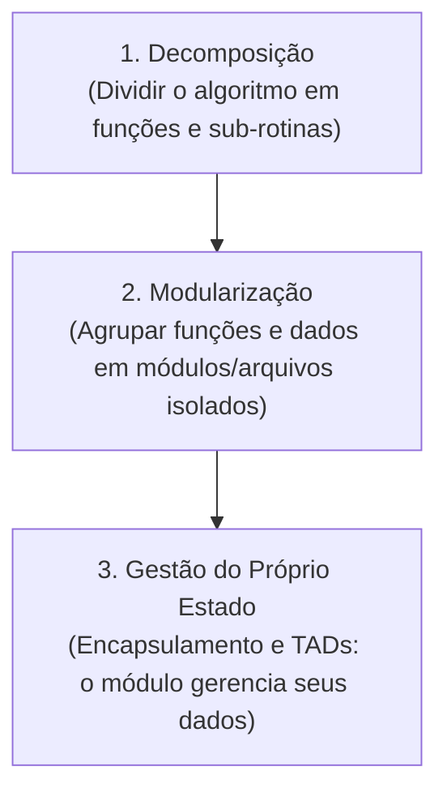
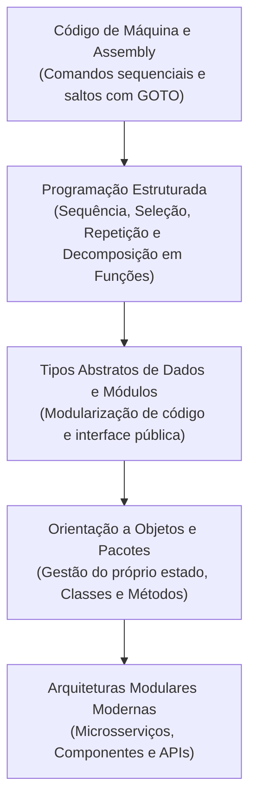
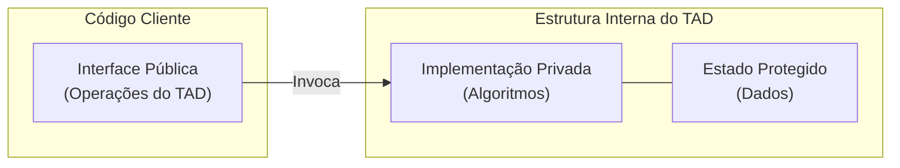

# Introdução à programação modular: da construção algorítmica à gestão do próprio estado

> **Contexto:** Visão geral da Programação Modular como paradigma essencial para o gerenciamento de complexidade em sistemas modernos, abordando o teorema da programação estruturada, a prova matemática de Böhm-Jacopini, a evolução histórica do controle de fluxo e o papel dos Tipos Abstratos de Dados (TADs).

---

## Introdução

Com a popularização e a ubiquidade da computação, os sistemas de software evoluíram de scripts simples e isolados para ecossistemas altamente integrados, distribuídos e complexos. À medida que a escala do software cresceu, a abordagem monolítica e desestruturada de codificação tornou-se insustentável.

A **programação modular** surge como uma técnica e paradigma de desenvolvimento projetado para gerenciar essa complexidade crescente. Em essência, a modularidade divide um sistema complexo em partes menores, independentes e interconectadas — chamadas de **módulos**.

Neste artigo, exploraremos a fundamentação algorítmica da programação modular, a transição histórica da programação estruturada e o surgimento dos Tipos Abstratos de Dados (TADs) para a gestão do próprio estado.

---

## 1. Algoritmos e a construção de software

Um **algoritmo** é uma sequência finita de instruções bem definidas e não ambíguas, destinadas à solução de um problema ou à execução de uma tarefa.

Antes de estruturar sistemas em módulos complexos, a lógica fundamental de qualquer programa baseia-se na combinação de três construções lógicas primitivas de controle de fluxo:

* **Comandos sequenciais:** instruções executadas de forma linear, uma após a outra, na ordem exata em que foram escritas.
* **Comandos de seleção (decisão):** estruturas que alteram o fluxo de execução com base em condições lógicas (`if/else`, `switch/case`).
* **Comandos de repetição (laços/iterações):** estruturas que permitem a execução reiterada de um bloco de código enquanto uma condição for satisfeita (`while`, `for`, `do-while`).

---

## 2. O paradigma da programação estruturada

A **programação estruturada** foi criada no final dos anos 1960 para organizar o fluxo de controle e eliminar a desordem do código primitivo.

### a. Teorema da Estrutura (Böhm-Jacopini, 1966)
Esse teorema provou matematicamente que qualquer algoritmo computável pode ser construído utilizando exclusivamente as três estruturas básicas de controle (sequência, seleção e repetição).

#### Como Böhm e Jacopini provaram isso?
Em 1966, Corrado Böhm e Giuseppe Jacopini demonstraram que qualquer fluxograma de programa desestruturado (contendo saltos arbitrários e desordenados com `GOTO`) pode ser convertido algoritmicamente em um fluxograma estruturado equivalente sem alterar seu resultado.

A prova baseou-se em dois pilares:
1. **Modelagem por autômatos e grafos de fluxo:** Todo programa pode ser representado por um grafo de controle de fluxo com um único ponto de entrada e um único ponto de saída (*Single-Entry, Single-Exit - SESE*).
2. **Introdução de variáveis de estado auxiliares:** Böhm e Jacopini mostraram que qualquer salto arbitrário (`GOTO`) pode ser neutralizado introduzindo uma variável de estado booleana e envolvendo o bloco de código em um laço de repetição (`while`) contendo verificações condicionais (`if/else`).

Dessa forma, provou-se que o `GOTO` não é estritamente necessário para expressar nenhuma lógica computável.

### b. Eliminação do `GOTO` e o "Código Espaguete"
Antes da programação estruturada, o controle de fluxo dependia de saltos incondicionais (`GOTO` ou desvios em Assembly), gerando o *spaghetti code* ("código espaguete"), no qual o fluxo saltava aleatoriamente por diversas partes do programa, dificultando o rastreamento do estado e de erros.

Em `1968`, **Edsger W. Dijkstra** publicou o artigo clássico *"Go To Statement Considered Harmful"*, consolidando a disciplina da programação estruturada como base para a engenharia de software moderna.

---

## 3. Três etapas da evolução da abstração no software

A construção de softwares escaláveis seguiu uma progressão lógica de abstração em três níveis:

1. **Decomposição (*Top-Down*):** consiste em quebrar um problema grande em sub-problemas menores resolvidos por funções isoladas.
2. **Modularização:** consiste em agrupar as funções e estruturas relacionadas em unidades de compilação ou arquivos separados, reduzindo acoplamento e evitando duplicação.
3. **Gestão do Próprio Estado (*Encapsulamento de Estado*):** estágio em que o módulo deixa de ser apenas um pacote de funções soltas e passa a **possuir, proteger e gerenciar seu próprio estado interno** (dados e variáveis).

---

## 4. Evolução histórica da programação e dos algoritmos

### Detalhamento dos estágios históricos

1. **Eras iniciais (Código de máquina e Assembly - Anos 1940-1950):** instruções sequenciais rígidas e saltos diretos no hardware.
2. **Programação estruturada e procedural (Anos 1960-1970):** consolidação dos comandos de seleção, repetição e funções isoladas (Pascal, C, Algol) através da **Decomposição**.
3. **Tipos abstratos de dados e módulos (Anos 1970-1980):** **Modularização** — agrupamento de dados e funções em módulos (Modula-2, Ada) com separação de interfaces.
4. **Orientação a objetos (Anos 1980-1990):** **Gestão do Próprio Estado** — união formal de estado (atributos) e comportamento (métodos) em classes (C++, Java).
5. **Sistemas modulares modernos e distribuídos (Anos 2000 em diante):** gerenciamento por pacotes e microsserviços totalmente desacoplados.

---

## 5. Tipos Abstratos de Dados (TADs)

Um **Tipo Abstrato de Dados (TAD)** representa a consolidação da gestão de estado no nível de estruturas de dados. Ele é definido estritamente pelo seu **comportamento público (operações)**, ocultando a **implementação interna concreta**.

### Exemplos clássicos de TADs

| TAD | Operações principais (interface) | Implementações concretas possíveis |
| --- | --- | --- |
| **Pilha (Stack)** | `push()`, `pop()`, `top()`, `isEmpty()` | Array estático ou Lista encadeada |
| **Fila (Queue)** | `enqueue()`, `dequeue()`, `front()`, `isEmpty()` | Array circular ou Lista encadeada |
| **Lista (List)** | `insert()`, `remove()`, `get()`, `size()` | Array dinâmico ou Lista duplamente encadeada |

---

## 6. Principais elementos de programação para escalabilidade

| Elemento | Descrição | Papel na escalabilidade |
| --- | --- | --- |
| **Comandos estruturados** | Estruturas sequenciais, de seleção e repetição | Dão previsibilidade ao fluxo algorítmico |
| **Funções (decomposição)** | Blocos isolados que executam uma tarefa específica | Isolam a complexidade instrucional |
| **Módulos (modularização)** | Agrupamento de funções e variáveis em arquivos | Organizam o projeto e delimitam escopos |
| **TADs / Encapsulamento** | Ocultamento da implementação e proteção do estado | Protegem a integridade dos dados |
| **Namespaces / Pacotes** | Agrupamento hierárquico | Evitam conflitos de identificadores |
| **Interfaces / Contratos** | Assinaturas de métodos sem expor detalhes | Garantem desacoplamento entre componentes |

---

## 7. Objetivos e benefícios da programação modular

1. **Corretude:** facilita a verificação e testes unitários automatizados de partes isoladas.
2. **Robustez:** reduz efeitos colaterais, isolando falhas dentro dos limites do módulo.
3. **Escalabilidade:** permite o desenvolvimento paralelo por equipes distintas.
4. **Reutilização e manutenibilidade:** habilita o reuso de componentes e reduz o impacto de alterações.

---

## Referências bibliográficas

### Bibliografia básica
* BÖHM, Corrado; JACOPINI, Giuseppe. **Flow diagrams, Turing machines and languages with only two formation rules**. Communications of the ACM, v. 9, n. 5, p. 366-371, May 1966. Disponível em: [https://dl.acm.org/doi/10.1145/355592.365646](https://dl.acm.org/doi/10.1145/355592.365646).
* SOMMERVILLE, Ian. **Engenharia de Software**. 10. ed. São Paulo: Pearson, 2019.

### Bibliografia complementar
* DIJKSTRA, Edsger W. **Go To Statement Considered Harmful**. Communications of the ACM, v. 11, n. 3, p. 147-148, 1968.
* TENENBAUM, Aaron M.; LANGSAM, Yedidyah; AUGENSTEIN, Moshe J. **Estruturas de Dados Usando C**. São Paulo: Makron Books, 1995.

---

## Artigos relacionados e navegação

* **Próximo artigo:** [[02. Funções e procedimentos]]
* **Resumo da disciplina:** [[00. Programação modular - Resumo]]
* **Índice geral do vault:** [[index.md|Página Inicial do Vault]]
