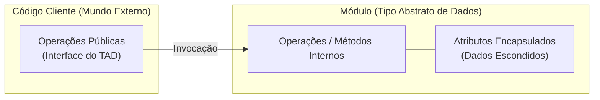

# Tipos abstratos de dados: a união de valores, operações e encapsulamento

> **Contexto:** Estudo formal dos Tipos Abstratos de Dados (TADs), abordando a definição de tipos de dados segundo a teoria dos conjuntos, a Orientação a Objetos como principal paradigma de implementação (Classes e Objetos), a regra de ouro do encapsulamento (atributos privados e operações públicas), a analogia do Caixa Eletrônico e a análise detalhada da classe Conta Bancária em C#.

---

## Introdução e definição de tipo de dados

Para compreender o conceito de um **Tipo Abstrato de Dados (TAD)**, é preciso primeiro definir o que é um **tipo de dado** na ciência da computação.

Um tipo de dado representa a união formal entre dois componentes:
1. **Um conjunto de valores** possíveis.
2. **Um conjunto de operações** bem definidas que podem ser aplicadas sobre esses valores.

### Relação com a Teoria dos Conjuntos
Essa definição fundamenta-se na **teoria dos conjuntos da matemática**: todos os valores pertencentes ao mesmo tipo compartilham as mesmas propriedades algébricas e estão sujeitos às mesmas regras e formas de manipulação. 

Por exemplo, no tipo matemático/computacional `Inteiro`:
* **Conjunto de valores:** $\{\dots, -2, -1, 0, 1, 2, \dots\}$
* **Operações permitidas:** $\{+, -, \times, \div, \bmod\}$

---

## 1. O que é um Tipo Abstrato de Dados (TAD)?

Um **Tipo Abstrato de Dados (TAD)** é um módulo especial que **encapsula (ou esconde)** a forma como seus elementos e dados internos são implementados fisicamente na memória, mas disponibiliza uma interface com operações públicas para que esses elementos sejam manipulados de forma segura pelo mundo externo.

Nestes casos, o **módulo passa a ser um tipo abstrato de dados**, agregando:
* **Atributos (Dados/Estado - Privados `private`):** a representação interna das informações armazenadas.
* **Operações (Métodos/Funções/Procedimentos - Públicos `public`):** as ações permitidas que podem ser aplicadas sobre os dados armazenados nesses atributos.



---

## 2. A intuição do Encapsulamento (Técnica de Feynman): O Caixa Eletrônico

Para entender por que **atributos são privados** e **operações são públicas**, pense em um **Caixa Eletrônico (ATM)**:

* **Atributos Privados (`private`):** O cofre de aço interno, as gavetas de dinheiro físico e os chips de contagem. Se o cofre fosse público, qualquer pessoa na rua poderia abrir a tampa com uma chave de fenda e alterar o saldo manualmente. O estado seria corrompido instantaneamente.
* **Operações Públicas (`public`):** A tela sensível ao toque, o teclado numérico e a abertura para retirada de cédulas (`Sacar()`, `Depositar()`, `ConsultarSaldo()`). Você só altera o dinheiro de dentro do cofre **passando obrigatoriamente pelas regras e validações da interface pública** (digitar a senha correta e verificar se há saldo suficiente).

---

## 3. A Orientação a Objetos como implementação de TADs

A **Programação Orientada a Objetos (POO)** é o principal paradigma de programação que implementa na prática o conceito de Tipos Abstratos de Dados:

> *"Neste paradigma, cada tipo representa uma **classe** de objetos, e cada objeto representa uma **instância** desta classe."*

* **Classe (O Tipo):** Funciona como o modelo/molde que define a estrutura dos dados (atributos) e quais operações (métodos) podem ser aplicadas $\rightarrow$ [[00. Sintaxe Multilinguagem/05. Abstração e encapsulamento com classes (TADs)|Veja o comparativo no Guia de Sintaxe]].
* **Objeto / Instância (O Valor do Conjunto):** Representa uma entidade concreta construída na memória a partir do modelo da classe, possuindo seu próprio estado independente.

---

## 4. Exemplo prático detalhado: Classe Conta Bancária em C#

Abaixo está a implementação completa da classe `Conta` em C#, seguida pelo detalhamento de cada uma das suas partes e papéis dentro do conceito de TAD:

```csharp
using System;
using System.Collections.Generic;

// 1. A CLASSE (MODELO DO TAD)
public class Conta 
{
  // 2. ATRIBUTOS PRIVADOS (ESTADO INTERNO ENCAPSULADO COM PREFIXO DE SUBLINHAR)
  private DateTime _criacao;
  private double _saldo = 0;

  // 3. CONSTRUTOR (INICIALIZAÇÃO CONTROLADA DA INSTÂNCIA)
  public Conta(double saldoInicial, DateTime criacao) 
  {
    _saldo = saldoInicial;
    _criacao = criacao;
  }
  
  // 4. PROPRIEDADE DE LEITURA (CONSULTA DE ATRIBUTO IMUTÁVEL)
  public DateTime DataCriacao 
  {
    get { return _criacao; }
  }

  // 5. OPERAÇÃO PÚBLICA DE SAQUE (FUNÇÃO QUE ALTERA ESTADO COM VALIDAÇÃO)
  public double Sacar(double quantia) {
    if (_saldo < quantia)
        throw new ArgumentException("Quantia de saque não permitida.", "quantia");
    _saldo -= quantia;
    return quantia;
  }

  // 6. OPERAÇÃO PÚBLICA DE DEPÓSITO (PROCEDIMENTO/MÉTODO VOID QUE ALTERA ESTADO)
  public void Depositar(double quantia) {
    if (quantia <= 0)
      throw new ArgumentException("Quantia de depósito não permitida.", "quantia");
    _saldo += quantia;
  }

  // 7. OPERAÇÃO DE CONSULTA DO ESTADO (GETTER)
  public double GetSaldo() {
    return _saldo;
  }
}

// 8. CÓDIGO CLIENTE (CONSUMIDOR DO TAD)
public class MainClass {
  public static void Main (string[] args) {
    // Instanciação: cria a instância 'contaDoZe' do tipo 'Conta'
    Conta contaDoZe = new Conta(1200, DateTime.Now);

    Console.WriteLine ("Saldo da conta do Ze: {0:C2}", contaDoZe.GetSaldo());

    double quantia = 212;
    Console.WriteLine ("Sacar {0:C2} da conta do Ze.", quantia);
    contaDoZe.Sacar(quantia);

    Console.WriteLine ("Saldo da conta do Ze: {0:C2}", contaDoZe.GetSaldo());
  }
}
```

---

## 5. Detalhamento componente a componente do código

### a. Definição da classe (`public class Conta`)
Representa a **criação do Tipo Abstrato de Dados**. Ela especifica o contrato e a estrutura que todas as contas bancárias criadas pelo programa seguirão $\rightarrow$ [[00. Sintaxe Multilinguagem/06. Modificadores de acesso, escopo e a palavra-chave static#1. Desconstrução do cabeçalho clássico em C# (Técnica de Feynman)|Entenda o papel de class no Guia de Sintaxe]].

### b. Atributos privados (`private DateTime _criacao;` e `private double _saldo = 0;`)
* **Papel:** Representam o **estado interno** da conta.
* **Encapsulamento e Prefixo `_`:** O modificador `private` e o sublinhado `_` protegem e identificam atributos privados de classe $\rightarrow$ [[00. Sintaxe Multilinguagem/06. Modificadores de acesso, escopo e a palavra-chave static#2. Por que usar o sublinhado (_) no início de atributos (_saldo, _criacao)?|Entenda o uso do sublinhado (_) no Guia de Sintaxe]].

### c. Construtor (`public Conta(double saldoInicial, DateTime criacao)`)
* **Papel:** É o procedimento responsável pela **instanciação e inicialização**.
* **Garantia de integridade:** Garante que nenhum objeto do tipo `Conta` seja criado na memória sem um saldo inicial e uma data de criação válidas.

### d. Propriedade de leitura (`public DateTime DataCriacao`)
* **Papel:** Expõe o acesso somente leitura (*read-only*) à data de criação.
* **Segurança:** Permite que o mundo externo consulte a data sem risco de modificá-la.

### e. Operação de saque (`public double Sacar(double quantia)`)
* **Papel:** É uma **função pública (abstração de expressão)** que realiza uma alteração de estado com validação $\rightarrow$ [[00. Sintaxe Multilinguagem/04. Sub-rotinas (funções e procedimentos)|Entenda a diferença de funções com retorno]].

### f. Operação de depósito (`public void Depositar(double quantia)`)
* **Papel:** É um **procedimento público (abstração de comandos - `void`)** que altera o estado interno $\rightarrow$ [[00. Sintaxe Multilinguagem/04. Sub-rotinas (funções e procedimentos)#2. Por que os procedimentos usam void em C#?|Entenda por que procedimentos usam void]].

### g. Operação de consulta (`public double GetSaldo()`)
* **Papel:** É uma **função de consulta de estado**.
* **Flexibilidade:** O código externo obtém o valor sem saber como a classe calcula ou armazena o saldo.

### h. O código cliente (`MainClass`)
* **Papel:** É o consumidor do TAD.
* **Desacoplamento:** O método `Main` interage com a instância `contaDoZe` **exclusivamente através da interface pública** (`Sacar`, `GetSaldo`), sem tocar nos atributos privados.

---

## 6. Vantagens práticas do encapsulamento demonstradas no exemplo

1. **Proteção de estado:** O cliente não pode forçar saldos inconsistentes ou negativos violando o encapsulamento.
2. **Integridade das regras de negócio:** Todas as operações financeiras são validadas obrigatoriamente pelos métodos da própria classe.
3. **Evolução sem quebras:** Se amanhã o banco decidir aplicar uma taxa de R$ 1,00 em todo saque dentro do método `Sacar()`, essa alteração é feita em **um único lugar** (na classe `Conta`), sem afetar nenhuma linha da `MainClass`.

---

## 7. Exemplos clássicos de TADs em Estruturas de Dados

| Tipo Abstrato de Dados (TAD) | Atributos internos (Encapsulados) | Operações públicas (Interface) | Aplicação e comportamento | Guia de Sintaxe |
| --- | --- | --- | --- | --- |
| **Pilha (*Stack*)** | Array ou Lista encadeada + topo | `push(item)`, `pop()`, `top()`, `isEmpty()` | Acesso LIFO (*Last In, First Out*). | [[00. Sintaxe Multilinguagem/05. Abstração e encapsulamento com classes (TADs)\|Sintaxe]] |
| **Fila (*Queue*)** | Array circular ou Lista encadeada | `enqueue(item)`, `dequeue()`, `front()` | Acesso FIFO (*First In, First Out*). | [[00. Sintaxe Multilinguagem/05. Abstração e encapsulamento com classes (TADs)\|Sintaxe]] |
| **Conta Bancária** | `_saldo`, `_criacao` | `Depositar()`, `Sacar()`, `GetSaldo()` | Gestão de saldo e histórico financeiro. | [[00. Sintaxe Multilinguagem/05. Abstração e encapsulamento com classes (TADs)\|Sintaxe]] |

---

## Referências bibliográficas

### Bibliografia básica
* LISKOV, Barbara; ZILLES, Stephen. **Programming with Abstract Data Types**. ACM SIGPLAN Notices, v. 9, n. 4, p. 50-59, April 1974. Disponível em: [https://dl.acm.org/doi/10.1145/942572.807045](https://dl.acm.org/doi/10.1145/942572.807045).
* WIRTH, Niklaus. **Algorithms + Data Structures = Programs**. Englewood Cliffs: Prentice-Hall, 1976.
* SOMMERVILLE, Ian. **Engenharia de Software**. 10. ed. São Paulo: Pearson, 2019.

### Bibliografia complementar
* TENENBAUM, Aaron M.; LANGSAM, Yedidyah; AUGENSTEIN, Moshe J. **Estruturas de Dados Usando C**. São Paulo: Makron Books, 1995.
* SEBESTA, Robert W. **Conceitos de Linguagens de Programação**. 11. ed. Porto Alegre: Bookman, 2018.

---

## Artigos relacionados e navegação

* **Artigo anterior:** [[02. Funções e procedimentos]]
* **Próximo artigo:** [[04. Programação orientada a objetos e acoplamento]]
* **Resumo da disciplina:** [[00. Programação modular - Resumo]]
* **Guia de Sintaxe Multilinguagem:** [[00. Sintaxe Multilinguagem/00. Guia multilinguagem de sintaxe e praticas - Índice]]
* **Índice geral do vault:** [[index.md|Página Inicial do Vault]]
