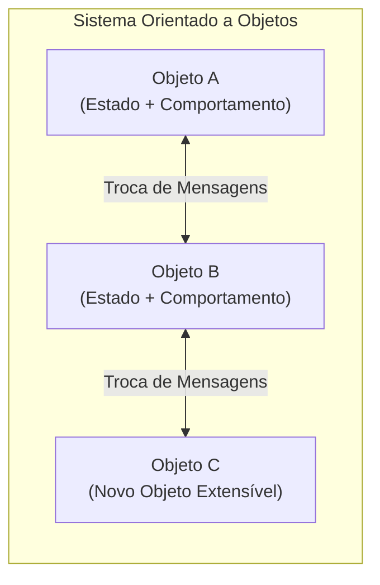
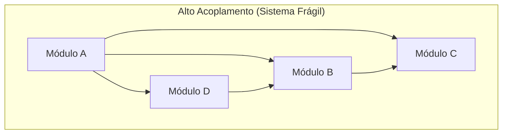

# Programação orientada a objetos e acoplamento

> **Contexto:** Estudo da Programação Orientada a Objetos (POO) como evolução dos Tipos Abstratos de Dados, abordando o princípio de ocultação de informação, reusabilidade, extensibilidade, a visão original de Alan Kay e o desafio do alto acoplamento na arquitetura modular.

---

## Introdução

A partir dos **Tipos Abstratos de Dados (TADs)**, um sistema de software passa a ser decomposto em unidades independentes que provêm funcionalidades específicas sobre uma entidade de dados. 

Para que essa decomposição seja verdadeiramente efetiva, um módulo deve obedecer rigorosamente ao **princípio da ocultação da informação** (*Information Hiding*), no qual os atributos de um módulo devem ser mantidos ocultos dos usuários externos deste módulo.

---

## 1. O paradigma da programação orientada a objetos

A **Orientação a Objetos (POO)** abstrai o mundo real modelando o sistema como um conjunto de **objetos que interagem entre si**.

A POO eleva a qualidade do desenvolvimento promovendo duas propriedades fundamentais:

* **Reusabilidade:** objetos bem projetados podem ser reutilizados em outros sistemas ou partes da aplicação que demandem a mesma funcionalidade, sem a necessidade de reescrever código.
* **Extensibilidade:** novos objetos e funcionalidades podem ser acrescentados ao sistema sem causar impacto ou quebrar os objetos já existentes.

---

## 2. Reflexão histórica: a visão original de Alan Kay (1967)

Quando **Alan Kay** criou o termo *Programação Orientada a Objetos* por volta de 1967 (no contexto da linguagem Smalltalk), sua teoria conceitual propunha que:

> *"Módulos independentes não devem compartilhar seus dados diretamente, mas sim funcionar como miniprogramas autônomos que se comunicam através da troca de mensagens."*

Essa visão tinha como objetivo permitir a criação de sistemas altamente complexos a partir da composição de módulos simples e isolados, evitando retrabalho e garantindo maior **corretude** e **robustez** ao código.

---

## 3. O problema do alto acoplamento em sistemas modulares

À medida que os sistemas crescem em escala e complexidade, surge um grande desafio na arquitetura de software: o **alto acoplamento**.

### O que é acoplamento?
* **Alto acoplamento:** ocorre quando um módulo depende diretamente de diversos outros módulos para funcionar. Isso gera um "efeito dominó": qualquer alteração em um módulo pode quebrar imprevisivelmente várias outras partes do sistema.
* **Baixo acoplamento (Objetivo da Engenharia):** ocorre quando os módulos possuem o mínimo de dependências diretas entre si, interagindo estritamente por meio de interfaces estáveis e contratos bem definidos.

Ao decompormos um sistema em módulos ou objetos, o objetivo primordial deve ser **maximizar a coesão interna do módulo e minimizar seu acoplamento externo**.

---

## 4. Comparativo de características arquiteturais

| Conceito | Alto Acoplamento (Evitar) | Baixo Acoplamento (Buscar) |
| --- | --- | --- |
| **Dependência** | Módulo conhece detalhes de vários outros módulos | Módulo conhece apenas contratos/interfaces mínimas |
| **Manutenibilidade** | Alterar um código causa quebras em cascata | Alterações ficam isoladas dentro do próprio módulo |
| **Testabilidade** | Difícil testar um módulo isolado sem carregar o sistema todo | Teste unitário simples com dublês/mocks |
| **Reusabilidade** | Impossível reutilizar um módulo sem arrastar todo o sistema | Módulo reutilizável de forma independente |

---

## Referências bibliográficas

### Bibliografia básica
* SOMMERVILLE, Ian. **Engenharia de Software**. 10. ed. São Paulo: Pearson, 2019.
* KAY, Alan. **The Early History of Smalltalk**. ACM SIGPLAN Notices, v. 28, n. 3, p. 69-95, 1993.

### Bibliografia complementar
* MARTIN, Robert C. **Código Limpo: Habilidades Práticas do Agile Software**. Rio de Janeiro: Alta Books, 2011.
* SEBESTA, Robert W. **Conceitos de Linguagens de Programação**. 11. ed. Porto Alegre: Bookman, 2018.

---

## Artigos relacionados e navegação

* **Artigo anterior:** [[03. Tipos abstratos de dados]]
* **Resumo da disciplina:** [[00. Programação modular - Resumo]]
* **Índice geral do vault:** [[index.md|Página Inicial do Vault]]
