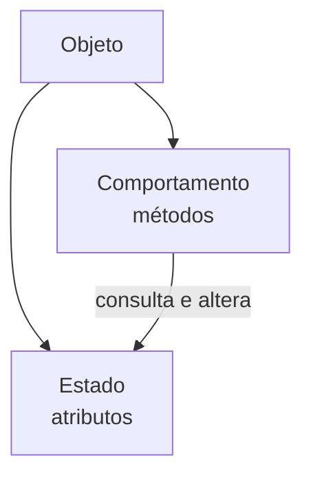
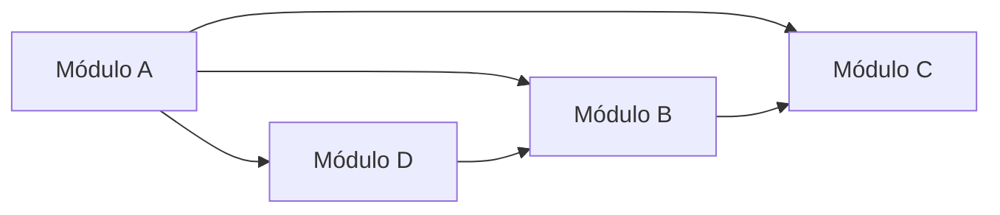

# Programação orientada a objetos e acoplamento

> **Contexto:** Estudo da Programação Orientada a Objetos (POO) como evolução natural dos Tipos Abstratos de Dados, explicando detalhadamente o que é um objeto através da Técnica de Feynman, o princípio de ocultação de informação, reusabilidade, extensibilidade, a visão histórica de Alan Kay e o desafio do acoplamento vs. coesão na arquitetura de software.

---

## Orientação a objetos no contexto da modularidade

A partir dos **Tipos Abstratos de Dados (TADs)**, um sistema de software passa a ser decomposto em unidades independentes que provêm funcionalidades específicas sobre uma entidade de dados.

==Para que essa decomposição seja verdadeiramente efetiva, um módulo deve obedecer rigorosamente ao **princípio da ocultação da informação** (*Information Hiding*), no qual os atributos de um módulo devem ser mantidos ocultos dos usuários externos deste módulo.==

---

## Objetos como identidade, estado e comportamento

Na programação tradicional (procedural), dados e funções viviam separados: você tinha variáveis soltas de um lado e funções soltas do outro passando dados para lá e para cá.

==A **Orientação a Objetos (POO)** surge para unir essas duas metades em uma única entidade autônoma: o **Objeto**.==

### Intuição: objetos do mundo real como modelo mental
Pense em qualquer coisa física à sua volta, como um **Smartphone**:
1. **O que ele TEM (estado / atributos):** Ele possui bateria (ex.: 85%), tela ligada (`true`), modelo (`"iPhone"`), volume (7). Esses são os dados internos do objeto.
2. **O que ele FAZ (comportamento / métodos):** Ele pode `TocarMusica()`, `RecarregarBateria()`, `TirarFoto()`. Essas são as funções que operam sobre o seu estado.
3. **Identidade própria:** O seu smartphone é único. Se você tirar uma foto com o seu aparelho, a memória do smartphone do seu amigo não é alterada.

> ==**Definição técnica:** Um **objeto** é uma instância concreta de uma classe alocada na memória RAM, que encapsula **estado** (atributos/dados privados) e **comportamento** (métodos/operações públicas), possuindo uma **identidade única** no sistema.==

---

## A diferença fundamental: classe vs. objeto

* **Classe (a planta da casa / a forma de bolo):** É o código estático escrito no arquivo `.cs` ou `.java`. Ela não gasta memória de execução; é apenas o molde que define as regras → [[00. Sintaxe Multilinguagem/05. Abstração e encapsulamento com classes (TADs)|Sintaxe de Classes]].
* **Objeto (a casa construída / o bolo assado):** É o que ganha vida na memória RAM quando você executa o comando `new Conta(1200, DateTime.Now)`. Você pode criar centenas de objetos diferentes a partir de uma única classe!

---

## Propriedades essenciais da Orientação a Objetos

A POO eleva a qualidade do desenvolvimento promovendo duas propriedades fundamentais:

* ==**Reusabilidade:** objetos bem projetados podem ser reutilizados em outros sistemas ou partes da aplicação que demandem a mesma funcionalidade, sem a necessidade de reescrever código.==
* **Extensibilidade:** novos objetos e funcionalidades podem ser acrescentados ao sistema sem causar impacto ou quebrar os objetos já existentes.

---

## Reflexão histórica: a visão original de Alan Kay (1967)

Quando **Alan Kay** criou o termo *Programação Orientada a Objetos* por volta de 1967 (no contexto da linguagem Smalltalk), sua teoria conceitual inspirava-se na **biologia celular**:

> *"Módulos independentes não devem compartilhar seus dados diretamente, mas sim funcionar como pequenas células vivas autônomas que se comunicam exclusivamente através da troca de mensagens."*

Assim como uma célula biológica protege seu núcleo por uma membrana e se comunica com as outras por sinais químicos, ==um **objeto protege seu estado interno por encapsulamento** e se comunica com outros objetos invocando seus métodos públicos.==

---

## O problema do acoplamento vs. coesão em sistemas modulares

À medida que os sistemas crescem em escala e complexidade, o maior desafio na arquitetura orientada a objetos é manter o **baixo acoplamento** e a **alta coesão**.

### O que é acoplamento?
* ==**Alto acoplamento:** ocorre quando um objeto precisa conhecer detalhes íntimos de vários outros objetos para funcionar. Isso gera um "efeito dominó": qualquer alteração em um objeto quebra imprevisivelmente várias outras partes do sistema.==
* ==**Baixo acoplamento (Objetivo da Engenharia):** ocorre quando os objetos possuem o mínimo de dependências diretas entre si, interagindo estritamente por meio de interfaces estáveis e contratos bem definidos.==

### O que é coesão?
* ==**Alta coesão:** cada objeto tem **uma única responsabilidade bem focada** (ex.: a classe `Conta` só cuida de saldo e movimentação financeira, não formata texto na tela nem envia emails==).

---

## Comparativo de características arquiteturais

| Conceito | Alto Acoplamento (Evitar) | Baixo Acoplamento (Buscar) |
| --- | --- | --- |
| **Dependência** | Módulo conhece detalhes de vários outros módulos | Módulo conhece apenas contratos/interfaces mínimas |
| **Manutenibilidade** | Alterar um código causa quebras em cascata | Alterações ficam isoladas dentro do próprio módulo |
| **Testabilidade** | Difícil testar um módulo isolado sem carregar o sistema todo | Teste unitário simples com dublês/mocks |
| **Reusabilidade** | Impossível reutilizar um módulo sem arrastar todo o sistema | Módulo reutilizável de forma independente |

---

## Referências bibliográficas

### Bibliografia básica
* SOMMERVILLE, Ian. **Engenharia de Software**. 10. ed. São Paulo: Pearson, 2019.
* KAY, Alan. **The Early History of Smalltalk**. ACM SIGPLAN Notices, v. 28, n. 3, p. 69-95, 1993.

### Bibliografia complementar
* MARTIN, Robert C. **Código Limpo: Habilidades Práticas do Agile Software**. Rio de Janeiro: Alta Books, 2011.
* SEBESTA, Robert W. **Conceitos de Linguagens de Programação**. 11. ed. Porto Alegre: Bookman, 2018.

---

## Artigos relacionados

* **Artigo anterior:** [[03. Tipos abstratos de dados]]
* **Próximo artigo:** [[05. Fatores externos de qualidade de software]]
* **Resumo da disciplina:** [[00. Programação modular - Resumo]]
* **Guia de Sintaxe Multilinguagem:** [[00. Sintaxe Multilinguagem/05. Abstração e encapsulamento com classes (TADs)]]
* **Índice geral do vault:** [[index.md|Página Inicial do Vault]]
