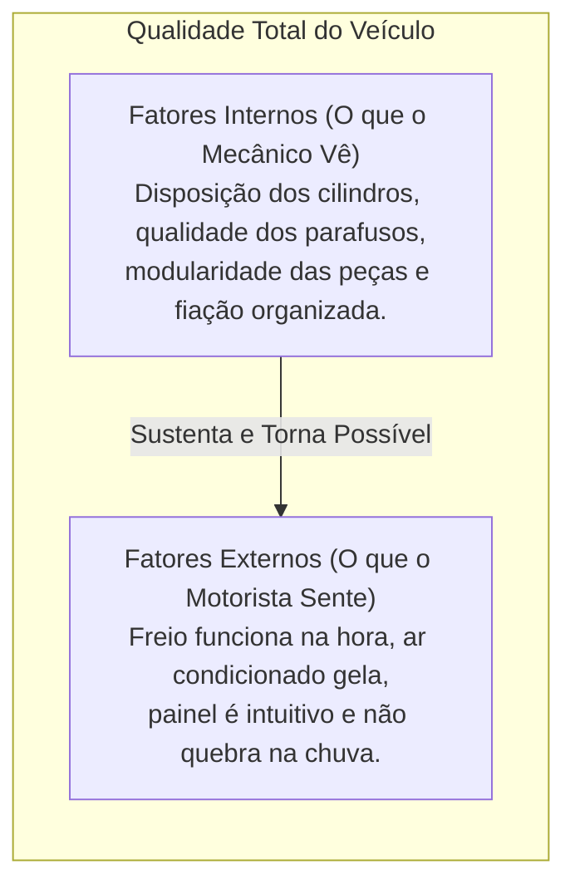
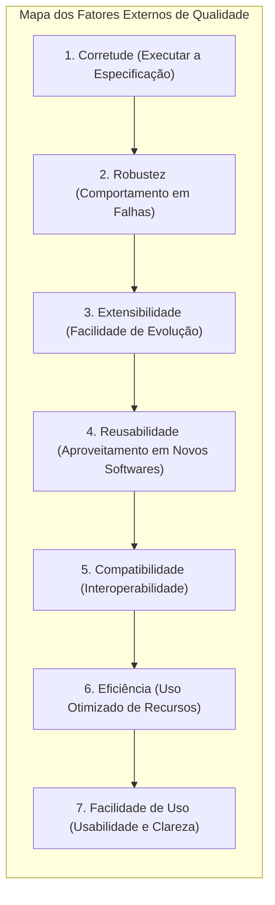
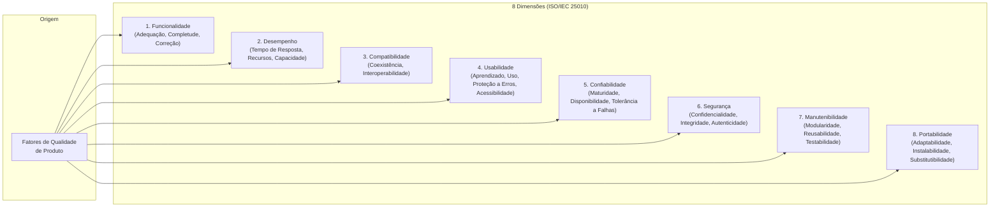
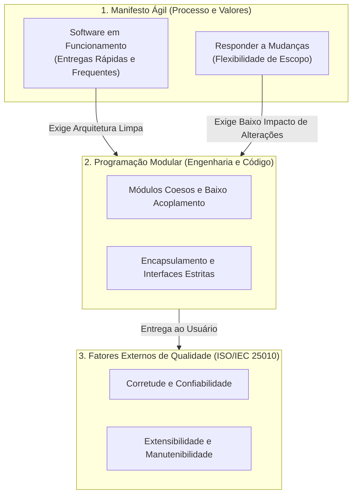

# Fatores externos de qualidade de software: a perspectiva do usuário

> **Contexto:** Estudo formal da qualidade de software segundo a Engenharia de Software e a obra clássica de Bertrand Meyer (*Object-Oriented Software Construction*), diferenciando os fatores externos (perceptíveis pelos usuários finais) dos fatores internos (técnicos e arquiteturais), e detalhando cada um dos critérios essenciais de qualidade com analogias práticas pela Técnica de Feynman.

---

## 1. O que são fatores externos e internos? (Técnica de Feynman)

Imagine que você vai comprar um **automóvel novo**:

Na Engenharia de Software:
* **Fatores Externos:** São as qualidades do sistema **diretamente perceptíveis pelos usuários, clientes e operadores** durante a execução do programa (ex.: se o app é rápido, se calcula a conta sem erros, se não trava quando a internet oscila e se é fácil de usar).
* **Fatores Internos:** São as qualidades do código-fonte e da arquitetura perceptíveis **apenas pelos desenvolvedores e mantenedores** (ex.: legibilidade, modularidade, baixo acoplamento e coesão).

> **A regra de ouro de Bertrand Meyer:**
> Os fatores internos **não têm valor por si próprios**; o único objetivo de escrever um código modular, limpo e com baixo acoplamento é **tornar possível a entrega de fatores externos de alta qualidade ao usuário final**.

---

## 2. Os principais fatores externos de qualidade

---

### 1. Corretude (*Correctness*)
* **Definição:** É a capacidade de um software executar **exatamente** aquilo que foi definido em sua especificação de requisitos sob condições normais de operação.
* **Analogia de Feynman:** Uma calculadora de bolso. Se você digita $2 + 2$, ela precisa obrigatoriamente mostrar $4$. Se mostrar $5$, não importa quão bonita seja a tela, o produto falhou em seu requisito primário.
* **Critério de Avaliação:** Testes funcionais, testes de unidade e provas formais de conformidade com os requisitos.

---

### 2. Robustez (*Robustness*) e Degradação Graciosa (*Graceful Degradation*)
* **Definição:** É a capacidade do sistema de **reagir de forma aceitável e segura diante de situações anormais ou imprevistas** (como entradas inválidas, falha de rede ou queda de microsserviços), sem sofrer travamentos catastróficos (*crashes*).
* **O conceito de Degradação Graciosa (*Graceful Degradation*):**
  - Em vez de o sistema "morrer" por completo diante de uma falha parcial, ele **reduz temporariamente o nível de sofisticação do serviço**, mantendo as funções essenciais operacionais.
  - O software prefere entregar uma funcionalidade simplificada com aviso claro ao usuário a fechar a janela com uma tela de erro em branco.
* **Analogia de Feynman:** Um **smartphone no modo de economia de energia**. Quando a bateria chega a 5%, o aparelho não desliga na hora: ele desativa os efeitos visuais, reduz o brilho da tela e desliga o 5G em segundo plano, mas **mantém a capacidade de fazer chamadas de emergência**.
* **Exemplos práticos no mundo real:**
  - **Netflix / YouTube:** Se a sua conexão Wi-Fi oscilar bruscamente, o vídeo não trava nem fecha o app; ele automaticamente reduz a resolução de 4K para 480p para manter a reprodução contínua.
  - **E-commerce:** Se o microsserviço de recomendação de produtos com inteligência artificial cair, a página de checkout e pagamento continua funcionando normalmente exibindo produtos populares estáticos.
* **Como se aplica em código:** Arquiteturas resilientes com tratamento de exceções (`try / catch`), fallbacks de contingência, padrão *Circuit Breaker* e cache local offline.

---

### 3. Extensibilidade (*Extendibility*)
* **Definição:** A facilidade com que o software pode ser **adaptado e modificado para atender a novas necessidades e mudanças de requisitos** sem que a estrutura inteira precise ser reescrita.
* **Analogia de Feynman:** Uma casa construída com tomadas padronizadas e fiação em conduítes. Se você quiser instalar um ar condicionado novo daqui a 2 anos, não precisa derrubar as paredes da casa inteira para passar um fio.
* **Princípios que a viabilizam:** Modularidade estrita, ocultamento de informação (*Information Hiding*) e baixo acoplamento.

---

### 4. Reusabilidade (*Reusability*)
* **Definição:** A capacidade de elementos e módulos do software serem **reutilizados na construção de novas aplicações e sistemas diferentes**.
* **Analogia de Feynman:** Peças de Lego. Uma peça retangular de 4 pinos pode ser usada hoje para construir um castelo e, amanhã, ser desmontada e usada para montar uma nave espacial sem precisar ser remodelada.
* **Exemplo prático:** Bibliotecas de autenticação OAuth, classes de validação de CPF ou pacotes de manipulação de coleções (`List<T>`, `Stack<T>`).

---

### 5. Compatibilidade (*Compatibility*)
* **Definição:** A facilidade com que múltiplos módulos e softwares conseguem ser **combinados entre si e interoperar**, trocando dados em formatos universais e padronizados.
* **Analogia de Feynman:** O padrão USB ou tomada de dois pinos. Você consegue plugar qualquer teclado ou pendrive em qualquer computador do mundo porque todos concordam com o mesmo formato físico e de comunicação.
* **Exemplo prático:** APIs RESTful que se comunicam via JSON, bancos relacionais via SQL padrão e formatos abertos (XML, CSV).

---

### 6. Eficiência (*Efficiency*)
* **Definição:** A capacidade do software de consumir a **menor quantidade possível de recursos computacionais** (tempo de processamento de CPU, memória RAM, largura de banda de rede e bateria) para realizar sua tarefa.
* **Analogia de Feynman:** O consumo de combustível de um automóvel. Fazer uma viagem de 100 km gastando 5 litros de gasolina versus gastar 30 litros para chegar ao mesmo destino.
* **Impacto no usuário:** Aplicativos leves que abrem em milissegundos e não esgotam a bateria do smartphone.

---

### 7. Facilidade de uso / Usabilidade (*Ease of Use*)
* **Definição:** O nível de simplicidade, clareza e esforço mental necessário para que pessoas com diferentes perfis aprendam e utilizem as funções do software.
* **Analogia de Feynman:** Uma maçaneta de porta redonda versus uma maçaneta de alavanca com indicação clara de "Puxe / Empurre". O usuário não deve precisar ler um manual de 50 páginas para conseguir acender a luz da sala.
* **Conexão com Design de Interação:** Guiado diretamente pelas Heurísticas de Usabilidade de Nielsen, consistência visual, feedbacks claros e prevenção de erros.

---

## 3. Matriz comparativa: fatores de qualidade vs. impacto para o usuário

| Fator Externo | Pergunta-chave do Usuário | O que acontece se faltar? |
| :--- | :--- | :--- |
| **Corretude** | *"O software faz o cálculo certo?"* | O cliente perde dinheiro, toma decisões erradas e rejeita o sistema. |
| **Robustez** | *"Se eu digitar errado ou cair a luz, o sistema quebra?"* | O programa fecha sozinho (*crash*), corrompe dados e gera frustração. |
| **Extensibilidade** | *"A empresa consegue lançar a nova funcionalidade rápido?"* | O software fica obsoleto porque qualquer alteração custa milhões e meses de trabalho. |
| **Reusabilidade** | *"Novos produtos e módulos chegam mais rápido ao mercado?"* | A equipe reinventa a roda a cada projeto novo, aumentando custos e bugs. |
| **Compatibilidade** | *"Consigo integrar esse sistema com meu banco ou ERP?"* | O sistema vira uma ilha isolada que não se conecta a nada. |
---

## 4. O modelo formal de qualidade da ISO/IEC 25010 (PUC Minas)

Além da visão clássica de Bertrand Meyer, a Engenharia de Software padronizou os fatores de qualidade de produto através da norma internacional **ISO/IEC 25010**, adotada formalmente pela PUC Minas.

O modelo decompõe a qualidade de software em **8 características principais** e suas respectivas **subcaracterísticas**:

### Detalhamento das 8 dimensões e suas subcaracterísticas:

1. **Funcionalidade (*Functional Suitability*):**
   - **Adequação:** Fornece o conjunto apropriado de funções para tarefas específicas.
   - **Completude:** Cobre todas as tarefas e objetivos especificados pelo usuário.
   - **Correção:** Produz resultados corretos com o nível de precisão necessário.

2. **Desempenho (*Performance Efficiency*):**
   - **Tempo de Resposta:** Tempo de processamento e latência na execução de tarefas.
   - **Utilização de Recursos:** Quantidade e tipos de recursos consumidos (CPU, RAM, disco, rede).
   - **Capacidade:** Limites máximos de usuários simultâneos ou volume de transações suportados.

3. **Compatibilidade (*Compatibility*):**
   - **Coexistência:** Capacidade de compartilhar o mesmo ambiente de hardware/SO com outros softwares sem impacto mútuo.
   - **Interoperabilidade:** Capacidade de trocar informações com outros sistemas (APIs, integrações).

4. **Usabilidade (*Usability*):**
   - **Adequação Reconhecível:** Facilidade do usuário entender se o software atende às suas necessidades.
   - **Facilidade de Aprendizado (*Learnability*):** Rapidez com que o usuário aprende a operar o sistema.
   - **Facilidade de Uso (*Operability*):** Esforço mínimo para controlar e operar as funções.
   - **Proteção contra Erros de Usuário:** Prevenção ativa de ações incorretas do usuário.
   - **Estética da Interface:** Apresentação visual harmoniosa, clara e agradável.
   - **Acessibilidade:** Utilização inclusiva por pessoas com diferentes tipos de deficiência (auditiva, motora, visual).

5. **Confiabilidade (*Reliability*):**
   - **Maturidade:** Frequência reduzida de falhas sob condições normais de uso.
   - **Disponibilidade:** Proporção de tempo em que o software está acessível e operacional.
   - **Tolerância a Falhas:** Capacidade de continuar funcionando mesmo na presença de erros parciais.
   - **Recuperabilidade:** Capacidade de restabelecer dados e estado após interrupções ou quedas.

6. **Segurança (*Security*):**
   - **Confidencialidade:** Garantia de que apenas pessoas autorizadas acessem os dados.
   - **Integridade:** Proteção contra alteração ou exclusão não autorizada de dados.
   - **Não-Repúdio:** Comprovação irrefutável de que uma ação ou transação foi realizada por determinado usuário.
   - **Autenticidade:** Confirmação da identidade do usuário ou sistema comunicante.
   - **Responsabilidade (*Accountability*):** Rastreabilidade das ações de cada usuário através de logs de auditoria.

7. **Manutenibilidade (*Maintainability*):**
   - **Modularidade:** Grau em que o sistema é composto por módulos discretos e independentes.
   - **Reusabilidade:** Capacidade de reaproveitar componentes em outros módulos ou softwares.
   - **Analisabilidade:** Facilidade de diagnosticar causas de falhas ou identificar partes a modificar.
   - **Modificabilidade:** Facilidade de implementar alterações sem introduzir novos bugs.
   - **Testabilidade:** Facilidade com que critérios de teste podem ser estabelecidos e validados.

8. **Portabilidade (*Portability*):**
   - **Adaptabilidade:** Capacidade de rodar em diferentes ambientes de hardware, SOs e navegadores.
   - **Instalabilidade:** Facilidade de instalar e desinstalar o sistema no ambiente de destino.
   - **Substitutibilidade:** Facilidade de substituir outro software pelo produto sem perda de continuidade.

---

## 5. A ponte entre o manifesto ágil, fatores de qualidade e programação modular

Como demonstrado no estudo de Arcos-Medina & Mauricio (2020), a **Programação Modular** é a disciplina técnica que viabiliza na prática os valores e princípios do **Manifesto Ágil** para atender aos critérios da **ISO/IEC 25010**.

### Como esses três pilares se conectam:

1. **"Software em funcionamento mais que documentação abrangente" $\leftrightarrow$ Corretude e Robustez:**
   - Para entregar software funcionando a cada sprint de 2 semanas, o código precisa ser modular. Módulos pequenos e isolados permitem **Testes de Unidade automatizados e Integração Contínua (CI)**, garantindo **Corretude** funcional sem que novos códigos quebrem partes antigas.

2. **"Responder a mudanças mais que seguir um plano" $\leftrightarrow$ Extensibilidade e Modificabilidade:**
   - Se o software for um monólito rígido e acoplado, qualquer mudança de requisito exigida pelo cliente no meio do projeto custará semanas de refatoração arriscada.
   - A **Programação Modular com baixo acoplamento** isola as regras de negócio em componentes independentes: uma nova funcionalidade é adicionada plugando um novo módulo, sem mexer no que já está testado e homologado.

3. **"Atenção contínua à excelência técnica e bom design aumenta a agilidade":**
   - O 9º princípio do Manifesto Ágil afirma explicitamente que a velocidade sustentável só existe se houver **excelência na arquitetura interna (Modularidade, TADs e Encapsulamento)**. Sem isso, a dívida técnica explode e o software perde a sua **Manutenibilidade**.

---

## Referências bibliográficas

### Bibliografia básica
* MEYER, Bertrand. **Object-Oriented Software Construction**. 2. ed. Prentice Hall, 1997.
* SOMMERVILLE, Ian. **Engenharia de Software**. 10. ed. São Paulo: Pearson, 2019.

### Bibliografia complementar
* ARCOS-MEDINA, G.; MAURICIO, D. **The Influence of the Application of Agile Practices in Software Quality Based on ISO/IEC 25010 Standard**. International Journal of Information Technologies and Systems Approach (IJITSA), v. 13, n. 2, p. 27-53, 2020. Disponível em: [http://doi.org/10.4018/IJITSA.2020070102](http://doi.org/10.4018/IJITSA.2020070102).
* ISO/IEC. **ISO/IEC 25010: Systems and software engineering — Systems and software Quality Requirements and Evaluation (SQuaRE) — System and software quality models**. ISO, 2011. Disponível em: [https://iso25000.com/index.php/en/iso-25000-standards/iso-25010](https://iso25000.com/index.php/en/iso-25000-standards/iso-25010).
* PRESSMAN, Roger S.; MAXIM, Bruce R. **Engenharia de Software: Uma Abordagem Profissional**. 8. ed. Porto Alegre: AMGH, 2016.
* NIELSEN, Jakob. **Usability Engineering**. Morgan Kaufmann, 1994.

---

## Artigos relacionados e navegação

* **Artigo anterior:** [[04. Programação orientada a objetos e acoplamento]]
* **Próximo artigo:** [[06. Fatores internos de qualidade de software]]
* **Resumo da disciplina:** [[00. Programação modular - Resumo]]
* **Glossário da disciplina:** [[Glossário de conceitos]]
* **Conexão em Engenharia de Requisitos:** [[07. Engenharia de Requisitos/04. Requisitos funcionais e não-funcionais]]
* **Conexão em Design de Interação:** [[08. Design de Interacao/07. Atributos de qualidade em sistemas interativos - usabilidade, comunicabilidade, acessibilidade e experiência de uso]]
* **Índice geral do vault:** [[index.md|Página Inicial do Vault]]
