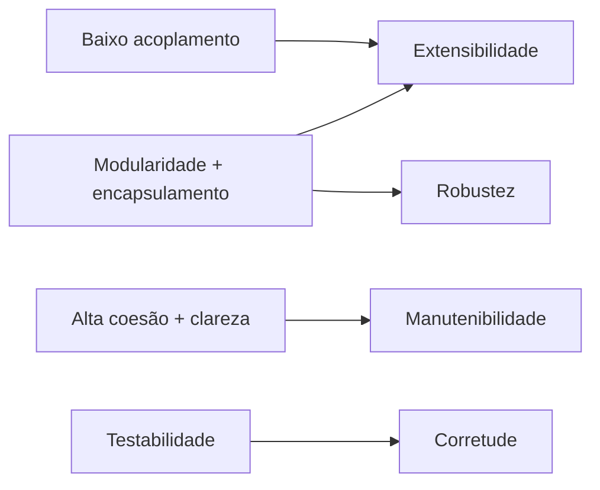

# Fatores internos de qualidade de software: a perspectiva do desenvolvedor

> **Contexto:** Estudo aprofundado dos fatores internos de qualidade de software segundo a Engenharia de Software e a obra de Bertrand Meyer, explorando os elementos de código que afetam a qualidade interna (modularidade, coesão, acoplamento, legibilidade, encapsulamento e testabilidade) explicados pela Técnica de Feynman.

---

## Qualidade interna e estrutura do software

Imagine a construção de um **edifício residencial**:

Na engenharia de software:
* **Fatores internos:** São as qualidades intrínsecas da **arquitetura, do design e do código-fonte** que são percebidas **exclusivamente pelos desenvolvedores, arquitetos e equipes de engenharia**.
* O usuário final nunca vê o código-fonte em C#, Java ou Python, mas **sofre diretamente o impacto** caso a estrutura interna esteja apodrecida (*dívida técnica* e *código espaguete*).

> **A regra de ouro de Bertrand Meyer:**
> *"A qualidade interna é o único meio viável para se atingir a qualidade externa de forma econômica e sustentável ao longo do tempo."*

---

## Os principais fatores internos de qualidade

| Fator interno | Efeito esperado na estrutura |
| :--- | :--- |
| Modularidade | Partes com fronteiras claras |
| Alta coesão | Responsabilidades relacionadas permanecem juntas |
| Baixo acoplamento | Mudanças locais propagam menos efeitos |
| Ocultamento de informação | Detalhes internos ficam protegidos |
| Legibilidade | Código mais fácil de entender e revisar |
| Testabilidade | Comportamentos podem ser verificados isoladamente |
| Reusabilidade estrutural | Componentes podem ser reaproveitados em novos contextos |

---

### Modularidade (*Modularity*)
* **Definição:** A propriedade que um sistema possui de ser decomposto em um conjunto de **módulos independentes e bem delimitados**, cada um com uma interface pública clara e uma implementação privada.
* **Analogia de Feynman:** Um quadro de disjuntores elétricos. Se o chuveiro queimar, apenas o disjuntor do banheiro desarma. A casa inteira não fica sem luz, e o eletricista sabe exatamente em qual ponto intervir.
* **Como se aplica em código:** Separação de responsabilidades em arquivos `.cs` / `.java`, pacotes, namespaces e bibliotecas de classes.

---

### Alta coesão (*High Cohesion*)
* **Definição:** O grau em que todos os elementos internos de uma classe ou módulo pertencem conceitualmente ao mesmo propósito e colaboram estritamente para uma **única responsabilidade**.
* **Analogia de Feynman:** Uma tesoura cirúrgica. Ela faz uma única tarefa com precisão cirúrgica. Compare isso com um canivete suíço gigante com 50 lâminas: ele tenta fazer tudo, mas é pesado, desengonçado e difícil de limpar.
* **Princípio SOLID relacionado:** Princípio da Responsabilidade Única (*Single Responsibility Principle - SRP*).

---

### Baixo acoplamento (*Low Coupling*)
* **Definição:** O nível de dependência ou interligação entre diferentes módulos do sistema. Módulos devem depender do menor número possível de outros módulos, interagindo apenas por contratos abstratos (interfaces).
* **Analogia de Feynman:** O controle remoto da televisão. O controle comunica-se com a TV enviando sinais infravermelhos padrão (interface). Ele não precisa ser soldado fisicamente na placa-mãe da TV. Se você trocar de TV, basta parear o controle com o novo sinal.
* **Impacto técnico:** Baixo acoplamento impede que a alteração em uma classe desencadeie uma onda incontrolável de bugs em outros 10 arquivos do projeto (*efeito cascata*).

---

### Ocultamento de informação e encapsulamento (*Information Hiding*)
* **Definição:** Princípio arquitetural que dita que os detalhes internos de implementação e as estruturas de dados de um módulo devem ser **invisíveis e inacessíveis para o mundo externo**.
* **Analogia de Feynman:** O relógio de pulso. Você olha para o mostrador e vê os ponteiros girando (interface pública). O mecanismo de engrenagens de quartzo fica selado dentro da caixa de aço (atributos privados `private`). Você não precisa saber quantas engrenagens há lá dentro para ler a hora.
* **Como se aplica em código:** Atributos privados (`private double _saldo;`) com acesso controlado exclusivamente por propriedades e métodos públicos (`public void Sacar()`).

---

### Legibilidade, clareza e padrões de codificação (*Readability / Coding Standards*)
* **Definição:** O grau de facilidade com que qualquer outro programador consegue ler, compreender e manter o código-fonte através de **estrutura limpa, arquitetura coesa e padrões de codificação padronizados**.
* **A visão da PUC Minas sobre comentários vs. código limpo:**
  - A disciplina de Programação Modular **não trata o excesso de comentários como sinônimo de maior inteligibilidade**.
  - Comentários que apenas repetem o que o código faz (ex.: `i++; // incrementa o i`) geram ruído e desatualização. O código deve ser **autoexplicativo por sua estrutura, pela escolha precisa de nomes e pelo seguimento estrito de convenções de código (*coding standards*)**.
* **Critérios de código limpo:**
  - Padrões de nomenclatura consistentes (ex.: `PascalCase` para classes/métodos e `camelCase` para parâmetros em C#).
  - Nomes expressivos e significativos para variáveis, métodos e classes (ex.: `CalcularTotalImpostos()` em vez de `calcImp_v2()`).
  - Funções curtas e focadas em apenas uma ação.
  - Eliminação de repetições desnecessárias (*Don't Repeat Yourself - DRY*).

---

### Testabilidade (*Testability*)
* **Definição:** A facilidade com que o comportamento de um módulo pode ser verificado e validado de forma automatizada por meio de **testes unitários isolados**.
* **Analogia de Feynman:** Testar uma lâmpada em um soquete de bancada antes de instalá-la no lustre do teto. Se a lâmpada estiver acoplada com solda no lustre, você só descobre se ela funciona depois de montar o lustre inteiro.
* **Técnicas que a viabilizam:** Injeção de dependências, ausência de efeitos colaterais globais e uso de interfaces para dublês de teste (*mocks*).

---

## Elementos de código que afetam a qualidade interna

| Elemento de Código | Má Prática (Código Tóxico / *Bad Smell*) | Boa Prática (Qualidade Interna Alta) | Fator Interno Impactado |
| :--- | :--- | :--- | :--- |
| **Variáveis Globais** | Usar variáveis públicas globais modificadas por qualquer função | Encapsular dados em classes com acesso restrito (`private`) | Encapsulamento e Coesão |
| **Classes Gigantes (*God Classes*)** | Uma classe `GerenciadorSistema` com 3.000 linhas que faz tudo | Quebrar em módulos menores focados em responsabilidades únicas | Modularidade e Coesão |
| **Nomes Crípticos** | `int a; double v2; void proc();` | `int quantidadeItens; double valorFinal; void emitirNotaFiscal();` | Legibilidade e Clareza |
| **Código Duplicado** | Copiar e colar a mesma validação de CPF em 5 telas diferentes | Criar um módulo/método reutilizável `ValidadorCpf.Validar()` | Reusabilidade e Manutenibilidade |
| **Acoplamento Concreto** | Instanciar dependências rígidas com `new` dentro de métodos de negócio | Receber abstrações e interfaces via construtor | Baixo Acoplamento e Testabilidade |
| **Funções Longas** | Um único método com 200 linhas de comandos aninhados | Funções curtas de 10 a 20 linhas que realizam um único cálculo | Legibilidade e Testabilidade |

---

## Comparativo: como cada fator interno sustenta os fatores externos

* **Modularidade + Baixo Acoplamento → Extensibilidade:** Permite adicionar novas funções solicitadas pelo cliente sem medo de quebrar módulos existentes.
* **Testabilidade + Alta Coesão → Corretude:** Permite testar cada cálculo individualmente, entregando software livre de erros de regra de negócio.
* **Encapsulamento → Robustez:** Impede que partes externas do sistema corrompam o estado interno dos dados, evitando comportamentos imprevisíveis e travamentos.

---

## Referências bibliográficas

### Bibliografia básica
* MEYER, Bertrand. **Object-Oriented Software Construction**. 2. ed. Prentice Hall, 1997.
* SOMMERVILLE, Ian. **Engenharia de Software**. 10. ed. São Paulo: Pearson, 2019.
* MARTIN, Robert C. **Código Limpo: Habilidades Práticas do Agile Software**. Rio de Janeiro: Alta Books, 2011.

### Bibliografia complementar
* FOWLER, Martin. **Refatoração: Aperfeiçoando o Design de Códigos Existentes**. 2. ed. São Paulo: Novatec, 2019.
* GAMMA, Erich et al. **Padrões de Projeto: Soluções Reutilizáveis de Software Orientado a Objetos**. Porto Alegre: Bookman, 2000.
* MICROSOFT. **Convenções de codificação em C#**. Guia do Desenvolvedor .NET, 2023. Disponível em: [https://docs.microsoft.com/pt-br/dotnet/csharp/fundamentals/coding-style/coding-conventions](https://docs.microsoft.com/pt-br/dotnet/csharp/fundamentals/coding-style/coding-conventions).
* PRESSMAN, Roger S.; MAXIM, Bruce R. **Engenharia de Software: Uma Abordagem Profissional**. 8. ed. Porto Alegre: AMGH, 2016.
* SEBESTA, Robert W. **Conceitos de Linguagens de Programação**. 11. ed. Porto Alegre: Bookman, 2018.
* SUZDALNITSKI, Ilya. **Object-Oriented Programming is The Biggest Mistake of Computer Science**. Medium, 2019. Disponível em: [https://suzdalnitski.medium.com/oop-will-make-you-suffer-846d072b4dce](https://suzdalnitski.medium.com/oop-will-make-you-suffer-846d072b4dce).

---

## Artigos relacionados

* **Artigo anterior:** [[05. Fatores externos de qualidade de software]]
* **Próximo artigo:** [[07. Atributos e métodos (classes, objetos e definição de membros)]]
* **Resumo da disciplina:** [[00. Programação modular - Resumo]]
* **Glossário da disciplina:** [[Glossário de conceitos]]
* **Guia de Sintaxe Multilinguagem:** [[00. Sintaxe Multilinguagem/05. Abstração e encapsulamento com classes (TADs)]]
* **Índice geral do vault:** [[index.md|Página Inicial do Vault]]
