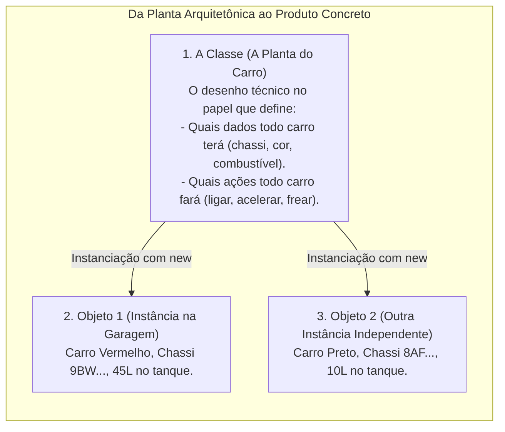
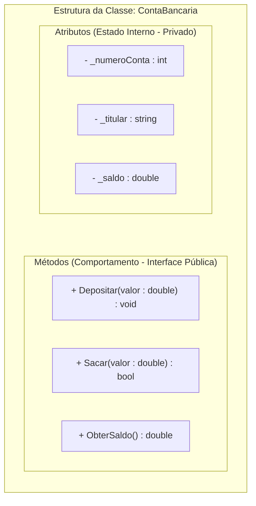
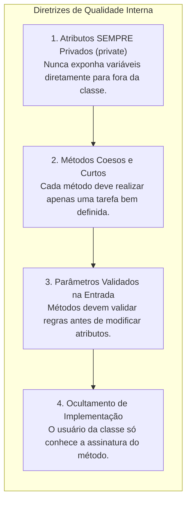

# Atributos e métodos: a estrutura fundamental de classes e objetos

> **Contexto:** Na Programação Orientada a Objetos (POO), um Tipo Abstrato de Dados (TAD) é materializado na forma de uma **Classe**, que funciona como um molde estrutural agrupando **Objetos** que compartilham as mesmas propriedades. Este artigo detalha a definição técnica, a anatomia de **Atributos** (estado) e **Métodos** (comportamento), os modificadores de visibilidade e o ciclo de instanciação explicados pela Técnica de Feynman.

---

## 1. O que são classes, objetos, atributos e métodos? (Técnica de Feynman)

Imagine uma **fábrica de automóveis**:



Na Ciência da Computação:
* **Classe (*Class*):** É o **molde, modelo ou especificação abstrata** que define um novo Tipo de Dado no programa. A classe não ocupa espaço de processamento de dados em si; ela apenas descreve a estrutura.
* **Objeto (*Object / Instance*):** É a **entidade viva e concreta alocada na memória RAM** a partir daquele molde. Você pode criar infinitos objetos a partir de uma única classe, e cada um terá sua própria identidade e valores independentes.
* **Atributos (*Fields / Data Members*):** São as **variáveis internas** declaradas dentro da classe que armazenam o **estado** do objeto (as características e valores que ele guarda).
* **Métodos (*Methods / Member Functions*):** São as **sub-rotinas (funções e procedimentos)** declaradas dentro da classe que definem o **comportamento** do objeto (as operações que ele pode executar e os cálculos que ele realiza sobre seus próprios atributos).

---

## 2. Anatomia de uma classe: separando estado e comportamento



---

## 3. Definição prática de atributos e métodos (C# e Java)

### a. Exemplo em C#
```csharp
using System;

namespace BancoModular 
{
    // A Classe: Molde estrutural
    public class ContaCorrente 
    {
        // 1. Atributos (Dados privados encapsulados)
        private string _numero;
        private string _titular;
        private double _saldo;

        // 2. Construtor: Inicializa os atributos do objeto recém-criado
        public ContaCorrente(string numero, string titular, double saldoInicial) 
        {
            _numero = numero;
            _titular = titular;
            _saldo = saldoInicial >= 0 ? saldoInicial : 0;
        }

        // 3. Método de Procedimento (Modifica o estado sem retornar valor)
        public void Depositar(double valor) 
        {
            if (valor > 0) 
            {
                _saldo += valor;
            }
        }

        // 4. Método com Retorno Booleano (Protege regras de negócio)
        public bool Sacar(double valor) 
        {
            if (valor > 0 && _saldo >= valor) 
            {
                _saldo -= valor;
                return true; // Saque autorizado
            }
            return false; // Saldo insuficiente
        }

        // 5. Método de Função (Retorna dados com segurança)
        public double ObterSaldo() 
        {
            return _saldo;
        }
    }

    class Program 
    {
        static void Main() 
        {
            // Instanciação: Criando objetos na memória
            ContaCorrente contaDoLeo = new ContaCorrente("1001-X", "Leo Ruas", 500.0);
            ContaCorrente contaDaAna = new ContaCorrente("2002-Y", "Ana Maria", 1200.0);

            // Invocando métodos (Comportamento)
            contaDoLeo.Depositar(250.0);
            bool sucesso = contaDoLeo.Sacar(100.0);

            Console.WriteLine($"Saldo Leo: R$ {contaDoLeo.ObterSaldo():F2}"); // R$ 650.00
            Console.WriteLine($"Saldo Ana: R$ {contaDaAna.ObterSaldo():F2}"); // R$ 1200.00 (Intacto)
        }
    }
}
```

---

### b. Exemplo em Java
```java
public class ContaCorrente {
    // Atributos privados
    private String numero;
    private String titular;
    private double saldo;

    // Construtor
    public ContaCorrente(String numero, String titular, double saldoInicial) {
        this.numero = numero;
        this.titular = titular;
        this.saldo = Math.max(saldoInicial, 0);
    }

    // Métodos
    public void depositar(double valor) {
        if (valor > 0) {
            this.saldo += valor;
        }
    }

    public boolean sacar(double valor) {
        if (valor > 0 && this.saldo >= valor) {
            this.saldo -= valor;
            return true;
        }
        return false;
    }

    public double getSaldo() {
        return this.saldo;
    }
}
```

---

## 4. Diferenças conceituais: atributos vs. variáveis locais

Muitos estudantes confundem atributos com variáveis normais. A tabela abaixo resume as distinções fundamentais:

| Característica | Atributo (*Field*) | Variável Local (*Local Variable*) |
| :--- | :--- | :--- |
| **Onde é declarado?** | No corpo da classe, fora de qualquer método. | Dentro do corpo de um método ou bloco `{ }`. |
| **Tempo de vida (*Lifecycle*)** | Vive enquanto o **objeto** existir na memória RAM. | Morre assim que o método termina de executar. |
| **Escopo de visibilidade** | Acessível por todos os métodos daquela classe. | Acessível apenas dentro do bloco onde foi criada. |
| **Modificadores de acesso** | Suporta `private`, `public`, `protected`. | Não aceita modificadores de visibilidade. |
| **Inicialização padrão** | Inicializado automaticamente (0, `null`, `false`). | Obrigatório inicializar manualmente antes de usar. |

---

## 5. Boas práticas na definição de atributos e métodos



---

## Referências bibliográficas

### Bibliografia básica
* MEYER, Bertrand. **Object-Oriented Software Construction**. 2. ed. Prentice Hall, 1997.
* SOMMERVILLE, Ian. **Engenharia de Software**. 10. ed. São Paulo: Pearson, 2019.
* MARTIN, Robert C. **Código Limpo: Habilidades Práticas do Agile Software**. Rio de Janeiro: Alta Books, 2011.

### Bibliografia complementar
* MICROSOFT. **Convenções de codificação em C#**. Guia do Desenvolvedor .NET, 2023. Disponível em: [https://docs.microsoft.com/pt-br/dotnet/csharp/fundamentals/coding-style/coding-conventions](https://docs.microsoft.com/pt-br/dotnet/csharp/fundamentals/coding-style/coding-conventions).
* SEBESTA, Robert W. **Conceitos de Linguagens de Programação**. 11. ed. Porto Alegre: Bookman, 2018.
* TENENBAUM, Aaron M.; LANGSAM, Yedidyah; AUGENSTEIN, Moshe J. **Estruturas de Dados Usando C**. São Paulo: Makron Books, 1995.

---

## Artigos relacionados e navegação

* **Artigo anterior:** [[06. Fatores internos de qualidade de software]]
* **Resumo da disciplina:** [[00. Programação modular - Resumo]]
* **Glossário da disciplina:** [[Glossário de conceitos]]
* **Guia de Sintaxe Multilinguagem:** [[00. Sintaxe Multilinguagem/05. Abstração e encapsulamento com classes (TADs)]]
* **Guia de Sintaxe (Modificadores e static):** [[00. Sintaxe Multilinguagem/06. Modificadores de acesso, escopo e a palavra-chave static]]
* **Guia de Sintaxe (Getters e Setters):** [[00. Sintaxe Multilinguagem/07. Getters, setters e propriedades (acesso e modificação de estado)]]
* **Índice geral do vault:** [[index.md|Página Inicial do Vault]]
