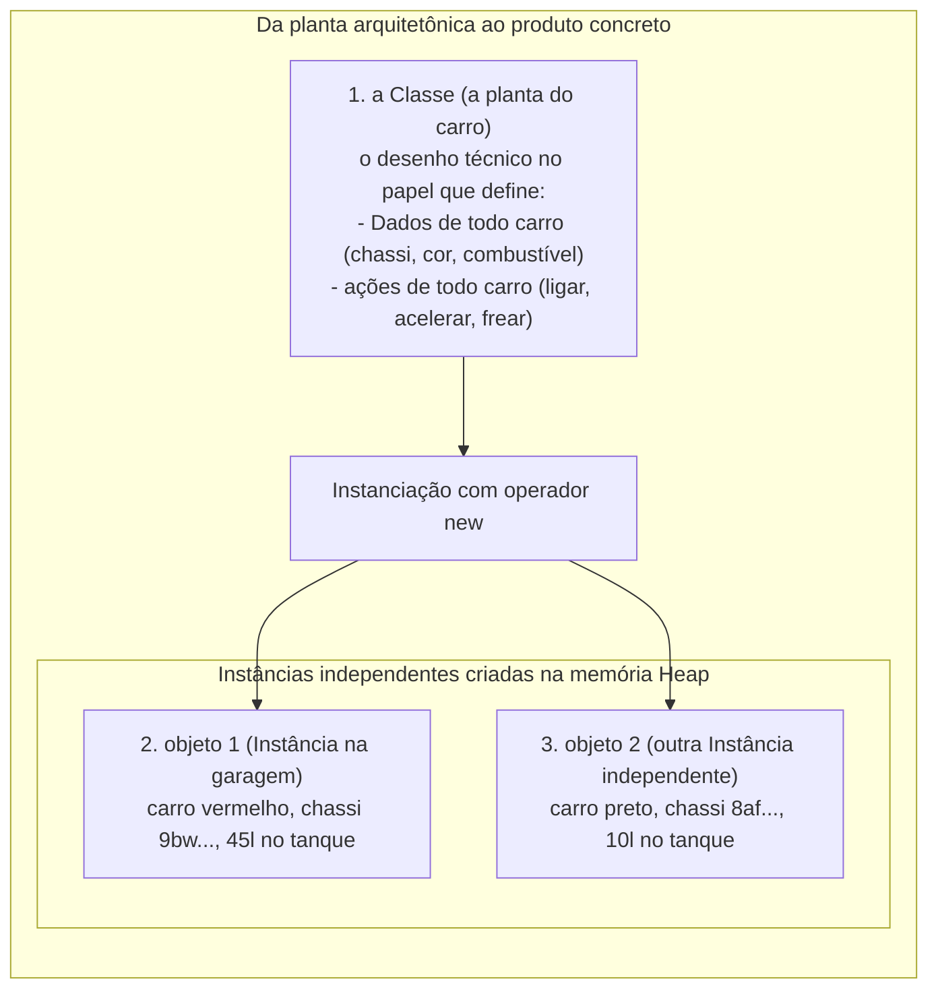
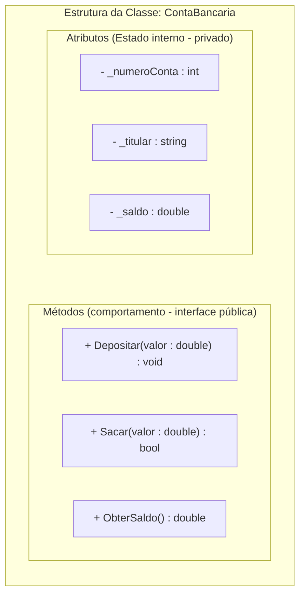
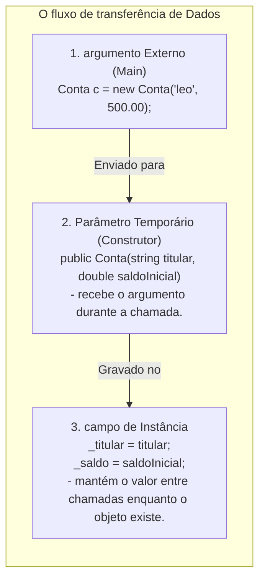
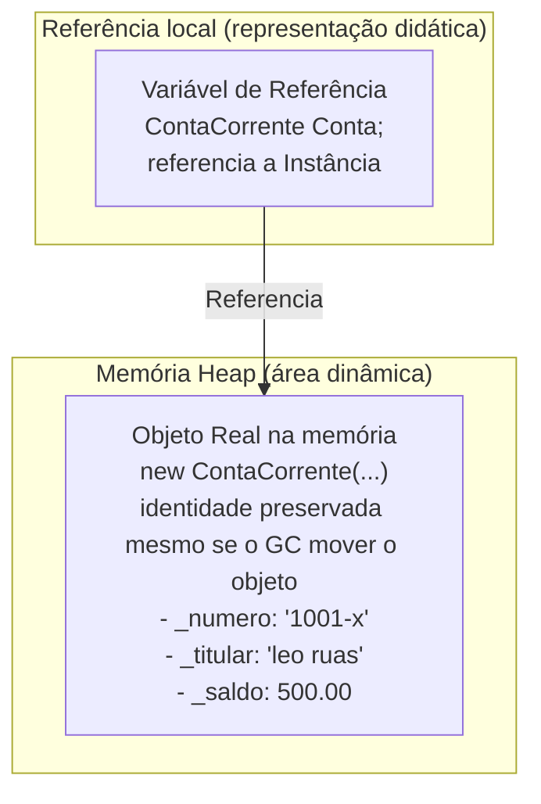
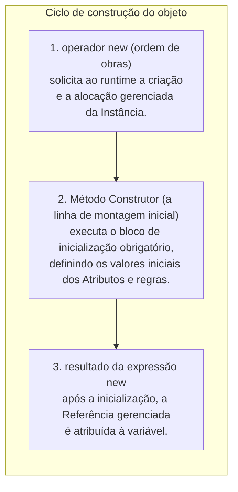
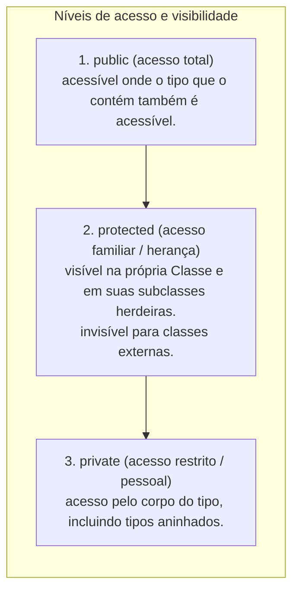
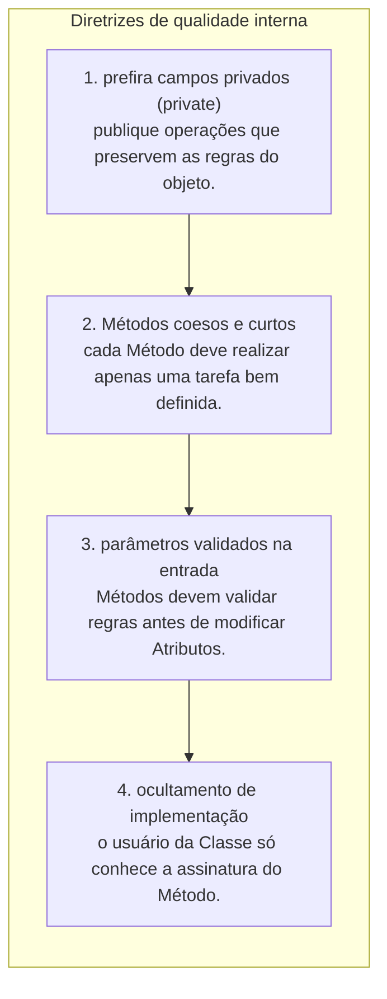

# Atributos e métodos: a estrutura fundamental de classes e objetos

> **Contexto:** Esta nota desenvolve os conceitos de programação modular estudados na disciplina. As explicações de C#/.NET são complementação técnica; as analogias são recursos didáticos para acompanhar os exemplos.

---


**Percurso de leitura:** conceito central → mecânica em C# → aprofundamento técnico → conexões. A primeira camada constrói a ideia; os exemplos e detalhes permanecem disponíveis nas seguintes.

## 1. Conceito central

Uma conta precisa manter seu saldo entre chamadas e oferecer operações que o alterem com critério. A classe define o tipo; cada objeto mantém seus campos de instância; os métodos executam o comportamento. Comece por essa relação antes de tentar localizar cada dado na memória.

### O que são classes, objetos, atributos e métodos? (técnica de Feynman)

Imagine uma **fábrica de automóveis**:



Na Ciência da Computação:

#### O molde da classe
* **[[Glossário de conceitos#3 Classe Class|Classe (Class)]]:** É o molde, modelo ou especificação abstrata que define um novo [[Glossário de conceitos#1 Tipo Type|Tipo de Dado]] no programa. Declarar a classe não cria uma conta; o runtime, porém, mantém metadados do tipo, código dos métodos e eventual estado estático → [[00. Sintaxe Multilinguagem/05. Abstração e encapsulamento com classes (TADs)|Sintaxe Comparada de Classes]].
```csharp
// Apenas o molde conceitual (A planta no papel)
public class ContaCorrente
{
    // Membros da classe ficam aqui dentro
}
```

#### Os atributos e a declaração de estado
* **[[Glossário de conceitos#4 Atributo Attribute Field|Atributo (Field / Data Member)]]:** São as variáveis internas declaradas na classe que armazenam o **[[Glossário de conceitos#5 Estado State|Estado (State)]]** (a fotografia dos valores em um dado instante).
* **[[Glossário de conceitos#8 Declaração em Computação Declaration Declarar|Declaração (Declaration)]]:** O ato técnico de apresentar os nomes e tipos dos membros ao compilador (`private double _saldo;`), reservando sua identidade e tipo.
```csharp
public class ContaCorrente
{
    // Atributos privados (Estado interno protegido)
    private string _numero;
    private string _titular;
    private double _saldo;
}
```

#### O método construtor
* **Método construtor (*constructor*):** Um membro especial de inicialização, distinto de um método comum. Sua implementação deve validar os dados necessários para que a construção termine em estado válido.
```csharp
// Construtor: mesmo nome da classe, sem tipo de retorno
public ContaCorrente(string numero, string titular, double saldoInicial)
{
    _numero = numero;
    _titular = titular;
    _saldo = saldoInicial >= 0 ? saldoInicial : 0;
}
```

#### Os métodos e o comportamento
* **[[Glossário de conceitos#6 Método Method|Método (method / member function)]]:** São as sub-rotinas ([[02. Funções e procedimentos|Funções e procedimentos]]) que definem o **comportamento** do objeto, sendo o canal legítimo para consultar e modificar o estado encapsulado.
```csharp
// Procedimento: altera o estado interno
public void Depositar(double valor)
{
    if (valor > 0) _saldo += valor;
}

// Função: lê e retorna o estado com segurança
public double ObterSaldo()
{
    return _saldo;
}
```

#### A instanciação de objetos na memória
* **[[Glossário de conceitos#Objeto Instance|Objeto / Instância (Instance)]]:** A materialização viva e concreta de uma classe na memória RAM criada com `new`. Cada objeto tem sua própria identidade e estado independente.
```csharp
// 1. Declara uma variável local de referência, ainda sem valor atribuído
ContaCorrente contaDoLeo;

// 2. Cria e instancia efetivamente o objeto no Heap
contaDoLeo = new ContaCorrente("1001-X", "Leo Ruas", 500.0);

// 3. Invoca o comportamento do objeto
contaDoLeo.Depositar(250.0);
```

---

### Anatomia de uma classe: separando estado e comportamento



---

## 2. Mecânica em C#

Leia os trechos de `ContaCorrente` como partes da mesma ideia: receber dados, armazenar estado e executar depósitos e saques. O programa integrado mostra duas contas com estados diferentes.

### Definição prática de atributos e métodos em C#

```csharp
using System;

namespace BancoModular
{
    // A Classe: Molde estrutural
    public class ContaCorrente
    {
        // 1. Atributos (Dados privados encapsulados)
        private string _numero;
        private string _titular;
        private double _saldo;

        // 2. Construtor: Inicializa os atributos do objeto recém-criado
        public ContaCorrente(string numero, string titular, double saldoInicial)
        {
            _numero = numero;
            _titular = titular;
            _saldo = saldoInicial >= 0 ? saldoInicial : 0;
        }

        // 3. Método de Procedimento (Modifica o estado sem retornar valor)
        public void Depositar(double valor)
        {
            if (valor > 0)
            {
                _saldo += valor;
            }
        }

        // 4. Método com Retorno Booleano (Protege regras de negócio)
        public bool Sacar(double valor)
        {
            if (valor > 0 && _saldo >= valor)
            {
                _saldo -= valor;
                return true; // Saque autorizado
            }
            return false; // Saldo insuficiente
        }

        // 5. Método de Função (Retorna dados com segurança)
        public double ObterSaldo()
        {
            return _saldo;
        }
    }

    class Program
    {
        static void Main()
        {
            // Instanciação: Criando objetos na memória
            ContaCorrente contaDoLeo = new ContaCorrente("1001-X", "Leo Ruas", 500.0);
            ContaCorrente contaDaAna = new ContaCorrente("2002-Y", "Ana Maria", 1200.0);

            // Invocando métodos (Comportamento)
            contaDoLeo.Depositar(250.0);
            bool sucesso = contaDoLeo.Sacar(100.0);

            Console.WriteLine($"Saldo Leo: R$ {contaDoLeo.ObterSaldo():F2}"); // R$ 650.00
            Console.WriteLine($"Saldo Ana: R$ {contaDaAna.ObterSaldo():F2}"); // R$ 1200.00 (Intacto)
        }
    }
}
```

---

### Diferenças conceituais: atributos vs. variáveis locais vs. parâmetros

Muitos estudantes confundem atributos, variáveis locais e parâmetros. A tabela abaixo resume as distinções fundamentais:

| Característica | Atributo (*Field*) | Parâmetro (*Parameter*) | Variável local (*Local Variable*) |
| :--- | :--- | :--- | :--- |
| **Onde é declarado?** | No corpo da classe, fora de qualquer método. | Na assinatura do método ou construtor `(...)`. | Dentro do corpo de um método ou bloco `{ }`. |
| **Tempo de vida (*Lifecycle*)** | O campo de instância acompanha o objeto; o estático acompanha o tipo. | Seu escopo é a rotina; capturas podem prolongar o armazenamento. | Seu escopo é o bloco; capturas e código assíncrono podem prolongar o armazenamento. |
| **Escopo de visibilidade** | Acesso depende da visibilidade e, para campo de instância, de uma referência ao objeto. | Acessível apenas dentro daquele método específico. | Acessível apenas dentro do bloco onde foi criada. |
| **Modificadores de acesso** | Suporta `private`, `public`, `protected`. | Não aceita modificadores de acesso. | Não aceita modificadores de acesso. |
| **Propósito de dados** | Armazena o **estado entre chamadas** do objeto. | **túnel de entrada temporário** para receber dados. | Cálculos e contadores auxiliares de curto prazo. |

#### O jogo entre parâmetro e atributo (técnica de Feynman):

A relação entre **parâmetro** e **atributo** é o coração da passagem de dados em POO:



* **O parâmetro é o mensageiro:** As palavras ditas no balcão pelo cliente (*"Meu depósito é R$ 500"*). A imagem representa a passagem de dados na chamada, sem definir onde o runtime armazena os parâmetros.
* **O atributo é o livro-razão no cofre:** Para que o banco não esqueça o dinheiro recebido, o atendente precisa **copiar o valor do parâmetro temporário para o atributo privado permanente** (`_saldo = saldoInicial;`). Se essa atribuição for esquecida e nenhuma outra inicialização ocorrer, o campo mantém seu valor padrão. Copiar um parâmetro de referência preserva acesso ao mesmo objeto; não faz cópia profunda. → [[Glossário de conceitos#12 Parâmetro vs Argumento Parameter vs Argument|Parâmetro vs. Argumento no Glossário]].

#### O perigo de ambiguidade com `this` e o sombreamento (*shadowing*)

Quando o desenvolvedor dá o **mesmo nome** para o atributo e para o parâmetro (ex.: atributo `saldo` e parâmetro `saldo`), surge o fenômeno de **Sombreamento de Escopo (*Variable Shadowing*)**:

```csharp
public class Conta
{
    private double saldo; // Atributo

    public Conta(double saldo) // Parâmetro com o MESMO nome!
    {
        // 1. O BUG SILENCIOSO MAIS COMUM:
        saldo = saldo; // O parâmetro atribui a ele mesmo! O atributo continua zerado!

        // 2. A SOLUÇÃO COM 'this' (Estilo Java):
        this.saldo = saldo; // 'this.saldo' força o acesso ao atributo da instância.
    }
}
```

##### Como a convenção do sublinhado (`_saldo`) ajuda na leitura?
1. **Elimina a necessidade do `this.`:** Ao nomear o atributo privado com sublinhado (`_saldo`) e o parâmetro com camelCase (`saldo`), o código fica autoexplicativo: `_saldo = saldo;`.
2. **Previne erros acidentais de digitação:** A diferença entre os nomes reduz a chance de autoatribuição, mas não impede todos os erros. `saldo = saldo` ainda pode compilar com aviso; convenção não substitui revisão.
3. **Leitura instantânea do escopo:** Qualquer pessoa lendo o método sabe de imediato o que é atributo persistente (`_titular`) e o que é parâmetro temporário (`titular`).

---

## 3. Aprofundamento técnico

Separe semântica de armazenamento: copiar uma referência não copia o objeto. Stack e heap ajudam a visualizar a execução, mas o lugar físico de uma variável depende do contexto e das otimizações do runtime.

### Limites do modelo de memória

Campos de um objeto de classe fazem parte de seu armazenamento; um campo que contém uma referência pode apontar para outro objeto compartilhado. Locais podem estar em stack ou registradores; locais capturados podem ser armazenados em objetos. O GC pode mover objetos, preservando referências gerenciadas. Portanto, identidade não é endereço fixo e escopo não é sinônimo de tempo de vida.

Nos exemplos bancários, `double` é mantido como escolha didática original. Em cálculos monetários, prefira `decimal` e estabeleça arredondamento. Com ponto flutuante, comparações de intervalo também precisam considerar `NaN` e infinito. O construtor que substitui saldo negativo por zero demonstra normalização; se o contrato exigir rejeição, deve lançar uma exceção. Número e titular também precisam de validação em um modelo de domínio completo.

### Semântica de referência: a diferença entre a referência e o objeto real

Um objeto de classe é uma **instância com identidade e estado**. O nome `conta` pertence à variável, não ao objeto: duas variáveis podem referenciar a mesma instância. A referência gerenciada não é um endereço físico fixo; o GC pode mover o objeto e atualizar as referências sem mudar sua identidade.

* **O conceito de Instância (*Instance*):** Uma classe existe apenas uma vez no código-fonte, mas pode gerar **múltiplas instâncias** independentes durante a execução do programa. Cada instância possui seu próprio ciclo de vida e estado encapsulado.
* **Instanciação (*Instantiation*):** É a criação de uma instância. Na expressão `new ContaCorrente(...)`, o runtime administra a alocação e executa a inicialização; não é necessário pedir uma nova região ao sistema operacional a cada objeto.

Em linguagens como C# e Java, **a simples declaração de uma variável de classe não cria o objeto propriamente dito**, mas sim uma **variável de referência**. Depois de receber um valor válido, ela referencia um objeto ou contém `null`. Uma variável local deve receber uma atribuição antes da leitura.



#### A intuição (técnica de Feynman):
* **A referência (`ContaCorrente conta`):** É o **controle remoto da televisão** ou o papel com o **endereço de uma casa**. Ter o controle remoto na mão não significa que a televisão foi fabricada; você só tem o dispositivo que sabe onde ela está e como se comunicar com ela.
* **O objeto real (`new ContaCorrente(...)`):** É o **aparelho físico da televisão** na fábrica/sala. O comando `new` é a ordem formal para a fábrica construir a TV e colocá-la na tomada, entregando a frequência exata para o seu controle remoto.
* Se você apenas declarar a variável local `ContaCorrente conta;`, tentar usá-la antes de atribuir um valor causa erro de compilação (CS0165). Se atribuir explicitamente `null`, uma chamada de instância por essa referência causa `NullReferenceException`. Campos de referência recebem `null` como valor padrão, ao contrário da regra de atribuição definida para locais.

---

### O operador `new` e o método construtor: a instrução para construir

A criação de um objeto na memória acontece em uma dança de **duas etapas coordenadas**: o operador **`new`** e o **método construtor** (*Constructor*).



#### O uso do operador `new` é obrigatório?

`new ContaCorrente(...)` é a forma explícita usual de construir uma instância, mas escrever `new` no ponto de uso não é obrigatório para obter um objeto. Uma fábrica pode devolvê-lo; uma variável pode receber uma referência já existente; literais de string têm suporte próprio da linguagem.

* **Declarar não é construir:** `ContaCorrente conta;` apenas declara uma variável local. É preciso atribuir um valor antes de lê-la, seja uma nova instância, uma referência existente ou `null`.
* **Tipos de valor:** `int idade = 25;` inicializa um valor sem `new`. Isso não determina sua localização: valores podem estar em campos de objetos, elementos de arrays, locais ou registradores.
* **Strings:** `string texto = "Olá";` usa um literal; o runtime pode compartilhar strings internadas. Não se deve presumir uma nova alocação a cada avaliação do literal.
* **Referências compartilhadas:** `ContaCorrente c2 = c1;` copia a referência. Os dois nomes acessam a mesma conta; a atribuição não clona seu estado.

A analogia dos dois controles remotos ajuda a entender esse compartilhamento: mudar o canal com um controle muda a mesma televisão vista pelo outro.

#### A analogia de Feynman para o construtor:
* **O operador `new` (comprar o terreno):** O comando `new` é a **ordem de compra do terreno** no bairro (a memória Heap). Ele reserva a área física onde a casa será erguida.
* **O método construtor (a construtora e a entrega das chaves):** O método construtor (`public ContaCorrente(...)`) é a **equipe de engenheiros e pedreiros**. Ele sobe as paredes, instala a fiação inicial e coloca os móveis obrigatórios (grava o número da conta, o nome do titular e o saldo inicial).
* Um objeto nunca deve nascer em um estado inconsistente ou inválido (ex.: uma conta bancária sem número ou com saldo negativo). O método construtor é o **guarda de trânsito** que garante que o objeto só seja liberado para o programa após atender a todas as condições de nascimento.

---

## 4. Conexões

**Continue a leitura:** [[08. Construtores (inicialização, sobrecarga e garantia de invariantes)|Artigo 08]] · [[12. Modificadores de acesso (visibilidade e níveis de proteção no encapsulamento)|Artigo 12]] · [[13. Métodos de acesso e propriedades (publicação de contratos e garantia de invariantes)|Artigo 13]].

O artigo 08 desenvolve a inicialização; o 12 detalha quem pode acessar cada membro; o 13 explica a publicação de propriedades. A anatomia estudada aqui é o pré-requisito comum.

### Modificadores de acesso: o papel especial do `protected`

Os modificadores de acesso controlam a **fronteira de visibilidade** e o nível de encapsulamento dos membros de uma classe:



#### A intuição do `protected` (técnica de Feynman):
* **`public`:** A **calçada da rua**. Qualquer pessoa que passar pode ver e acessar.
* **`private`:** O seu **diário secreto**. Apenas você (a própria classe) tem a chave para ler e escrever.
* **`protected`:** O **carro da família ou uma herança de família**. Quem é de fora da casa não pode usar, mas **os filhos (as subclasses que herdam da classe-mãe)** têm permissão total para acessar e reutilizar.

> **Conexão com POO e modelagem:**
> O modificador `protected` é representado pelo símbolo `#` na notação oficial da UML (ex.: `# _saldo : double`) e ganha seu papel fundamental quando estudamos **herança e polimorfismo** → [[07. Engenharia de Requisitos/09. Modelagem estrutural com diagrama de classes da uml|Diagrama de Classes UML]].

---

### Boas práticas na definição de atributos e métodos



---

### Referências bibliográficas

#### Bibliografia básica
* MEYER, Bertrand. **Object-Oriented Software Construction**. 2. ed. Prentice Hall, 1997.
* SOMMERVILLE, Ian. **Engenharia de Software**. 10. ed. São Paulo: Pearson, 2019.
* MARTIN, Robert C. **Código Limpo: Habilidades Práticas do Agile Software**. Rio de Janeiro: Alta Books, 2011.

#### Bibliografia complementar
* MICROSOFT. **Código fonte da classe DateTime em C#**. Reference Source (.NET Framework), 2014. Disponível em: [https://referencesource.microsoft.com/#mscorlib/system/datetime.cs](https://referencesource.microsoft.com/#mscorlib/system/datetime.cs).
* MICROSOFT. **Convenções de codificação em C#**. Guia do Desenvolvedor .NET, 2023. Disponível em: [https://docs.microsoft.com/pt-br/dotnet/csharp/fundamentals/coding-style/coding-conventions](https://docs.microsoft.com/pt-br/dotnet/csharp/fundamentals/coding-style/coding-conventions).
* SEBESTA, Robert W. **Conceitos de Linguagens de Programação**. 11. ed. Porto Alegre: Bookman, 2018.
* TENENBAUM, Aaron M.; LANGSAM, Yedidyah; AUGENSTEIN, Moshe J. **Estruturas de Dados Usando C**. São Paulo: Makron Books, 1995.
* UML DIAGRAMS. **UML Class and Object Diagrams Overview**. UML-Diagrams.org, 2023. Disponível em: [https://www.uml-diagrams.org/class-diagrams-overview.html](https://www.uml-diagrams.org/class-diagrams-overview.html).

---

#### Referências técnicas da revisão

* MICROSOFT. [Semântica de tipos de referência](https://learn.microsoft.com/en-us/dotnet/csharp/language-reference/keywords/reference-types). Microsoft Learn. Acesso em: 8 set. 2026.

### Artigos relacionados e navegação

* **Artigo anterior:** [[06. Fatores internos de qualidade de software]]
* **Próximo artigo:** [[08. Construtores (inicialização, sobrecarga e garantia de invariantes)]]
* **Resumo da disciplina:** [[00. Programação modular - Resumo]]
* **Glossário da disciplina:** [[Glossário de conceitos]]
* **Guia de sintaxe multilinguagem:** [[00. Sintaxe Multilinguagem/05. Abstração e encapsulamento com classes (TADs)]]
* **Guia de sintaxe (modificadores e static):** [[00. Sintaxe Multilinguagem/06. Modificadores de acesso, escopo e a palavra-chave static]]
* **Guia de sintaxe (getters e setters):** [[00. Sintaxe Multilinguagem/07. Getters, setters e propriedades (acesso e modificação de estado)]]
* **Índice geral do vault:** [[index.md|Página Inicial do Vault]]
