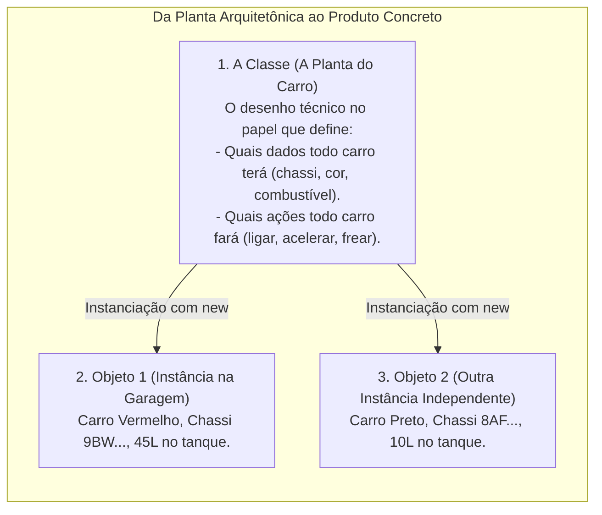
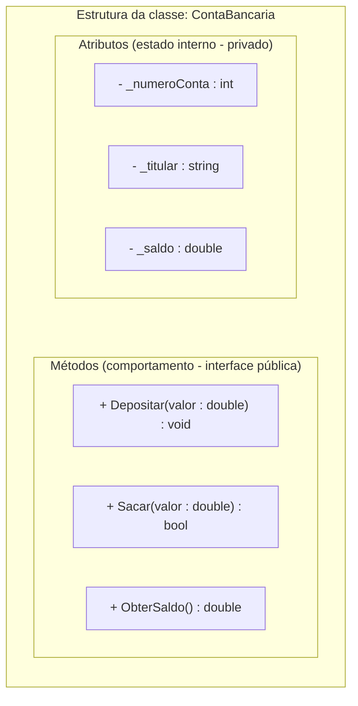
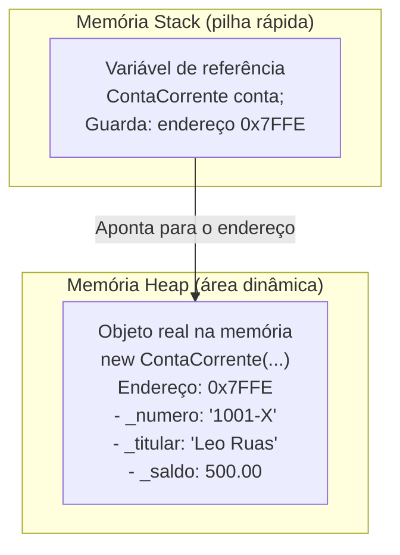
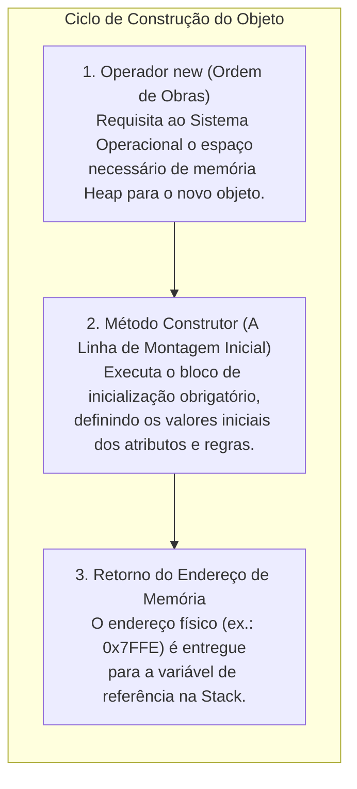
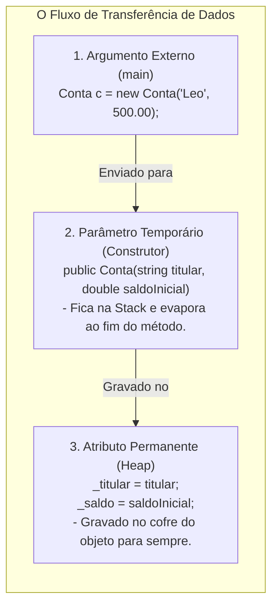
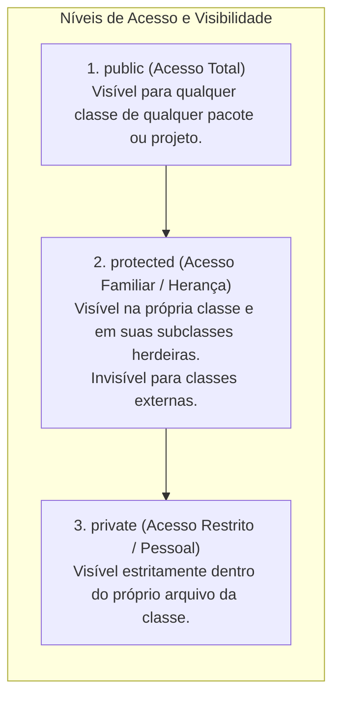
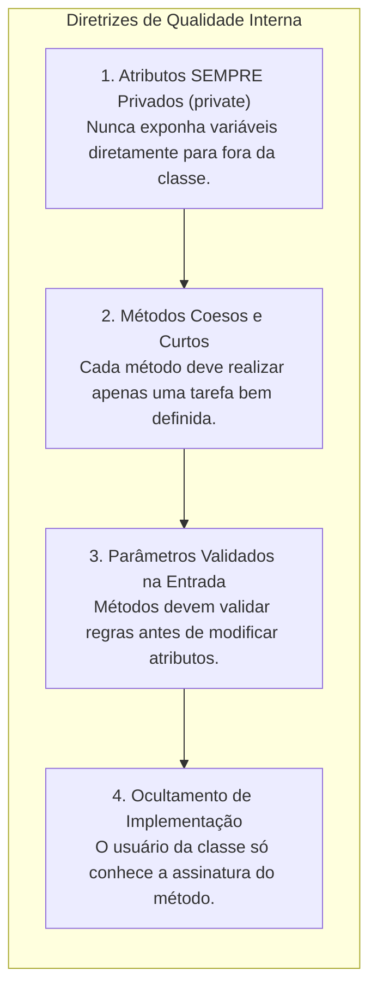

# Atributos e métodos: a estrutura fundamental de classes e objetos

> **Contexto:** Na Programação Orientada a Objetos (POO), um Tipo Abstrato de Dados (TAD) é materializado na forma de uma **Classe**, que funciona como um molde estrutural agrupando **Objetos** que compartilham as mesmas propriedades. Este artigo detalha a definição técnica, a anatomia de **Atributos** (estado) e **Métodos** (comportamento), os modificadores de visibilidade e o ciclo de instanciação explicados pela Técnica de Feynman.

---

## 1. O que são classes, objetos, atributos e métodos? (Técnica de Feynman)

Imagine uma **fábrica de automóveis**:



Na Ciência da Computação:

### a. O Molde da Classe
* **[[Glossário de conceitos#3 Classe Class|Classe (Class)]]:** É o molde, modelo ou especificação abstrata que define um novo [[Glossário de conceitos#1 Tipo Type|Tipo de Dado]] no programa. A classe não ocupa espaço de processamento de dados em si; ela apenas descreve a estrutura $\rightarrow$ [[00. Sintaxe Multilinguagem/05. Abstração e encapsulamento com classes (TADs)|Sintaxe Comparada de Classes]].
```csharp
// Apenas o molde conceitual (A planta no papel)
public class ContaCorrente 
{
    // Membros da classe ficam aqui dentro
}
```

### b. Os Atributos e a Declaração de Estado
* **[[Glossário de conceitos#4 Atributo Attribute Field|Atributo (Field / Data Member)]]:** São as variáveis internas declaradas na classe que armazenam o **[[Glossário de conceitos#5 Estado State|Estado (State)]]** (a fotografia dos valores em um dado instante).
* **[[Glossário de conceitos#8 Declaração em Computação Declaration Declarar|Declaração (Declaration)]]:** O ato técnico de apresentar os nomes e tipos dos membros ao compilador (`private double _saldo;`), reservando sua identidade e tipo.
```csharp
public class ContaCorrente 
{
    // Atributos privados (Estado interno protegido)
    private string _numero;
    private string _titular;
    private double _saldo;
}
```

### c. O Método Construtor
* **Método Construtor (*Constructor*):** O bloco de montagem inicial acionado pelo `new` para inicializar os atributos e garantir que o objeto não nasça em estado inválido.
```csharp
// Construtor: mesmo nome da classe, sem tipo de retorno
public ContaCorrente(string numero, string titular, double saldoInicial) 
{
    _numero = numero;
    _titular = titular;
    _saldo = saldoInicial >= 0 ? saldoInicial : 0;
}
```

### d. Os Métodos e o Comportamento
* **[[Glossário de conceitos#6 Método Method|Método (Method / Member Function)]]:** São as sub-rotinas ([[02. Funções e procedimentos|Funções e Procedimentos]]) que definem o **comportamento** do objeto, sendo o canal legítimo para consultar e modificar o estado encapsulado.
```csharp
// Procedimento: altera o estado interno
public void Depositar(double valor) 
{
    if (valor > 0) _saldo += valor;
}

// Função: lê e retorna o estado com segurança
public double ObterSaldo() 
{
    return _saldo;
}
```

### e. A Instanciação de Objetos na Memória
* **[[Glossário de conceitos#Objeto Instance|Objeto / Instância (Instance)]]:** A materialização viva e concreta de uma classe na memória RAM criada com `new`. Cada objeto tem sua própria identidade e estado independente.
```csharp
// 1. Declara a variável de referência na Stack
ContaCorrente contaDoLeo;

// 2. Cria e instancia efetivamente o objeto no Heap
contaDoLeo = new ContaCorrente("1001-X", "Leo Ruas", 500.0);

// 3. Invoca o comportamento do objeto
contaDoLeo.Depositar(250.0);
```

---

## 2. Anatomia de uma classe: separando estado e comportamento



---

## 3. Definição prática de atributos e métodos em C#

```csharp
using System;

namespace BancoModular 
{
    // A Classe: Molde estrutural
    public class ContaCorrente 
    {
        // 1. Atributos (Dados privados encapsulados)
        private string _numero;
        private string _titular;
        private double _saldo;

        // 2. Construtor: Inicializa os atributos do objeto recém-criado
        public ContaCorrente(string numero, string titular, double saldoInicial) 
        {
            _numero = numero;
            _titular = titular;
            _saldo = saldoInicial >= 0 ? saldoInicial : 0;
        }

        // 3. Método de Procedimento (Modifica o estado sem retornar valor)
        public void Depositar(double valor) 
        {
            if (valor > 0) 
            {
                _saldo += valor;
            }
        }

        // 4. Método com Retorno Booleano (Protege regras de negócio)
        public bool Sacar(double valor) 
        {
            if (valor > 0 && _saldo >= valor) 
            {
                _saldo -= valor;
                return true; // Saque autorizado
            }
            return false; // Saldo insuficiente
        }

        // 5. Método de Função (Retorna dados com segurança)
        public double ObterSaldo() 
        {
            return _saldo;
        }
    }

    class Program 
    {
        static void Main() 
        {
            // Instanciação: Criando objetos na memória
            ContaCorrente contaDoLeo = new ContaCorrente("1001-X", "Leo Ruas", 500.0);
            ContaCorrente contaDaAna = new ContaCorrente("2002-Y", "Ana Maria", 1200.0);

            // Invocando métodos (Comportamento)
            contaDoLeo.Depositar(250.0);
            bool sucesso = contaDoLeo.Sacar(100.0);

            Console.WriteLine($"Saldo Leo: R$ {contaDoLeo.ObterSaldo():F2}"); // R$ 650.00
            Console.WriteLine($"Saldo Ana: R$ {contaDaAna.ObterSaldo():F2}"); // R$ 1200.00 (Intacto)
        }
    }
}
```

---

## 4. Semântica de referência: a diferença entre a referência e o objeto real

Um objeto é uma **instância** de uma Classe que possui um nome, identidade e uma **posição física na memória RAM**. Nessa posição de memória são armazenados os valores de seus atributos. 

* **O conceito de Instância (*Instance*):** Uma classe existe apenas uma vez no código-fonte, mas pode gerar **múltiplas instâncias** independentes durante a execução do programa. Cada instância possui seu próprio ciclo de vida e estado encapsulado.
* **Instanciação (*Instantiation*):** É o ato dinâmico de requisitar ao sistema operacional uma fatia da memória Heap através do operador `new` para alocar e dar vida à nova instância.

Em linguagens como C# e Java, **a simples declaração de uma variável de classe não cria o objeto propriamente dito**, mas sim uma **variável de referência** que armazena o endereço de memória onde o objeto se encontrará.



### A intuição (Técnica de Feynman):
* **A Referência (`ContaCorrente conta`):** É o **controle remoto da televisão** ou o papel com o **endereço de uma casa**. Ter o controle remoto na mão não significa que a televisão foi fabricada; você só tem o dispositivo que sabe onde ela está e como se comunicar com ela.
* **O Objeto Real (`new ContaCorrente(...)`):** É o **aparelho físico da televisão** na fábrica/sala. O comando `new` é a ordem formal para a fábrica construir a TV e colocá-la na tomada, entregando a frequência exata para o seu controle remoto.
* Se você apenas declarar `ContaCorrente conta;` sem executar o `new`, o controle remoto estará apontando para o vazio (`null`). Tentar chamar `conta.Sacar(50)` causará a clássica exceção **`NullReferenceException`**.

---

## 5. O operador `new` e o método construtor: a instrução para construir

A criação de um objeto na memória acontece em uma dança de **duas etapas coordenadas**: o operador **`new`** e o **Método Construtor** (*Constructor*).



### O uso do operador `new` é obrigatório?

**Sim, na imensa maioria dos casos em C# e Java, o uso do `new` é absolutamente obrigatório para criar uma nova instância de uma Classe.**

* **Por que é obrigatório?**
  Porque em linguagens com gerenciamento de memória automático (.NET CLR e JVM), a memória *Heap* é protegida. O compilador não tem como "adivinhar" que você quer criar um objeto real a menos que você dê a instrução explícita **`new`** para alocar espaço.
* **O que acontece se não usar `new`?**
  A variável continuará valendo `null` (referência nula / não aponta para nada). Qualquer tentativa de acessar métodos ou atributos resultará em erro imediato em tempo de execução (`NullReferenceException`).
* **As raras exceções (onde o `new` não é escrito diretamente):**
  1. **Tipos Primitivos e de Valor (*Structs* / `int`, `bool`, `double`):** Ficam alocados direto na *Stack* e não precisam de `new` (ex.: `int idade = 25;`).
  2. **Strings (`string texto = "Olá";`):** São classes de referência (*Reference Types*), mas a linguagem oferece suporte nativo com sintaxe literal simplificada (*String Literal*), onde o compilador executa a alocação internamente por debaixo dos panos.
  3. **Reaproveitamento de Referência Existente:** Quando você apenas aponta para um objeto que **já foi criado anteriormente com `new` por outra variável** (`ContaCorrente c2 = c1;`). Nesse caso, você não criou um objeto novo, apenas deu um segundo controle remoto para a mesma televisão!

### A analogia de Feynman para o Construtor:
* **O Operador `new` (Comprar o Terreno):** O comando `new` é a **ordem de compra do terreno** no bairro (a memória Heap). Ele reserva a área física onde a casa será erguida.
* **O Método Construtor (A Construtora e a Entrega das Chaves):** O método construtor (`public ContaCorrente(...)`) é a **equipe de engenheiros e pedreiros**. Ele sobe as paredes, instala a fiação inicial e coloca os móveis obrigatórios (grava o número da conta, o nome do titular e o saldo inicial). 
* Um objeto nunca deve nascer em um estado inconsistente ou inválido (ex.: uma conta bancária sem número ou com saldo negativo). O método construtor é o **guarda de trânsito** que garante que o objeto só seja liberado para o programa após atender a todas as condições de nascimento.

---

## 6. Diferenças conceituais: atributos vs. variáveis locais vs. parâmetros

Muitos estudantes confundem atributos, variáveis locais e parâmetros. A tabela abaixo resume as distinções fundamentais:

| Característica | Atributo (*Field*) | Parâmetro (*Parameter*) | Variável local (*Local Variable*) |
| :--- | :--- | :--- | :--- |
| **Onde é declarado?** | No corpo da classe, fora de qualquer método. | Na assinatura do método ou construtor `(...)`. | Dentro do corpo de um método ou bloco `{ }`. |
| **Tempo de vida (*Lifecycle*)** | Vive enquanto o **objeto** existir no *Heap*. | Morre assim que o método termina de executar. | Morre assim que o bloco `{ }` é finalizado. |
| **Escopo de visibilidade** | Acessível por todos os métodos da classe. | Acessível apenas dentro daquele método específico. | Acessível apenas dentro do bloco onde foi criada. |
| **Modificadores de acesso** | Suporta `private`, `public`, `protected`. | Não aceita modificadores de acesso. | Não aceita modificadores de acesso. |
| **Propósito de dados** | Armazena o **estado permanente** do objeto. | **Túnel de entrada temporário** para receber dados. | Cálculos e contadores auxiliares de curto prazo. |

### O jogo entre parâmetro e atributo (Técnica de Feynman):

A relação entre **parâmetro** e **atributo** é o coração da passagem de dados em POO:



* **O parâmetro é o mensageiro:** As palavras ditas no balcão pelo cliente (*"Meu depósito é R$ 500"*). Assim que a conversa acaba, as palavras somem da sala (*Stack*).
* **O atributo é o livro-razão no cofre:** Para que o banco não esqueça o dinheiro recebido, o atendente precisa **copiar o valor do parâmetro temporário para o atributo privado permanente** (`_saldo = saldoInicial;`). Se essa atribuição for esquecida, o dado desaparece e o objeto nasce vazio! $\rightarrow$ [[Glossário de conceitos#12 Parâmetro vs Argumento Parameter vs Argument|Parâmetro vs. Argumento no Glossário]].

### O perigo de ambiguidade com `this` e o sombreamento (*Shadowing*)

Quando o desenvolvedor dá o **mesmo nome** para o atributo e para o parâmetro (ex.: atributo `saldo` e parâmetro `saldo`), surge o fenômeno de **Sombreamento de Escopo (*Variable Shadowing*)**:

```csharp
public class Conta 
{
    private double saldo; // Atributo

    public Conta(double saldo) // Parâmetro com o MESMO nome!
    {
        // 1. O BUG SILENCIOSO MAIS COMUM:
        saldo = saldo; // O parâmetro atribui a ele mesmo! O atributo continua zerado!

        // 2. A SOLUÇÃO COM 'this' (Estilo Java):
        this.saldo = saldo; // 'this.saldo' força o acesso ao atributo da instância.
    }
}
```

#### Por que a convenção do sublinhado (`_saldo`) do C# é superior?
1. **Elimina a necessidade do `this.`:** Ao nomear o atributo privado com sublinhado (`_saldo`) e o parâmetro com camelCase (`saldo`), o código fica autoexplicativo: `_saldo = saldo;`.
2. **Previne erros acidentais de digitação:** É impossível esquecer o `this.` e gerar o bug `saldo = saldo`, pois o compilador acusará erro se você errar os nomes.
3. **Leitura instantânea do escopo:** Qualquer pessoa lendo o método sabe de imediato o que é atributo persistente (`_titular`) e o que é parâmetro temporário (`titular`).

---

## 7. Modificadores de acesso: o papel especial do `protected`

Os modificadores de acesso controlam a **fronteira de visibilidade** e o nível de encapsulamento dos membros de uma classe:



### A intuição do `protected` (Técnica de Feynman):
* **`public`:** A **calçada da rua**. Qualquer pessoa que passar pode ver e acessar.
* **`private`:** O seu **diário secreto**. Apenas você (a própria classe) tem a chave para ler e escrever.
* **`protected`:** O **carro da família ou uma herança de família**. Quem é de fora da casa não pode usar, mas **os filhos (as subclasses que herdam da classe-mãe)** têm permissão total para acessar e reutilizar.

> **Conexão com POO e Modelagem:**
> O modificador `protected` é representado pelo símbolo `#` na notação oficial da UML (ex.: `# _saldo : double`) e ganha seu papel fundamental quando estudamos **Herança e Polimorfismo** $\rightarrow$ [[07. Engenharia de Requisitos/09. Modelagem estrutural com diagrama de classes da uml|Diagrama de Classes UML]].

---

## 8. Boas práticas na definição de atributos e métodos



---

## Referências bibliográficas

### Bibliografia básica
* MEYER, Bertrand. **Object-Oriented Software Construction**. 2. ed. Prentice Hall, 1997.
* SOMMERVILLE, Ian. **Engenharia de Software**. 10. ed. São Paulo: Pearson, 2019.
* MARTIN, Robert C. **Código Limpo: Habilidades Práticas do Agile Software**. Rio de Janeiro: Alta Books, 2011.

### Bibliografia complementar
* MICROSOFT. **Código fonte da classe DateTime em C#**. Reference Source (.NET Framework), 2014. Disponível em: [https://referencesource.microsoft.com/#mscorlib/system/datetime.cs](https://referencesource.microsoft.com/#mscorlib/system/datetime.cs).
* MICROSOFT. **Convenções de codificação em C#**. Guia do Desenvolvedor .NET, 2023. Disponível em: [https://docs.microsoft.com/pt-br/dotnet/csharp/fundamentals/coding-style/coding-conventions](https://docs.microsoft.com/pt-br/dotnet/csharp/fundamentals/coding-style/coding-conventions).
* SEBESTA, Robert W. **Conceitos de Linguagens de Programação**. 11. ed. Porto Alegre: Bookman, 2018.
* TENENBAUM, Aaron M.; LANGSAM, Yedidyah; AUGENSTEIN, Moshe J. **Estruturas de Dados Usando C**. São Paulo: Makron Books, 1995.
* UML DIAGRAMS. **UML Class and Object Diagrams Overview**. UML-Diagrams.org, 2023. Disponível em: [https://www.uml-diagrams.org/class-diagrams-overview.html](https://www.uml-diagrams.org/class-diagrams-overview.html).

---

## Artigos relacionados e navegação

* **Artigo anterior:** [[06. Fatores internos de qualidade de software]]
* **Próximo artigo:** [[08. Construtores (inicialização, sobrecarga e garantia de invariantes)]]
* **Resumo da disciplina:** [[00. Programação modular - Resumo]]
* **Glossário da disciplina:** [[Glossário de conceitos]]
* **Guia de Sintaxe Multilinguagem:** [[00. Sintaxe Multilinguagem/05. Abstração e encapsulamento com classes (TADs)]]
* **Guia de Sintaxe (Modificadores e static):** [[00. Sintaxe Multilinguagem/06. Modificadores de acesso, escopo e a palavra-chave static]]
* **Guia de Sintaxe (Getters e Setters):** [[00. Sintaxe Multilinguagem/07. Getters, setters e propriedades (acesso e modificação de estado)]]
* **Índice geral do vault:** [[index.md|Página Inicial do Vault]]
