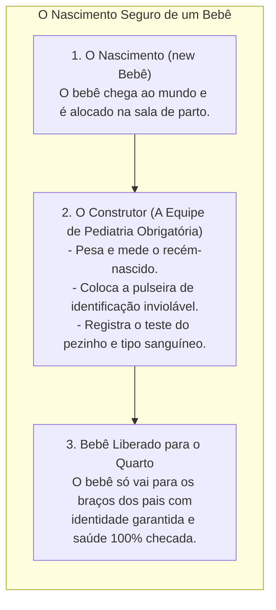
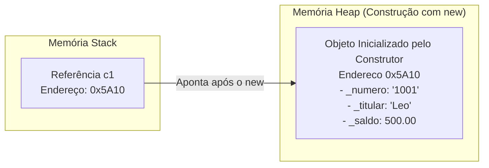
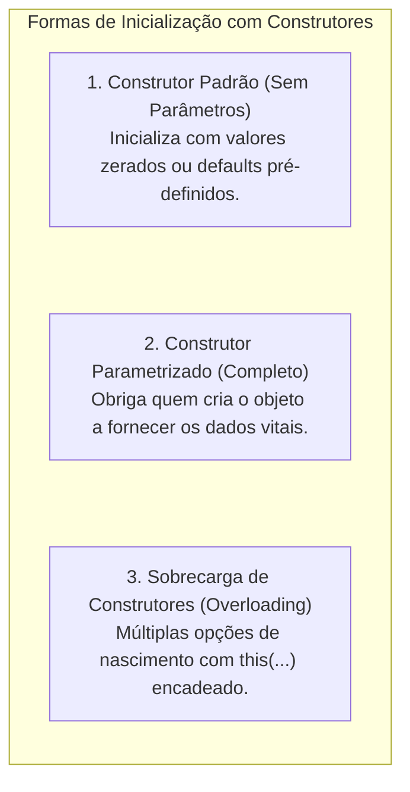
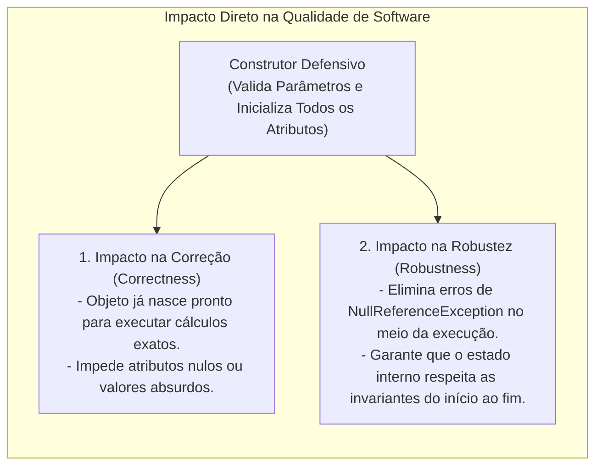

# Construtores: inicialização segura, sobrecarga e garantia de integridade

> **Contexto:** Na Programação Modular e Orientada a Objetos, os **Construtores** são os elementos-chave para inicializar objetos, garantindo que eles já nasçam em um estado válido e consistente. Este artigo explora as diversas formas de inicialização de um objeto a partir de construtores (padrão, parametrizado e sobrecarregado), a cadeia de chamadas com `this`, a proteção de **Invariantes de Classe** e como isso impacta diretamente na **Corretude** e **Robustez** do software explicados pela Técnica de Feynman.

---

## 1. O que é um construtor e por que ele é indispensável? (Técnica de Feynman)

Imagine uma **maternidade de hospital**:



Na Ciência da Computação:
* **O Construtor (*Constructor*):** É um método especial de inicialização que possui **o mesmo nome da classe** e **não possui tipo de retorno** (nem mesmo `void`). Ele é executado automaticamente no instante em que o operador `new` aloca o objeto no *Heap*.
* **A Missão do Construtor:** Garantir que o objeto **nunca nasça em um estado incompleto, inconsistente ou inválido** (ex.: uma conta bancária sem número de conta ou um triângulo com lados negativos).
* **Garantia de Invariantes de Classe:** As regras de integridade que devem ser verdadeiras durante toda a vida do objeto começam a ser estabelecidas e protegidas rigorosamente dentro do construtor.
* **A Semântica de Referência na Construção:** Em C# e Java, a variável que você declara na *Stack* (`ContaCorrente c1;`) é apenas uma **referência** (um ponteiro que guarda um endereço). O construtor é o responsável por preencher o miolo do **objeto real alocado na memória *Heap***, e o operador `new` retorna o endereço desse miolo para a referência $\rightarrow$ [[Glossário de conceitos#9 Semântica de Referência Reference Semantics|Semântica de Referência no Glossário]].



---

## 2. Tipos de construtores e formas de inicialização



---

## 3. Exemplos atômicos por conceito (C#)

### a. Construtor padrão implícito vs. explícito
Se você não escrever nenhum construtor na classe, o compilador do C# fornece automaticamente um **construtor padrão público sem parâmetros** que zera todos os atributos (números viram `0`, booleans viram `false` e referências viram `null`).

```csharp
public class Produto 
{
    private string _nome;
    private double _preco;

    // Construtor Padrão Explícito: define valores padrão seguros
    public Produto() 
    {
        _nome = "Item Não Cadastrado";
        _preco = 0.01; // Impede que o preço nasça zerado
    }
}
```

---

### b. Construtor parametrizado com validação de regras
Quando determinados dados são vitais para a existência da entidade, criamos um construtor que **exige parâmetros obrigatórios** e valida os dados antes de aceitá-los:

```csharp
public class Produto 
{
    private string _nome;
    private double _preco;

    // Construtor Parametrizado: exige nome e preço na criação
    public Produto(string nome, double preco) 
    {
        if (string.IsNullOrWhiteSpace(nome)) 
        {
            throw new ArgumentException("O nome do produto não pode ser vazio.");
        }
        if (preco <= 0) 
        {
            throw new ArgumentOutOfRangeException("O preço deve ser estritamente maior que zero.");
        }

        _nome = nome;
        _preco = preco;
    }
}
```

> **Atenção:** Assim que você escreve qualquer construtor com parâmetros na classe, o C# **destrói o construtor padrão implícito sem parâmetros**. Se você ainda quiser permitir criar o objeto vazio, precisa declarar explicitamente `public Produto() { }`.

---

### c. Sobrecarga de construtores e encadeamento com `this(...)`
Uma classe pode ter **múltiplos construtores com diferentes listas de parâmetros** (*Constructor Overloading*). Para evitar duplicação de código (*Don't Repeat Yourself - DRY*), usamos o operador **`: this(...)`** para reaproveitar a lógica do construtor principal:

```csharp
public class Produto 
{
    private string _codigo;
    private string _nome;
    private double _preco;

    // 1. Construtor Principal Completo
    public Produto(string codigo, string nome, double preco) 
    {
        _codigo = codigo;
        _nome = nome;
        _preco = preco > 0 ? preco : 0.01;
    }

    // 2. Construtor Secundário: se não passar o código, gera um automático e chama o principal
    public Produto(string nome, double preco) 
        : this("GERADO-" + Guid.NewGuid().ToString().Substring(0, 8), nome, preco) 
    {
        // O corpo aqui fica limpo, pois o construtor principal já fez o trabalho!
    }

    // 3. Construtor Mínimo: se passar apenas o nome, assume preço promocional de R$ 1.00
    public Produto(string nome) 
        : this(nome, 1.00) 
    {
    }
}
```

---

## 4. Exemplo completo integrado em C#

Abaixo, veja o código integral compilável demonstrando a classe `ContaBancaria` com múltiplos construtores sobrecarregados, validação defensiva e execução no método `Main`:

```csharp
using System;

namespace ModuloConstrutores 
{
    public class ContaBancaria 
    {
        // 1. Atributos Privados
        private readonly string _numeroConta;
        private string _titular;
        private double _saldo;

        // 2. Construtor Completo (Principal)
        public ContaBancaria(string numeroConta, string titular, double depositoInicial) 
        {
            if (string.IsNullOrWhiteSpace(numeroConta)) 
            {
                throw new ArgumentException("Número de conta é obrigatório.");
            }
            if (string.IsNullOrWhiteSpace(titular)) 
            {
                throw new ArgumentException("Titular da conta é obrigatório.");
            }

            _numeroConta = numeroConta;
            _titular = titular;
            _saldo = depositoInicial >= 0 ? depositoInicial : 0.0;
        }

        // 3. Construtor Sobrecregado (Conta sem depósito inicial)
        public ContaBancaria(string numeroConta, string titular) 
            : this(numeroConta, titular, 0.0) 
        {
        }

        // 4. Métodos Públicos
        public void Depositar(double valor) 
        {
            if (valor > 0) 
            {
                _saldo += valor;
            }
        }

        public bool Sacar(double valor) 
        {
            if (valor > 0 && _saldo >= valor) 
            {
                _saldo -= valor;
                return true;
            }
            return false;
        }

        public void ExibirExtrato() 
        {
            Console.WriteLine($"[Conta: {_numeroConta}] Titular: {_titular} | Saldo: R$ {_saldo:F2}");
        }
    }

    class Program 
    {
        static void Main() 
        {
            Console.WriteLine("=== Demonstração de Construtores em C# ===");

            // Instanciação com construtor completo (3 parâmetros)
            ContaBancaria c1 = new ContaBancaria("1001-A", "Leo Ruas", 1500.00);

            // Instanciação com construtor sobrecarregado (2 parâmetros, saldo zero)
            ContaBancaria c2 = new ContaBancaria("2002-B", "Maria Silva");

            c1.ExibirExtrato(); // Saldo R$ 1500.00
            c2.ExibirExtrato(); // Saldo R$ 0.00

            c2.Depositar(300.00);
            c2.ExibirExtrato(); // Saldo R$ 300.00
        }
    }
}
```

---

## 5. Como os construtores impactam a correção e a robustez do software



* **Sem Construtores Defensivos:** O desenvolvedor precisa lembrar de preencher cada atributo manualmente após criar o objeto (`c.Numero = "123"; c.Titular = "...";`). Se ele esquecer uma linha, o programa quebra horas depois durante uma transação real.
* **Com Construtores Parametrizados:** O compilador atua como um inspetor de qualidade. É **impossível compilar o código** se quem está chamando não fornecer os dados obrigatórios para que a conta funcione perfeitamente.

---

## 6. Resumo comparativo: tipos de construtores

| Tipo de Construtor | Quando é Usado? | Vantagem Principal | Risco se Usado Indevidamente |
| :--- | :--- | :--- | :--- |
| **Padrão Implícito** | Gerado automaticamente pelo compilador quando nenhum construtor é escrito. | Facilidade de criação rápida. | Objeto pode nascer com atributos nulos e estado inconsistente. |
| **Padrão Explícito (`public Classe()`)** | Quando queremos definir valores *defaults* seguros pré-estabelecidos. | Criação simplificada sem obrigar parâmetros na hora. | Nem sempre a entidade possui valores *default* válidos no mundo real. |
| **Parametrizado** | Para entidades de negócio com dados obrigatórios (CPF, Titular, ID). | **Garante Correção e Robustez:** o objeto já nasce 100% válido. | Quem instancia é obrigado a conhecer e fornecer os dados. |
| **Sobrecarga com `this(...)`** | Para oferecer flexibilidade de inicialização sem duplicar código. | Código limpo, centralizado e livre de duplicações (*DRY*). | Criar sobrecargas em excesso pode gerar confusão na API. |

---

## Referências bibliográficas

### Bibliografia básica
* MEYER, Bertrand. **Object-Oriented Software Construction**. 2. ed. Prentice Hall, 1997.
* SOMMERVILLE, Ian. **Engenharia de Software**. 10. ed. São Paulo: Pearson, 2019.
* MARTIN, Robert C. **Código Limpo: Habilidades Práticas do Agile Software**. Rio de Janeiro: Alta Books, 2011.

### Bibliografia complementar
* MICROSOFT. **Construtores (Guia de Programação em C#)**. Microsoft Learn, 2023. Disponível em: [https://learn.microsoft.com/pt-br/dotnet/csharp/programming-guide/classes-and-structs/constructors](https://learn.microsoft.com/pt-br/dotnet/csharp/programming-guide/classes-and-structs/constructors).
* SEBESTA, Robert W. **Conceitos de Linguagens de Programação**. 11. ed. Porto Alegre: Bookman, 2018.
* TENENBAUM, Aaron M.; LANGSAM, Yedidyah; AUGENSTEIN, Moshe J. **Estruturas de Dados Usando C**. São Paulo: Makron Books, 1995.

---

## Artigos relacionados e navegação

* **Artigo anterior:** [[07. Atributos e métodos (classes, objetos e definição de membros)]]
* **Resumo da disciplina:** [[00. Programação modular - Resumo]]
* **Glossário da disciplina:** [[Glossário de conceitos]]
* **Guia de Sintaxe Multilinguagem:** [[00. Sintaxe Multilinguagem/05. Abstração e encapsulamento com classes (TADs)]]
* **Guia de Sintaxe (Modificadores e static):** [[00. Sintaxe Multilinguagem/06. Modificadores de acesso, escopo e a palavra-chave static]]
* **Índice geral do vault:** [[index.md|Página Inicial do Vault]]
