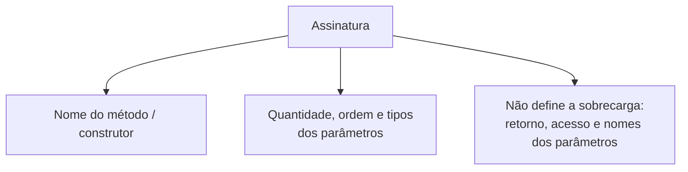
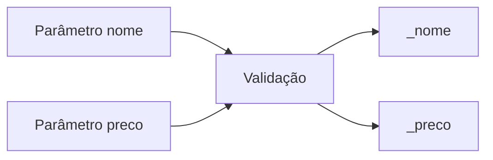
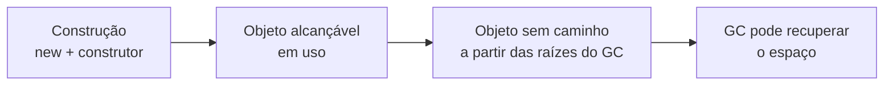

# Construtores: inicialização segura, sobrecarga e garantia de integridade

> **Contexto:** Esta nota desenvolve os conceitos de programação modular estudados na disciplina. As explicações de C#/.NET são complementação técnica; as analogias são recursos didáticos para acompanhar os exemplos.

---


**Percurso de leitura:** conceito central → mecânica em C# → aprofundamento técnico → conexões. A primeira camada constrói a ideia; os exemplos e detalhes permanecem disponíveis nas seguintes.

## Construtores e inicialização de objetos

Uma conta com titular ausente não deve ser entregue como se estivesse pronta. O construtor concentra os dados e as validações necessários para terminar a construção em estado válido. Ter um construtor, por si só, não garante essas regras.

### Papel do construtor na criação do objeto

Imagine uma **maternidade de hospital**:


Na Ciência da Computação:
* **O Construtor (*Constructor*):** É um membro especial de inicialização que possui **o mesmo nome da classe** E **NUNCA aceita tipo de retorno (nem mesmo `void`)**. Na construção usual de uma classe, ele participa da inicialização da instância cuja memória já foi alocada.
* **A missão do construtor:** Garantir que o objeto **nunca nasça em um estado incompleto, inconsistente ou inválido** (ex.: uma conta bancária sem número de conta ou um triângulo com lados negativos).
* **Garantia de invariantes de classe:** As regras de integridade que devem ser verdadeiras durante toda a vida do objeto começam a ser estabelecidas e protegidas rigorosamente dentro do construtor.
* **A semântica de referência na construção:** `ContaCorrente c1;` declara uma variável local de referência, que precisa de atribuição antes do uso. O construtor inicializa o objeto e a expressão `new` produz uma referência gerenciada. A variável não é o objeto, e sua localização física não é uma regra da linguagem → [[Glossário de conceitos#Semântica de Referência Reference Semantics|Semântica de Referência no Glossário]].


**Por que construtor não usa `void`.**

Muitos iniciantes perguntam: *"Se o construtor executa uma rotina e não possui comando `return`, por que ele não é declarado como `void`?"*

1. **Construtor e método têm regras sintáticas diferentes:** o construtor de instância usa o nome do tipo e não declara retorno. A expressão `new` produz a referência; o construtor inicializa a instância. Ele pode usar `return;` para sair antecipadamente, mas não `return valor;`.
2. **Em C#, escrever `public void ContaCorrente()` é erro:** um membro comum não pode ter o mesmo nome do tipo que o contém (CS0542). O compilador não o transforma silenciosamente em método válido.
3. **A comparação com Java exige cuidado:** Java permite um método com retorno e nome igual ao da classe; esse método não é construtor e não é chamado automaticamente por `new`. Essa regra não deve ser transferida para C#.

---

## Assinaturas, sobrecarga e formas de construtor em C#

Comece pela assinatura e pelos exemplos sem parâmetros, parametrizados e encadeados com `this(...)`. As formas de cópia, conversão, inicialização estática e acesso privado completam a consulta; o programa integrado mostra o fluxo de duas sobrecargas.

### Assinatura de métodos e construtores

Para entender como a **sobrecarga de construtores** funciona, é indispensável dominar o conceito formal de **Assinatura de Método (*Method Signature*)**.



**Modelo mental da assinatura.**
* **A assinatura é o "rg / CPF" do método:** Para o compilador, o identificador único de um método **não é apenas o seu nome**, mas sim o par **`Nome + Tipos dos Parâmetros na Ordem`**.
* **Como a sobrecarga (*overloading*) se torna possível?**
  Você pode ter métodos ou construtores com o **mesmo nome**, desde que suas **assinaturas sejam diferentes**:
  - `ContaBancaria(string, string, double)` → Assinatura A (3 parâmetros).
  - `ContaBancaria(string, string)` → Assinatura B (2 parâmetros).
  - O compilador olha para os argumentos que você passou na chamada (`new ContaBancaria("101", "Leo")`) e sabe com precisão cirúrgica qual construtor invocar!
* **A regra de ouro:** Duas rotinas **não podem ter a mesma assinatura na mesma classe**, mesmo que o tipo de retorno ou modificadores sejam diferentes, pois o compilador ficaria em dúvida (*ambiguidade*) sobre qual executar.

---

### Formas de construtor em C#

#### Construtor padrão (*default constructor*): implícito vs. explícito

O termo **Construtor Padrão (*Default Constructor*)** Refere-se ao construtor que **não aceita nenhum parâmetro** (`public NomeDaClasse()`). Ele existe em duas modalidades fundamentais:

| Situação | Construtor sem parâmetros |
| :--- | :--- |
| Nenhum construtor de instância declarado | O compilador fornece um construtor padrão implícito |
| Existe construtor parametrizado declarado | O construtor sem parâmetros não é criado automaticamente |
| A classe precisa de criação sem argumentos com regra própria | Declare explicitamente `public Classe() { ... }` |

##### A intuição de Feynman para o construtor padrão:
* **O implícito é o apartamento vazio na planta:** A construtora te entrega as chaves sem cobrar nada adicional, mas a casa não tem lâmpadas, piso nem móveis (tudo zerado / `null`).
* **O explícito é o apartamento decorado básico:** Você define que todo comprador que entrar sem fazer exigências personalizadas já encontrará lâmpadas de LED ligadas e geladeira abastecida com água (`_nome = "Padrão"`, `_preco = 0.01`).

```csharp
public class Produto
{
    private string _nome;
    private double _preco;

    // Forma 1: Construtor padrão explícito com atribuição direta
    public Produto()
    {
        _nome = "Item Não Cadastrado"; // Evita _nome = null
        _preco = 0.01;                  // Evita _preco = 0.00
    }
}
```

##### Como o construtor padrão utiliza o `: this(...)` para evitar duplicação (*DRY*)?

Em código profissional (*Clean Code*), em vez de atribuir os atributos manualmente dentro do corpo do construtor padrão, usamos a sintaxe **`: this(...)`** logo após o cabeçalho.

* **O que significa `: this(...)` no código?**
  Significa: *"Antes de executar qualquer linha minha, **chame o outro construtor da minha própria classe (this)** passando esses valores padrão obrigatórios"*.
* **A analogia de Feynman:** É como um cliente chegar na lanchonete e dizer: *"Quero o Combo Padrão"* (construtor default). O atendente não inventa uma receita do zero; ele simplesmente aciona a cozinha principal dizendo: *"Faça o Sanduíche Completo passando Pão Francês, Hambúrguer e Água"* (`: this("Padrão", 0.01)`).

```csharp
public class Produto
{
    private string _nome;
    private double _preco;

    // 1. Construtor parametrizado principal (onde ficam todas as validações de negócio)
    public Produto(string nome, double preco)
    {
        if (string.IsNullOrWhiteSpace(nome)) throw new ArgumentException("Nome obrigatório.");
        if (preco <= 0) throw new ArgumentOutOfRangeException("Preço deve ser positivo.");

        _nome = nome;
        _preco = preco;
    }

    // 2. Construtor padrão delegando a montagem ao construtor principal com ': this(...)'
    public Produto() : this("Item Padrão", 0.01)
    {
        // O corpo fica vazio: a lógica e validações foram 100% centralizadas no construtor principal!
    }
}
```

> **Regra de ouro do compilador:** Se a sua classe tiver `public Produto(string nome, double preco)` e você ainda quiser permitir que outros desenvolvedores criem `Produto p = new Produto();`, você é **obrigado a escrever o construtor padrão explicitamente** (seja atribuindo no corpo ou delegando com `: this(...)`).

---

#### Construtor parametrizado: o jogo de parâmetros e atributos

Quando determinados dados são vitais para a existência da entidade, criamos um construtor que **exige parâmetros formais obrigatórios** e os grava nos **atributos privados permanentes** após validação rigorosa:



```csharp
public class Produto
{
    // Atributos privados (Permanentes na memória Heap do objeto)
    private string _nome;
    private double _preco;

    // Construtor parametrizado: os parâmetros 'nome' e 'preco' morrem ao final do construtor,
    // por isso seus valores são transferidos para os atributos '_nome' e '_preco'.
    public Produto(string nome, double preco)
    {
        if (string.IsNullOrWhiteSpace(nome))
        {
            throw new ArgumentException("O nome do produto não pode ser vazio.");
        }
        if (preco <= 0)
        {
            throw new ArgumentOutOfRangeException("O preço deve ser estritamente maior que zero.");
        }

        _nome = nome;   // Transfere do parâmetro temporário para o atributo persistente
        _preco = preco; // Transfere do parâmetro temporário para o atributo persistente
    }
}
```

> **Alerta sobre sombreamento (*Variable Shadowing*) e o uso de `this`:**
> Se o atributo e o parâmetro tiverem o **mesmo nome** (ex.: `nome`), o desenvolvedor é forçado a escrever `this.nome = nome;`. Se ele esquecer a palavra `this.`, o código se torna `nome = nome;` (o parâmetro atribui a ele mesmo), gerando um **bug silencioso catastrófico onde o atributo continua valendo `null` sem emitir erro de compilação**. Por isso, a convenção oficial do C# preconiza **atributos com sublinhado (`_nome`)**, tornando a atribuição `_nome = nome;` mais fácil de distinguir visualmente, sem garantia contra todo erro. → [[07. Atributos e métodos (classes, objetos e definição de membros)#O perigo de ambiguidade com `this` e o sombreamento (*shadowing*)|Detalhamento no Artigo 07]].

---

#### Sobrecarga de construtores e encadeamento com `this(...)`
Uma classe pode ter **múltiplos construtores com diferentes listas de parâmetros** (*Constructor Overloading*). Para evitar duplicação de código (*Don't Repeat Yourself - DRY*), usamos o operador **`: this(...)`** para reaproveitar a lógica do construtor principal:

```csharp
public class Produto
{
    private string _codigo;
    private string _nome;
    private double _preco;

    // 1. Construtor Principal Completo
    public Produto(string codigo, string nome, double preco)
    {
        _codigo = codigo;
        _nome = nome;
        _preco = preco > 0 ? preco : 0.01;
    }

    // 2. Construtor Secundário: se não passar o código, gera um automático e chama o principal
    public Produto(string nome, double preco)
        : this("GERADO-" + Guid.NewGuid().ToString().Substring(0, 8), nome, preco)
    {
        // O corpo aqui fica limpo, pois o construtor principal já fez o trabalho!
    }

    // 3. Construtor Mínimo: se passar apenas o nome, assume preço promocional de R$ 1.00
    public Produto(string nome)
        : this(nome, 1.00)
    {
    }
}
```

---

#### Construtor de cópia (*copy constructor*)
O construtor de cópia cria uma **nova instância independente** clonando os atributos de um objeto já existente. Isso é fundamental para evitar o problema de referências compartilhadas indesejadas (*aliasing*):

* **A analogia de Feynman:** É como **tirar uma fotocópia de uma certidão ou formulário preenchido**. Você tem uma folha novinha e idêntica na mão, mas rabiscar a folha nova não altera a folha original.

```csharp
public class Ponto2D
{
    private double _x;
    private double _y;

    // Construtor parametrizado comum
    public Ponto2D(double x, double y)
    {
        _x = x;
        _y = y;
    }

    // Construtor de cópia: clona os atributos de outro ponto
    public Ponto2D(Ponto2D outro)
    {
        if (outro == null) throw new ArgumentNullException(nameof(outro));
        _x = outro._x;
        _y = outro._y;
    }
}
```

---

#### Construtor de conversão (*conversion constructor*)
O construtor de conversão recebe um formato primitivo ou texto bruto e **faz a conversão e parsing dos dados** para construir a entidade estruturada:

* **A analogia de Feynman:** É como a **máquina de câmbio do aeroporto**. Você insere uma nota de dólar amassada em papel (uma `string` como `"2026-08-21"`) e a máquina te entrega o cartão com o saldo convertido pronto para uso (um objeto `Data` estruturado com dia, mês e ano).

```csharp
public class DataSimples
{
    private int _dia;
    private int _mes;
    private int _ano;

    // Construtor de conversão: constrói o objeto a partir de uma string "DD/MM/AAAA"
    public DataSimples(string textoData)
    {
        string[] partes = textoData.Split('/');
        if (partes.Length != 3) throw new FormatException("Formato deve ser DD/MM/AAAA");

        _dia = int.Parse(partes[0]);
        _mes = int.Parse(partes[1]);
        _ano = int.Parse(partes[2]);
    }
}
```

---

#### Construtor estático (inicialização única da classe)
O construtor estático não aceita modificadores de visibilidade (`public`/`private`) nem parâmetros, e roda automaticamente pelo CLR no máximo uma vez na inicialização do tipo, que pode ocorrer depois do início da aplicação:

```csharp
public class ConfiguracaoDoSistema
{
    private static DateTime _horaDeInicializacao;

    // Construtor estático: executado automaticamente 1 única vez
    static ConfiguracaoDoSistema()
    {
        _horaDeInicializacao = DateTime.Now;
    }
}
```

---

#### Construtor privado (bloqueando o operador `new`)
Colocar `private` no construtor proíbe que qualquer classe externa crie instâncias com `new`, forçando o controle de acesso por métodos estáticos:

```csharp
public class GerenciadorDeSessao
{
    // Construtor privado: proíbe "new GerenciadorDeSessao()" de fora
    private GerenciadorDeSessao()
    {
    }

    // Ponto de acesso controlado (Padrão Singleton)
    public static GerenciadorDeSessao InstanciaUnica { get; } = new GerenciadorDeSessao();
}
```

---

---

### Exemplo integrado de inicialização em C#

Abaixo, veja o código integral compilável demonstrando a classe `ContaBancaria` com múltiplos construtores sobrecarregados, validação defensiva e execução no método `Main`:

```csharp
using System;

namespace ModuloConstrutores
{
    public class ContaBancaria
    {
        // 1. Atributos Privados
        private readonly string _numeroConta;
        private string _titular;
        private double _saldo;

        // 2. Construtor Completo (Principal)
        public ContaBancaria(string numeroConta, string titular, double depositoInicial)
        {
            if (string.IsNullOrWhiteSpace(numeroConta))
            {
                throw new ArgumentException("Número de conta é obrigatório.");
            }
            if (string.IsNullOrWhiteSpace(titular))
            {
                throw new ArgumentException("Titular da conta é obrigatório.");
            }

            _numeroConta = numeroConta;
            _titular = titular;
            _saldo = depositoInicial >= 0 ? depositoInicial : 0.0;
        }

        // 3. Construtor Sobrecregado (Conta sem depósito inicial)
        public ContaBancaria(string numeroConta, string titular)
            : this(numeroConta, titular, 0.0)
        {
        }

        // 4. Métodos Públicos
        public void Depositar(double valor)
        {
            if (valor > 0)
            {
                _saldo += valor;
            }
        }

        public bool Sacar(double valor)
        {
            if (valor > 0 && _saldo >= valor)
            {
                _saldo -= valor;
                return true;
            }
            return false;
        }

        public void ExibirExtrato()
        {
            Console.WriteLine($"[Conta: {_numeroConta}] Titular: {_titular} | Saldo: R$ {_saldo:F2}");
        }
    }

    class Program
    {
        static void Main()
        {
            Console.WriteLine("=== Demonstração de Construtores em C# ===");

            // Instanciação com construtor completo (3 parâmetros)
            ContaBancaria c1 = new ContaBancaria("1001-A", "Leo Ruas", 1500.00);

            // Instanciação com construtor sobrecarregado (2 parâmetros, saldo zero)
            ContaBancaria c2 = new ContaBancaria("2002-B", "Maria Silva");

            c1.ExibirExtrato(); // Saldo R$ 1500.00
            c2.ExibirExtrato(); // Saldo R$ 0.00

            c2.Depositar(300.00);
            c2.ExibirExtrato(); // Saldo R$ 300.00
        }
    }
}
```

---

## Invariantes e ciclo de vida do objeto

A construção e a coleta são momentos distintos. O catálogo reúne formas sintáticas e usos de projeto, preservados como referência; não são oito categorias mutuamente exclusivas.

### Construtor, invariantes e validação

A chamada com argumentos obrigatórios garante que a forma da chamada seja aceita, não que os valores sejam corretos: `null`, texto vazio e números fora do domínio exigem validação. Inicializadores de campos e a cadeia de construtores base também participam da construção. `this(...)` delega a outra sobrecarga da mesma classe e não cria um segundo objeto; `base(...)` inicializa a parte base. Ciclos de encadeamento são proibidos.

O exemplo `DataSimples` preserva a separação em dia, mês e ano, mas `Split` e `int.Parse` verificam apenas formato e números: ainda é preciso validar o calendário, como rejeitar 31/02. O construtor de cópia de `Ponto2D` copia dois valores; uma coleção exigiria decidir entre compartilhamento, cópia rasa e cópia profunda. “Construtor de conversão” é um uso de construtor parametrizado, não uma conversão implícita da linguagem.

A assinatura de métodos genéricos também considera sua quantidade de parâmetros de tipo; modos de passagem de parâmetros têm regras específicas, e não se pode criar sobrecargas que difiram apenas entre `ref`, `in` e `out`. A apresentação inicial cobre os casos sem essas particularidades.

Inicializar coleções evita referências nulas nesses campos, mas não elimina toda `NullReferenceException`. Uma exceção no construtor estático normalmente resulta em `TypeInitializationException`; o runtime não tenta executá-lo novamente para aquele tipo.

### Construção, uso e coleta de objetos

Em linguagens com gerenciamento automático de memória como C# (.NET) e Java (JVM), o desenvolvedor controla o **nascimento** do objeto (via `new` e Construtor), mas não precisa desalocar a memória manualmente. Essa limpeza é feita pelo **Coletor de Lixo (*Garbage Collector - GC*)** → [[00. Sintaxe Multilinguagem/00. Evolução das linguagens e genealogia do C (C, C++, Java, C#, JS, Python)#3. O que é o Garbage Collector? (Técnica de Feynman)|O que é o Garbage Collector na Genealogia do C]].



**Modelo mental do ciclo de vida.**
* **O construtor é a maternidade:** Ele estabelece os dados iniciais; a expressão de criação entrega a referência ao chamador.
* **O coletor de lixo é o caminhão de reciclagem:** Ele passa em segundo plano varrendo a memória *Heap*. Um objeto se torna **inalcançável** quando não existe caminho até ele a partir das raízes do GC. Referências entre objetos de um ciclo inalcançável não impedem coleta. O espaço pode ser reutilizado pelo runtime, sem devolução imediata ao sistema operacional. Referências mantidas sem necessidade ainda causam retenção de memória (*memory leaks*).

---

### Escolha do construtor conforme a necessidade

A lista abaixo preserva **oito formas e usos didáticos de construtores**. Não é uma taxonomia oficial nem exaustiva: acesso privado, parametrização e finalidade de cópia podem coexistir no mesmo construtor. O foco são classes; structs têm regras próprias para inicialização padrão.

| Forma de construção | Papel |
| :--- | :--- |
| Padrão implícito | Disponível quando nenhum construtor de instância é declarado |
| Sem parâmetros explícito | Define criação sem argumentos com lógica própria |
| Parametrizado | Exige dados para estabelecer o estado inicial |
| Sobrecarregado | Oferece mais de uma assinatura de criação |
| Encadeado com `this(...)` | Reaproveita outra sobrecarga da mesma classe |
| De cópia | Convenção para criar um objeto a partir de outro do mesmo tipo |
| De conversão | Convenção para construir a partir de outra representação |
| Estático | Inicializa estado do tipo antes do primeiro uso relevante |
| Privado | Restringe criação externa direta |

**Comparação entre as formas de construtor.**

1. **Construtor padrão implícito (*implicit default constructor*):** Fornecido automaticamente pelo compilador se você não escrever nenhum construtor. Para classes sem construtor de instância declarado, ele não recebe parâmetros e chama o construtor base sem parâmetros, que precisa ser acessível. A inicialização padrão dos campos (`0`, `false`, `null`) e seus inicializadores não se resumem ao corpo desse construtor.
2. **Construtor padrão explícito (*explicit parameterless constructor*):** Escrito pelo desenvolvedor sem parâmetros (`public Conta() { ... }`) para preencher valores *defaults* de negócio predeterminados.
3. **Construtor parametrizado (*parameterized constructor*):** Recebe argumentos obrigatórios para preencher o estado do objeto desde o nascimento com proteção de validação.
4. **Construtores sobrecarregados (*overloaded constructors*):** Duas ou mais assinaturas de construtores com diferentes listas de parâmetros na mesma classe, que podem ser encadeadas via `: this(...)`, mas não são obrigadas a isso.
5. **Construtor de cópia (*copy constructor*):** Recebe como parâmetro **uma instância já existente da mesma classe** (`public Conta(Conta outra)`) e define como copiar seu estado. A nova instância tem identidade própria; campos de referência podem continuar compartilhando objetos internos se a cópia for rasa.
6. **Construtor de conversão (*conversion constructor*):** Recebe um **único parâmetro de um tipo de dado diferente** (ex.: uma `string` formatada, um `int` ou um formato JSON/DTO) e converte/extrai esses dados para inicializar o novo objeto (ex.: `public Data(string textoData)` ou `public Ponto2D(int valorUnico)`).
7. **Construtor estático (*static constructor*):** Declarado com `static NomeDaClasse()`. É executado automaticamente pelo *runtime* **no máximo uma vez por tipo inicializado**, antes da criação de instância ou de acesso estático que exige essa inicialização, servindo para inicializar variáveis globais da classe. Não recebe modificadores de visibilidade (`public/private`) nem parâmetros.
8. **Construtor privado (*private constructor*):** Declarado com `private NomeDaClasse()`. **Restringe o acesso a essa sobrecarga de construtor**, Sendo a base de padrões como **Singleton** (onde só pode existir uma instância global no sistema inteiro) ou fábricas controladas. Outros construtores acessíveis ainda podem permitir instanciação; uma `static class` não declara construtor de instância.

---

## Construtores, encapsulamento e qualidade do objeto

**Continue a leitura:** [[07. Atributos e métodos (classes, objetos e definição de membros)|Artigo 07]] · [[10. Destrutores e finalizadores (desalocação de memória e liberação de recursos)|Artigo 10]] · [[13. Métodos de acesso e propriedades (publicação de contratos e garantia de invariantes)|Artigo 13]].

Construtores estabelecem invariantes; métodos e propriedades precisam preservá-las depois. Essa ligação será retomada no artigo 13. O artigo 10 trata de descarte de recursos e recuperação de memória.

### Construtores como proteção do estado válido

Criar construtores explícitos e bem planejados em C# não é apenas uma formalidade de sintaxe; é a **linha de defesa primária** de toda a arquitetura orientada a objetos.

| Papel do construtor | Resultado |
| :--- | :--- |
| Validar invariantes | Evita concluir a construção em estado inválido |
| Inicializar dependências e coleções | Reduz estados parciais ou referências não preparadas |
| Inicializar campos `readonly` | Permite definir estado que não será reatribuído depois |
| Tornar requisitos explícitos | A assinatura comunica dados necessários à criação |

**Motivos para inicializar explicitamente.**

1. **Garantia de invariantes de classe (*class invariants*):**
   - Regras de negócio essenciais (ex.: "toda conta bancária deve ter titular e número válidos", "um triângulo deve respeitar a desigualdade triangular") são validadas **antes** de a construção terminar com sucesso. Se o construtor lançar uma exceção, a expressão `new` não entrega a referência ao chamador, embora a alocação já tenha ocorrido. Evite publicar `this` durante a construção, pois isso pode expor estado parcial.
2. **Eliminação do "pesadelo do `null`" (*null safety*):**
   - Quando um objeto possui coleções internas (ex.: `List<Item> _itens;`), o construtor é o responsável por inicializá-las (`_itens = new List<Item>();`). Sem o construtor, o primeiro comando `conta.AdicionarItem(...)` causaria o travamento imediato da aplicação com `NullReferenceException`.
3. **Habilitação de imutabilidade com a palavra-chave `readonly`:**
   - Em C#, campos marcados como `readonly` (ex.: `private readonly string _numeroConta;`) **podem receber valores na declaração e nos construtores de instância do próprio tipo**. Isso impede reatribuir esse campo depois da construção. Se o campo referenciar um objeto mutável, `readonly` não congela os dados desse objeto.
4. **API clara e autodocumentada (*design by contract*):**
   - O construtor atua como um **contrato formal de nascimento**. Ao olhar para a assinatura `public Aluno(string matricula, string cpf, string nome)`, qualquer desenvolvedor da equipe sabe instantaneamente quais dados são vitais sem precisar ler 500 linhas de documentação.
5. **Correção e robustez automáticas pelo compilador (→ [[Glossário de conceitos#Robustez Robustness|Robustez no Glossário]]):**
   - **Sem construtor parametrizado:** O desenvolvedor precisa instanciar o objeto vazio e lembrar de atribuir manualmente propriedade por propriedade (`a.Matricula = "..."; a.Cpf = "...";`). Se ele esquecer uma linha, o bug só explodirá dias depois em produção.
   - **Com construtor parametrizado:** O compilador atua como um inspetor de qualidade. É **impossível compilar o código** sem fornecer todos os dados obrigatórios! → [[05. Fatores externos de qualidade de software|Fatores Externos de Qualidade]].

---

### Comparação dos tipos de construtor

| Tipo de construtor | Quando é usado? | Vantagem principal | Risco se usado indevidamente |
| :--- | :--- | :--- | :--- |
| **Padrão implícito** | Gerado automaticamente pelo compilador quando nenhum construtor é escrito. | Facilidade de criação rápida. | Objeto pode nascer com atributos nulos e estado inconsistente. |
| **Padrão explícito (`public Classe()`)** | Quando queremos definir valores *defaults* seguros pré-estabelecidos. | Criação simplificada sem obrigar parâmetros na hora. | Nem sempre a entidade possui valores *default* válidos no mundo real. |
| **Parametrizado** | Para entidades de negócio com dados obrigatórios (CPF, Titular, ID). | Centraliza a validação necessária para construir um objeto válido. | Quem instancia é obrigado a conhecer e fornecer os dados. |
| **Sobrecarga com `this(...)`** | Para oferecer flexibilidade de inicialização sem duplicar código. | Código limpo, centralizado e livre de duplicações (*DRY*). | Criar sobrecargas em excesso pode gerar confusão na API. |
| **Cópia (`public Classe(Classe outro)`)** | Para clonar instâncias existentes criando novo objeto independente. | Previne o compartilhamento indevido de referências (*aliasing*). | Cópia rasa (*shallow copy*) pode não clonar objetos internos. |
| **Conversão (`public Classe(TipoOutro dado)`)** | Para construir e fazer *parsing* a partir de dados brutos (strings, DTOs). | Facilita a interoperabilidade e leitura de formatos externos. | Falha de conversão deve ser tratada com exceções claras. |
| **Estático (`static Classe()`)** | Para inicializar recursos compartilhados globais da classe 1 única vez. | Execução automática garantida pelo *runtime* quando o tipo precisa ser inicializado. | Não permite parâmetros nem controle manual de momento de chamada. |
| **Privado (`private Classe()`)** | Para bloquear a criação de instâncias com `new` de fora da classe. | Base do padrão *Singleton* e classes utilitárias puras. | Impede totalmente a instanciação externa padrão. |

---

## Referências bibliográficas

### Bibliografia básica
* MEYER, Bertrand. **Object-Oriented Software Construction**. 2. ed. Prentice Hall, 1997.
* SOMMERVILLE, Ian. **Engenharia de Software**. 10. ed. São Paulo: Pearson, 2019.
* MARTIN, Robert C. **Código Limpo: Habilidades Práticas do Agile Software**. Rio de Janeiro: Alta Books, 2011.

### Bibliografia complementar
* DE PAULA, Hugo. **Programação Modular: Exemplos de Classes e Objetos em C#**. GitHub, 2023. Disponível em: [https://github.com/hugodepaula/programacao-modular-ead/tree/main/exemplos/2_Classes_e_Objetos](https://github.com/hugodepaula/programacao-modular-ead/tree/main/exemplos/2_Classes_e_Objetos).
* MICROSOFT. **Construtores (Guia de Programação em C#)**. Microsoft Learn, 2023. Disponível em: [https://learn.microsoft.com/pt-br/dotnet/csharp/programming-guide/classes-and-structs/constructors](https://learn.microsoft.com/pt-br/dotnet/csharp/programming-guide/classes-and-structs/constructors).
* SEBESTA, Robert W. **Conceitos de Linguagens de Programação**. 11. ed. Porto Alegre: Bookman, 2018.
* TENENBAUM, Aaron M.; LANGSAM, Yedidyah; AUGENSTEIN, Moshe J. **Estruturas de Dados Usando C**. São Paulo: Makron Books, 1995.

---

### Referências técnicas da revisão

* MICROSOFT. [Regras de construtores](https://learn.microsoft.com/en-us/dotnet/csharp/programming-guide/classes-and-structs/constructors). Microsoft Learn. Acesso em: 8 set. 2026.
* MICROSOFT. [Inicialização estática](https://learn.microsoft.com/en-us/dotnet/csharp/programming-guide/classes-and-structs/static-constructors). Microsoft Learn. Acesso em: 8 set. 2026.

## Artigos relacionados

* **Artigo anterior:** [[07. Atributos e métodos (classes, objetos e definição de membros)]]
* **Próximo artigo:** [[09. Atributos estáticos e propriedades (compartilhamento de estado e encapsulamento)]]
* **Resumo da disciplina:** [[00. Programação modular - Resumo]]
* **Glossário da disciplina:** [[Glossário de conceitos]]
* **Guia de sintaxe multilinguagem:** [[00. Sintaxe Multilinguagem/05. Abstração e encapsulamento com classes (TADs)]]
* **Guia de sintaxe (modificadores e static):** [[00. Sintaxe Multilinguagem/06. Modificadores de acesso, escopo e a palavra-chave static]]
* **Índice geral do vault:** [[index.md|Página Inicial do Vault]]
