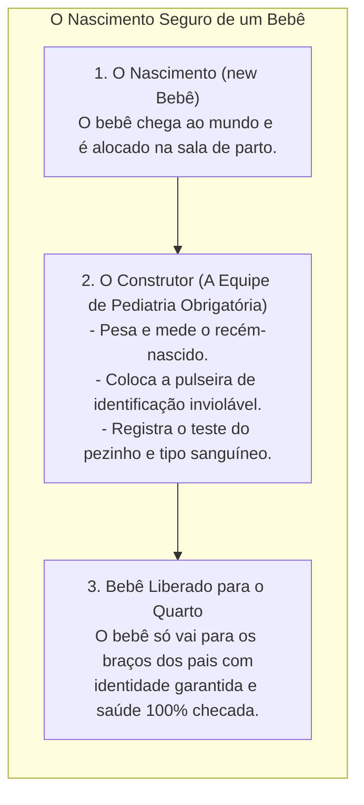
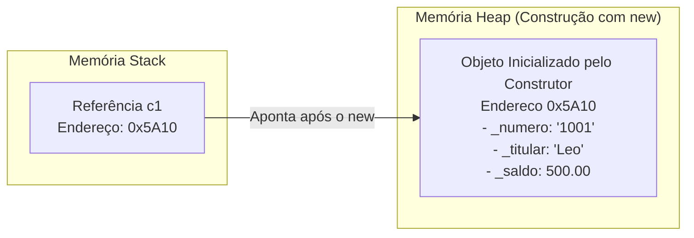
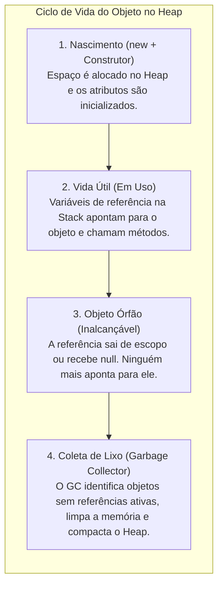
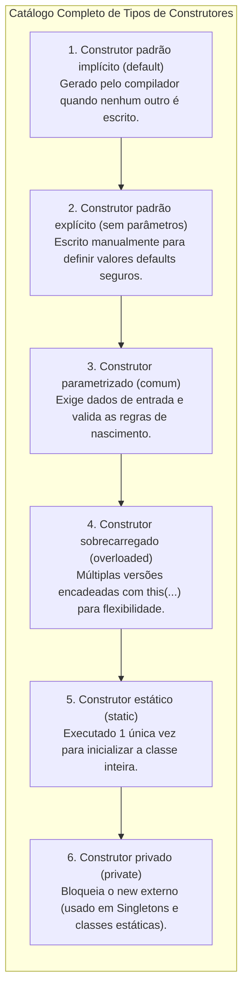
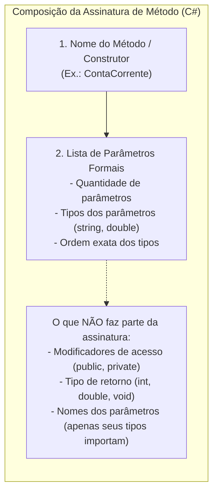
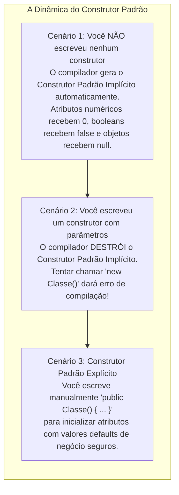
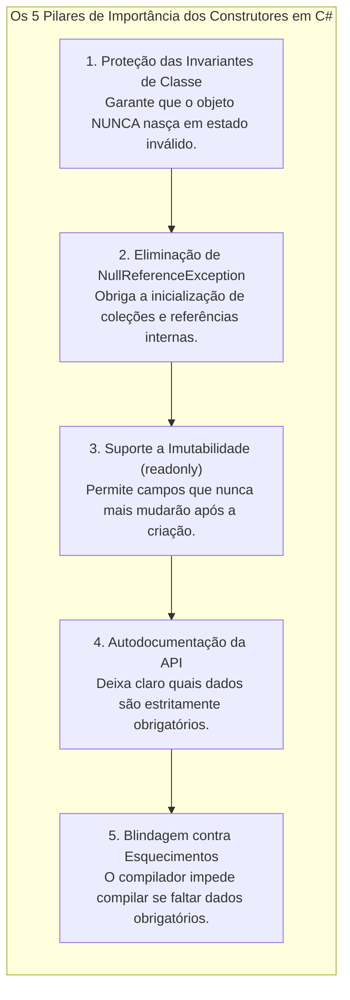

# Construtores: inicialização segura, sobrecarga e garantia de integridade

> **Contexto:** Na Programação Modular e Orientada a Objetos, os **Construtores** são os elementos-chave para inicializar objetos, garantindo que eles já nasçam em um estado válido e consistente. Este artigo explora as diversas formas de inicialização de um objeto a partir de construtores (padrão, parametrizado e sobrecarregado), a cadeia de chamadas com `this`, a proteção de **Invariantes de Classe** e como isso impacta diretamente na **Corretude** e **Robustez** do software explicados pela Técnica de Feynman.

---

## 1. O que é um construtor e por que ele é indispensável? (Técnica de Feynman)

Imagine uma **maternidade de hospital**:



Na Ciência da Computação:
* **O Construtor (*Constructor*):** É um método especial de inicialização que possui **o mesmo nome da classe** e **NUNCA aceita tipo de retorno (nem mesmo `void`)**. Ele é executado automaticamente no instante em que o operador `new` aloca o objeto no *Heap*.
* **A Missão do Construtor:** Garantir que o objeto **nunca nasça em um estado incompleto, inconsistente ou inválido** (ex.: uma conta bancária sem número de conta ou um triângulo com lados negativos).
* **Garantia de Invariantes de Classe:** As regras de integridade que devem ser verdadeiras durante toda a vida do objeto começam a ser estabelecidas e protegidas rigorosamente dentro do construtor.
* **A Semântica de Referência na Construção:** Em C# e Java, a variável que você declara na *Stack* (`ContaCorrente c1;`) é apenas uma **referência** (um ponteiro que guarda um endereço). O construtor é o responsável por preencher o miolo do **objeto real alocado na memória *Heap***, e o operador `new` retorna o endereço desse miolo para a referência $\rightarrow$ [[Glossário de conceitos#9 Semântica de Referência Reference Semantics|Semântica de Referência no Glossário]].



### Por que um construtor NÃO pode ter a palavra-chave `void`?

Muitos iniciantes perguntam: *"Se o construtor executa uma rotina e não possui comando `return`, por que ele não é declarado como `void`?"*

1. **O operador `new` já define o tipo de retorno implícito:**
   - Quando você escreve `ContaCorrente c = new ContaCorrente();`, a instrução `new` espera que a inicialização devolva **a própria referência da nova instância criada**.
   - Se o construtor tivesse `void`, ele estaria dizendo formalmente ao compilador: *"Eu retorno o vazio absoluto"*. Isso geraria uma contradição lógica insuperável com o `new`, que obrigatoriamente precisa retornar o endereço do objeto recém-criado na memória Heap.
2. **Perigo de virar um Método Normal Comum:**
   - Se você colocar acidentalmente `public void ContaCorrente() { ... }`, o compilador do C# e Java **não emitirá erro de sintaxe**, mas **rebaixará o construtor para um método comum com o mesmo nome da classe**.
   - Resultado: o seu código de inicialização **NUNCA será executado pelo `new`**, e o objeto nascerá com todos os atributos vazios ou nulos, gerando bugs silenciosos de difícil localização!

---

## 2. O ciclo de vida completo: o construtor (nascimento) e o coletor de lixo (morte)

Em linguagens com gerenciamento automático de memória como C# (.NET) e Java (JVM), o desenvolvedor controla o **nascimento** do objeto (via `new` e Construtor), mas não precisa desalocar a memória manualmente. Essa limpeza é feita pelo **Coletor de Lixo (*Garbage Collector - GC*)**.



### A intuição (Técnica de Feynman):
* **O construtor é a maternidade:** Ele cria o objeto e entrega a certidão de nascimento e a chave de acesso (a referência).
* **O coletor de lixo é o caminhão de reciclagem:** Ele passa em segundo plano varrendo a memória *Heap*. Se um objeto não possui **nenhum controle remoto (referência) apontando para ele**, ele se torna um **objeto órfão/inacessível**. O GC recolhe esse objeto e devolve a memória RAM livre para o sistema operacional, evitando **vazamentos de memória (*Memory Leaks*)**.

---

## 3. Taxonomia completa: todos os tipos de construtores em POO e C#

Existem **6 tipos fundamentais de construtores** na teoria da Programação Orientada a Objetos e no ecossistema C#:



### O que faz cada um dos 6 tipos:

1. **Construtor padrão implícito (*implicit default constructor*):** Fornecido automaticamente pelo compilador se você não escrever nenhum construtor. Ele não recebe parâmetros e apenas zera a memória (`0`, `false`, `null`).
2. **Construtor padrão explícito (*explicit parameterless constructor*):** Escrito pelo desenvolvedor sem parâmetros (`public Conta() { ... }`) para preencher valores *defaults* de negócio predeterminados.
3. **Construtor parametrizado (*parameterized constructor*):** Recebe argumentos obrigatórios para preencher o estado do objeto desde o nascimento com proteção de validação.
4. **Construtores sobrecarregados (*overloaded constructors*):** Duas ou mais assinaturas de construtores com diferentes listas de parâmetros na mesma classe, encadeadas via `: this(...)`.
5. **Construtor estático (*static constructor*):** Declarado com `static NomeDaClasse()`. É executado automaticamente pelo *runtime* **uma única vez** antes do primeiro objeto ser criado ou do primeiro membro estático ser acessado, servindo para inicializar variáveis globais da classe. Não recebe modificadores de visibilidade (`public/private`) nem parâmetros.
6. **Construtor privado (*private constructor*):** Declarado com `private NomeDaClasse()`. **Impede que qualquer código de fora use o operador `new`**, sendo a base de padrões como **Singleton** (onde só pode existir uma instância global no sistema inteiro) ou classes puramente utilitárias.

---

## 4. O que é a assinatura de um método? (*Method Signature*)

Para entender como a **Sobrecarga de Construtores** funciona, é indispensável dominar o conceito formal de **Assinatura de Método (*Method Signature*)**.



### A intuição (Técnica de Feynman):
* **A assinatura é o "RG / CPF" do método:** Para o compilador, o identificador único de um método **não é apenas o seu nome**, mas sim o par **`Nome + Tipos dos Parâmetros na Ordem`**.
* **Como a sobrecarga (*overloading*) se torna possível?**
  Você pode ter métodos ou construtores com o **mesmo nome**, desde que suas **assinaturas sejam diferentes**:
  - `ContaBancaria(string, string, double)` $\rightarrow$ Assinatura A (3 parâmetros).
  - `ContaBancaria(string, string)` $\rightarrow$ Assinatura B (2 parâmetros).
  - O compilador olha para os argumentos que você passou na chamada (`new ContaBancaria("101", "Leo")`) e sabe com precisão cirúrgica qual construtor invocar!
* **A regra de ouro:** Duas rotinas **não podem ter a mesma assinatura na mesma classe**, mesmo que o tipo de retorno ou modificadores sejam diferentes, pois o compilador ficaria em dúvida (*ambiguidade*) sobre qual executar.

---

## 5. Exemplos atômicos por conceito (C#)

### a. Construtor padrão (*Default Constructor*): implícito vs. explícito

O termo **Construtor Padrão (*Default Constructor*)** refere-se ao construtor que **não aceita nenhum parâmetro** (`public NomeDaClasse()`). Ele existe em duas modalidades fundamentais:



#### A intuição de Feynman para o construtor padrão:
* **O implícito é o apartamento vazio na planta:** A construtora te entrega as chaves sem cobrar nada adicional, mas a casa não tem lâmpadas, piso nem móveis (tudo zerado / `null`).
* **O explícito é o apartamento decorado básico:** Você define que todo comprador que entrar sem fazer exigências personalizadas já encontrará lâmpadas de LED ligadas e geladeira abastecida com água (`_nome = "Padrão"`, `_preco = 0.01`).

```csharp
public class Produto 
{
    private string _nome;
    private double _preco;

    // Construtor padrão explícito: garante que o objeto não nasça com valores nulos perigosos
    public Produto() 
    {
        _nome = "Item Não Cadastrado"; // Evita _nome = null
        _preco = 0.01;                  // Evita _preco = 0.00
    }
}
```

> **Regra de ouro do compilador:** Se a sua classe tiver `public Produto(string nome, double preco)` e você ainda quiser permitir que outros desenvolvedores criem `Produto p = new Produto();`, você é **obrigado a escrever o construtor padrão explicitamente**.

---

### b. Construtor parametrizado com validação de regras
Quando determinados dados são vitais para a existência da entidade, criamos um construtor que **exige parâmetros obrigatórios** e valida os dados antes de aceitá-los:

```csharp
public class Produto 
{
    private string _nome;
    private double _preco;

    // Construtor Parametrizado: exige nome e preço na criação
    public Produto(string nome, double preco) 
    {
        if (string.IsNullOrWhiteSpace(nome)) 
        {
            throw new ArgumentException("O nome do produto não pode ser vazio.");
        }
        if (preco <= 0) 
        {
            throw new ArgumentOutOfRangeException("O preço deve ser estritamente maior que zero.");
        }

        _nome = nome;
        _preco = preco;
    }
}
```

> **Atenção:** Assim que você escreve qualquer construtor com parâmetros na classe, o C# **destrói o construtor padrão implícito sem parâmetros**. Se você ainda quiser permitir criar o objeto vazio, precisa declarar explicitamente `public Produto() { }`.

---

### c. Sobrecarga de construtores e encadeamento com `this(...)`
Uma classe pode ter **múltiplos construtores com diferentes listas de parâmetros** (*Constructor Overloading*). Para evitar duplicação de código (*Don't Repeat Yourself - DRY*), usamos o operador **`: this(...)`** para reaproveitar a lógica do construtor principal:

```csharp
public class Produto 
{
    private string _codigo;
    private string _nome;
    private double _preco;

    // 1. Construtor Principal Completo
    public Produto(string codigo, string nome, double preco) 
    {
        _codigo = codigo;
        _nome = nome;
        _preco = preco > 0 ? preco : 0.01;
    }

    // 2. Construtor Secundário: se não passar o código, gera um automático e chama o principal
    public Produto(string nome, double preco) 
        : this("GERADO-" + Guid.NewGuid().ToString().Substring(0, 8), nome, preco) 
    {
        // O corpo aqui fica limpo, pois o construtor principal já fez o trabalho!
    }

    // 3. Construtor Mínimo: se passar apenas o nome, assume preço promocional de R$ 1.00
    public Produto(string nome) 
        : this(nome, 1.00) 
    {
    }
}
```

---

### d. Construtor estático (inicialização única da classe)
O construtor estático não aceita modificadores de visibilidade (`public`/`private`) nem parâmetros, e roda automaticamente pelo CLR uma única vez na inicialização da aplicação:

```csharp
public class ConfiguracaoDoSistema 
{
    private static DateTime _horaDeInicializacao;

    // Construtor Estático: executado automaticamente 1 única vez
    static ConfiguracaoDoSistema() 
    {
        _horaDeInicializacao = DateTime.Now;
    }
}
```

---

### e. Construtor privado (bloqueando o operador `new`)
Colocar `private` no construtor proíbe que qualquer classe externa crie instâncias com `new`, forçando o controle de acesso por métodos estáticos:

```csharp
public class GerenciadorDeSessao 
{
    // Construtor Privado: proíbe "new GerenciadorDeSessao()" de fora
    private GerenciadorDeSessao() 
    {
    }

    // Ponto de acesso controlado (Padrão Singleton)
    public static GerenciadorDeSessao InstanciaUnica { get; } = new GerenciadorDeSessao();
}
```

---

---

## 6. Exemplo completo integrado em C#

Abaixo, veja o código integral compilável demonstrando a classe `ContaBancaria` com múltiplos construtores sobrecarregados, validação defensiva e execução no método `Main`:

```csharp
using System;

namespace ModuloConstrutores 
{
    public class ContaBancaria 
    {
        // 1. Atributos Privados
        private readonly string _numeroConta;
        private string _titular;
        private double _saldo;

        // 2. Construtor Completo (Principal)
        public ContaBancaria(string numeroConta, string titular, double depositoInicial) 
        {
            if (string.IsNullOrWhiteSpace(numeroConta)) 
            {
                throw new ArgumentException("Número de conta é obrigatório.");
            }
            if (string.IsNullOrWhiteSpace(titular)) 
            {
                throw new ArgumentException("Titular da conta é obrigatório.");
            }

            _numeroConta = numeroConta;
            _titular = titular;
            _saldo = depositoInicial >= 0 ? depositoInicial : 0.0;
        }

        // 3. Construtor Sobrecregado (Conta sem depósito inicial)
        public ContaBancaria(string numeroConta, string titular) 
            : this(numeroConta, titular, 0.0) 
        {
        }

        // 4. Métodos Públicos
        public void Depositar(double valor) 
        {
            if (valor > 0) 
            {
                _saldo += valor;
            }
        }

        public bool Sacar(double valor) 
        {
            if (valor > 0 && _saldo >= valor) 
            {
                _saldo -= valor;
                return true;
            }
            return false;
        }

        public void ExibirExtrato() 
        {
            Console.WriteLine($"[Conta: {_numeroConta}] Titular: {_titular} | Saldo: R$ {_saldo:F2}");
        }
    }

    class Program 
    {
        static void Main() 
        {
            Console.WriteLine("=== Demonstração de Construtores em C# ===");

            // Instanciação com construtor completo (3 parâmetros)
            ContaBancaria c1 = new ContaBancaria("1001-A", "Leo Ruas", 1500.00);

            // Instanciação com construtor sobrecarregado (2 parâmetros, saldo zero)
            ContaBancaria c2 = new ContaBancaria("2002-B", "Maria Silva");

            c1.ExibirExtrato(); // Saldo R$ 1500.00
            c2.ExibirExtrato(); // Saldo R$ 0.00

            c2.Depositar(300.00);
            c2.ExibirExtrato(); // Saldo R$ 300.00
        }
    }
}
```

---

## 7. Por que é fundamental criar construtores em C#? (Impacto na qualidade)

Criar construtores explícitos e bem planejados em C# não é apenas uma formalidade de sintaxe; é a **linha de defesa primária** de toda a arquitetura orientada a objetos.



### Os 5 motivos essenciais:

1. **Garantia de invariantes de classe (*class invariants*):**
   - Regras de negócio essenciais (ex.: "toda conta bancária deve ter titular e número válidos", "um triângulo deve respeitar a desigualdade triangular") são validadas **antes** de o objeto ser liberado para a memória. Se a regra for violada, o construtor lança uma exceção e o objeto defeituoso nem chega a existir.
2. **Eliminação do "pesadelo do `null`" (*null safety*):**
   - Quando um objeto possui coleções internas (ex.: `List<Item> _itens;`), o construtor é o responsável por inicializá-las (`_itens = new List<Item>();`). Sem o construtor, o primeiro comando `conta.AdicionarItem(...)` causaria o travamento imediato da aplicação com `NullReferenceException`.
3. **Habilitação de imutabilidade com a palavra-chave `readonly`:**
   - Em C#, campos marcados como `readonly` (ex.: `private readonly string _numeroConta;`) **só podem receber valores dentro do construtor**. Isso garante integridade absoluta: ninguém conseguirá alterar o número da conta depois que ela foi construída.
4. **API clara e autodocumentada (*design by contract*):**
   - O construtor atua como um **contrato formal de nascimento**. Ao olhar para a assinatura `public Aluno(string matricula, string cpf, string nome)`, qualquer desenvolvedor da equipe sabe instantaneamente quais dados são vitais sem precisar ler 500 linhas de documentação.
5. **Correção e robustez automáticas pelo compilador ($\rightarrow$ [[Glossário de conceitos#14 Robustez Robustness|Robustez no Glossário]]):**
   - **Sem construtor parametrizado:** O desenvolvedor precisa instanciar o objeto vazio e lembrar de atribuir manualmente propriedade por propriedade (`a.Matricula = "..."; a.Cpf = "...";`). Se ele esquecer uma linha, o bug só explodirá dias depois em produção.
   - **Com construtor parametrizado:** O compilador atua como um inspetor de qualidade. É **impossível compilar o código** sem fornecer todos os dados obrigatórios! $\rightarrow$ [[05. Fatores externos de qualidade de software|Fatores Externos de Qualidade]].

---

## 8. Resumo comparativo: tipos de construtores

| Tipo de construtor | Quando é usado? | Vantagem principal | Risco se usado indevidamente |
| :--- | :--- | :--- | :--- |
| **Padrão implícito** | Gerado automaticamente pelo compilador quando nenhum construtor é escrito. | Facilidade de criação rápida. | Objeto pode nascer com atributos nulos e estado inconsistente. |
| **Padrão explícito (`public Classe()`)** | Quando queremos definir valores *defaults* seguros pré-estabelecidos. | Criação simplificada sem obrigar parâmetros na hora. | Nem sempre a entidade possui valores *default* válidos no mundo real. |
| **Parametrizado** | Para entidades de negócio com dados obrigatórios (CPF, Titular, ID). | **Garante correção e robustez:** o objeto já nasce 100% válido. | Quem instancia é obrigado a conhecer e fornecer os dados. |
| **Sobrecarga com `this(...)`** | Para oferecer flexibilidade de inicialização sem duplicar código. | Código limpo, centralizado e livre de duplicações (*DRY*). | Criar sobrecargas em excesso pode gerar confusão na API. |

---

## Referências bibliográficas

### Bibliografia básica
* MEYER, Bertrand. **Object-Oriented Software Construction**. 2. ed. Prentice Hall, 1997.
* SOMMERVILLE, Ian. **Engenharia de Software**. 10. ed. São Paulo: Pearson, 2019.
* MARTIN, Robert C. **Código Limpo: Habilidades Práticas do Agile Software**. Rio de Janeiro: Alta Books, 2011.

### Bibliografia complementar
* MICROSOFT. **Construtores (Guia de Programação em C#)**. Microsoft Learn, 2023. Disponível em: [https://learn.microsoft.com/pt-br/dotnet/csharp/programming-guide/classes-and-structs/constructors](https://learn.microsoft.com/pt-br/dotnet/csharp/programming-guide/classes-and-structs/constructors).
* SEBESTA, Robert W. **Conceitos de Linguagens de Programação**. 11. ed. Porto Alegre: Bookman, 2018.
* TENENBAUM, Aaron M.; LANGSAM, Yedidyah; AUGENSTEIN, Moshe J. **Estruturas de Dados Usando C**. São Paulo: Makron Books, 1995.

---

## Artigos relacionados e navegação

* **Artigo anterior:** [[07. Atributos e métodos (classes, objetos e definição de membros)]]
* **Resumo da disciplina:** [[00. Programação modular - Resumo]]
* **Glossário da disciplina:** [[Glossário de conceitos]]
* **Guia de Sintaxe Multilinguagem:** [[00. Sintaxe Multilinguagem/05. Abstração e encapsulamento com classes (TADs)]]
* **Guia de Sintaxe (Modificadores e static):** [[00. Sintaxe Multilinguagem/06. Modificadores de acesso, escopo e a palavra-chave static]]
* **Índice geral do vault:** [[index.md|Página Inicial do Vault]]
