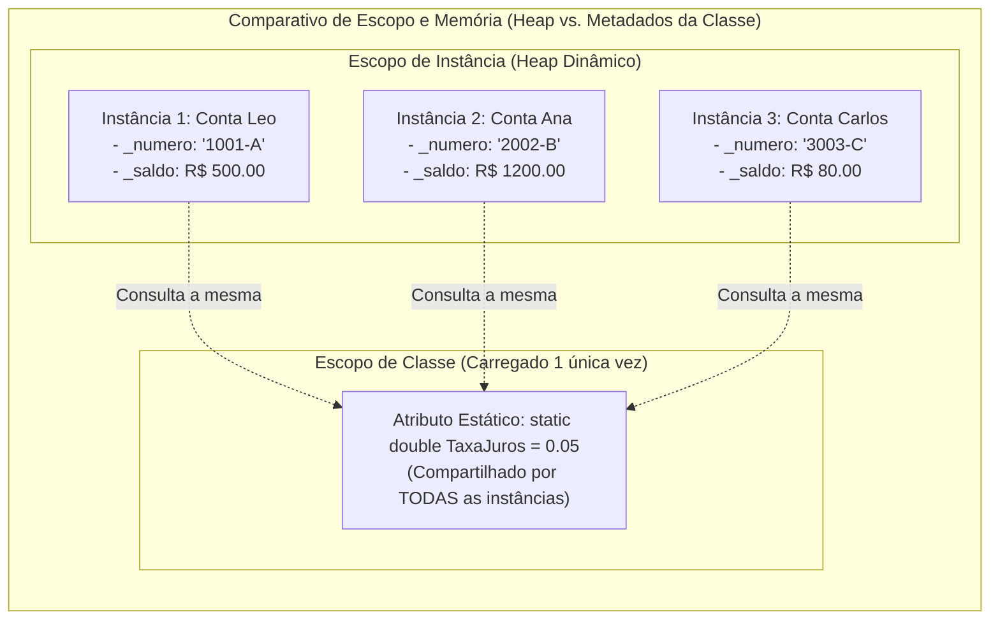
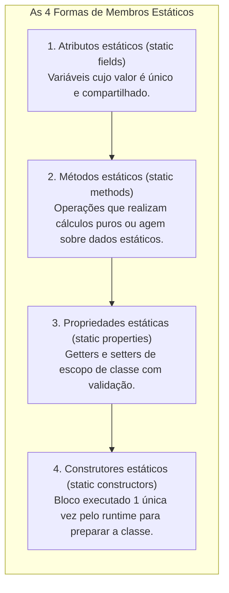
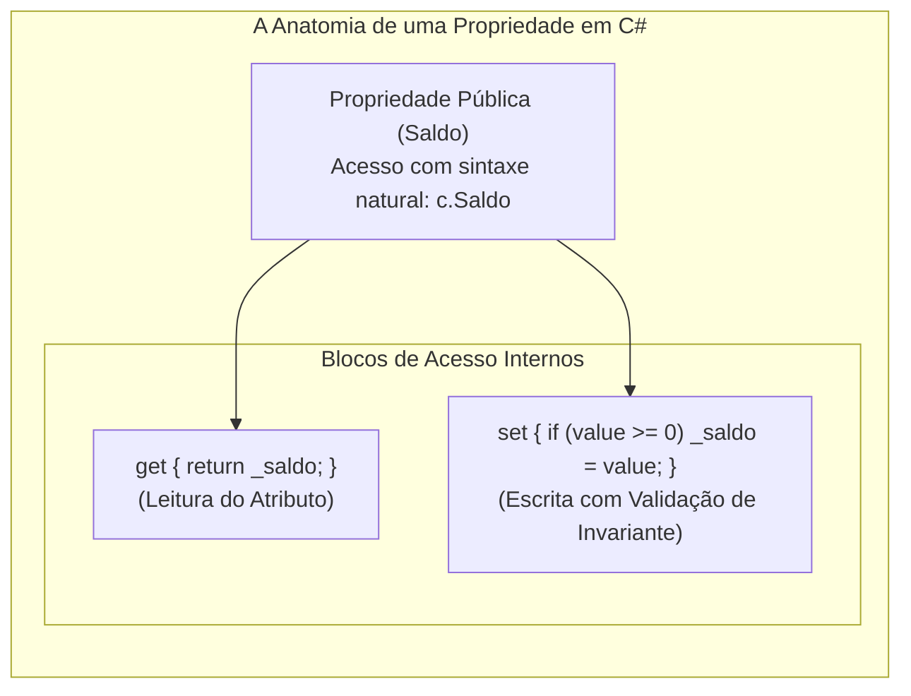
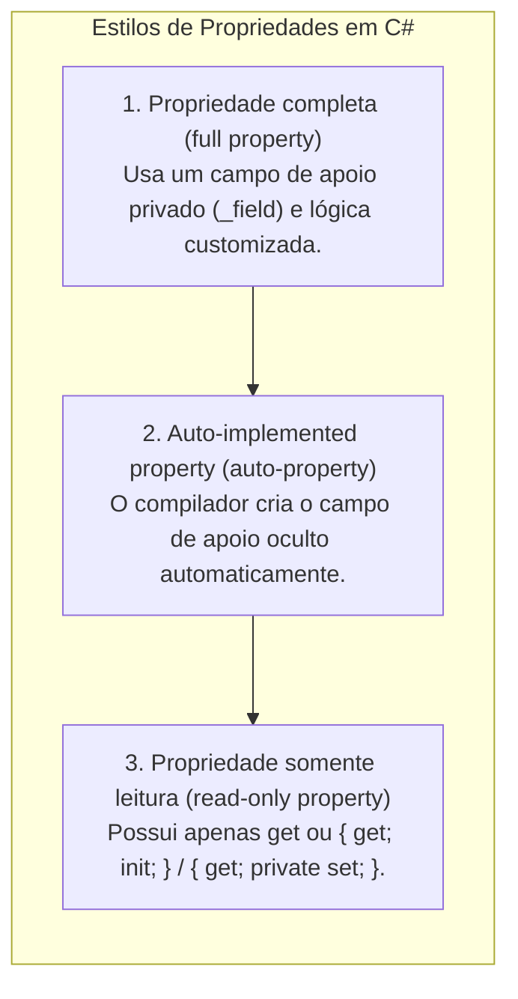
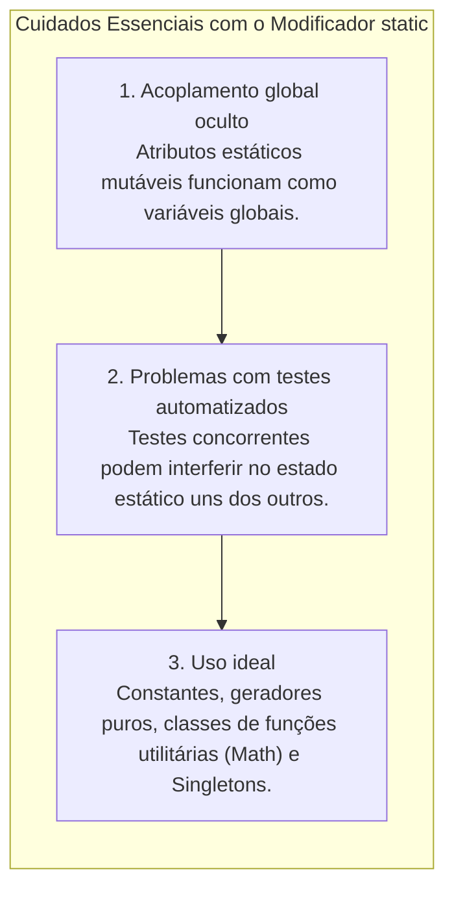

# 09. Atributos estáticos e propriedades (compartilhamento de estado e encapsulamento)

> **Contexto:** Em sistemas orientados a objetos, cada instância normalmente mantém seu próprio estado isolado. Contudo, em diversos cenários práticos é necessário que múltiplos objetos compartilhem informações comuns (como contadores globais, geradores de identificadores únicos, taxas de juros ou configurações centralizadas). Este artigo explora o conceito de **membros estáticos (`static`)**, o **escopo de classe vs. escopo de instância**, e as **propriedades (*Properties*) em C#**, combinando proteção de invariantes com sintaxe limpa e fluida explicadas pela Técnica de Feynman.

---

## 1. Escopo de instância vs. escopo de classe: onde vivem os dados?

Para entender o modificador `static`, é indispensável contrastar as duas categorias fundamentais de armazenamento de uma classe:



### A intuição (Técnica de Feynman):
* **Atributo de instância (não-estático):** A **carteira de dinheiro individual de cada pessoa**. O Leo tem a sua carteira com R$ 500, a Ana tem a dela com R$ 1.200 e o Carlos tem a dele com R$ 80. Se o Leo gastar R$ 50, apenas a carteira do Leo diminui; a carteira da Ana e a do Carlos permanecem intactas.
* **Atributo estático (`static`):** O **ar-condicionado ou a luz do teto da sala de aula**. Ele não pertence a nenhum aluno individualmente, mas sim ao **espaço compartilhado da sala (a Classe)**. Se qualquer pessoa mudar a temperatura do ar-condicionado para 20°C, **todos os alunos na sala sentem a nova temperatura instantaneamente**. $\rightarrow$ [[Glossário de conceitos#17 Escopo Scope|Escopo no Glossário]].

---

## 2. O que é um membro estático? (*Static Member*)

Um **membro estático (*Static Member*)** é definido formalmente como um componente de uma classe com **tempo de vida global** e **escopo local (delimitado à classe)**. São atributos ou métodos que são comuns a todos os objetos de uma classe. Quando declaramos um atributo ou método estático, ele deixa de ser associado a instâncias isoladas e passa a ser um **membro de classe**, sendo compartilhado por todos os objetos daquela classe $\rightarrow$ [[Glossário de conceitos#15 Membro estático Static Member|Membro Estático no Glossário]].

* **Tempo de Vida Global vs. Escopo Local:** Ele permanece vivo na memória durante toda a execução do programa (*tempo de vida global*), mas suas regras de encapsulamento e visibilidade continuam restritas e protegidas dentro das fronteiras da classe onde foi declarado (*escopo local de classe*).
* **Alocação Única na Memória:** Enquanto os membros de instância são replicados a cada nova chamada do operador `new`, os membros estáticos possuem **uma única cópia para toda a aplicação**, alocados na área de metadados da classe no momento em que o tipo é carregado pela primeira vez.



### Regras de ouro dos membros estáticos:
1. **Invocação direta pela classe:** Membros estáticos são chamados através do **Nome da Classe**, e nunca por meio de uma variável de instância (ex.: `ContaBancaria.TaxaDeRendimento`, `Math.Sqrt(25)`).
2. **Métodos estáticos não possuem `this`:** Como o método estático roda no escopo da classe e não em uma instância específica, ele **não tem acesso ao ponteiro `this`** e não pode ler diretamente atributos não-estáticos.
3. **Compartilhamento em tempo real:** Se uma instância alterar um atributo estático público ou através de um método, todas as outras instâncias verão a alteração no exato milissegundo seguinte.

---

## 3. Propriedades em C# (*Properties*): a evolução do encapsulamento

Em linguagens como Java e C++, o encapsulamento tradicional exige a escrita de métodos manuais `getSaldo()` e `setSaldo(double valor)` para proteger atributos privados. O C# introduziu uma construção de primeira classe chamada **Propriedade (*Property*)**.



### Vantagens das propriedades:
* **Sintaxe fluida de atributo:** Para quem consome a classe, o acesso parece a leitura de uma variável comum (`double s = conta.Saldo; conta.Saldo = 1000;`).
* **Segurança e proteção de invariantes de método:** Por debaixo dos panos, o compilador transforma a leitura em uma invocação de função `get_Saldo()` e a atribuição em `set_Saldo(value)`, permitindo validações rigorosas e prevenindo corrupção de estado.

---

## 4. Tipos de propriedades em C#

O ecossistema C# oferece três estilos principais de propriedades para atender diferentes necessidades de encapsulamento:



### O que faz cada estilo:
1. **Propriedade completa (*full property*):** Utilizada sempre que é necessário **validar dados**, disparar eventos ou transformar o valor antes de gravar no atributo privado (*backing field*).
2. **Propriedade autoimplementada (*auto-property*):** Utilizada quando não há lógica de validação especial imediata (`public string Titular { get; set; }`). O compilador do C# gera um campo privado invisível por debaixo dos panos.
3. **Propriedades com controle de acesso refinado:** Permite leitura pública e escrita privada (`public double Saldo { get; private set; }`), impedindo que agentes externos alterem o saldo sem passar pelos métodos de negócio (`Sacar` e `Depositar`).

---

## 5. Exemplos atômicos por conceito (C#)

### a. Atributo estático como gerador sequencial de IDs e contador global

Demonstração isolada de como atributos estáticos acumulam estado compartilhado entre múltiplos objetos:

```csharp
public class Pedido 
{
    // Atributo estático: compartilhado por todas as instâncias (contador global)
    private static int _proximoNumero = 1000;

    // Atributo de instância: único para cada pedido
    private readonly int _numeroPedido;

    public Pedido() 
    {
        // Cada novo pedido consome o número atual e incrementa o contador estático
        _numeroPedido = _proximoNumero;
        _proximoNumero++;
    }

    public int ObterNumero() 
    {
        return _numeroPedido;
    }

    // Método estático para consultar o totalizador sem precisar instanciar
    public static int ObterProximoNumeroDisponivel() 
    {
        return _proximoNumero;
    }
}
```

---

### b. Propriedade completa com validação de invariante (`get` e `set`)

Demonstração isolada de como a propriedade protege o atributo privado contra dados inconsistentes:

```csharp
public class Termostato 
{
    private double _temperaturaCelsius; // Campo de apoio privado (Backing Field)

    public double TemperaturaCelsius 
    {
        get 
        {
            return _temperaturaCelsius;
        }
        set 
        {
            // O parâmetro implícito 'value' carrega o dado atribuído
            if (value < -273.15) 
            {
                throw new ArgumentOutOfRangeException(nameof(value), "Temperatura abaixo do zero absoluto!");
            }
            _temperaturaCelsius = value;
        }
    }
}
```

---

### c. Auto-properties com modificadores de acesso assimétricos

Demonstração isolada de propriedades autoimplementadas que protegem a mutabilidade:

```csharp
public class Cliente 
{
    // Leitura e escrita públicas
    public string Nome { get; set; }

    // Leitura pública, mas alteração restrita aos métodos internos da classe
    public DateTime DataDeCadastro { get; private set; }

    // Propriedade somente leitura na criação (Imutabilidade com 'init')
    public string Cpf { get; init; }

    public Cliente(string cpf, string nome) 
    {
        Cpf = cpf;
        Nome = nome;
        DataDeCadastro = DateTime.Now;
    }
}
```

---

### d. Propriedade estática compartilhada

Demonstração isolada de propriedade de escopo de classe com validação global:

```csharp
public class ConfiguracaoFinanceira 
{
    private static double _taxaIof = 0.0038; // 0.38% padrão

    // Propriedade estática: acessada via ConfiguracaoFinanceira.TaxaIof
    public static double TaxaIof 
    {
        get => _taxaIof;
        set 
        {
            if (value < 0 || value > 1.0) 
            {
                throw new ArgumentOutOfRangeException(nameof(value), "Taxa deve estar entre 0% e 100%.");
            }
            _taxaIof = value;
        }
    }
}
```

---

## 6. Exemplo completo integrado (C#)

Abaixo está o programa completo, executável e didático integrando atributos estáticos (gerador de conta e contador global), métodos estáticos, propriedades completas, auto-properties e manipulação de estado:

```csharp
using System;

namespace ProgramacaoModular.MembrosEstaticos 
{
    public class ContaBancaria 
    {
        // 1. Membros Estáticos (Escopo de Classe - Compartilhados)
        private static int _contadorDeContas = 0;
        private static double _taxaDeManutencaoGlobal = 12.50;

        // 2. Propriedades Autoimplementadas com Proteção de Escopo
        public int NumeroConta { get; }
        public string Titular { get; set; }
        public double Saldo { get; private set; }

        // 3. Propriedade Estática
        public static double TaxaDeManutencaoGlobal 
        {
            get => _taxaDeManutencaoGlobal;
            set 
            {
                if (value < 0) 
                {
                    throw new ArgumentOutOfRangeException(nameof(value), "Taxa de manutenção não pode ser negativa.");
                }
                _taxaDeManutencaoGlobal = value;
            }
        }

        // 4. Construtor Parametrizado
        public ContaBancaria(string titular, double saldoInicial) 
        {
            if (string.IsNullOrWhiteSpace(titular)) 
            {
                throw new ArgumentException("Titular obrigatório.", nameof(titular));
            }
            if (saldoInicial < 0) 
            {
                throw new ArgumentOutOfRangeException(nameof(saldoInicial), "Saldo inicial não pode ser negativo.");
            }

            _contadorDeContas++;
            NumeroConta = _contadorDeContas; // Gera ID sequencial automático
            Titular = titular;
            Saldo = saldoInicial;
        }

        // 5. Métodos de Instância
        public void Depositar(double valor) 
        {
            if (valor > 0) 
            {
                Saldo += valor;
            }
        }

        public bool Sacar(double valor) 
        {
            if (valor > 0 && Saldo >= valor) 
            {
                Saldo -= valor;
                return true;
            }
            return false;
        }

        public void AplicarTaxaGlobal() 
        {
            Saldo -= _taxaDeManutencaoGlobal;
        }

        public void ExibirResumo() 
        {
            Console.WriteLine($"[Conta #{NumeroConta:D4}] Titular: {Titular} | Saldo: R$ {Saldo:F2}");
        }

        // 6. Método Estático
        public static int ObterTotalDeContasCriadas() 
        {
            return _contadorDeContas;
        }
    }

    class Program 
    {
        static void Main() 
        {
            Console.WriteLine("=== Demonstração de Membros Estáticos e Propriedades ===");

            // Instanciação de objetos (cada um recebe seu ID sequencial pelo atributo estático)
            ContaBancaria c1 = new ContaBancaria("Leo Ruas", 1000.00);
            ContaBancaria c2 = new ContaBancaria("Ana Maria", 2500.00);
            ContaBancaria c3 = new ContaBancaria("Carlos Drummond", 300.00);

            c1.ExibirResumo(); // Conta #0001
            c2.ExibirResumo(); // Conta #0002
            c3.ExibirResumo(); // Conta #0003

            // Consultando método estático diretamente pela classe
            Console.WriteLine($"\nTotal de contas ativas no banco: {ContaBancaria.ObterTotalDeContasCriadas()}");

            // Alterando propriedade estática global
            Console.WriteLine($"\nTaxa global antiga: R$ {ContaBancaria.TaxaDeManutencaoGlobal:F2}");
            ContaBancaria.TaxaDeManutencaoGlobal = 15.00; // Altera para todos!
            Console.WriteLine($"Nova taxa global definida: R$ {ContaBancaria.TaxaDeManutencaoGlobal:F2}");

            // Aplicando a taxa nas contas individuais
            c1.AplicarTaxaGlobal();
            c2.AplicarTaxaGlobal();

            Console.WriteLine("\nSaldos após aplicação da taxa global:");
            Console.WriteLine($"Leo: R$ {c1.Saldo:F2} | Ana: R$ {c2.Saldo:F2}");
        }
    }
}
```

---

## 7. Boas práticas e cuidados no uso de membros estáticos



1. **Evite atributos estáticos mutáveis descontrolados:** Atributos estáticos mutáveis comportam-se como variáveis globais, aumentando o acoplamento e tornando o comportamento do sistema difícil de prever $\rightarrow$ [[04. Programação orientada a objetos e acoplamento|Acoplamento em POO]].
2. **Prefira propriedades a campos públicos:** Nunca exponha campos públicos (`public double Taxa;`). Utilize sempre propriedades (`public double Taxa { get; set; }`) para manter a capacidade de adicionar validações no futuro sem quebrar o código dos clientes.
3. **Use classes estáticas (`static class`) para utilitários:** Se uma classe reúne apenas funções puras de apoio e cálculos (como `Math` ou funções de formatação de string), marque a própria classe como `static`. Isso impede instanciação indevida e sinaliza a intenção arquitetural com clareza.

---

## 8. Resumo comparativo: membros de instância vs. estáticos

| Critério | Membro de instância | Membro estático (`static`) |
| :--- | :--- | :--- |
| **A quem pertence?** | Ao objeto individual instanciado no *Heap*. | À classe como um todo (carregado nos metadados). |
| **Como é chamado?** | Via variável de referência (`conta.Sacar()`). | Via nome da classe (`ContaBancaria.Taxa`). |
| **Presença do ponteiro `this`** | Sim, aponta para a instância corrente. | Não, é proibido acessar `this`. |
| **Multiplicidade na memória** | Uma cópia para cada objeto criado (`new`). | Uma única cópia para a aplicação inteira. |
| **Exemplo típico** | Saldo, Titular, CPF, Data de Nascimento. | Gerador de ID, PI (`Math.PI`), Taxa Selic global. |

---

## Referências bibliográficas

### Bibliografia básica
* MEYER, Bertrand. **Object-Oriented Software Construction**. 2. ed. Prentice Hall, 1997.
* SOMMERVILLE, Ian. **Engenharia de Software**. 10. ed. São Paulo: Pearson, 2019.
* MARTIN, Robert C. **Código Limpo: Habilidades Práticas do Agile Software**. Rio de Janeiro: Alta Books, 2011.

### Bibliografia complementar
* DE PAULA, Hugo. **Programação Modular: Exemplos de Classes e Objetos em C#**. GitHub, 2023. Disponível em: [https://github.com/hugodepaula/programacao-modular-ead/tree/main/exemplos/2_Classes_e_Objetos](https://github.com/hugodepaula/programacao-modular-ead/tree/main/exemplos/2_Classes_e_Objetos).
* MICROSOFT. **Propriedades (Guia de Programação em C#)**. Microsoft Learn, 2023. Disponível em: [https://learn.microsoft.com/pt-br/dotnet/csharp/programming-guide/classes-and-structs/properties](https://learn.microsoft.com/pt-br/dotnet/csharp/programming-guide/classes-and-structs/properties).
* MICROSOFT. **Classes Estáticas e Membros de Classes Estáticas (Guia de Programação em C#)**. Microsoft Learn, 2023. Disponível em: [https://learn.microsoft.com/pt-br/dotnet/csharp/programming-guide/classes-and-structs/static-classes-and-static-class-members](https://learn.microsoft.com/pt-br/dotnet/csharp/programming-guide/classes-and-structs/static-classes-and-static-class-members).
* SEBESTA, Robert W. **Conceitos de Linguagens de Programação**. 11. ed. Porto Alegre: Bookman, 2018.

---

## Artigos relacionados e navegação

* **Artigo anterior:** [[08. Construtores (inicialização, sobrecarga e garantia de invariantes)]]
* **Resumo da disciplina:** [[00. Programação modular - Resumo]]
* **Glossário da disciplina:** [[Glossário de conceitos]]
* **Guia de Sintaxe Multilinguagem:** [[00. Sintaxe Multilinguagem/06. Modificadores de acesso, escopo e a palavra-chave static]]
* **Índice geral do vault:** [[index.md|Página Inicial do Vault]]
