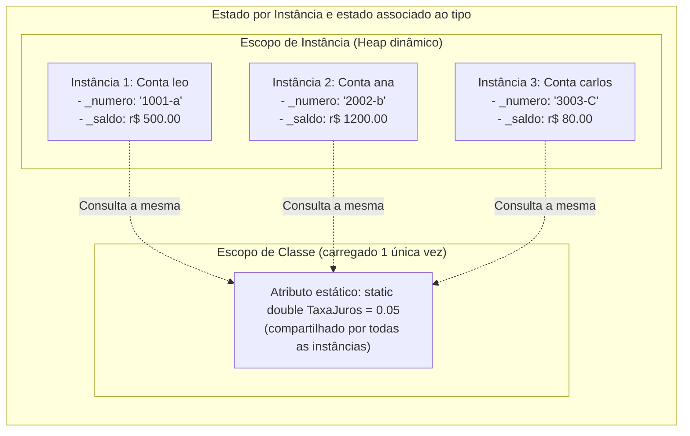
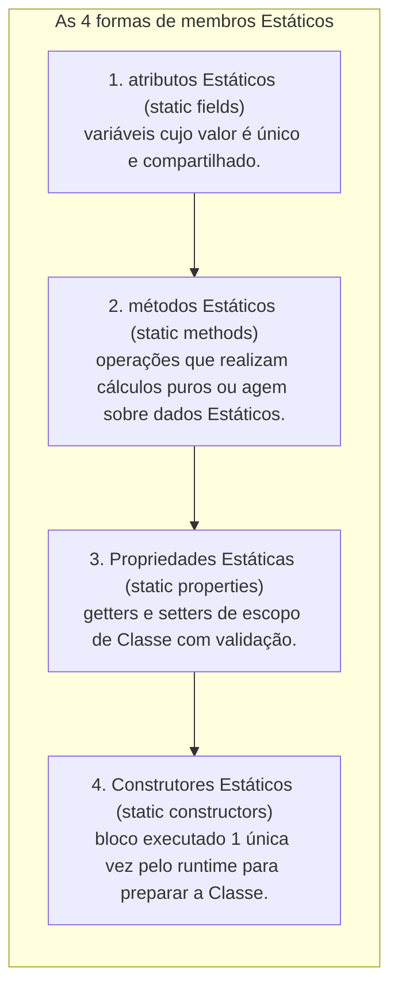
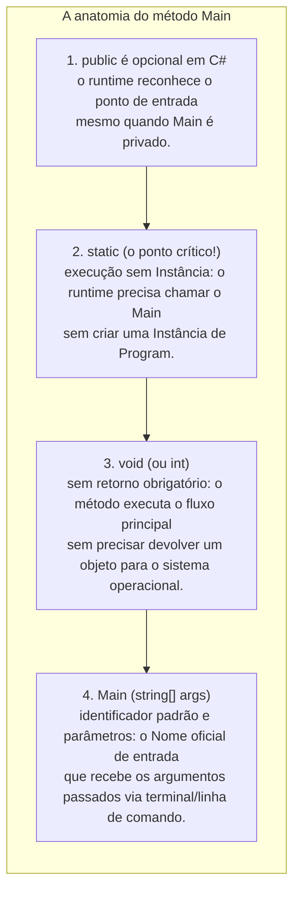
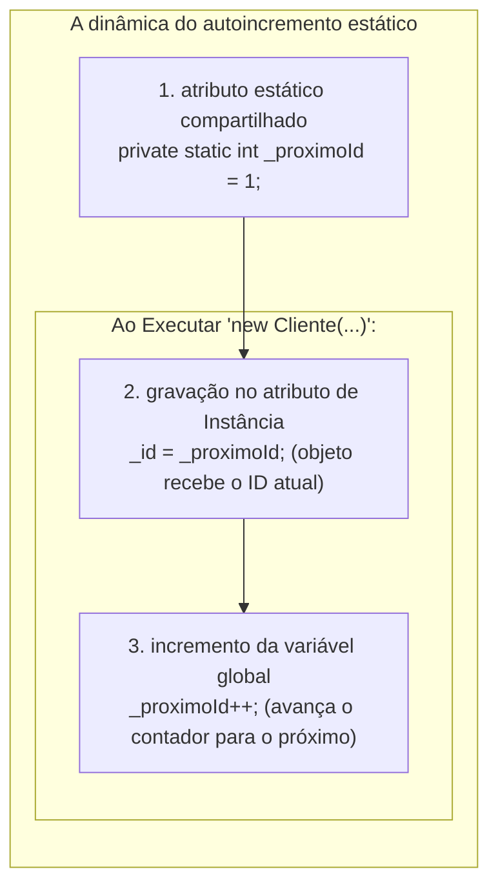
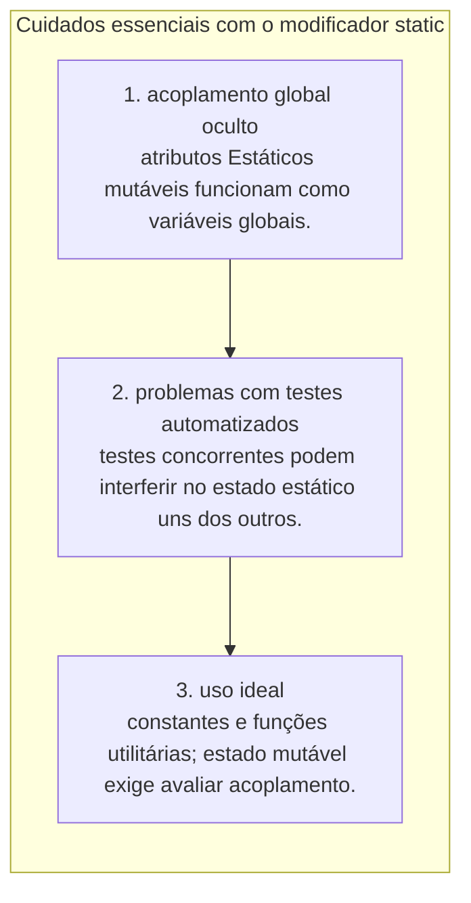
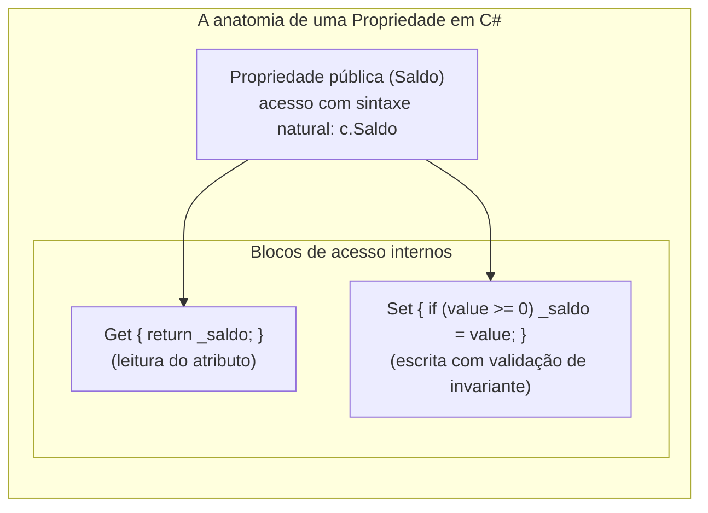
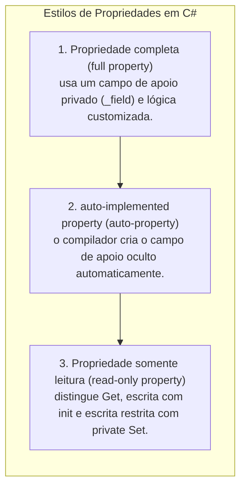

# 09. Atributos estáticos e propriedades (compartilhamento de estado e encapsulamento)

> **Contexto:** Esta nota desenvolve os conceitos de programação modular estudados na disciplina. As explicações de C#/.NET são complementação técnica; as analogias são recursos didáticos para acompanhar os exemplos.

---


**Percurso de leitura:** conceito central → mecânica em C# → aprofundamento técnico → conexões. A primeira camada constrói a ideia; os exemplos e detalhes permanecem disponíveis nas seguintes.

## 1. Conceito central

Duas contas têm saldos próprios, mas podem consultar uma mesma taxa. `static` expressa essa diferença: o membro pertence ao tipo e pode ser acessado sem uma instância receptora. Visibilidade e validação continuam sendo decisões separadas.

### Escopo de instância vs. escopo de classe: onde vivem os dados?

Para entender o modificador `static`, é indispensável contrastar as duas categorias fundamentais de armazenamento de uma classe:



#### A intuição (técnica de Feynman):
* **Atributo de instância (não-estático):** A **carteira de dinheiro individual de cada pessoa**. O Leo tem a sua carteira com R$ 500, a Ana tem a dela com R$ 1.200 e o Carlos tem a dele com R$ 80. Se o Leo gastar R$ 50, apenas a carteira do Leo diminui; a carteira da Ana e a do Carlos permanecem intactas.
* **Atributo estático (`static`):** O **ar-condicionado ou a luz do teto da sala de aula**. Ele não pertence a nenhum aluno individualmente, mas sim ao **espaço compartilhado da sala (a classe)**. Se qualquer pessoa mudar a temperatura do ar-condicionado para 20°C, **o ajuste passa a valer para a sala inteira; na execução concorrente, a analogia não substitui as regras de sincronização**. → [[Glossário de conceitos#17 Escopo Scope|Escopo no Glossário]].

---

## 2. Mecânica em C#

Acompanhe primeiro os métodos estáticos e o contador. Nos exemplos, campos e propriedades de instância coexistem com estado estático. O programa é sequencial: seus contadores não são geradores de identificadores para sistemas concorrentes ou distribuídos.

### O que é um membro estático? (*static member*)

Um **membro estático** pertence ao tipo, sem depender de uma instância receptora. Campos estáticos armazenam estado associado ao tipo; métodos estáticos executam sem `this`. A visibilidade continua sendo controlada por `private`, `public` e outros modificadores → [[Glossário de conceitos#15 Membro estático Static Member|Membro estático no glossário]].

* **Armazenamento não é metadado:** metadados descrevem o campo; seu valor é armazenado pelo runtime. Métodos de instância também não têm seu código copiado em cada objeto.
* **Uma cópia em qual âmbito?** No caso comum, há um campo estático por tipo carregado. Tipos genéricos fechados distintos têm campos estáticos distintos; processos e contextos de carregamento também podem isolar estado. `static` não significa unicidade global distribuída.
* **Tempo de vida:** o estado estático costuma acompanhar o tipo durante a execução. Referências estáticas podem reter objetos; tipos carregados em contextos descarregáveis não precisam existir até o fim do processo.



#### Regras de ouro dos membros estáticos:
1. **Invocação direta pela classe:** Membros estáticos são chamados através do **nome da classe**, e nunca por meio de uma variável de instância (ex.: `ContaBancaria.TaxaDeRendimento`, `Math.Sqrt(25)`).
2. **Métodos estáticos não possuem `this`:** Como o método estático roda no escopo da classe e não em uma instância específica, ele **não tem `this`**. Para ler ou alterar um campo de instância, precisa de uma referência explícita ao objeto.
3. **Barreira de acesso a atributos de instância (a pegadinha clássica `Jump()` e `count`):**
   - Para que um método estático possa acessar ou modificar o estado de um objeto, ele precisa obter uma referência: pode recebê-la como parâmetro, criar o objeto ou recuperá-lo de outro membro:
   ```csharp
   public class Kangaroo
   {
       private int count = 0;        // Atributo de instância (cada canguru tem o seu)
       private static int total = 0; // Atributo estático (compartilhado pela classe)

       // MÉTODO DE INSTÂNCIA: Pode acessar tudo (count deste objeto e total da classe)
       public void Pular()
       {
           count++; // Válido
           total++; // Válido
       }

       // MÉTODO ESTÁTICO: Pertence à classe como um todo
       public static void Jump()
       {
           // ERRO CS0120: count++; -> O método estático não sabe QUAL canguru pular!
           total++; // VÁLIDO: altera o contador global da classe
       }

       // MÉTODO ESTÁTICO CORRETO: Recebe a referência explícita do objeto
       public static void FazerPular(Kangaroo k)
       {
           k.count++; // VÁLIDO: agora sabe exatamente em qual instância mexer!
       }
   }
   ```
4. **Compartilhamento exige cuidado com concorrência:** o campo é o mesmo, mas isso não garante atomicidade nem visibilidade imediata entre threads. Incrementos e operações compostas precisam de sincronização apropriada.

---

#### Como ler o cabeçalho de `Main` em C#?

Em um executável C# com ponto de entrada explícito, `Main` é estático e não precisa ser público. Pode receber `string[] args` ou nenhum parâmetro, e retornar `void`, `int`, `Task` ou `Task<int>` nas formas admitidas. Instruções de nível superior permitem omitir a declaração explícita de `Main`. Java possui convenções próprias; não se deve transferir seu cabeçalho para C#.



##### A intuição de Feynman para o `static` no `Main`:
* **O paradoxo do ovo e da galinha (*The Bootstrap Paradox*):**
  - Para chamar um método normal de instância (não-estático), você precisa **criar um objeto primeiro com `new`** (`c = new MinhaClasse(); c.Executar();`).
  - Mas quem criaria o primeiro objeto se o programa ainda nem começou a rodar?
  - A palavra-chave **`static`** resolve essa contradição: ela permite que o Sistema Operacional / .NET CLR acione a função `Program.Main()` **diretamente pela classe, sem precisar instanciar nenhum objeto antes**! O `Main` é a faísca inicial que liga o motor de todo o sistema. → [[00. Sintaxe Multilinguagem/06. Modificadores de acesso, escopo e a palavra-chave static#1. Desconstrução dos cabeçalhos em C# (Técnica de Feynman)|Desconstrução de Cabeçalhos no Guia de Sintaxe]].

---

### Exemplos atômicos por conceito (C#)

#### Atributo estático com autoincremento (gerador automático de identificadores únicos)

O padrão de **autoincremento com atributo estático** é uma das aplicações mais elegantes de compartilhamento de estado em POO. Em execução sequencial, o contador atribui um número a cada objeto sem exigir esse controle do chamador. O exemplo não garante unicidade entre processos, reinícios, threads concorrentes ou após o limite do inteiro:



##### A intuição de Feynman para o autoincremento estático:
* **O dispensador de senhas do banco (rolo de fichas):**
  - O rolo de senhas de metal na parede do banco é **único para toda a agência (atributo estático `_proximoId`)**.
  - Quando um novo cliente chega à agência (`new Cliente()`), o atendente puxa a senha atual da parede e grampeia na pasta do cliente (`_id = _proximoId;`).
  - Em seguida, o rolo avança automaticamente uma posição (`_proximoId++`).
  - O cliente vai para casa levando o seu número permanente (`_id` de instância), enquanto o rolo da parede continua pronto para a próxima pessoa que entrar no banco!

```csharp
public class Cliente
{
    // 1. Atributo estático: o 'rolo de senhas' compartilhado na memória da classe
    private static int _proximoId = 1;

    // 2. Atributos de instância: exclusivos e permanentes de cada cliente
    private readonly int _id;
    private string _nome;

    public Cliente(string nome)
    {
        if (string.IsNullOrWhiteSpace(nome))
        {
            throw new ArgumentException("Nome obrigatório.");
        }

        // Padrão Autoincremento: consome o ID estático atual e avança o contador global
        _id = _proximoId;
        _proximoId++;

        _nome = nome;
    }

    public int Id => _id;
    public string Nome => _nome;

    // Método estático para inspecionar qual será o próximo ID gerado
    public static int ObterProximoIdDisponivel()
    {
        return _proximoId;
    }
}
```

##### Acessando o contador antes de instanciar qualquer objeto:

Uma das maiores forças do modificador `static` é que **você não precisa de nenhum objeto criado na memória (`new`) para consultar ou operar sobre o membro de classe**.

```csharp
class Program
{
    static void Main()
    {
        // 1. O banco acabou de abrir as portas: NÃO EXISTE NENHUM CLIENTE CRIADO AINDA!
        // Mesmo sem instâncias, o atributo/método estático já está vivo na memória:
        Console.WriteLine($"Próxima senha na fila: {Cliente.ObterProximoIdDisponivel()}"); // Imprime: 1

        // 2. Agora instanciamos os primeiros clientes:
        Cliente c1 = new Cliente("Leo Ruas");
        Cliente c2 = new Cliente("Maria Silva");

        Console.WriteLine($"ID do Leo: {c1.Id}");     // Imprime: 1
        Console.WriteLine($"ID da Maria: {c2.Id}");   // Imprime: 2

        // 3. Consultando novamente o contador estático direto pela classe:
        Console.WriteLine($"Próxima senha disponível agora: {Cliente.ObterProximoIdDisponivel()}"); // Imprime: 3
    }
}
```

* **A analogia de Feynman:** É como olhar para o **painel luminoso eletrônico no saguão do banco**. Mesmo que a agência esteja completamente vazia e nenhum cliente tenha entrado ainda (zero instâncias com `new`), o painel luminoso na parede já está ligado exibindo: *"Próxima senha: 001"*. Você não precisa esperar alguém entrar para saber qual será o próximo número emitido!

---

#### Propriedade completa com validação de invariante (`get` e `set`)

Demonstração isolada de como a propriedade protege o atributo privado contra dados inconsistentes:

```csharp
public class Termostato
{
    private double _temperaturaCelsius; // Campo de apoio privado (Backing Field)

    public double TemperaturaCelsius
    {
        get
        {
            return _temperaturaCelsius;
        }
        set
        {
            // O parâmetro implícito 'value' carrega o dado atribuído
            if (value < -273.15)
            {
                throw new ArgumentOutOfRangeException(nameof(value), "Temperatura abaixo do zero absoluto!");
            }
            _temperaturaCelsius = value;
        }
    }
}
```

---

#### Auto-properties com modificadores de acesso assimétricos

Demonstração isolada de propriedades autoimplementadas que protegem a mutabilidade:

```csharp
public class Cliente
{
    // Leitura e escrita públicas
    public string Nome { get; set; }

    // Leitura pública, mas alteração restrita aos métodos internos da classe
    public DateTime DataDeCadastro { get; private set; }

    // init permite atribuição durante a inicialização; não é get-only
    public string Cpf { get; init; }

    public Cliente(string cpf, string nome)
    {
        Cpf = cpf;
        Nome = nome;
        DataDeCadastro = DateTime.Now;
    }
}
```

---

#### Propriedade estática compartilhada

Demonstração isolada de propriedade de escopo de classe com validação global:

```csharp
public class ConfiguracaoFinanceira
{
    private static double _taxaIof = 0.0038; // 0.38% padrão

    // Propriedade estática: acessada via ConfiguracaoFinanceira.TaxaIof
    public static double TaxaIof
    {
        get => _taxaIof;
        set
        {
            if (value < 0 || value > 1.0)
            {
                throw new ArgumentOutOfRangeException(nameof(value), "Taxa deve estar entre 0% e 100%.");
            }
            _taxaIof = value;
        }
    }
}
```

---

### Exemplo completo integrado (C#)

Abaixo está o programa completo, executável e didático integrando atributos estáticos (gerador de conta e contador global), métodos estáticos, propriedades completas, auto-properties e manipulação de estado:

```csharp
using System;

namespace ProgramacaoModular.MembrosEstaticos
{
    public class ContaBancaria
    {
        // 1. Membros Estáticos (Escopo de Classe - Compartilhados)
        private static int _contadorDeContas = 0;
        private static double _taxaDeManutencaoGlobal = 12.50;

        // 2. Propriedades Autoimplementadas com Proteção de Escopo
        public int NumeroConta { get; }
        public string Titular { get; private set; }
        public double Saldo { get; private set; }

        // 3. Propriedade Estática
        public static double TaxaDeManutencaoGlobal
        {
            get => _taxaDeManutencaoGlobal;
            set
            {
                if (value < 0)
                {
                    throw new ArgumentOutOfRangeException(nameof(value), "Taxa de manutenção não pode ser negativa.");
                }
                _taxaDeManutencaoGlobal = value;
            }
        }

        // 4. Construtor Parametrizado
        public ContaBancaria(string titular, double saldoInicial)
        {
            if (string.IsNullOrWhiteSpace(titular))
            {
                throw new ArgumentException("Titular obrigatório.", nameof(titular));
            }
            if (saldoInicial < 0)
            {
                throw new ArgumentOutOfRangeException(nameof(saldoInicial), "Saldo inicial não pode ser negativo.");
            }

            _contadorDeContas++;
            NumeroConta = _contadorDeContas; // Gera ID sequencial automático
            Titular = titular;
            Saldo = saldoInicial;
        }

        // 5. Métodos de Instância
        public void Depositar(double valor)
        {
            if (valor > 0)
            {
                Saldo += valor;
            }
        }

        public bool Sacar(double valor)
        {
            if (valor > 0 && Saldo >= valor)
            {
                Saldo -= valor;
                return true;
            }
            return false;
        }

        public void AplicarTaxaGlobal()
        {
            if (_taxaDeManutencaoGlobal == 0) return;
            if (!Sacar(_taxaDeManutencaoGlobal))
            {
                throw new InvalidOperationException("Saldo insuficiente ou taxa não positiva.");
            }
        }

        public void ExibirResumo()
        {
            Console.WriteLine($"[Conta #{NumeroConta:D4}] Titular: {Titular} | Saldo: R$ {Saldo:F2}");
        }

        // 6. Método Estático
        public static int ObterTotalDeContasCriadas()
        {
            return _contadorDeContas;
        }
    }

    class Program
    {
        static void Main()
        {
            Console.WriteLine("=== Demonstração de Membros Estáticos e Propriedades ===");

            // Instanciação de objetos (cada um recebe seu ID sequencial pelo atributo estático)
            ContaBancaria c1 = new ContaBancaria("Leo Ruas", 1000.00);
            ContaBancaria c2 = new ContaBancaria("Ana Maria", 2500.00);
            ContaBancaria c3 = new ContaBancaria("Carlos Drummond", 300.00);

            c1.ExibirResumo(); // Conta #0001
            c2.ExibirResumo(); // Conta #0002
            c3.ExibirResumo(); // Conta #0003

            // Consultando método estático diretamente pela classe
            Console.WriteLine($"\nTotal de contas criadas no banco: {ContaBancaria.ObterTotalDeContasCriadas()}");

            // Alterando propriedade estática global
            Console.WriteLine($"\nTaxa global antiga: R$ {ContaBancaria.TaxaDeManutencaoGlobal:F2}");
            ContaBancaria.TaxaDeManutencaoGlobal = 15.00; // Altera para todos!
            Console.WriteLine($"Nova taxa global definida: R$ {ContaBancaria.TaxaDeManutencaoGlobal:F2}");

            // Aplicando a taxa nas contas individuais
            c1.AplicarTaxaGlobal();
            c2.AplicarTaxaGlobal();

            Console.WriteLine("\nSaldos após aplicação da taxa global:");
            Console.WriteLine($"Leo: R$ {c1.Saldo:F2} | Ana: R$ {c2.Saldo:F2}");
        }
    }
}
```

---

## 3. Aprofundamento técnico

O alcance do estado compartilhado explica tanto sua utilidade quanto seus riscos: retenção de objetos, interferência entre testes e concorrência. “Compartilhado” não significa “automaticamente sincronizado”.

### Estado compartilhado e contratos dos exemplos

O contador registra contas criadas, não contas ainda ativas. `_proximoId++` é uma operação composta: threads podem obter o mesmo valor. Uma operação atômica ou bloqueio resolve parte da concorrência local, mas não persistência, reinício, distribuição ou esgotamento do inteiro.

O valor da taxa é ilustrativo. O exemplo integrado rejeita uma cobrança que tornaria o saldo negativo; taxa zero não altera o saldo. No programa integrado, `Titular` tem escrita privada e é validado na construção. Auto-properties com `set` público nos exemplos isolados demonstram sintaxe, sem validação automática; o artigo 13 desenvolve essa escolha de contrato.

`get` sozinho, `private set` e `init` têm permissões diferentes. Nenhuma dessas formas garante imutabilidade profunda. `static` também não torna um método puro: `Console.WriteLine` tem efeitos externos. A criação de singletons exige justificar estado e ciclo de vida; não é automaticamente o uso ideal de estado estático.

### Boas práticas e cuidados no uso de membros estáticos



1. **Evite atributos estáticos mutáveis descontrolados:** Atributos estáticos mutáveis comportam-se como variáveis globais, aumentando o acoplamento e tornando o comportamento do sistema difícil de prever → [[04. Programação orientada a objetos e acoplamento|Acoplamento em POO]].
2. **Prefira propriedades a campos públicos:** Em APIs de domínio, prefira propriedades a campos mutáveis públicos. Elas permitem evoluir a implementação mantendo a sintaxe de uso, mas uma validação nova ainda pode mudar o comportamento aceito pelos clientes.
3. **Use classes estáticas (`static class`) para utilitários:** Se uma classe reúne apenas funções puras de apoio e cálculos (como `Math` ou funções de formatação de string), marque a própria classe como `static`. Isso impede instanciação indevida e sinaliza a intenção arquitetural com clareza.

---

### Resumo comparativo: membros de instância vs. estáticos

| Critério | Membro de instância | Membro estático (`static`) |
| :--- | :--- | :--- |
| **A quem pertence?** | Ao objeto individual instanciado no *Heap*. | Ao tipo, com armazenamento gerenciado pelo runtime. |
| **Como é chamado?** | Via variável de referência (`conta.Sacar()`). | Via nome da classe (`ContaBancaria.Taxa`). |
| **Presença do ponteiro `this`** | Sim, aponta para a instância corrente. | Não, é proibido acessar `this`. |
| **Multiplicidade na memória** | Um conjunto de campos por objeto; o código dos métodos é compartilhado. | Um estado por tipo carregado, considerando os limites descritos acima. |
| **Exemplo típico** | Saldo, Titular, CPF, Data de Nascimento. | Gerador de ID, PI (`Math.PI`), Taxa Selic global. |

---

## 4. Conexões

**Continue a leitura:** [[13. Métodos de acesso e propriedades (publicação de contratos e garantia de invariantes)|Artigo 13]].

As propriedades continuam documentadas aqui para preservar a cobertura, como ponte para o artigo 13. A pergunta deste artigo é a quem pertence o estado; a do artigo 13 é como publicá-lo e validar suas alterações.

### Propriedades em C# (*properties*): a evolução do encapsulamento

Em linguagens como Java e C++, o encapsulamento tradicional exige a escrita de métodos manuais `getSaldo()` e `setSaldo(double valor)` para proteger atributos privados. O C# introduziu uma construção de primeira classe chamada **Propriedade (*Property*)**.



#### Vantagens das propriedades:
* **Sintaxe fluida de atributo:** Para quem consome a classe, o acesso parece a leitura de uma variável comum (`double s = conta.Saldo; conta.Saldo = 1000;`).
* **Segurança e proteção de invariantes de método:** Por debaixo dos panos, o compilador transforma a leitura em uma invocação de função `get_Saldo()` e a atribuição em `set_Saldo(value)`, permitindo validações rigorosas e prevenindo corrupção de estado.

---

### Tipos de propriedades em C#

O ecossistema C# oferece três estilos principais de propriedades para atender diferentes necessidades de encapsulamento:



#### O que faz cada estilo:
1. **Propriedade completa (*full property*):** Utilizada sempre que é necessário **validar dados**, disparar eventos ou transformar o valor antes de gravar no atributo privado (*backing field*).
2. **Propriedade autoimplementada (*auto-property*):** Utilizada quando não há lógica de validação especial imediata (`public string Titular { get; private set; }`). O compilador do C# gera um campo privado invisível por debaixo dos panos.
3. **Propriedades com controle de acesso refinado:** Permite leitura pública e escrita privada (`public double Saldo { get; private set; }`), impedindo que agentes externos alterem o saldo sem passar pelos métodos de negócio (`Sacar` e `Depositar`).

---

### Referências bibliográficas

#### Bibliografia básica
* MEYER, Bertrand. **Object-Oriented Software Construction**. 2. ed. Prentice Hall, 1997.
* SOMMERVILLE, Ian. **Engenharia de Software**. 10. ed. São Paulo: Pearson, 2019.
* MARTIN, Robert C. **Código Limpo: Habilidades Práticas do Agile Software**. Rio de Janeiro: Alta Books, 2011.

#### Bibliografia complementar
* DE PAULA, Hugo. **Programação Modular: Exemplos de Classes e Objetos em C#**. GitHub, 2023. Disponível em: [https://github.com/hugodepaula/programacao-modular-ead/tree/main/exemplos/2_Classes_e_Objetos](https://github.com/hugodepaula/programacao-modular-ead/tree/main/exemplos/2_Classes_e_Objetos).
* MICROSOFT. **Propriedades (Guia de Programação em C#)**. Microsoft Learn, 2023. Disponível em: [https://learn.microsoft.com/pt-br/dotnet/csharp/programming-guide/classes-and-structs/properties](https://learn.microsoft.com/pt-br/dotnet/csharp/programming-guide/classes-and-structs/properties).
* MICROSOFT. **Classes Estáticas e Membros de Classes Estáticas (Guia de Programação em C#)**. Microsoft Learn, 2023. Disponível em: [https://learn.microsoft.com/pt-br/dotnet/csharp/programming-guide/classes-and-structs/static-classes-and-static-class-members](https://learn.microsoft.com/pt-br/dotnet/csharp/programming-guide/classes-and-structs/static-classes-and-static-class-members).
* SEBESTA, Robert W. **Conceitos de Linguagens de Programação**. 11. ed. Porto Alegre: Bookman, 2018.

---

#### Referências técnicas da revisão

* MICROSOFT. [Membros estáticos](https://learn.microsoft.com/en-us/dotnet/csharp/programming-guide/classes-and-structs/static-classes-and-static-class-members). Microsoft Learn. Acesso em: 8 set. 2026.
* MICROSOFT. [Ponto de entrada Main](https://learn.microsoft.com/en-us/dotnet/csharp/fundamentals/program-structure/main-command-line). Microsoft Learn. Acesso em: 8 set. 2026.

### Artigos relacionados e navegação

* **Artigo anterior:** [[08. Construtores (inicialização, sobrecarga e garantia de invariantes)]]
* **Próximo artigo:** [[10. Destrutores e finalizadores (desalocação de memória e liberação de recursos)]]
* **Resumo da disciplina:** [[00. Programação modular - Resumo]]
* **Glossário da disciplina:** [[Glossário de conceitos]]
* **Guia de sintaxe multilinguagem:** [[00. Sintaxe Multilinguagem/06. Modificadores de acesso, escopo e a palavra-chave static]]
* **Índice geral do vault:** [[index.md|Página Inicial do Vault]]
