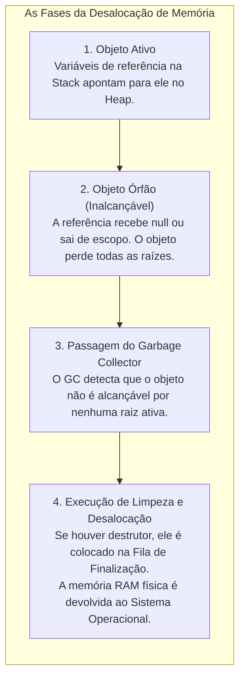
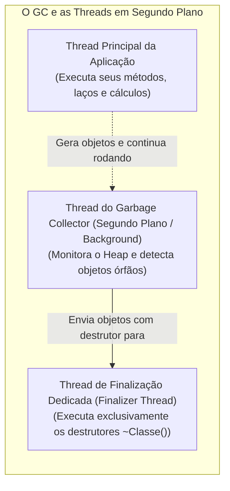
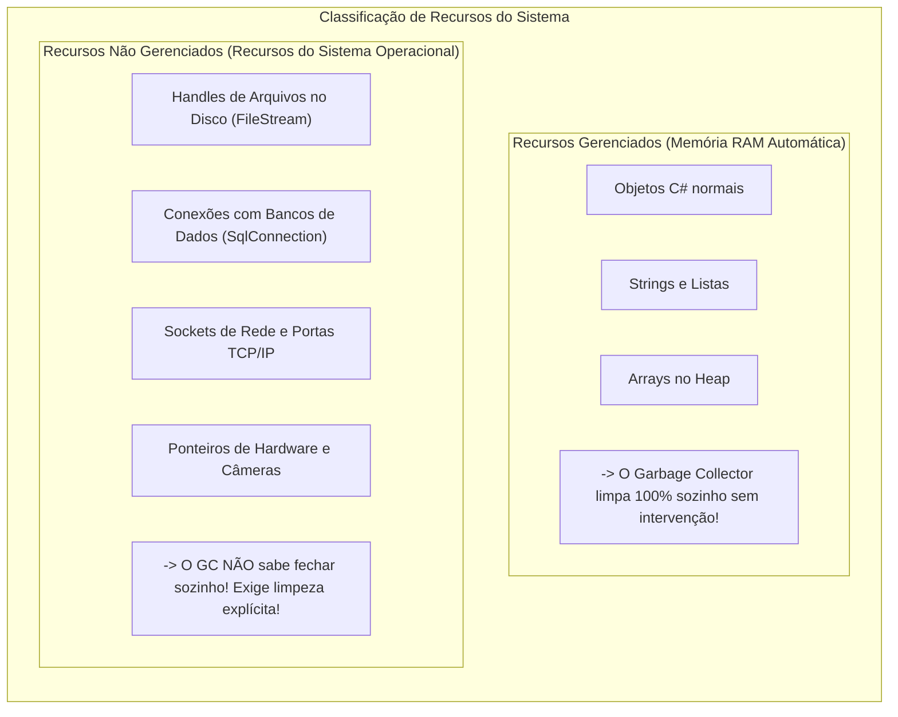
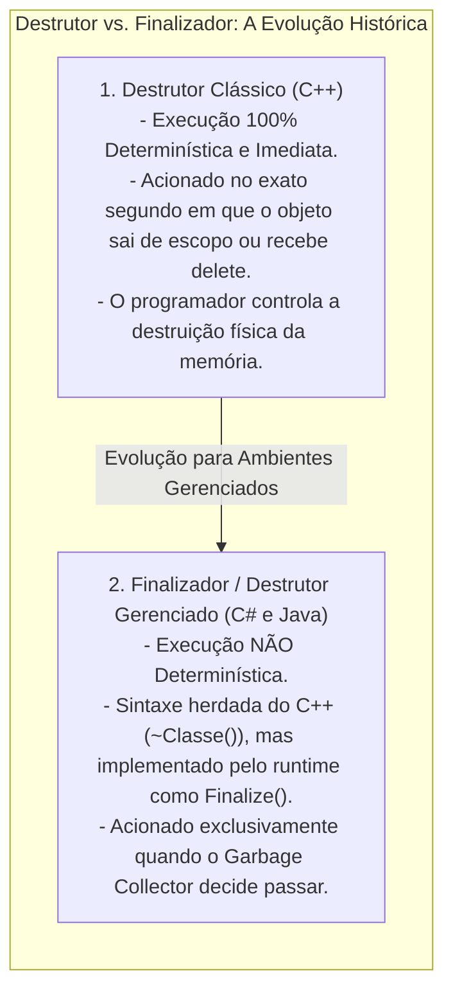
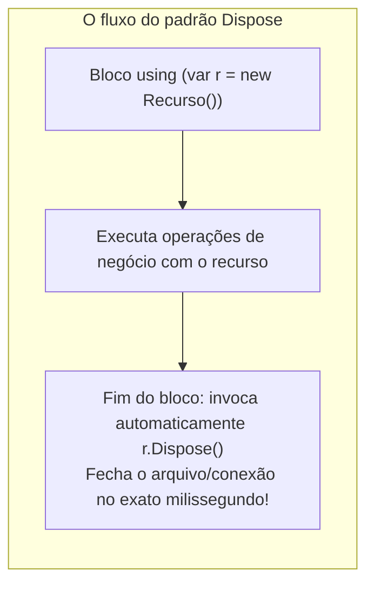
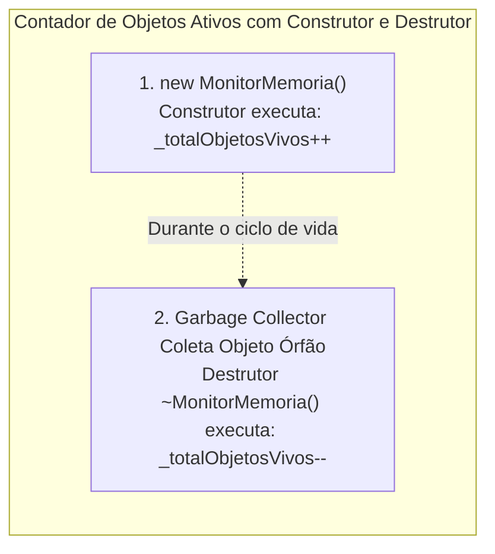

# 10. Destrutores e finalizadores (desalocação de memória e liberação de recursos)

> **Contexto:** Enquanto os construtores controlam o nascimento e a inicialização de objetos no *Heap*, os **destrutores (ou finalizadores)** e os mecanismos de descarte controlam o momento de sua **morte e liberação de recursos**. Este artigo aborda a desalocação de memória pelo Coletor de Lixo (*Garbage Collector*), a diferença crítica entre recursos gerenciados vs. não gerenciados, a sintaxe de destrutores em C# (`~Classe()`) e o padrão profissional de limpeza determinística (`IDisposable` e a instrução `using`), tudo desmistificado pela Técnica de Feynman.

---

## 1. O que acontece quando um objeto morre? (O ciclo de desalocação)

Em ambientes com memória gerenciada como .NET (.NET CLR) e Java (JVM), um objeto não é destruído imediatamente no exato segundo em que você para de usá-lo. A sua morte ocorre em fases:



### A intuição (técnica de Feynman):
* **O inquilino que entrega as chaves:** Enquanto você mora no apartamento alugado (referência ativa), você usa a água, luz e espaço.
* **O abandono do imóvel:** Quando você se muda e corta o contrato (`conta = null;`), o apartamento não é demolido no mesmo segundo. Ele se torna um **imóvel desocupado (objeto órfão)**.
* **A equipe de faxina (Garbage Collector):** Periodicamente, a imobiliária manda a equipe de limpeza passar nos imóveis desocupados, tirar os restos e liberar o apartamento para novas locações (`new`).
* **A tarefa do destrutor:** Fechar o registro de gás e devolver o roteador da operadora de internet (liberar conexões de arquivos, portas de rede ou câmeras).

### A relação com *Threads* (Linhas de execução concorrentes)

O funcionamento do Garbage Collector e dos destrutores está diretamente amarrado à arquitetura de **Linhas de Execução (*Threads*)**:



#### Como o GC e os destrutores interagem com as *Threads*:
1. **Thread Principal vs. Thread do GC:** O seu programa roda na **Thread de Aplicação**. O Garbage Collector roda em uma ou mais **Threads de Segundo Plano (*Background Threads*)**, trabalhando de forma concorrente para não congelar o seu software.
2. **A Thread de Finalização Dedicada (*Finalizer Thread*):** No C# e Java, os destrutores (`~Classe()`) **NÃO rodam na thread principal do seu programa**. O *runtime* mantém uma *thread* separada e de baixa prioridade dedicada exclusivamente a esvaziar a fila de finalização.
3. **O Perigo do Bloqueio de Thread (*Thread Blocking*):** Se você colocar um laço infinito, uma pausa pesada (`Thread.Sleep`) ou uma operação de rede lenta dentro de um destrutor `~Classe()`, você travará a *Finalizer Thread* inteira do .NET, impedindo que todos os outros destrutores da aplicação rodem! → [[Glossário de conceitos#21 Thread linha de execução Thread|Thread no Glossário]].

---

## 2. Recursos gerenciados vs. recursos não gerenciados

Para compreender por que precisamos de destrutores e descarte, é indispensável separar os dois tipos de recursos que um programa consome:



### Por que o Garbage Collector não resolve tudo?
O Garbage Collector é especialista em **devolver bytes de memória RAM livre**. Contudo, o GC **não entende regras de recursos do Sistema Operacional**. Se o seu programa abrir um arquivo no HD e esquecer de fechar, o arquivo ficará **travado (*locked*)** para outros programas até que o processo inteiro seja encerrado.

### O papel do *Buffer* na destruição e descarte de recursos

Um dos maiores perigos ao esquecer de descartar objetos que lidam com arquivos ou rede é a retenção de dados no **Buffer de Memória (*Buffer*)**:

```mermaid
flowchart TD
    subgraph FluxoBuffer ["O papel do buffer e do flush no descarte"]
        direction TB
        App["Seu programa (escreve dados)"]
        Buf["Buffer em memória RAM (pilha temporária de bytes)"]
        HD["Disco rígido / rede (armazenamento físico)"]

        App -->|Escreve rápido na RAM| Buf
        Buf -.->|Sem fechar: dados ficam presos e se perdem!| Buf
        Buf -->|Dispose/Close (Flush Automático): descarrega tudo| HD
    end
```

#### A intuição de Feynman para o *Buffer*:
* **A caixa de saída dos Correios:**
  - Escrever direto no disco a cada caractere seria como o carteiro ir até a agência postal levar uma única carta a cada minuto (extremamente lento).
  - Em vez disso, o sistema cria uma **caixa de correio na recepção (o Buffer em memória RAM)**. As cartas vão sendo acumuladas ali.
  - **O Perigo do Abandono:** Se o programa for desligado sem executar o `Dispose()` / `Close()`, as cartas que estavam dentro da caixa **são jogadas fora e nunca chegam ao disco (corrupção de dados)**!
  - O método `Dispose()` ou o destrutor executam o **despejo forçado (*Flush*)**, esvaziando a caixa e garantindo que cada último byte seja gravado no HD antes de trancar a porta. → [[Glossário de conceitos#20 Buffer e descarregamento de dados Buffer & Flush|Buffer no Glossário]].

#### Por que é um erro gravíssimo confiar no Garbage Collector para dar *Flush* no Buffer?
1. **O atraso do Garbage Collector é imprevisível:** O GC só acorda quando a memória RAM está cheia. Um arquivo pode ficar horas aberto com bytes presos no buffer sem que o destrutor rode.
2. **Concorrência e bloqueio de arquivos (*File Locks*):** Enquanto o GC não rodar o destrutor para descarregar o buffer e fechar o *handle*, nenhum outro processo ou usuário do sistema conseguirá ler ou renomear aquele arquivo no disco.
3. **Morte súbita da aplicação (*Crash* ou *Power Off*):** Se o computador desligar ou a aplicação cair antes do GC decidir passar, todos os dados pendentes no buffer da RAM desaparecerão para sempre. **A regra de ouro é: descarte e descarregue o buffer imediatamente com o bloco `using`!**

---

## 3. Destrutor ou finalizador? As nuances da nomenclatura em POO

Na literatura de computação e no desenvolvimento de software, os termos **Destrutor (*Destructor*)** e **Finalizador (*Finalizer*)** são frequentemente usados como sinônimos, mas carregam origens e comportamentos técnicos distintos:



### A distinção técnica:
1. **No C++ (Destrutor Clássico):** É um verdadeiro **destrutor imediato**. Ao sair de um bloco `{ }` ou chamar `delete`, o destrutor roda no mesmo microssegundo e a memória é liberada na hora.
2. **No C# e .NET (Finalizador com sintaxe de Destrutor):** 
   - A linguagem C# adotou a sintaxe com til do C++ (`~Classe()`) por familiaridade para os programadores, chamando-o comumente de **destrutor**.
   - Contudo, por debaixo dos panos, o compilador C# converte o bloco `~Classe()` em uma sobreposição do método protegido **`Finalize()`** da classe base `System.Object`:
     ```csharp
     // O que você escreve em C#:
     ~MinhaClasse() { Limpar(); }

     // No que o compilador C# transforma internamente (IL):
     protected override void Finalize() 
     {
         try { Limpar(); }
         finally { base.Finalize(); }
     }
     ```
   - Por isso, a documentação oficial da Microsoft e os autores de engenharia de software referem-se formalmente a essa estrutura como **Finalizador (*Finalizer*)**.
3. **No Java:** Não existe a sintaxe com til `~Classe()`; o Java utilizava historicamente o método explícito `protected void finalize()`, que foi descontinuado (*deprecated*) a partir do Java 9 devido aos riscos de performance e imprevisibilidade.

```csharp
public class ConexaoHardware 
{
    // Destrutor em C# (Finalizador internamente)
    ~ConexaoHardware() 
    {
        // Código de limpeza executado antes de o objeto sumir da memória
        Console.WriteLine("Finalizador acionado pelo GC: liberando portas físicas...");
    }
}
```

### Características e regras dos finalizadores em C#:
1. **Sem modificadores nem parâmetros:** Não aceita `public`, `private`, `static` e **nunca recebe parâmetros**.
2. **Execução não determinística (*non-deterministic*):** Você **não tem como prever exatamente o milissegundo** em que o destrutor/finalizador será executado. Ele só roda quando o Garbage Collector decidir coletar a memória.
3. **Não pode ser chamado manualmente:** É proibido escrever `objeto.~Classe()` ou invocar `objeto.Finalize()`.
4. **Custo de performance:** Objetos com finalizadores sobrevivem por mais tempo no *Heap*, pois são movidos para uma fila especial chamada **Fila de Finalização (*Finalization Queue*)**, exigindo pelo menos duas passadas do GC para serem totalmente reciclados.

---

### Por que NUNCA utilizar destrutores para tarefas críticas do sistema?

Muitos desenvolvedores novatos tentam colocar regras de negócio essenciais dentro de destrutores (como fechar transações bancárias, salvar logs vitais ou enviar e-mails de encerramento). **Isso é considerado uma das piores práticas de POO por 4 razões fatais:**

1. **O destrutor pode NUNCA ser executado:** Se o programa for encerrado normalmente pelo usuário ou se o processo for finalizado pelo Sistema Operacional, o .NET CLR **não garante** que a fila de finalização será totalmente executada. Suas tarefas críticas simplesmente não rodarão!
2. **Ordem de destruição imprevisível:** Se o objeto A depende do objeto B, o GC pode destruir o objeto B **antes** do objeto A. Ao tentar acessar `_b.Salvar()` dentro do destrutor de A, o sistema lançará `NullReferenceException`.
3. **Bloqueio da aplicação (*Finalizer Hang*):** Se uma tarefa no destrutor demorar (como tentar acessar um banco de dados que caiu), a *Finalizer Thread* inteira do .NET travará, acumulando lixo na memória até o esgotamento total da RAM (*OutOfMemoryException*).
4. **Ressurreição acidental de objetos (*Object Resurrection*):** Se dentro do destrutor você atribuir `this` a uma variável estática global (`InstanciaGlobal = this;`), o objeto "ressuscita" como um zumbi no *Heap*, quebrando toda a integridade de gerenciamento de memória do *runtime*.

---

## 4. Limpeza determinística: a interface `IDisposable` e o bloco `using`

Como os destrutores têm execução imprevisível, a arquitetura do .NET criou o padrão oficial de limpeza imediata e determinística: a **Interface `IDisposable`** e a **Instrução `using`**.



### A intuição de Feynman para o `using`:
* O bloco `using` funciona como um **quarto de hotel com tranca automática temporizada**:
  - Você entra no quarto e trabalha (`using (var r = ...)`).
  - No exato momento em que você passa pela porta de saída (fim das chaves `{ }`), o sistema **desliga o ar, apaga as luzes e tranca a porta na mesma hora (`Dispose()`)**, mesmo que você saia com pressa ou ocorra um erro inesperado (*Exception*).

---

## 5. Exemplos atômicos por conceito (C#)

### a. Contador de instâncias ativas no sistema (construtor + destrutor)

Um exemplo clássico de diagnóstico e monitoramento de memória é usar um **atributo estático** incrementado no **construtor** e decrementado no **destrutor**:



```csharp
public class MonitorMemoria 
{
    // Atributo estático: compartilhado por todas as instâncias para contagem global
    private static int _totalObjetosVivos = 0;

    public MonitorMemoria() 
    {
        _totalObjetosVivos++; // Incrementa no nascimento do objeto
    }

    // Destrutor: acionado quando o GC realmente limpa o objeto do Heap
    ~MonitorMemoria() 
    {
        _totalObjetosVivos--; // Decrementa na morte física do objeto
    }

    public static int ObterTotalVivos() 
    {
        return _totalObjetosVivos;
    }
}
```

> **Aviso de Diagnóstico:** Note que o contador só decrementa **quando o GC passa**, e não no segundo em que você atribui `null`. Por isso, este padrão é excelente para **diagnosticar se objetos estão ficando presos na memória por vazamento de referências (*Memory Leaks*)**!

---

### b. Destrutor clássico em C# (`~Classe`)

Demonstração isolada da sintaxe de um destrutor e seu acionamento pelo Garbage Collector:

```csharp
public class ArquivoTemporario 
{
    private string _caminho;

    public ArquivoTemporario(string caminho) 
    {
        _caminho = caminho;
        Console.WriteLine($"Arquivo criado: {_caminho}");
    }

    // Destrutor / Finalizador
    ~ArquivoTemporario() 
    {
        // Limpeza de segurança caso o desenvolvedor esqueça de fechar
        Console.WriteLine($"Destrutor executado pelo GC para o arquivo: {_caminho}");
    }
}
```

---

### c. Limpeza determinística profissional com `IDisposable`

Demonstração isolada de como implementar a interface `IDisposable` para liberação manual imediata:

```csharp
using System;

public class LeitorDeArquivo : IDisposable 
{
    private bool _jaFoiLiberado = false;
    private string _nomeArquivo;

    public LeitorDeArquivo(string nomeArquivo) 
    {
        _nomeArquivo = nomeArquivo;
        Console.WriteLine($"[Aberto] {_nomeArquivo} pronto para leitura.");
    }

    public void Dispose() 
    {
        if (!_jaFoiLiberado) 
        {
            Console.WriteLine($"[Liberado] Recurso de {_nomeArquivo} fechado imediatamente!");
            _jaFoiLiberado = true;
            // Avisa o Garbage Collector que não precisa rodar o destrutor
            GC.SuppressFinalize(this);
        }
    }
}
```

---

### c. Uso automático e seguro com a instrução `using`

Demonstração isolada de como o `using` garante que o `Dispose()` seja invocado até em caso de falha:

```csharp
class Program 
{
    static void ExecutarOperacao() 
    {
        // O recurso é garantidamente liberado ao fechar as chaves
        using (LeitorDeArquivo leitor = new LeitorDeArquivo("dados_financeiros.csv")) 
        {
            Console.WriteLine("Processando linhas do arquivo...");
            // Ao sair deste bloco, leitor.Dispose() é chamado na hora!
        }
    }
}
```

---

## 6. Exemplo completo integrado (C#)

Abaixo está um programa executável consolidando o ciclo de vida completo: criação com construtor, manipulação de recursos, descarte com `using`, e a comprovação prática do destrutor sendo coletado:

```csharp
using System;

namespace ProgramacaoModular.Destrutores 
{
    public class GerenciadorDeConexao : IDisposable 
    {
        private string _ipServidor;
        private bool _disposed = false;

        // 1. Construtor (Nascimento do Objeto)
        public GerenciadorDeConexao(string ipServidor) 
        {
            _ipServidor = ipServidor;
            Console.WriteLine($"[Conectado] Conexão aberta com o servidor: {_ipServidor}");
        }

        // 2. Método de Negócio
        public void EnviarDados(string mensagem) 
        {
            if (_disposed) 
            {
                throw new ObjectDisposedException(nameof(GerenciadorDeConexao), "A conexão já foi fechada!");
            }
            Console.WriteLine($"[Enviando para {_ipServidor}]: {mensagem}");
        }

        // 3. Método Dispose (Limpeza Determinística Imediata)
        public void Dispose() 
        {
            LimparRecursos(true);
            // Informa ao Garbage Collector que o objeto já foi limpo,
            // pulando a fila de finalização para máxima performance!
            GC.SuppressFinalize(this);
        }

        protected virtual void LimparRecursos(bool chamadoPeloUsuario) 
        {
            if (!_disposed) 
            {
                if (chamadoPeloUsuario) 
                {
                    Console.WriteLine($"[Dispose] Fechando socket de rede com {_ipServidor} de forma limpa.");
                }
                else 
                {
                    Console.WriteLine($"[Finalizador GC] Destrutor de emergência fechando {_ipServidor}.");
                }
                _disposed = true;
            }
        }

        // 4. Destrutor / Finalizador (Rede de Segurança de Emergência)
        ~GerenciadorDeConexao() 
        {
            LimparRecursos(false);
        }
    }

    class Program 
    {
        static void CriarObjetoEsquecido() 
        {
            // Objeto criado sem using e sem Dispose()
            GerenciadorDeConexao conexaoOrfa = new GerenciadorDeConexao("192.168.1.100");
            conexaoOrfa.EnviarDados("Ping");
            // Ao sair do método, a variável local morre e o objeto vira 'órfão' no Heap
        }

        static void Main() 
        {
            Console.WriteLine("=== 1. Demonstração de Limpeza com Bloco 'using' ===");
            using (GerenciadorDeConexao conn = new GerenciadorDeConexao("10.0.0.1")) 
            {
                conn.EnviarDados("Relatório Mensal");
            } // conn.Dispose() é chamado aqui automaticamente!

            Console.WriteLine("\n=== 2. Demonstração de Objeto Órfão e Coleta pelo GC ===");
            CriarObjetoEsquecido();

            Console.WriteLine("Forçando passagem do Garbage Collector para acionar o Destrutor...");
            GC.Collect();
            GC.WaitForPendingFinalizers(); // Aguarda a fila de destrutores rodar

            Console.WriteLine("\nPrograma finalizado com sucesso!");
        }
    }
}
```

---

## 7. Resumo comparativo: construtor vs. destrutor vs. `Dispose`

| Critério | Construtor (`Classe()`) | Destrutor (`~Classe()`) | Método `Dispose()` |
| :--- | :--- | :--- | :--- |
| **Momento de execução** | No nascimento do objeto (`new`). | Na morte do objeto durante a passagem do GC. | Imediatamente quando o desenvolvedor chama (ou via `using`). |
| **Determinismo de tempo** | Determinístico (executa na hora). | **Não determinístico** (imprevisível). | **Determinístico** (no exato milissegundo). |
| **Pode receber parâmetros?** | Sim (suporta sobrecarga). | **Não** (nunca recebe parâmetros). | Não (definido pela interface `IDisposable`). |
| **Objetivo principal** | Inicializar atributos e validar regras. | Rede de segurança para recursos não gerenciados. | Liberar recursos do Sistema Operacional sem travar o sistema. |
| **Custo de performance** | Baixo e previsível. | Alto (move o objeto para a Fila de Finalização). | Mínimo e altamente otimizado. |

---

## Referências bibliográficas

### Bibliografia básica
* MEYER, Bertrand. **Object-Oriented Software Construction**. 2. ed. Prentice Hall, 1997.
* SOMMERVILLE, Ian. **Engenharia de Software**. 10. ed. São Paulo: Pearson, 2019.
* MARTIN, Robert C. **Código Limpo: Habilidades Práticas do Agile Software**. Rio de Janeiro: Alta Books, 2011.

### Bibliografia complementar
* DE PAULA, Hugo. **Programação Modular: Exemplos de Classes e Objetos em C#**. GitHub, 2023. Disponível em: [https://github.com/hugodepaula/programacao-modular-ead/tree/main/exemplos/2_Classes_e_Objetos](https://github.com/hugodepaula/programacao-modular-ead/tree/main/exemplos/2_Classes_e_Objetos).
* MICROSOFT. **Finalizadores (Guia de Programação em C#)**. Microsoft Learn, 2023. Disponível em: [https://learn.microsoft.com/pt-br/dotnet/csharp/programming-guide/classes-and-structs/finalizers](https://learn.microsoft.com/pt-br/dotnet/csharp/programming-guide/classes-and-structs/finalizers).
* MICROSOFT. **Padrão Dispose e Gerenciamento de Recursos Não Gerenciados**. Microsoft Learn, 2023. Disponível em: [https://learn.microsoft.com/pt-br/dotnet/standard/garbage-collection/implementing-dispose](https://learn.microsoft.com/pt-br/dotnet/standard/garbage-collection/implementing-dispose).
* SEBESTA, Robert W. **Conceitos de Linguagens de Programação**. 11. ed. Porto Alegre: Bookman, 2018.

---

## Artigos relacionados e navegação

* **Artigo anterior:** [[09. Atributos estáticos e propriedades (compartilhamento de estado e encapsulamento)]]
* **Próximo artigo:** [[11. Princípio da ocultação da informação (information hiding e encapsulamento)]]
* **Resumo da disciplina:** [[00. Programação modular - Resumo]]
* **Glossário da disciplina:** [[Glossário de conceitos]]
* **Guia de Sintaxe Multilinguagem:** [[00. Sintaxe Multilinguagem/06. Modificadores de acesso, escopo e a palavra-chave static]]
* **Índice geral do vault:** [[index.md|Página Inicial do Vault]]
