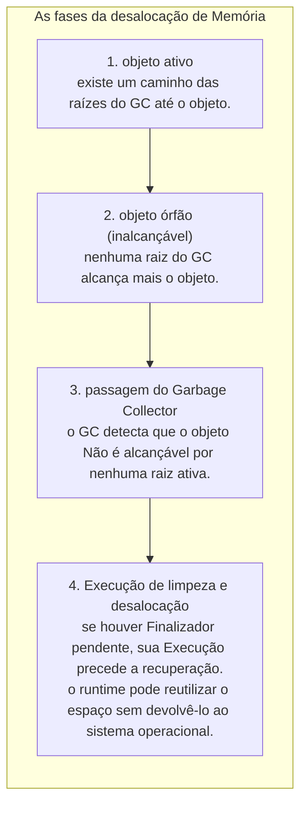
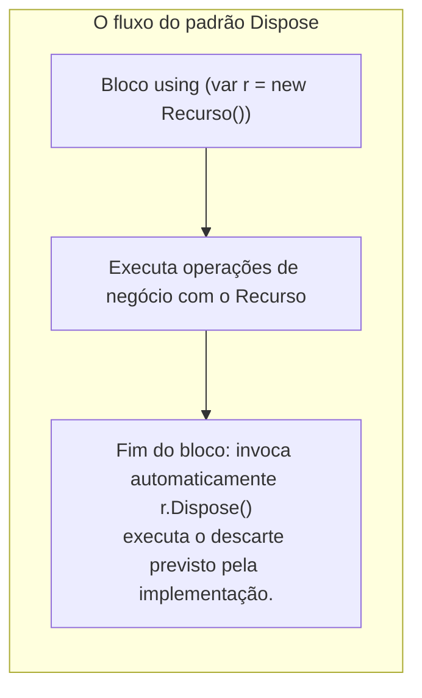
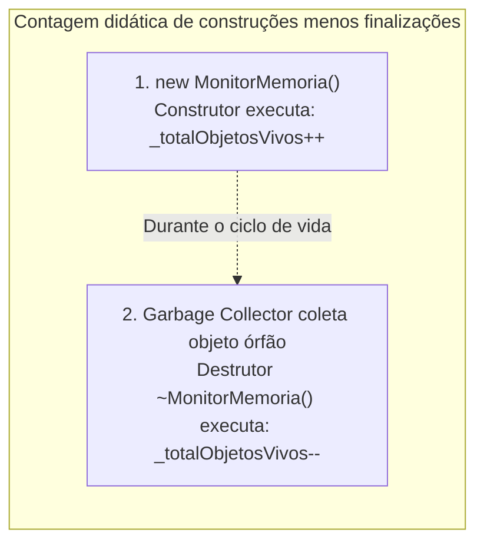
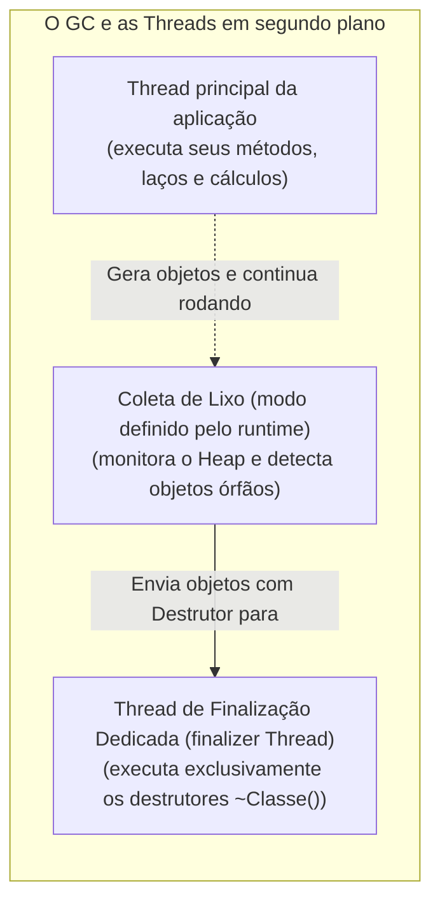
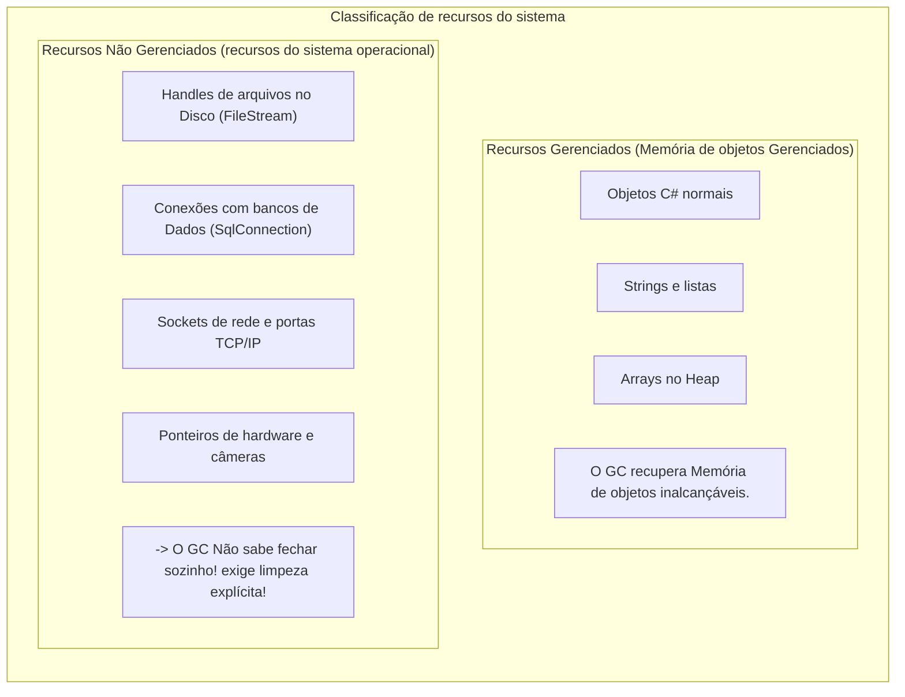
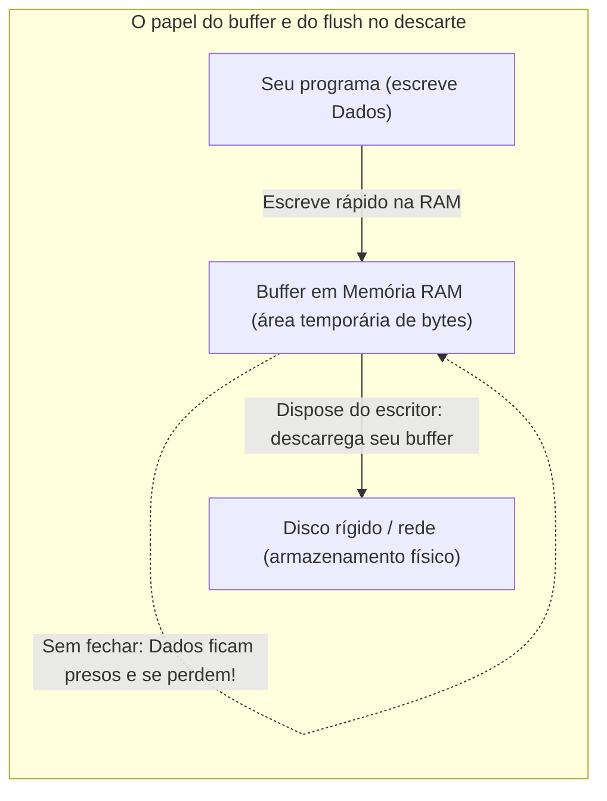
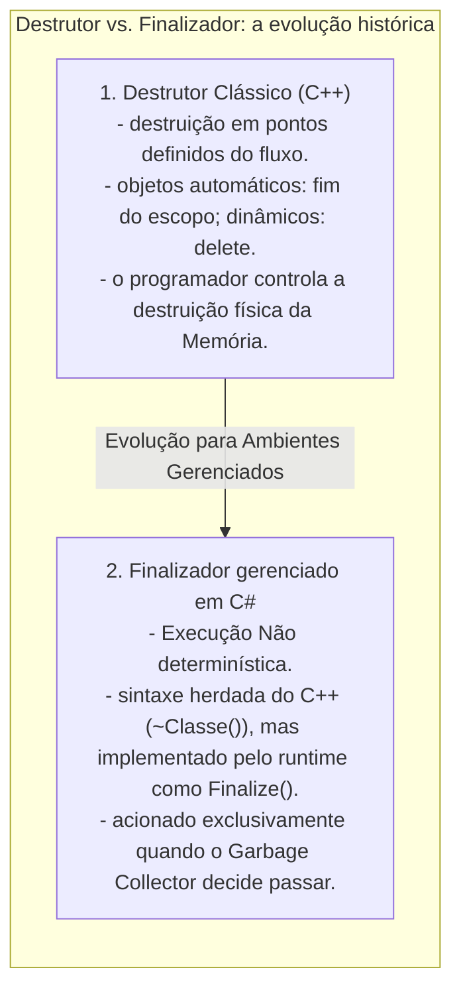

# 10. Destrutores e finalizadores (desalocação de memória e liberação de recursos)

> **Contexto:** Esta nota desenvolve os conceitos de programação modular estudados na disciplina. As explicações de C#/.NET são complementação técnica; as analogias são recursos didáticos para acompanhar os exemplos.

---


**Percurso de leitura:** conceito central → mecânica em C# → aprofundamento técnico → conexões. A primeira camada constrói a ideia; os exemplos e detalhes permanecem disponíveis nas seguintes.

## 1. Conceito central

Parar de usar um objeto, liberar um arquivo e recuperar memória são três eventos diferentes. O GC administra memória gerenciada; `Dispose` expressa descarte explícito; um finalizador é uma salvaguarda não determinística para casos específicos.

### O que acontece quando um objeto fica inalcançável? (o ciclo de desalocação)

Em ambientes com memória gerenciada como .NET (.NET CLR) e Java (JVM), um objeto não é destruído imediatamente no exato segundo em que você para de usá-lo. A sua morte ocorre em fases:



#### A intuição (técnica de Feynman):
* **O inquilino que entrega as chaves:** Enquanto você mora no apartamento alugado (referência ativa), você usa a água, luz e espaço.
* **O abandono do imóvel (sem outros usuários):** Se você era o último usuário alcançável e corta o contrato (`conta = null;`), o apartamento não é demolido no mesmo segundo. Ele se torna um **imóvel desocupado (objeto órfão)**.
* **A equipe de faxina (Garbage Collector):** Periodicamente, a imobiliária manda a equipe de limpeza passar nos imóveis desocupados, tirar os restos e liberar o apartamento para novas locações (`new`).
* **A tarefa do destrutor:** Fechar o registro de gás e devolver o roteador da operadora de internet (liberar conexões de arquivos, portas de rede ou câmeras).

## 2. Mecânica em C#

Para o uso cotidiano, comece por `IDisposable` e `using`. Os exemplos de finalizadores e contador são demonstrações do mecanismo, não estratégias de controle de recursos em produção.

### Limpeza determinística: a interface `IDisposable` e o bloco `using`

Como os destrutores têm execução imprevisível, a arquitetura do .NET criou o padrão oficial de limpeza imediata e determinística: a **interface `IDisposable`** e a **instrução `using`**.



#### A intuição de Feynman para o `using`:
* O bloco `using` funciona como um **quarto de hotel com tranca automática temporizada**:
  - Você entra no quarto e trabalha (`using (var r = ...)`).
  - No exato momento em que você passa pela porta de saída (fim das chaves `{ }`), o sistema **desliga o ar, apaga as luzes e tranca a porta na mesma hora (`Dispose()`)**, mesmo que você saia com pressa ou ocorra um erro inesperado (*Exception*).

---

### Exemplos atômicos por conceito (C#)

#### Contador de instâncias ativas no sistema (construtor + destrutor)

Um exemplo clássico de diagnóstico e monitoramento de memória é usar um **atributo estático** incrementado no **construtor** e decrementado no **destrutor**:



```csharp
public class MonitorMemoria
{
    // Atributo estático: compartilhado por todas as instâncias para contagem global
    private static int _totalObjetosVivos = 0;

    public MonitorMemoria()
    {
        System.Threading.Interlocked.Increment(ref _totalObjetosVivos); // Contagem atômica
    }

    // Finalizador: sua execução pode preceder a recuperação da memória
    ~MonitorMemoria()
    {
        System.Threading.Interlocked.Decrement(ref _totalObjetosVivos); // Finalização observada
    }

    public static int ObterTotalVivos()
    {
        return System.Threading.Volatile.Read(ref _totalObjetosVivos);
    }
}
```

> **Aviso de diagnóstico:** Note que o contador só decrementa **quando o GC passa**, e não no segundo em que você atribui `null`. Por isso, esse contador é apenas uma ilustração de construções menos finalizações observadas. Não mede objetos alcançáveis nem comprova vazamento: atraso de finalização e condições de corrida também alteram o resultado. Para diagnóstico real, investigue as raízes que retêm os objetos.

---

#### Sintaxe do finalizador em C# (`~Classe`)

Demonstração isolada da sintaxe de um destrutor e seu acionamento pelo Garbage Collector:

```csharp
public class ArquivoTemporario
{
    private string _caminho;

    public ArquivoTemporario(string caminho)
    {
        _caminho = caminho;
        Console.WriteLine($"Arquivo criado: {_caminho}");
    }

    // Destrutor / Finalizador
    ~ArquivoTemporario()
    {
        // Limpeza de segurança caso o desenvolvedor esqueça de fechar
        Console.WriteLine($"Destrutor executado pelo GC para o arquivo: {_caminho}");
    }
}
```

---

#### Limpeza determinística profissional com `IDisposable`

Simulação do contrato `IDisposable`: este exemplo apenas imprime mensagens, não abre nem fecha um arquivo real. Em código real, seria necessário descartar o recurso possuído. Como esta classe não possui finalizador, `SuppressFinalize` é dispensável:

```csharp
using System;

public class LeitorDeArquivo : IDisposable
{
    private bool _jaFoiLiberado = false;
    private string _nomeArquivo;

    public LeitorDeArquivo(string nomeArquivo)
    {
        _nomeArquivo = nomeArquivo;
        Console.WriteLine($"[Aberto] {_nomeArquivo} pronto para leitura.");
    }

    public void Dispose()
    {
        if (!_jaFoiLiberado)
        {
            Console.WriteLine($"[Liberado] Recurso de {_nomeArquivo} fechado imediatamente!");
            _jaFoiLiberado = true;
            // Avisa o Garbage Collector que não precisa rodar o destrutor
            GC.SuppressFinalize(this);
        }
    }
}
```

---

#### Uso automático e seguro com a instrução `using`

Demonstração isolada de como o `using` garante que o `Dispose()` seja invocado até em caso de falha:

```csharp
class Program
{
    static void ExecutarOperacao()
    {
        // O recurso é garantidamente liberado ao fechar as chaves
        using (LeitorDeArquivo leitor = new LeitorDeArquivo("dados_financeiros.csv"))
        {
            Console.WriteLine("Processando linhas do arquivo...");
            // Ao sair deste bloco, leitor.Dispose() é chamado na hora!
        }
    }
}
```

---

### Exemplo completo integrado (C#)

Abaixo está uma **simulação executável** do ciclo de vida: nenhuma conexão de rede é aberta. As mensagens tornam visíveis `Dispose` e finalização. `GC.Collect()` e `GC.WaitForPendingFinalizers()` são usados apenas para a demonstração; não são uma estratégia normal de gerenciamento de recursos. Em uma implementação real, a ramificação de finalização libera apenas recursos não gerenciados próprios, sem depender de outros objetos finalizáveis; prefira encapsulá-los em `SafeHandle`.

```csharp
using System;

namespace ProgramacaoModular.Destrutores
{
    public class GerenciadorDeConexao : IDisposable
    {
        private string _ipServidor;
        private bool _disposed = false;

        // 1. Construtor (Nascimento do Objeto)
        public GerenciadorDeConexao(string ipServidor)
        {
            _ipServidor = ipServidor;
            Console.WriteLine($"[Conectado] Conexão aberta com o servidor: {_ipServidor}");
        }

        // 2. Método de Negócio
        public void EnviarDados(string mensagem)
        {
            if (_disposed)
            {
                throw new ObjectDisposedException(nameof(GerenciadorDeConexao), "A conexão já foi fechada!");
            }
            Console.WriteLine($"[Enviando para {_ipServidor}]: {mensagem}");
        }

        // 3. Método Dispose (Limpeza Determinística Imediata)
        public void Dispose()
        {
            LimparRecursos(true);
            // Informa ao Garbage Collector que o objeto já foi limpo,
            // pulando a fila de finalização para máxima performance!
            GC.SuppressFinalize(this);
        }

        protected virtual void LimparRecursos(bool chamadoPeloUsuario)
        {
            if (!_disposed)
            {
                if (chamadoPeloUsuario)
                {
                    Console.WriteLine($"[Dispose] Fechando socket de rede com {_ipServidor} de forma limpa.");
                }
                else
                {
                    Console.WriteLine($"[Finalizador GC] Destrutor de emergência fechando {_ipServidor}.");
                }
                _disposed = true;
            }
        }

        // 4. Destrutor / Finalizador (Rede de Segurança de Emergência)
        ~GerenciadorDeConexao()
        {
            LimparRecursos(false);
        }
    }

    class Program
    {
        static void CriarObjetoEsquecido()
        {
            // Objeto criado sem using e sem Dispose()
            GerenciadorDeConexao conexaoOrfa = new GerenciadorDeConexao("192.168.1.100");
            conexaoOrfa.EnviarDados("Ping");
            // Sem referências mantidas, o objeto torna-se elegível para coleta
        }

        static void Main()
        {
            Console.WriteLine("=== 1. Demonstração de Limpeza com Bloco 'using' ===");
            using (GerenciadorDeConexao conn = new GerenciadorDeConexao("10.0.0.1"))
            {
                conn.EnviarDados("Relatório Mensal");
            } // conn.Dispose() é chamado aqui automaticamente!

            Console.WriteLine("\n=== 2. Demonstração de Objeto Órfão e Coleta pelo GC ===");
            CriarObjetoEsquecido();

            Console.WriteLine("Forçando passagem do Garbage Collector para acionar o Destrutor...");
            GC.Collect();
            GC.WaitForPendingFinalizers(); // Aguarda a fila de destrutores rodar

            Console.WriteLine("\nPrograma finalizado com sucesso!");
        }
    }
}
```

---

## 3. Aprofundamento técnico

Agora examine raízes, threads, buffers e a diferença entre destruição em C++ e finalização em C#. Esses detalhes explicam por que o descarte explícito não pode depender de quando o GC passar.

### Coleta, descarte e finalização não são equivalentes

As raízes do GC incluem referências mantidas por threads, registradores e campos estáticos, entre outras estruturas do runtime. Atribuir `null` a uma variável não elimina outros caminhos até o objeto. O GC pode coletar ciclos inalcançáveis e reutilizar memória sem devolver imediatamente páginas ao sistema operacional.

`using` organiza uma chamada de descarte ao sair do bloco, inclusive em saídas por `return` ou exceções usuais, após aquisição bem-sucedida do recurso. Não garante execução após encerramento abrupto do processo e não chama o finalizador. `Dispose` pode liberar recursos gerenciados descartáveis que o objeto possui, não deve descartar recursos apenas emprestados e não desaloca a própria memória. Chamadas repetidas devem ser seguras conforme o contrato. `GC.SuppressFinalize` dispensa a finalização, não força coleta.

Um objeto com finalizador é registrado para esse tratamento desde sua criação; quando fica inalcançável, a finalização pendente pode adiar a recuperação de memória. Finalizadores devem ser curtos, tolerar construção incompleta e evitar exceções não tratadas. Os exemplos que apenas imprimem mensagens ilustram a sequência, sem oferecer liberação real de arquivos ou sockets.

#### A relação com *Threads* (linhas de execução concorrentes)

O funcionamento do Garbage Collector e dos destrutores está diretamente amarrado à arquitetura de **Linhas de Execução (*Threads*)**:



##### Como o GC e os destrutores interagem com as *Threads*:
1. **Thread principal vs. Thread do GC:** O seu programa roda na **thread de aplicação**. O modo do GC determina como o trabalho é distribuído. Há coleta em background, mas também fases que suspendem threads da aplicação; não existe garantia de ausência de pausas.
2. **A Thread de Finalização Dedicada (*Finalizer Thread*):** No .NET, finalizadores C# (`~Classe()`) são normalmente executados pela thread de finalização, separada das threads que criaram os objetos. Não se deve depender de prioridade ou ordem específica. Java não possui essa sintaxe.
3. **O Perigo do Bloqueio de Thread (*Thread Blocking*):** Se você colocar um laço infinito, uma pausa pesada (`Thread.Sleep`) ou uma operação de rede lenta dentro de um destrutor `~Classe()`, você travará a *Finalizer Thread* inteira do .NET, impedindo que todos os outros destrutores da aplicação rodem! → [[Glossário de conceitos#21 Thread linha de execução Thread|Thread no Glossário]].

---

### Recursos gerenciados vs. recursos não gerenciados

Para compreender por que precisamos de destrutores e descarte, é indispensável separar os dois tipos de recursos que um programa consome:



#### Por que o Garbage Collector não resolve tudo?
O Garbage Collector é especialista em **devolver bytes de memória RAM livre**. Contudo, o GC **não entende regras de recursos do sistema operacional**. Se o programa mantiver um arquivo aberto, seu handle pode continuar retido. A possibilidade de outros processos lerem, escreverem ou renomearem depende do sistema operacional e das opções de compartilhamento, não apenas do GC. `FileStream` e `SqlConnection` são objetos gerenciados que representam recursos externos; descartar uma conexão pode devolvê-la ao pool.

#### O papel do *buffer* na destruição e descarte de recursos

Um dos maiores perigos ao esquecer de descartar objetos que lidam com arquivos ou rede é a retenção de dados no **Buffer de Memória (*Buffer*)**:



##### A intuição de Feynman para o *buffer*:
* **A caixa de saída dos correios:**
  - Escrever direto no disco a cada caractere seria como o carteiro ir até a agência postal levar uma única carta a cada minuto (extremamente lento).
  - Em vez disso, o sistema cria uma **caixa de correio na recepção (o buffer em memória RAM)**. As cartas vão sendo acumuladas ali.
  - **O perigo do abandono:** Se o programa for desligado sem executar o `Dispose()` / `Close()`, as cartas que estavam dentro da caixa **são jogadas fora e nunca chegam ao disco (corrupção de dados)**!
  - Em escritores como `StreamWriter`, `Dispose()` descarrega o buffer gerenciado. Não confie no finalizador para salvar dados: ele não garante esse trabalho. `Flush` também não equivale, em todas as APIs, à persistência física resistente a falta de energia. → [[Glossário de conceitos#20 Buffer e descarregamento de dados Buffer & Flush|Buffer no Glossário]].

##### Por que é um erro gravíssimo confiar no Garbage Collector para dar *flush* no buffer?
1. **O atraso do Garbage Collector é imprevisível:** O GC pode iniciar por limites de alocação, pressão de memória ou chamada explícita; não espera a RAM ficar cheia. Um arquivo pode ficar horas aberto com bytes presos no buffer sem que o destrutor rode.
2. **Concorrência e bloqueio de arquivos (*File Locks*):** Enquanto o handle permanecer aberto, suas opções de compartilhamento podem restringir outros acessos. A coleta não garante descarregamento do buffer do escritor.
3. **Morte súbita da aplicação (*Crash* ou *Power Off*):** Se o computador desligar ou a aplicação cair antes do GC decidir passar, todos os dados pendentes no buffer da RAM desaparecerão para sempre. **A regra de ouro é: descarte e descarregue o buffer imediatamente com o bloco `using`!**

---

### Destrutor ou finalizador? as nuances da nomenclatura em POO

Na literatura de computação e no desenvolvimento de software, os termos **Destrutor (*Destructor*)** E **Finalizador (*Finalizer*)** são frequentemente usados como sinônimos, mas carregam origens e comportamentos técnicos distintos:



#### A distinção técnica:
1. **No C++ (destrutor clássico):** É um verdadeiro **destrutor imediato**. Para objetos de duração automática, sair do escopo executa o destrutor; para objetos alocados dinamicamente, sair do escopo do ponteiro não os destrói. `delete` executa a destruição e desaloca conforme suas regras. Determinismo indica um ponto no fluxo, não um prazo em microssegundos.
2. **No C# e .NET (finalizador com sintaxe de destrutor):**
   - A linguagem C# adotou a sintaxe com til do C++ (`~Classe()`) por familiaridade para os programadores, chamando-o comumente de **destrutor**.
   - Contudo, por debaixo dos panos, o compilador C# converte o bloco `~Classe()` em uma sobreposição do método protegido **`Finalize()`** da classe base `System.Object`:
     ```csharp
     // O que você escreve em C#:
     ~MinhaClasse() { Limpar(); }

     // Equivalência conceitual em pseudocódigo semelhante a C#:
     // não é IL literal nem uma declaração permitida no código C# do usuário.
     protected override void Finalize()
     {
         try { Limpar(); }
         finally { base.Finalize(); }
     }
     ```
   - Por isso, a documentação oficial da Microsoft e os autores de engenharia de software referem-se formalmente a essa estrutura como **Finalizador (*Finalizer*)**.
3. **No Java:** Não existe a sintaxe com til `~Classe()`; o Java utilizava historicamente o método explícito `protected void finalize()`, que foi descontinuado (*deprecated*) a partir do Java 9 devido aos riscos de performance e imprevisibilidade.

```csharp
public class ConexaoHardware
{
    // Destrutor em C# (Finalizador internamente)
    ~ConexaoHardware()
    {
        // Código de limpeza executado antes de o objeto sumir da memória
        Console.WriteLine("Finalizador acionado pelo GC: liberando portas físicas...");
    }
}
```

#### Características e regras dos finalizadores em C#:
1. **Sem modificadores nem parâmetros:** Não aceita `public`, `private`, `static` e **nunca recebe parâmetros**.
2. **Execução não determinística (*non-deterministic*):** Você **não tem como prever exatamente o milissegundo** em que o destrutor/finalizador será executado. A execução é agendada pelo mecanismo de finalização e pode ocorrer antes de a memória ser recuperada.
3. **Não pode ser chamado manualmente:** É proibido escrever `objeto.~Classe()` ou invocar `objeto.Finalize()`.
4. **Custo de performance:** Objetos com finalizadores sobrevivem por mais tempo no *Heap*, pois são movidos para uma fila especial chamada **Fila de Finalização (*Finalization Queue*)**, normalmente adiando a recuperação de memória até uma coleta posterior à finalização. `GC.SuppressFinalize` pode dispensar a chamada; ressurreição pode prolongar a vida ainda mais.

---

#### Por que nunca utilizar destrutores para tarefas críticas do sistema?

Muitos desenvolvedores novatos tentam colocar regras de negócio essenciais dentro de destrutores (como fechar transações bancárias, salvar logs vitais ou enviar e-mails de encerramento). **isso é considerado uma das piores práticas de POO por 4 razões fatais:**

1. **O destrutor pode nunca ser executado:** Se o programa for encerrado normalmente pelo usuário ou se o processo for finalizado pelo Sistema Operacional, o .NET CLR **não garante** que a fila de finalização será totalmente executada. Suas tarefas críticas simplesmente não rodarão!
2. **Ordem de destruição imprevisível:** Se o objeto A depende do objeto B, o GC pode destruir o objeto B **antes** do objeto A. B pode já ter sido finalizado, deixando recursos inválidos. A referência não vira `null` automaticamente: o problema é a ordem de finalização e o estado do recurso, não uma `NullReferenceException` obrigatória.
3. **Bloqueio da aplicação (*Finalizer Hang*):** Se uma tarefa no destrutor demorar (como tentar acessar um banco de dados que caiu), a *Finalizer Thread* inteira do .NET travará, acumulando lixo na memória até o esgotamento total da RAM (*OutOfMemoryException*).
4. **Ressurreição acidental de objetos (*Object Resurrection*):** Se dentro do destrutor você atribuir `this` a uma variável estática global (`InstanciaGlobal = this;`), o objeto "ressuscita" como um zumbi no *Heap*, prolongando sua vida e tornando seu estado difícil de usar corretamente. O GC continua rastreando o objeto, mas seu finalizador não é executado novamente automaticamente.

---

## 4. Conexões

**Continue a leitura:** [[08. Construtores (inicialização, sobrecarga e garantia de invariantes)|Artigo 08]] · [[09. Atributos estáticos e propriedades (compartilhamento de estado e encapsulamento)|Artigo 09]].

O construtor do artigo 08 estabelece o estado inicial. O descarte estabelece o fim do uso de um recurso, sem apagar imediatamente o objeto. O estado estático do artigo 09 também pode manter objetos alcançáveis.

### Resumo comparativo: construtor vs. destrutor vs. `Dispose`

| Critério | Construtor (`Classe()`) | Destrutor (`~Classe()`) | Método `Dispose()` |
| :--- | :--- | :--- | :--- |
| **Momento de execução** | No nascimento do objeto (`new`). | Após ser selecionado para finalização, sem prazo garantido. | Imediatamente quando o desenvolvedor chama (ou via `using`). |
| **Determinismo de tempo** | Determinístico (executa na hora). | **não determinístico** (imprevisível). | **determinístico** quanto ao ponto da chamada; a duração depende da limpeza. |
| **Pode receber parâmetros?** | Sim (suporta sobrecarga). | **não** (nunca recebe parâmetros). | Não (definido pela interface `IDisposable`). |
| **Objetivo principal** | Inicializar atributos e validar regras. | Rede de segurança para recursos não gerenciados. | Liberar recursos do Sistema Operacional sem travar o sistema. |
| **Custo de performance** | Depende da inicialização executada. | Adiciona rastreamento e pode prolongar a retenção. | Depende dos recursos e da implementação. |

---

### Referências bibliográficas

#### Bibliografia básica
* MEYER, Bertrand. **Object-Oriented Software Construction**. 2. ed. Prentice Hall, 1997.
* SOMMERVILLE, Ian. **Engenharia de Software**. 10. ed. São Paulo: Pearson, 2019.
* MARTIN, Robert C. **Código Limpo: Habilidades Práticas do Agile Software**. Rio de Janeiro: Alta Books, 2011.

#### Bibliografia complementar
* DE PAULA, Hugo. **Programação Modular: Exemplos de Classes e Objetos em C#**. GitHub, 2023. Disponível em: [https://github.com/hugodepaula/programacao-modular-ead/tree/main/exemplos/2_Classes_e_Objetos](https://github.com/hugodepaula/programacao-modular-ead/tree/main/exemplos/2_Classes_e_Objetos).
* MICROSOFT. **Finalizadores (Guia de Programação em C#)**. Microsoft Learn, 2023. Disponível em: [https://learn.microsoft.com/pt-br/dotnet/csharp/programming-guide/classes-and-structs/finalizers](https://learn.microsoft.com/pt-br/dotnet/csharp/programming-guide/classes-and-structs/finalizers).
* MICROSOFT. **Padrão Dispose e Gerenciamento de Recursos Não Gerenciados**. Microsoft Learn, 2023. Disponível em: [https://learn.microsoft.com/pt-br/dotnet/standard/garbage-collection/implementing-dispose](https://learn.microsoft.com/pt-br/dotnet/standard/garbage-collection/implementing-dispose).
* SEBESTA, Robert W. **Conceitos de Linguagens de Programação**. 11. ed. Porto Alegre: Bookman, 2018.

---

#### Referências técnicas da revisão

* MICROSOFT. [Fundamentos do GC](https://learn.microsoft.com/en-us/dotnet/standard/garbage-collection/fundamentals). Microsoft Learn. Acesso em: 8 set. 2026.
* MICROSOFT. [Implementação do descarte](https://learn.microsoft.com/en-us/dotnet/standard/garbage-collection/implementing-dispose). Microsoft Learn. Acesso em: 8 set. 2026.

### Artigos relacionados e navegação

* **Artigo anterior:** [[09. Atributos estáticos e propriedades (compartilhamento de estado e encapsulamento)]]
* **Próximo artigo:** [[11. Princípio da ocultação da informação (information hiding e encapsulamento)]]
* **Resumo da disciplina:** [[00. Programação modular - Resumo]]
* **Glossário da disciplina:** [[Glossário de conceitos]]
* **Guia de sintaxe multilinguagem:** [[00. Sintaxe Multilinguagem/06. Modificadores de acesso, escopo e a palavra-chave static]]
* **Índice geral do vault:** [[index.md|Página Inicial do Vault]]
