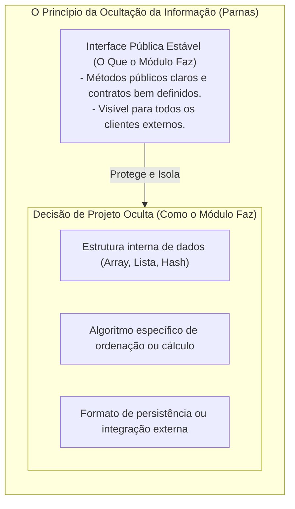
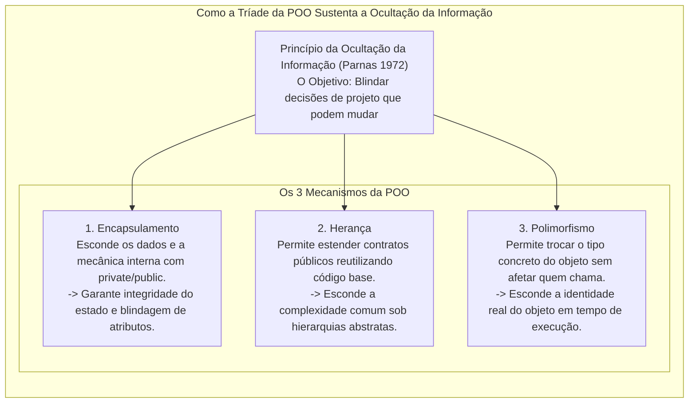
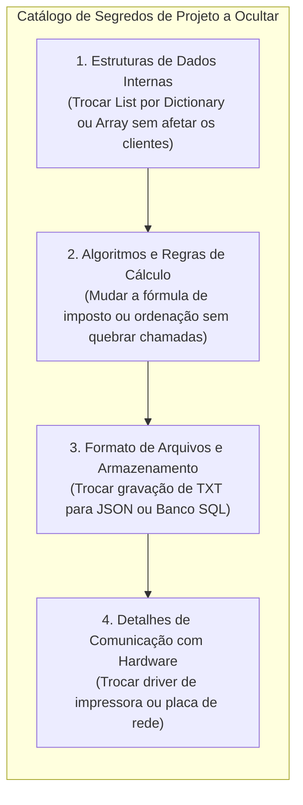

# 11. Princípio da ocultação da informação (information hiding e encapsulamento)

> **Contexto:** Formulado originalmente por David L. Parnas em 1972, o **Princípio da Ocultação da Informação (*Information Hiding*)** é um dos pilares mais revolucionários da Engenharia de Software e da Programação Modular. Este artigo explora o conceito formal de isolamento de decisões de projeto voláteis, a diferença crítica entre *Information Hiding* e Encapsulamento, os impactos diretos na manutenibilidade e no baixo acoplamento, e como materializar esse princípio em código C# moderno explicado pela Técnica de Feynman.

---

## 1. O que é o princípio da ocultação da informação? (A visão de David Parnas)

Em 1972, David L. Parnas publicou o artigo clássico *"On the Criteria to Be Used in Decomposing Systems into Modules"*, estabelecendo uma nova regra para a divisão de um sistema em módulos:

> *"Um módulo deve ser projetado para esconder uma decisão de projeto de todos os outros módulos. A interface pública deve revelar apenas o que é necessário para usar o módulo, ocultando como ele foi implementado internamente."* — David Parnas (1972)

### A regra de ouro da ocultação da informação:
> **Regra fundamental:** **Toda informação a respeito de um módulo deve ser privativa do módulo, exceto se for explicitamente declarada como pública.**

* **Privacidade por Padrão (*Default to Private*):** Tudo em uma classe ou módulo (atributos, métodos auxiliares, estruturas de dados, variáveis temporárias) nasce **privado e oculto**. Apenas as operações que compõem o contrato oficial de uso com o mundo externo devem receber a visibilidade `public`.



### A intuição (Técnica de Feynman):
* **O Painel de Controle de um Carro:**
  - Para dirigir um carro, o motorista só precisa interagir com o **volante, acelerador e freio (a Interface Pública)**.
  - O motorista **não precisa e não deve saber** se o motor é a combustão de 4 cilindros, elétrico ou híbrido (a Decisão de Projeto Oculta).
  - Se a montadora trocar o motor a gasolina por um motor elétrico, o motorista **continua dirigindo exatamente da mesma forma**, sem precisar reaprender a acelerar! O segredo da mecânica ficou oculto sob o capô.

---

## 2. A tríade da POO a serviço da ocultação da informação

A **Ocultação da Informação (*Information Hiding*)** é o princípio arquitetural orientador. Para torná-lo realidade prática no código, a Orientação a Objetos fornece três mecanismos essenciais:



### O papel de cada conceito:
1. **[[Glossário de conceitos#22 Encapsulamento Encapsulation|Encapsulamento (*Encapsulation*)]]:** É o **mecanismo primário de blindagem**. Agrupa variáveis e métodos dentro da classe e usa modificadores de acesso (`private`, `protected`) para impedir que códigos externos acessem ou dependam da representação interna do dado.
2. **[[Glossário de conceitos#23 Herança Inheritance|Herança (*Inheritance*)]]:** Permite organizar o sistema em **hierarquias de generalização e especialização**. O cliente pode interagir com uma classe genérica abstrata (`Notificador`), sem precisar saber se a implementação concreta herdeira envia SMS, E-mail ou Push Notification.
3. **[[Glossário de conceitos#24 Polimorfismo Polymorphism|Polimorfismo (*Polymorphism*)]]:** É o **grau máximo de ocultação da informação**. Permite que o programa processe diferentes objetos através de uma mesma interface ou método genérico (`ProcessarPagamento(IPagamento)`). Quem consome o serviço **ignora completamente a implementação concreta em tempo de execução**, desacoplando o código de qualquer tecnologia específica.

---

### Ocultação da informação vs. encapsulamento: a distinção formal

| Critério | Ocultação da informação (*Information Hiding*) | Encapsulamento (*Encapsulation*) |
| :--- | :--- | :--- |
| **Natureza** | **Princípio de Design Arquitetural** (conceito de alto nível). | **Mecanismo de Linguagem de Programação** (recurso técnico). |
| **Pergunta que responde** | *"Qual segredo ou decisão volátil este módulo deve isolar do resto do mundo?"* | *"Como agrupar dados e funções sob modificadores `private`/`public`?"* |
| **Foco principal** | Prevenir o impacto de mudanças futuras no sistema. | Proteger o estado interno contra acessos indevidos e corrupção. |

---

## 3. O que deve ser ocultado em um módulo? (Os "Segredos" de Parnas)

Todo módulo bem projetado deve eleger seus **segredos de projeto**, que correspondem aos componentes com maior probabilidade de mudar ao longo do tempo:



### O impacto direto na qualidade de software:
1. **Localização de Mudanças (*Change Localization*):** Quando uma regra de negócio ou tecnologia muda, você altera apenas o interior daquele arquivo. Nenhum outro arquivo do projeto precisa ser recompilado ou testado novamente!
2. **Redução Drástica do Acoplamento (*Low Coupling*):** Os módulos conversam apenas através de contratos abstratos, eliminando dependências tóxicas entre classes $\rightarrow$ [[04. Programação orientada a objetos e acoplamento|Acoplamento em POO]].
3. **Facilidade de Manutenção e Compreensibilidade:** O desenvolvedor cliente precisa entender apenas as assinaturas públicas da classe, sem ser sobrecarregado cognitivamente por 1.000 linhas de detalhes matemáticos internos.

---

## 4. O anti-padrão da "classe transparente" (Vazamento de implementação)

O maior sintoma de violação do Princípio da Ocultação da Informação é quando uma classe expõe sua mecânica interna através de coleções ou atributos públicos sem abstração:

```csharp
// VIOLAÇÃO GRAVE: Classe 'Transparente' que vaza seus segredos internos
public class CarrinhoDeComprasIncorreto 
{
    // Erro 1: expõe a lista interna diretamente para o mundo
    public List<double> Precos = new List<double>(); 
}

// O código cliente fica acoplado à estrutura List<double>:
class ClienteIncorreto 
{
    void Processar() 
    {
        CarrinhoDeComprasIncorreto c = new CarrinhoDeComprasIncorreto();
        c.Precos.Add(100.0);
        // Se amanhã o carrinho precisar usar um objeto Produto com desconto e frete,
        // o código cliente inteiro quebra!
    }
}
```

---

## 5. Exemplos atômicos por conceito (C#)

### a. Ocultando a estrutura de dados (Mudança invisível de `List` para `Dictionary`)

Demonstração isolada de como esconder a estrutura interna permite refatorar a classe inteira sem alterar uma única linha do código cliente:

```csharp
public class CatalogoProdutos 
{
    // O SEGREDO: O cliente não sabe (e não se importa) que usamos um Dictionary!
    private Dictionary<string, double> _tabelaPrecos = new Dictionary<string, double>();

    // A INTERFACE PÚBLICA ESTÁVEL:
    public void CadastrarProduto(string codigo, double preco) 
    {
        if (string.IsNullOrWhiteSpace(codigo) || preco <= 0) 
        {
            throw new ArgumentException("Dados inválidos.");
        }
        _tabelaPrecos[codigo] = preco;
    }

    public double ConsultarPreco(string codigo) 
    {
        if (_tabelaPrecos.TryGetValue(codigo, out double preco)) 
        {
            return preco;
        }
        throw new KeyNotFoundException("Produto não cadastrado.");
    }

    public int TotalProdutos => _tabelaPrecos.Count;
}
```

---

### b. Ocultando o algoritmo de cálculo e regras de validação

Demonstração isolada de encapsular fórmulas complexas sob um método simples de fachada:

```csharp
public class CalculadoraTributaria 
{
    // O SEGREDO: alíquotas e faixas tributárias são privadas e podem mudar anualmente
    private const double AliquotaBase = 0.15;
    private const double AdicionalRendaAlta = 0.075;

    public double CalcularImposto(double rendimentoBruto) 
    {
        if (rendimentoBruto <= 0) return 0;

        double imposto = rendimentoBruto * AliquotaBase;
        if (rendimentoBruto > 10000.00) 
        {
            imposto += (rendimentoBruto - 10000.00) * AdicionalRendaAlta;
        }
        return imposto;
    }
}
```

---

## 6. Exemplo completo integrado (C#)

Abaixo está o programa executável completo demonstrando o **Princípio da Ocultação da Informação** na prática com um sistema de **Estrutura de Pilha Customizada (*Stack TAD*)**. O cliente opera a pilha com `Push`, `Pop` e `Topo` sem ter a menor ideia se os dados estão armazenados em um array estático, lista dinâmica ou nós encadeados:

```csharp
using System;

namespace ProgramacaoModular.InformationHiding 
{
    /// <summary>
    /// TAD Pilha: Oculta completamente o array interno e o ponteiro do topo.
    /// </summary>
    public class PilhaSegura 
    {
        // 1. Decisões de Projeto Ocultas (Segredos de Parnas)
        private string[] _elementos;
        private int _topo;
        private const int CapacidadeInicial = 4;

        // 2. Construtor: Inicializa a mecânica oculta
        public PilhaSegura() 
        {
            _elementos = new string[CapacidadeInicial];
            _topo = 0;
        }

        // 3. Interface Pública Estável (Contrato de Serviço)
        public void Empilhar(string item) 
        {
            if (string.IsNullOrWhiteSpace(item)) 
            {
                throw new ArgumentException("Item inválido.");
            }

            // Segredo interno: redimensionamento dinâmico automático do array
            if (_topo == _elementos.Length) 
            {
                Redimensionar(_elementos.Length * 2);
            }

            _elementos[_topo] = item;
            _topo++;
        }

        public string Desempilhar() 
        {
            if (EstaVazia) 
            {
                throw new InvalidOperationException("A pilha está vazia!");
            }

            _topo--;
            string item = _elementos[_topo];
            _elementos[_topo] = null; // Libera referência para o Garbage Collector!
            return item;
        }

        public string InspecionarTopo() 
        {
            if (EstaVazia) 
            {
                throw new InvalidOperationException("A pilha está vazia!");
            }
            return _elementos[_topo - 1];
        }

        public bool EstaVazia => _topo == 0;
        public int Quantidade => _topo;

        // 4. Método Privado de Apoio (Totalmente Oculto do Cliente)
        private void Redimensionar(int novaCapacidade) 
        {
            string[] novoArray = new string[novaCapacidade];
            Array.Copy(_elementos, novoArray, _topo);
            _elementos = novoArray;
        }
    }

    class Program 
    {
        static void Main() 
        {
            Console.WriteLine("=== Demonstração do Princípio da Ocultação da Informação ===");

            PilhaSegura historicoNavegador = new PilhaSegura();

            // O cliente usa a pilha de forma limpa, sem saber nada sobre arrays ou ponteiros
            historicoNavegador.Empilhar("https://google.com");
            historicoNavegador.Empilhar("https://pucminas.br");
            historicoNavegador.Empilhar("https://github.com");

            Console.WriteLine($"Página atual no topo: {historicoNavegador.InspecionarTopo()}");
            Console.WriteLine($"Total de páginas no histórico: {historicoNavegador.Quantidade}");

            Console.WriteLine("\nVoltando nas páginas (Desempilhando):");
            while (!historicoNavegador.EstaVazia) 
            {
                Console.WriteLine($"Saindo de: {historicoNavegador.Desempilhar()}");
            }

            Console.WriteLine($"\nHistórico vazio? {historicoNavegador.EstaVazia}");
        }
    }
}
```

---

## 7. Resumo comparativo: módulo com ocultação vs. módulo sem ocultação

| Critério | Módulo com ocultação (*Information Hiding*) | Módulo sem ocultação (Vazamento de dados) |
| :--- | :--- | :--- |
| **Acoplamento externo** | **Baixo:** o cliente depende apenas de métodos públicos abstratos. | **Alto:** o cliente acessa detalhes e variáveis internas. |
| **Facilidade de refatoração** | **Total:** podemos trocar algoritmos e estruturas sem quebrar ninguém. | **Crítica:** qualquer mudança interna quebra dezenas de outros arquivos. |
| **Proteção de regras** | **Robusta:** invariantes são blindadas e validadas na entrada. | **Frágil:** qualquer código de fora pode corromper dados internos. |
| **Carga cognitiva** | **Pequena:** o programador estuda apenas a interface pública da classe. | **Enorme:** o programador precisa ler todo o código para usá-lo com segurança. |

---

## Referências bibliográficas

### Bibliografia básica
* PARNAS, David L. **On the Criteria to Be Used in Decomposing Systems into Modules**. Communications of the ACM, v. 15, n. 12, p. 1053-1058, Dec. 1972. Disponível em: [https://dl.acm.org/doi/10.1145/361598.361623](https://dl.acm.org/doi/10.1145/361598.361623).
* MEYER, Bertrand. **Object-Oriented Software Construction**. 2. ed. Prentice Hall, 1997.
* SOMMERVILLE, Ian. **Engenharia de Software**. 10. ed. São Paulo: Pearson, 2019.
* MARTIN, Robert C. **Código Limpo: Habilidades Práticas do Agile Software**. Rio de Janeiro: Alta Books, 2011.

### Bibliografia complementar
* DE PAULA, Hugo. **Programação Modular: Exemplos de Classes e Objetos em C#**. GitHub, 2023. Disponível em: [https://github.com/hugodepaula/programacao-modular-ead/tree/main/exemplos/2_Classes_e_Objetos](https://github.com/hugodepaula/programacao-modular-ead/tree/main/exemplos/2_Classes_e_Objetos).
* LISKOV, Barbara; ZILLES, Stephen. **Programming with Abstract Data Types**. ACM SIGPLAN Notices, v. 9, n. 4, p. 50-59, April 1974.
* SEBESTA, Robert W. **Conceitos de Linguagens de Programação**. 11. ed. Porto Alegre: Bookman, 2018.

---

## Artigos relacionados e navegação

* **Artigo anterior:** [[10. Destrutores e finalizadores (desalocação de memória e liberação de recursos)]]
* **Resumo da disciplina:** [[00. Programação modular - Resumo]]
* **Glossário da disciplina:** [[Glossário de conceitos]]
* **Ver Introdução à Programação Modular:** [[01. Introdução à programação modular]]
* **Ver Acoplamento e POO:** [[04. Programação orientada a objetos e acoplamento]]
* **Índice geral do vault:** [[index.md|Página Inicial do Vault]]
