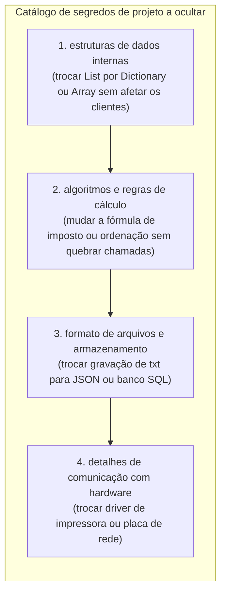
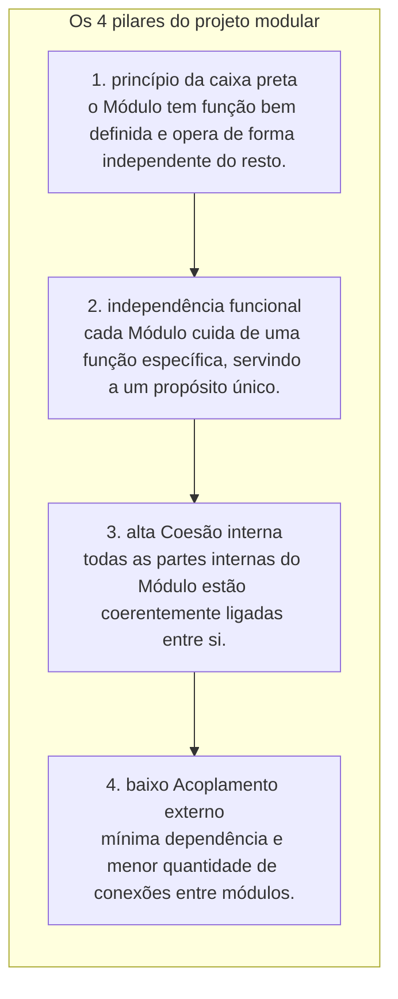
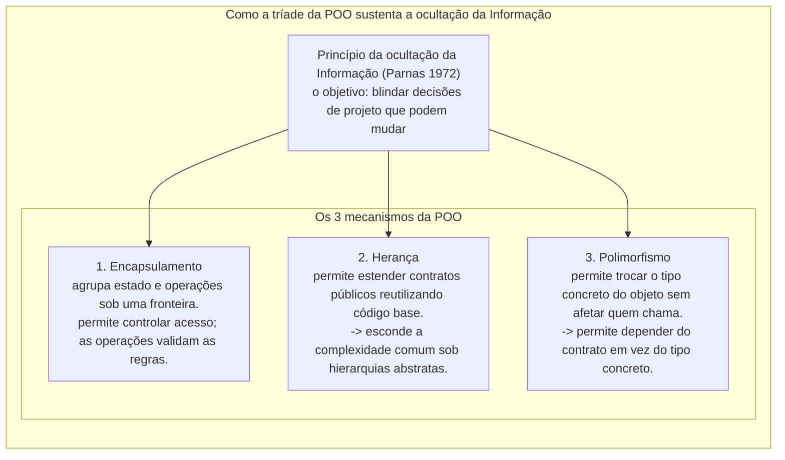

# 11. Princípio da ocultação da informação (information hiding e encapsulamento)

> **Contexto:** Esta nota desenvolve os conceitos de programação modular estudados na disciplina. As explicações de C#/.NET são complementação técnica; as analogias são recursos didáticos para acompanhar os exemplos.

---


**Percurso de leitura:** conceito central → mecânica em C# → aprofundamento técnico → conexões. A primeira camada constrói a ideia; os exemplos e detalhes permanecem disponíveis nas seguintes.

## 1. Conceito central

Se trocar a estrutura de armazenamento obriga todos os clientes a mudar, uma decisão interna escapou do módulo. Ocultar informação significa escolher quais decisões podem variar e oferecer um contrato que permita usá-las sem depender de sua representação.

### O que é o princípio da ocultação da informação? (a visão de David Parnas)

O conceito foi formulado originalmente por **david l. Parnas** em seu relatório técnico de 1971 (*"Information Distribution Aspects of Design Methodology"*) e consagrado em seu artigo clássico de 1972 (*"On the Criteria to Be Used in Decomposing Systems into Modules"*). Parnas argumentou que a modularização de um sistema de software deve ser guiada pela ocultação de **decisões críticas e voláteis de projeto**, minimizando o impacto de futuras mudanças nos demais módulos do sistema:

A ideia pode ser resumida assim: cada módulo concentra uma decisão de projeto que os demais não precisam conhecer para utilizar seus serviços. Essa é uma **síntese didática**, não uma citação literal do texto de Parnas.

#### O que é um módulo? (a unidade de fronteira)
Na Engenharia de Software e na visão de Parnas, um **[[Glossário de conceitos#3 Módulo Module|Módulo (*Module*)]]** É a **unidade de fronteira, organização e isolamento do código**. Ele serve como um invólucro coeso que agrupa dados e operações sob uma mesma responsabilidade:
* **No nível de linguagem:** Pode ser materializado por tipos ou conjuntos de tipos. Uma `interface` descreve um contrato; um `namespace` organiza nomes e não cria, sozinho, uma barreira de acesso.
* **No nível de compilação e deploy:** É um arquivo físico (`.cs`), uma biblioteca (`.dll`), um pacote NuGet ou um microsserviço.
* **O papel do módulo na ocultação:** O módulo atua como a **muralha protetora**: ele define o que fica confinado em seu interior (`private`) e o que é exposto através de suas portas de comunicação públicas (`public`).

#### A regra de ouro da ocultação da informação:
> **Regra fundamental:** **toda informação a respeito de um módulo deve ser privativa do módulo, exceto se for explicitamente declarada como pública.**

* **Privacidade por padrão (*default to private*):** Como diretriz de projeto, comece com a menor exposição necessária. Isso não descreve todos os padrões da linguagem: tipos em namespaces são normalmente `internal`, membros de classes são normalmente `private`, e interfaces têm regras próprias. Apenas as operações que compõem o contrato oficial de uso com o mundo externo devem receber a visibilidade `public`.


#### O par fundamental: interface vs. implementação
* **[[Glossário de conceitos#25 Interface Interface Contrato de Serviço|A interface (*o que faz*)]]:** É a casca externa visível. Inclui membros públicos e seu comportamento prometido: resultados, exceções, efeitos e regras de uso. O contrato não se limita à assinatura que o compilador verifica.
* **[[Glossário de conceitos#26 Implementação Implementation Mecânica Interna|A implementação (*como faz*)]]:** É o miolo interno oculto. Composta por algoritmos, estruturas de dados (`private`) e variáveis que realizam o serviço prometido pela interface. O cliente nunca deve depender da implementação, apenas da interface!

#### O papel da assinatura pública (*public signature*)
A **[[Glossário de conceitos#9 Assinatura de Método Method Signature|assinatura pública]]** é a promessa formal que o compilador fiscaliza entre o módulo e quem o utiliza:
* **O que define:** É composta pelo **nome do método público + tipos, quantidade e ordem exata dos parâmetros**.
* **Imutabilidade do contrato:** Para manter a ocultação de informação eficiente, a assinatura pública de um método **deve ser estável**. Se você alterar a assinatura pública (ex.: mudar `Transferir(double valor)` para `Transferir(double valor, string motivo)`), você quebra todos os clientes que dependem do módulo.
* **Analogia de Feynman:** O **nome e os ingredientes do prato no cardápio**. Se o cardápio promete *"Lasanha à bolonhesa (massa, queijo, molho de carne)"*, o cliente pede esperando exatamente aquela assinatura. O chefe de cozinha pode mudar a marca do queijo ou o tempo de forno (a implementação), mas não pode de repente exigir que o cliente traga o molho de casa sem avisar!

#### A intuição (técnica de Feynman):
* **O painel de controle de um carro:**
  - Para dirigir um carro, o motorista só precisa interagir com o **volante, acelerador e freio (a interface pública)**.
  - O motorista **não precisa e não deve saber** se o motor é a combustão de 4 cilindros, elétrico ou híbrido (a decisão de projeto oculta).
  - Se a montadora trocar o motor a gasolina por um motor elétrico, o motorista **continua dirigindo exatamente da mesma forma**, sem precisar reaprender a acelerar! O segredo da mecânica ficou oculto sob o capô.

---

## 2. Mecânica em C#

Compare a classe que expõe seus campos com o catálogo e a pilha encapsulados. O cliente deve expressar a operação desejada; o módulo decide como executá-la e preservar suas regras.

### O anti-padrão da "classe transparente" e o perigo do acesso direto

O maior sintoma de violação do Princípio da Ocultação da Informação é quando uma classe expõe seus atributos e sua mecânica interna diretamente para o mundo:

* **O perigo da corrupção de estado:** Por exemplo, acessar diretamente o campo `quantidade` da classe `Produto` e atribuir um valor negativo (`p.quantidade = -15;`) **invalida todo o funcionamento da classe `Produto`**, corrompendo relatórios de estoque, cálculos financeiros e notas fiscais.
* **A armadilha de criar *getters* e *setters* indiscriminadamente:** Ocultação de informação **NÃO significa criar um `get` e um `set` para cada atributo privado**. Se um campo privado faz parte da lógica interna que não deve ser alterada ou lida externamente, ele deve permanecer 100% inacessível de fora. Criar um `set` público sem critério destrói a blindagem da classe da mesma forma que um atributo público!
* **A solução:** O atributo deve ser estritamente privado (`private int _quantidade;`), sendo manipulado apenas por métodos ou propriedades que validem a regra (`public void AdicionarEstoque(int qtd)`).

```csharp
// VIOLAÇÃO GRAVE: Classe 'Transparente' que vaza seus atributos e estruturas internas
public class ProdutoIncorreto
{
    public string Nome;
    public int Quantidade; // PERIGO: Qualquer um pode atribuir -50 aqui!
    public List<double> HistoricoPrecos = new List<double>();
}
```

---

### Exemplos atômicos por conceito (C#)

#### Ocultando a estrutura de dados (mudança invisível de `List` para `Dictionary`)

Demonstração isolada de como esconder a estrutura interna permite refatorar a classe inteira sem alterar uma única linha do código cliente (observe o uso de `throw` para interromper a execução caso dados inválidos sejam fornecidos → veja a explicação completa no [[00. Sintaxe Multilinguagem/09. Tratamento de exceções e erros (try, catch, finally, throw)|Guia de sintaxe de tratamento de exceções (throw)]]):

```csharp
public class CatalogoProdutos
{
    // O SEGREDO: O cliente não sabe (e não se importa) que usamos um Dictionary!
    private Dictionary<string, double> _tabelaPrecos = new Dictionary<string, double>();

    // A interface pública estável:
    public void CadastrarProduto(string codigo, double preco)
    {
        if (string.IsNullOrWhiteSpace(codigo) || preco <= 0)
        {
            throw new ArgumentException("Dados inválidos.");
        }
        _tabelaPrecos[codigo] = preco;
    }

    public double ConsultarPreco(string codigo)
    {
        if (_tabelaPrecos.TryGetValue(codigo, out double preco))
        {
            return preco;
        }
        throw new KeyNotFoundException("Produto não cadastrado.");
    }

    public int TotalProdutos => _tabelaPrecos.Count;
}
```

---

#### Ocultando o algoritmo de cálculo e regras de validação

Demonstração isolada de encapsular fórmulas sob um método simples. Alíquotas e faixas abaixo são fictícias, destinadas ao exemplo de projeto:

```csharp
public class CalculadoraTributaria
{
    // O segredo: alíquotas e faixas tributárias são privadas e podem mudar anualmente
    private const double AliquotaBase = 0.15;
    private const double AdicionalRendaAlta = 0.075;

    public double CalcularImposto(double rendimentoBruto)
    {
        if (rendimentoBruto <= 0) return 0;

        double imposto = rendimentoBruto * AliquotaBase;
        if (rendimentoBruto > 10000.00)
        {
            imposto += (rendimentoBruto - 10000.00) * AdicionalRendaAlta;
        }
        return imposto;
    }
}
```

---

### Exemplo completo integrado (C#)

Abaixo está o programa executável completo demonstrando o **princípio da ocultação da informação** na prática com um sistema de **Estrutura de Pilha Customizada (*Stack TAD*)**. O cliente opera a pilha com `Empilhar`, `Desempilhar` e `InspecionarTopo` sem ter a menor ideia se os dados estão armazenados em um array de capacidade fixa, lista dinâmica ou nós encadeados:

```csharp
using System;

namespace ProgramacaoModular.InformationHiding
{
    /// <summary>
    /// TAD Pilha: Oculta completamente o array interno e o ponteiro do topo.
    /// </summary>
    public class PilhaSegura
    {
        // 1. Decisões de projeto ocultas (segredos de Parnas)
        private string[] _elementos;
        private int _topo;
        private const int CapacidadeInicial = 4;

        // 2. Construtor: inicializa a mecânica oculta
        public PilhaSegura()
        {
            _elementos = new string[CapacidadeInicial];
            _topo = 0;
        }

        // 3. Interface pública estável (contrato de serviço)
        public void Empilhar(string item)
        {
            if (string.IsNullOrWhiteSpace(item))
            {
                throw new ArgumentException("Item inválido.");
            }

            // Segredo interno: redimensionamento dinâmico automático do array
            if (_topo == _elementos.Length)
            {
                Redimensionar(_elementos.Length * 2);
            }

            _elementos[_topo] = item;
            _topo++;
        }

        public string Desempilhar()
        {
            if (EstaVazia)
            {
                throw new InvalidOperationException("A pilha está vazia!");
            }

            _topo--;
            string item = _elementos[_topo];
            _elementos[_topo] = null; // Remove a referência retida pela pilha; outras referências ainda podem existir
            return item;
        }

        public string InspecionarTopo()
        {
            if (EstaVazia)
            {
                throw new InvalidOperationException("A pilha está vazia!");
            }
            return _elementos[_topo - 1];
        }

        public bool EstaVazia => _topo == 0;
        public int Quantidade => _topo;

        // 4. Método privado de apoio (totalmente oculto do cliente)
        private void Redimensionar(int novaCapacidade)
        {
            string[] novoArray = new string[novaCapacidade];
            Array.Copy(_elementos, novoArray, _topo);
            _elementos = novoArray;
        }
    }

    class Program
    {
        static void Main()
        {
            Console.WriteLine("=== Demonstração do Princípio da Ocultação da Informação ===");

            PilhaSegura historicoNavegador = new PilhaSegura();

            // O cliente usa a pilha de forma limpa, sem saber nada sobre arrays ou ponteiros
            historicoNavegador.Empilhar("https://google.com");
            historicoNavegador.Empilhar("https://pucminas.br");
            historicoNavegador.Empilhar("https://github.com");

            Console.WriteLine($"Página atual no topo: {historicoNavegador.InspecionarTopo()}");
            Console.WriteLine($"Total de páginas no histórico: {historicoNavegador.Quantidade}");

            Console.WriteLine("\nVoltando nas páginas (Desempilhando):");
            while (!historicoNavegador.EstaVazia)
            {
                Console.WriteLine($"Saindo de: {historicoNavegador.Desempilhar()}");
            }

            Console.WriteLine($"\nHistórico vazio? {historicoNavegador.EstaVazia}");
        }
    }
}
```

---

## 3. Aprofundamento técnico

Os segredos de projeto podem envolver estruturas, algoritmos, persistência e hardware. Coesão e acoplamento ajudam a avaliar essa fronteira; são critérios de projeto, não garantias automáticas dadas por `private`.

### A fronteira precisa sobreviver à troca de implementação

Trocar `List` por `Dictionary` é transparente somente se ordem, duplicatas, comparação de chaves e erros observáveis continuarem respeitando o contrato. Ocultar o nome do campo não basta se um getter devolver a coleção mutável interna e permitir alterações externas.

Herança pode ampliar o acoplamento à representação da classe base. Polimorfismo permite usar um contrato comum, mas não impede que o cliente dependa do tipo concreto. Nenhum é condição necessária para aplicar ocultação de informação: módulos procedurais também podem esconder decisões. A distinção entre encapsulamento e ocultação usada neste artigo é didática; a terminologia varia entre autores.

### O que deve ser ocultado em um módulo? (os "segredos" de Parnas)

Todo módulo bem projetado deve eleger seus **segredos de projeto**, que correspondem aos componentes com maior probabilidade de mudar ao longo do tempo:



#### O impacto direto na qualidade de software:
1. **Localização de mudanças (*change localization*):** Ocultar uma decisão reduz os locais que precisam de edição. Isso não dispensa recompilação nem testes de integração e regressão: comportamento, desempenho e efeitos observáveis também fazem parte das expectativas dos clientes.
2. **Redução drástica do acoplamento (*low coupling*):** Os módulos conversam apenas através de contratos abstratos, eliminando dependências tóxicas entre classes → [[04. Programação orientada a objetos e acoplamento|Acoplamento em POO]].
3. **Facilidade de manutenção e compreensibilidade:** O desenvolvedor cliente precisa entender apenas as assinaturas públicas da classe, sem ser sobrecarregado cognitivamente por 1.000 linhas de detalhes matemáticos internos.

---

### Os pilares do projeto modular: caixa preta, independência funcional, coesão e acoplamento

Para que a ocultação de informação seja efetiva na prática, o projeto do software deve ser regido por quatro conceitos essenciais de engenharia:



#### O que significa cada conceito:
1. **[[Glossário de conceitos#28 Princípio da caixa preta Black Box Principle|Encapsulamento e o princípio da caixa preta]]:** Um módulo deve consistir de um conjunto de comandos com uma **função bem definida**, e ser o **mais independente possível** em relação ao resto do sistema. Quem usa a caixa preta aperta botões externos sem ver os circuitos internos.
2. **[[Glossário de conceitos#29 Independência funcional Functional Independence|Independência funcional (*functional independence*)]]:** Cada módulo deve cuidar de uma **função específica**, servindo a um propósito específico e delimitado no domínio do problema.
3. **[[Glossário de conceitos#27 Coesão Cohesion|Coesão (*cohesion*)]]:** É o atributo de um módulo em que **todas as suas partes estão intimamente ligadas umas às outras**. Em software de qualidade, todas as linhas e métodos de uma classe estão coerentemente relacionados ao seu propósito central. o objetivo em programação modular é obter **alta coesão interna** → [[06. Fatores internos de qualidade de software#2. Alta coesão High Cohesion|Coesão nos Fatores Internos]].
4. **[[04. Programação orientada a objetos e acoplamento|Acoplamento (*coupling*)]]:** É a **medida da interconexão e dependência** Entre os elementos de software. essa dependência pode ser medida pela quantidade e complexidade de conexões entre os módulos de um sistema. a situação ideal em engenharia é que um sistema possua **baixo acoplamento** → [[04. Programação orientada a objetos e acoplamento#5. O problema do acoplamento vs. coesão em sistemas modulares|Acoplamento em POO]].

---

#### Os 3 indicadores de baixo acoplamento

Como avaliar tecnicamente se um módulo possui baixo acoplamento na prática? Podemos usar três indicadores didáticos. Eles orientam a análise, mas contagens isoladas não medem toda a qualidade de um contrato:

| Indicador | O que avalia? | Cenário ideal de baixo acoplamento | Cenário de alto acoplamento (Evitar) |
| :--- | :--- | :--- | :--- |
| **1. tamanho** | A quantidade de parâmetros e métodos públicos expostos. | **mínimo:** métodos com poucos parâmetros (1 a 3) e interface enxuta. | Métodos com 10 parâmetros e centenas de métodos públicos na classe. |
| **2. visibilidade** | A forma como os dados trafegam entre os módulos. | **parâmetros explícitos:** dados passam via argumentos controlados. | Uso de variáveis globais e atributos públicos compartilhados sem controle. |
| **3. flexibilidade** | A facilidade e simplicidade na chamada do módulo. | **chamada direta e isolada:** chamar o módulo sem precisar configurar dezenas de objetos antes. | O cliente precisa instanciar e configurar 5 outros módulos para conseguir chamar uma função. |

---

## 4. Conexões

**Continue a leitura:** [[12. Modificadores de acesso (visibilidade e níveis de proteção no encapsulamento)|Artigo 12]] · [[13. Métodos de acesso e propriedades (publicação de contratos e garantia de invariantes)|Artigo 13]].

Encapsulamento, herança e polimorfismo podem apoiar a ocultação, mas não a garantem. Os artigos 12 e 13 mostram os mecanismos de acesso e os contratos de propriedades que concretizam essas escolhas.

### A tríade da POO a serviço da ocultação da informação

A **Ocultação da Informação (*Information Hiding*)** é o princípio arquitetural orientador. Para torná-lo realidade prática no código, a Orientação a Objetos fornece três mecanismos essenciais:



#### O papel de cada conceito:
1. **[[Glossário de conceitos#22 Encapsulamento Encapsulation|Encapsulamento (*encapsulation*)]]:** É o **mecanismo primário de blindagem**. Agrupa variáveis e métodos dentro da classe e usa modificadores de acesso (`private`, `protected`) para impedir que códigos externos acessem ou dependam da representação interna do dado.
2. **[[Glossário de conceitos#23 Herança Inheritance|Herança (*inheritance*)]]:** Permite organizar o sistema em **hierarquias de generalização e especialização**. O cliente pode interagir com uma classe genérica abstrata (`Notificador`), sem precisar saber se a implementação concreta herdeira envia SMS, E-mail ou Push Notification.
3. **[[Glossário de conceitos#24 Polimorfismo Polymorphism|Polimorfismo (*polymorphism*)]]:** É uma forma de **usar implementações diferentes por um contrato comum**. Permite que o programa processe diferentes objetos através de uma mesma interface ou método genérico (`ProcessarPagamento(IPagamento)`). quem consome o serviço **ignora completamente a implementação concreta em tempo de execução**, desacoplando o código de qualquer tecnologia específica.

---

#### Ocultação da informação vs. encapsulamento: a distinção formal

| Critério | Ocultação da informação (*information hiding*) | Encapsulamento (*encapsulation*) |
| :--- | :--- | :--- |
| **Natureza** | **princípio de design arquitetural** (conceito de alto nível). | **mecanismo de linguagem de programação** (recurso técnico). |
| **Pergunta que responde** | *"Qual segredo ou decisão volátil este módulo deve isolar do resto do mundo?"* | *"Como agrupar dados e funções sob modificadores `private`/`public`?"* |
| **Foco principal** | Prevenir o impacto de mudanças futuras no sistema. | Proteger o estado interno contra acessos indevidos e corrupção. |

---

### Resumo comparativo: módulo com ocultação vs. módulo sem ocultação

| Critério | Módulo com ocultação (*Information Hiding*) | Módulo sem ocultação (Vazamento de dados) |
| :--- | :--- | :--- |
| **Acoplamento externo** | **baixo:** o cliente depende apenas de métodos públicos abstratos. | **alto:** o cliente acessa detalhes e variáveis internas. |
| **Facilidade de refatoração** | **total:** podemos trocar algoritmos e estruturas sem quebrar ninguém. | **crítica:** qualquer mudança interna quebra dezenas de outros arquivos. |
| **Proteção de regras** | **robusta:** invariantes são blindadas e validadas na entrada. | **frágil:** qualquer código de fora pode corromper dados internos. |
| **Carga cognitiva** | **pequena:** o programador estuda apenas a interface pública da classe. | **enorme:** o programador precisa ler todo o código para usá-lo com segurança. |

---

### Referências bibliográficas

#### Bibliografia básica
* PARNAS, David L. **On the Criteria to Be Used in Decomposing Systems into Modules**. Communications of the ACM, v. 15, n. 12, p. 1053-1058, Dec. 1972. Disponível em: [https://dl.acm.org/doi/10.1145/361598.361623](https://dl.acm.org/doi/10.1145/361598.361623).
* MEYER, Bertrand. **Object-Oriented Software Construction**. 2. ed. Prentice Hall, 1997.
* SOMMERVILLE, Ian. **Engenharia de Software**. 10. ed. São Paulo: Pearson, 2019.
* MARTIN, Robert C. **Código Limpo: Habilidades Práticas do Agile Software**. Rio de Janeiro: Alta Books, 2011.

#### Bibliografia complementar
* PARNAS, David L. **Information Distribution Aspects of Design Methodology**. In: FREIMAN, Charles V.; GRIFFITH, John E.; ROSENFELD, Jack L. (Ed.). Proceedings of IFIP Congress 1971. North-Holland, 1971. v. 1, p. 339–344. DOI: [10.1184/R1/6606470.V1](https://kilthub.cmu.edu/articles/journal_contribution/Information_distribution_aspects_of_design_methodology/6606470/1). Disponível em: [https://cseweb.ucsd.edu/~wgg/CSE218/Parnas-IFIP71-information-distribution.PDF](https://cseweb.ucsd.edu/~wgg/CSE218/Parnas-IFIP71-information-distribution.PDF).
* DE PAULA, Hugo. **Programação Modular: Exemplos de Classes e Objetos em C#**. GitHub, 2023. Disponível em: [https://github.com/hugodepaula/programacao-modular-ead/tree/main/exemplos/2_Classes_e_Objetos](https://github.com/hugodepaula/programacao-modular-ead/tree/main/exemplos/2_Classes_e_Objetos).
* LISKOV, Barbara; ZILLES, Stephen. **Programming with Abstract Data Types**. ACM SIGPLAN Notices, v. 9, n. 4, p. 50-59, April 1974.
* SEBESTA, Robert W. **Conceitos de Linguagens de Programação**. 11. ed. Porto Alegre: Bookman, 2018.

---

### Artigos relacionados e navegação

* **Artigo anterior:** [[10. Destrutores e finalizadores (desalocação de memória e liberação de recursos)]]
* **Próximo artigo:** [[12. Modificadores de acesso (visibilidade e níveis de proteção no encapsulamento)]]
* **Resumo da disciplina:** [[00. Programação modular - Resumo]]
* **Glossário da disciplina:** [[Glossário de conceitos]]
* **Guia de sintaxe (tratamento de exceções e throw):** [[00. Sintaxe Multilinguagem/09. Tratamento de exceções e erros (try, catch, finally, throw)]]
* **Ver introdução à programação modular:** [[01. Introdução à programação modular]]
* **Ver acoplamento e POO:** [[04. Programação orientada a objetos e acoplamento]]
* **Índice geral do vault:** [[index.md|Página inicial do vault]]
