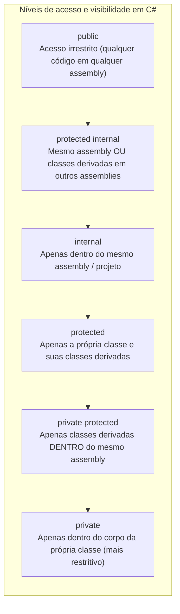
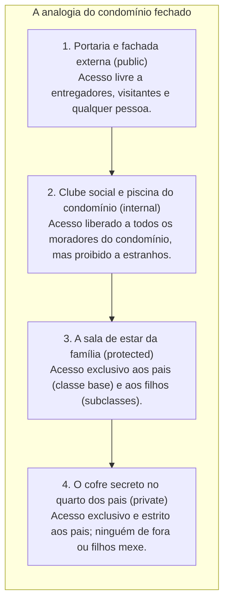

# 12. Modificadores de acesso (visibilidade e níveis de proteção no encapsulamento)

> **Contexto:** Os **modificadores de acesso** são as palavras-chave que declaram a visibilidade e o nível de proteção dos tipos e membros de um módulo no código. Eles representam a ferramenta de linguagem primordial para transformar os princípios abstratos de **encapsulamento** e **ocultação da informação** (*Information Hiding*) em barreiras de segurança física fiscalizadas pelo compilador.

---

## 1. O que são modificadores de acesso?

Na programação modular e orientada a objetos, um **modificador de acesso** (*access modifier*) é uma declaração sintática que especifica **onde** um determinado tipo (classe, struct, interface) ou membro (atributo, método, propriedade, construtor) pode ser referenciado e utilizado.

* **O objetivo central:** Controlar rigorosamente a **fronteira entre a interface pública do módulo e sua mecânica interna oculta**, impedindo que classes externas acessem, modifiquem ou se acoplem a detalhes de implementação voláteis.
* **A regra de ouro:** Todo membro deve receber o **menor nível de visibilidade possível** para cumprir sua função (*princípio do menor privilégio*). Atributos e detalhes internos nascem sempre `private`.



---

## 2. A intuição do mundo real (Técnica de Feynman): o condomínio fechado

Para compreender como os diferentes níveis de acesso operam na prática, imagine um **condomínio residencial de luxo**:



### O papel de cada nível na analogia:
1. **`public` (A calçada e a portaria externa):** Qualquer pessoa na rua pode ver e interagir. Representa os botões e operações oficiais do módulo.
2. **`internal` (A piscina e a academia do condomínio):** Qualquer morador daquele mesmo condomínio (mesmo projeto / DLL / assembly) pode usar. Quem mora em outro condomínio não tem autorização.
3. **`protected` (A casa da família e as heranças):** Apenas os membros daquela linhagem familiar (a classe base e suas filhas/subclasses) têm a chave, mesmo que um filho se mude para outra cidade (outro assembly).
4. **`private` (O cofre biométrico trancado no quarto):** Somente o dono legítimo (o código dentro da própria classe) possui acesso. Nem mesmo os filhos ou vizinhos conseguem abrir.

---

## 3. Matriz comparativa dos modificadores de acesso em C#

Abaixo está o quadro de regras que o compilador C# utiliza para permitir ou barrar o acesso a membros:

| Modificador de acesso | Dentro da própria classe | Subclasses no mesmo assembly | Outras classes no mesmo assembly | Subclasses em outro assembly | Outras classes em outro assembly |
| :--- | :---: | :---: | :---: | :---: | :---: |
| **`public`** | Sim | Sim | Sim | Sim | Sim |
| **`protected internal`** | Sim | Sim | Sim | Sim | Não |
| **`internal`** | Sim | Sim | Sim | Não | Não |
| **`protected`** | Sim | Sim | Não | Sim | Não |
| **`private protected`** | Sim | Sim | Não | Não | Não |
| **`private`** | Sim | Não | Não | Não | Não |

---

## 4. Modificadores em nível de tipo (classes e interfaces) vs. nível de membro

Uma distinção fundamental na programação modular é onde o modificador está sendo aplicado:

### a. Modificadores para tipos (classes, structs e interfaces)
No nível superior (diretamente dentro de um `namespace`), tipos só podem ter dois modificadores principais:
* **`public`:** O tipo pode ser instanciado e consumido por qualquer projeto que adicione referência a essa biblioteca (.DLL).
* **`internal` (*padrão para classes em C#*):** O tipo só é visível dentro do mesmo projeto / assembly. É uma excelente prática para criar classes utilitárias auxiliares que não devem fazer parte da API pública do pacote.

### b. Modificadores para membros (campos, métodos, propriedades, construtores)
Membros dentro de uma classe suportam todos os 6 modificadores.
* **Padrão em C# para membros:** Se você omitir o modificador de acesso em um membro de classe, ele se torna **`private` por padrão**.

---

## 5. Boas práticas de projeto modular com visibilidade

1. **Campos de instância nunca devem ser `public`:**
   - Expor um campo (`public double Saldo;`) quebra a invariante da classe e impede que você adicione validações no futuro.
   - Use sempre atributos privados (`private double _saldo;`) combinados com propriedades (`public double Saldo => _saldo;`).
2. **Métodos de apoio e funções auxiliares devem ser `private`:**
   - Se uma função serve apenas para calcular um subpasso de um algoritmo (ex.: `ValidarDigitoVerificador()`), marque-a como `private`. Expor funções internas polui o catálogo de métodos da classe e aumenta desnecessariamente o acoplamento externo.
3. **Use `protected` com cautela:**
   - O modificador `protected` cria um acoplamento direto entre a classe base e as classes herdeiras. Se você alterar um membro protegido, poderá quebrar todas as subclasses do projeto.
4. **Use `internal` para arquitetura em camadas:**
   - Permite que classes do domínio conversem livremente dentro da mesma camada sem expor estruturas internas para clientes externos do pacote.

---

## 6. Exemplos atômicos por conceito (C#)

### a. Membro privado vs. interface pública (protegendo invariantes)

Demonstração isolada de como o modificador `private` impede manipulação indevida e `public` oferece o serviço seguro:

```csharp
public class Termostato 
{
    // O segredo protegido: temperatura não pode ser alterada diretamente
    private double _temperaturaAtual;

    public Termostato(double temperaturaInicial) 
    {
        _temperaturaAtual = temperaturaInicial;
    }

    // Método público: interface controlada com validação
    public void AjustarTemperatura(double novaTemperatura) 
    {
        if (novaTemperatura < -50 || novaTemperatura > 100) 
        {
            throw new ArgumentOutOfRangeException("Temperatura fora dos limites de segurança!");
        }
        _temperaturaAtual = novaTemperatura;
    }

    public double Temperatura => _temperaturaAtual;
}
```

---

### b. O modificador `protected` em hierarquias de herança

Demonstração isolada de como subclasses acessam recursos protegidos que permanecem invisíveis para o restante do programa:

```csharp
public abstract class Funcionario 
{
    public string Nome { get; }
    // Apenas a classe base e as classes filhas (Gerente, Diretor) podem alterar a matricula
    protected string MatriculaInterna;

    protected Funcionario(string nome, string matricula) 
    {
        Nome = nome;
        MatriculaInterna = matricula;
    }
}

public class Gerente : Funcionario 
{
    public Gerente(string nome, string matricula) : base(nome, matricula) { }

    public void AtualizarMatriculaRegional(string prefixo) 
    {
        // Acesso permitido porque MatriculaInterna é protected!
        MatriculaInterna = $"{prefixo}-{MatriculaInterna}";
    }
}
```

---

## 7. Exemplo completo integrado (C#)

Abaixo está um programa executável completo demonstrando os modificadores de acesso trabalhando juntos em um **Sistema de Conta Bancária Corporativa**. O exemplo demonstra atributos privados, membros protegidos para herança, construtores e métodos públicos, e o bloqueio de acessos inválidos pelo compilador:

```csharp
using System;

namespace ProgramacaoModular.ModificadoresDeAcesso 
{
    /// <summary>
    /// Classe base com membros públicos, protegidos e privados.
    /// </summary>
    public class ContaBancaria 
    {
        // 1. Membro público: identificador imutável seguro
        public string Numero { get; }

        // 2. Membro privado: blindagem total contra corrupção externa
        private decimal _saldo;

        // 3. Membro protegido: visível para ContaPoupanca e ContaCorrente
        protected int TotalTransacoesRealizadas;

        public ContaBancaria(string numero, decimal saldoInicial) 
        {
            if (string.IsNullOrWhiteSpace(numero)) 
            {
                throw new ArgumentException("Número de conta inválido.");
            }
            if (saldoInicial < 0) 
            {
                throw new ArgumentException("Saldo inicial não pode ser negativo.");
            }

            Numero = numero;
            _saldo = saldoInicial;
            TotalTransacoesRealizadas = 0;
        }

        // Interface pública: operações permitidas
        public void Depositar(decimal valor) 
        {
            if (valor <= 0) 
            {
                throw new ArgumentException("O valor do depósito deve ser positivo.");
            }
            _saldo += valor;
            TotalTransacoesRealizadas++;
            RegistrarLog($"Depósito de {valor:C} realizado com sucesso.");
        }

        public virtual bool Sacar(decimal valor) 
        {
            if (valor <= 0 || valor > _saldo) 
            {
                return false;
            }
            _saldo -= valor;
            TotalTransacoesRealizadas++;
            RegistrarLog($"Saque de {valor:C} realizado.");
            return true;
        }

        public decimal ObterSaldo() => _saldo;

        // 4. Método privado: rotina interna invisível para o mundo externo
        private void RegistrarLog(string mensagem) 
        {
            Console.WriteLine($"[AUDITORIA - CONTA {Numero}]: {mensagem}");
        }
    }

    /// <summary>
    /// Subclasse que estende a conta base e acessa membros protegidos.
    /// </summary>
    public class ContaEspecial : ContaBancaria 
    {
        public decimal LimiteChequeEspecial { get; }

        public ContaEspecial(string numero, decimal saldoInicial, decimal limite) 
            : base(numero, saldoInicial) 
        {
            LimiteChequeEspecial = limite;
        }

        public void ExibirEstatisticasOperacionais() 
        {
            // Acesso ao membro protected da classe pai:
            Console.WriteLine($"Total de operações registradas pela auditoria: {TotalTransacoesRealizadas}");
        }
    }

    class Program 
    {
        static void Main() 
        {
            Console.WriteLine("=== Demonstração dos Modificadores de Acesso ===");

            ContaEspecial conta = new ContaEspecial("12345-X", 1000m, 500m);

            // Acessos permitidos via interface pública:
            conta.Depositar(250m);
            bool saqueOk = conta.Sacar(400m);

            Console.WriteLine($"\nOperação de saque concluída? {saqueOk}");
            Console.WriteLine($"Saldo atual (via getter público): {conta.ObterSaldo():C}");

            conta.ExibirEstatisticasOperacionais();

            // Cenários que o compilador bloqueia:
            // conta._saldo = 999999m; // ERRO CS0122: '_saldo' é inacessível devido ao nível de proteção 'private'.
            // conta.TotalTransacoesRealizadas = 10; // ERRO: 'TotalTransacoesRealizadas' é 'protected'.
            // conta.RegistrarLog("teste"); // ERRO: 'RegistrarLog' é 'private'.
        }
    }
}
```

---

## 8. Resumo comparativo: escolha do modificador correto

| Cenário de aplicação | Modificador recomendado | Justificativa de engenharia |
| :--- | :--- | :--- |
| Atributos de dados e variáveis de estado | `private` | Garante integridade das invariantes e impede acesso externo direto. |
| Métodos de apoio e validação interna | `private` | Esconde detalhes do algoritmo e reduz a carga cognitiva do cliente. |
| Operações e contratos de uso do módulo | `public` | Forma a interface pública estável do sistema. |
| Recursos compartilhados exclusivamente na herança | `protected` | Permite que subclasses customizem comportamentos sem abrir o membro para o público geral. |
| Classes utilitárias auxiliares do projeto | `internal` | Impede que bibliotecas externas se acoplem a classes auxiliares da sua DLL. |

---

## Referências bibliográficas

### Bibliografia básica
* MICROSOFT. **Modificadores de Acesso (Guia de Programação em C#)**. Microsoft Learn, 2023. Disponível em: [https://learn.microsoft.com/pt-br/dotnet/csharp/programming-guide/classes-and-structs/access-modifiers](https://learn.microsoft.com/pt-br/dotnet/csharp/programming-guide/classes-and-structs/access-modifiers).
* MEYER, Bertrand. **Object-Oriented Software Construction**. 2. ed. Prentice Hall, 1997.
* SOMMERVILLE, Ian. **Engenharia de Software**. 10. ed. São Paulo: Pearson, 2019.
* MARTIN, Robert C. **Código Limpo: Habilidades Práticas do Agile Software**. Rio de Janeiro: Alta Books, 2011.

### Bibliografia complementar
* DE PAULA, Hugo. **Programação Modular: Exemplos de Classes e Objetos em C#**. GitHub, 2023. Disponível em: [https://github.com/hugodepaula/programacao-modular-ead/tree/main/exemplos/2_Classes_e_Objetos](https://github.com/hugodepaula/programacao-modular-ead/tree/main/exemplos/2_Classes_e_Objetos).
* SEBESTA, Robert W. **Conceitos de Linguagens de Programação**. 11. ed. Porto Alegre: Bookman, 2018.

---

## Artigos relacionados e navegação

* **Artigo anterior:** [[11. Princípio da ocultação da informação (information hiding e encapsulamento)]]
* **Resumo da disciplina:** [[00. Programação modular - Resumo]]
* **Glossário da disciplina:** [[Glossário de conceitos]]
* **Guia de sintaxe multilinguagem (Modificadores e escopo):** [[00. Sintaxe Multilinguagem/06. Modificadores de acesso, escopo e a palavra-chave static]]
* **Ver atributos e métodos:** [[07. Atributos e métodos (classes, objetos e definição de membros)]]
* **Ver construtores:** [[08. Construtores (inicialização, sobrecarga e garantia de invariantes)]]
* **Índice geral do vault:** [[index.md|Página inicial do vault]]
