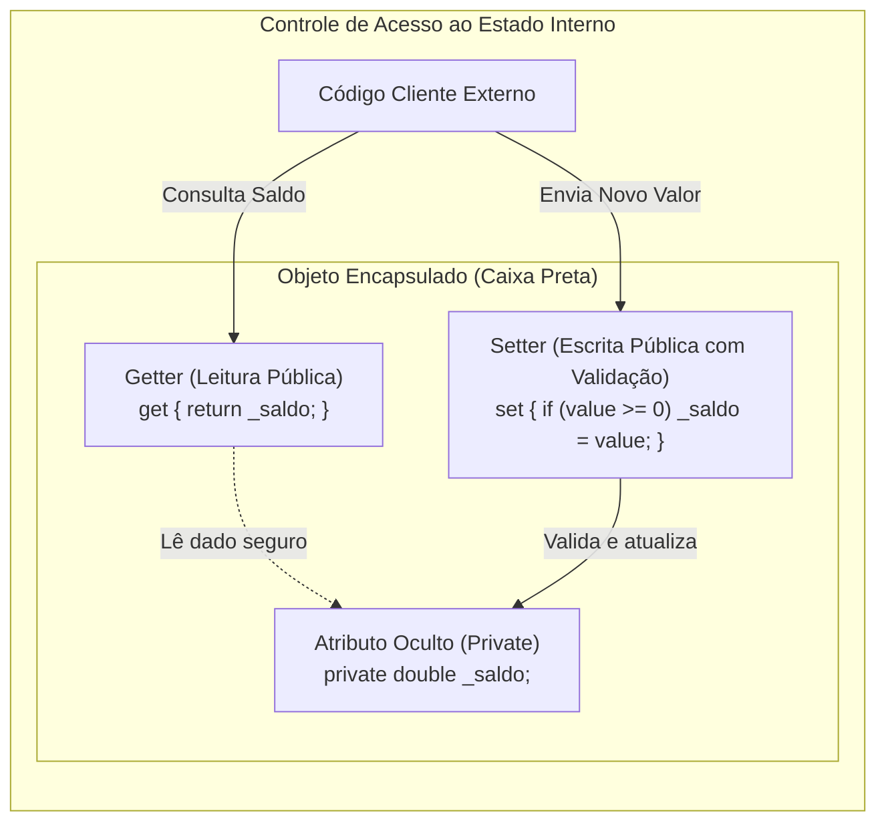
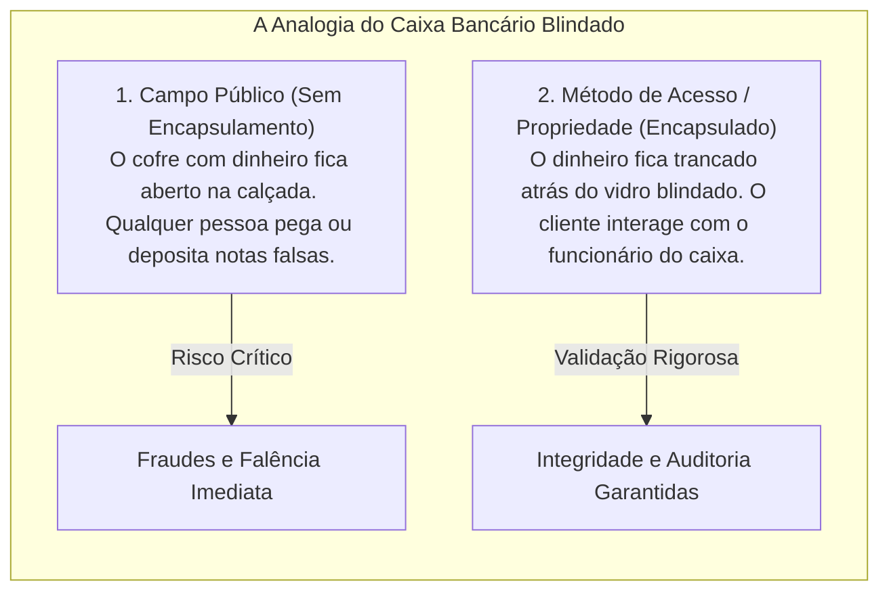
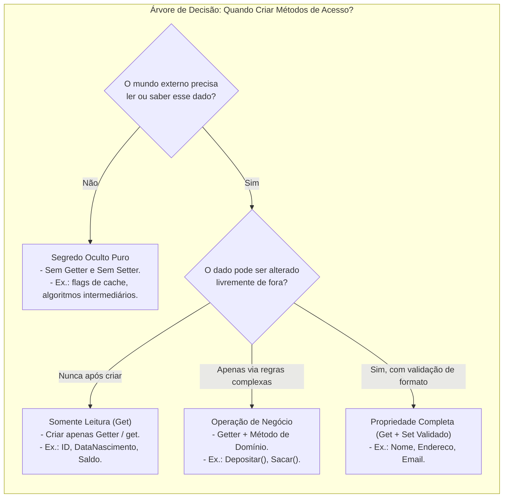
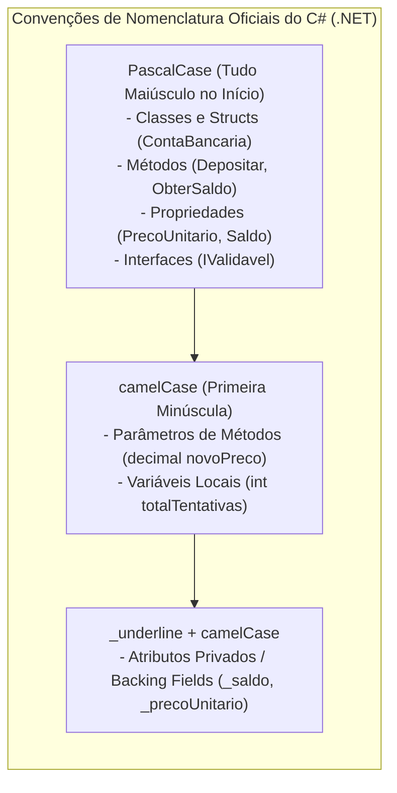

# 13. Métodos de acesso e propriedades (publicação de contratos e garantia de invariantes)

> **Contexto:** Para produzir um código correto, robusto e flexível a mudanças futuras, a regra primordial da programação modular exige **ocultar os atributos e publicar os métodos**. Este artigo aborda como projetar **métodos de acesso** (*Getters* e *Setters*) e **propriedades (*Properties*)** em C#, garantindo que o estado interno do objeto nunca seja corrompido e permaneça em total conformidade com as invariantes de negócio.

---

## 1. Por que ocultar atributos e publicar métodos?

Em sistemas orientados a objetos, a integridade dos dados depende da fronteira entre o cliente externo e a memória interna do objeto:

* **O perigo do atributo público:** Se uma classe expõe um campo diretamente (`public double Saldo;`), qualquer código cliente pode fazer `conta.Saldo = -999999;` ou corromper estruturas internas. A classe torna-se refém de código externo.
* **O papel dos métodos de acesso:** Ao tornar o atributo privado (`private double _saldo;`), a classe assume a **tutela total do seu próprio estado**. Ela publica funções e propriedades que funcionam como **filtros e fiscais de fronteira**, validando entradas antes de qualquer mutação.
* **Definições formais no glossário:**
  * [[Glossário de conceitos#31 Métodos de acesso ou getters Accessors Getters|Métodos de acesso ou getters (*Accessors / Getters*)]] — Operações públicas de somente leitura.
  * [[Glossário de conceitos#32 Métodos modificadores ou setters Mutators Setters|Métodos modificadores ou setters (*Mutators / Setters*)]] — Operações públicas de escrita com validação de invariantes.
  * [[Glossário de conceitos#34 Propriedade Property|Propriedade (*Property*)]] — Membro nativo que combina sintaxe de campo com segurança de métodos.



---

## 2. A intuição do mundo real (Técnica de Feynman): o caixa bancário blindado

Para entender por que usamos métodos de acesso e propriedades em vez de campos públicos, imagine uma agência bancária:



### Como cada elemento se comporta na analogia:
1. **O cofre trancado (`private _saldo`):** O dinheiro físico guardado no fundo do banco. Ninguém de fora tem a chave nem encosta a mão.
2. **A janela de consulta do saldo ([[Glossário de conceitos#31 Métodos de acesso ou getters Accessors Getters|Getter / get]]):** Você pergunta ao caixa: *"Qual é o meu saldo?"*. O caixa olha no sistema e informa o valor. Você leu a informação sem tocar nas cédulas.
3. **A gaveta de depósito com validação ([[Glossário de conceitos#32 Métodos modificadores ou setters Mutators Setters|Setter / set]]):** Você entrega uma nota para depósito. O caixa passa a cédula no leitor de notas falsas e confere se o valor é positivo. Se for válido, ele guarda no cofre; se for nota falsa ou valor negativo, ele rejeita a transação imediatamente com um erro (*throw exception*).

---

## 3. Quando faz sentido que um atributo tenha método de acesso (e quando NÃO faz)?

Um dos erros mais comuns de iniciantes na orientação a objetos é aplicar *Getters* e *Setters* cegamente para todos os atributos de todas as classes. Criar métodos de acesso deve ser uma **decisão consciente de engenharia de software baseada no papel do dado no sistema**:



---

### Os 4 cenários fundamentais:

#### 1. Quando faz sentido ter APENAS o `Get` (Somente Leitura):
* **Identificadores e imutabilidade:** Dados que nascem no construtor e nunca devem mudar durante toda a vida do objeto (ex.: `Id`, `Cpf`, `DataCriacao`, `NumeroConta`).
* **Valores resultantes de regras de negócio:** Informações que mudam, mas **nunca por atribuição direta do usuário** (ex.: `Saldo` de uma conta ou `NivelAcesso` de um jogador). O mundo externo pode consultar (`get`), mas a alteração só acontece através de métodos de negócio como `Depositar(valor)` ou `SubirDeNivel()`.

#### 2. Quando faz sentido ter `Get` e `Set` (Com Validação Rigorosa):
* **Atributos configuráveis do domínio:** Dados que o usuário pode atualizar livremente, mas que exigem **fiscalização de integridade** antes da gravação (ex.: `Nome` não pode ser vazio, `Preco` deve ser positivo, `Email` deve conter `@`).

#### 3. Quando NÃO faz sentido ter `Set` público:
* **Estados que possuem efeitos colaterais:** Se a alteração de um dado exige disparar outros eventos (como recomputar impostos, emitir log de auditoria ou avisar um banco de dados), **nunca exponha um `Set` público**. Use um método de ação (ex.: `conta.LiquidarFatura()`).

#### 4. Quando NÃO faz sentido ter `Get` nem `Set` (Segredos Ocultos):
* **Estruturas de apoio interno e mecânica do módulo:** Atributos que servem apenas para a engrenagem do algoritmo funcionar (ex.: contadores de tentativas de reconexão, ponteiros de nós em listas encadeadas, chaves de criptografia temporárias, buffers de bytes).
* Expor esses atributos quebra a [[11. Princípio da ocultação da informação (information hiding e encapsulamento)|Ocultação da Informação de Parnas]] e expõe a mecânica interna da caixa preta.

---

## 4. As duas abordagens de implementação no C#

Na linguagem C#, podemos implementar o controle de acesso de duas formas:

### a. Abordagem clássica por métodos convencionais (`Get` e `Set`)
É o padrão universal herdado do Java, C++ e C# clássico, onde declaramos duas funções públicas explícitas (veja o guia de sintaxe em [[00. Sintaxe Multilinguagem/07. Getters, setters e propriedades (acesso e modificação de estado)|07. Getters, setters e propriedades]]):

#### A regra fundamental de assinatura, tipos e parâmetros:
1. **O método `Get` / bloco `get` NUNCA recebe argumentos de entrada (Lista de parâmetros vazia `()`):**
   - **Por que o `Get` não tem argumentos?** A função do *Getter* é uma **consulta direta do estado existente** do próprio objeto (`_preco`, `_nome`). Como o dado já pertence à memória do objeto, ele não necessita de nenhuma informação externa adicional para ser devolvido.
   - Adicionar parâmetros a um método de leitura o descaracteriza como *Getter*, transformando-o em um método de busca ou filtragem (ex.: `BuscarPorCpf(string cpf)`).
   - O tipo de retorno do `Get` SEMPRE reflete o tipo exato do atributo consultado (`public decimal ObterPreco()`).
2. **O método `Set` é SEMPRE declarado como `void` e recebe exatamente 1 parâmetro formal:**
   - **No método clássico:** Recebe um único argumento com o novo valor a ser atribuído (`public void DefinirPreco(decimal novoPreco)`).
   - **No bloco `set` de propriedades C#:** Não declaramos parâmetros na sintaxe visual (`set { ... }`), pois a linguagem C# cria automaticamente o **parâmetro contextual implícito chamado `value`**, cujo tipo é idêntico ao tipo da propriedade.
   - **Por que o `Set` deve ser `void`? (Princípio CQS - *Command-Query Separation* de Bertrand Meyer):**
     - Uma sub-rotina deve fazer uma pergunta (*Query* $\rightarrow$ retornar dados sem alterar estado) **OU** executar um comando (*Command* $\rightarrow$ alterar estado sem retornar dados).
     - Misturar atribuição com retorno de dados gera efeitos colaterais ocultos, aumenta o acoplamento e dificulta testes unitários.
     - Quando o `Set` não consegue concluir sua tarefa devido a um valor inválido, a boa prática da engenharia de software determina **disparar uma exceção (*throw exception*)** em vez de retornar códigos de erro mágicos (`bool` ou `-1`).

```csharp
public class Produto 
{
    private decimal _preco;

    // Método Getter: Zero parâmetros de entrada -> Função de leitura pura
    public decimal ObterPreco() 
    {
        return _preco;
    }

    // Método Setter: Exatamente 1 parâmetro de entrada -> Procedimento 'void'
    public void DefinirPreco(decimal novoPreco) 
    {
        if (novoPreco < 0) 
        {
            throw new ArgumentOutOfRangeException(nameof(novoPreco), "O preço não pode ser negativo.");
        }
        _preco = novoPreco;
    }
}
```

---

### b. Abordagem idiomática do C#: propriedades completas (*Full Properties*)
O C# fornece suporte nativo a propriedades, que unem a semântica visual elegante de um campo à segurança rigorosa de métodos:

```csharp
public class Produto 
{
    private decimal _preco; // Atributo de suporte (backing field)

    public decimal Preco 
    {
        get // Bloco get: Sem parâmetros -> devolve _preco
        {
            return _preco;
        }
        set // Bloco set: Recebe o parâmetro implícito 'value' do tipo decimal
        {
            if (value < 0) 
            {
                throw new ArgumentOutOfRangeException(nameof(value), "O preço não pode ser negativo.");
            }
            _preco = value; // 'value' é a palavra-chave que representa o dado enviado
        }
    }
}
```

* **Uso pelo cliente:** O código cliente utiliza sintaxe limpa de atribuição (`p.Preco = 150.00m;`), mas o compilador injeta `150.00m` na variável mágica `value` e executa a rotina `set` com toda a validação!

---

## 5. Tipos e variações de propriedades no C#

O ecossistema C# oferece suporte a diferentes níveis de sofisticação para atender a requisitos variados de design:

### a. Propriedades autoimplementadas (*Auto-Implemented Properties*)
Quando um atributo não exige validação complexa imediata, mas você deseja manter o encapsulamento preservado para o futuro:

```csharp
public class Cliente 
{
    // O compilador cria internamente o backing field privado anônimo
    public string Nome { get; set; }
    public string Email { get; set; }
}
```

---

### b. Propriedades somente leitura (*Read-Only Properties*)
Fundamentais para garantir imutabilidade de identificadores e atributos que não devem sofrer alteração após o construtor:

```csharp
public class ContaCorrente 
{
    public string Numero { get; } // Apenas get; definido exclusivamente no construtor
    public DateTime DataAbertura { get; }

    public ContaCorrente(string numero) 
    {
        Numero = numero;
        DataAbertura = DateTime.Now;
    }
}
```

---

### c. O acessador `init` (Imutabilidade pós-inicialização - C# 9+)

Historicamente, para criar um objeto imutável, éramos obrigados a criar propriedades com apenas `get` e passar todos os 10 ou 15 parâmetros dentro de um construtor gigante. O C# 9 introduziu o **acessador `init`** (*Init-Only Setters*):

* **O que faz:** O `init` permite que a propriedade seja atribuída **apenas durante a construção do objeto** (seja no construtor ou via *Object Initializer* `{ Propriedade = valor }`). Após a conclusão da instanciação, a propriedade torna-se **completamente imutável** (como se fosse *read-only*).
* **Vantagem de engenharia:** Permite a sintaxe fluida e legível de inicializadores de objeto sem poluir a classe com dezenas de sobrecargas de construtores, preservando 100% da segurança contra mutações indesejadas.

```csharp
public class ConfiguracaoServidor 
{
    // Pode ser definido na criação do objeto, mas nunca mais alterado!
    public string Host { get; init; }
    public int Porta { get; init; }
    public bool UsarSsl { get; init; } = true;
}

// Código cliente (Object Initializer fluido):
var config = new ConfiguracaoServidor 
{
    Host = "api.banco.com",
    Porta = 443
};

// config.Porta = 8080; // ERRO DE COMPILAÇÃO CS8852: A propriedade 'init' só pode ser atribuída durante a inicialização!
```

#### Quando USAR o acessador `init` na prática?
1. **Objetos de Transferência de Dados (DTOs / *Data Transfer Objects*):**
   - Classes que recebem dados de requisições HTTP (APIs REST) ou deserializam JSON do banco de dados. Os dados são preenchidos na criação e nunca mais devem ser modificados durante o processamento.
2. **Objetos de Valor (*Value Objects* no DDD):**
   - Entidades definidas exclusivamente pelos seus valores (como `Endereco`, `Moeda`, `CoordenadaGPS`). Se o endereço mudar, você instancia um novo objeto em vez de alterar as propriedades do antigo.
3. **Classes de Configuração do Sistema (*Options Pattern*):**
   - Parâmetros lidos no *startup* da aplicação (como strings de conexão, timeouts de API, chaves de criptografia) que não devem sofrer mutações acidentais em tempo de execução.
4. **Quando você quer evitar *Construtores Telescópicos*:**
   - Evita criar construtores com 10 combinações de parâmetros opcionais, permitindo ao código cliente escolher quais propriedades deseja inicializar de forma explícita e autoexplicativa.

#### Quando NÃO usar o `init`?
* **Entidades que sofrem mutação contínua de estado:** Não use `init` para o `Saldo` de uma conta bancária ou o `Status` de um pedido, pois esses dados precisam ser alterados ao longo do ciclo de vida da aplicação (use `private set` com métodos de domínio).

---

### d. Propriedades calculadas (*Computed / Expression-Bodied Properties*)
Propriedades que não possuem atributo de suporte (*backing field*) e são calculadas dinamicamente sob demanda a cada leitura:

```csharp
public class Retangulo 
{
    public double Largura { get; set; }
    public double Altura { get; set; }

    // Propriedade calculada em tempo real via expressão lambda (=>)
    public double Area => Largura * Altura;
    public double Perimetro => 2 * (Largura + Altura);
}
```

---

### e. Propriedades com visibilidade assimétrica
Permite que o mundo externo apenas consulte o dado (`public get`), enquanto apenas a própria classe ou subclasses possam alterá-lo (`private set` ou `protected set`):

```csharp
public class Pedido 
{
    public decimal Total { get; private set; }

    public void AdicionarItem(decimal precoItem) 
    {
        if (precoItem <= 0) throw new ArgumentException("Preço inválido.");
        Total += precoItem; // A própria classe altera o Total
    }
}
```

---

### f. Métodos e propriedades de classe DEVEM ser `static` (*Class-Level vs. Instance-Level*)

Um dos conceitos mais importantes de arquitetura em POO é a separação entre **membros de instância** e **membros de classe**:

* **Membros de instância (o padrão sem `static`):** Pertencem ao **objeto individual**. Cada objeto alocado no *Heap* possui sua própria cópia dos dados (ex.: o saldo da sua conta é diferente do saldo da conta de outra pessoa).
* **Membros de classe (obrigatoriamente `static`):** Pertencem à **classe como um todo**, compartilhados globalmente entre todas as instâncias ou acessados sem necessidade de instanciar nenhum objeto (veja [[09. Atributos estáticos e propriedades (compartilhamento de estado e encapsulamento)|Artigo 09: Atributos estáticos e propriedades]]).

#### Por que métodos e propriedades de classe DEVEM ser `static`?
1. **Manipulação de estado global compartilhado:** Se você possui um atributo estático privado (como um contador total de contas criadas ou uma taxa Selic global), os métodos e propriedades de acesso que o manipulam **devem ser declarados como `static`**:
   - Um método não estático (*de instância*) exige criar um objeto com `new` para ser chamado. Não faz sentido instanciar um objeto na memória apenas para consultar uma taxa do banco!
2. **Métodos utilitários e funções matemáticas puras:** Métodos que operam exclusivamente com base nos parâmetros que recebem (sem depender de nenhum atributo interno de um objeto) devem ser `static` (ex.: `Math.Sqrt(x)`, `Convert.ToInt32(s)`, `DateTime.UtcNow`).
3. **Padrão de invocação direta:** Métodos estáticos são chamados diretamente pelo **Nome da Classe** (`Conta.ObterTotalContas()`), economizando memória RAM ao evitar instanciações desnecessárias.

```csharp
public class ContaBancaria 
{
    // Atributo de classe (compartilhado por todas as contas)
    private static int _contadorGeralContas = 0;
    private static decimal _taxaRendimentoPadrao = 0.005m;

    // Propriedade de classe (static): Acessada via ContaBancaria.TaxaRendimento
    public static decimal TaxaRendimento 
    {
        get => _taxaRendimentoPadrao;
        set 
        {
            if (value < 0) throw new ArgumentOutOfRangeException(nameof(value), "Taxa não pode ser negativa.");
            _taxaRendimentoPadrao = value;
        }
    }

    // Método de acesso de classe (static): Consulta o total geral
    public static int ObterTotalContasCriadas() 
    {
        return _contadorGeralContas;
    }

    // Atributo de instância (individual de cada conta)
    private decimal _saldo;

    public ContaBancaria(decimal saldoInicial) 
    {
        _saldo = saldoInicial;
        _contadorGeralContas++; // Incrementa o estado global da classe
    }
}

// Uso pelo cliente:
ContaBancaria.TaxaRendimento = 0.01m; // Altera para todo mundo
Console.WriteLine($"Total de contas: {ContaBancaria.ObterTotalContasCriadas()}"); // Não precisa de 'new'!
```

---

## 6. Convenções de nomenclatura no C#: `PascalCase` vs. `camelCase` vs. `_underline`

Para garantir legibilidade instantânea e consistência em projetos profissionais, a Microsoft estabeleceu convenções rígidas de capitalização para cada tipo de identificador (consulte também [[Glossário de conceitos#33 Convenções de nomenclatura Naming Conventions camelCase e PascalCase|Convenções de nomenclatura no glossário]]):



### Quadro comparativo de estilos no C#:

| Elemento no código C# | Convenção adotada | Exemplo de código | Regra mnemônica |
| :--- | :--- | :--- | :--- |
| **Classes / Tipos** | `PascalCase` | `public class GerenciadorEstoque` | Primeira letra de cada palavra em maiúscula. |
| **Métodos e Funções** | `PascalCase` | `public void AtualizarSaldo(...)` | Verbo em ação com iniciais maiúsculas. |
| **Propriedades** | `PascalCase` | `public decimal PrecoTotal { get; }` | Substantivo com iniciais maiúsculas. |
| **Parâmetros de Métodos** | `camelCase` | `(decimal valorDeposito, int parcelas)` | Começa em minúscula; palavras seguintes em maiúscula. |
| **Variáveis Locais** | `camelCase` | `decimal impostoCalculado = 15.5m;` | Começa em minúscula; palavras seguintes em maiúscula. |
| **Atributos Privados** | `_camelCase` | `private decimal _saldoAtual;` | Prefixo `_` seguido de letra minúscula. |
| **Constantes** | `PascalCase` | `public const double TaxaFixa = 0.05;` | Em C#, constantes usam PascalCase (diferente de Java/C). |

---

## 7. Matriz comparativa: campos vs. métodos vs. propriedades

| Característica | Campo público (`public int X;`) | Métodos `GetX()` / `SetX()` | Propriedades C# (`public int X { get; set; }`) |
| :--- | :--- | :--- | :--- |
| **Proteção de invariantes** | Nenhuma (perigoso) | Total (via validação em código) | Total (via bloco `set`) |
| **Sintaxe de uso** | Direta (`obj.X = 10;`) | Chamada de função (`obj.SetX(10);`) | Direta e elegante (`obj.X = 10;`) |
| **Imutabilidade simples** | Apenas com `readonly` | Omitir o método `Set` | `public int X { get; }` |
| **Cálculo dinâmico** | Não suporta | Sim (retorno da função) | Sim (`public int X => calc();`) |
| **Padrão na indústria C#** | Proibido em atributos | Legado / Casos específicos | **Padrão absoluto e recomendado** |

---

## 8. Exemplos atômicos por conceito (C#)

### a. Validação rigorosa no `set` protegendo invariante

Demonstração isolada de como o `set` bloqueia estados inválidos:

```csharp
public class NotaFiscal 
{
    private decimal _aliquotaImposto;

    public decimal AliquotaImposto 
    {
        get => _aliquotaImposto;
        set 
        {
            if (value < 0 || value > 100) 
            {
                throw new ArgumentOutOfRangeException(nameof(value), "Alíquota deve estar entre 0% e 100%.");
            }
            _aliquotaImposto = value;
        }
    }
}
```

---

### b. Propriedade com `private set` (mutação restrita a métodos de negócio)

Demonstração isolada de como proteger o ciclo de vida de um objeto:

```csharp
public class Fatura 
{
    public bool EstaPaga { get; private set; }
    public DateTime? DataPagamento { get; private set; }

    public void Liquidar() 
    {
        if (EstaPaga) throw new InvalidOperationException("A fatura já foi paga anteriormente.");
        EstaPaga = true;
        DataPagamento = DateTime.UtcNow;
    }
}
```

---

## 9. Exemplo completo integrado (C#)

Abaixo está um programa executável completo demonstrando o uso profissional de métodos de acesso, propriedades completas com validação de invariantes, propriedades autoimplementadas, somente leitura e calculadas em um **Sistema de Gestão de Estoque de Produtos**:

```csharp
using System;
using System.Globalization;

namespace ProgramacaoModular.MetodosDeAcessoEPropriedades 
{
    /// <summary>
    /// Representa um produto no estoque com controle rigoroso de invariantes.
    /// </summary>
    public class Produto 
    {
        // 1. Propriedade somente leitura (definida no construtor)
        public string Codigo { get; }

        // 2. Propriedade autoimplementada comum
        public string Nome { get; set; }

        // 3. Atributos privados de suporte (backing fields)
        private decimal _precoUnitario;
        private int _quantidadeEmEstoque;

        // 4. Propriedade completa com validação de preço
        public decimal PrecoUnitario 
        {
            get => _precoUnitario;
            set 
            {
                if (value <= 0) 
                {
                    throw new ArgumentOutOfRangeException(nameof(value), "O preço unitário deve ser maior que zero.");
                }
                _precoUnitario = value;
            }
        }

        // 5. Propriedade com get público e set privado (alteração apenas via métodos de negócio)
        public int QuantidadeEmEstoque 
        {
            get => _quantidadeEmEstoque;
            private set 
            {
                if (value < 0) 
                {
                    throw new InvalidOperationException("O estoque não pode ficar negativo.");
                }
                _quantidadeEmEstoque = value;
            }
        }

        // 6. Propriedade calculada dinamicamente sob demanda
        public decimal ValorTotalEmEstoque => PrecoUnitario * QuantidadeEmEstoque;

        public Produto(string codigo, string nome, decimal precoInicial, int quantidadeInicial) 
        {
            if (string.IsNullOrWhiteSpace(codigo)) throw new ArgumentException("Código inválido.");
            if (string.IsNullOrWhiteSpace(nome)) throw new ArgumentException("Nome inválido.");

            Codigo = codigo;
            Nome = nome;
            PrecoUnitario = precoInicial; // Aciona o setter com validação
            QuantidadeEmEstoque = quantidadeInicial; // Aciona o setter privado
        }

        // Métodos de negócio que manipulam o estado seguro:
        public void AdicionarEstoque(int quantidade) 
        {
            if (quantidade <= 0) throw new ArgumentException("A quantidade adicionada deve ser positiva.");
            QuantidadeEmEstoque += quantidade;
        }

        public bool RemoverEstoque(int quantidade) 
        {
            if (quantidade <= 0 || quantidade > QuantidadeEmEstoque) 
            {
                return false;
            }
            QuantidadeEmEstoque -= quantidade;
            return true;
        }

        public void ExibirResumo() 
        {
            Console.WriteLine($"[PRODUTO {Codigo}] {Nome}");
            Console.WriteLine($"Preço Unitário: {PrecoUnitario.ToString("C", CultureInfo.CurrentCulture)}");
            Console.WriteLine($"Quantidade em Estoque: {QuantidadeEmEstoque} unidades");
            Console.WriteLine($"Valor Total Imobilizado: {ValorTotalEmEstoque.ToString("C", CultureInfo.CurrentCulture)}");
            Console.WriteLine(new string('-', 40));
        }
    }

    class Program 
    {
        static void Main() 
        {
            Console.WriteLine("=== Demonstração de Métodos de Acesso e Propriedades ===");

            Produto p1 = new Produto("PRD-001", "Monitor Gamer 27'", 1850.00m, 10);
            p1.ExibirResumo();

            // Atualizando preço via setter seguro:
            p1.PrecoUnitario = 1799.90m;
            p1.AdicionarEstoque(5);

            Console.WriteLine("Após reajuste de preço e entrada de mercadorias:");
            p1.ExibirResumo();

            // Tentativa de venda:
            bool vendaOk = p1.RemoverEstoque(12);
            Console.WriteLine($"Venda de 12 unidades autorizada? {vendaOk}");
            p1.ExibirResumo();

            // Cenários bloqueados pelo compilador e runtime:
            // p1.Codigo = "NOVO-COD"; // ERRO DE COMPILAÇÃO: 'Codigo' é somente leitura!
            // p1.QuantidadeEmEstoque = -5; // ERRO DE COMPILAÇÃO: 'set' é privado!
            // p1.PrecoUnitario = -100m; // EXCEÇÃO EM RUNTIME: ArgumentOutOfRangeException disparada pelo setter!
        }
    }
}
```

---

## 10. Boas práticas de projeto com métodos de acesso

1. **Aplique rigorosamente o Princípio DRY (*Don't Repeat Yourself*):**
   - Formulado por Andy Hunt e Dave Thomas (veja [[Glossário de conceitos#35 Princípio DRY Don t Repeat Yourself|Princípio DRY no glossário]]), o princípio dita que cada regra deve existir em um **único lugar definitivo**.
   - **Exemplo com propriedades:** Em vez de repetir a checagem `if (preco <= 0)` dentro do construtor e dentro de 3 métodos diferentes, concentre a regra **exclusivamente dentro do `set` da propriedade** e faça o construtor delegar a atribuição para a propriedade:
     ```csharp
     // Código DRY elegante: o construtor aciona o setter que centraliza a validação!
     public Produto(string nome, decimal preco) 
     {
         Nome = nome;
         Preco = preco; // Aciona o set validado centralizado (DRY puro!)
     }
     ```
2. **Evite *Getters* e *Setters* que apenas expõem tudo sem critério:**
   - Se todos os atributos de uma classe possuem `get` e `set` públicos irrestritos, a classe vira um mero saco de dados (*Anemic Domain Model*) sem verdadeiro encapsulamento.
3. **Prefira métodos de domínio a *Setters* genéricos:**
   - Em vez de fazer `conta.Saldo = conta.Saldo + 100;`, forneça o método de negócio `conta.Depositar(100);`.
4. **Propriedades calculadas não devem conter processamento pesado:**
   - Como propriedades são lidas com a sintaxe de variáveis (`p.ValorTotal`), os clientes esperam que a leitura seja instantânea ($O(1)$). Se uma operação envolve ler arquivos do disco ou fazer consultas em banco de dados, declare como um **método explícito** (ex.: `p.CalcularTotalDoBanco()`).

---

## Referências bibliográficas

### Bibliografia básica
* MICROSOFT. **Propriedades (Guia de Programação em C#)**. Microsoft Learn, 2023. Disponível em: [https://learn.microsoft.com/pt-br/dotnet/csharp/programming-guide/classes-and-structs/properties](https://learn.microsoft.com/pt-br/dotnet/csharp/programming-guide/classes-and-structs/properties).
* MICROSOFT. **Propriedades Autoimplementadas (Guia de Programação em C#)**. Microsoft Learn, 2023. Disponível em: [https://learn.microsoft.com/pt-br/dotnet/csharp/programming-guide/classes-and-structs/auto-implemented-properties](https://learn.microsoft.com/pt-br/dotnet/csharp/programming-guide/classes-and-structs/auto-implemented-properties).
* MARTIN, Robert C. **Código Limpo: Habilidades Práticas do Agile Software**. Rio de Janeiro: Alta Books, 2011.
* SOMMERVILLE, Ian. **Engenharia de Software**. 10. ed. São Paulo: Pearson, 2019.

### Bibliografia complementar
* DE PAULA, Hugo. **Programação Modular: Exemplos de Encapsulamento em C#**. GitHub, 2023. Disponível em: [https://github.com/hugodepaula/programacao-modular-ead/tree/main/exemplos/3_Encapsulamento](https://github.com/hugodepaula/programacao-modular-ead/tree/main/exemplos/3_Encapsulamento).
* SEBESTA, Robert W. **Conceitos de Linguagens de Programação**. 11. ed. Porto Alegre: Bookman, 2018.

---

## Artigos relacionados e navegação

* **Artigo anterior:** [[12. Modificadores de acesso (visibilidade e níveis de proteção no encapsulamento)]]
* **Resumo da disciplina:** [[00. Programação modular - Resumo]]
* **Glossário da disciplina:** [[Glossário de conceitos]]
* **Guia de sintaxe multilinguagem (Getters, setters e propriedades):** [[00. Sintaxe Multilinguagem/07. Getters, setters e propriedades (acesso e modificação de estado)]]
* **Ver Atributos e Métodos:** [[07. Atributos e métodos (classes, objetos e definição de membros)]]
* **Ver Atributos Estáticos e Propriedades:** [[09. Atributos estáticos e propriedades (compartilhamento de estado e encapsulamento)]]
* **Índice geral do vault:** [[index.md|Página inicial do vault]]
