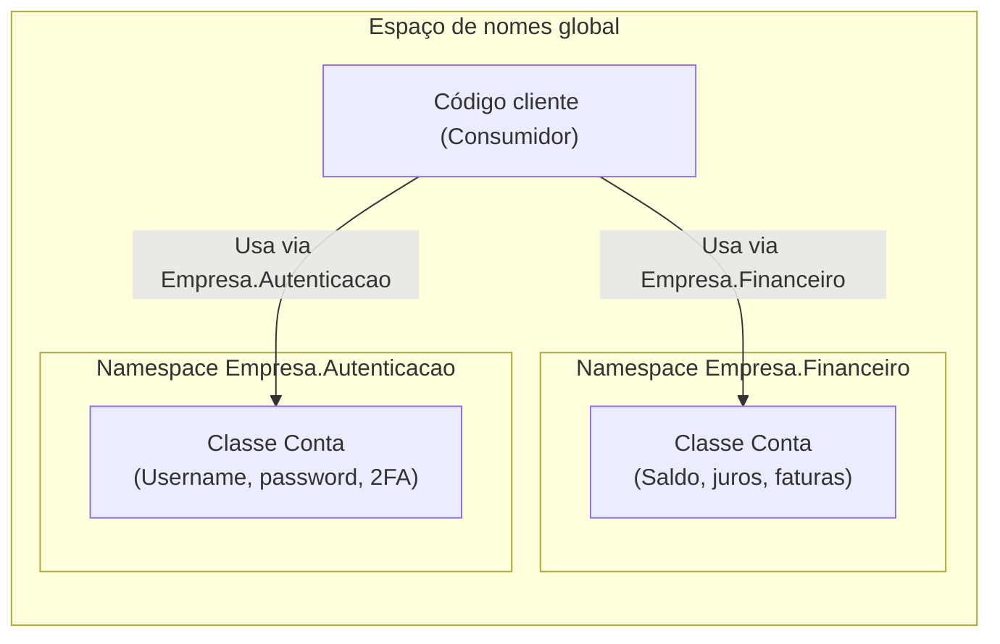
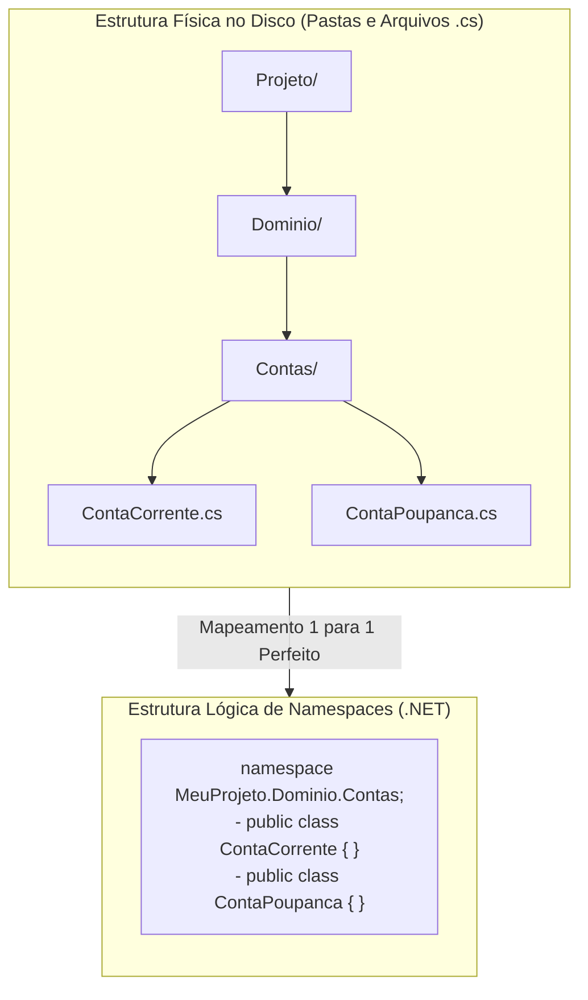
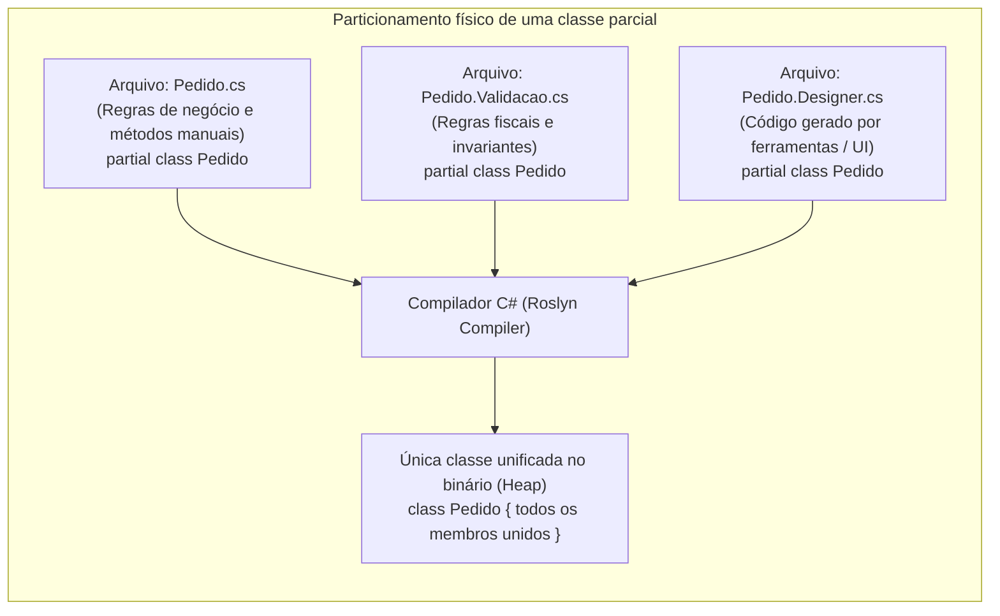

# 14. Namespaces e partial classes (espaços de nomes e modularização em larga escala)

> **Contexto:** Na programação orientada a objetos clássica, a unidade lógica básica de modularização é a **classe**, normalmente definida em um único arquivo físico. Contudo, em sistemas corporativos de grande porte (*large-scale software*), precisamos de unidades organizacionais de nível superior para evitar colisões de nomes e de mecanismos para particionar classes volumosas geradas por ferramentas ou desenvolvidas colaborativamente por múltiplos engenheiros. Este artigo aborda o uso profissional de **namespaces (*espaços de nomes*)** e **classes parciais (*partial classes*)** no C#.

---

## 1. O que são namespaces e por que precisamos deles? (Técnica de Feynman)

Imagine uma **cidade cosmopolita com milhões de habitantes**:

* Se dissermos apenas o nome *"Lucas"*, haverá milhares de pessoas com esse mesmo nome, gerando uma confusão caótica (**conflito de nomes / ambiguidade**).
* Para resolver isso no mundo real, usamos o **endereço completo**: *"Lucas, morador do Brasil, Estado de Minas Gerais, Cidade de Belo Horizonte, Bairro Savassi"*.
* Na programação, o **Namespace (*Espaço de Nomes*)** é exatamente esse **sistema hierárquico de endereçamento e compartimentalização lógica**:



### Na Ciência da Computação:
1. **Unidade lógica superior à classe:** Um *namespace* agrupa classes, interfaces, estruturas e enumerações correlacionadas sob um escopo nomeado unificado.
2. **Prevenção de colisões de identificadores (*Name Collisions*):** Permite que duas bibliotecas ou subsistemas diferentes criem uma classe chamada `Button`, `Cliente` ou `Conta` sem que o compilador entre em conflito de duplicidade.
3. **Mapeamento lógico vs. físico:** Um namespace no C# **não precisa coincidir obrigatoriamente com o nome da pasta física no disco**, embora seja uma convenção de arquitetura altamente recomendada manter as pastas alinhadas aos namespaces.

#### Como o namespace diferencia o escopo de duas classes com o mesmo nome? (Precisa ser `private`?)

Uma dúvida muito comum de quem está aprendendo: *"Se existirem duas classes chamadas `Conta`, eu preciso torná-las `private` para o compilador não reclamar?"*

A resposta é **NÃO! Ambas as classes podem (e geralmente devem) ser `public`**!

1. **O nome real para o compilador é o nome qualificado completo (*Fully Qualified Name*):**
   - Para nós, humanos, ambas se chamam apenas `Conta`.
   - Para o compilador, o nome oficial e único registrado na tabela de símbolos é o **caminho hierárquico absoluto**:
     - Classe A: `Empresa.Financeiro.Conta`
     - Classe B: `Empresa.Autenticacao.Conta`
   - Como os nomes completos são totalmente distintos, **não existe nenhum conflito de escopo**, mesmo que ambas sejam públicas e estejam no mesmo projeto compilado!
2. **Regra de sintaxe fundamental: classes de nível de namespace NÃO podem ser `private`:**
   - No C#, uma classe declarada diretamente dentro de um namespace só pode ser **`public`** (visível para qualquer projeto que referencie a DLL) ou **`internal`** (visível apenas dentro do mesmo assembly/projeto).
   - O modificador `private` só é permitido em **classes aninhadas** (*Nested Classes*, declaradas dentro de outra classe). Se você tentar escrever `private class Conta` direto no namespace, o compilador emitirá o erro `CS1527: Elementos definidos em um namespace não podem ser declarados explicitamente como private`.

#### Qual é a diferença entre um Namespace e uma DLL (*Dynamic Link Library*)?

É muito comum confundir esses dois conceitos fundamentais de modularização (veja [[Glossário de conceitos#41 Biblioteca de vínculo dinâmico Dynamic Link Library DLL Assembly|DLL no glossário]]):

* **Namespace (Fronteira Lógica):** Existe apenas no **código-fonte** para que os programadores e o compilador organizem classes e evitem ambiguidades de nomes. É como criar **pastas conceituais** dentro do código.
* **DLL / Assembly (Fronteira Física / Binária):** É o **arquivo compilado real no disco (`.dll`)**. Uma DLL é uma biblioteca de vínculo dinâmico que pode conter dezenas de namespaces diferentes compilados juntos em código intermediário (IL), permitindo que múltiplos programas executáveis (`.exe`) carregem e reutilizem essas classes na memória sem recompilar tudo.

---

## 2. A sintaxe de namespaces no C#: tradicional vs. *File-Scoped Namespaces* (C# 10+)

A evolução do ecossistema .NET introduziu duas formas de estruturação de espaços de nomes:

### a. Sintaxe tradicional em bloco (com chaves `{ }`)
Utilizada desde o C# 1.0, envolve o código da classe dentro de um bloco delimitador:

```csharp
namespace Banco.Dominio.Contas 
{
    public class ContaCorrente 
    {
        public string Numero { get; init; }
    }
}
```

---

### b. Sintaxe moderna de escopo de arquivo (*File-Scoped Namespaces* - C# 10+)
Reduz o nível de indentação e elimina chaves desnecessárias, aplicando o namespace a **todas as declarações do arquivo `.cs`**:

```csharp
namespace Banco.Dominio.Contas; // Ponto e vírgula no topo do arquivo (Zero indentação inútil!)

public class ContaCorrente 
{
    public string Numero { get; init; }
}
```

---

## 3. A regra de ouro da organização: uma classe por arquivo e alinhamento com pastas

Na engenharia de software profissional com C# e Java, a arquitetura de projetos segue uma convenção rigorosa conhecida como **"Um tipo/classe por arquivo" (*One Class per File*)**:



### Por que organizar cada classe em seu próprio arquivo?

1. **Localização instantânea no projeto (*Mental Mapping*):**
   - Se você precisa consertar um bug na classe `ContaCorrente`, você não precisa buscar dentro de um arquivo gigante com 10 classes misturadas. Você simplesmente abre o arquivo `ContaCorrente.cs` dentro da pasta `Dominio/Contas/`.
2. **Histórico limpo e resolução de conflitos no Git (*Version Control*):**
   - Quando 10 classes ficam no mesmo arquivo, qualquer desenvolvedor que mexer em qualquer uma delas alterará o mesmo arquivo físico, causando conflitos constantes de *merge*. Com arquivos isolados, cada programador trabalha em seu arquivo de forma autônoma.
### Estratégias para agrupar classes em pastas e namespaces:

Ao criar pastas para agrupar dezenas de classes, a arquitetura de software adota duas abordagens fundamentais:

#### A. Agrupamento por funcionalidade / domínio (*Package by Feature / Vertical Slices* - Recomendado):
As pastas agrupam tudo o que diz respeito a um contexto de negócio unificado:
```text
Projeto/
├── Clientes/
│   ├── Cliente.cs
│   ├── Endereco.cs
│   ├── IClienteRepositorio.cs
│   └── ClienteServico.cs              --> namespace MeuApp.Clientes;
├── Pagamentos/
│   ├── Fatura.cs
│   ├── CartaoCredito.cs
│   └── ProcessadorPagamento.cs        --> namespace MeuApp.Pagamentos;
└── Relatorios/
    └── GeradorExtratoPdf.cs           --> namespace MeuApp.Relatorios;
```
* **Vantagem:** Alta coesão. Tudo o que precisa mudar junto fica dentro da mesma pasta.

#### B. Agrupamento por camada técnica (*Package by Layer / Horizontal*):
As pastas agrupam arquivos pelo papel técnico/arquitetural que desempenham:
```text
Projeto/
├── Models/             --> namespace MeuApp.Models;
│   ├── Cliente.cs
│   └── Fatura.cs
├── Services/           --> namespace MeuApp.Services;
│   └── PagamentoServico.cs
└── Repositories/       --> namespace MeuApp.Repositories;
    └── ClienteRepository.cs
```

#### Comportamento automático de IDEs (Visual Studio / Rider / VS Code):
* Quando você cria uma subpasta (ex.: botão direito na pasta `Dominio/Contas` → *Add New Class `ContaCorrente`*), a IDE **gera automaticamente o namespace correspondente à estrutura da pasta**: `namespace MeuProjeto.Dominio.Contas;`.
* Se você mover um arquivo `.cs` de uma pasta para outra, as IDEs modernas sugerem sincronizar e refatorar o namespace automaticamente no projeto inteiro.

---

## 4. A importância da diretiva `using`, apelidos (*Aliases*) e resolução de ambiguidades

A diretiva **`using`** desempenha um papel fundamental na ergonomia, legibilidade e manutenibilidade do código quando trabalhamos com sistemas divididos em múltiplos namespaces:

### Por que a diretiva `using` é tão importante?

1. **Eliminação do ruído sintático extremo (*Syntactic Noise*):**
   - Sem a diretiva `using`, você seria obrigado a digitar o nome qualificado completo (*Fully Qualified Name*) em cada declaração de variável, instanciação ou parâmetro.
   - **Código SEM using (Verboso e Ilegível):**
     ```csharp
     Enterprise.Logistica.Estoque.Mercadoria item = new Enterprise.Logistica.Estoque.Mercadoria("SKU-1", "Teclado", 150m, 5);
     Enterprise.Logistica.Estoque.Processadores.AuditorEstoque auditor = new Enterprise.Logistica.Estoque.Processadores.AuditorEstoque();
     ```
   - **Código COM using (Limpo e Direto):**
     ```csharp
     using Enterprise.Logistica.Estoque;
     using Enterprise.Logistica.Estoque.Processadores;

     Mercadoria item = new Mercadoria("SKU-1", "Teclado", 150m, 5);
     AuditorEstoque auditor = new AuditorEstoque();
     ```
2. **Manutenibilidade e refatoração centralizada:**
   - Se a estrutura de namespaces de uma biblioteca externa mudar, você só precisa atualizar a linha da diretiva `using` no topo do arquivo, em vez de alterar 50 linhas de código espalhadas pelo método.
3. **Importação seletiva de contratos:**
   - A diretiva `using` comunica explicitamente a qualquer desenvolvedor que ler o arquivo quais subsistemas e dependências externas aquela classe consome (ex.: `using System.IO;` indica manipulação de arquivos no disco; `using System.Net.Http;` indica chamadas de rede).

---

### Resolução de colisões de nomes homônimos via Apelidos (*Type Aliasing*):
Quando importamos dois namespaces que contêm classes públicas com o mesmo nome (como `Empresa.Financeiro.Conta` e `Empresa.Autenticacao.Conta`), o compilador gera o erro `CS0104: 'Conta' é uma referência ambígua entre...`. A diretiva `using` resolve isso com extrema elegância através de **aliases explícitos**:

```csharp
using System;
// Apelidos semânticos que desfazem qualquer ambiguidade:
using ContaBancaria = Empresa.Financeiro.Conta;
using ContaUsuario = Empresa.Autenticacao.Conta;

public class GerenciadorSistema 
{
    public void Executar() 
    {
        ContaBancaria fin = new ContaBancaria(); // Instancia Empresa.Financeiro.Conta
        ContaUsuario auth = new ContaUsuario();   // Instancia Empresa.Autenticacao.Conta
    }
}
```

---

### `global using` e `using static` no C# moderno:
* **`global using` (C# 10+):** Permite declarar um namespace em um único arquivo central (`Usings.cs`) e torná-lo disponível automaticamente em todos os arquivos `.cs` do projeto (ex.: `global using System;`, `global using System.Collections.Generic;`).
* **`using static`:** Importa os membros estáticos de uma classe diretamente para o escopo local, permitindo escrever `WriteLine(...)` em vez de `Console.WriteLine(...)` ou `Sqrt(...)` em vez de `Math.Sqrt(...)`.

---

## 5. O que são classes parciais (*Partial Classes*)?

Por padrão, a definição de uma classe é restrita a um único arquivo de código-fonte (`.cs`). Contudo, o modificador **`partial`** permite **dividir a declaração de uma única classe, estrutura ou interface em múltiplos arquivos físicos separados dentro do mesmo projeto e namespace**.



### Como o compilador enxerga a classe parcial:
Durante o processo de compilação (*build time*), o compilador do C# (Roslyn) recolhe todas as partes marcadas com `partial` que compartilham o mesmo nome e namespace e as **funde em um único tipo binário (IL) indivisível**.

---

## 6. Quando usar e quais os benefícios reais de `partial classes`?

As classes parciais foram introduzidas para resolver desafios concretos da engenharia de software em larga escala:

### 1. Separação de código gerado automaticamente vs. código escrito à mão (*Code Generators*):
* Ferramentas de interface gráfica (WPF, WinForms), mapeadores de banco de dados (Entity Framework) e geradores de código (*Source Generators*) geram centenas de linhas de código estrutural burocrático (como `InitializeComponent()`).
* Se você editar um arquivo gerado automaticamente, a ferramenta **sobrescreverá suas alterações** na próxima compilação.
* Com `partial class`, a ferramenta grava o código em `Formulario.Designer.cs`, enquanto você escreve sua lógica com segurança em `Formulario.cs`.

### 2. Desenvolvimento colaborativo em larga escala (*Multiple Developers*):
* Múltiplos desenvolvedores podem trabalhar em aspectos distintos de uma entidade volumosa (como métodos de cálculo fiscal em um arquivo e integração bancária em outro) sem causar conflitos severos de fusão (*merge conflicts*) no Git.

### 3. Organização de classes com múltiplas responsabilidades de suporte:
* Permite segmentar métodos utilitários, validações complexas e manipuladores de eventos em arquivos satélites (`Cliente.cs`, `Cliente.Validacoes.cs`, `Cliente.Eventos.cs`).

---

## 7. Regras fundamentais para o uso de `partial classes`

Para que o compilador faça a fusão das partes sem erros, as seguintes regras são obrigatórias:

1. **O modificador `partial` deve estar presente em TODAS as partes:** Se uma parte esquecer a palavra-chave `partial`, o compilador acusará erro de duplicidade de tipo.
2. **Mesmo namespace e mesmo assembly (projeto):** Todas as frações da classe devem pertencer ao mesmo espaço de nomes e ser compiladas no mesmo projeto.
3. **Mesmo nível de acessibilidade (`public`, `internal`, `private`):** Se uma parte for declarada `public`, todas as outras partes devem ser `public`.
4. **Modificadores combinados:** Se uma parte for `abstract` ou `sealed`, a classe unificada final herdará essa característica como um todo.

---

## 8. Métodos parciais (*Partial Methods*)

O C# também permite declarar **Métodos Parciais (*Partial Methods*)**:
* Uma parte da classe declara a **assinatura do método** (contrato).
* A outra parte (geralmente escrita pelo desenvolvedor) pode **implementar ou omitir o corpo do método**.
* **Otimização do compilador:** Se o método parcial não for implementado, o compilador **remove completamente a assinatura e todas as chamadas a esse método no binário final**, gerando zero custo de processamento em tempo de execução!

```csharp
// Arquivo: Produto.Gerado.cs (Gerado automaticamente)
public partial class Produto 
{
    partial void AoAlterarPreco(decimal novoPreco); // Declaração opcional

    public void AtualizarPreco(decimal preco) 
    {
        _preco = preco;
        AoAlterarPreco(preco); // Se não for implementado, essa linha é apagada pelo compilador!
    }
}

// Arquivo: Produto.Regras.cs (Escrito pelo desenvolvedor)
public partial class Produto 
{
    partial void AoAlterarPreco(decimal novoPreco) 
    {
        Console.WriteLine($"[AUDITORIA] Preço alterado para {novoPreco:C}");
    }
}
```

---

## 9. Exemplo completo integrado (C#)

Abaixo está uma demonstração prática em um único fluxo conceitual simulando múltiplos arquivos em uma arquitetura corporativa:

```csharp
using System;

namespace Enterprise.Logistica.Estoque 
{
    // =========================================================================
    // ARQUIVO 1: Mercadoria.Estrutura.cs (Atributos e Propriedades de Estado)
    // =========================================================================
    public partial class Mercadoria 
    {
        public string Sku { get; init; }
        public string Descricao { get; set; }
        
        private decimal _precoUnitario;
        public decimal PrecoUnitario 
        {
            get => _precoUnitario;
            set 
            {
                if (value <= 0) throw new ArgumentOutOfRangeException(nameof(value), "Preço deve ser positivo.");
                _precoUnitario = value;
            }
        }

        public int Quantidade { get; private set; }

        public Mercadoria(string sku, string descricao, decimal precoInicial, int quantidadeInicial) 
        {
            Sku = sku;
            Descricao = descricao;
            PrecoUnitario = precoInicial;
            Quantidade = quantidadeInicial;
        }
    }
}

namespace Enterprise.Logistica.Estoque 
{
    // =========================================================================
    // ARQUIVO 2: Mercadoria.Operacoes.cs (Comportamento e Regras de Negócio)
    // =========================================================================
    public partial class Mercadoria 
    {
        public void RegistrarEntrada(int qtd) 
        {
            if (qtd <= 0) throw new ArgumentException("Quantidade de entrada inválida.");
            Quantidade += qtd;
        }

        public bool RegistrarSaida(int qtd) 
        {
            if (qtd <= 0 || qtd > Quantidade) return false;
            Quantidade -= qtd;
            return true;
        }

        public decimal CalcularValorImobilizado() => PrecoUnitario * Quantidade;
    }
}

namespace Enterprise.App 
{
    // Importação de namespaces de camadas separadas:
    using Enterprise.Logistica.Estoque;

    class Program 
    {
        static void Main() 
        {
            Console.WriteLine("=== Demonstração de Namespaces e Partial Classes ===");

            // Instancia a classe 'Mercadoria' que foi construída a partir de 2 partes separadas:
            var item = new Mercadoria("SKU-9988", "Notebook Profissional", 4500.00m, 10);

            // Usa membros do Arquivo 1 (Propriedades):
            Console.WriteLine($"Item: {item.Descricao} ({item.Sku})");
            Console.WriteLine($"Preço: {item.PrecoUnitario:C} | Quantidade: {item.Quantidade}");

            // Usa membros do Arquivo 2 (Métodos de Negócio):
            item.RegistrarEntrada(5);
            Console.WriteLine($"Após entrada de 5 unidades, Total Imobilizado: {item.CalcularValorImobilizado():C}");
        }
    }
}
```

---

## 10. Boas práticas de arquitetura e projeto

1. **Alinhe namespaces com a estrutura física de pastas:**
   - Mantenha a convenção do .NET onde o arquivo `Dominio/Contas/ContaCorrente.cs` pertença ao namespace `Empresa.Projeto.Dominio.Contas`.
2. **Evite usar `partial classes` para mascarar classes inchadas (*God Classes*):**
   - Não use classes parciais apenas para esconder classes gigantes com mais de 3.000 linhas de código que violam o Princípio da Responsabilidade Única (SRP).
3. **Prefira *File-Scoped Namespaces* no C# moderno:**
   - Adote `namespace MeuProjeto.Modulo;` para manter o código limpo e sem recuos horizontais desnecessários.

---

## Referências bibliográficas

### Bibliografia básica
* MICROSOFT. **Namespaces (Guia de Programação em C#)**. Microsoft Learn, 2023. Disponível em: [https://learn.microsoft.com/pt-br/dotnet/csharp/programming-guide/namespaces/](https://learn.microsoft.com/pt-br/dotnet/csharp/programming-guide/namespaces/).
* MICROSOFT. **Classes e Métodos Parciais (Guia de Programação em C#)**. Microsoft Learn, 2023. Disponível em: [https://learn.microsoft.com/pt-br/dotnet/csharp/programming-guide/classes-and-structs/partial-classes-and-methods](https://learn.microsoft.com/pt-br/dotnet/csharp/programming-guide/classes-and-structs/partial-classes-and-methods).
* MARTIN, Robert C. **Código Limpo: Habilidades Práticas do Agile Software**. Rio de Janeiro: Alta Books, 2011.
* SOMMERVILLE, Ian. **Engenharia de Software**. 10. ed. São Paulo: Pearson, 2019.

### Bibliografia complementar
* DE PAULA, Hugo. **Programação Modular: Exemplos de Encapsulamento em C#**. GitHub, 2023. Disponível em: [https://github.com/hugodepaula/programacao-modular-ead/tree/main/exemplos/3_Encapsulamento](https://github.com/hugodepaula/programacao-modular-ead/tree/main/exemplos/3_Encapsulamento).
* SEBESTA, Robert W. **Conceitos de Linguagens de Programação**. 11. ed. Porto Alegre: Bookman, 2018.

---

## Artigos relacionados e navegação

* **Artigo anterior:** [[13. Métodos de acesso e propriedades (publicação de contratos e garantia de invariantes)]]
* **Resumo da disciplina:** [[00. Programação modular - Resumo]]
* **Glossário da disciplina:** [[Glossário de conceitos]]
* **Guia de sintaxe multilinguagem (Escopo e Módulos):** [[00. Sintaxe Multilinguagem/06. Modificadores de acesso, escopo e a palavra-chave static]]
* **Ver Princípio da Ocultação da Informação:** [[11. Princípio da ocultação da informação (information hiding e encapsulamento)]]
* **Ver Modificadores de Acesso:** [[12. Modificadores de acesso (visibilidade e níveis de proteção no encapsulamento)]]
* **Índice geral do vault:** [[index.md|Página inicial do vault]]
