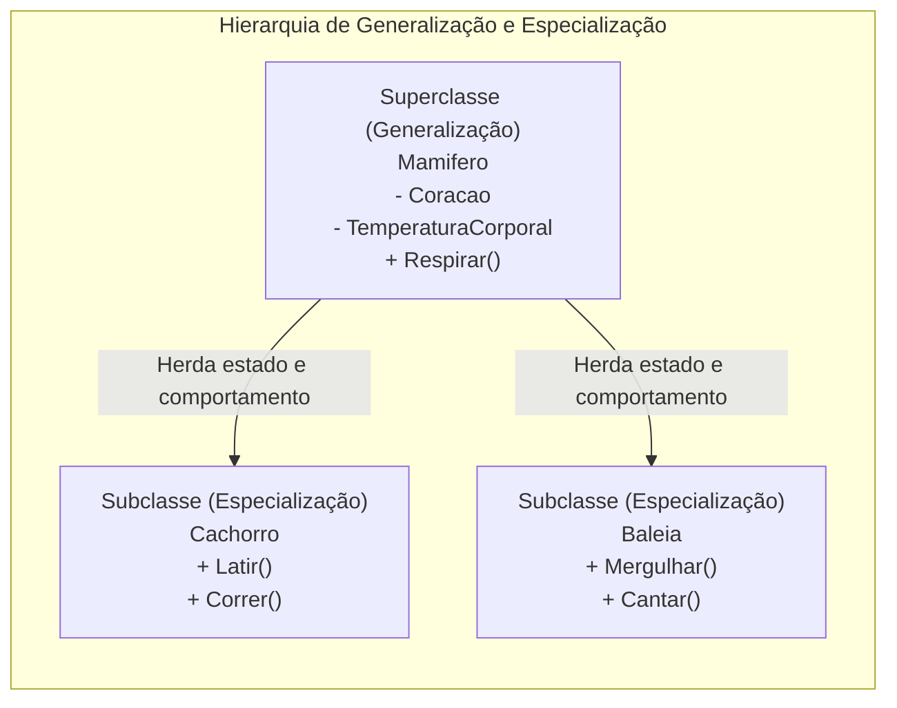
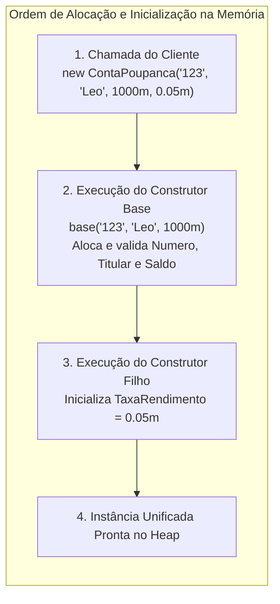

# 15. Herança (generalização, especialização e extensibilidade modular)

> **Contexto:** Nos módulos anteriores, exploramos a classe como unidade atômica de encapsulamento de estado e comportamento. Contudo, sistemas corporativos exigem a criação de famílias de tipos correlacionados que compartilham regras comuns enquanto diferem em comportamentos específicos. Este artigo apresenta a **Herança (*Inheritance*)**, os processos mentais e arquiteturais de **Generalização** e **Especialização (Especificação)**, a relação semântica *"é um"* (*is-a*), a propagação de construtores com `base(...)` e o design de módulos abertos para extensão.

---

## 1. O que é herança e como ela funciona? (Técnica de Feynman)

Imagine uma **árvore genealógica biológica** ou a **classificação dos seres vivos**:

* **A Classe Base (Generalização / O Pai):** Pense na categoria **Mamífero**. Todo mamífero respira ar, tem temperatura corporal regulada e possui coração.
* **A Classe Derivada (Especialização / O Filho):** Um **Cachorro** e uma **Baleia** são mamíferos. Eles não precisam "reinventar o coração ou a respiração pulmonar" (eles **herdam** essas características da classe base). No entanto, o cachorro **especializa** sua locomoção para *latir e andar em quatro patas*, enquanto a baleia **especializa** sua locomoção para *nadar nas profundezas do oceano*.



### Na Ciência da Computação:
1. **Mecanismo de Extensibilidade e Reúso:** A **herança** (veja [[Glossário de conceitos#23 Herança Inheritance|Herança no glossário]]) é um dos quatro pilares fundamentais da POO. Ela permite que uma nova classe (subclasse / classe filha / classe derivada) herde todos os atributos, propriedades e métodos de uma classe existente (superclasse / classe pai / classe base), sem duplicar código.
2. **A Regra Semântica Fundamental *"É Um"* (*Is-A Relationship*):**
   - A herança só deve ser utilizada quando a relação entre os conceitos for estritamente um relacionamento de classificação natural:
     - Um `Cachorro` **é um** `Mamifero` (Válido).
     - Uma `ContaPoupanca` **é uma** `ContaBancaria` (Válido).
     - Um `Professor` **é uma** `Pessoa` (Válido).
   - Se a relação for *"tem um"* (ex.: um `Carro` *tem um* `Motor`), **NÃO utilize herança**; utilize **Composição**!

---

## 2. Generalização vs. Especialização (Especificação)

A construção de hierarquias de classes orientadas a objetos se dá através de dois movimentos mentais e de modelagem complementares:

```mermaid
flowchart TD
    subgraph MovimentosModelagem ["Processos de Modelagem de Hierarquias"]
        direction TB

        Cima["Abstrato / Genérico (Superclasse)"]
        Baixo["Concreto / Específico (Subclasses)"]

        Baixo -->|Generalização (Bottom-Up): Extrair regras comuns| Cima
        Cima -->|Especialização (Top-Down): Refinar e detalhar comportamentos| Baixo
    end
```

### a. Generalização (Abordagem *Bottom-Up* — De baixo para cima)
* **Como funciona:** O engenheiro de software observa múltiplos conceitos existentes no sistema que possuem código ou atributos repetidos (ex.: `ContaCorrente`, `ContaPoupanca` e `ContaInvestimento` têm `Numero`, `Titular`, `Saldo`, `Depositar()`).
* **Ação:** Extrai-se o que há de comum entre eles e cria-se uma superclasse mais ampla e abstrata chamada `ContaBancaria`.
* **Resultado:** Eliminação de duplicação lógica ([[Glossário de conceitos#35 Princípio DRY Don t Repeat Yourself|Princípio DRY]]) e centralização de regras financeiras universais.

---

### b. Especialização ou Especificação (Abordagem *Top-Down* — De cima para baixo)
* **Como funciona:** O engenheiro parte de uma superclasse genérica (`ContaBancaria`) e cria subtipos especializados para acomodar requisitos particulares de negócio.
* **Ação:**
  - `ContaCorrente` adiciona o conceito de `LimiteChequeEspecial` e tarifa de manutenção mensal.
  - `ContaPoupanca` adiciona o conceito de `TaxaRendimentoAnual` e método `CreditarRendimento()`.
* **Resultado:** Módulos altamente coesos e customizados sem poluir a classe base com casos particulares.

---

## 3. A sintaxe de herança no C# (O operador dois-pontos `:`)

No C#, a herança é declarada utilizando o operador de **dois-pontos (`:`)** logo após o nome da subclasse:

```csharp
// 1. CLASSE BASE (Superclasse / Generalização)
public class ContaBancaria 
{
    public string Numero { get; init; }
    public string Titular { get; set; }
    public decimal Saldo { get; protected set; } // protected permite leitura e gravação pelas classes filhas

    public ContaBancaria(string numero, string titular, decimal saldoInicial) 
    {
        Numero = numero;
        Titular = titular;
        Saldo = saldoInicial;
    }

    public void Depositar(decimal valor) 
    {
        if (valor <= 0) throw new ArgumentException("Valor de depósito deve ser positivo.");
        Saldo += valor;
    }
}

// 2. CLASSE DERIVADA (Subclasse / Especialização)
public class ContaPoupanca : ContaBancaria 
{
    public decimal TaxaRendimento { get; init; }

    // Repassa os dados para o construtor da classe base via base(...)
    public ContaPoupanca(string numero, string titular, decimal saldoInicial, decimal taxaRendimento)
        : base(numero, titular, saldoInicial) 
    {
        TaxaRendimento = taxaRendimento;
    }

    // Comportamento novo especializado exclusivo da Conta Poupança:
    public void RenderJuros() 
    {
        decimal rendimento = Saldo * TaxaRendimento;
        Saldo += rendimento; // Acesso direto ao Saldo graças ao 'protected set'
    }
}
```

---

## 4. O papel da palavra-chave `base` e a cadeia de construtores

Uma regra fundamental de execução na memória *Heap* do .NET: **Para que um objeto filho exista, a sua estrutura base de pai deve ser inicializada primeiro!**

### Como funciona o encadeamento de construtores:
1. Quando executamos `new ContaPoupanca(...)`, a runtime **obrigatoriamente executa o construtor de `ContaBancaria` primeiro**.
2. A palavra-chave **`base(...)`** é utilizada na subclasse para invocar e repassar os parâmetros necessários para o construtor da superclasse.
3. Se a classe base não possuir um construtor padrão sem parâmetros (`public Conta() { }`), a subclasse é **obrigada pelo compilador** a invocar explicitamente `: base(...)` em todos os seus construtores.



---

## 5. Modificadores de acesso na herança: `public`, `protected` e `private`

Como a herança afeta a visibilidade dos membros (veja [[12. Modificadores de acesso (visibilidade e níveis de proteção no encapsulamento)|Artigo 12]]):

| Modificador | Visível para o código cliente externo? | Visível dentro da classe derivada (filha)? | Uso recomendado |
| :--- | :--- | :--- | :--- |
| **`public`** | **Sim** | **Sim** | Métodos da interface de contrato (`Depositar()`, `Sacar()`). |
| **`protected`** | **Não** | **Sim** | Atributos e métodos de suporte que apenas a família da hierarquia pode manipular (`protected set`). |
| **`private`** | **Não** | **Não** (invisível até para filhas!) | Detalhes mecânicos e invariantes estritos da classe base. |

> [!TIP]
> **Boas práticas com `protected`:** Prefira expor propriedades com `protected set` em vez de campos `protected` brutos. Isso garante que as classes filhas passem por validações caso o *setter* venha a ter regras de invariantes no futuro.

---

## 6. Herança simples no C# vs. Herança múltipla

Uma decisão arquitetural de extrema importância tomada pelos criadores do C# e Java:

* **Herança Simpla Estrita para Classes:** Uma classe no C# pode herdar de **apenas UMA única classe base direta** (`class Carro : Veiculo`). É proibido fazer `class Pato : Ave, Nadador`.
* **Por que herança múltipla foi proibida para classes?** Para evitar o famoso **Problema do Diamante (*The Diamond Problem*)**, onde duas superclasses implementam o mesmo método com regras diferentes, gerando ambiguidade fatal sobre qual versão a subclasse herdou.
* **Como o C# resolve necessidades múltiplas?** Através de **Interfaces (`interface`)**, onde uma classe pode implementar múltiplos contratos de serviço (`class Pato : Ave, INadador, IVoador`).

---

## 7. O princípio aberto/fechado (*Open/Closed Principle - OCP*) e extensibilidade modular

A herança é um dos principais pilares do **Princípio Aberto/Fechado (OCP)** de Bertrand Meyer e Robert C. Martin:
> *"Entidades de software (classes, módulos) devem estar **abertas para extensão**, mas **fechadas para modificação**."*

* **Módulo Fechado para Modificação:** Você não precisa abrir e reescrever o código testado e compilado de `ContaBancaria.cs` sempre que um novo tipo de conta bancária for criado no banco.
* **Módulo Aberto para Extensão:** Você simplesmente cria um novo arquivo `ContaSalario.cs` que herda de `ContaBancaria` e adiciona as novas regras, sem tocar em uma única linha do código antigo!

---

## 8. Exemplo completo integrado (C#)

Abaixo está uma aplicação prática demonstrando uma hierarquia completa de funcionários com generalização, especialização, cadeia de construtores e novos comportamentos:

```csharp
using System;
using System.Globalization;

namespace Enterprise.RecursosHumanos 
{
    // =========================================================================
    // 1. CLASSE BASE: Funcionario (Generalização / Superclasse)
    // =========================================================================
    public class Funcionario 
    {
        public string Matricula { get; init; }
        public string Nome { get; set; }
        public decimal SalarioBase { get; protected set; }

        public Funcionario(string matricula, string nome, decimal salarioBase) 
        {
            if (salarioBase <= 0) throw new ArgumentOutOfRangeException(nameof(salarioBase), "Salário base deve ser positivo.");
            Matricula = matricula;
            Nome = nome;
            SalarioBase = salarioBase;
        }

        public virtual decimal CalcularRemuneracaoTotal() 
        {
            return SalarioBase;
        }

        public void ExibirResumo() 
        {
            Console.WriteLine($"[{Matricula}] {Nome} | Cargo: {GetType().Name}");
            Console.WriteLine($"Remuneração Total: {CalcularRemuneracaoTotal().ToString("C", CultureInfo.CurrentCulture)}");
            Console.WriteLine(new string('-', 45));
        }
    }

    // =========================================================================
    // 2. CLASSE DERIVADA: Desenvolvedor (Especialização com Bônus Tecnológico)
    // =========================================================================
    public class Desenvolvedor : Funcionario 
    {
        public string NivelSenioridade { get; set; }
        public decimal AdicionalCertificacao { get; set; }

        public Desenvolvedor(string matricula, string nome, decimal salarioBase, string nivelSenioridade, decimal adicionalCertificacao)
            : base(matricula, nome, salarioBase) // Aciona o construtor do pai
        {
            NivelSenioridade = nivelSenioridade;
            AdicionalCertificacao = adicionalCertificacao;
        }

        // Sobrescreve e especializa o cálculo de remuneração:
        public override decimal CalcularRemuneracaoTotal() 
        {
            return SalarioBase + AdicionalCertificacao;
        }
    }

    // =========================================================================
    // 3. CLASSE DERIVADA: Gerente (Especialização com Gratificação de Gestão)
    // =========================================================================
    public class Gerente : Funcionario 
    {
        public decimal BonusGestao { get; set; }
        public int QuantidadeLiderados { get; set; }

        public Gerente(string matricula, string nome, decimal salarioBase, decimal bonusGestao, int quantidadeLiderados)
            : base(matricula, nome, salarioBase)
        {
            BonusGestao = bonusGestao;
            QuantidadeLiderados = quantidadeLiderados;
        }

        public override decimal CalcularRemuneracaoTotal() 
        {
            return SalarioBase + BonusGestao;
        }
    }

    // =========================================================================
    // 4. PROGRAMA CLIENTE
    // =========================================================================
    class Program 
    {
        static void Main() 
        {
            Console.WriteLine("=== Demonstração de Herança, Generalização e Especialização ===");

            Funcionario fComum = new Funcionario("FUNC-001", "Ana Souza", 3500.00m);
            Desenvolvedor dev = new Desenvolvedor("DEV-102", "Lucas Silva", 6500.00m, "Pleno", 800.00m);
            Gerente ger = new Gerente("GER-501", "Mariana Rios", 11000.00m, 2500.00m, 12);

            // Demonstração da reutilização de métodos e polimorfismo de dados:
            fComum.ExibirResumo();
            dev.ExibirResumo();
            ger.ExibirResumo();
        }
    }
}
```

---

## 9. Boas práticas e armadilhas comuns no uso de herança

1. **Favoreça a composição sobre a herança (*Favor composition over inheritance*):**
   - Use herança apenas quando o subtipo for incondicionalmente um tipo da classe base em todos os momentos (*is-a*).
   - Se o comportamento puder mudar em tempo de execução (ex.: um funcionário que vira consultor terceirizado), use **Composição de estratégias (*Strategy Pattern*)** em vez de herança estática rígida.
2. **Evite hierarquias profundas demais (*Deep Inheritance Trees*):**
   - Evite criar cadeias como `A -> B -> C -> D -> E -> F`. Hierarquias com mais de 2 ou 3 níveis de profundidade tornam o código frágil e imprevisível (*Fragile Base Class Problem*).
3. **Respeite o Princípio de Substituição de Liskov (LSP):**
   - Qualquer código cliente que aceite um objeto `Funcionario` deve funcionar perfeitamente quando receber um `Desenvolvedor` ou `Gerente`, sem quebrar ou lançar exceções inesperadas.

---

## Referências bibliográficas

### Bibliografia básica
* MEYER, Bertrand. **Object-Oriented Software Construction**. 2. ed. Prentice Hall, 1997.
* MARTIN, Robert C. **Código Limpo: Habilidades Práticas do Agile Software**. Rio de Janeiro: Alta Books, 2011.
* MICROSOFT. **Herança em C# e .NET (Guia de Programação)**. Microsoft Learn, 2023. Disponível em: [https://learn.microsoft.com/pt-br/dotnet/csharp/fundamentals/object-oriented/inheritance](https://learn.microsoft.com/pt-br/dotnet/csharp/fundamentals/object-oriented/inheritance).
* SOMMERVILLE, Ian. **Engenharia de Software**. 10. ed. São Paulo: Pearson, 2019.

### Bibliografia complementar
* DE PAULA, Hugo. **Programação Modular: Exemplos de Herança e Polimorfismo em C#**. GitHub, 2023. Disponível em: [https://github.com/hugodepaula/programacao-modular-ead/tree/main/exemplos](https://github.com/hugodepaula/programacao-modular-ead/tree/main/exemplos).
* SEBESTA, Robert W. **Conceitos de Linguagens de Programação**. 11. ed. Porto Alegre: Bookman, 2018.

---

## Artigos relacionados e navegação

* **Artigo anterior:** [[14. Namespaces e partial classes (espaços de nomes e modularização em larga escala)]]
* **Resumo da disciplina:** [[00. Programação modular - Resumo]]
* **Glossário da disciplina:** [[Glossário de conceitos]]
* **Guia de sintaxe multilinguagem (Classes e TADs):** [[00. Sintaxe Multilinguagem/05. Abstração e encapsulamento com classes (TADs)]]
* **Ver POO e Acoplamento:** [[04. Programação orientada a objetos e acoplamento]]
* **Ver Modificadores de Acesso:** [[12. Modificadores de acesso (visibilidade e níveis de proteção no encapsulamento)]]
* **Índice geral do vault:** [[index.md|Página inicial do vault]]
