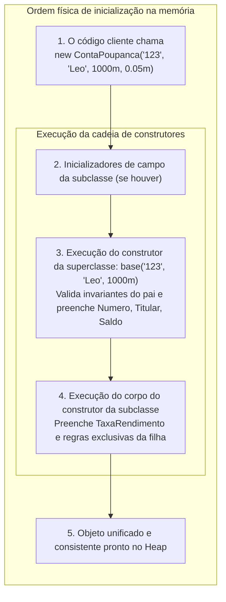
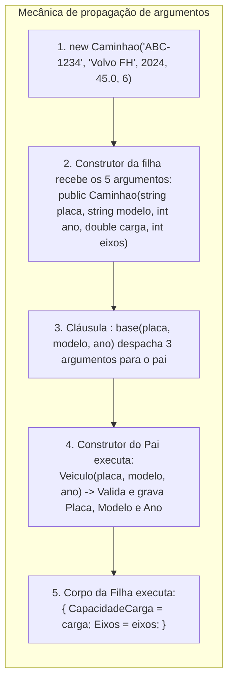
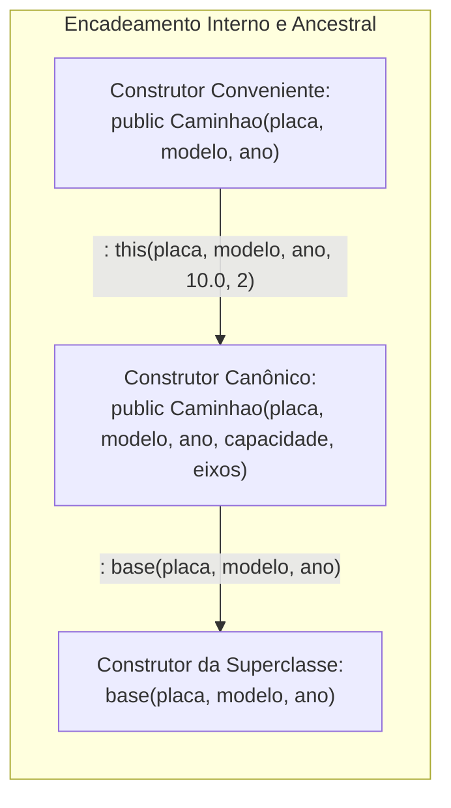

# 16. Construtores em classes filhas (ordem de inicialização e a cláusula base)

> **Contexto:** Quando uma classe herda de outra, o ciclo de vida e a construção de suas instâncias na memória passam a obedecer a um contrato rigoroso de cooperação entre a superclasse e a subclasse. Este artigo disseca a **ordem cronológica exata de inicialização de classes filhas**, o papel obrigatório da cláusula **`: base(...)`**, a propagação de validações de invariantes do ancestral e como evitar armadilhas graves na instanciação de tipos derivados.

---

## 1. Como funciona a inicialização de classes filhas? (Técnica de Feynman)

Imagine a **construção de uma casa de dois andares**:

* **A Classe Pai (Superclasse / O Térreo):** O térreo contém a fundação de concreto, os pilares mestres, as tubulações de água e a fiação elétrica principal.
* **A Classe Filha (Subclasse / O Segundo Andar):** O segundo andar é uma extensão do térreo. Ele possui a varanda panorâmica e os quartos com suíte.
* **A Regra Física Inegociável:** É **impossível construir a varanda do segundo andar no ar** antes de assentar os tijolos e a laje do térreo!
* **No Computador:** Para que a classe filha possa existir no *Heap*, a **estrutura herdada da classe pai deve ser obrigatoriamente montada e validada em primeiro lugar**.



---

## 2. Por que construtores NÃO são herdados?

Uma das maiores dúvidas de quem inicia na POO é: *"Se a subclasse herda atributos, propriedades e métodos, por que ela não herda os construtores da superclasse?"*

### A Razão Técnica:
1. **Diferença de Assinatura e Nome:** Um construtor possui obrigatoriamente o mesmo nome exato da classe na qual foi declarado (`public Funcionario(...)` vs. `public Gerente(...)`).
2. **Incompletude de Estado:** O construtor da classe base conhece apenas os atributos da base. Se ele fosse "herdado" diretamente, a subclasse seria instanciada **deixando seus próprios atributos exclusivos sem inicialização**, violando suas invariantes de classe!
3. **A Solução:** A subclasse deve declarar seus próprios construtores e **delegar** a responsabilidade de inicializar a parte herdada para a classe pai através da cláusula **`: base(...)`**.

---

## 3. Como propagar argumentos da classe filha para o construtor da classe pai

A propagação de argumentos funciona como um **revezamento em uma esteira de montagem**:

1. **O cliente fornece todos os dados para o construtor da classe filha:** Ele passa tanto os dados genéricos (nome, salário) quanto os dados específicos (bônus, CNPJ).
2. **A lista de parâmetros da filha captura os valores:** Na assinatura do construtor da subclasse, declaramos variáveis para receber todos os argumentos enviados.
3. **A cláusula `: base(...)` despacha os argumentos para a classe pai:** Antes de abrir o bloco `{ }` da filha, usamos `: base(parametro1, parametro2)` para encaminhar os dados necessários para o construtor da superclasse.
4. **O corpo da classe filha `{ }` cuida apenas do que é exclusivo dela:** Os atributos herdados já foram preenchidos e validados pela superclasse!



---

### Exemplo em código C# comentado linha por linha:

```csharp
// =========================================================================
// 1. SUPERCLASSE (Classe Pai)
// =========================================================================
public class Veiculo 
{
    public string Placa { get; init; }
    public string Modelo { get; init; }
    public int AnoFabricacao { get; init; }

    // O construtor do pai EXIGE 3 argumentos:
    public Veiculo(string placa, string modelo, int anoFabricacao) 
    {
        if (string.IsNullOrWhiteSpace(placa)) 
            throw new ArgumentException("Placa não pode ser vazia.", nameof(placa));
        
        if (anoFabricacao < 1900 || anoFabricacao > DateTime.UtcNow.Year + 1)
            throw new ArgumentOutOfRangeException(nameof(anoFabricacao), "Ano de fabricação inválido.");

        Placa = placa;
        Modelo = modelo;
        AnoFabricacao = anoFabricacao;
    }
}

// =========================================================================
// 2. SUBCLASSE (Classe Filha)
// =========================================================================
public class Caminhao : Veiculo 
{
    public double CapacidadeCargaToneladas { get; init; }
    public int QuantidadeEixos { get; init; }

    // (A) Recebe 5 argumentos na assinatura
    // (B) Propaga 3 argumentos para o pai através de : base(placa, modelo, anoFabricacao)
    public Caminhao(string placa, string modelo, int anoFabricacao, double capacidadeCarga, int eixos)
        : base(placa, modelo, anoFabricacao) // <<--- AQUI OCORRE A PROPAGAÇÃO!
    {
        // (C) O corpo da classe filha foca exclusivamente em validar e preencher os 2 dados dela:
        if (capacidadeCarga <= 0) 
            throw new ArgumentException("Capacidade de carga deve ser positiva.", nameof(capacidadeCarga));
        
        if (eixos < 2) 
            throw new ArgumentException("Caminhão deve ter no mínimo 2 eixos.", nameof(eixos));

        CapacidadeCargaToneladas = capacidadeCarga;
        QuantidadeEixos = eixos;
    }
}
```

---

## 4. O que acontece quando a classe pai NÃO tem construtor padrão?

Existem dois cenários cruciais de compilação:

### Cenário A: A classe pai possui um construtor sem parâmetros (padrão)
Se a classe pai possui `public Veiculo() { }` (ou nenhum construtor explícito, onde o C# gera o padrão automaticamente), a chamada `: base()` é inserida **implicitamente** pelo compilador.

### Cenário B: A classe pai possui APENAS construtores com parâmetros
Se a superclasse definir `public Veiculo(string placa, ...)` e não fornecer um construtor vazio:
* A subclasse é **terminantemente obrigada pelo compilador** a declarar explicitamente `: base(...)` em todos os seus construtores.
* Tentar compilar a subclasse sem `: base(...)` resultará no erro de compilação:
  > **Erro CS7036:** *There is no argument given that corresponds to the required formal parameter...*

---

## 5. Combinando `: base(...)` e `: this(...)` (Sobrecarga inteligente)

Em designs modulares robustos, uma subclasse pode ter múltiplos construtores sobrecarregados (veja [[08. Construtores (inicialização, sobrecarga e garantia de invariantes)|Artigo 08]]). É comum encadear construtores da própria subclasse com `: this(...)`, enquanto o construtor principal direciona para o pai com `: base(...)`:



```csharp
public class Caminhao : Veiculo 
{
    public double CapacidadeCargaToneladas { get; init; }
    public int QuantidadeEixos { get; init; }

    // Construtor principal (Canônico) -> Delega para a superclasse:
    public Caminhao(string placa, string modelo, int anoFabricacao, double capacidadeCarga, int eixos)
        : base(placa, modelo, anoFabricacao) 
    {
        CapacidadeCargaToneladas = capacidadeCarga;
        QuantidadeEixos = eixos;
    }

    // Construtor de conveniência -> Delega para o construtor canônico da própria classe com valores padrão:
    public Caminhao(string placa, string modelo, int anoFabricacao)
        : this(placa, modelo, anoFabricacao, 8.0, 2) // Assume 8 toneladas e 2 eixos
    {
    }
}
```

---

## 6. A regra crítica: métodos virtuais dentro de construtores

> [!CAUTION]
> **Armadilha clássica de arquitetura:** NUNCA invoque métodos virtuais (`virtual`) de dentro de um construtor!

### Por que isso é perigoso?
1. Quando o construtor da superclasse está rodando, a tabela de métodos virtuais (*vtable*) já aponta para a implementação da subclasse.
2. Se a superclasse invocar um método `virtual`, o método **da subclasse será executado ANTES do construtor da subclasse ter rodado**.
3. A subclasse tentará acessar seus próprios atributos, mas eles **ainda estarão nulos (`null`) ou com valor zero (0)**, gerando bugs silenciosos ou `NullReferenceException`!

```csharp
public class Base 
{
    public Base() 
    {
        // PERIGO: Inicializar() é virtual e executará a versão da filha!
        Inicializar(); 
    }

    public virtual void Inicializar() { }
}

public class Filha : Base 
{
    private string _mensagem;

    public Filha() 
    {
        _mensagem = "Instância configurada com sucesso.";
    }

    public override void Inicializar() 
    {
        // ERRO FATAL: Quando o pai chamou Inicializar(), _mensagem ainda era null!
        Console.WriteLine(_mensagem.ToUpper()); // Dispara NullReferenceException!
    }
}
```

---

## 7. Exemplo completo integrado (C#)

Abaixo está um sistema bancário corporativo com herança, sobrecarga e propagação de construtores:

```csharp
using System;
using System.Globalization;

namespace Enterprise.Financeiro 
{
    // =========================================================================
    // 1. SUPERCLASSE: ContaBancaria
    // =========================================================================
    public class ContaBancaria 
    {
        public string Numero { get; init; }
        public string Titular { get; set; }
        public decimal Saldo { get; protected set; }

        public ContaBancaria(string numero, string titular, decimal saldoInicial) 
        {
            if (string.IsNullOrWhiteSpace(numero)) 
                throw new ArgumentException("Número da conta é obrigatório.", nameof(numero));
            
            if (string.IsNullOrWhiteSpace(titular)) 
                throw new ArgumentException("Nome do titular é obrigatório.", nameof(titular));
            
            if (saldoInicial < 0) 
                throw new ArgumentException("Saldo inicial não pode ser negativo.", nameof(saldoInicial));

            Numero = numero;
            Titular = titular;
            Saldo = saldoInicial;
        }

        public virtual void Depositar(decimal valor) 
        {
            if (valor <= 0) throw new ArgumentException("Valor de depósito inválido.");
            Saldo += valor;
        }
    }

    // =========================================================================
    // 2. SUBCLASSE: ContaCorrenteEmpresarial
    // =========================================================================
    public class ContaCorrenteEmpresarial : ContaBancaria 
    {
        public string Cnpj { get; init; }
        public decimal LimiteEmprestimo { get; set; }
        public decimal TaxaManutencaoMensal { get; init; }

        // Construtor Canônico completo que aciona a superclasse via : base(...)
        public ContaCorrenteEmpresarial(string numero, string titular, decimal saldoInicial, string cnpj, decimal limiteEmprestimo, decimal taxaManutencao)
            : base(numero, titular, saldoInicial) 
        {
            if (string.IsNullOrWhiteSpace(cnpj)) 
                throw new ArgumentException("CNPJ da empresa é obrigatório.", nameof(cnpj));

            Cnpj = cnpj;
            LimiteEmprestimo = limiteEmprestimo;
            TaxaManutencaoMensal = taxaManutencao;
        }

        // Construtor Sobrecregado de conveniência que aciona o canônico via : this(...)
        public ContaCorrenteEmpresarial(string numero, string titular, decimal saldoInicial, string cnpj)
            : this(numero, titular, saldoInicial, cnpj, 50000.00m, 45.00m) 
        {
        }

        public void ExibirExtratoEmpresarial() 
        {
            Console.WriteLine($"=== CONTA PJ [{Numero}] ===");
            Console.WriteLine($"Titular: {Titular} | CNPJ: {Cnpj}");
            Console.WriteLine($"Saldo Atual: {Saldo.ToString("C", CultureInfo.CurrentCulture)}");
            Console.WriteLine($"Limite de Empréstimo: {LimiteEmprestimo.ToString("C", CultureInfo.CurrentCulture)}");
            Console.WriteLine($"Tarifa Mensal: {TaxaManutencaoMensal.ToString("C", CultureInfo.CurrentCulture)}");
            Console.WriteLine(new string('-', 40));
        }
    }

    // =========================================================================
    // 3. PROGRAMA CLIENTE
    // =========================================================================
    class Program 
    {
        static void Main() 
        {
            Console.WriteLine("=== Demonstração de Construtores em Classes Filhas ===");

            // Instanciação usando o construtor sobrecarregado (com valores padrão para limite e taxa):
            var contaPJ = new ContaCorrenteEmpresarial("PJ-8800", "Tech Solutions Ltda", 15000.00m, "12.345.678/0001-90");

            contaPJ.ExibirExtratoEmpresarial();

            contaPJ.Depositar(5000.00m);
            Console.WriteLine("Após depósito de R$ 5.000,00:");
            contaPJ.ExibirExtratoEmpresarial();
        }
    }
}
```

---

## 8. Boas práticas de inicialização em hierarquias

1. **Centralize a validação na superclasse:**
   - Não repita a validação de `Numero` ou `Titular` na subclasse. Deixe a superclasse proteger suas próprias invariantes no seu próprio construtor.
2. **Defina sempre um construtor canônico na subclasse:**
   - Crie um construtor principal que receba todos os parâmetros necessários para construir o objeto de ponta a ponta e use sobrecargas com `: this(...)` para cenários simplificados.
3. **Mantenha construtores leves e determinísticos:**
   - Construtores devem apenas receber dados, validar invariantes e preencher propriedades. Evite abrir conexões com banco de dados, requisições de rede ou chamadas assíncronas dentro do construtor.

---

## Referências bibliográficas

### Bibliografia básica
* RICHTER, Jeffrey. **CLR via C#**. 4. ed. Redmond: Microsoft Press, 2012.
* MARTIN, Robert C. **Código Limpo: Habilidades Práticas do Agile Software**. Rio de Janeiro: Alta Books, 2011.
* MICROSOFT. **Construtores e Herança em C# (Guia de Programação)**. Microsoft Learn, 2023. Disponível em: [https://learn.microsoft.com/pt-br/dotnet/csharp/programming-guide/classes-and-structs/constructors](https://learn.microsoft.com/pt-br/dotnet/csharp/programming-guide/classes-and-structs/constructors).

### Bibliografia complementar
* DE PAULA, Hugo. **Programação Modular: Exemplos de Construtores e Hierarquias**. GitHub, 2023. Disponível em: [https://github.com/hugodepaula/programacao-modular-ead/tree/main/exemplos](https://github.com/hugodepaula/programacao-modular-ead/tree/main/exemplos).
* SEBESTA, Robert W. **Conceitos de Linguagens de Programação**. 11. ed. Porto Alegre: Bookman, 2018.

---

## Artigos relacionados e navegação

* **Artigo anterior:** [[15. Herança (generalização, especialização e extensibilidade modular)]]
* **Resumo da disciplina:** [[00. Programação modular - Resumo]]
* **Glossário da disciplina:** [[Glossário de conceitos]]
* **Ver Construtores e Invariantes:** [[08. Construtores (inicialização, sobrecarga e garantia de invariantes)]]
* **Guia de sintaxe multilinguagem (Herança e Construtores):** [[00. Sintaxe Multilinguagem/11. Herança, superclasses e subclasses (sintaxe comparada e extensibilidade)]]
* **Índice geral do vault:** [[index.md|Página inicial do vault]]
