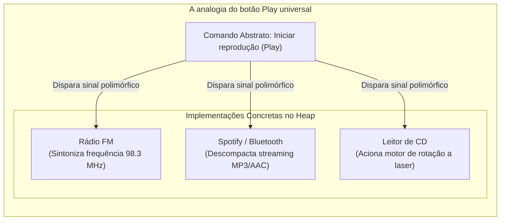
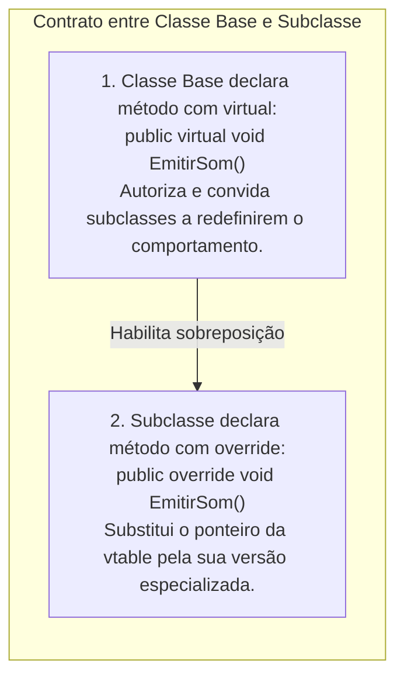
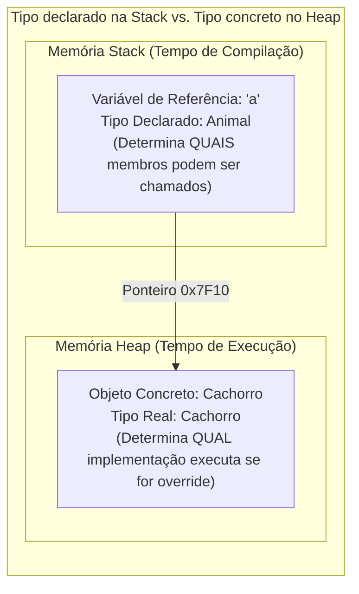
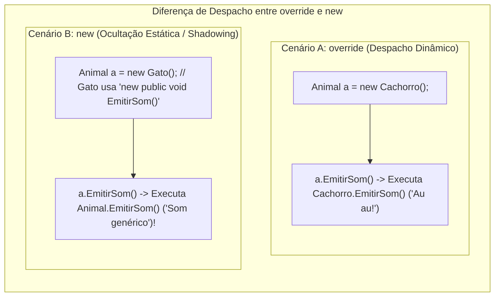

# Sobreposição de métodos (virtual e override)

## Visão geral

O **polimorfismo** (do grego *poly* = muitas, *morphe* = formas) é um dos pilares mais elegantes da Programação Orientada a Objetos. Ele permite que referências de tipos genéricos e abstratos invoquem comportamentos especializados em tempo de execução sem que o código cliente precise saber qual é o tipo concreto específico por trás da chamada.

Neste artigo, exploramos o **polimorfismo de subtipagem (ou inclusão)** através dos modificadores **`virtual`** e **`override`**, compreendendo a mecânica do **despacho dinâmico (*dynamic dispatch*)**, a distinção crucial entre **tipo declarado da referência** e **tipo concreto da instância**, e a diferença fundamental entre sobrescrever (`override`) e ocultar (`new`) membros herdados.

---

## 1. O que é polimorfismo? (A intuição da técnica de Feynman)

Imagine o **botão de "Play" (Reproduzir)** no painel de controle do seu carro ou no seu teclado multimídia:



* **A interface é uniforme:** Para quem aperta o botão, o comando é sempre o mesmo: *"Reproduzir"*.
* **O comportamento concreto é polimórfico:**
  - Se a fonte ativa for o **Rádio FM**, o sistema sintoniza as ondas eletromagnéticas.
  - Se a fonte for o **Bluetooth**, o sistema processa pacotes de rede sem fio.
  - Se a fonte for o **Leitor de CD**, o sistema aciona motores mecânicos e lentes ópticas.
* **A beleza da engenharia:** O painel do carro **não precisa de 3 botões diferentes nem de uma estrutura cheia de `if / else`** para saber como cada mídia toca. Ele simplesmente envia a mensagem *"Reproduzir"* para o dispositivo conectado, e o próprio objeto executa sua forma especializada!

---

## 2. A anatomia do polimorfismo: `virtual` vs. `override`

No C#, métodos são **não-virtuais por padrão** (resolvidos estaticamente em tempo de compilação para máxima performance). Para habilitar o comportamento polimórfico dinâmico, duas palavras-chave trabalham em conjunto como um contrato de duas vias:



### O papel de cada palavra-chave:
1. **[[Glossário de conceitos#46. Método virtual (Virtual Method)|`virtual` (Na classe base)]]:**
   - Declara uma implementação padrão na superclasse e **concede permissão e autorização explícita** para que qualquer classe filha substitua esse comportamento.
   - Sem o modificador `virtual`, o compilador trata o método como estático/fechado, impedindo a sobreposição polimórfica.
2. **[[Glossário de conceitos#47. Sobrescrita de método (Method Overriding / Override)|`override` (Na classe filha)]]:**
   - Confirma a redefinição intencional daquele método. O compilador valida se a assinatura (nome, tipos e ordem dos parâmetros) coincide exatamente com o método `virtual` ancestral.
   - Redireciona a entrada correspondente na tabela de métodos virtuais (*vtable*) para o código da subclasse.

---

### Por que `virtual` e `override` são fundamentais na engenharia de software?

1. **Materialização do Princípio Aberto/Fechado (OCP - *Open/Closed Principle*):**
   - Permite que uma biblioteca ou módulo base permaneça **fechado para modificação** (você não precisa editar o código da superclasse já testada), mas **aberto para extensão** (novas classes filhas podem ser criadas com `override` para suportar novas regras de negócio sem quebrar o sistema existente).
2. **Eliminação de cadeias frágeis de `if / else` e `switch`:**
   - Em vez de um método central verificar tipos concretos (`if (tipo == "Desenvolvedor") ... else if (tipo == "Gerente") ...`), o código cliente interage apenas com o contrato base `f.CalcularSalarioLiquido()`. O *runtime* resolve a implementação correta dinamicamente, eliminando código duplicado e acoplamento tóxico.
3. **Controle explícito contra substituições acidentais:**
   - Ao exigir que o desenvolvedor digite explicitamente `override`, linguagens modernas como C# evitam que a criação de um método na subclasse substitua acidentalmente uma rotina ancestral sem intenção explícita (diferente de linguagens onde todos os métodos são virtuais por padrão).
4. **Combinação com a [[Glossário de conceitos#48. Palavra-chave base (Base Keyword)|palavra-chave `base`]]:**
   - O modificador `override` não exige que você reescreva a rotina inteira do zero: através de `base.Metodo()`, a classe filha executa a validação ou cálculo da superclasse e apenas acrescenta o seu comportamento específico.
5. **Diferenciação clara do [[Glossário de conceitos#49. Modificador new e ocultação de membro (Member Shadowing / New Modifier)|modificador `new` (*shadowing*)]]:**
   - Enquanto `override` garante que uma referência genérica invoque a versão especializada do objeto, o `new` apenas esconde o método e quebra o polimorfismo dinâmico.

---

## 3. O modelo mental essencial: tipo declarado vs. tipo concreto

A maior fonte de erros em provas e na arquitetura de sistemas surge da confusão entre a **variável de referência** e o **objeto real no *Heap***:

```csharp
Animal a = new Cachorro();
```



### As duas regras de ouro:
1. **O tipo declarado da referência (`Animal`) determina a visibilidade:**
   - O compilador só permite chamar métodos e propriedades que existam na classe `Animal`.
   - Se a classe `Cachorro` tiver um método exclusivo `BuscarOsso()`, tentar chamar `a.BuscarOsso()` resultará em **erro de compilação**, pois `Animal` não conhece esse método.
2. **O tipo concreto da instância (`Cachorro`) determina a execução:**
   - Se o método chamado for marcado como `virtual` em `Animal` e sobrescrito com `override` em `Cachorro`, o *runtime* (.NET CLR) busca dinamicamente a versão de `Cachorro` através da tabela de métodos virtuais (*vtable*).

---

## 4. `override` vs. `new`: sobrescrita polimórfica vs. ocultação de membro

Um dos pontos mais críticos do C# é a diferença entre **sobrescrever (`override`)** e **ocultar (`new`)** um membro herdado:



| Critério | `override` (Sobrescrita Polimórfica) | `new` (Ocultação / *Shadowing*) |
| :--- | :--- | :--- |
| **Mecanismo** | Altera a entrada na *vtable* do objeto. | Cria um método totalmente novo que apenas "esconde" o anterior. |
| **Despacho com referência do pai (`Animal a = new Filha()`)** | Executa o método da **classe filha**. | Executa o método da **classe pai** (ignora o filho!). |
| **Polimorfismo real?** | **Sim.** O comportamento varia de acordo com o objeto no *Heap*. | **Não.** O comportamento é amarrado ao tipo da referência na *Stack*. |

---

## 5. Campos vs. métodos: por que campos NÃO participam do polimorfismo?

> [!IMPORTANT]
> **Regra fundamental da POO:** O polimorfismo de subtipagem se aplica **exclusivamente a métodos e propriedades**. Atributos e campos diretos são sempre resolvidos estaticamente pelo tipo declarado da referência.

Considere o teste conceitual clássico:

```csharp
public class Base 
{
    public string Nome = "Classe Base";
    public virtual string ObterNome() => "Classe Base";
}

public class Derivada : Base 
{
    public new string Nome = "Classe Derivada";
    public override string ObterNome() => "Classe Derivada";
}

// EXECUÇÃO:
Base obj = new Derivada();

Console.WriteLine(obj.Nome);        // Imprime: "Classe Base" (Campo depende da referência 'Base')
Console.WriteLine(obj.ObterNome()); // Imprime: "Classe Derivada" (Método virtual resolve polimorficamente!)
```

* **Por que isso acontece?**
  - Campos de dados representam posições físicas de memória na estrutura da classe. O compilador resolve o acesso a campos diretamente pelo tipo da variável (`Base`), sem consultar tabelas virtuais.
  - Métodos marcados como `virtual` contêm ponteiros na *vtable* que são redirecionados em tempo de execução para a implementação mais derivada.

---

## 6. A cláusula `base.Metodo()` (Reutilização da lógica ancestral)

Assim como os construtores usam `: base(...)` para inicializar a superclasse, um método sobrescrito com `override` pode invocar a lógica da classe pai e apenas complementá-la utilizando a sintaxe **`base.NomeDoMetodo()`**:

```csharp
public class Funcionario 
{
    public string Nome { get; init; }
    public decimal SalarioBase { get; init; }

    public virtual decimal CalcularRemuneracao() 
    {
        return SalarioBase;
    }
}

public class Gerente : Funcionario 
{
    public decimal BonusGestao { get; init; }

    public override decimal CalcularRemuneracao() 
    {
        // Reutiliza o cálculo da classe pai e soma o bônus exclusivo do gerente:
        return base.CalcularRemuneracao() + BonusGestao;
    }
}
```

---

## 7. Exemplo completo integrado e compilável (C#)

Abaixo está uma aplicação completa demonstrando o processamento polimórfico de uma folha de pagamentos empresarial:

```csharp
using System;
using System.Collections.Generic;
using System.Globalization;

namespace ProgramacaoModular.Polimorfismo 
{
    // =========================================================================
    // 1. SUPERCLASSE BASE
    // =========================================================================
    public class Funcionario 
    {
        public string Nome { get; init; }
        public string Matricula { get; init; }
        public decimal SalarioBase { get; init; }

        public Funcionario(string nome, string matricula, decimal salarioBase) 
        {
            if (string.IsNullOrWhiteSpace(nome)) 
                throw new ArgumentException("Nome inválido.", nameof(nome));
            
            if (salarioBase <= 0) 
                throw new ArgumentException("Salário base deve ser positivo.", nameof(salarioBase));

            Nome = nome;
            Matricula = matricula;
            SalarioBase = salarioBase;
        }

        // Método virtual: fornece a regra geral padrão que pode ser estendida
        public virtual decimal CalcularSalarioLiquido() 
        {
            // Desconto padrão de previdência de 10%
            return SalarioBase * 0.90m;
        }

        public virtual void ExibirResumo() 
        {
            Console.WriteLine($"[{Matricula}] {Nome} (Geral) - Líquido: {CalcularSalarioLiquido().ToString("C", CultureInfo.CurrentCulture)}");
        }
    }

    // =========================================================================
    // 2. SUBCLASSE 1: Desenvolvedor (Sobrescreve com override)
    // =========================================================================
    public class Desenvolvedor : Funcionario 
    {
        public decimal AdicionalNoturno { get; init; }

        public Desenvolvedor(string nome, string matricula, decimal salarioBase, decimal adicionalNoturno)
            : base(nome, matricula, salarioBase) 
        {
            AdicionalNoturno = adicionalNoturno;
        }

        public override decimal CalcularSalarioLiquido() 
        {
            // Reutiliza a base e adiciona o valor noturno
            return base.CalcularSalarioLiquido() + AdicionalNoturno;
        }

        public override void ExibirResumo() 
        {
            Console.WriteLine($"[{Matricula}] {Nome} (Desenvolvedor) - Líquido: {CalcularSalarioLiquido().ToString("C", CultureInfo.CurrentCulture)}");
        }
    }

    // =========================================================================
    // 3. SUBCLASSE 2: Gerente (Sobrescreve com bônus percentual)
    // =========================================================================
    public class Gerente : Funcionario 
    {
        public decimal PercentualBonus { get; init; }

        public Gerente(string nome, string matricula, decimal salarioBase, decimal percentualBonus)
            : base(nome, matricula, salarioBase) 
        {
            PercentualBonus = percentualBonus;
        }

        public override decimal CalcularSalarioLiquido() 
        {
            decimal salarioBaseComDesconto = base.CalcularSalarioLiquido();
            decimal gratificacao = SalarioBase * (PercentualBonus / 100m);
            return salarioBaseComDesconto + gratificacao;
        }

        public override void ExibirResumo() 
        {
            Console.WriteLine($"[{Matricula}] {Nome} (Gerente +{PercentualBonus}%) - Líquido: {CalcularSalarioLiquido().ToString("C", CultureInfo.CurrentCulture)}");
        }
    }

    // =========================================================================
    // 4. PROCESSADOR POLIMÓRFICO (Princípio Aberto/Fechado - OCP)
    // =========================================================================
    public class FolhaPagamento 
    {
        // O método recebe uma lista de referências genéricas 'Funcionario'
        public static decimal ProcessarFolha(List<Funcionario> funcionarios) 
        {
            decimal totalGasto = 0;
            Console.WriteLine("========================================");
            Console.WriteLine("RELATÓRIO POLIMÓRFICO DE PAGAMENTOS");
            Console.WriteLine("========================================");

            foreach (var f in funcionarios) 
            {
                // Chamada polimórfica: o despacho dinâmico descobre se é Desenvolvedor ou Gerente!
                f.ExibirResumo();
                totalGasto += f.CalcularSalarioLiquido();
            }

            Console.WriteLine("----------------------------------------");
            Console.WriteLine($"Total da Folha: {totalGasto.ToString("C", CultureInfo.CurrentCulture)}");
            Console.WriteLine("========================================\n");
            return totalGasto;
        }
    }

    // =========================================================================
    // 5. PROGRAMA PRINCIPAL
    // =========================================================================
    class Program 
    {
        static void Main() 
        {
            // Lista contendo múltiplos tipos concretos sob a mesma referência base:
            var equipe = new List<Funcionario> 
            {
                new Funcionario("Carlos Silva", "F-101", 3000.00m),
                new Desenvolvedor("Mariana Rios", "DEV-202", 6000.00m, 800.00m),
                new Gerente("Ana Souza", "GER-303", 12000.00m, 25.0m)
            };

            FolhaPagamento.ProcessarFolha(equipe);
        }
    }
}
```

---

## 8. Boas práticas no design de métodos sobrepostos

1. **Respeite o Princípio da Substituição de Liskov (LSP):**
   - Um método `override` na subclasse **nunca deve enfraquecer as pré-condições nem violar o contrato** estabelecido pela classe base (veja [[15. Herança (generalização, especialização e extensibilidade modular)#11. Boas práticas e o princípio da substituição de Liskov (LSP)|Artigo 15]]).
2. **Prefira `override` em vez de `new`:**
   - Evite o uso de `new` para ocultar membros, a menos que esteja integrando código de terceiros onde não seja possível alterar a classe base. Ocultação destrói a transparência polimórfica.
3. **Mantenha os métodos virtuais coesos:**
   - Apenas marque métodos como `virtual` quando houver uma razão arquitetural clara para especialização em subclasses.

---

## Referências bibliográficas

### Bibliografia básica
* RICHTER, Jeffrey. **CLR via C#**. 4. ed. Redmond: Microsoft Press, 2012.
* MARTIN, Robert C.; MARTIN, Micah. **Princípios, padrões e práticas ágeis em C#**. Porto Alegre: Bookman, 2011.
* MICROSOFT. **Polimorfismo (Guia de Programação em C#)**. Microsoft Learn, 2023. Disponível em: [https://learn.microsoft.com/pt-br/dotnet/csharp/fundamentals/object-oriented/polymorphism](https://learn.microsoft.com/pt-br/dotnet/csharp/fundamentals/object-oriented/polymorphism).

### Bibliografia complementar
* DE PAULA, Hugo. **Programação Modular: Exemplos de Polimorfismo e Herança em C#**. GitHub, 2023. Disponível em: [https://github.com/hugodepaula/programacao-modular-ead](https://github.com/hugodepaula/programacao-modular-ead).
* SEBESTA, Robert W. **Conceitos de Linguagens de Programação**. 11. ed. Porto Alegre: Bookman, 2018.

---

## Artigos relacionados e navegação

* **Artigo anterior:** [[16. Construtores em classes filhas (ordem de inicialização e a cláusula base)]]
* **Resumo da disciplina:** [[00. Programação modular - Resumo]]
* **Glossário da disciplina:** [[Glossário de conceitos]]
* **Ver Herança e Extensibilidade:** [[15. Herança (generalização, especialização e extensibilidade modular)]]
* **Guia de sintaxe multilinguagem (Polimorfismo e Override):** [[00. Sintaxe Multilinguagem/11. Herança, superclasses e subclasses (sintaxe comparada e extensibilidade)]]
* **Índice geral do vault:** [[index.md|Página inicial do vault]]
