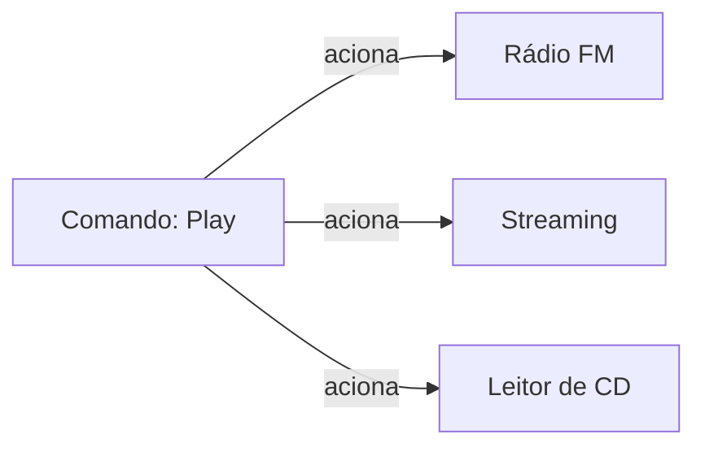
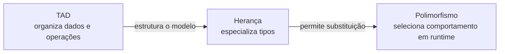
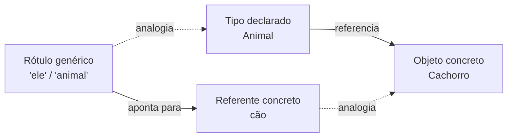
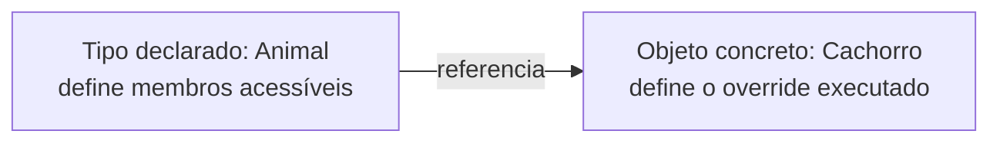
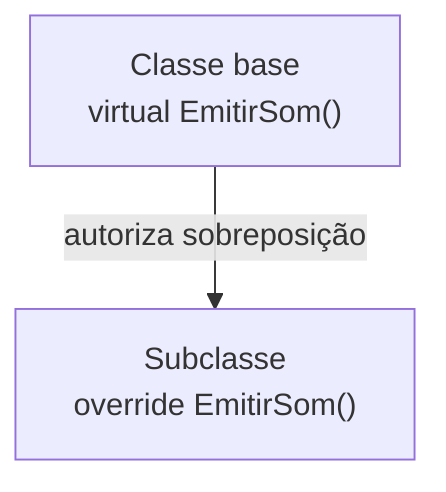
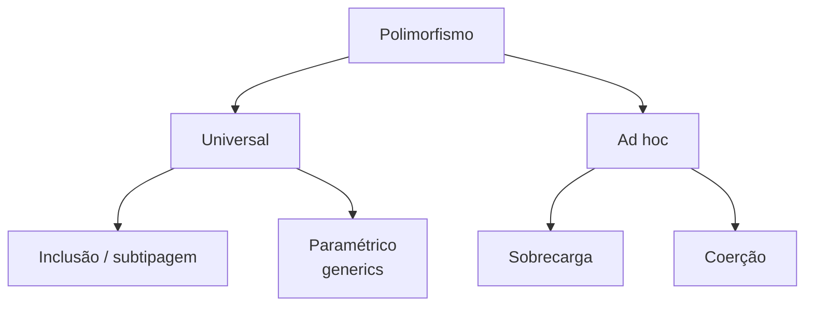
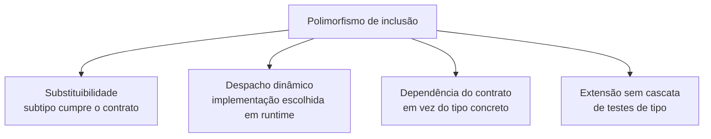
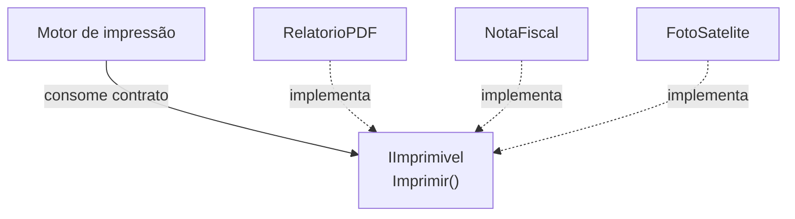
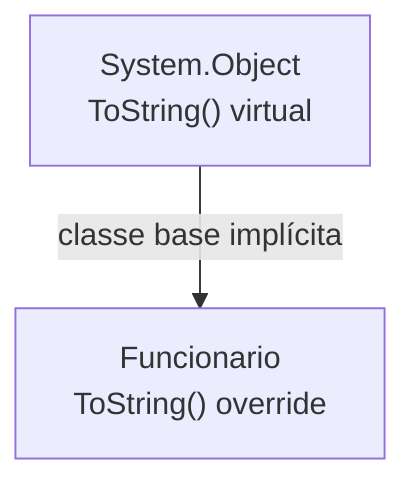

# Sobreposição de métodos (virtual e override)

> **Contexto:** Esta sessão apresenta o conceito fundamental de **polimorfismo de subtipagem (ou inclusão)**, demonstrando como implementar comportamentos genéricos e extensíveis através da sobreposição de métodos. Exploramos como a superclasse abre contratos com **`virtual`**, como a subclasse especializa o comportamento com **`override`**, o modelo mental de **tipo declarado vs. tipo concreto**, a mecânica de despacho dinâmico na *vtable*, a diferença crucial entre sobrescrever e ocultar membros com **`new`**, e a reutilização ancestral via **`base.Metodo()`**.

---

**Percurso de leitura:** conceito central → mecânica em C# → aprofundamento técnico → conexões.

## Polimorfismo de inclusão e referências polimórficas

Polimorfismo de subtipagem permite usar uma referência de contrato para objetos concretos diferentes. `virtual` abre um ponto de especialização; `override` o implementa.

### Polimorfismo como uma interface comum para comportamentos diferentes

Imagine o **botão de "Play" (Reproduzir)** no painel de controle do seu carro ou no seu teclado multimídia:



* **A interface é uniforme:** Para quem aperta o botão, o comando é sempre o mesmo: *"Reproduzir"*.
* **O comportamento concreto é polimórfico:**
  - Se a fonte ativa for o **Rádio FM**, o sistema sintoniza as ondas eletromagnéticas.
  - Se a fonte for o **Bluetooth**, o sistema processa pacotes de rede sem fio.
  - Se a fonte for o **Leitor de CD**, o sistema aciona motores mecânicos e lentes ópticas.
* **A beleza da engenharia:** O painel do carro **não precisa de 3 botões diferentes nem de uma estrutura cheia de `if / else`** para saber como cada mídia toca. Ele simplesmente envia a mensagem *"Reproduzir"* para o dispositivo conectado, e o próprio objeto executa sua forma especializada!

---

### De TADs a hierarquias polimórficas

É natural e profundamente revelador sentir esse impacto mental: **quando você projeta um TAD, está criando um modelo mental de organização do dado no espaço da memória** (uma Pilha LIFO, uma Fila FIFO, uma Árvore Binária hierárquica, uma Tabela Hash ou um Grafo com vértices e arestas).

O salto quântico da Orientação a Objetos ocorre quando você percebe que **a Herança e o Polimorfismo não substituem esses modelos mentais, mas os elevam a um nível taxonômico e extensível**:



**Estrutura de dados e hierarquia de tipos.**

1. **O TAD como modelo mental topológico ([[03. Tipos abstratos de dados|Artigo 03]] e [[00. Sintaxe Multilinguagem/08. Estruturas de dados fundamentais (materialização de modelos mentais em código)|Guia 08 de Sintaxe]]):**
   - Um TAD (Pilha, Fila, Lista Encadeada, Árvore, Grafo) define **a forma como os dados se relacionam no espaço** e quais operações são permitidas sobre essa topologia.
   - Uma **Árvore** organiza dados por ancestrais/descendentes; um **Grafo** organiza por vizinhança e arestas; uma **Pilha** organiza por ordem temporal de chegada (LIFO).
2. **A herança como especialização de estruturas ([[15. Herança (generalização, especialização e extensibilidade modular)|Artigo 15]]):**
   - Em vez de reescrever um grafo ou uma árvore do zero para cada variação, você cria uma superclasse base (`GrafoBase` ou `ArvoreBinariaBase`) contendo os ponteiros de nós, listas de adjacência e percursos comuns (`InOrder`, `PreOrder`, `BuscaEmLargura`).
   - As subclasses (`GrafoDirecionado`, `GrafoPonderado`, `ArvoreAVL`, `ArvoreRubroNegra`) herdam essa topologia e apenas acrescentam seus pesos ou regras de rotação.
3. **O polimorfismo como motor de algoritmos genéricos (este Artigo 17):**
   - O código cliente (ex.: um motor de busca de rotas ou um compilador) manipula apenas `Grafo g` ou `Arvore a`.
   - Ao chamar `g.CalcularMenorCaminho(origem, destino)` ou `a.Inserir(dado)`, o método virtual é resolvido conforme as regras de despacho do runtime o algoritmo de **Dijkstra** (se for ponderado) ou **BFS** (se for não-ponderado), e a **Rotação AVL** ou **Coloração Rubro-Negra** no caso da árvore.
   - **A grande síntese:** *O TAD cria o grafo e a árvore na memória. A Herança cria a família taxonômica das árvores e dos grafos. O Polimorfismo permite que seu sistema processe qualquer variação dessas estruturas complexas com uma única linha de código elegante e desacoplada.*

---

### Tipo declarado e tipo concreto

Uma **referência polimórfica** é uma variável cujo tipo declarado é um ancestral genérico (uma superclasse ou interface), mas que em tempo de execução aponta para um instância concreta compatível; a localização física é detalhe de runtime:

```csharp
// 'a' é uma referência polimórfica:
Animal a = new Cachorro();
```

**Modelo mental linguístico da referência polimórfica.**

Essa mecânica da computação reflete perfeitamente a forma como a **linguagem natural** opera:

1. **Hiperônimos e hipônimos (a hierarquia de herança):**
   - Na linguística, um **hiperônimo** é um termo genérico e abrangente (*veículo*, *animal*, *documento*), enquanto o **hipônimo** é a especialização concreta (*motocicleta*, *labrador*, *nota fiscal*).
   - Na programação, a **superclasse / interface** é o hiperônimo (`Animal`), e as **subclasses** são os hipônimos concretos (`Cachorro`, `Gato`).

2. **Dêiticos e pronomes (a referência polimórfica):**
   - Em português, palavras **dêiticas** (como pronomes *"ele"*, *"isto"*, *"aquele"* ou advérbios *"aqui"*) não têm significado material fixo por si sós: **seu sentido concreto depende inteiramente do contexto a que estão apontando**.
   - Quando alguém aponta o dedo e diz: *"Cuidado, **ele** morde!"*, o pronome *"ele"* é uma referência abstrata. Se a pessoa estiver apontando para um pinscher, você espera latidos agudos; se estiver apontando para um leão, o perigo é outro.
   - No código, a **variável de referência (`Animal a`) funciona exatamente como um pronome dêitico**: ela é apenas o "ponteiro gramatical". O efeito real da mensagem `a.EmitirSom()` depende exclusivamente de **quem** está ancorado naquele instante no *Heap*.

3. **Tipos genéricos como placeholders universais (`T`):**
   - Em `List<T>`, o parâmetro de tipo `T` é uma **variável gramatical aberta**, que só ganha corpo material quando você define o contexto concreto (`List<ContaBancaria>`).





A variável `a` na *Stack* mantém uma referência gerenciada; não se deve assumir um ponteiro físico exposto (endereço hexadecimal como `0x7F10`) que localiza a instância do objeto no *Heap*.

### Referências polimórficas em parâmetros, coleções e variáveis

1. **Atribuição polimórfica de variáveis:**
   - Uma única variável de referência pode apontar para diferentes subtipos ao longo do tempo de vida do programa:
   ```csharp
   Animal a;
   a = new Cachorro();
   a.EmitirSom(); // Late binding: Late binding aciona Cachorro ("Au au!")

   a = new Gato();
   a.EmitirSom(); // Late binding: A MESMA variável agora aciona Gato ("Miau!")
   ```

2. **Coleções heterogêneas homogêneas no contrato:**
   - Permite armazenar dezenas de classes derivadas distintas dentro da mesma lista ou array tipado pela superclasse:
   ```csharp
   List<Funcionario> equipe = new List<Funcionario>
   {
       new Funcionario("Carlos", "F-01", 3000m),
       new Desenvolvedor("Mariana", "DEV-02", 6000m, 800m),
       new Gerente("Ana", "GER-03", 12000m, 25m)
   };
   ```

3. **Parâmetros polimórficos de métodos (inversão de dependência):**
   - Métodos recebem referências genéricas, tornando-se imunes a futuras criações de novos tipos derivados:
   ```csharp
   public void Notificar(Funcionario f) // Aceita qualquer classe que herde de Funcionario!
   {
       Console.WriteLine($"Processando: {f.Nome} com salário {f.CalcularSalarioLiquido()}");
   }
   ```

---

**Regras de uso da referência polimórfica.**
1. **O tipo declarado da referência (`Animal`) determina a visibilidade:**
   - O compilador só permite chamar métodos e propriedades que existam na classe `Animal`.
   - Se a classe `Cachorro` tiver um método exclusivo `BuscarOsso()`, tentar chamar `a.BuscarOsso()` resultará em **erro de compilação**, pois a referência `Animal` não conhece esse método.
2. **O tipo concreto da instância (`Cachorro`) determina a execução:**
   - Se o método chamado for marcado como `virtual` em `Animal` e sobrescrito com `override` em `Cachorro`, o *runtime* (.NET CLR) busca dinamicamente a versão de `Cachorro` através da tabela de métodos virtuais (*vtable*).

---

## `virtual`, `override` e despacho dinâmico em C#

Comece pela diferença entre tipo declarado e tipo concreto, depois compare `override` e `new`, `base.Metodo()` e `ToString()`. O exemplo integrado reúne o fluxo.

### `virtual` na base e `override` na derivada

No C#, métodos são **não-virtuais por padrão** (resolvidos estaticamente em tempo de compilação para máxima performance). Para habilitar o comportamento polimórfico dinâmico, duas palavras-chave trabalham em conjunto como um contrato de duas vias:



**Papel de `virtual` e `override`.**
1. **[[Glossário de conceitos#Método virtual (Virtual Method)|`virtual` (na classe base)]]:**
   - Declara uma implementação padrão na superclasse e **concede permissão e autorização explícita** para que qualquer classe filha substitua esse comportamento.
   - Sem o modificador `virtual`, o compilador trata o método como estático/fechado, impedindo a sobreposição polimórfica.
2. **[[Glossário de conceitos#Sobreposição e sobrescrita de método (Method Overriding / Override)|`override` (na classe filha)]]:**
   - Confirma a redefinição intencional daquele método. O compilador valida se a assinatura (nome, tipos e ordem dos parâmetros) coincide exatamente com o método `virtual` ancestral.
   - Redireciona a entrada correspondente na [[Glossário de conceitos#Tabela de métodos virtuais (Virtual Method Table - vtable)|tabela de métodos virtuais (*vtable*)]] para o código da subclasse.

---

### Extensão de comportamento sem alterar o código cliente

1. **Materialização do princípio aberto/fechado (OCP - *Open/Closed Principle*):**
   - Permite que uma biblioteca ou módulo base permaneça **fechado para modificação** (você não precisa editar o código da superclasse já testada), mas **aberto para extensão** (novas classes filhas podem ser criadas com `override` para suportar novas regras de negócio sem quebrar o sistema existente).
2. **Eliminação de cadeias frágeis de `if / else` e `switch`:**
   - Em vez de um método central verificar tipos concretos (`if (tipo == "Desenvolvedor") ... else if (tipo == "Gerente") ...`), o código cliente interage apenas com o contrato base `f.CalcularSalarioLiquido()`. O *runtime* resolve a implementação correta dinamicamente, eliminando código duplicado e acoplamento tóxico.
3. **Controle explícito contra substituições acidentais:**
   - Ao exigir que o desenvolvedor digite explicitamente `override`, linguagens modernas como C# evitam que a criação de um método na subclasse substitua acidentalmente uma rotina ancestral sem intenção explícita (diferente de linguagens onde todos os métodos são virtuais por padrão).
4. **Combinação com a [[Glossário de conceitos#Palavra-chave base (Base Keyword)|palavra-chave `base`]]:**
   - O modificador `override` não exige que você reescreva a rotina inteira do zero: através de `base.Metodo()`, a classe filha executa a validação ou cálculo da superclasse e apenas acrescenta o seu comportamento específico.
5. **Diferenciação clara do [[Glossário de conceitos#Modificador new e ocultação de membro (Member Shadowing / New Modifier)|modificador `new` (*shadowing*)]]:**
   - Enquanto `override` garante que uma referência genérica invoque a versão especializada do objeto, o `new` apenas esconde o método e quebra o polimorfismo dinâmico.

---

### Vinculação estática e vinculação tardia

A diferença essencial entre métodos comuns e métodos polimórficos reside no **momento em que o endereço de memória do código executável é vinculado (*binding*) à chamada**:

| Aspecto | Early binding | Late binding |
| :--- | :--- | :--- |
| Momento da resolução | Antes da execução | Durante a execução |
| Caso típico neste artigo | Método não virtual | `virtual` + `override` |
| Critério principal | Tipo conhecido estaticamente | Tipo concreto do objeto |
| Efeito | Chamada definida sem despacho polimórfico | Implementação escolhida por despacho dinâmico |

**Comparação entre early binding e late binding.**

| Critério | *Early binding* (vinculação estática) | *Late binding* (vinculação tardia / dinâmica) |
| :--- | :--- | :--- |
| **Momento da decisão** | **Tempo de compilação (*compile-time*)**. | **Tempo de execução (*runtime*)**. |
| **Palavras-chave C#** | Métodos normais sem `virtual` ou métodos com `new`. | Métodos marcados com **`virtual`** e **`override`**. |
| **Instrução IL do .NET** | `call` (salto direto de endereço). | `callvirt` (consulta indireta via tabela *vtable*). |
| **Vantagem principal** | **Caminho potencialmente direto:** O processador pula direto para o endereço sem consultar tabelas intermediárias. | **Extensibilidade e desacoplamento:** O sistema aceita novos tipos sem precisar ser recompilado. |
| **Analogia de Feynman** | **Casamento arranjado na certidão:** Quem vai casar com quem já está carimbado no cartório antes do evento começar. | **Leilão ao vivo:** O vencedor é determinado na hora de acordo com quem levantar a placa no salão. |

---

### `override` e `new`: sobrescrita versus ocultação

Um dos pontos mais críticos do C# é a diferença entre **sobrescrever (`override`)** e **ocultar (`new`)** um membro herdado:

| Situação | `override` | `new` |
| :--- | :--- | :--- |
| Relação com o método da base | Sobrescreve o contrato virtual | Oculta um membro com o mesmo nome |
| Chamada por referência `Animal` | Executa a implementação do objeto concreto | Executa o membro visível pelo tipo da referência |
| Natureza do despacho | Dinâmico | Estático para o membro ocultado |

| Critério | `override` (sobrescrita polimórfica) | `new` (ocultação / *shadowing*) |
| :--- | :--- | :--- |
| **Mecanismo** | Altera a entrada na *vtable* do objeto. | Cria um método totalmente novo que apenas "esconde" o anterior. |
| **Despacho com referência do pai (`Animal a = new Filha()`)** | Executa o método da **classe filha**. | Executa o método da **classe pai** (ignora o filho!). |
| **Polimorfismo real?** | **Sim.** O comportamento varia de acordo com o objeto no *Heap*. | **Não.** O comportamento é amarrado ao tipo da referência na *Stack*. |

---

### Campos não participam do despacho polimórfico

> [!IMPORTANT]
> **Regra fundamental da POO:** O polimorfismo de subtipagem se aplica **exclusivamente a métodos e propriedades**. Atributos e campos diretos são sempre resolvidos estaticamente pelo tipo declarado da referência.

Considere o teste conceitual clássico:

```csharp
public class Base
{
    public string Nome = "Classe Base";
    public virtual string ObterNome() => "Classe Base";
}

public class Derivada : Base
{
    public new string Nome = "Classe Derivada";
    public override string ObterNome() => "Classe Derivada";
}

// EXECUÇÃO:
Base obj = new Derivada();

Console.WriteLine(obj.Nome);        // Imprime: "Classe Base" (Campo depende da referência 'Base')
Console.WriteLine(obj.ObterNome()); // Imprime: "Classe Derivada" (Método virtual resolve polimorficamente!)
```

* **Por que isso acontece?**
  - Campos de dados representam posições físicas de memória na estrutura da classe. O compilador resolve o acesso a campos diretamente pelo tipo da variável (`Base`), sem consultar tabelas virtuais.
  - Métodos marcados como `virtual` contêm entradas de despacho que o runtime pode representar de várias formas em tempo de execução para a implementação mais derivada.

---

### Reutilização da implementação base com `base.Metodo()`

Assim como os construtores usam `: base(...)` para inicializar a superclasse, um método sobrescrito com `override` pode invocar a lógica da classe pai e apenas complementá-la utilizando a sintaxe **`base.NomeDoMetodo()`**:

```csharp
public class Funcionario
{
    public string Nome { get; init; }
    public decimal SalarioBase { get; init; }

    public virtual decimal CalcularRemuneracao()
    {
        return SalarioBase;
    }
}

public class Gerente : Funcionario
{
    public decimal BonusGestao { get; init; }

    public override decimal CalcularRemuneracao()
    {
        // Reutiliza o cálculo da classe pai e soma o bônus exclusivo do gerente:
        return base.CalcularRemuneracao() + BonusGestao;
    }
}
```

> [!NOTE]
> **Por que usamos `decimal` em vez de `float` ou `double`?**
> O tipo **`decimal`** (128 bits) opera em **base 10 exata** com 28-29 dígitos de precisão, garantindo que operações contábeis (como salários, bonificações e descontos) não sofram os erros de arredondamento cumulativos típicos do `float`/`double` (que operam em base 2 / IEEE 754). Veja a comparação detalhada e multilinguagem em [[00. Sintaxe Multilinguagem/01. Variáveis, tipos e atribuição#Tipos numéricos com casas decimais float double e decimal precisão binária vs financeira|Guia de Sintaxe 01 (Variáveis e Tipos)]].

---

## Tipos de polimorfismo, substituibilidade e interfaces

`vtable`, `vptr`, `callvirt` e `call` são possíveis detalhes de implementação do runtime, não a definição de polimorfismo. A resolução também depende de sobrecarga, acesso e tipo estático.

### Polimorfismo de inclusão, paramétrico, ad hoc e coerção

Na Ciência da Computação, o modelo clássico de **Luca Cardelli e Peter Wegner (1985)** classifica o polimorfismo em **dois grandes ramos (universal e ad-hoc)**, divididos em **4 tipos fundamentais**:



**Diferenças entre os quatro tipos.**

| Tipo de polimorfismo | Ramo | Como funciona? | Exemplo em C# |
| :--- | :--- | :--- | :--- |
| **1. Inclusão / subtipagem (*inclusion / subtyping*)** | Um caso importante | Uma referência da classe base aponta para instâncias de subclasses e resolve métodos especializados via *vtable*. **(Foco central deste Artigo 17!)** | `Funcionario f = new Gerente(); f.CalcularSalarioLiquido();` |
| **2. Paramétrico (*parametric*)** | Um caso importante | O código opera sobre parâmetros de tipos abstratos genéricos sem depender de uma hierarquia de herança. Garante *type safety* em tempo de compilação. | `List<T>`, `Repositorio<T>` |
| **3. Sobrecarga (*overloading / ad-hoc*)** | **Ad-hoc** | Múltiplas funções compartilham o mesmo identificador na mesma classe, diferenciadas estaticamente por sua assinatura. | `Calcular(int x)` vs. `Calcular(int x, int y)` |
| **4. Coerção (*coercion / ad-hoc*)** | **Ad-hoc** | O compilador ou *runtime* converte um tipo de dado em outro compatível para viabilizar uma operação. | `double total = 10 + 4.5;` (inteiro `10` vira `10.0`) |

---

### Polimorfismo de inclusão e substituibilidade

O **polimorfismo de inclusão** (ou **polimorfismo de subtipagem**) é a verdadeira pedra angular e o recurso mais poderoso de toda a Programação Orientada a Objetos. Ele é considerado especial porque reúne e orquestra **quatro pilares arquiteturais simultâneos**:



**Subtipagem e princípio de Liskov.**
* A notação formal $S <: T$ (lê-se: *"o tipo $S$ é um subtipo do tipo $T$"*) significa que onde quer que uma referência de tipo $T$ for solicitada, o sistema pode receber uma instância concreta de $S$ com expressa substituibilidade quando o contrato é respeitado (veja [[15. Herança (generalização, especialização e extensibilidade modular)#Subtipagem vs. herança: o que é a relação S <: T?|Artigo 15]] e [[Glossário de conceitos#Subtipagem (Subtyping / Subtype Polymorphism)|Glossário 44]]).
* **Exemplo real:** Um método `ProcessarFolhaPagamento(List<Funcionario> equipe)` não precisa saber se cada funcionário é um `Diretor`, `Desenvolvedor` ou `Estagiario`. O método apenas diz `funcionario.CalcularSalarioLiquido()` e cada objeto responde conforme suas próprias regras de negócio.

**Despacho dinâmico e vtable.**
* Em linguagens procedurais clássicas (como C), toda chamada de função é cravada no binário em tempo de compilação (*early binding*). Se você chamar `CalcularArea()`, a CPU sabe o endereço de memória exato antes mesmo do executável rodar.
* No **polimorfismo de inclusão**, o método efetivo pode depender do tipo concreto e das regras de despacho. A decisão é **postergada para o momento exato em que o programa está rodando**. A CPU consulta o [[Glossário de conceitos#Ponteiro (Pointer / vptr / Memory Pointer)|ponteiro *vptr*]] do objeto real alocado no *Heap*, abre sua [[Glossário de conceitos#Tabela de métodos virtuais (Virtual Method Table - vtable)|tabela de métodos virtuais (*vtable*)]] e salta para a implementação especializada correspondente.

**Substituição de condicionais por despacho polimórfico.**
* **Sem polimorfismo de inclusão (código procedural acoplado e perigoso):**
  ```csharp
  // CÓDIGO FRÁGIL: Cada nova forma exige editar este método central!
  public void DesenharForma(object forma)
  {
      if (forma is Circulo c) c.DesenharCirculo();
      else if (forma is Retangulo r) r.DesenharRetangulo();
      else if (forma is Triangulo t) t.DesenharTriangulo();
  }
  ```
* **Com polimorfismo de inclusão (código modular e elegante):**
  ```csharp
  // CÓDIGO BLINDADO: Nunca precisa ser alterado, mesmo se criarmos 100 novas formas!
  public void DesenharForma(FormaGeometrica forma)
  {
      forma.Desenhar(); // O polimorfismo cuida do redirecionamento dinâmico
  }
  ```

**Modelo mental da tomada universal.**
> Imagine a **tomada padrão de parede** da sua casa ($T$). A tomada promete fornecer corrente elétrica de 110V a quem conectar nela.
>
> Você pode plugar um *Liquidificador*, uma *Geladeira* ou uma *TV 4K* ($S_1, S_2, S_3 <:\ T$).
>
> A fiação da parede (o código cliente) não tem a menor ideia de qual aparelho está conectado nem como o motor interno do liquidificador gira ou como a tela da TV emite luz. Ela apenas fecha o circuito. Quando a energia passa, cada eletrodoméstico reage de forma autônoma e especializada. Isso é a essência pura do polimorfismo de inclusão!

---

### Polimorfismo por interface e contratos de capacidade

Para contratos sem herança de implementação, continue em [[18A. Interfaces, contratos e polimorfismo por interface]].

Uma dúvida muito comum na Programação Modular é: *"A interface (`interface`) também é um método de polimorfismo?"*

**Sim! A interface é a forma mais pura, flexível e desacoplada de polimorfismo de subtipagem que existe.**

Enquanto a herança de classes cria polimorfismo baseado em **parentesco genético ("é um" / *is-a*)**, a interface cria polimorfismo baseado em **capacidade ou contrato de serviço ("comporta-se como" / *can-do*)**:



**Vantagens do contrato por interface.**

1. **Polimorfismo sem parentesco taxonômico:**
   - Com classes, para um `Cachorro` e um `Drone` responderem ao comando `Mover()`, você precisaria forçar uma superclasse ancestral bizarra (`CoisaQueSeMove`).
   - Com interfaces, qualquer classe de qualquer família pode assinar o contrato `IMovel` ou `IAutenticavel`:
     ```csharp
     public interface IAutenticavel
     {
         bool ValidarSenha(string senha);
     }

     public class UsuarioSistema : IAutenticavel { /* ... */ }
     public class ServidorCloud : IAutenticavel { /* ... */ }
     public class DroneMilitar : IAutenticavel { /* ... */ }
     ```

2. **Superação da herança simples (Múltiplas faces polimórficas):**
   - Em C# e Java, uma classe só pode ter uma única classe pai, mas pode implementar múltiplas interfaces (`class CarroEletrico : Veiculo, IRecarregavel, IConectavel5G`). Isso permite que o mesmo objeto assuma múltiplos papéis polimórficos de acordo com o contexto em que é manipulado!

3. **Analogia de Feynman (A árvore genealógica vs. o diploma profissional):**
   - **Polimorfismo por classe (`class Base`):** A **árvore genealógica biológica**. Um *Cachorro* e um *Lobo* herdam a estrutura física de *Mamífero*.
   - **Polimorfismo por interface (`interface`):** A **habilitação ou diploma profissional**. Um *Humano*, um *Cachorro* e um *Golfinho* podem ter o certificado de *Salva-Vidas* (`ISalvaVidas`). Quando a praia precisa de resgate, o posto de bombeiros aciona qualquer um que possua o crachá `ISalvaVidas.Salvar()`, sem se importar com a espécie biológica de quem vai nadar!

---

### Polimorfismo dinâmico e estático

A literatura técnica divide o polimorfismo em duas grandes categorias temporais de acordo com o momento em que a decisão de código é tomada:

| Aspecto | Polimorfismo estático | Polimorfismo dinâmico |
| :--- | :--- | :--- |
| Resolução | Em compilação | Em execução |
| Exemplos | Sobrecarga e parametrização genérica | Subtipagem, interfaces e `virtual`/`override` |
| Seleção | Assinatura e tipos conhecidos pelo compilador | Tipo concreto do objeto |
| Ideia central | Uma operação admite formas definidas estaticamente | O mesmo contrato pode executar implementações diferentes |

**Comparação entre polimorfismo dinâmico e estático.**

| Critério | Polimorfismo estático (*static polymorphism*) | Polimorfismo dinâmico (*dynamic polymorphism*) |
| :--- | :--- | :--- |
| **Outros nomes** | Polimorfismo em tempo de compilação, *early binding*, ligação prévia. | Polimorfismo em tempo de execução, *late binding*, *dynamic dispatch*, polimorfismo de inclusão. |
| **Mecanismo central** | Sobrecarga de métodos (`overloading`) e tipos genéricos (`generics`). | Métodos virtuais (`virtual`), sobrescrita (`override`) e [[Glossário de conceitos#Superclasse vs. interface (Superclass vs. Interface / Inheritance vs. Interface)|interfaces]]. |
| **Quando a decisão é tomada?** | Pelo **compilador** ao gerar o binário IL/código de máquina. | Pela **CPU / CLR** em tempo real enquanto o programa roda. |
| **Como o processador resolve?** | Salto direto para o endereço de memória físico gravado no executável. | Consulta o ponteiro *vptr* do objeto no *Heap* e busca na *vtable*. |
| **Exemplo no código** | `Math.Max(10, 20)` vs. `Math.Max(10.5, 20.3)` | `Animal a = new Cachorro(); a.EmitirSom();` |
| **Analogia de Feynman** | **Cardápio com preços fixos:** cada prato tem seu código pré-definido na cozinha antes do restaurante abrir. | **Pedir o "especial do chefe":** o garçom anota o pedido geral, mas o prato servido depende de quem é o chefe de plantão hoje. |

---

## `ToString()`, sobrescrita e desenho de APIs polimórficas

Interfaces oferecem polimorfismo por contrato sem exigir uma classe base comum. Classes abstratas e `sealed` controlam outras dimensões da hierarquia.

### `ToString()` como método virtual de `System.Object`

No ecossistema .NET (C#), toda e qualquer classe herda direta ou indiretamente da classe raiz universal **`System.Object`** (ou simplesmente `object`).

A classe `object` declara três métodos virtuais fundamentais: `ToString()`, `Equals(object)` e `GetHashCode()`. Dentre eles, o **`ToString()`** é o exemplo mais clássico e frequente de sobreposição polimórfica no dia a dia:



**Representação padrão sem sobrescrita.**
Se você instanciar um objeto e tentar exibi-lo no terminal (`Console.WriteLine(meuFuncionario)` ou interpolar `$"Dados: {meuFuncionario}"`), a implementação padrão de `System.Object` será acionada via *late binding*, imprimindo apenas o nome do tipo:
```text
ProgramacaoModular.Polimorfismo.Funcionario
```

**Sobrescrita correta de `ToString()`.**
Ao aplicar `override`, qualquer método que faça interpolação de strings, logs ou exibição em tela chamará a sua formatação especializada automaticamente:

```csharp
public class Funcionario
{
    public string Nome { get; init; }
    public decimal SalarioBase { get; init; }

    // Sobrescrevendo o contrato virtual universal de System.Object:
    public override string ToString()
    {
        return $"{Nome} (Salário Base: {SalarioBase:C})";
    }
}

// Em qualquer lugar do sistema:
Funcionario f = new Funcionario { Nome = "Carlos", SalarioBase = 3000m };
Console.WriteLine(f); // Imprime diretamente: Carlos (Salário Base: R$ 3.000,00)
```

> [!TIP]
> **Conexão multilinguagem:** Veja como Java (`toString`), Python (`__str__`) e JavaScript tratam a representação textual em [[00. Sintaxe Multilinguagem/12. Sobrescrita de métodos e representação textual (ToString, toString, __str__)|Guia de Sintaxe Multilinguagem 12]].

---

### Exemplo integrado de despacho polimórfico em C#

Abaixo está uma aplicação completa demonstrando o processamento polimórfico de uma folha de pagamentos empresarial:

```csharp
using System;
using System.Collections.Generic;
using System.Globalization;

namespace ProgramacaoModular.Polimorfismo
{
    // =========================================================================
    // 1. SUPERCLASSE BASE
    // =========================================================================
    public class Funcionario
    {
        public string Nome { get; init; }
        public string Matricula { get; init; }
        public decimal SalarioBase { get; init; }

        public Funcionario(string nome, string matricula, decimal salarioBase)
        {
            if (string.IsNullOrWhiteSpace(nome))
                throw new ArgumentException("Nome inválido.", nameof(nome));

            if (salarioBase <= 0)
                throw new ArgumentException("Salário base deve ser positivo.", nameof(salarioBase));

            Nome = nome;
            Matricula = matricula;
            SalarioBase = salarioBase;
        }

        // Método virtual: fornece a regra geral padrão que pode ser estendida
        public virtual decimal CalcularSalarioLiquido()
        {
            // Desconto padrão de previdência de 10%
            return SalarioBase * 0.90m;
        }

        public virtual void ExibirResumo()
        {
            Console.WriteLine($"[{Matricula}] {Nome} (Geral) - Líquido: {CalcularSalarioLiquido().ToString("C", CultureInfo.CurrentCulture)}");
        }
    }

    // =========================================================================
    // 2. SUBCLASSE 1: Desenvolvedor (Sobrescreve com override)
    // =========================================================================
    public class Desenvolvedor : Funcionario
    {
        public decimal AdicionalNoturno { get; init; }

        public Desenvolvedor(string nome, string matricula, decimal salarioBase, decimal adicionalNoturno)
            : base(nome, matricula, salarioBase)
        {
            AdicionalNoturno = adicionalNoturno;
        }

        public override decimal CalcularSalarioLiquido()
        {
            // Reutiliza a base e adiciona o valor noturno
            return base.CalcularSalarioLiquido() + AdicionalNoturno;
        }

        public override void ExibirResumo()
        {
            Console.WriteLine($"[{Matricula}] {Nome} (Desenvolvedor) - Líquido: {CalcularSalarioLiquido().ToString("C", CultureInfo.CurrentCulture)}");
        }
    }

    // =========================================================================
    // 3. SUBCLASSE 2: Gerente (Sobrescreve com bônus percentual)
    // =========================================================================
    public class Gerente : Funcionario
    {
        public decimal PercentualBonus { get; init; }

        public Gerente(string nome, string matricula, decimal salarioBase, decimal percentualBonus)
            : base(nome, matricula, salarioBase)
        {
            PercentualBonus = percentualBonus;
        }

        public override decimal CalcularSalarioLiquido()
        {
            decimal salarioBaseComDesconto = base.CalcularSalarioLiquido();
            decimal gratificacao = SalarioBase * (PercentualBonus / 100m);
            return salarioBaseComDesconto + gratificacao;
        }

        public override void ExibirResumo()
        {
            Console.WriteLine($"[{Matricula}] {Nome} (Gerente +{PercentualBonus}%) - Líquido: {CalcularSalarioLiquido().ToString("C", CultureInfo.CurrentCulture)}");
        }
    }

    // =========================================================================
    // 4. PROCESSADOR POLIMÓRFICO (Princípio Aberto/Fechado - OCP)
    // =========================================================================
    public class FolhaPagamento
    {
        // O método recebe uma lista de referências genéricas 'Funcionario'
        public static decimal ProcessarFolha(List<Funcionario> funcionarios)
        {
            decimal totalGasto = 0;
            Console.WriteLine("========================================");
            Console.WriteLine("RELATÓRIO POLIMÓRFICO DE PAGAMENTOS");
            Console.WriteLine("========================================");

            foreach (var f in funcionarios)
            {
                // Chamada polimórfica: o despacho dinâmico descobre se é Desenvolvedor ou Gerente!
                f.ExibirResumo();
                totalGasto += f.CalcularSalarioLiquido();
            }

            Console.WriteLine("----------------------------------------");
            Console.WriteLine($"Total da Folha: {totalGasto.ToString("C", CultureInfo.CurrentCulture)}");
            Console.WriteLine("========================================\n");
            return totalGasto;
        }
    }

    // =========================================================================
    // 5. PROGRAMA PRINCIPAL
    // =========================================================================
    class Program
    {
        static void Main()
        {
            // Lista contendo múltiplos tipos concretos sob a mesma referência base:
            var equipe = new List<Funcionario>
            {
                new Funcionario("Carlos Silva", "F-101", 3000.00m),
                new Desenvolvedor("Mariana Rios", "DEV-202", 6000.00m, 800.00m),
                new Gerente("Ana Souza", "GER-303", 12000.00m, 25.0m)
            };

            FolhaPagamento.ProcessarFolha(equipe);
        }
    }
}
```

---

### Boas práticas para métodos virtuais e sobrescritos

1. **Respeite o Princípio da Substituição de Liskov (LSP):**
   - Um método `override` na subclasse **nunca deve enfraquecer as pré-condições nem violar o contrato** estabelecido pela classe base (veja [[15. Herança (generalização, especialização e extensibilidade modular)#Boas práticas e o princípio da substituição de Liskov (LSP)|Artigo 15]]).
2. **Prefira `override` em vez de `new`:**
   - Evite o uso de `new` para ocultar membros, a menos que esteja integrando código de terceiros onde não seja possível alterar a classe base. Ocultação destrói a transparência polimórfica.
3. **Mantenha os métodos virtuais coesos:**
   - Apenas marque métodos como `virtual` quando houver uma razão arquitetural clara para especialização em subclasses.

---

## Referências bibliográficas

### Bibliografia básica
* RICHTER, Jeffrey. **CLR via C#**. 4. ed. Redmond: Microsoft Press, 2012.
* MARTIN, Robert C.; MARTIN, Micah. **Princípios, padrões e práticas ágeis em C#**. Porto Alegre: Bookman, 2011.
* MICROSOFT. **Polimorfismo (Guia de Programação em C#)**. Microsoft Learn, 2023. Disponível em: [https://learn.microsoft.com/pt-br/dotnet/csharp/fundamentals/object-oriented/polymorphism](https://learn.microsoft.com/pt-br/dotnet/csharp/fundamentals/object-oriented/polymorphism).

### Bibliografia complementar
* DE PAULA, Hugo. **Programação Modular: Exemplos de Polimorfismo e Herança em C#**. GitHub, 2023. Disponível em: [https://github.com/hugodepaula/programacao-modular-ead](https://github.com/hugodepaula/programacao-modular-ead).
* SEBESTA, Robert W. **Conceitos de Linguagens de Programação**. 11. ed. Porto Alegre: Bookman, 2018.

---

## Artigos relacionados

* **Artigo anterior:** [[16. Construtores em classes filhas (ordem de inicialização e a cláusula base)]]
* **Próximo artigo:** [[18. Classes abstratas e métodos abstratos (contratos de herança e polimorfismo puro)]]
* **Resumo da disciplina:** [[00. Programação modular - Resumo]]
* **Glossário da disciplina:** [[Glossário de conceitos]]
* **Ver Herança e Extensibilidade:** [[15. Herança (generalização, especialização e extensibilidade modular)]]
* **Guia de sintaxe multilinguagem (Variáveis, tipos e precisão numérica):** [[00. Sintaxe Multilinguagem/01. Variáveis, tipos e atribuição]]
* **Guia de sintaxe multilinguagem (Herança e superclasses):** [[00. Sintaxe Multilinguagem/11. Herança, superclasses e subclasses (sintaxe comparada e extensibilidade)]]
* **Guia de sintaxe multilinguagem (ToString e representação textual):** [[00. Sintaxe Multilinguagem/12. Sobrescrita de métodos e representação textual (ToString, toString, __str__)]]
* **Índice geral do vault:** [[index.md|Página inicial do vault]]
