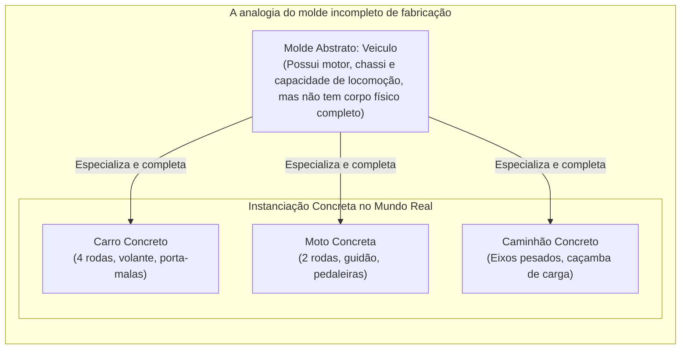
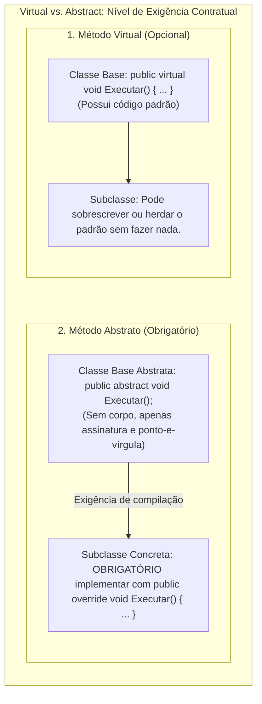
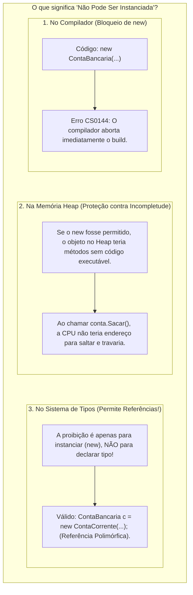
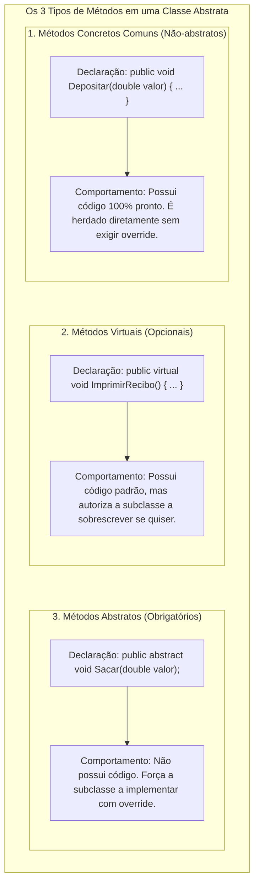
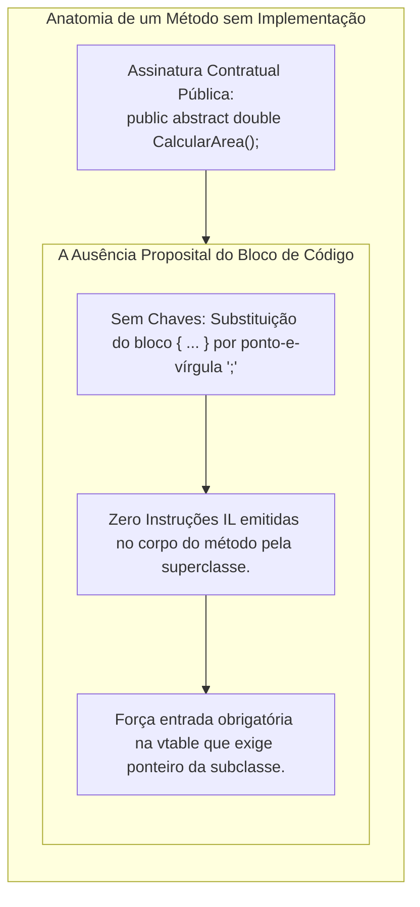
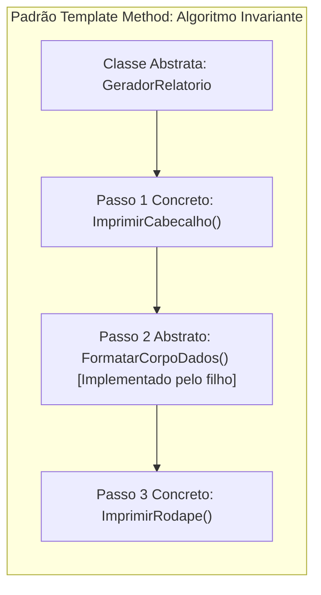
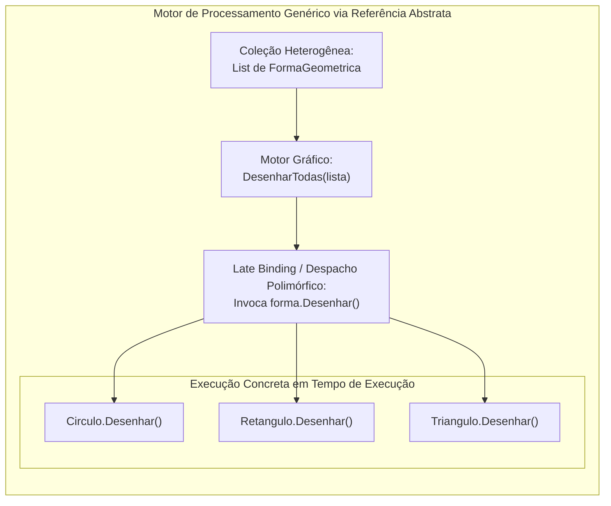
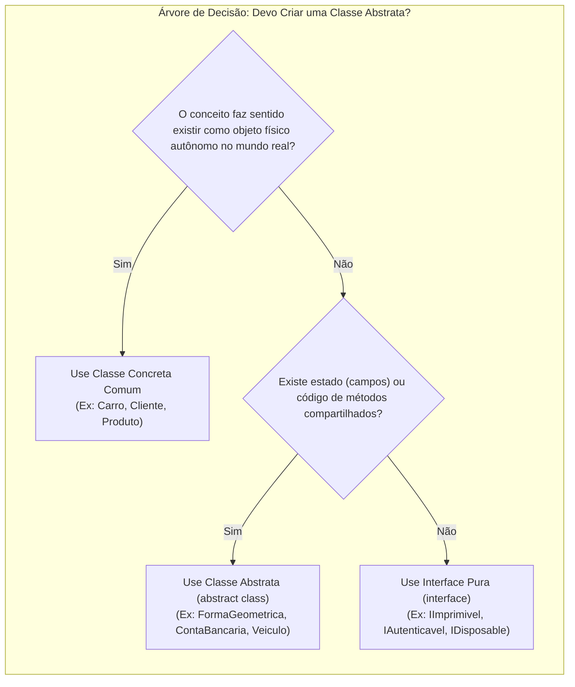

# 18. Classes abstratas e métodos abstratos

> **Contexto:** Nesta sessão você irá conhecer o que é herança de **classes abstratas** e como elas podem ser utilizadas para **potencializar o polimorfismo e criar programas realmente genéricos**. Exploramos a [[Glossário de conceitos#59. Palavra-chave abstract (Abstract Keyword / Modificador abstract)|palavra-chave `abstract`]], o impedimento de instanciação direta (`new ClasseAbstrata()` gera erro de compilação), a definição de **métodos abstratos** como obrigações contratuais para as subclasses, o padrão de projeto **Template Method**, a coexistência de métodos concretos e abstratos na mesma estrutura, e a matriz comparativa definitiva entre **Classes Concretas vs. Classes Abstratas vs. Interfaces**.

---

## 1. O que é uma classe abstrata? (A intuição da técnica de Feynman)

Imagine a planta baixa de um **veículo a motor** ou a receita de uma **torta genérica**:



* **A impossibilidade física de fabricação direta:** Ninguém entra em uma concessionária e diz: *"Por favor, me venda um 'Veículo' genérico, nem carro, nem moto, nem caminhão, apenas um veículo puro"*. Isso não existe no mundo real!
* **A função do molde abstrato:** Embora você não possa fabricar um "Veículo" genérico, o conceito de veículo é indispensável para definir o que todos os automóveis compartilham (número do chassi, tanque de combustível, motor, acelerar e frear).
* **No software:** Uma **[[Glossário de conceitos#57. Classe abstrata (Abstract Class)|classe abstrata]]** funciona exatamente como esse molde incompleto. Ela define a estrutura comum e as regras de negócio compartilhadas, mas **proíbe o compilador de criar instâncias diretas (`new`)**, forçando subclasses concretas a preencherem as partes que faltam.

---

## 2. Por que usar classes abstratas? (O salto de design)

No [[17. Sobreposição de métodos (virtual e override)|Artigo 17]], vimos como classes concretas podem usar `virtual` e `override`. No entanto, deixar a superclasse como uma classe comum e instanciável traz dois riscos arquiteturais graves:

1. **Instanciação indevida de conceitos incompletos:**
   - Se a classe `Funcionario` ou `FormaGeometrica` for comum, um desenvolvedor desatento pode executar `new FormaGeometrica()` ou `new Funcionario()`. Mas qual é a área de uma "Forma" sem lados definidos? Qual é o bônus de um "Funcionário" sem cargo? Permitir essa criação gera objetos com estado inconsistente.
2. **Falta de obrigatoriedade na especialização:**
   - Um método `virtual` fornece uma implementação padrão opcional. Se a subclasse esquecer de dar `override`, o código compila normalmente. Em contrapartida, um **[[Glossário de conceitos#58. Método abstrato (Abstract Method)|método abstrato]]** transforma a especialização em uma **obrigação contratual inegociável**: se a subclasse não implementar o método, ela não compila!



---

## 3. Sintaxe e regras fundamentais no C#

A declaração de classes e métodos abstratos segue regras estritas validadas pelo compilador:

### A. Declaração da classe abstrata
Utiliza o [[Glossário de conceitos#59. Palavra-chave abstract (Abstract Keyword / Modificador abstract)|modificador `abstract`]] antes da palavra-chave `class`:

```csharp
// Uma classe abstrata não pode ser instanciada diretamente com 'new'
public abstract class ContaBancaria 
{
    // Atributos e estado encapsulado (campos concretos normais)
    private readonly string _numero;
    private double _saldo;

    // Construtor: Executado obrigatoriamente pelas subclasses via : base(...)
    protected ContaBancaria(string numero, double saldoInicial) 
    {
        _numero = numero;
        _saldo = saldoInicial;
    }

    public string Numero => _numero;
    public double Saldo => _saldo;

    // Método concreto comum: Herdado integralmente por todas as subclasses
    public void Depositar(double valor) 
    {
        if (valor <= 0) throw new ArgumentException("Valor de depósito inválido.");
        _saldo += valor;
    }

    // Método abstrato: NÃO possui chaves nem corpo; termina com ponto-e-vírgula ';'
    public abstract void Sacar(double valor);
}
```

### B. O que significa "classes abstratas não podem ser instanciadas"?

A frase **"classes abstratas não podem ser instanciadas"** é uma das regras de ouro da Programação Orientada a Objetos e significa três coisas complementares:



#### 1. Na sintaxe do código (Proibição do operador `new`):
Você não pode criar um objeto isolado do tipo abstrato:
```csharp
// ERRO DE COMPILAÇÃO CS0144: Cannot create an instance of the abstract type or interface 'ContaBancaria'
ContaBancaria conta = new ContaBancaria("12345", 1000.0); 
```

#### 2. Na arquitetura de memória (Proteção do runtime):
Se o compilador permitisse alocar um `new ContaBancaria()` no *Heap*, o que aconteceria quando alguém executasse `conta.Sacar(50)`?
Como o método `Sacar` é abstrato, **ele não possui instruções de máquina nem código de execução**. O processador não saberia para onde desviar o fluxo de instruções da CPU, resultando em uma falha catastrófica de ponteiro nulo ou corrupção de fluxo.

#### 3. Diferença vital: Instanciar um objeto vs. Declarar uma referência:
* **Você NÃO pode fazer:** `new ContaBancaria()` (criar a instância direta no *Heap*).
* **Você PODE (e deve) fazer:** `ContaBancaria c = new ContaCorrente()` (declarar uma variável de **referência polimórfica** do tipo `ContaBancaria` que aponta para um objeto de uma subclasse concreta no *Heap*).

---
A subclasse que herda de uma classe abstrata deve obrigatoriamente fornecer a implementação de todos os métodos abstratos utilizando o modificador `override`:

```csharp
public class ContaCorrente : ContaBancaria 
{
    private const double TaxaManutencao = 2.50;

    public ContaCorrente(string numero, double saldoInicial) 
        : base(numero, saldoInicial) 
    {
    }

    // Implementação obrigatória do contrato abstrato
    public override void Sacar(double valor) 
    {
        double totalDebito = valor + TaxaManutencao;
        if (totalDebito > Saldo) 
        {
            throw new InvalidOperationException("Saldo insuficiente com taxa.");
        }
        // Lógica de saque especializada da Conta Corrente
    }
}
```

---

### D. Classes abstratas podem ter métodos não-abstratos (concretos)?

**Sim, com certeza! Na verdade, esse é um dos seus maiores poderes arquiteturais.** 

Uma classe abstrata **não é obrigada** a ter apenas métodos abstratos. Ela pode (e geralmente deve) conter **três tipos de métodos simultaneamente**:



#### A diferença entre os três tipos na prática:

```csharp
public abstract class Veiculo 
{
    // 1. Método Concreto Comum (Não-abstrato):
    // Todo veículo liga o motor da mesmíssima forma (reúso de código 100% garantido).
    public void LigarMotor() 
    {
        Console.WriteLine("Injeção de combustível ativada e motor em funcionamento.");
    }

    // 2. Método Virtual (Não-abstrato com implementação padrão customizável):
    // A maioria buzina com som padrão, mas uma Ambulância pode personalizar com sirene.
    public virtual void Buzinar() 
    {
        Console.WriteLine("Bi-bi!");
    }

    // 3. Método Abstrato (Sem implementação):
    // Não existe aceleração genérica: Carro usa pedal, Moto usa manopla no guidão.
    public abstract void Acelerar(int intensidade);
}
```

* **Vantagem de engenharia:** Se uma classe abstrata só pudesse ter métodos abstratos (sem código nenhum), ela seria quase idêntica a uma interface antiga. A grande força da classe abstrata é justamente **combinar o reúso de código e estado com a flexibilidade da especialização forçada**!

---

### E. Métodos sem implementação (Por que existem e o que significam?)

Um **método sem implementação** (método abstrato) é a declaração pura de uma **intenção arquitetural**. Ele responde à pergunta *"o que deve ser feito"*, mas se recusa propositalmente a ditar *"como deve ser feito"*.



#### Por que não colocar um corpo vazio `{ }` em vez de `abstract`?

Muitos iniciantes tentam simular métodos abstratos criando métodos virtuais com corpo vazio:
```csharp
// MÁ PRÁTICA ARQUITETURAL: Método com corpo vazio
public virtual void EmitirSom() 
{
    // Corpo vazio... O compilador não obriga a subclasse a sobrescrever!
}
```
* **O perigo do corpo vazio:** Se você esquecer de sobrescrever `EmitirSom()` na subclasse `Gato`, o programa compilará normalmente e o gato ficará mudo em silêncio no sistema (um bug silencioso e difícil de rastrear!).
* **A segurança do método sem implementação (`abstract`):** Ao remover o corpo e declarar como `abstract`, o compilador atua como um **guardião ativo**: se a subclasse esquecer de implementar o método, o código **não compila**. O erro é detectado instantaneamente na IDE, garantindo a integridade do sistema antes de ir para produção.

---

## 4. O padrão arquitetural Template Method (O método gabarito)

Um dos maiores poderes práticos das classes abstratas é a criação do padrão de projeto **Template Method** (*Método Gabarito*):

> **Definição:** O *Template Method* define o **esqueleto invariante de um algoritmo** em um método concreto na superclasse abstrata, delegando etapas variáveis específicas para serem implementadas nas subclasses através de métodos abstratos ou virtuais.



### Exemplo atômico em C#:

```csharp
public abstract class ProcessadorPagamento 
{
    // Template Method: Define a sequência rígida e imutável do processo
    public void Processar(decimal valor) 
    {
        RegistrarLogAuditoria("Iniciando transação.");
        ValidarFraude(valor);          // Passo comum concreto
        DebitarValor(valor);           // Passo abstrato especializado!
        EnviarComprovanteCliente();    // Passo comum concreto
        RegistrarLogAuditoria("Transação finalizada com sucesso.");
    }

    private void RegistrarLogAuditoria(string mensagem) => Console.WriteLine($"[LOG]: {mensagem}");
    private void ValidarFraude(decimal valor) => Console.WriteLine($"Validando antifraude para R$ {valor}...");
    private void EnviarComprovanteCliente() => Console.WriteLine("Comprovante enviado por e-mail.");

    // Cada meio de pagamento preenche apenas como o débito físico acontece
    protected abstract void DebitarValor(decimal valor);
}

// Subclasse 1: Cartão de Crédito
public class PagamentoCartaoCredito : ProcessadorPagamento 
{
    protected override void DebitarValor(decimal valor) 
    {
        Console.WriteLine($"Comunicando com adquirente da maquininha: Debitados R$ {valor}.");
    }
}

// Subclasse 2: PIX
public class PagamentoPix : ProcessadorPagamento 
{
    protected override void DebitarValor(decimal valor) 
    {
        Console.WriteLine($"Liquidando via Banco Central (BACEN): Transferidos R$ {valor}.");
    }
}
```

---

## 5. Matriz comparativa: Classe Concreta vs. Classe Abstrata vs. Interface

Para nunca mais confundir esses três pilares da programação modular e da POO:

| Dimensão técnica | Classe concreta (`class`) | Classe abstrata (`abstract class`) | Interface (`interface`) |
| :--- | :--- | :--- | :--- |
| **Pode ser instanciada diretamente (`new`)?** | **Sim.** Possui implementação 100% completa. | **Não.** O compilador impede a criação direta. | **Não.** Representa apenas um contrato sem estado. |
| **Pode conter atributos e campos de instância?** | **Sim.** Armazena estado concreto. | **Sim.** Armazena estado comum e campos `private`/`protected`. | **Não.** Não armazena estado de instância (apenas propriedades contratuais). |
| **Pode conter métodos concretos com código?** | **Sim.** Todos os métodos têm corpo. | **Sim.** Pode misturar métodos com código e métodos abstratos. | **Apenas métodos padrão (*default methods*)**, mas historicamente apenas assinaturas puras. |
| **Pode conter métodos abstratos sem corpo?** | **Não.** Não permite métodos sem implementação. | **Sim.** Métodos com `abstract` que exigem `override`. | **Sim.** Todas as assinaturas são implicitamente abstratas. |
| **Herança no C# e Java** | Herança simples (apenas 1 classe pai). | Herança simples (apenas 1 classe pai). | **Herança múltipla** (uma classe implementa $N$ interfaces). |
| **Possui construtores?** | **Sim.** Chamados normalmente. | **Sim.** Invocados obrigatoriamente pelas subclasses via `: base(...)`. | **Não.** Interfaces não possuem construtores. |
| **Relação semântica central** | Entidade completa e tangível (*is-a*). | Esqueleto taxonômico incompleto (*is-a*). | Capacidade, habilidade ou protocolo (*can-do*). |
| **Analogia de Feynman** | **O bolo pronto e assado na vitrine.** | **A receita base com etapas a preencher.** | **O cardápio da recepção.** |

---

## 6. O impacto no polimorfismo e em programas genéricos

Quando uma classe abstrata é colocada no topo de uma hierarquia, ela permite a construção de **motores de processamento 100% genéricos**:



O motor gráfico **nunca precisará ser alterado ou recompilado** quando você inventar uma nova forma geométrica no futuro (como `Trapezio` ou `Hexagono`). Basta criar a nova classe herdando de `FormaGeometrica` e sobrescrever o método `Desenhar()`. O sistema adere 100% ao **Princípio Aberto/Fechado (OCP)**!

---

## 7. Exemplo completo e integrado em C# (Sistema geométrico e cálculo de áreas)

Abaixo apresentamos um programa completo, compilável e executável que integra todos os conceitos: classe abstrata com estado encapsulado, construtores encadeados, método abstrato de cálculo, método abstrato de representação textual, e um motor polimórfico de renderização.

```csharp
using System;
using System.Collections.Generic;
using System.Globalization;

namespace ProgramacaoModular.Geometria 
{
    // =========================================================================
    // 1. SUPERCLASSE ABSTRATA (MOLDE GENÉRICO)
    // =========================================================================
    public abstract class FormaGeometrica 
    {
        // Estado comum a todas as formas
        private readonly string _cor;

        // Construtor protegido: somente classes derivadas podem chamar
        protected FormaGeometrica(string cor) 
        {
            if (string.IsNullOrWhiteSpace(cor))
                throw new ArgumentException("A cor da forma não pode ser vazia.");
            _cor = cor;
        }

        public string Cor => _cor;

        // Método concreto comum: herdado integralmente por todos
        public void ExibirIdentificacao() 
        {
            Console.WriteLine($"Forma geométrica de cor: {_cor}");
        }

        // Métodos abstratos: OBRIGAÇÃO contratual para todas as subclasses
        public abstract double CalcularArea();
        public abstract double CalcularPerimetro();

        // Sobrescrita do ToString universal de System.Object
        public override string ToString() 
        {
            return $"[{GetType().Name}] Cor: {_cor} | Área: {CalcularArea():F2} | Perímetro: {CalcularPerimetro():F2}";
        }
    }

    // =========================================================================
    // 2. SUBCLASSE CONCRETA 1: CÍRCULO
    // =========================================================================
    public class Circulo : FormaGeometrica 
    {
        private readonly double _raio;

        public Circulo(string cor, double raio) : base(cor) 
        {
            if (raio <= 0) throw new ArgumentOutOfRangeException(nameof(raio), "O raio deve ser positivo.");
            _raio = raio;
        }

        public double Raio => _raio;

        public override double CalcularArea() => Math.PI * Math.Pow(_raio, 2);
        public override double CalcularPerimetro() => 2 * Math.PI * _raio;
    }

    // =========================================================================
    // 3. SUBCLASSE CONCRETA 2: RETÂNGULO
    // =========================================================================
    public class Retangulo : FormaGeometrica 
    {
        private readonly double _largura;
        private readonly double _altura;

        public Retangulo(string cor, double largura, double altura) : base(cor) 
        {
            if (largura <= 0) throw new ArgumentOutOfRangeException(nameof(largura), "A largura deve ser positiva.");
            if (altura <= 0) throw new ArgumentOutOfRangeException(nameof(altura), "A altura deve ser positiva.");
            _largura = largura;
            _altura = altura;
        }

        public double Largura => _largura;
        public double Altura => _altura;

        public override double CalcularArea() => _largura * _altura;
        public override double CalcularPerimetro() => 2 * (_largura + _altura);
    }

    // =========================================================================
    // 4. MOTOR POLIMÓRFICO DE PROCESSAMENTO (CÓDIGO CLIENTE GENÉRICO)
    // =========================================================================
    public class RenderizadorGeometrico 
    {
        public static void ProcessarRelatorio(List<FormaGeometrica> formas) 
        {
            double areaTotal = 0;
            Console.WriteLine("==================================================");
            Console.WriteLine("RELATÓRIO POLIMÓRFICO DE FORMAS GEOMÉTRICAS");
            Console.WriteLine("==================================================");

            foreach (var forma in formas) 
            {
                // Chamada polimórfica via referência abstrata FormaGeometrica:
                Console.WriteLine(forma); // Invoca forma.ToString() via dynamic dispatch
                areaTotal += forma.CalcularArea();
            }

            Console.WriteLine("--------------------------------------------------");
            Console.WriteLine($"Área Total Ocupada: {areaTotal.ToString("F2", CultureInfo.InvariantCulture)} m²");
            Console.WriteLine("==================================================\n");
        }
    }

    // =========================================================================
    // 5. PROGRAMA PRINCIPAL
    // =========================================================================
    class Program 
    {
        static void Main() 
        {
            // Note que não podemos fazer: new FormaGeometrica("Azul"); -> Erro de compilação!
            var colecaoFormas = new List<FormaGeometrica> 
            {
                new Circulo("Vermelho", 5.0),
                new Retangulo("Azul", 4.0, 6.0),
                new Circulo("Verde", 2.5),
                new Retangulo("Amarelo", 10.0, 2.0)
            };

            RenderizadorGeometrico.ProcessarRelatorio(colecaoFormas);
        }
    }
}
```

---

## 8. Quando usar e quando não usar classes abstratas? (Guia prático de decisão)

A escolha de tornar uma classe abstrata é uma decisão de **arquitetura de software**, e não um mero detalhe sintático:



---

### Quando USAR classes abstratas:
1. **Modelagem de conceitos incompletos (*is-a* genuíno):**
   - Quando você está construindo uma hierarquia onde a raiz é uma generalização sem representação física direta (`Veiculo`, `Animal`, `DocumentoFiscal`, `DispositivoEntrada`).
2. **Reaproveitamento de estado e lógica comum (Evitar duplicação):**
   - Quando todas as subclasses precisam herdar atributos encapsulados (como `_numero`, `_saldo`, `_dataCriacao`) e métodos concretos idênticos (`Depositar()`, `CalcularDataVencimento()`).
3. **Aplicação de padrões de projeto estruturais (*Template Method*):**
   - Quando você quer definir a ordem estrita de um processo na superclasse e obrigar as subclasses a preencherem apenas os passos específicos.
4. **Evolução de bibliotecas e controle de versões (*Frameworks*):**
   - Em C#, você pode adicionar novos métodos concretos em uma classe abstrata no futuro sem quebrar o código das subclasses existentes.

---

### Quando NÃO USAR classes abstratas:
1. **Para classes que representam objetos finais e completos:**
   - Se uma classe já possui todos os dados e comportamentos necessários para operar no sistema (como `NotaFiscalPaulista`, `ContaCorrenteEmpresarial`), ela deve ser uma classe concreta comum.
2. **Para relacionamentos entre classes de famílias totalmente distintas:**
   - Se um `Carro`, um `Usuario` e um `RelatorioPDF` precisam ser impressos ou exportados para JSON, eles **não devem herdar de uma classe abstrata comum `Imprimivel`** (isso forçaria uma herança artificial absurda). Nesse cenário, utilize uma **interface** (`IImprimivel`, `IExportavelJson`).
3. **Apenas para reaproveitar funções utilitárias sem parentesco:**
   - Se você precisa de funções auxiliares de cálculo matemático ou manipulação de texto, utilize uma classe estática utilitária (`MathUtils`, `StringUtils`) ou composição, em vez de herança.
4. **Hierarquias profundas demais (Anti-pattern *Yo-Yo*):**
   - Evite criar cadeias excessivas de classes abstratas (`A -> abstract B -> abstract C -> abstract D -> Concreta E`). Hierarquias com mais de 3 níveis tornam a manutenção complexa e violam a heurística *"prefira composição a herança"*.

---

### Tabela-Resumo: Quando escolher cada recurso

| Cenário arquitetural | Recurso ideal | Por quê? |
| :--- | :--- | :--- |
| Criar uma família com atributos comuns e etapas obrigatórias. | **Classe Abstrata** | Compartilha campos, construtores e exige `override`. |
| Padronizar um comportamento entre classes de domínios diferentes. | **Interface** | Habilita herança múltipla sem forçar acoplamento de estado. |
| Objeto completo do domínio que será criado em tela ou banco. | **Classe Concreta** | Permite instanciação direta com operador `new`. |
| Agrupamento de funções utilitárias ou cálculos matemáticos puros. | **Classe Estática** | Não mantém estado de instância nem permite herança. |

---

## 9. Boas práticas no design de classes abstratas

1. **Proteja os construtores da classe abstrata com `protected`:**
   - Como a classe não pode ser instanciada diretamente com `public`, declarar seus construtores como `protected` comunica com clareza que apenas classes derivadas têm permissão para acioná-los.
2. **Mantenha os métodos abstratos no menor número indispensável:**
   - Não force métodos como abstratos se houver um comportamento padrão universal que atenda 90% dos casos.
3. **Respeite o Princípio da Substituição de Liskov (LSP):**
   - A subclasse concreta deve honrar todas as garantias semânticas e invariantes prometidas pela superclasse abstrata.
4. **Respeite o Princípio da Segregação de Interfaces (ISP):**
   - Não infle a classe abstrata com comportamentos periféricos que nem todas as subclasses conseguem cumprir. Se um comportamento for opcional, extraia-o para uma **interface**.

---

## Referências bibliográficas

### Bibliografia básica
* RICHTER, Jeffrey. **CLR via C#**. 4. ed. Redmond: Microsoft Press, 2012.
* MARTIN, Robert C.; MARTIN, Micah. **Princípios, padrões e práticas ágeis em C#**. Porto Alegre: Bookman, 2011.
* MICROSOFT. **Classes e Membros de Classes Abstratas e Lacradas (Guia de Programação em C#)**. Microsoft Learn, 2023. Disponível em: [https://learn.microsoft.com/pt-br/dotnet/csharp/programming-guide/classes-and-structs/abstract-and-sealed-classes-and-class-members](https://learn.microsoft.com/pt-br/dotnet/csharp/programming-guide/classes-and-structs/abstract-and-sealed-classes-and-class-members).

### Bibliografia complementar
* GAMMA, Erich et al. **Padrões de Projeto: Soluções Reutilizáveis de Software Orientado a Objetos**. Porto Alegre: Bookman, 2000.
* DE PAULA, Hugo. **Programação Modular: Classes Abstratas e Polimorfismo**. GitHub, 2023. Disponível em: [https://github.com/hugodepaula/programacao-modular-ead](https://github.com/hugodepaula/programacao-modular-ead).

---

## Artigos relacionados e navegação

* **Artigo anterior:** [[17. Sobreposição de métodos (virtual e override)]]
* **Resumo da disciplina:** [[00. Programação modular - Resumo]]
* **Glossário da disciplina:** [[Glossário de conceitos]]
* **Ver Herança e Subtipagem:** [[15. Herança (generalização, especialização e extensibilidade modular)]]
* **Ver Construtores em Subclasses:** [[16. Construtores em classes filhas (ordem de inicialização e a cláusula base)]]
* **Guia de sintaxe multilinguagem (Herança e superclasses):** [[00. Sintaxe Multilinguagem/11. Herança, superclasses e subclasses (sintaxe comparada e extensibilidade)]]
* **Índice geral do vault:** [[index.md|Página inicial do vault]]
