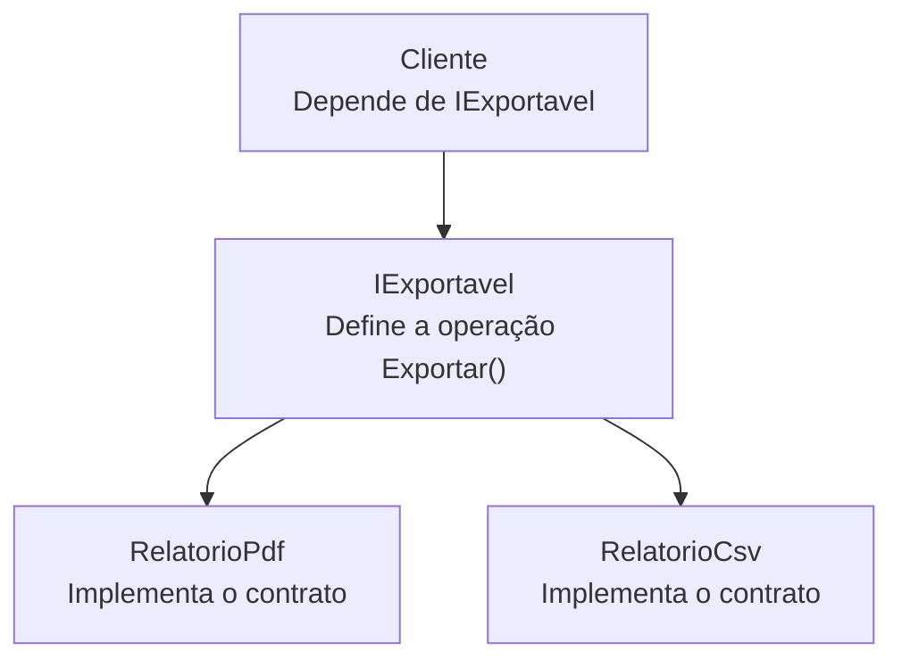

# Interfaces, contratos e polimorfismo por interface

> **Contexto:** Esta nota introduz interfaces como contratos de capacidade. A explicação distingue regra da linguagem C#, decisão de projeto e possível detalhe de runtime; o código preserva a cobertura necessária para entender implementação, referência por interface e múltiplas interfaces.

**Percurso de leitura:** conceito central → mecânica em C# → aprofundamento técnico → conexões.

## 1. Conceito central

Uma interface responde a uma pergunta diferente da herança de classe. Herança modela uma relação de especialização entre tipos; uma interface publica um conjunto de operações que um tipo se compromete a oferecer. `RelatorioPdf` e `RelatorioCsv` podem ser classes sem uma relação de “é um” entre si e, ainda assim, implementar `IExportavel`.



* **Contrato:** nomes, tipos, assinaturas e regras de uso que o consumidor pode esperar.
* **Implementação:** código concreto que satisfaz o contrato.
* **Capacidade:** “é capaz de exportar”, sem afirmar que todo exportador pertence à mesma hierarquia de classes.

## 2. Mecânica em C#

### Declaração e implementação

```csharp
public interface IExportavel
{
    string Exportar();
}

public sealed class RelatorioCsv : IExportavel
{
    public string Exportar()
    {
        return "id,nome";
    }
}
```

O compilador verifica que uma classe concreta fornece os membros exigidos pela interface. A interface não cria uma instância e não fornece, por si só, armazenamento de instância. Uma classe pode implementar mais de uma interface:

```csharp
public interface IValidavel
{
    bool Validar();
}

public class Pedido : IExportavel, IValidavel
{
    public string Exportar() => "pedido";
    public bool Validar() => true;
}
```

### Referência por interface

```csharp
IExportavel exportador = new RelatorioCsv();
Console.WriteLine(exportador.Exportar());
```

A variável declara o contrato que pode usar; o objeto concreto continua sendo `RelatorioCsv`. O despacho da chamada escolhe a implementação do objeto em execução. O código cliente não precisa conhecer o construtor, os campos ou a estrutura de dados do relatório.

## 3. Aprofundamento técnico

### Interface, classe abstrata e herança

| Recurso | Pergunta principal | Pode manter estado de instância? | Relação dominante |
| :--- | :--- | :---: | :--- |
| Interface | Quais operações este tipo oferece? | Não como campos de instância compartilhados pelo contrato | Capacidade e contrato |
| Classe abstrata | O que tipos relacionados compartilham? | Sim, na parte base | Especialização e reutilização |
| Classe concreta | Qual objeto pode ser construído? | Sim | Implementação utilizável |

Uma classe abstrata pode implementar parcialmente uma interface e deixar membros abstratos para subclasses. Uma classe concreta pode implementar uma interface sem herdar de uma classe de domínio comum. A escolha depende do conhecimento que o modelo realmente possui e do grau de acoplamento aceitável.

### Implementação explícita

Quando duas interfaces têm membros com o mesmo nome ou quando uma operação não deve fazer parte da API pública da classe, C# permite implementação explícita:

```csharp
public interface ILeitor
{
    string Ler();
}

public interface IGravador
{
    string Ler();
}

public class Documento : ILeitor, IGravador
{
    string ILeitor.Ler() => "leitura pública";
    string IGravador.Ler() => "leitura de gravação";
}
```

O membro só é acessível depois de converter a referência para a interface correspondente. Isso resolve colisões deliberadamente; não é uma forma de esconder uma regra que deveria estar no contrato.

### O que uma interface não garante

Implementar uma interface não garante que a operação seja eficiente, pura, thread-safe ou semanticamente correta em todos os casos. Essas propriedades pertencem ao contrato documentado e aos testes. Uma interface também não impede que o objeto possua estado mutável ou que o cliente descubra seu tipo concreto por outras vias.

## 4. Conexões

* **Herança e sobreposição:** [[01. Programacao Modular/17. Sobreposição de métodos (virtual e override)|`virtual` e `override`]] escolhem uma implementação dentro de uma hierarquia; uma interface permite trocar implementações que nem precisam compartilhar classe base.
* **Classes abstratas:** [[01. Programacao Modular/18. Classes abstratas e métodos abstratos (contratos de herança e polimorfismo puro)|classes abstratas]] podem combinar estado comum com obrigações. Interface concentra o contrato de capacidade.
* **SOLID:** o princípio da segregação de interfaces recomenda contratos pequenos para que clientes não dependam de operações que não usam. A inversão de dependência costuma apontar módulos para interfaces estáveis.
* **UML e requisitos:** uma interface pode aparecer como contrato oferecido por um componente em um diagrama de classes ou de componentes, conectando o modelo a [[07. Engenharia de Requisitos/09. Modelagem estrutural com diagrama de classes da uml|UML]].
* **Sintaxe comparada:** a declaração e a implementação devem ser comparadas no [[00. Sintaxe Multilinguagem/06. Modificadores de acesso, escopo e a palavra-chave static|guia de sintaxe]].

## Referências bibliográficas

* MICROSOFT. [Interfaces (C# programming guide)](https://learn.microsoft.com/en-us/dotnet/csharp/fundamentals/types/interfaces). Microsoft Learn. Acesso em: 8 set. 2026.
* MEYER, Bertrand. **Object-Oriented Software Construction**. 2. ed. Prentice Hall, 1997.

## Artigos relacionados e navegação

* **Artigo anterior:** [[01. Programacao Modular/18. Classes abstratas e métodos abstratos (contratos de herança e polimorfismo puro)]]
* **Próximo artigo:** [[01. Programacao Modular/19. Classes e membros selados (sealed)]]
* **Resumo da disciplina:** [[01. Programacao Modular/00. Programação modular - Resumo]]
* **Glossário da disciplina:** [[01. Programacao Modular/Glossário de conceitos]]
