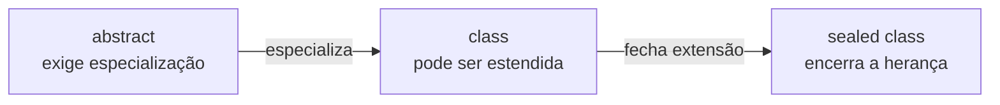
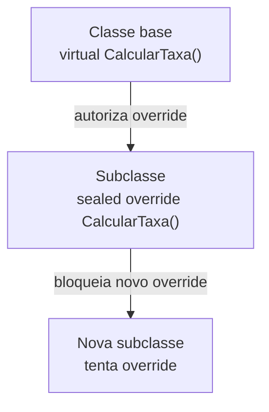
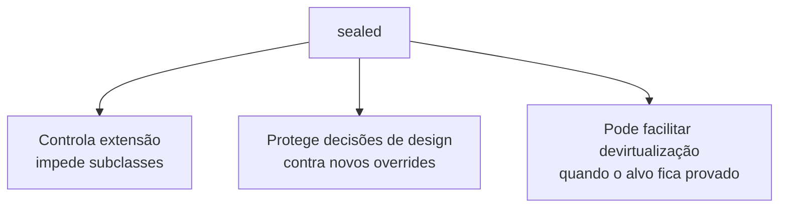
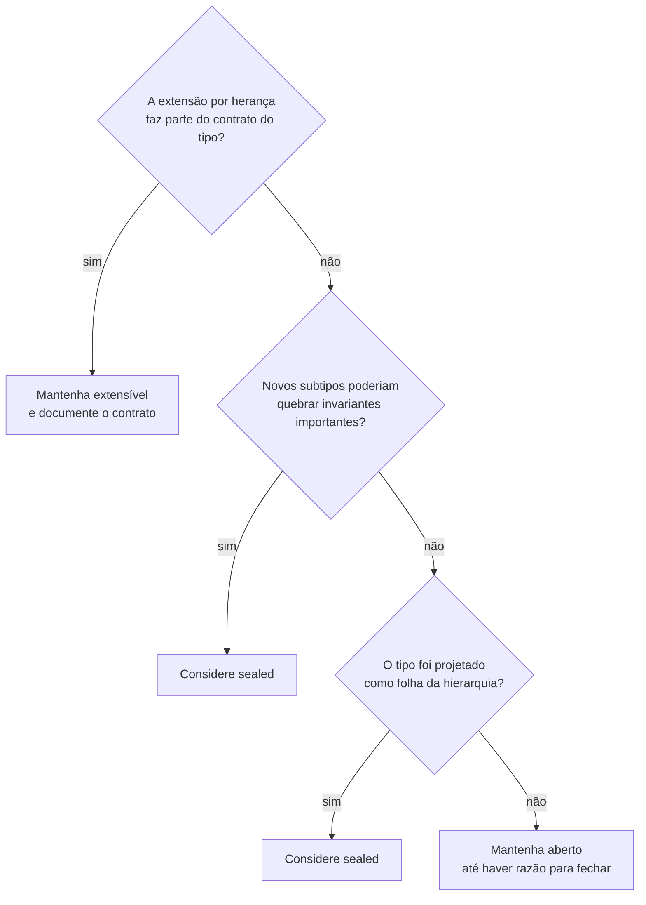

# Classes e membros selados (sealed)

> **Contexto:** Nesta sessão você irá compreender o que são **classes e membros selados (`sealed`)** e será capaz de identificar com precisão as situações arquiteturais em que eles são necessários. Exploramos o fechamento definitivo de hierarquias de herança, a interrupção de cadeias de sobreposição polimórfica (`sealed override`), as garantias de segurança contra adulteração comportamental, as otimizações profundas de desempenho realizadas pelo compilador JIT (*devirtualização e inlining*), a matriz comparativa de modificadores de herança e um exemplo completo e compilável em C#.

---

**Percurso de leitura:** conceito central → mecânica em C# → aprofundamento técnico → conexões.

## `sealed` e o fechamento da hierarquia

`sealed` fecha uma classe para herança ou encerra uma cadeia específica de `override`. A decisão é estrutural: impede extensões previstas naquele ponto.

### Intuição: bloquear extensão sem congelar objetos

Imagine o processo de criação de um **documento jurídico oficial** ou a embalagem de um **remédio lacrado de fábrica**:



* **A classe aberta (`abstract` / `class` comum):** É como uma receita de família ou um rascunho de contrato. Qualquer confeiteiro pode pegar a base e criar uma variação com cobertura diferente.
* **A classe selada (`sealed class`):** É como um contrato que encerra a extensão naquele ponto ou a **cédula oficial de dinheiro**. Ninguém tem permissão para criar uma "subclasse de nota de 100 reais" com regras próprias. O design é considerado **final, perfeito, completo e fechado contra qualquer adulteração**.
* **O membro selado (`sealed override`):** É como uma cláusula pétrea de uma constituição. Em uma família de classes, o avô permitiu alterações (`virtual`), mas o pai decidiu: *"A partir de mim, esta regra financeira está cravada e nenhum filho meu poderá modificá-la"*.

---

### Classes seladas e herança

Uma **classe selada** não pode ser utilizada como superclasse (classe pai) de nenhuma outra classe. Se qualquer desenvolvedor tentar derivar dela usando `:`, o compilador aborta o build imediatamente.

### Sintaxe de `sealed class` em C#
```csharp
// Declaração de uma classe selada
public sealed class CriptografiaSegura
{
    public string Criptografar(string dados)
    {
        return $"[HASH_SHA256:{dados.GetHashCode()}]";
    }
}

// TENTATIVA DE HERANÇA:
// ERRO DE COMPILAÇÃO CS0509: 'TentativaInvasao': cannot derive from sealed type 'CriptografiaSegura'
public class TentativaInvasao : CriptografiaSegura
{
}
```

### `System.String` como exemplo de classe selada
Você já se perguntou por que não pode criar uma classe `MinhaString : string` em C# ou Java?
* A classe **`string` (`System.String`)** é explicitamente declarada como `sealed` (e `final` em Java).
* **Motivo:** Strings são tipos fundamentais do runtime utilizados para credenciais de segurança, caminhos de arquivos no sistema operacional e reflexão de tipos. Se alguém pudesse criar uma subclasse de `string` e sobrescrever seu comparador interno para aceitar senhas incorretas, a segurança de todo o ecossistema .NET entraria em colapso.

---

### `sealed override` em métodos e propriedades

Em C#, o modificador `sealed` também pode ser aplicado a **métodos ou propriedades individuais**.

> [!IMPORTANT]
> **Regra de sintaxe mandatória:** Um método só pode ser marcado como `sealed` se ele for simultaneamente um **`override`** de um método virtual ancestral. Você **não pode** criar um `sealed void Metodo()` novo do zero (pois métodos comuns em C# já são não-virtuais por padrão).

### Interrupção da cadeia de sobreposição
O modificador `sealed override` permite que uma subclasse forneça uma especialização para um método `virtual`, mas **proíba terminantemente que suas próprias subclasses futuras voltem a sobrescrever aquele método**.



### Exemplo de `sealed override` em C#
```csharp
public class Funcionario
{
    public virtual void ProcessarPagamento()
    {
        Console.WriteLine("Pagamento padrão de funcionário.");
    }
}

public class Gerente : Funcionario
{
    // O Gerente sobrescreve o método e fecha a porta para sempre com 'sealed'
    public sealed override void ProcessarPagamento()
    {
        Console.WriteLine("Pagamento auditado de gerente com regras fiscais fixas.");
    }
}

public class DiretorRegional : Gerente
{
    // ERRO DE COMPILAÇÃO CS0239: 'DiretorRegional.ProcessarPagamento()':
    // cannot override inherited member 'Gerente.ProcessarPagamento()' because it is sealed
    /*
    public override void ProcessarPagamento()
    {
        Console.WriteLine("Tentativa de alterar o pagamento do diretor.");
    }
    */
}
```

---

### Compatibilidade entre `abstract` e `sealed`

Esta é uma questão clássica para testar a compreensão dos fundamentos da POO:

| Combinação | É válida? | Motivo |
| :--- | :---: | :--- |
| `abstract sealed class` | Não | `abstract` pressupõe especialização; `sealed` impede herança |
| Classe abstrata com `sealed override` | Sim | A classe pode continuar abstrata enquanto um membro específico encerra a cadeia de sobrescrita |

#### `abstract sealed class`: uma combinação inválida
* **NÃO.** Isso gera um **paradoxo lógico absoluto** e resulta no **Erro de Compilação CS0418** (`'MinhaClasse': an abstract class cannot be sealed or static`).
* **Por quê?**
  - Uma classe **abstrata (`abstract`)** não pode ser instanciada diretamente com `new` (sua única razão de existir é ser herdada).
  - Uma classe **selada (`sealed`)** proíbe terminantemente que qualquer outra classe herde dela.
  - Se uma classe fosse simultaneamente abstrata e selada, **ela nunca poderia ser instanciada e nunca poderia ser herdada** — ou seja, seria um "código fantasma" 100% inútil que jamais poderia ser utilizado por ninguém no programa.

#### `sealed override` dentro de classes abstratas
* **SIM, com certeza!**
* **Como funciona?**
  - Se uma classe abstrata intermediária herda de uma superclasse que possui um método `virtual`, a classe abstrata pode fornecer uma implementação especializada definitiva com `public sealed override void Metodo()` para fechar a regra dali para frente.
  - As subclasses concretas que herdarem dessa classe abstrata poderão ser instanciadas e herdarão o método normalmente, mas o compilador as proibirá de tentar sobrescrever esse método selado.

```csharp
public class Documento
{
    public virtual void Auditar() => Console.WriteLine("Auditoria genérica.");
}

// Classe abstrata intermediária:
public abstract class DocumentoFiscal : Documento
{
    // Totalmente permitido: fecha a regra de auditoria para todas as notas fiscais filhas!
    public sealed override void Auditar()
    {
        Console.WriteLine("Auditoria fiscal blindada por lei.");
    }

    public abstract void Emitir(); // Método abstrato que as filhas concretas devem implementar
}

public class NotaFiscalServico : DocumentoFiscal
{
    public override void Emitir() => Console.WriteLine("Emitindo NFS-e...");
    // public override void Auditar() -> ERRO CS0239! Auditar() é selado.
}
```

---

## Segurança, desempenho e invariantes com `sealed`

Leia primeiro a sintaxe e os erros de compilação. Depois compare classe privada, classe selada, membro selado e o exemplo integrado.

### Motivos para selar classes e membros

A decisão de utilizar o modificador `sealed` baseia-se na **tríade clássica da engenharia de linguagens**:



### Segurança, previsibilidade e otimização

1. **Segurança (*Security, Protection & Business Rule Enforcement*):**
   - **Imposição compulsória de regras de negócio (*Enforced Rules*):** No desenvolvimento corporativo, certas regras regulatórias (como cálculo de juros do BACEN, validação de notas fiscais ou retenção de impostos) não são opcionais e **não podem ficar à mercê do bom senso de outros programadores da equipe**.
   - **Garantia em nível de compilador:** Em vez de confiar em "comentários no código" ou "documentação de aviso", o arquiteto usa `sealed` para **impor a regra de negócio diretamente no motor do compilador**. Se um desenvolvedor tentar criar uma subclasse ou sobrescrever o método para "burlar" a validação, o compilador aborta o build e impede o deploy do software adulterado.
   - **Proteção contra ataques e injeção comportamental:** Protege classes críticas do sistema (senhas, tokens JWT, criptografia e manipulação de memória) contra substituição de métodos por bibliotecas externas maliciosas.
2. **Performance (*Runtime Optimization & Inlining*):**
   - **Devirtualização pelo compilador JIT:** Quando o compilador sabe que a classe é `sealed`, ele tem a garantia de que nenhum tipo possa herdar daquela classe no código verificado. O JIT pode devirtualizar e aplicar *inlining* quando prova que isso é seguro; `sealed` é apenas um dos sinais disponíveis.
3. **Segurança de tipos (*Type Safety & Predictability*):**
   - **Previsibilidade semântica total:** Em um sistema fortemente tipado, o compilador e o desenvolvedor têm certeza absoluta de que uma variável `CriptografiaSegura c` aponta para a implementação original, e **não para um subtipo disfarçado** que altere comportamentos esperados. Isso reduz extensões possíveis; não substitui testes, contratos e invariantes bem definidos.

---

### `const`, `readonly` e `sealed`: restrições diferentes

Para ter uma visão integral da arquitetura de software, é fundamental entender que o modificador **`sealed`** é a manifestação da **imutabilidade aplicada à hierarquia de tipos**:

1. **Imutabilidade em nível de dados ([[00. Sintaxe Multilinguagem/01. Variáveis, tipos e atribuição#Constantes e imutabilidade (const, final, readonly)|const e readonly]]):**
   - Garante que os **valores da memória** não sofram mutação após serem gravados.
2. **Imutabilidade em nível de comportamento e hierarquia (`sealed`):**
   - Garante que a **estrutura taxonômica e os métodos** não sofram adulteração ou desvios por herança.
   - Em Java, uma única palavra-chave (`final`) cobre ambos os casos (`final int MAX = 10;` e `final class Seguranca`). No C#, a linguagem oferece termos dedicados e autoexplicativos para cada propósito (`const`/`readonly` para dados, e `sealed` para classes/métodos — veja o comparativo no [[00. Sintaxe Multilinguagem/11. Herança, superclasses e subclasses (sintaxe comparada e extensibilidade)#Fechamento de herança e a filosofia da imutabilidade (sealed, final, const, readonly)|Guia de Sintaxe 11]]).

---

### Despacho virtual e oportunidades de otimização

Para entender por que o `sealed` é tão celebrado em benchmarks de alta performance (como no desenvolvimento do motor .NET Core / .NET 8), precisamos olhar o que acontece **dentro dos registradores da CPU e da memória RAM**.

| Aspecto | Chamada virtual aberta | Tipo ou membro selado |
| :--- | :--- | :--- |
| Possíveis implementações | Pode haver múltiplos overrides | A cadeia de extensão é limitada naquele ponto |
| Decisão do JIT | Pode exigir despacho virtual | Pode haver mais informação para devirtualizar |
| Garantia de otimização | Não | Também não: a otimização depende do JIT e do contexto |

---

### Custo do despacho virtual
Quando você chama um método polimórfico (`virtual`), a CPU não pode simplesmente pular para um endereço de memória fixo. Ela é obrigada a pagar 3 custos:
1. **Múltiplos saltos indiretos na memória (*Pointer Chasing*):** A CPU lê a variável na *Stack*, viaja até o endereço do objeto no *Heap*, lê o ponteiro `vptr` no cabeçalho do objeto, viaja até a tabela *vtable* e finalmente lê o endereço da função.
2. **Barreira ao *Inlining* (Embutimento de código):** O compilador JIT **não consegue embutir** o código do método diretamente no local da chamada porque ele não tem certeza absoluta se em tempo de execução o objeto será da classe `A`, `B` ou `C`.
3. **Custo de criação de quadros na *Stack* (*Stack Frame Overhead*):** Cada chamada não embutida exige que a CPU salve registradores, crie um novo quadro de execução na pilha e faça o retorno (`RET`). Em um loop de 10 milhões de repetições (como processamento gráfico, cálculo de matrizes ou streaming de sockets), isso consome bilhões de ciclos de clock à toa.

---

### Devirtualização possibilitada por `sealed`

1. **Devirtualização Estática (*Devirtualization*):**
   - Ao analisar uma classe ou método marcado como `sealed`, o compilador JIT sabe que **é impossível existir uma subclasse derivada**. Ele descarta a instrução lenta `callvirt` e emite uma instrução de salto direto `call`.
2. **Embutimento de Código (*Method Inlining*):**
   - Como o destino da função é 100% determinístico e fixo, o JIT apaga a instrução de chamada e **"cola" as instruções do método diretamente dentro do código chamador**.
   ```csharp
   // Sem sealed (Chamada de função indireta a cada iteração):
   for (int i = 0; i < 1_000_000; i++)
   {
       int area = forma.Calcular(); // Salto de memória + Stack Frame
   }

   // Com sealed + Inlining (O JIT substitui a chamada pelo cálculo puro!):
   for (int i = 0; i < 1_000_000; i++)
   {
       int area = forma._largura * forma._altura; // Zero salto, execução pura no registrador da CPU!
   }
   ```
3. **Aproveitamento máximo do cache de instrução L1/L2 da CPU:**
   - Como o processador não precisa pular para endereços de memória distantes, o código permanece carregado no cache ultrarrápido da CPU, evitando lentidão por *cache misses*.

---

### Modificadores de herança em comparação

Para ter uma visão consolidada de como a herança e o polimorfismo são controlados no C#:

| Modificador | Aplicável a | Instanciação com `new`? | Pode ser herdado (ter subclasses)? | Exige ou permite `override`? |
| :--- | :--- | :---: | :---: | :--- |
| **`abstract`** | Classes, Métodos, Propriedades | **Proibida** | **Obrigatório ter filhos** | Métodos abstratos exigem `override` obrigatório na subclasse. |
| *(Padrão / Comum)* | Classes, Métodos | **Permitida** | **Permitido ter filhos** | Métodos comuns não permitem `override` (resolução estática). |
| **`virtual`** | Métodos, Propriedades | *(N/A)* | *(N/A)* | Permite e convida subclasses a sobrescreverem opcionalmente. |
| **`override`** | Métodos, Propriedades | *(N/A)* | *(N/A)* | Redefine o comportamento herdado de um ancestral `virtual`/`abstract`. |
| **`sealed`** | Classes, Métodos `override` | **Permitida** | **PROIBIDO ter filhos** | Em classes, fecha a herança; em métodos, encerra a cadeia de `override`. |

---

### Exemplo integrado: pagamentos e segurança

O exemplo abaixo apresenta um sistema bancário compilável que combina **classes abstratas**, **métodos virtuais**, **métodos selados** e **classes totalmente seladas**:

```csharp
using System;
using System.Collections.Generic;

namespace ProgramacaoModular.SegurancaFinanceira
{
    // =========================================================================
    // 1. SUPERCLASSE ABSTRATA: CONTRATO GERAL DE TRANSAÇÃO
    // =========================================================================
    public abstract class TransacaoBancaria
    {
        private readonly string _identificador;
        private readonly DateTime _dataHora;

        protected TransacaoBancaria(string identificador)
        {
            _identificador = identificador;
            _dataHora = DateTime.UtcNow;
        }

        public string Identificador => _identificador;
        public DateTime DataHora => _dataHora;

        // Template Method: Algoritmo invariante
        public void ExecutarTransacao(decimal valor)
        {
            Console.WriteLine($"\n--- Processando Transação: {_identificador} ---");
            AuditarInicio();
            ValidarNormasBacen(valor); // Método com selagem na hierarquia
            ProcessarDebito(valor);     // Método abstrato especializado
            AuditarFim();
        }

        private void AuditarInicio() => Console.WriteLine($"[AUDITORIA]: Transação iniciada em {_dataHora:dd/MM/yyyy HH:mm:ss} UTC.");
        private void AuditarFim() => Console.WriteLine("[AUDITORIA]: Transação gravada no livro-razão imutável.");

        // Método virtual: permite sobreposição inicial
        public virtual void ValidarNormasBacen(decimal valor)
        {
            if (valor <= 0) throw new ArgumentException("O valor da transação deve ser estritamente positivo.");
            Console.WriteLine("[BACEN]: Validação básica de conformidade aprovada.");
        }

        protected abstract void ProcessarDebito(decimal valor);
    }

    // =========================================================================
    // 2. SUBCLASSE INTERMEDIÁRIA: APLICA SELAGEM DE MÉTODO (SEALED OVERRIDE)
    // =========================================================================
    public class PagamentoPix : TransacaoBancaria
    {
        private readonly string _chavePix;

        public PagamentoPix(string identificador, string chavePix)
            : base(identificador)
        {
            _chavePix = chavePix;
        }

        public string ChavePix => _chavePix;

        // SELAGEM DE MÉTODO: Nenhuma subclasse de Pix poderá adulterar a validação do BACEN!
        public sealed override void ValidarNormasBacen(decimal valor)
        {
            base.ValidarNormasBacen(valor);
            if (valor > 50000.00m)
            {
                Console.WriteLine("[BACEN-ALERTA]: Notificação compulsória enviada ao COAF para valores acima de R$ 50.000.");
            }
        }

        protected override void ProcessarDebito(decimal valor)
        {
            Console.WriteLine($"[PIX]: Liquidando R$ {valor:F2} instantaneamente para a chave: {_chavePix}");
        }
    }

    // =========================================================================
    // 3. SUBCLASSE FINAL SELADA (SEALED CLASS): NINGUÉM PODE HERDAR DELA!
    // =========================================================================
    public sealed class PagamentoPixInternacional : PagamentoPix
    {
        private readonly string _paisDestino;

        public PagamentoPixInternacional(string identificador, string chavePix, string paisDestino)
            : base(identificador, chavePix)
        {
            _paisDestino = paisDestino;
        }

        public string PaisDestino => _paisDestino;

        // Note: NÃO podemos sobrescrever ValidarNormasBacen aqui porque ela foi declarada como 'sealed override' em PagamentoPix!

        protected override void ProcessarDebito(decimal valor)
        {
            Console.WriteLine($"[PIX-GLOBAL]: Convertendo e liquidando R$ {valor:F2} para o país: {_paisDestino} (Chave: {ChavePix})");
        }
    }

    // =========================================================================
    // 4. PROGRAMA PRINCIPAL
    // =========================================================================
    class Program
    {
        static void Main()
        {
            Console.WriteLine("==================================================");
            Console.WriteLine("SISTEMA FINANCEIRO COM CLASSES E MÉTODOS SELADOS");
            Console.WriteLine("==================================================");

            var listaTransacoes = new List<TransacaoBancaria>
            {
                new PagamentoPix("TX-001", "financeiro@empresa.com"),
                new PagamentoPixInternacional("TX-002", "global@pay.org", "Estados Unidos"),
                new PagamentoPix("TX-003", "diretoria@holding.com")
            };

            foreach (var tx in listaTransacoes)
            {
                tx.ExecutarTransacao(65000.00m);
            }

            Console.WriteLine("\n==================================================");
            Console.WriteLine("TODAS AS TRANSAÇÕES CONCLUÍDAS COM SUCESSO.");
            Console.WriteLine("==================================================");
        }
    }
}
```

---

## `sealed` em relação a visibilidade e extensibilidade

O JIT pode devirtualizar chamadas quando prova o tipo concreto, mas `sealed` não promete uma troca de `callvirt` por `call` nem inlining em todo contexto.

### Classe privada e classe selada são restrições diferentes

Uma dúvida muito frequente em provas e entrevistas de arquitetura é: *"Se tanto uma classe privada quanto uma classe selada impedem que o código externo crie subclasses a partir delas, qual é a diferença real entre uma classe privada e uma classe selada?"*

| Aspecto | Classe `private` aninhada | Classe `sealed` |
| :--- | :--- | :--- |
| Restrição principal | Visibilidade | Herança |
| Onde pode ser declarada | Dentro de outro tipo | Em escopo normal de tipo |
| Pode ser instanciada? | Sim, onde estiver acessível | Sim |
| Pode servir como classe base? | Depende da acessibilidade e do contexto | Não |

---

### Visibilidade e selagem em comparação

| Critério | Classe Privada (`private class`) | Classe Selada (`sealed class`) |
| :--- | :--- | :--- |
| **Declaração em *Namespace*** | **Proibida.** Não pode ser declarada diretamente dentro de um *namespace* (gera erro CS1527: elementos em *namespace* só podem ser `public` ou `internal`). Só existe aninhada (*nested class*). | **Permitida.** Pode ser declarada diretamente em qualquer *namespace*. |
| **Instanciação (`new`)** | **Restrita ao bloco hospedeiro.** Só pode ser instanciada pelos métodos internos da classe onde foi aninhada. | **Livre segundo sua visibilidade.** Se for `public sealed`, qualquer parte de qualquer projeto pode dar `new` e usar seus objetos. |
| **Acesso aos membros** | Membros só são acessíveis de dentro do bloco da classe externa. | Membros públicos de instância são acessados normalmente a partir de seus objetos (`obj.Metodo()`). |
| **Por que não pode ser herdada?** | Por uma barreira de **visibilidade e escopo**: como ninguém de fora a enxerga, ninguém de fora pode escrever `: MinhaClassePrivada`. | Por uma barreira de **design e compilador (`sealed`)**: todos a enxergam, mas o compilador proíbe a extensão. |
| **Analogia de Feynman** | O **motor interno da máquina de lavar**: você só usa a máquina pelo painel externo; não pode criar uma "versão derivada" do motor interno porque você nem sequer tem acesso a ele. | A **cédula oficial de dinheiro**: todos podem segurar, passar adiante e usar a nota de R$ 100, mas a lei proíbe qualquer cidadão de criar uma subclasse ou cópia customizada dela. |

---

### Comparação em código C#

```csharp
namespace ProgramacaoModular.Demonstracao
{
    // =========================================================================
    // 1. CLASSE SELADA DE TOPO: PÚBLICA, INSTANCIÁVEL, MAS NÃO DERIVÁVEL
    // =========================================================================
    public sealed class ServicoCriptografia
    {
        public string GerarHash(string texto) => $"[HASH:{texto.GetHashCode()}]";
    }

    // =========================================================================
    // 2. CLASSE HOSPEDEIRA COM CLASSE PRIVADA ANINHADA
    // =========================================================================
    public class GerenciadorAutenticacao
    {
        // CLASSE PRIVADA: Só o GerenciadorAutenticacao sabe que ela existe!
        private class SessaoInterna
        {
            public string Token { get; init; }
            public DateTime Expiracao { get; init; }
        }

        public void IniciarLogin(string usuario)
        {
            // Instanciação permitida APENAS dentro deste bloco hospedeiro:
            var sessao = new SessaoInterna
            {
                Token = "TOKEN-12345",
                Expiracao = DateTime.UtcNow.AddHours(2)
            };

            // O ServicoCriptografia (sealed) pode ser usado livremente aqui:
            var crypto = new ServicoCriptografia();
            Console.WriteLine($"Sessão iniciada com hash: {crypto.GerarHash(sessao.Token)}");
        }
    }
}
```

---

## `sealed` no desenho de APIs e hierarquias

Selar não significa imutabilidade de dados, segurança contra toda alteração ou melhor desempenho automático. Relacione a decisão a interfaces, composição e contratos.

### Exemplo integrado: pagamentos e segurança

O exemplo abaixo apresenta um sistema bancário compilável que combina **classes abstratas**, **métodos virtuais**, **métodos selados** e **classes totalmente seladas**:

```csharp
using System;
using System.Collections.Generic;

namespace ProgramacaoModular.SegurancaFinanceira
{
    // =========================================================================
    // 1. SUPERCLASSE ABSTRATA: CONTRATO GERAL DE TRANSAÇÃO
    // =========================================================================
    public abstract class TransacaoBancaria
    {
        private readonly string _identificador;
        private readonly DateTime _dataHora;

        protected TransacaoBancaria(string identificador)
        {
            _identificador = identificador;
            _dataHora = DateTime.UtcNow;
        }

        public string Identificador => _identificador;
        public DateTime DataHora => _dataHora;

        // Template Method: Algoritmo invariante
        public void ExecutarTransacao(decimal valor)
        {
            Console.WriteLine($"\n--- Processando Transação: {_identificador} ---");
            AuditarInicio();
            ValidarNormasBacen(valor); // Método com selagem na hierarquia
            ProcessarDebito(valor);     // Método abstrato especializado
            AuditarFim();
        }

        private void AuditarInicio() => Console.WriteLine($"[AUDITORIA]: Transação iniciada em {_dataHora:dd/MM/yyyy HH:mm:ss} UTC.");
        private void AuditarFim() => Console.WriteLine("[AUDITORIA]: Transação gravada no livro-razão imutável.");

        // Método virtual: permite sobreposição inicial
        public virtual void ValidarNormasBacen(decimal valor)
        {
            if (valor <= 0) throw new ArgumentException("O valor da transação deve ser estritamente positivo.");
            Console.WriteLine("[BACEN]: Validação básica de conformidade aprovada.");
        }

        protected abstract void ProcessarDebito(decimal valor);
    }

    // =========================================================================
    // 2. SUBCLASSE INTERMEDIÁRIA: APLICA SELAGEM DE MÉTODO (SEALED OVERRIDE)
    // =========================================================================
    public class PagamentoPix : TransacaoBancaria
    {
        private readonly string _chavePix;

        public PagamentoPix(string identificador, string chavePix)
            : base(identificador)
        {
            _chavePix = chavePix;
        }

        public string ChavePix => _chavePix;

        // SELAGEM DE MÉTODO: Nenhuma subclasse de Pix poderá adulterar a validação do BACEN!
        public sealed override void ValidarNormasBacen(decimal valor)
        {
            base.ValidarNormasBacen(valor);
            if (valor > 50000.00m)
            {
                Console.WriteLine("[BACEN-ALERTA]: Notificação compulsória enviada ao COAF para valores acima de R$ 50.000.");
            }
        }

        protected override void ProcessarDebito(decimal valor)
        {
            Console.WriteLine($"[PIX]: Liquidando R$ {valor:F2} instantaneamente para a chave: {_chavePix}");
        }
    }

    // =========================================================================
    // 3. SUBCLASSE FINAL SELADA (SEALED CLASS): NINGUÉM PODE HERDAR DELA!
    // =========================================================================
    public sealed class PagamentoPixInternacional : PagamentoPix
    {
        private readonly string _paisDestino;

        public PagamentoPixInternacional(string identificador, string chavePix, string paisDestino)
            : base(identificador, chavePix)
        {
            _paisDestino = paisDestino;
        }

        public string PaisDestino => _paisDestino;

        // Note: NÃO podemos sobrescrever ValidarNormasBacen aqui porque ela foi declarada como 'sealed override' em PagamentoPix!

        protected override void ProcessarDebito(decimal valor)
        {
            Console.WriteLine($"[PIX-GLOBAL]: Convertendo e liquidando R$ {valor:F2} para o país: {_paisDestino} (Chave: {ChavePix})");
        }
    }

    // =========================================================================
    // 4. PROGRAMA PRINCIPAL
    // =========================================================================
    class Program
    {
        static void Main()
        {
            Console.WriteLine("==================================================");
            Console.WriteLine("SISTEMA FINANCEIRO COM CLASSES E MÉTODOS SELADOS");
            Console.WriteLine("==================================================");

            var listaTransacoes = new List<TransacaoBancaria>
            {
                new PagamentoPix("TX-001", "financeiro@empresa.com"),
                new PagamentoPixInternacional("TX-002", "global@pay.org", "Estados Unidos"),
                new PagamentoPix("TX-003", "diretoria@holding.com")
            };

            foreach (var tx in listaTransacoes)
            {
                tx.ExecutarTransacao(65000.00m);
            }

            Console.WriteLine("\n==================================================");
            Console.WriteLine("TODAS AS TRANSAÇÕES CONCLUÍDAS COM SUCESSO.");
            Console.WriteLine("==================================================");
        }
    }
}
```

---

### Critérios para decidir pelo uso de `sealed`



### Cenários favoráveis ao uso de `sealed`
1. **Tipos de segurança crítica e imutabilidade:** Classes que lidam com criptografia, autenticação, tokens JWT e manipulação direta de memória segura.
2. **Estruturas de dados utilitárias e finais:** Classes que representam folhas na hierarquia (como `String`, `Math`, configurações de conexão).
3. **Impedir adulteração em cadeias intermediárias de métodos (`sealed override`):** Quando uma subclasse implementa uma regra regulatória ou de auditoria estrita que não deve ser alterada por desenvolvedores de níveis inferiores.
4. **Otimização de microsserviços de altíssimo throughput:** Em sistemas de alta frequência (*high-frequency trading*, games ou streaming), onde a eventual redução de indireção e *inlining*, a confirmar por medição.

### Cenários em que `sealed` reduz flexibilidade
1. **Em bibliotecas de infraestrutura que exigem customização do cliente:** Se você está criando um framework ou SDK onde os usuários precisam estender suas classes base (ex.: `DbContext` do Entity Framework, controllers de APIs ou middlewares).
2. **Quando você precisa criar mocks para testes unitários antigos:** Frameworks legados de testes em C# (como Moq tradicional) tinham dificuldade em criar instâncias simuladas (*mocks*) de classes seladas sem interfaces. (Hoje isso é amplamente contornado usando interfaces como `IRepositorio`).

---

## Referências bibliográficas

### Bibliografia básica
* RICHTER, Jeffrey. **CLR via C#**. 4. ed. Redmond: Microsoft Press, 2012.
* BLOCH, Joshua. **Java Efetivo: Melhores Práticas para a Plataforma Java**. 3. ed. Porto Alegre: Bookman, 2019. *(Princípio consagrado: "Projete para herança e documente para ela, ou então proíba-a com sealed/final")*.
* MICROSOFT. **Classes e Membros de Classes Abstratas e Lacradas (Guia de Programação em C#)**. Microsoft Learn, 2023. Disponível em: [https://learn.microsoft.com/pt-br/dotnet/csharp/programming-guide/classes-and-structs/abstract-and-sealed-classes-and-class-members](https://learn.microsoft.com/pt-br/dotnet/csharp/programming-guide/classes-and-structs/abstract-and-sealed-classes-and-class-members).

### Bibliografia complementar
* MARTIN, Robert C.; MARTIN, Micah. **Princípios, padrões e práticas ágeis em C#**. Porto Alegre: Bookman, 2011.
* DE PAULA, Hugo. **Programação Modular: Classes Seladas e Segurança no Polimorfismo**. GitHub, 2023. Disponível em: [https://github.com/hugodepaula/programacao-modular-ead](https://github.com/hugodepaula/programacao-modular-ead).

---

## Artigos relacionados

* **Artigo anterior:** [[18A. Interfaces, contratos e polimorfismo por interface]]
* **Próximo artigo:** [[20. Tipos genéricos (generics, type safety e coleções homogêneas)]]
* **Resumo da disciplina:** [[00. Programação modular - Resumo]]
* **Glossário da disciplina:** [[Glossário de conceitos]]
* **Ver Herança e Subtipagem:** [[15. Herança (generalização, especialização e extensibilidade modular)]]
* **Ver Sobreposição de Métodos:** [[17. Sobreposição de métodos (virtual e override)]]
* **Guia de sintaxe multilinguagem (Herança e superclasses):** [[00. Sintaxe Multilinguagem/11. Herança, superclasses e subclasses (sintaxe comparada e extensibilidade)]]
* **Índice geral do vault:** [[index.md|Página inicial do vault]]
