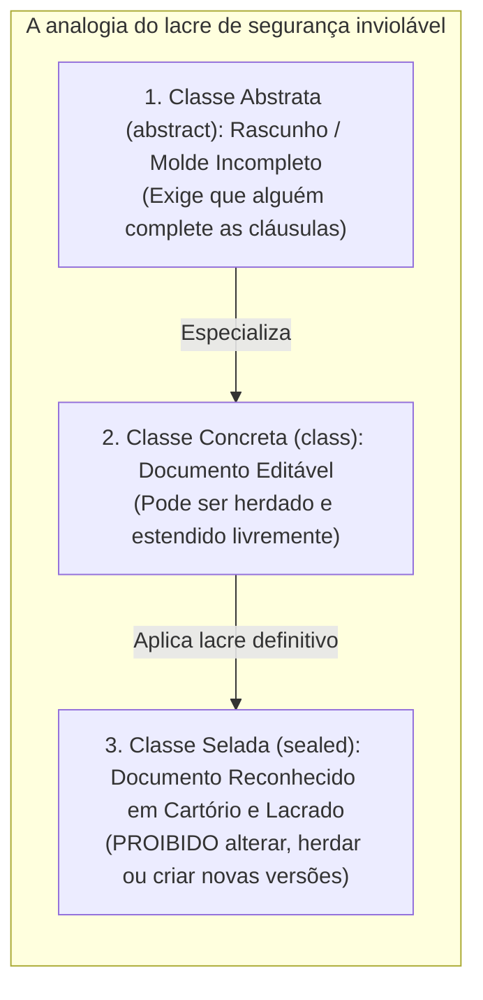
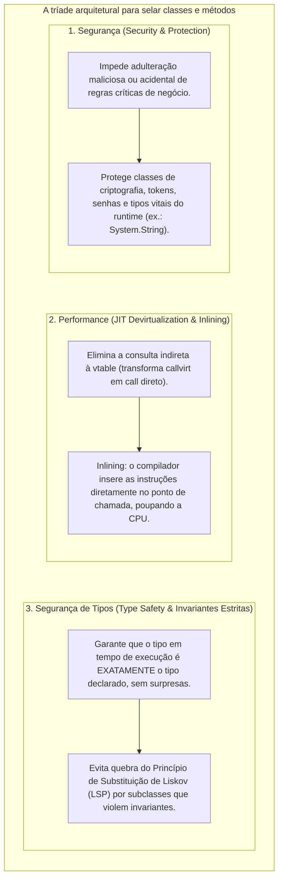
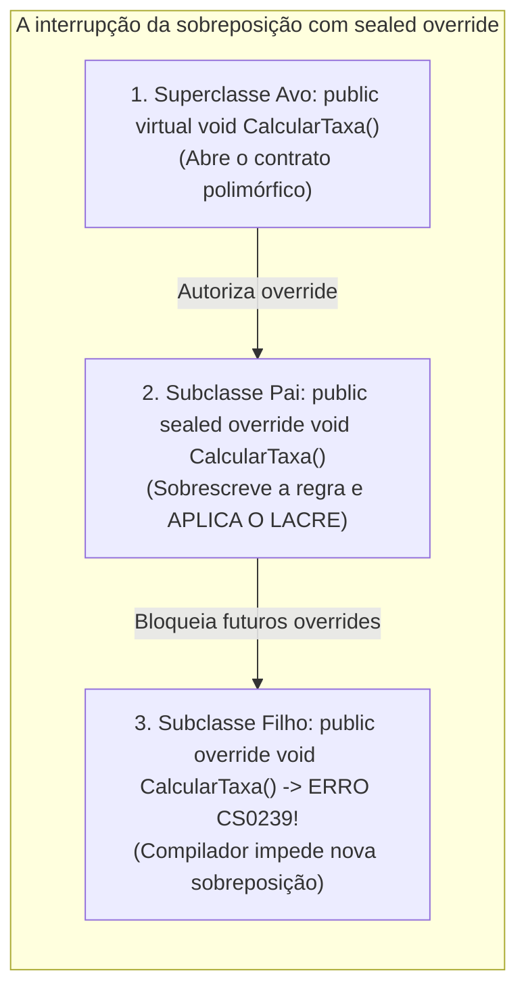
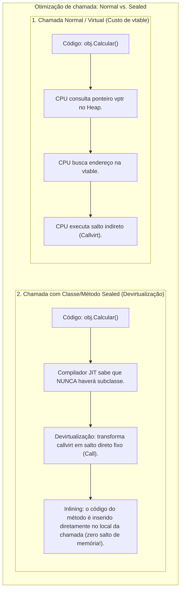
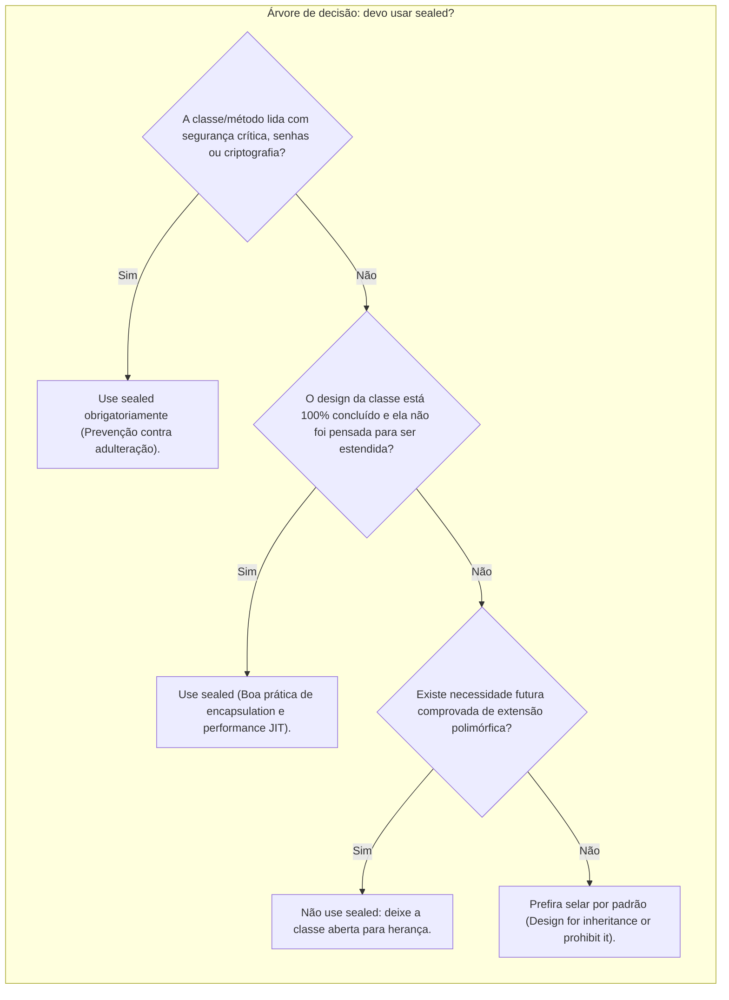

# 19. Classes e membros selados (sealed)

> **Contexto:** Nesta sessão você irá compreender o que são **classes e membros selados (`sealed`)** e será capaz de identificar com precisão as situações arquiteturais em que eles são necessários. Exploramos o fechamento definitivo de hierarquias de herança, a interrupção de cadeias de sobreposição polimórfica (`sealed override`), as garantias de segurança contra adulteração comportamental, as otimizações profundas de desempenho realizadas pelo compilador JIT (*devirtualização e inlining*), a matriz comparativa de modificadores de herança e um exemplo completo e compilável em C#.

---

## 1. O que são classes e membros selados? (A intuição da técnica de Feynman)

Imagine o processo de criação de um **documento jurídico oficial** ou a embalagem de um **remédio lacrado de fábrica**:



* **A classe aberta (`abstract` / `class` comum):** É como uma receita de família ou um rascunho de contrato. Qualquer confeiteiro pode pegar a base e criar uma variação com cobertura diferente.
* **A classe selada (`sealed class`):** É como o **frasco de remédio com lacre inviolável de fábrica** ou a **cédula oficial de dinheiro**. Ninguém tem permissão para criar uma "subclasse de nota de 100 reais" com regras próprias. O design é considerado **final, perfeito, completo e fechado contra qualquer adulteração**.
* **O membro selado (`sealed override`):** É como uma cláusula pétrea de uma constituição. Em uma família de classes, o avô permitiu alterações (`virtual`), mas o pai decidiu: *"A partir de mim, esta regra financeira está cravada e nenhum filho meu poderá modificá-la"*.

---

## 2. Por que selar classes e membros? (A tríade: segurança, performance e type safety)

A decisão de utilizar o modificador `sealed` baseia-se na **tríade clássica da engenharia de linguagens**:



### Detalhamento dos 3 motivos fundamentais:

1. **Segurança (*Security & Integrity*):**
   - **Blindagem contra invasão e adulteração:** Se uma classe processa regras bancárias ou lida com autenticação criptográfica, permitir que qualquer desenvolvedor herde dela e substitua métodos abre brechas graves de segurança. Selar a classe impede a injeção de comportamento não auditado.
2. **Performance (*Runtime Optimization & Inlining*):**
   - **Devirtualização pelo compilador JIT:** Quando o compilador sabe que a classe é `sealed`, ele tem a garantia matemática de que nenhuma subclasse existe. O .NET substitui a instrução polimórfica lenta `callvirt` (que consulta ponteiros na *vtable*) por um salto direto de memória `call`, além de realizar *inlining* (embutimento do código na CPU).
3. **Segurança de tipos (*Type Safety & Predictability*):**
   - **Previsibilidade semântica total:** Em um sistema fortemente tipado, o compilador e o desenvolvedor têm certeza absoluta de que uma variável `CriptografiaSegura c` aponta para a implementação original, e **não para um subtipo disfarçado** que altere comportamentos esperados. Isso blinda o código contra violações do Princípio da Substituição de Liskov (LSP) e garante a integridade dos invariantes do tipo.

---

### A família da imutabilidade: dados (`const` / `readonly`) vs. estrutura (`sealed`)

Para ter uma visão integral da arquitetura de software, é fundamental entender que o modificador **`sealed`** é a manifestação da **imutabilidade aplicada à hierarquia de tipos**:

1. **Imutabilidade em nível de dados ([[00. Sintaxe Multilinguagem/01. Variáveis, tipos e atribuição#3. Constantes e imutabilidade (const, final, readonly)|const e readonly]]):**
   - Garante que os **valores da memória** não sofram mutação após serem gravados.
2. **Imutabilidade em nível de comportamento e hierarquia (`sealed`):**
   - Garante que a **estrutura taxonômica e os métodos** não sofram adulteração ou desvios por herança.
   - Em Java, uma única palavra-chave (`final`) cobre ambos os casos (`final int MAX = 10;` e `final class Seguranca`). No C#, a linguagem oferece termos dedicados e autoexplicativos para cada propósito (`const`/`readonly` para dados, e `sealed` para classes/métodos — veja o comparativo no [[00. Sintaxe Multilinguagem/11. Herança, superclasses e subclasses (sintaxe comparada e extensibilidade)#5. Fechamento de herança e a filosofia da imutabilidade (sealed, final, const, readonly)|Guia de Sintaxe 11]]).

---

## 3. Classes seladas (`sealed class`)

Uma **classe selada** não pode ser utilizada como superclasse (classe pai) de nenhuma outra classe. Se qualquer desenvolvedor tentar derivar dela usando `:`, o compilador aborta o build imediatamente.

### A. Sintaxe no C#
```csharp
// Declaração de uma classe selada
public sealed class CriptografiaSegura 
{
    public string Criptografar(string dados) 
    {
        return $"[HASH_SHA256:{dados.GetHashCode()}]";
    }
}

// TENTATIVA DE HERANÇA:
// ERRO DE COMPILAÇÃO CS0509: 'TentativaInvasao': cannot derive from sealed type 'CriptografiaSegura'
public class TentativaInvasao : CriptografiaSegura 
{
}
```

### B. O caso clássico do .NET: `System.String`
Você já se perguntou por que não pode criar uma classe `MinhaString : string` em C# ou Java?
* A classe **`string` (`System.String`)** é explicitamente declarada como `sealed` (e `final` em Java).
* **Motivo:** Strings são tipos fundamentais do runtime utilizados para credenciais de segurança, caminhos de arquivos no sistema operacional e reflexão de tipos. Se alguém pudesse criar uma subclasse de `string` e sobrescrever seu comparador interno para aceitar senhas incorretas, a segurança de todo o ecossistema .NET entraria em colapso.

---

## 4. Membros selados (`sealed override`)

Em C#, o modificador `sealed` também pode ser aplicado a **métodos ou propriedades individuais**.

> [!IMPORTANT]
> **Regra de sintaxe mandatória:** Um método só pode ser marcado como `sealed` se ele for simultaneamente um **`override`** de um método virtual ancestral. Você **não pode** criar um `sealed void Metodo()` novo do zero (pois métodos comuns em C# já são não-virtuais por padrão).

### A mecânica do fechamento da sobreposição:
O modificador `sealed override` permite que uma subclasse forneça uma especialização para um método `virtual`, mas **proíba terminantemente que suas próprias subclasses futuras voltem a sobrescrever aquele método**.



### Exemplo atômico em C#:
```csharp
public class Funcionario 
{
    public virtual void ProcessarPagamento() 
    {
        Console.WriteLine("Pagamento padrão de funcionário.");
    }
}

public class Gerente : Funcionario 
{
    // O Gerente sobrescreve o método e fecha a porta para sempre com 'sealed'
    public sealed override void ProcessarPagamento() 
    {
        Console.WriteLine("Pagamento auditado de gerente com regras fiscais fixas.");
    }
}

public class DiretorRegional : Gerente 
{
    // ERRO DE COMPILAÇÃO CS0239: 'DiretorRegional.ProcessarPagamento()': 
    // cannot override inherited member 'Gerente.ProcessarPagamento()' because it is sealed
    /*
    public override void ProcessarPagamento() 
    {
        Console.WriteLine("Tentativa de alterar o pagamento do diretor.");
    }
    */
}
```

---

## 5. O impacto na performance: devirtualização e inlining pelo JIT

Além da segurança, o uso de `sealed` proporciona **ganhos reais de desempenho em nível de máquina e CPU**:



1. **Devirtualização (*Devirtualization*):**
   - Quando o compilador JIT (*Just-In-Time*) do .NET analisa uma chamada em uma classe selada, ele tem a certeza matemática de que não existe nenhuma subclasse no universo do programa que possa ter sobrescrito aquele método. Ele descarta a consulta lenta à [[Glossário de conceitos#54. Tabela de métodos virtuais (Virtual Method Table - vtable)|vtable]] e gera uma instrução de salto direto de memória (`call` em vez de `callvirt`).
2. **Embutimento de código (*Method Inlining*):**
   - Para métodos pequenos (como propriedades ou getters/setters), o compilador JIT elimina completamente a instrução de chamada de função e insere o código do método diretamente no ponto de chamada, economizando a criação de quadros na *Stack* e acelerando loops críticos em milhões de iterações por segundo.

---

## 6. Matriz comparativa dos modificadores de herança

Para ter uma visão consolidada de como a herança e o polimorfismo são controlados no C#:

| Modificador | Aplicável a | Instanciação com `new`? | Pode ser herdado (ter subclasses)? | Exige ou permite `override`? |
| :--- | :--- | :---: | :---: | :--- |
| **`abstract`** | Classes, Métodos, Propriedades | **Proibida** | **Obrigatório ter filhos** | Métodos abstratos exigem `override` obrigatório na subclasse. |
| *(Padrão / Comum)* | Classes, Métodos | **Permitida** | **Permitido ter filhos** | Métodos comuns não permitem `override` (resolução estática). |
| **`virtual`** | Métodos, Propriedades | *(N/A)* | *(N/A)* | Permite e convida subclasses a sobrescreverem opcionalmente. |
| **`override`** | Métodos, Propriedades | *(N/A)* | *(N/A)* | Redefine o comportamento herdado de um ancestral `virtual`/`abstract`. |
| **`sealed`** | Classes, Métodos `override` | **Permitida** | **PROIBIDO ter filhos** | Em classes, fecha a herança; em métodos, encerra a cadeia de `override`. |

---

## 7. Exemplo completo e integrado em C# (Sistema financeiro de pagamentos e segurança)

O exemplo abaixo apresenta um sistema bancário compilável que combina **classes abstratas**, **métodos virtuais**, **métodos selados** e **classes totalmente seladas**:

```csharp
using System;
using System.Collections.Generic;

namespace ProgramacaoModular.SegurancaFinanceira 
{
    // =========================================================================
    // 1. SUPERCLASSE ABSTRATA: CONTRATO GERAL DE TRANSAÇÃO
    // =========================================================================
    public abstract class TransacaoBancaria 
    {
        private readonly string _identificador;
        private readonly DateTime _dataHora;

        protected TransacaoBancaria(string identificador) 
        {
            _identificador = identificador;
            _dataHora = DateTime.UtcNow;
        }

        public string Identificador => _identificador;
        public DateTime DataHora => _dataHora;

        // Template Method: Algoritmo invariante
        public void ExecutarTransacao(decimal valor) 
        {
            Console.WriteLine($"\n--- Processando Transação: {_identificador} ---");
            AuditarInicio();
            ValidarNormasBacen(valor); // Método com selagem na hierarquia
            ProcessarDebito(valor);     // Método abstrato especializado
            AuditarFim();
        }

        private void AuditarInicio() => Console.WriteLine($"[AUDITORIA]: Transação iniciada em {_dataHora:dd/MM/yyyy HH:mm:ss} UTC.");
        private void AuditarFim() => Console.WriteLine("[AUDITORIA]: Transação gravada no livro-razão imutável.");

        // Método virtual: permite sobreposição inicial
        public virtual void ValidarNormasBacen(decimal valor) 
        {
            if (valor <= 0) throw new ArgumentException("O valor da transação deve ser estritamente positivo.");
            Console.WriteLine("[BACEN]: Validação básica de conformidade aprovada.");
        }

        protected abstract void ProcessarDebito(decimal valor);
    }

    // =========================================================================
    // 2. SUBCLASSE INTERMEDIÁRIA: APLICA SELAGEM DE MÉTODO (SEALED OVERRIDE)
    // =========================================================================
    public class PagamentoPix : TransacaoBancaria 
    {
        private readonly string _chavePix;

        public PagamentoPix(string identificador, string chavePix) 
            : base(identificador) 
        {
            _chavePix = chavePix;
        }

        public string ChavePix => _chavePix;

        // SELAGEM DE MÉTODO: Nenhuma subclasse de Pix poderá adulterar a validação do BACEN!
        public sealed override void ValidarNormasBacen(decimal valor) 
        {
            base.ValidarNormasBacen(valor);
            if (valor > 50000.00m) 
            {
                Console.WriteLine("[BACEN-ALERTA]: Notificação compulsória enviada ao COAF para valores acima de R$ 50.000.");
            }
        }

        protected override void ProcessarDebito(decimal valor) 
        {
            Console.WriteLine($"[PIX]: Liquidando R$ {valor:F2} instantaneamente para a chave: {_chavePix}");
        }
    }

    // =========================================================================
    // 3. SUBCLASSE FINAL SELADA (SEALED CLASS): NINGUÉM PODE HERDAR DELA!
    // =========================================================================
    public sealed class PagamentoPixInternacional : PagamentoPix 
    {
        private readonly string _paisDestino;

        public PagamentoPixInternacional(string identificador, string chavePix, string paisDestino) 
            : base(identificador, chavePix) 
        {
            _paisDestino = paisDestino;
        }

        public string PaisDestino => _paisDestino;

        // Note: NÃO podemos sobrescrever ValidarNormasBacen aqui porque ela foi declarada como 'sealed override' em PagamentoPix!

        protected override void ProcessarDebito(decimal valor) 
        {
            Console.WriteLine($"[PIX-GLOBAL]: Convertendo e liquidando R$ {valor:F2} para o país: {_paisDestino} (Chave: {ChavePix})");
        }
    }

    // =========================================================================
    // 4. PROGRAMA PRINCIPAL
    // =========================================================================
    class Program 
    {
        static void Main() 
        {
            Console.WriteLine("==================================================");
            Console.WriteLine("SISTEMA FINANCEIRO COM CLASSES E MÉTODOS SELADOS");
            Console.WriteLine("==================================================");

            var listaTransacoes = new List<TransacaoBancaria> 
            {
                new PagamentoPix("TX-001", "financeiro@empresa.com"),
                new PagamentoPixInternacional("TX-002", "global@pay.org", "Estados Unidos"),
                new PagamentoPix("TX-003", "diretoria@holding.com")
            };

            foreach (var tx in listaTransacoes) 
            {
                tx.ExecutarTransacao(65000.00m);
            }

            Console.WriteLine("\n==================================================");
            Console.WriteLine("TODAS AS TRANSAÇÕES CONCLUÍDAS COM SUCESSO.");
            Console.WriteLine("==================================================");
        }
    }
}
```

---

## 8. Quando usar e quando não usar `sealed`? (Guia de boas práticas)



### Quando USAR `sealed`:
1. **Tipos de segurança crítica e imutabilidade:** Classes que lidam com criptografia, autenticação, tokens JWT e manipulação direta de memória segura.
2. **Estruturas de dados utilitárias e finais:** Classes que representam folhas na hierarquia (como `String`, `Math`, configurações de conexão).
3. **Impedir adulteração em cadeias intermediárias de métodos (`sealed override`):** Quando uma subclasse implementa uma regra regulatória ou de auditoria estrita que não deve ser alterada por desenvolvedores de níveis inferiores.
4. **Otimização de microsserviços de altíssimo throughput:** Em sistemas de alta frequência (*high-frequency trading*, games ou streaming), onde a eliminação da *vtable* e o *inlining* geram redução mensurável de nanossegundos.

### Quando NÃO USAR `sealed`:
1. **Em bibliotecas de infraestrutura que exigem customização do cliente:** Se você está criando um framework ou SDK onde os usuários precisam estender suas classes base (ex.: `DbContext` do Entity Framework, controllers de APIs ou middlewares).
2. **Quando você precisa criar mocks para testes unitários antigos:** Frameworks legados de testes em C# (como Moq tradicional) tinham dificuldade em criar instâncias simuladas (*mocks*) de classes seladas sem interfaces. (Hoje isso é amplamente contornado usando interfaces como `IRepositorio`).

---

## Referências bibliográficas

### Bibliografia básica
* RICHTER, Jeffrey. **CLR via C#**. 4. ed. Redmond: Microsoft Press, 2012.
* BLOCH, Joshua. **Java Efetivo: Melhores Práticas para a Plataforma Java**. 3. ed. Porto Alegre: Bookman, 2019. *(Princípio consagrado: "Projete para herança e documente para ela, ou então proíba-a com sealed/final")*.
* MICROSOFT. **Classes e Membros de Classes Abstratas e Lacradas (Guia de Programação em C#)**. Microsoft Learn, 2023. Disponível em: [https://learn.microsoft.com/pt-br/dotnet/csharp/programming-guide/classes-and-structs/abstract-and-sealed-classes-and-class-members](https://learn.microsoft.com/pt-br/dotnet/csharp/programming-guide/classes-and-structs/abstract-and-sealed-classes-and-class-members).

### Bibliografia complementar
* MARTIN, Robert C.; MARTIN, Micah. **Princípios, padrões e práticas ágeis em C#**. Porto Alegre: Bookman, 2011.
* DE PAULA, Hugo. **Programação Modular: Classes Seladas e Segurança no Polimorfismo**. GitHub, 2023. Disponível em: [https://github.com/hugodepaula/programacao-modular-ead](https://github.com/hugodepaula/programacao-modular-ead).

---

## Artigos relacionados e navegação

* **Artigo anterior:** [[18. Classes abstratas e métodos abstratos (contratos de herança e polimorfismo puro)]]
* **Resumo da disciplina:** [[00. Programação modular - Resumo]]
* **Glossário da disciplina:** [[Glossário de conceitos]]
* **Ver Herança e Subtipagem:** [[15. Herança (generalização, especialização e extensibilidade modular)]]
* **Ver Sobreposição de Métodos:** [[17. Sobreposição de métodos (virtual e override)]]
* **Guia de sintaxe multilinguagem (Herança e superclasses):** [[00. Sintaxe Multilinguagem/11. Herança, superclasses e subclasses (sintaxe comparada e extensibilidade)]]
* **Índice geral do vault:** [[index.md|Página inicial do vault]]
