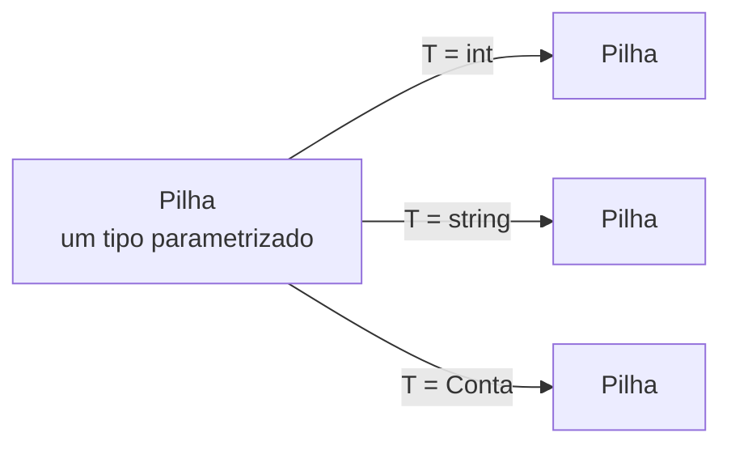
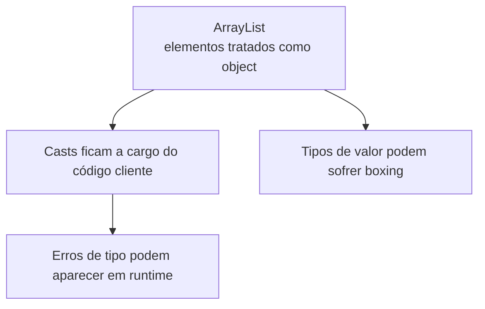
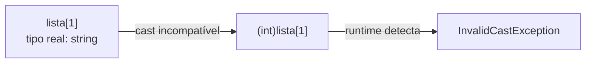
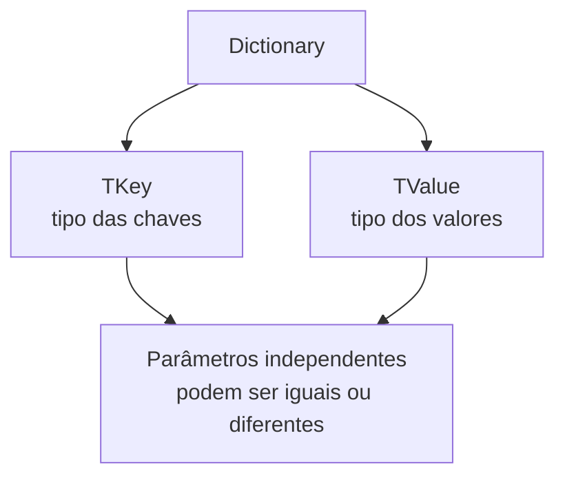
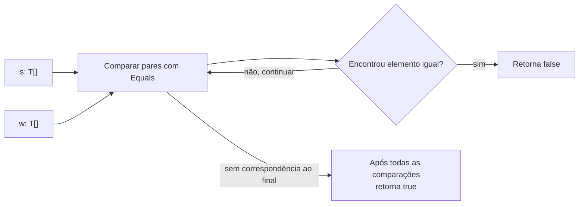
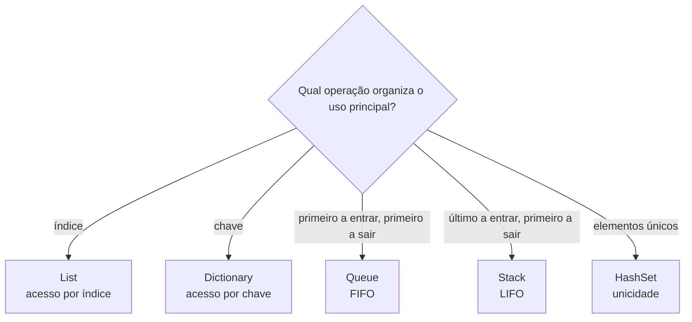

# Tipos genéricos (*generics*, *type safety* e coleções homogêneas)

> **Contexto:** Estudo aprofundado sobre **Tipos Genéricos (*Generics*)** na programação modular e orientada a objetos: a superação das coleções não-genéricas heterogêneas (`ArrayList`), a eliminação dos custos de *Boxing* e *Unboxing*, a garantia estrita de **segurança de tipos (*Type Safety*)** em tempo de compilação, a parametrização de classes, interfaces e métodos (`<T>`), o mecanismo de **restrições (*Constraints* - `where T : ...`)** e a implementação de coleções homogêneas de alto desempenho.

---

## Tipos genéricos e parametrização de tipos

Na engenharia de software e na programação modular, **Tipos Genéricos (*Generics*)** são um mecanismo de abstração que permite definir **classes, estruturas, interfaces e métodos com espaços reservados (*placeholders* ou parâmetros de tipo, como `<T>`)** para os tipos de dados que eles manipulam.

Em termos simples: em vez de você escrever uma classe específica para armazenar números inteiros (`ListaDeInteiros`), outra para textos (`ListaDeStrings`) e outra para contas (`ListaDeContas`), você escreve **uma única classe genérica parametrizada (`Lista<T>`)**. O tipo concreto que preencherá o `<T>` é informado apenas no momento em que a classe for instanciada (`new Lista<int>()` ou `new Lista<Conta>()`).



---

### Intuição: um molde parametrizado para vários tipos

Imagine uma **gaveta organizadora de plástico rígido** vendida sem divisórias fixas:
* Se você comprar a gaveta e encaixar divisórias para **chaves de fenda**, ela se torna uma gaveta exclusiva de ferramentas. Ninguém conseguirá colocar acidentalmente uma caneca de café ali dentro.
* Se outra pessoa comprar o **mesmo modelo de gaveta** e colocar divisórias para **cápsulas de café**, ela vira uma gaveta dedicada de café.

A fábrica não precisou construir 50 linhas de montagem diferentes para cada objeto do mundo; ela fabricou **um único modelo paramétrico de gaveta**, e o usuário define o tipo de conteúdo na hora do uso. Isso é exatamente o que os **Tipos Genéricos** fazem com o seu código.

---

## Limitações das coleções baseadas em `object`

Para compreender o valor inestimável dos *Generics* (introduzidos no C# 2.0 e Java 5), precisamos entender como os desenvolvedores eram obrigados a programar coleções no início dos anos 2000.

Na ausência de tipos genéricos, para criar uma lista que aceitasse qualquer tipo de elemento, as bibliotecas da linguagem recorriam à raiz da hierarquia de tipos: a classe **`object`** (como o antigo `System.Collections.ArrayList` em C# ou `java.util.Vector` em Java).

```csharp
// CÓDIGO LEGADO NÃO-GENÉRICO (EVITAR EM CÓDIGO MODERNO):
using System.Collections;

ArrayList listaAntiga = new ArrayList();
listaAntiga.Add(10);                    // Adiciona int (sofre Boxing no Heap!)
listaAntiga.Add("Texto qualquer");      // Adiciona string
listaAntiga.Add(new ContaCorrente());   // Adiciona objeto Conta

// LEITURA PERIGOSA: Exige coerção explícita de tipos (Cast manual)
int numero = (int)listaAntiga[0];       // Sofre Unboxing
int erroFatal = (int)listaAntiga[1];    // CRASH EM TEMPO DE EXECUÇÃO! InvalidCastException
```

Essa abordagem apresentava **dois problemas gravíssimos**:



---

### `InvalidCastException` e perda de segurança de tipos

A **`InvalidCastException`** é uma exceção lançada pelo *runtime* do .NET (CLR) quando o programa tenta realizar uma **coerção explícita de tipos (*cast* forçado)** entre dois tipos de dados incompatíveis que **não possuem relação de herança ou conversão válida entre si**.



#### Intuição: coerção incompatível em tempo de execução
Imagine que você tem uma gaveta com vários cabos e plugues elétricos misturados (`ArrayList`). Você pega um cabo no escuro e tenta encaixar à força na tomada de 220V do seu computador (`(int)lista[1]`). O compilador é como alguém que apenas observa você pegar o cabo e diz: *"Tudo bem, você é o eletricista, confio no seu julgamento"*. Quando você liga a energia no mundo real (*runtime*), o plugue era na verdade uma mangueira de água (`string`): a máquina entra em curto-circuito, solta fumaça e queima na hora (**`InvalidCastException`**).

#### Por que o erro escapava do compilador
1. **O compilador ficava "cego":** Como a assinatura do método era `Add(object value)`, qualquer elemento do sistema era aceito. Um desenvolvedor podia adicionar acidentalmente um `string` em uma lista criada para guardar `ContaCorrente`.
2. **Falha silenciosa no build:** O código compilava com sucesso sem nenhum aviso (*warning* ou *error*).
3. **Explosão imprevisível em produção:** O erro só era descoberto quando uma rotina específica tentava fazer a leitura `(ContaCorrente)lista[i]` meses depois, gerando prejuízos operacionais graves.

---

### Boxing, unboxing e custo de alocação

Quando um **tipo de valor** (*value type*, como `int`, `double`, `bool` ou `struct`), que normalmente vive de forma ultrarrápida na memória *Stack*, é inserido em uma coleção de `object`, o runtime é forçado a realizar duas operações custosas:

1. **Empacotamento (*Boxing*):**
   - A CPU aloca um novo bloco de memória no *Heap*, copia o valor primitivo para dentro desse "envelope" e retorna uma referência de objeto.
2. **Desempacotamento (*Unboxing*):**
   - Ao ler o dado da lista, a CPU precisa verificar o ponteiro de tipo no *Heap*, conferir se o tipo é idêntico e extrair os bytes de volta para um registrador da *Stack*.

> [!CAUTION]
> **Impacto na CPU e no Garbage Collector:** Em loops que processam milhões de números, o *Boxing* gera milhões de pequenos objetos inúteis no *Heap*, afogando o [[Glossário de conceitos#Coletor de Lixo (Garbage Collector - GC)|Garbage Collector]] e reduzindo a taxa de transferência (*throughput*) da aplicação em até **10 vezes**!

---

## Segurança de tipos e reutilização com generics

Com a introdução de coleções genéricas no namespace `System.Collections.Generic` (como `List<T>`, `Dictionary<TKey, TValue>`, `Queue<T>`, `Stack<T>`), o compilador passou a verificar a homogeneidade das estruturas em **tempo de compilação**:

```csharp
// CÓDIGO MODERNO E IDIOMÁTICO COM GENERICS:
using System.Collections.Generic;

List<int> listaNumeros = new List<int>();
listaNumeros.Add(10);
listaNumeros.Add(20);
// listaNumeros.Add("Texto"); // ERRO DE COMPILAÇÃO CS1503: Argumento não pode converter 'string' para 'int'!

int primeiro = listaNumeros[0]; // ZERO CAST! Leitura direta como int nativo sem Boxing.
```

---

### Coleções genéricas e não genéricas em comparação

| Critério de comparação | Coleções legadas (`ArrayList`, `Hashtable`) | Coleções genéricas (`List<T>`, `Dictionary<K, V>`) |
| :--- | :--- | :--- |
| **Namespace em C#** | `System.Collections` | `System.Collections.Generic` |
| **Segurança de tipos (*Type Safety*)** | **Fraca / Nula.** Erros descobertos apenas em *runtime*. | **Absoluta.** Erros barrados em tempo de compilação (*compile-time*). |
| **Necessidade de *Cast* (Coerção)** | **Obrigatória em toda leitura** (`(Conta)lista[0]`). | **Desnecessária.** O tipo retornado já é exatamente `T`. |
| **Impacto de *Boxing / Unboxing*** | **Alto custo** para todos os tipos primitivos (`int`, `float`, `struct`). | **Zero *Boxing*.** O compilador gera código de máquina nativo e direto. |
| **Performance e GC** | Lenta, alta fragmentação de memória *Heap*. | Ultrarrápida, uso mínimo do *Garbage Collector*. |
| **Estrutura dos dados** | Heterogênea (aceita qualquer mistura de tipos). | **Homogênea** (garante que todos os itens são do mesmo tipo `T`). |

---

## Classes, métodos e múltiplos parâmetros genéricos

Os tipos genéricos não servem apenas para consumir listas prontas da linguagem; você pode criar suas próprias **classes, interfaces, métodos e delegados genéricos**.

---

### Classe genérica: o TAD `Pilha<T>`

Vejamos como encapsular uma estrutura de dados de Pilha (*Stack*) genérica e reutilizável:

```csharp
namespace ProgramacaoModular.Colecoes 
{
    public class PilhaCustomizada<T> 
    {
        private readonly T[] _elementos;
        private int _topo;
        private readonly int _capacidadeMaxima;

        public PilhaCustomizada(int capacidade = 10) 
        {
            _capacidadeMaxima = capacidade;
            _elementos = new T[capacidade];
            _topo = 0;
        }

        public int Quantidade => _topo;
        public bool EstaVazia => _topo == 0;

        public void Empilhar(T elemento) 
        {
            if (_topo >= _capacidadeMaxima)
            {
                throw new InvalidOperationException("Capacidade máxima da pilha atingida.");
            }
            _elementos[_topo++] = elemento;
        }

        public T Desempilhar() 
        {
            if (EstaVazia)
            {
                throw new InvalidOperationException("A pilha está vazia.");
            }
            T item = _elementos[--_topo];
            _elementos[_topo] = default; // Limpa a referência para o Garbage Collector
            return item;
        }
    }
}
```

---

### Métodos genéricos

Um método pode ser genérico independentemente de a classe onde ele reside ser genérica ou não:

```csharp
public static class Utilitarios 
{
    // Método genérico para trocar o conteúdo de duas variáveis de qualquer tipo:
    public static void Trocar<T>(ref T a, ref T b) 
    {
        T temporario = a;
        a = b;
        b = temporario;
    }
}

// Uso do método genérico:
int x = 10, y = 20;
Utilitarios.Trocar(ref x, ref y); // O compilador infere que T é int!

string nome1 = "Alice", nome2 = "Bob";
Utilitarios.Trocar(ref nome1, ref nome2); // O compilador infere que T é string!
```

---

### Múltiplos parâmetros de tipo

Uma dúvida comum entre estudantes é: *"O mecanismo de generics aceita apenas uma única variável `<T>` por vez, ou podemos trabalhar com dois, três ou mais tipos diferentes simultaneamente?"*

A resposta é: **você pode declarar quantos tipos genéricos independentes forem necessários** (separados por vírgula dentro dos sinais `< >`), como `<T1, T2>`, `<TChave, TValor>` ou `<TOrigem, TDestino>`.

| Estrutura | Parâmetros de tipo | Exemplo |
| :--- | :--- | :--- |
| Um parâmetro | `T` | `List<T>`, `Pilha<T>` |
| Dois ou mais | `TKey`, `TValue`, `T1`, `T2`... | `Dictionary<TKey, TValue>`, tuplas e tipos próprios |
| Regra | Cada parâmetro tem papel e restrições próprios | Eles podem representar tipos diferentes ou até o mesmo tipo |

#### Quando múltiplos tipos genéricos são necessários
Existem estruturas de dados e padrões de projeto que relacionam **entidades de naturezas completamente distintas**:
* **Dicionários e Mapas Associativos (`Dictionary<TKey, TValue>`):** A chave de busca (`TKey`) pode ser um `string` (CPF ou email) enquanto o valor associado (`TValue`) é um objeto complexo `Cliente` ou `Conta`.
* **Conversores e Mapeadores (`IMapeador<TOrigem, TDestino>`):** O tipo de entrada pode ser uma entidade do banco de dados `Usuario` e o tipo de saída pode ser um DTO visual `UsuarioViewModel`.
* **Pares e Tuplas (`Par<TPrimeiro, TSegundo>` / `Tuple<T1, T2>`):** Para agrupar dois ou mais valores heterogêneos mantendo cada um com sua tipagem forte e estática (veja a definição formal e a analogia de Feynman no [[Glossário de conceitos#Tupla (Tuple / ValueTuple)|Glossário de Conceitos: 70. Tupla]]).

#### Estrutura de mapeamento com dois parâmetros de tipo

```csharp
namespace ProgramacaoModular.GenericsDemo 
{
    // Classe com DOIS parâmetros genéricos independentes: TChave e TValor
    public class EntradaDicionario<TChave, TValor> 
    {
        public TChave Chave { get; init; }
        public TValor Valor { get; set; }

        public EntradaDicionario(TChave chave, TValor valor) 
        {
            Chave = chave;
            Valor = valor;
        }

        public void ExibirRelacao() 
        {
            Console.WriteLine($"Chave ({typeof(TChave).Name}): {Chave} -> Valor ({typeof(TValor).Name}): {Valor}");
        }
    }
}

// Utilização com tipos combinados:
var entrada1 = new EntradaDicionario<string, decimal>("CPF-001", 1500.50m);
entrada1.ExibirRelacao(); // Chave (String): CPF-001 -> Valor (Decimal): 1500.50

var entrada2 = new EntradaDicionario<int, ContaCorrente>(1024, new ContaCorrente());
entrada2.ExibirRelacao(); // Chave (Int32): 1024 -> Valor (ContaCorrente): ContaCorrente
```

#### Convenções de nomes para parâmetros de tipo
* **Obrigatório usar letra maiúscula:** Uma **variável de tipo genérico representa um TIPO (uma classe, estrutura ou interface), e NUNCA um valor concreto**. Por essa razão, seguir as convenções de `PascalCase` da linguagem é mandatório.
* **Um único parâmetro:** Utilize a letra maiúscula única **`T`** (abreviação universal de *Type*, como em `List<T>`, `Pilha<T>`).
* **Múltiplos parâmetros descritivos:** Utilize o prefixo maiúsculo **`T`** seguido do papel conceitual do tipo em `PascalCase` (ex.: `TKey`, `TValue`, `TRequest`, `TResponse`, `TInput`, `TOutput`).
* **Comparativo de convenções:** Em Java, é comum usar letras maiúsculas únicas (`K` para *Key*, `V` para *Value*, `E` para *Element*, `T` para *Type*); em C#, adota-se o prefixo `T` descritivo (`TKey`, `TValue`, `TElement`) para manter a legibilidade em arquiteturas corporativas (veja a tabela completa em [[00. Sintaxe Multilinguagem/01. Variáveis, tipos e atribuição#Convenções de nomenclatura (Naming Conventions: camelCase, PascalCase, snake_case)|Guia de Sintaxe 01 (Convenções de Nomenclatura)]]).

---

#### Tipos como domínios e independência entre parâmetros genéricos

É útil pensar em um tipo como um **domínio de valores possíveis**. Um `int` admite certos valores inteiros; uma `string` admite cadeias de caracteres; uma classe como `ContaCorrente` admite referências a objetos compatíveis com esse tipo.

Em um tipo genérico com múltiplos parâmetros, como `Dictionary<TKey, TValue>`, cada parâmetro ocupa um papel próprio no contrato. Isso não significa que os conjuntos de valores precisem ser disjuntos. `TKey` e `TValue` podem ser tipos diferentes, como `string` e `ContaCorrente`, mas também podem ser o mesmo tipo, como em `Dictionary<string, string>`. O que o compilador preserva é a **consistência de cada posição de tipo**, não uma exigência matemática de interseção vazia.



A separação entre `TKey` e `TValue` é portanto uma separação **de papéis tipados**. Se `TKey = string` e `TValue = ContaCorrente`, o compilador rejeita uma `ContaCorrente` onde a API espera uma chave `string`. Essa proteção decorre da assinatura genérica do tipo, não de uma propriedade de conjuntos disjuntos.

A ideia de **conjuntos disjuntos** aparece de forma legítima no exemplo seguinte: ali, dois vetores do mesmo tipo `T[]` são comparados para verificar se compartilham algum elemento. Nesse contexto, “disjuntos” descreve os dados contidos nos vetores, e não os parâmetros de tipo de um `Dictionary`.

---

### Vetores genéricos e verificação de conjuntos disjuntos

Vejamos o código-fonte canônico utilizado para demonstrar como os **vetores genéricos (`T[]`)**, a **chamada polimórfica ao método `Equals`** e a **reusabilidade de código** operam em conjunto:

```csharp
using System;

namespace Generics
{
    public class Conjuntos<T> 
    {
        // Método estático genérico que recebe dois vetores do mesmo tipo T:
        public static bool Disjuntos(T[] s, T[] w)
        {
            for (int i = 0; i < s.Length; i++)
            {
                for (int j = 0; j < w.Length; j++)
                {
                    // Invocação polimórfica de Equals da classe universal Object:
                    if (s[i].Equals(w[j]))
                    {
                        return false; // Encontrou elemento comum -> NÃO são disjuntos!
                    }
                }
            }
            return true; // Nenhum elemento em comum -> SÃO disjuntos!
        } 
    }

    class Program 
    {
        static void Main(string[] args)
        {
            // 1. Teste com vetores de inteiros (T = int):
            // {1, 3, 5} e {2, 4, 6} -> Interseção vazia (Disjuntos = true)
            if (Conjuntos<int>.Disjuntos(new int[] { 1, 3, 5 }, new int[] { 2, 4, 6 })) 
            {
                Console.WriteLine("Conjuntos são disjuntos");
            } 
            else 
            {
                Console.WriteLine("Conjuntos não são disjuntos");
            }

            // 2. Teste com vetores de números decimais (T = double):
            // {1.7, 3.2, 5.8} e {2.4, 3.2, 6.5} -> Possuem '3.2' em comum (Disjuntos = false)
            if (Conjuntos<double>.Disjuntos(new double[] { 1.7, 3.2, 5.8 }, new double[] { 2.4, 3.2, 6.5 })) 
            {
                Console.WriteLine("Conjuntos são disjuntos");
            } 
            else 
            {
                Console.WriteLine("Conjuntos não são disjuntos");
            }
        }
    }
}
```



---

#### Leitura do exemplo passo a passo

1. **O conceito de vetores genéricos (`T[]`):**
   - Em C#, `T[]` representa um **arranjo contíguo e homogêneo de memória**.
   - Quando você chama `Conjuntos<int>.Disjuntos(...)`, o compilador instancia o método tratando `s` e `w` como vetores nativos `int[]`, garantindo acesso direto por índice (`s[i]`) sem sobrecarga de objetos.
   - Quando você chama `Conjuntos<double>.Disjuntos(...)`, o **mesmo código-fonte** é reaproveitado pelo runtime para processar números de ponto flutuante `double[]`.
2. **O papel vital do método `Equals`:**
   - Como `T` pode ser qualquer tipo, o compilador não permite usar o operador `==` diretamente (pois `==` não está definido para tipos genéricos irrestritos).
   - O código utiliza `s[i].Equals(w[j])`, que é o método virtual herdado de `System.Object`. Como vimos no [[00. Sintaxe Multilinguagem/13. Igualdade de objetos, comparação e hashing (Equals, GetHashCode, hashCode, __eq__)|Guia de Sintaxe 13]], o `Equals` compara o **conteúdo real** dos dados (seja `int`, `double` ou classes customizadas com regras de negócio).
3. **Complexidade algorítmica ($O(N \times M)$):**
   - Os loops aninhados comparam cada elemento de `s` contra todos os elementos de `w`. Se encontrar um único par de elementos iguais, o método aborta e retorna `false` na hora. Se percorrer tudo e não encontrar nenhuma correspondência, os dois conjuntos são formalmente **disjuntos**.

---

## Restrições de tipo com `where`

Por padrão, quando você declara `<T>`, o compilador assume que `T` pode ser **absolutamente qualquer coisa** (qualquer `object`). Isso significa que, dentro da sua classe genérica, você só pode invocar métodos universais como `ToString()`, `Equals()` e `GetHashCode()`.

E se a sua classe genérica precisar comparar dois itens (`a > b`), chamar o método `Salvar()` ou instanciar `new T()`? Para isso existem as **Restrições de Tipos (*Constraints*)**, declaradas com a cláusula **`where`**:


---

### Restrições genéricas mais usadas

| Sintaxe da restrição | Significado semântico | O que permite fazer no código? |
| :--- | :--- | :--- |
| **`where T : struct`** | `T` deve ser obrigatoriamente um **tipo de valor** não anulável. | Garante alocação em *Stack* ou semântica de valor. |
| **`where T : class`** | `T` deve ser obrigatoriamente um **tipo de referência**. | Permite atribuir `null` a variáveis do tipo `T`. |
| **`where T : notnull`** | `T` não pode aceitar valores nulos (C# 8+). | Evita erros de referência nula (*NullReferenceException*). |
| **`where T : new()`** | `T` deve possuir um **construtor público sem parâmetros**. | Permite escrever `T novoItem = new T();` dentro da classe. |
| **`where T : Superclasse`** | `T` deve herdar de uma classe base específica. | Permite acessar os atributos e métodos públicos dessa superclasse. |
| **`where T : IContrato`** | `T` deve implementar uma interface específica. | Permite invocar os métodos da interface (ex.: `T.CompareTo()`). |

---

### Repositório genérico com múltiplas restrições

```csharp
public interface IEntidade 
{
    int Id { get; }
}

// O repositório exige que T seja uma classe, que implemente IEntidade e que possa ser instanciada com new()
public class RepositorioGenerico<T> where T : class, IEntidade, new() 
{
    private readonly List<T> _bancoDeDados = new List<T>();

    public void Inserir(T entidade) 
    {
        _bancoDeDados.Add(entidade);
        Console.WriteLine($"Entidade com ID {entidade.Id} persistida com sucesso.");
    }

    public T CriarNovoRegistro(int id) 
    {
        T novo = new T(); // Permitido apenas porque temos 'where T : new()'
        return novo;
    }
}

// Exemplo com restrições independentes para múltiplos parâmetros:
public class MapaValidado<TChave, TValor> 
    where TChave : struct, IComparable<TChave> // Chave deve ser tipo de valor comparável
    where TValor : class, new()               // Valor deve ser classe com construtor padrão
{
    private readonly Dictionary<TChave, TValor> _itens = new();

    public void AdicionarPadrao(TChave chave) 
    {
        _itens[chave] = new TValor();
    }
}
```

---

## Coleções genéricas do .NET

O ecossistema .NET fornece uma rica biblioteca de coleções genéricas no namespace `System.Collections.Generic`. A escolha da coleção correta é uma decisão vital de arquitetura de software:



---

## Generics em um sistema logístico integrado

O programa abaixo demonstra o uso prático de **classes genéricas com restrições**, **métodos genéricos** e **coleções tipadas**, simulando um terminal de armazenagem de cargas:

```csharp
using System;
using System.Collections.Generic;

namespace ProgramacaoModular.GenericsDemo 
{
    // 1. CONTRATO DE ELEMENTO ARMAZENÁVEL
    public interface ICarga 
    {
        string CodigoRastreio { get; }
        double PesoKg { get; }
        void ExibirDetalhes();
    }

    // 2. CLASSES CONCRETAS DE DOMÍNIO
    public class PacoteEletronico : ICarga 
    {
        public string CodigoRastreio { get; }
        public double PesoKg { get; }
        public string Modelo { get; }

        public PacoteEletronico(string codigo, double peso, string modelo) 
        {
            CodigoRastreio = codigo;
            PesoKg = peso;
            Modelo = modelo;
        }

        public void ExibirDetalhes() => 
            Console.WriteLine($"[ELETRÔNICO] {CodigoRastreio} | {Modelo} | Peso: {PesoKg:F2} kg");
    }

    public class CaixaRemedio : ICarga 
    {
        public string CodigoRastreio { get; }
        public double PesoKg { get; }
        public DateTime Validade { get; }

        public CaixaRemedio(string codigo, double peso, DateTime validade) 
        {
            CodigoRastreio = codigo;
            PesoKg = peso;
            Validade = validade;
        }

        public void ExibirDetalhes() => 
            Console.WriteLine($"[FARMACÊUTICO] {CodigoRastreio} | Validade: {Validade:dd/MM/yyyy} | Peso: {PesoKg:F2} kg");
    }

    // 3. CLASSE GENÉRICA COM RESTRIÇÃO (WHERE T : ICARGA)
    public class ConteinerLogistico<T> where T : class, ICarga 
    {
        private readonly string _identificador;
        private readonly double _limitePesoKg;
        private readonly List<T> _itens;

        public ConteinerLogistico(string identificador, double limitePesoKg) 
        {
            _identificador = identificador;
            _limitePesoKg = limitePesoKg;
            _itens = new List<T>();
        }

        public double PesoAtualTotal 
        {
            get 
            {
                double total = 0;
                foreach (var item in _itens) total += item.PesoKg;
                return total;
            }
        }

        public void AdicionarCarga(T item) 
        {
            if (PesoAtualTotal + item.PesoKg > _limitePesoKg) 
            {
                throw new InvalidOperationException($"Capacidade de peso excedida no contêiner {_identificador}.");
            }
            _itens.Add(item);
            Console.WriteLine($"Item {item.CodigoRastreio} alocado com sucesso no contêiner {_identificador}.");
        }

        public void ListarManifesto() 
        {
            Console.WriteLine($"\n=== MANIFESTO DO CONTÊINER: {_identificador} ===");
            Console.WriteLine($"Carga Total: {PesoAtualTotal:F2} / {_limitePesoKg:F2} kg");
            foreach (var item in _itens) 
            {
                item.ExibirDetalhes(); // Permitido graças à restrição 'where T : ICarga'!
            }
        }
    }

    // 4. PROGRAMA PRINCIPAL
    class Program 
    {
        static void Main() 
        {
            Console.WriteLine("==================================================");
            Console.WriteLine("SISTEMA LOGÍSTICO COM GENERICS E TYPE SAFETY");
            Console.WriteLine("==================================================\n");

            // Contêiner especializado exclusivamente para eletrônicos
            var conteinerTech = new ConteinerLogistico<PacoteEletronico>("CT-TECH-01", 100.0);
            conteinerTech.AdicionarCarga(new PacoteEletronico("TRK-001", 2.5, "Notebook Dell"));
            conteinerTech.AdicionarCarga(new PacoteEletronico("TRK-002", 0.8, "Smartphone Samsung"));
            conteinerTech.ListarManifesto();

            // Contêiner especializado exclusivamente para medicamentos
            var conteinerFarma = new ConteinerLogistico<CaixaRemedio>("CT-MED-02", 50.0);
            conteinerFarma.AdicionarCarga(new CaixaRemedio("MED-901", 1.2, DateTime.UtcNow.AddYears(2)));
            conteinerFarma.ListarManifesto();

            Console.WriteLine("\n==================================================");
            Console.WriteLine("EXECUÇÃO CONCLUÍDA COM TOTAL HOMOGENEIDADE E ZERO CAST.");
            Console.WriteLine("==================================================");
        }
    }
}
```

---

## Síntese para revisão

1. **Reusabilidade com segurança:** Generics permitem que você escreva o algoritmo uma única vez (`<T>`) e garanta que o compilador proteja a homogeneidade de tipos em qualquer cenário.
2. **Eliminação do `object` em coleções:** Estruturas antigas como `ArrayList` foram banidas do desenvolvimento profissional moderno por causarem erros em tempo de execução (*runtime*) e destruírem a performance via *Boxing* e *Unboxing*.
3. **Restrições (*Constraints*):** Com a cláusula `where T : ...`, você ensina o compilador sobre as capacidades mínimas que o tipo `T` deve possuir (ser classe, ter construtor sem parâmetros, implementar uma interface ou herdar de uma classe base).
4. **Semântica homogênea:** Coleções genéricas garantem que todos os elementos de uma lista compartilham a mesma taxonomia ou contrato, eliminando coerções manuais (*casts*) e tornando o código imensamente mais legível e sustentável.

---

## Referências bibliográficas

### Bibliografia básica
* RICHTER, Jeffrey. **CLR via C#**. 4. ed. Redmond: Microsoft Press, 2012. *(Capítulo 12: Generics)*.
* ALBAHARI, Joseph; ALBAHARI, Ben. **C# 10 in a Nutshell: The Definitive Reference**. Sebastopol: O'Reilly Media, 2022.
* MICROSOFT. **Genéricos em C# (Guia de Programação em C#)**. Microsoft Learn, 2023. Disponível em: [https://learn.microsoft.com/pt-br/dotnet/csharp/programming-guide/generics/](https://learn.microsoft.com/pt-br/dotnet/csharp/programming-guide/generics/).

### Bibliografia complementar
* BLOCH, Joshua. **Java Efetivo: Melhores Práticas para a Plataforma Java**. 3. ed. Porto Alegre: Bookman, 2019. *(Capítulo 5: Tipos Genéricos)*.
* MARTIN, Robert C.; MARTIN, Micah. **Princípios, padrões e práticas ágeis em C#**. Porto Alegre: Bookman, 2011.

---

## Artigos relacionados

* **Artigo anterior:** [[19. Classes e membros selados (sealed)]]
* **Próximo artigo:** [[21. Coleções genéricas em C# (estruturas de dados, propósitos e performance assintótica)]]
* **Resumo da disciplina:** [[00. Programação modular - Resumo]]
* **Glossário da disciplina:** [[Glossário de conceitos]]
* **Ver Tipos Abstratos de Dados:** [[03. Tipos abstratos de dados]]
* **Ver Semântica de Memória:** [[01. Programacao Modular/07. Atributos e métodos (classes, objetos e definição de membros).md]]
* **Guia de sintaxe multilinguagem (Estruturas fundamentais):** [[00. Sintaxe Multilinguagem/08. Estruturas de dados fundamentais (materialização de modelos mentais em código)]]
* **Guia de sintaxe multilinguagem (Igualdade e Hashing - Equals e GetHashCode):** [[00. Sintaxe Multilinguagem/13. Igualdade de objetos, comparação e hashing (Equals, GetHashCode, hashCode, __eq__)]]
* **Guia de sintaxe multilinguagem (Tipos Genéricos e Polimorfismo Paramétrico):** [[00. Sintaxe Multilinguagem/14. Tipos genéricos e polimorfismo paramétrico (Generics, TypeVar, Any, Templates)]]
* **Índice geral do vault:** [[index.md|Página inicial do vault]]
