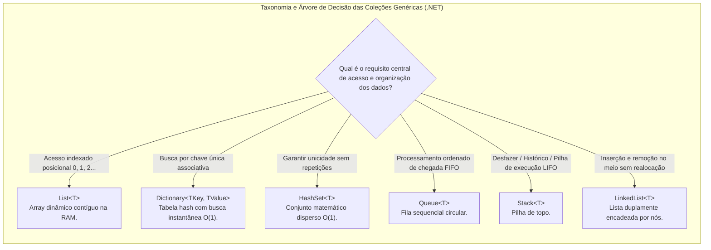
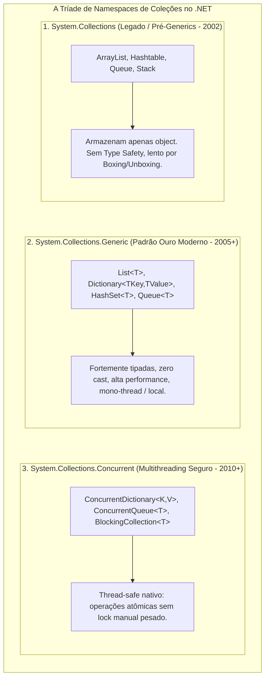
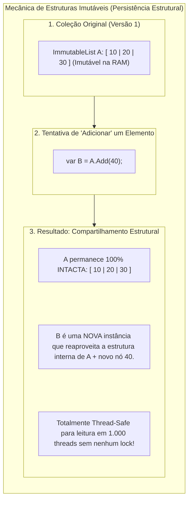

# 21. Coleções genéricas em C#: estruturas de dados, propósitos e análise de performance

> **Contexto:** Estudo aprofundado dos principais tipos de **coleções genéricas da linguagem C# (`System.Collections.Generic`)** e de como essas estruturas foram projetadas para manipular grandes volumes de dados de forma homogênea, segura e de alto desempenho. Ao final deste artigo, você será capaz de diferenciar rigorosamente cada coleção quanto ao seu **modelo mental**, **propósito arquitetural**, **mecânica interna de memória** e **performance assintótica (Notação Big-O)** tanto na inserção quanto na busca de componentes.

---

## 1. O que são coleções e por que precisamos de múltiplos tipos?

No [[20. Tipos genéricos (generics, type safety e coleções homogêneas)|Artigo 20]], aprendemos que os **Tipos Genéricos (`<T>`)** garantem a homogeneidade e a segurança de tipos (*Type Safety*) das estruturas de dados. Porém, surge uma pergunta fundamental de arquitetura de software:

> *"Se já temos a `List<T>`, por que o .NET oferece dezenas de coleções diferentes como `Dictionary<TKey, TValue>`, `HashSet<T>`, `Queue<T>`, `Stack<T>`, `LinkedList<T>` e `SortedSet<T>`?"*

A resposta reside na **relação de compromisso (*trade-off*) entre tempo de CPU e consumo de memória**:
* Nenhuma estrutura de dados única é perfeita para todos os cenários.
* Uma coleção excelente para **inserir no final** pode ser péssima para **fazer buscas pelo valor**.
* Uma coleção com **busca instantânea** consome mais memória RAM para manter tabelas de espalhamento (*hash tables*) ou nós encadeados.

---

### A analogia de Feynman: O armazém de ferramentas

Imagine uma oficina mecânica com milhares de ferramentas e peças:
1. **`List<T>` (A gaveta comprida com divisórias numeradas):** Você coloca as peças uma atrás da outra. É ótimo se você sabe que a chave que você quer está na gaveta número `42` (acesso instantâneo por índice $O(1)$). Mas se você não sabe o número e precisa achar um parafuso específico, terá que olhar divisória por divisória até o final ($O(N)$).
2. **`Dictionary<TKey, TValue>` (O painel perfurado com silhuetas etiquetadas):** Cada ferramenta tem uma etiqueta única (ex.: "Chave 10mm"). Você olha para a etiqueta e pega a ferramenta imediatamente ($O(1)$), sem olhar para nenhuma outra.
3. **`HashSet<T>` (A cesta de peças únicas com detector de duplicatas):** Você joga peças na cesta; o cesto confere instantaneamente se aquela peça já existe lá dentro e impede duplicatas ($O(1)$), mas sem se importar com a ordem em que foram colocadas.
4. **`Queue<T>` (A esteira rolante do caixa):** As peças são atendidas rigorosamente na ordem em que chegaram (Primeiro a entrar, primeiro a sair - FIFO).
5. **`Stack<T>` (A pilha de pratos):** As peças são empilhadas; a última colocada é a primeira a ser retirada (Último a entrar, primeiro a sair - LIFO).



---

## 2. Os três grandes namespaces de coleções no .NET (`System.Collections.*`)

No ecossistema .NET, as coleções são organizadas em **três namespaces arquiteturais distintos**, cada um projetado para uma era e um propósito de concorrência específico:



---

### Matriz comparativa entre os 3 namespaces:

| Critério de avaliação | `System.Collections` (Legado) | `System.Collections.Generic` (Padrão) | `System.Collections.Concurrent` (Paralelo) |
| :--- | :--- | :--- | :--- |
| **Tipagem dos elementos** | Fraca: armazena `object` heterogêneo | **Forte:** parametrizada com `<T>` homogêneo | **Forte:** parametrizada com `<T>` homogêneo |
| **Segurança de tipos (*Type Safety*)** | Nula (erros explodem em *runtime*) | **Absoluta** (verificada na compilação) | **Absoluta** (verificada na compilação) |
| **Segurança em concorrência (*Thread-Safety*)** | Não (ou via wrappers lentos `Synchronized`) | **Não** (insegura para múltiplas threads simultâneas) | **Totalmente *Thread-Safe*** (operações atômicas) |
| **Impacto de *Boxing / Unboxing*** | **Massivo** para tipos primitivos (`int`, `struct`) | **Zero *Boxing*** (código de máquina nativo) | **Zero *Boxing*** (código de máquina nativo) |
| **Mecanismo de sincronização** | Bloqueios manuais arriscados (`lock`) | Bloqueios manuais arriscados (`lock`) | Algoritmos sem trava (*Lock-free*) e *fine-grained locking* |
| **Frequência de uso moderno** | **Quase nula / Desencorajada** (legado) | **Padrão diário** (90%+ dos cenários) | **Alta** (servidores web, filas paralelas, background tasks) |

---

### Por que o `System.Collections` não é mais usado? (Os 3 motivos do abandono)

Muitos estudantes questionam: *"Se o `System.Collections` ainda existe no .NET, por que seu uso é expressamente contraindicado em código novo?"*

1. **A armadilha dos erros em produção (`InvalidCastException`):**
   - Como tudo vira `object`, o compilador não impede que você insira um `string` em um `ArrayList` que deveria conter `Funcionario`. A aplicação quebrava silenciosamente em produção durante a leitura (como detalhado no [[20. Tipos genéricos (generics, type safety e coleções homogêneas)#a.-o-que-é-a-invalidcastexception-e-por-que-ela-é-tão-perigosa|Artigo 20: InvalidCastException]]).
2. **Degradação brutal de CPU e memória (*Boxing/Unboxing* e *GC Pressure*):**
   - Adicionar 1 milhão de números inteiros em um `ArrayList` aloca **1 milhão de objetos no Heap** (gerando até 24 MB a mais de lixo na memória). A mesma operação em `List<int>` aloca **um único array contíguo de 4 MB** na RAM, executando até **10 vezes mais rápido**.
3. **Código ilegível e prolixo:**
   - Toda leitura exigia conversão forçada `(Cliente)lista[i]`, poluindo a sintaxe e dificultando a manutenção.

---

### Quando usar `System.Collections.Concurrent` em vez de `System.Collections.Generic`?

* A `List<T>` e o `Dictionary<TKey, TValue>` foram projetados para serem **ultrarrápidos em execuções de thread única (*single-thread*)**. Se duas ou mais *threads* tentarem adicionar ou remover itens simultaneamente de uma `List<T>`, a memória interna é corrompida, gerando exceções como `IndexOutOfRangeException` ou estados inconsistentes.
* O namespace **`System.Collections.Concurrent`** resolve isso para sistemas paralelos e servidores web assíncronos (APIs ASP.NET):
  - **`ConcurrentDictionary<TKey, TValue>`:** Permite leitura e escrita concorrente de múltiplas threads usando operações atômicas seguras (`GetOrAdd`, `TryUpdate`).
  - **`ConcurrentQueue<T>`:** Fila *thread-safe* onde múltiplos trabalhadores (*workers*) podem enfileirar e desenfileirar sem travar o processador com `lock` manual.
  - **`BlockingCollection<T>`:** Implementa o padrão produtor-consumidor (*Producer-Consumer Pattern*) com limites de capacidade e espera bloqueante assíncrona.

---

### E o namespace `System.Collections.Immutable`? (Estruturas de dados imutáveis)

Além das coleções mutáveis tradicionais e das concorrentes, o ecossistema .NET moderno oferece o namespace especializado **`System.Collections.Immutable`** (como `ImmutableList<T>`, `ImmutableDictionary<K, V>` e `ImmutableHashSet<T>`):



#### 1. O que é uma coleção imutável?
Uma **coleção imutável** é uma estrutura de dados cujo estado **não pode ser alterado após a sua criação**. 
* Ao invés de modificar a coleção existente no local (*in-place mutation*), qualquer método de "modificação" (`Add`, `Remove`, `SetItem`) **retorna uma nova instância da coleção**, garantindo que a versão original permaneça 100% íntegra.

#### 2. Como a memória não explode? (Persistência estrutural)
Você pode pensar: *"Se cada `Add` cria uma nova lista, isso não vai esgotar a memória RAM?"*
* **A resposta é NÃO:** As coleções imutáveis utilizam **árvores binárias balanceadas (árvores AVL)** e **compartilhamento estrutural de memória (*Structural Sharing*)**. 
* A nova coleção criada compartilha quase todos os nós de memória da coleção anterior, alocando apenas os nós do ramo modificado ($O(\log N)$ em vez de clonar todos os $N$ elementos).

#### 3. A analogia de Feynman: O livro impresso vs. o quadro branco
* Uma **coleção mutável comum (`List<T>`)** é como um **quadro branco**: qualquer pessoa que tiver acesso à sala pode pegar o apagador, apagar um valor e escrever outro por cima (um código em outra parte do sistema pode alterar os dados sem você saber).
* Uma **coleção imutável (`ImmutableList<T>`)** é como um **livro impresso**: ninguém pode apagar as páginas já publicadas. Se o autor quiser lançar uma nova versão com um capítulo adicional, ele publica uma **2ª edição** (uma nova referência), enquanto todos os leitores que possuem a 1ª edição continuam lendo o texto original sem nenhuma interferência.

#### 4. Exemplo prático em C#:
```csharp
using System;
using System.Collections.Immutable;

// Criação a partir de uma fábrica estática:
ImmutableList<string> versoesOriginais = ImmutableList.Create("v1.0", "v1.1", "v1.2");

// "Adicionar" gera uma nova referência; a original não é tocada:
ImmutableList<string> novasVersoes = versoesOriginais.Add("v2.0");

Console.WriteLine($"Original Count: {versoesOriginais.Count}"); // Imprime: 3 (Intacta!)
Console.WriteLine($"Nova Versão Count: {novasVersoes.Count}");   // Imprime: 4
```

#### 5. Quando usar coleções imutáveis?
* **Arquiteturas funcionais e orientadas a eventos (CQRS / Redux / Event Sourcing):** Onde o histórico de estados deve ser preservado.
* **Compartilhamento seguro entre threads:** Elimina qualquer necessidade de travas (*locks*), já que dados somente-leitura nunca geram condições de corrida (*Race Conditions*).
* **Parâmetros públicos de propriedades em DDD:** Protege os invariantes de uma classe contra alterações externas indevidas.

---

### Análise comparativa formal: Coleções mutáveis vs. imutáveis (Complexidade assintótica)

A tabela a seguir contrasta o comportamento de tempo entre a versão tradicional mutável (`System.Collections.Generic`) e a versão imutável (`System.Collections.Immutable`):

| Coleção mutável / Operação | Custo amortizado | Pior caso (mutável) | Coleção imutável equivalente | Complexidade (imutável) |
| :--- | :--- | :--- | :--- | :--- |
| **`Stack<T>.Push`** | **$O(1)$** | $O(N)$ *(redimensionamento)* | **`ImmutableStack<T>.Push`** | **$O(1)$** |
| **`Queue<T>.Enqueue`** | **$O(1)$** | $O(N)$ *(redimensionamento)* | **`ImmutableQueue<T>.Enqueue`** | **$O(1)$** |
| **`List<T>.Add`** | **$O(1)$ amortizado** | $O(N)$ *(cópia de array)* | **`ImmutableList<T>.Add`** | **$O(\log N)$** |
| **`List<T>[i]` (Indexador)** | **$O(1)$ instantâneo** | **$O(1)$** | **`ImmutableList<T>[i]`** | **$O(\log N)$** |
| **`List<T>.Enumerator`** | **$O(N)$** | **$O(N)$** | **`ImmutableList<T>.Enumerator`** | **$O(N)$** |
| **`HashSet<T>.Add / Pesquisa`** | **$O(1)$ médio** | $O(N)$ *(colisão total)* | **`ImmutableHashSet<T>.Add`** | **$O(\log N)$** |
| **`SortedSet<T>.Add`** | **$O(\log N)$** | $O(N)$ *(desbalanceamento)* | **`ImmutableSortedSet<T>.Add`** | **$O(\log N)$** |
| **`Dictionary<TKey, TValue>.Add`** | **$O(1)$ médio** | $O(N)$ *(colisão total)* | **`ImmutableDictionary<TKey, TValue>.Add`** | **$O(\log N)$** |
| **`Dictionary<TKey, TValue>` (Pesquisa)** | **$O(1)$ médio** | $O(1)$ / $O(N)$ *(pior colisão)* | **`ImmutableDictionary<TKey, TValue>` (Pesquisa)** | **$O(\log N)$** |
| **`SortedDictionary<TKey, TValue>.Add`**| **$O(\log N)$** | $O(N \log N)$ | **`ImmutableSortedDictionary<TKey, TValue>.Add`** | **$O(\log N)$** |

---

#### Por que o custo das coleções imutáveis se torna $O(\log N)$ em quase tudo?

1. **`ImmutableStack<T>` e `ImmutableQueue<T>` em $O(1)$:**
   - A pilha imutável é simplesmente uma lista encadeada apontando para trás (`topo -> anterior`). Para empilhar um elemento novo, basta criar **um único nó** que aponta para o topo antigo. Isso leva tempo estritamente constante **$O(1)$** sem mexer no restante da pilha.
2. **`ImmutableList<T>`, `ImmutableDictionary` e `ImmutableHashSet` em $O(\log N)$:**
   - Diferente da `List<T>` tradicional que é um bloco contíguo de memória na RAM (onde você acessa qualquer índice em $O(1)$), a `ImmutableList<T>` **não é um array bruto, mas sim uma árvore AVL (árvore binária de busca auto-balanceada)**.
   - Cada nó da árvore armazena uma subseção dos elementos. Para buscar pelo índice `[i]` ou adicionar um novo item, o algoritmo percorre a altura da árvore, que tem profundidade máxima de **$\log_2 N$**.
   - **Exemplo em números reais:** Em uma coleção com **1.000.000 (1 milhão) de registros**, $\log_2(1.000.000) \approx 20$ operações de CPU. Embora $O(\log N)$ seja ligeiramente mais lento que o $O(1)$ de um array bruto, 20 operações ainda ocorrem em **poucos nanossegundos**, oferecendo como contrapartida **100% de segurança de concorrência sem bloqueios de thread (*lock-free*)**.

---

## 3. A anatomia detalhada das principais coleções em C#

---

### A. `List<T>` (Array dinâmico contíguo)
A `List<T>` é a coleção mais utilizada no ecossistema .NET. Internamente, ela encapsula um **array bruto nativo (`T[]`)** que redimensiona automaticamente quando atinge sua capacidade máxima.

* **Mecânica interna:** 
  - Aloca um vetor contíguo na memória. Quando a capacidade estoura, ela aloca um **novo vetor com o dobro do tamanho ($2 \times N$)**, copia todos os elementos antigos e descarta o vetor anterior para o Garbage Collector.
* **Pontos fortes:** Acesso ultrarrápido por índice (`lista[i]`) em tempo constante $O(1)$; baixíssimo overhead de memória por elemento; excelente localidade de cache de CPU (L1/L2).
* **Pontos fracos:** Inserções ou remoções no meio da lista exigem deslocar todos os elementos subsequentes na memória ($O(N)$); buscas por valor sem índice exigem varredura linear ($O(N)$).

```csharp
// Exemplo atômico: List<T>
List<string> clientes = new List<string>(capacity: 100);
clientes.Add("Leo Ruas");       // O(1) amortizado
clientes.Add("Maria Silva");    // O(1) amortizado

string primeiro = clientes[0];  // O(1) - Leitura direta por índice
bool existe = clientes.Contains("Leo Ruas"); // O(N) - Varredura linear com Equals()
```

---

### B. `Dictionary<TKey, TValue>` (Mapa associativo chave-valor baseado em tabela hash)
O `Dictionary<TKey, TValue>` implementa uma **tabela de dispersão (*Hash Table*)** genérica, associando chaves únicas a seus respectivos valores.

* **Mecânica interna:**
  - Aplica a função de hashing [[00. Sintaxe Multilinguagem/13. Igualdade de objetos, comparação e hashing (Equals, GetHashCode, hashCode, __eq__)|GetHashCode()]] na chave `TKey`, calcula o índice do balde (*bucket*) e armazena os dados. Se ocorrer colisão, resolve por encadeamento nos baldes.
* **Pontos fortes:** Inserção, remoção e busca por chave em tempo constante **médio de $O(1)$**, mesmo em coleções com milhões de registros.
* **Pontos fracos:** Consome mais memória RAM que a `List<T>` para gerenciar baldes e colisões; não garante ordem fixa de iteração; chaves duplicadas lançam `ArgumentException`.

```csharp
// Exemplo atômico: Dictionary<TKey, TValue>
Dictionary<string, decimal> saldos = new Dictionary<string, decimal>();
saldos.Add("CPF-001", 5400.50m); // O(1)
saldos["CPF-002"] = 12000.00m;   // O(1) - Indexador de chave

if (saldos.TryGetValue("CPF-001", out decimal saldoLeo)) // O(1) - Busca segura sem exceções
{
    Console.WriteLine($"Saldo: R$ {saldoLeo:F2}");
}
```

#### A equivalência conceitual: O formato JSON como um grande dicionário
Uma das pontes mais importantes entre o desenvolvimento web e as estruturas de dados é compreender que **um objeto JSON (*JavaScript Object Notation*) é conceitualmente a serialização em texto de um dicionário (`Dictionary<string, object>`)**:
* No JSON, a estrutura `{ "chave": "valor" }` mapeia **chaves textuais únicas (`string`)** para valores de qualquer tipo (números, textos, booleanos, listas ou outros dicionários aninhados).
* Em C#, parsers como `System.Text.Json` ou `Newtonsoft.Json` convertem diretamente strings JSON em instâncias de `Dictionary<string, string>` ou `Dictionary<string, object>`:

```csharp
using System.Text.Json;

// Uma string JSON bruta:
string jsonTexto = """
{
    "nome": "Leo Ruas",
    "curso": "Engenharia de Software",
    "periodo": "2"
}
""";

// Desserialização direta para um dicionário C# em O(1):
var mapaJson = JsonSerializer.Deserialize<Dictionary<string, string>>(jsonTexto);

Console.WriteLine(mapaJson["nome"]);   // "Leo Ruas"
Console.WriteLine(mapaJson["curso"]);  // "Engenharia de Software"
```

* **Analogia de Feynman:** Um arquivo JSON é o **dicionário impresso em uma folha de papel**. Quando você lê o papel para a memória do computador (*parsing*), ele se transforma na tabela hash `Dictionary<TKey, TValue>` viva na memória RAM.

---

### C. `HashSet<T>` (Conjunto matemático de elementos únicos)
O `HashSet<T>` é uma coleção baseada em tabela hash projetada exclusivamente para armazenar **valores únicos**, sem elementos duplicados.

* **Mecânica interna:** 
  - Funciona de forma similar ao `Dictionary`, mas armazenando apenas o elemento como chave (sem valor associado). Utiliza `GetHashCode()` e `Equals()` para verificar unicidade.
* **Pontos fortes:** Verificação de existência (`Contains`) instantânea em **$O(1)$**; operações de teoria dos conjuntos nativas de alta performance: união (`UnionWith`), interseção (`IntersectWith`) e diferença (`ExceptWith`).
* **Pontos fracos:** Não possui índice posicional (`conjunto[0]` não compila); não preserva a ordem de inserção.

```csharp
// Exemplo atômico: HashSet<T>
HashSet<int> codigosPermitidos = new HashSet<int> { 101, 102, 103 };
bool adicionou = codigosPermitidos.Add(101); // Retorna FALSE (duplicata rejeitada em O(1))
bool permitido = codigosPermitidos.Contains(102); // O(1) instantâneo
```

---

### D. `Queue<T>` (Fila sequencial circular - FIFO)
A `Queue<T>` representa uma fila onde o primeiro elemento inserido é o primeiro a ser processado (*First-In, First-Out*).

* **Mecânica interna:** Implementada sobre um array circular com ponteiros de início (*head*) e fim (*tail*).
* **Operações principais:** `Enqueue(item)` (enfileirar no final em $O(1)$) e `Dequeue()` (desenfileirar do início em $O(1)$).
* **Casos de uso:** Filas de atendimento, processamento de tarefas em segundo plano (*background jobs*), spooler de impressão e mensagens de mensageria (RabbitMQ, Kafka).

```csharp
// Exemplo atômico: Queue<T>
Queue<string> filaAtendimento = new Queue<string>();
filaAtendimento.Enqueue("Pedido #101"); // Enfileira em O(1)
filaAtendimento.Enqueue("Pedido #102");

string proximo = filaAtendimento.Dequeue(); // Retorna "Pedido #101" em O(1)
```

---

### E. `Stack<T>` (Pilha sequencial - LIFO)
A `Stack<T>` representa uma pilha onde o último elemento inserido é o primeiro a ser retirado (*Last-In, First-Out*).

* **Mecânica interna:** Implementada sobre um vetor dinâmico que manipula exclusivamente o elemento no topo.
* **Operações principais:** `Push(item)` (empilhar no topo em $O(1)$) e `Pop()` (desempilhar do topo em $O(1)$).
* **Casos de uso:** Mecanismos de desfazer/refazer (*Undo/Redo*), navegadores web (botão voltar), avaliação de expressões matemáticas e a própria pilha de execução de métodos da CPU.

```csharp
// Exemplo atômico: Stack<T>
Stack<string> historicoNavegacao = new Stack<string>();
historicoNavegacao.Push("pucminas.br");       // Empilha em O(1)
historicoNavegacao.Push("pucminas.br/canvas");

string paginaAnterior = historicoNavegacao.Pop(); // Retorna "pucminas.br/canvas" em O(1)
```

---

### F. `LinkedList<T>` (Lista duplamente encadeada)
A `LinkedList<T>` organiza seus elementos em **nós independentes (*LinkedListNode<T>*)** espalhados no *Heap*, onde cada nó armazena o dado e dois ponteiros: um para o nó anterior (*Previous*) e outro para o próximo nó (*Next*).

* **Pontos fortes:** Inserção e remoção de nós no início, no fim ou no meio da lista em **tempo estritamente $O(1)$**, sem necessitar realocar ou deslocar elementos vizinhos.
* **Pontos fracos:** Não suporta acesso indexado (`lista[i]` não existe); para achar um nó intermediário é obrigatório navegar ponteiro por ponteiro ($O(N)$); consome muito mais memória RAM por armazenar dois ponteiros por nó.

---

### G. Quadro canônico de métodos: inserção, remoção e consulta por coleção

Cada estrutura de dados foi projetada com um propósito de modelagem único. Por isso, **a API de métodos do .NET utiliza nomes específicos para refletir semanticamente a forma como os dados entram e saem de cada estrutura**:

| Coleção genérica | Método de inserção (entrada) | Método de remoção (saída) | Método de inspeção (sem remover) | Regra / Mecânica de acesso |
| :--- | :--- | :--- | :--- | :--- |
| **`List<T>`** | `Add(item)` / `Insert(index, item)` | `Remove(item)` / `RemoveAt(index)` | `lista[index]` | Acesso indexado livre posicional |
| **`Queue<T>`** | **`Enqueue(item)`** | **`Dequeue()`** | **`Peek()`** | **FIFO:** Entra no final, sai do início |
| **`Stack<T>`** | **`Push(item)`** | **`Pop()`** | **`Peek()`** | **LIFO:** Entra no topo, sai do topo |
| **`Dictionary<TKey, TValue>`** | `Add(chave, valor)` / `dict[chave] = v` | `Remove(chave)` | `TryGetValue(chave, out v)` / `dict[chave]` | Acesso associativo por chave única |
| **`HashSet<T>`** | `Add(item)` | `Remove(item)` | `Contains(item)` | Conjunto matemático sem duplicatas |
| **`LinkedList<T>`** | `AddFirst(v)` / `AddLast(v)` / `AddAfter(no, v)` | `RemoveFirst()` / `RemoveLast()` / `Remove(no)` | `First` / `Last` | Inserção/remoção pontual por ponteiros de nó |

> [!TIP]
> **Por que os métodos de inserção têm nomes diferentes?**
> * Em uma **`List<T>`**, `Add()` significa apenas *"anexar ao final de um array contíguo"*.
> * Em uma **`Queue<T>`**, **`Enqueue()`** expressa explicitamente a semântica de *"entrar no final de uma fila de espera ordenada"*.
> * Em uma **`Stack<T>`**, **`Push()`** expressa fisicamente a ação de *"empilhar um novo elemento sobre o topo"*.
> 
> Essa diferenciação de nomenclatura na biblioteca padrão evita que o desenvolvedor cometa erros conceituais de uso das estruturas.

---

## 4. Matriz comparativa de performance assintótica (Notação Big-O)

A tabela abaixo resume formalmente o comportamento assintótico de tempo das principais coleções do .NET:

| Coleção Genérica | Inserção no Fim | Inserção no Início/Meio | Busca por Índice `[i]` | Busca por Valor (`Contains`) | Remoção por Valor |
| :--- | :--- | :--- | :--- | :--- | :--- |
| **`List<T>`** | **$O(1)$ amortizado** | $O(N)$ *(desloca itens)* | **$O(1)$ instantâneo** | $O(N)$ *(varredura linear)* | $O(N)$ *(desloca itens)* |
| **`Dictionary<TKey, TValue>`** | **$O(1)$ médio** | **$O(1)$ médio** *(por chave)* | *(Não aplicável)* | **$O(1)$ médio** *(por chave)* | **$O(1)$ médio** *(por chave)* |
| **`HashSet<T>`** | **$O(1)$ médio** | **$O(1)$ médio** | *(Não aplicável)* | **$O(1)$ médio** *(instantâneo)* | **$O(1)$ médio** |
| **`Queue<T>`** | **$O(1)$** (`Enqueue`) | *(Não aplicável)* | *(Não aplicável)* | $O(N)$ | **$O(1)$** (`Dequeue`) |
| **`Stack<T>`** | **$O(1)$** (`Push`) | *(Não aplicável)* | *(Não aplicável)* | $O(N)$ | **$O(1)$** (`Pop`) |
| **`LinkedList<T>`** | **$O(1)$** (`AddLast`) | **$O(1)$** *(com nó)* | $O(N)$ *(navega ponteiros)* | $O(N)$ *(varredura linear)* | **$O(1)$** *(com nó)* |

---

## 5. Guia prático de seleção: qual coleção escolher em produção?

```mermaid
flowchart TD
    subgraph GuiaSelecaoColecoes ["Fluxograma de Seleção de Coleções em C#"]
        direction TB

        Q1{"Você precisa recuperar os dados através de uma chave única (ID, CPF, Código)?"}
        
        Q1 -->|Sim| Q2{"A ordem dos elementos importa ou precisa de busca instantânea O(1)?"}
        Q2 -->|Busca instantânea O(1)| S_Dict["Use Dictionary&lt;TKey, TValue&gt;"]
        Q2 -->|Precisa manter chaves ordenadas| S_SortedDict["Use SortedDictionary&lt;TKey, TValue&gt;"]

        Q1 -->|Não| Q3{"A coleção pode conter elementos duplicados?"}
        Q3 -->|Não: Unicidade estrita| S_Set["Use HashSet&lt;T&gt;"]
        Q3 -->|Sim: Permite duplicatas| Q4{"O acesso segue uma ordem estrita de processamento?"}

        Q4 -->|Primeiro a entrar, primeiro a sair FIFO| S_Queue["Use Queue&lt;T&gt;"]
        Q4 -->|Último a entrar, primeiro a sair LIFO| S_Stack["Use Stack&lt;T&gt;"]
        Q4 -->|Acesso posicional comum ou ordenação flexível| S_List["Use List&lt;T&gt; (Padrão ouro geral)"]
    end
```

---

## 6. Exemplo completo e integrado em C# (Processamento de transações bancárias em larga escala)

O código abaixo demonstra um sistema corporativo completo integrando **`List<T>`**, **`Dictionary<TKey, TValue>`**, **`HashSet<T>`** e **`Queue<T>`**, evidenciando como cada estrutura cumpre um papel especializado com alta performance:

```csharp
using System;
using System.Collections.Generic;

namespace ProgramacaoModular.ColecoesAvancadas 
{
    // 1. MODELO DE DADOS DE TRANSAÇÃO BANCÁRIA
    public record Transacao(string IdTransacao, string ContaOrigem, decimal Valor, DateTime DataHora);

    // 2. PROCESSADOR DE TRANSAÇÕES EM LARGA ESCALA
    public class ProcessadorTransacoes 
    {
        // Fila FIFO: Garante que as transações sejam processadas na ordem de chegada
        private readonly Queue<Transacao> _filaProcessamento = new();

        // HashSet: Garante verificação instantânea O(1) contra transações duplicadas (Idempotência)
        private readonly HashSet<string> _idsProcessados = new();

        // Dictionary: Tabela hash O(1) para consultar o saldo consolidado por conta
        private readonly Dictionary<string, decimal> _saldosPorConta = new();

        // List: Histórico sequencial auditável de todas as transações finalizadas
        private readonly List<Transacao> _livroRazaoAuditavel = new();

        public void EnfileirarTransacao(Transacao transacao) 
        {
            // Verificação de duplicata em O(1):
            if (_idsProcessados.Contains(transacao.IdTransacao)) 
            {
                Console.WriteLine($"[ALERTA] Transação duplicada rejeitada: {transacao.IdTransacao}");
                return;
            }

            _filaProcessamento.Enqueue(transacao);
            _idsProcessados.Add(transacao.IdTransacao);
            Console.WriteLine($"Transação {transacao.IdTransacao} adicionada à fila de execução.");
        }

        public void ProcessarFila() 
        {
            Console.WriteLine("\n--- INICIANDO PROCESSAMENTO DA FILA DE TRANSAÇÕES ---");

            while (_filaProcessamento.Count > 0) 
            {
                Transacao atual = _filaProcessamento.Dequeue(); // O(1)

                // Atualização de saldo no dicionário em O(1):
                if (!_saldosPorConta.ContainsKey(atual.ContaOrigem)) 
                {
                    _saldosPorConta[atual.ContaOrigem] = 0;
                }
                _saldosPorConta[atual.ContaOrigem] += atual.Valor;

                // Registro no histórico da lista:
                _livroRazaoAuditavel.Add(atual); // O(1) amortizado

                Console.WriteLine($"Processado: {atual.IdTransacao} | Conta: {atual.ContaOrigem} | Valor: R$ {atual.Valor:F2}");
            }
        }

        public void ExibirRelatorioFinal() 
        {
            Console.WriteLine("\n=== RELATÓRIO DE SALDOS CONSOLIDADOS (DICTIONARY O(1)) ===");
            foreach (var par in _saldosPorConta) 
            {
                Console.WriteLine($"Conta: {par.Key} -> Saldo Acumulado: R$ {par.Value:F2}");
            }

            Console.WriteLine($"\nTotal de transações auditadas no livro-razão (List): {_livroRazaoAuditavel.Count}");
        }
    }

    class Program 
    {
        static void Main() 
        {
            ProcessadorTransacoes processador = new ProcessadorTransacoes();

            // 1. Enfileiramento de operações
            processador.EnfileirarTransacao(new Transacao("TX-1001", "12345-X", 1500.00m, DateTime.Now));
            processador.EnfileirarTransacao(new Transacao("TX-1002", "67890-Y", 3200.50m, DateTime.Now));
            processador.EnfileirarTransacao(new Transacao("TX-1001", "12345-X", 1500.00m, DateTime.Now)); // Duplicata!
            processador.EnfileirarTransacao(new Transacao("TX-1003", "12345-X", -200.00m, DateTime.Now));

            // 2. Execução da fila
            processador.ProcessarFila();

            // 3. Relatório consolidado
            processador.ExibirRelatorioFinal();
        }
    }
}
```

---

## 7. Resumo conceitual e pontos-chave

1. **Escolha orientada a trade-offs:** Não existe uma coleção perfeita para tudo; a escolha correta equilibra tempo de processamento ($O(1)$ vs $O(N)$) e uso de memória.
2. **`List<T>` como escolha padrão:** Ideal para sequências ordenadas e acesso por índice; evite quando precisar de buscas frequentes por conteúdo em listas gigantes.
3. **`Dictionary<TKey, TValue>` e `HashSet<T>` para busca instantânea:** Transformam buscas lentas de $O(N)$ em consultas de $O(1)$ por meio de tabelas de dispersão (*Hash Tables*).
4. **`Queue<T>` e `Stack<T>` para fluxos de controle:** Impõem políticas determinísticas de atendimento (FIFO e LIFO), tornando o código autoexplicativo e seguro contra acessos desordenados.

---

## Referências bibliográficas

### Bibliografia básica
* RICHTER, Jeffrey. **CLR via C#**. 4. ed. Redmond: Microsoft Press, 2012. *(Capítulo 12: Generics e Coleções)*.
* ALBAHARI, Joseph; ALBAHARI, Ben. **C# 10 in a Nutshell: The Definitive Reference**. Sebastopol: O'Reilly Media, 2022. *(Capítulo 7: Collections)*.
* CORMEN, Thomas H. et al. **Algoritmos: Teoria e Prática**. 3. ed. Rio de Janeiro: Elsevier, 2012.

### Bibliografia complementar
* DE PAULA, Hugo. **Programação Modular: Polimorfismo Paramétrico e Coleções Genéricas em C#**. Repositório GitHub, 2023. Disponível em: [https://github.com/hugodepaula/programacao-modular-ead/tree/main/exemplos/6_Polimorfismo_Param%C3%A9trico/](https://github.com/hugodepaula/programacao-modular-ead/tree/main/exemplos/6_Polimorfismo_Param%C3%A9trico/).
* MICROSOFT. **Coleções (C#), em Guia de Programação em C#**. Microsoft Learn / Docs, 2023. Disponível em: [https://docs.microsoft.com/pt-br/dotnet/csharp/programming-guide/concepts/collections](https://docs.microsoft.com/pt-br/dotnet/csharp/programming-guide/concepts/collections).
* MICROSOFT. **Coleções e Estruturas de Dados no .NET**. Microsoft Learn, 2023. Disponível em: [https://learn.microsoft.com/pt-br/dotnet/standard/collections/](https://learn.microsoft.com/pt-br/dotnet/standard/collections/).
* BLOCH, Joshua. **Java Efetivo: Melhores Práticas para a Plataforma Java**. 3. ed. Porto Alegre: Bookman, 2019. *(Capítulo 8: Coleções e Lambdas)*.

---

## Artigos relacionados e navegação

* **Artigo anterior:** [[20. Tipos genéricos (generics, type safety e coleções homogêneas)]]
* **Próximo artigo:** [[22. Delegates, funções anônimas, expressões lambda e eventos em C#]]
* **Resumo da disciplina:** [[00. Programação modular - Resumo]]
* **Glossário da disciplina:** [[Glossário de conceitos]]
* **Guia de sintaxe multilinguagem (Estruturas fundamentais):** [[00. Sintaxe Multilinguagem/08. Estruturas de dados fundamentais (materialização de modelos mentais em código)]]
* **Guia de sintaxe multilinguagem (Equals e GetHashCode):** [[00. Sintaxe Multilinguagem/13. Igualdade de objetos, comparação e hashing (Equals, GetHashCode, hashCode, __eq__)]]
* **Guia de sintaxe multilinguagem (Tipos Genéricos):** [[00. Sintaxe Multilinguagem/14. Tipos genéricos e polimorfismo paramétrico (Generics, TypeVar, Any, Templates)]]
* **Índice geral do vault:** [[index.md|Página inicial do vault]]
