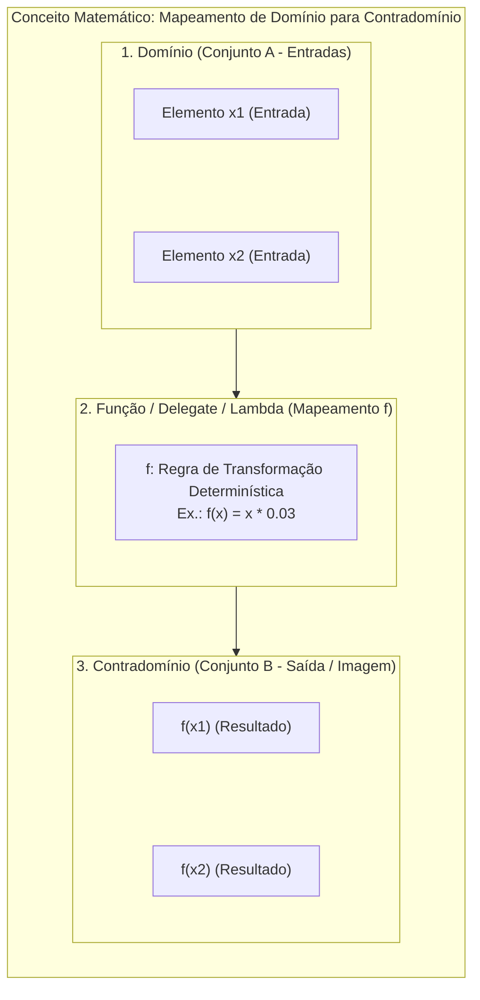
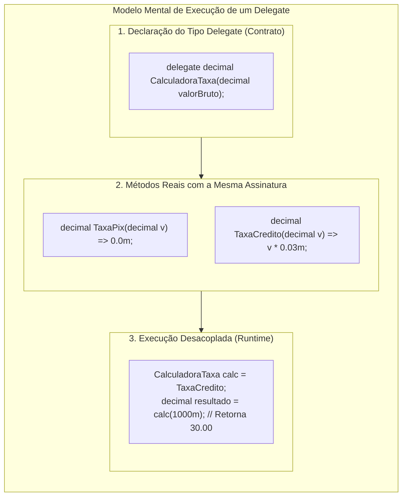
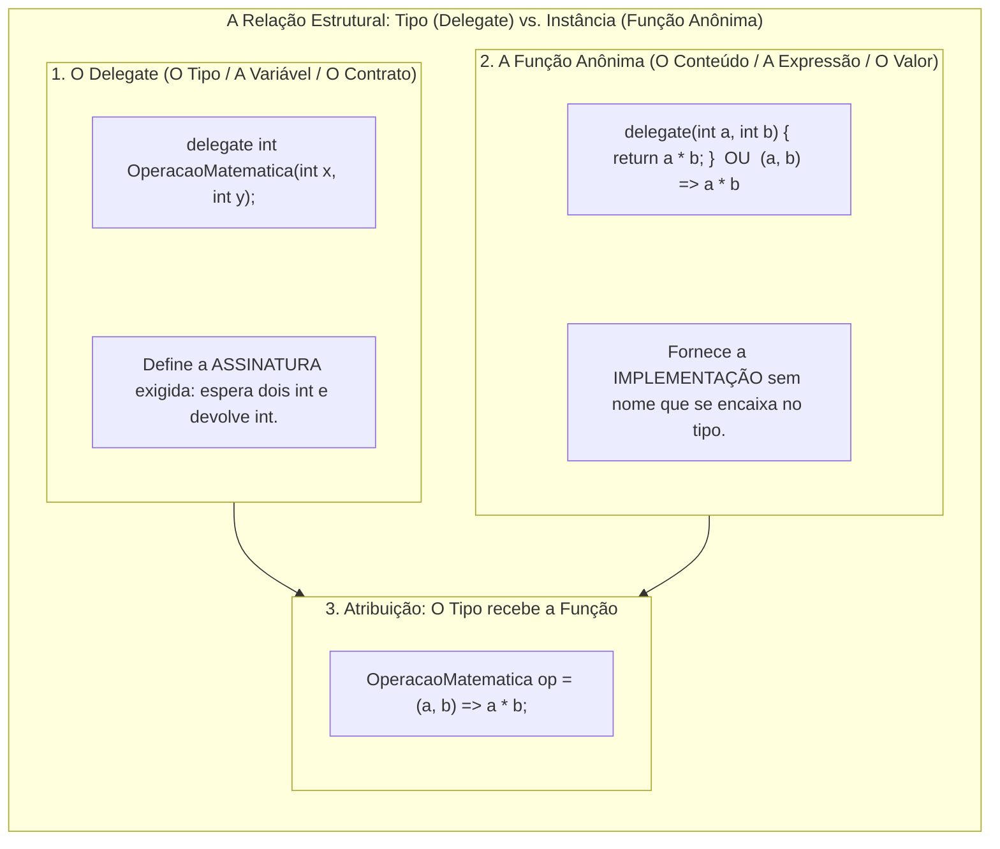
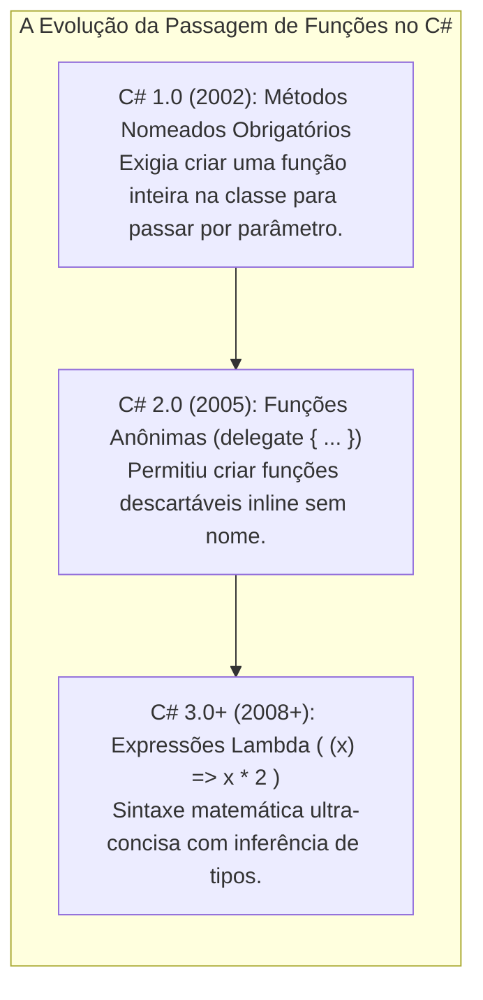
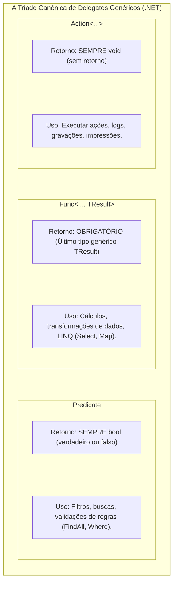
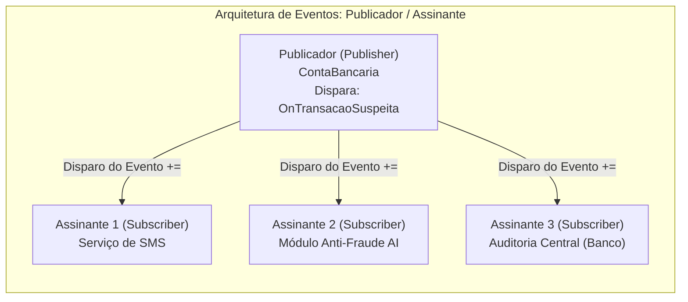

# 22. Delegates, funções anônimas, expressões lambda e eventos em C#

> **Contexto:** Estudo das três estruturas avançadas de programação em C#: **Delegações (*Delegates*)**, **Funções Anônimas / Expressões Lambda (`=>`)** e **Eventos (*Events*)**. Você aprenderá como passar funções como parâmetros de primeira classe, como simplificar o processamento de fluxos de dados com os delegates genéricos padrão do .NET (`Action`, `Func` e `Predicate`) e como desacoplar sistemas através do padrão arquitetural Publicador/Assinante (*Publisher-Subscriber*).

---

## 1. O problema arquitetural: Como passar comportamento como parâmetro?

Até agora, aprendemos a passar **dados como parâmetros** para nossos métodos: passamos números inteiros, textos, objetos e até coleções inteiras (`List<T>`).

Mas imagine o seguinte cenário no mundo real:

> *"Você desenvolveu uma classe `ProcessadorDePagamentos` genérica. A rotina lê a transação, conecta no banco e debita o valor. Porém, o cálculo da taxa de desconto varia drasticamente: se for Cartão de Crédito, desconta 3%; se for PIX, é zero; se for Boleto, desconta R$ 2,50 fixos. Como permitir que quem chama o método decida o algoritmo de cálculo sem modificar o código interno do processador?"*

Na programação estruturada clássica (C), isso era feito com **ponteiros de função brutos (`void (*func)()`)**, que eram perigosos, sem segurança de tipos e propensos a falhas de memória. 

Em C# e no .NET, a solução elegante, orientada a objetos e 100% segura (*Type-Safe*) são os **Delegates**.

---

### O fundamento matemático: Toda função é um mapeamento ($A \to B$)

Para compreender verdadeiramente por que delegates e expressões lambda existem na Ciência da Computação, devemos recorrer ao seu **fundamento na Teoria dos Conjuntos**:

> **Definição formal:** Uma **função** $f$ é uma relação de **mapeamento determinístico** que associa **cada elemento** de um conjunto $A$ (chamado de **Domínio** / valores de entrada) a **exatamente um elemento** de um conjunto $B$ (chamado de **Contradomínio** / valor de saída ou imagem):
> 
> $$f: A \to B$$
> $$x \in A \implies f(x) \in B$$



#### Como isso se materializa no código C#?
1. **`Func<TEntrada, TSaida>` como o mapeador direto:**
   - A assinatura `Func<int, string>` expressa matematicamente o mapeamento $f: \text{int} \to \text{string}$. Ela pega um número do domínio inteiro e mapeia para um texto no contradomínio string.
2. **`Predicate<T>` como função de pertinência lógica ($A \to \{\text{true}, \text{false}\}$):**
   - Um predicado é uma função matemática que mapeia qualquer elemento do domínio $T$ para o conjunto booleano binário $\{0, 1\}$. Ele responde: *"este elemento pertence ao subconjunto que satisfaz esta regra?"*.
3. **`Action<T>` como função com contradomínio vazio ($A \to \emptyset$ ou *Unit*):**
   - Mapeia a entrada para uma ação que produz apenas efeitos colaterais no ambiente (tela, disco ou rede), sem retornar um valor numérico.
4. **Operações de transformação em coleções (LINQ `.Select()`):**
   - Quando fazemos `listaClientes.Select(c => c.Nome)`, estamos aplicando a função de mapeamento $f: \text{Cliente} \to \text{string}$ sobre cada elemento do conjunto.

---

### A analogia de Feynman: O contrato de procuração em cartório

Pense em um **Delegate** como uma **procuração com firma reconhecida**:
1. **A declaração do delegate:** É o formulário do cartório que diz: *"Esta procuração só é válida para nomear alguém que assine um documento (receba um `decimal` do domínio) e devolva um comprovante (retorne um `decimal` do contradomínio)"*.
2. **O método:** É a pessoa física concreta que sabe assinar (o método `CalcularTaxaPix`).
3. **A instância do delegate:** É o documento assinado que carrega o número do telefone daquela pessoa física para que qualquer um possa ligar e pedir que ela execute a tarefa em seu lugar.



---

## 2. Delegações (*Delegates*): Ponteiros de função orientados a objetos e type-safe

Um **Delegate** é um **tipo de referência** que encapsula uma referência para um ou mais métodos com uma assinatura e tipo de retorno específicos.

### A. Declaração e uso básico
Para criar um delegate customizado, utilizamos a palavra-chave reservada `delegate`:

```csharp
// Exemplo atômico: Declaração e uso de delegate customizado
using System;

namespace ExemplosDelegates
{
    // 1. Definição do tipo delegate (aceita string e não retorna nada - void)
    public delegate void Notificador(string mensagem);

    public class ServicoNotificacao
    {
        public static void EnviarPorEmail(string texto) => Console.WriteLine($"Email enviado: {texto}");
        public static void EnviarPorSms(string texto) => Console.WriteLine($"SMS enviado: {texto}");
    }

    class Program
    {
        static void Main()
        {
            // 2. Instanciação do delegate apontando para um método estático compatível
            Notificador canal = ServicoNotificacao.EnviarPorEmail;

            // 3. Invocação direta
            canal("Seu pedido foi aprovado!"); // Executa EnviarPorEmail

            // 4. Redirecionamento dinâmico em tempo de execução
            canal = ServicoNotificacao.EnviarPorSms;
            canal("Seu código de login é 9482"); // Executa EnviarPorSms
        }
    }
}
```

---

### B. Delegações multicast (*Multicast Delegates* e operador `+=`)
Uma das características mais poderosas dos delegates no .NET é que **uma única variável delegate pode apontar para múltiplos métodos ao mesmo tempo**.

* Quando o delegate é invocado, todos os métodos da sua lista de invocação (*Invocation List*) são chamados sequencialmente na ordem em que foram adicionados.
* Utilizamos o operador **`+=`** para encadear métodos e o operador **`-=`** para desinscrever:

```csharp
// Exemplo atômico: Multicast Delegate
Notificador centralAlerta = ServicoNotificacao.EnviarPorEmail;
centralAlerta += ServicoNotificacao.EnviarPorSms; // Encadeia o segundo método

// Dispara Email E SMS com uma única chamada:
centralAlerta("Servidor fora do ar!"); 

centralAlerta -= ServicoNotificacao.EnviarPorEmail; // Remove o envio de email
centralAlerta("Alerta apenas via SMS");
```

---

## 3. Como os delegates se relacionam com as funções anônimas?

Para dominar a arquitetura do C#, é crucial entender a **relação simbiótica entre um Delegate e uma Função Anônima**:



### A relação conceitual: O Tipo e o Valor
* **O Delegate é o TIPO:** Assim como `int` é o tipo para guardar números inteiros e `string` é o tipo para guardar textos, **um `delegate` é o tipo formal para guardar funções**.
* **A Função Anônima / Lambda é o VALOR:** Ela é a "instância literal" do comportamento. Em vez de escrever `int x = 42;`, você escreve `Func<int, int> dobrar = x => x * 2;`.
* **Sem um Delegate, uma Função Anônima não pode existir no C#:** Uma expressão lambda `(a, b) => a + b` não tem tipo próprio por si só. O compilador Roslyn analisa o contexto e a **converte automaticamente em uma instância do delegate compatível** (`Func<int, int, int>`, `Operacao` ou `Expression<T>`).

---

### A evolução histórica da escrita de delegates

Historicamente, o C# evoluiu em três gerações para tornar a escrita de delegates cada vez mais concisa e legível:



---

### A. Funções anônimas (C# 2.0)
Permitem declarar o bloco de código diretamente no local de atribuição sem precisar criar um método separado na classe:

```csharp
// Exemplo atômico: Função Anônima com a palavra-chave delegate
Func<int, int, int> somador = delegate(int a, int b) 
{
    return a + b;
};

int total = somador(15, 25); // 40
```

---

### B. Expressões lambda (`=>` - C# 3.0+)
Uma **expressão lambda** é a forma moderna e simplificada de escrever funções anônimas. O operador lambda **`=>`** é lido como *"vai para"* ou *"resulta em"*:

$$\text{parâmetros de entrada} \implies \text{expressão ou bloco de código}$$

```csharp
// Exemplo atômico: Expressões Lambda
// 1. Sintaxe concisa com inferência de tipos:
Func<int, int, int> soma = (a, b) => a + b;

// 2. Lambda com um único parâmetro (parênteses opcionais):
Func<int, int> dobro = x => x * 2;

// 3. Lambda de instrução (com corpo em chaves):
Action<string> logFormatado = msg => 
{
    string timestamp = DateTime.Now.ToString("HH:mm:ss");
    Console.WriteLine($"[{timestamp}] LOG: {msg}");
};
```

---

### C. Funções que se adaptam ao contexto (*Closures* e Funções de Alta Ordem)

Um dos conceitos mais poderosos de linguagens modernas é a capacidade de **criar funções dinamicamente que se adaptam ao contexto de execução**.

#### 1. O que é um fechamento léxico (*Closure*)?
Uma **Closure** ocorre quando uma função anônima ou expressão lambda **captura e "lembra" as variáveis do escopo onde ela foi criada**, mesmo após esse escopo ter terminado de executar:

```csharp
// Exemplo atômico: Closure e Fábrica de Funções Adaptativas
public static Func<decimal, decimal> CriarCalculadoraComTaxaRegional(decimal taxaEstado)
{
    // A variável taxaEstado é do contexto externo; a lambda 'fecha' sobre ela:
    return valor => valor + (valor * taxaEstado);
}

// Em tempo de execução, adaptamos a função para o contexto de cada usuário:
var calcularSP = CriarCalculadoraComTaxaRegional(0.18m); // Adaptado para ICMS 18%
var calcularMG = CriarCalculadoraComTaxaRegional(0.12m); // Adaptado para ICMS 12%

Console.WriteLine(calcularSP(100m)); // R$ 118,00
Console.WriteLine(calcularMG(100m)); // R$ 112,00
```

#### 2. Conexão interdisciplinar: Adaptação ao contexto em Design de Interação (IHC)
Na disciplina de **[[08. Design de Interacao/01. O que é interação humano-computador e a visão teórica do ser humano#g.-variações-intra-indivíduo|Design de Interação (Artigo 01)]]**, aprendemos sobre as **Variações Intra-Indivíduo** (ex.: o mesmo usuário pode estar estressado, com pressa ou em um ambiente com baixa luminosidade) e as **Interfaces Adaptativas**.

* **Como isso se conecta com delegates e lambdas?**
  - O sistema pode trocar em tempo de execução a função de renderização ou de validação injetada na interface.
  - **Exemplo real:** Se a telemetria detectar que o usuário está em movimento ou com bateria fraca, o aplicativo substitui dinamicamente o delegate `Action<Frame> renderizador` por uma versão simplificada de alto contraste e baixo consumo de CPU:

```csharp
// Injeção de comportamento adaptativo baseado no contexto do usuário:
Action<string> notificacao = contexto.ModoNoturno 
    ? (msg => ExibirCardAltoContraste(msg)) 
    : (msg => ExibirToastPadrao(msg));

notificacao("Você tem uma nova mensagem");
```

---

## 4. A tríade canônica do .NET: `Action`, `Func` e `Predicate`

Para evitar que os desenvolvedores precisassem criar novos tipos `delegate` customizados para cada combinação de parâmetros, a Microsoft introduziu em `System` uma família de **delegates genéricos universais pré-fabricados**:



---

### Tabela comparativa dos delegates genéricos padrão:

| Delegate genérico | Assinatura típica | Tipo de retorno | Propósito arquitetural | Exemplo de código |
| :--- | :--- | :--- | :--- | :--- |
| **`Action<T1, T2...>`** | `Action<int, string>` | **`void`** (nada) | Efeitos colaterais, exibição e escrita | `Action<string> exibir = msg => Console.WriteLine(msg);` |
| **`Func<T1, T2..., TResult>`** | `Func<int, int, string>` | **`TResult`** | Mapeamento, cálculos e transformações | `Func<int, int, int> multiplicar = (x, y) => x * y;` |
| **`Predicate<T>`** | `Predicate<T>` | **`bool`** | Testes lógicos, critérios e filtros | `Predicate<int> ehPar = n => n % 2 == 0;` |

---

## 5. Eventos (*Events*): O padrão Publicador/Assinante (*Publisher-Subscriber*)

Um **Evento (`event`)** é um encapsulamento de segurança sobre um delegate. Ele implementa nativamente o **padrão de projeto Observer (*Publisher-Subscriber*)**, onde:
* O **Publicador (*Publisher*):** Dispara o evento quando algo importante acontece (ex.: `BotaoClicado`, `SaldoInsuficiente`, `PedidoAprovado`).
* Os **Assinantes (*Subscribers*):** Ouvem o evento e executam suas reações sem que o publicador saiba quem eles são.



### Por que usar `event` em vez de um delegate puro?
Se você expor um delegate `public` comum em uma classe, qualquer código externo desavisado pode fazer:
1. `conta.MeuDelegate = null;` (Apagar todas as assinaturas cadastradas pelos outros módulos!).
2. `conta.MeuDelegate();` (Disparar o evento de fora da classe publicadora, fraudando o sistema!).

A palavra-chave **`event`** cria uma camada protetora:
* O código externo **só pode adicionar (`+=`) ou remover (`-=`)** seus próprios métodos.
* **Apenas a própria classe dona do evento pode dispará-lo (`Invoke`)**.

---

## 6. Exemplo completo e integrado em C# (Sistema financeiro com eventos e telemetria)

O código executável e compilável a seguir integra **Delegates customizados**, **`Func`**, **`Predicate`**, **Expressões Lambda** e um **Sistema de Eventos corporativo**:

```csharp
using System;
using System.Collections.Generic;

namespace SistemaFinanceiroEventos
{
    // 1. Argumentos customizados do evento
    public class TransacaoEventArgs : EventArgs
    {
        public string IdTransacao { get; }
        public string Conta { get; }
        public decimal Valor { get; }
        public DateTime DataHora { get; }

        public TransacaoEventArgs(string id, string conta, decimal valor)
        {
            IdTransacao = id;
            Conta = conta;
            Valor = valor;
            DataHora = DateTime.Now;
        }
    }

    // 2. Classe Publicadora (Publisher)
    public class ProcessadorFinanceiro
    {
        // Declaração do Evento protegido usando o padrão oficial EventHandler<T>
        public event EventHandler<TransacaoEventArgs>? TransacaoConcluida;
        public event EventHandler<TransacaoEventArgs>? AlertaFraudeDetectada;

        // Processamento com injeção de comportamento via Func e Predicate
        public void Processar(
            string id, 
            string conta, 
            decimal valorBruto, 
            Func<decimal, decimal> calcularTaxa, 
            Predicate<decimal> ehSuspeita)
        {
            decimal taxa = calcularTaxa(valorBruto);
            decimal valorLiquido = valorBruto - taxa;

            Console.WriteLine($"[Processador] Transação {id} processada. Bruto: R$ {valorBruto:F2} | Taxa: R$ {taxa:F2} | Líquido: R$ {valorLiquido:F2}");

            var args = new TransacaoEventArgs(id, conta, valorBruto);

            // Verifica regra de suspeita via Predicate
            if (ehSuspeita(valorBruto))
            {
                // Disparo do evento de fraude de forma segura com operador nulo (?)
                AlertaFraudeDetectada?.Invoke(this, args);
            }
            else
            {
                // Disparo do evento de sucesso
                TransacaoConcluida?.Invoke(this, args);
            }
        }
    }

    // 3. Classes Assinantes (Subscribers)
    public class ServicoNotificacao
    {
        public void OnTransacaoSucesso(object? sender, TransacaoEventArgs e)
        {
            Console.WriteLine($"  -> [Notificação] SMS enviado para a conta {e.Conta}: Transação {e.IdTransacao} aprovada.");
        }

        public void OnAlertaFraude(object? sender, TransacaoEventArgs e)
        {
            Console.ForegroundColor = ConsoleColor.Red;
            Console.WriteLine($"  -> [ALERTA DE SEGURANÇA] Bloqueio preventivo na conta {e.Conta}! Transação atípica de R$ {e.Valor:F2}.");
            Console.ResetColor();
        }
    }

    public class ModuloAuditoria
    {
        public void GravarLog(object? sender, TransacaoEventArgs e)
        {
            Console.WriteLine($"  -> [Auditoria] Transação {e.IdTransacao} persistida no banco imutável às {e.DataHora:HH:mm:ss}.");
        }
    }

    // 4. Fluxo Principal Integrado
    class Program
    {
        static void Main()
        {
            ProcessadorFinanceiro motor = new ProcessadorFinanceiro();
            ServicoNotificacao notificacoes = new ServicoNotificacao();
            ModuloAuditoria auditoria = new ModuloAuditoria();

            // Inscrição dos assinantes nos eventos usando o operador +=
            motor.TransacaoConcluida += notificacoes.OnTransacaoSucesso;
            motor.TransacaoConcluida += auditoria.GravarLog;
            motor.AlertaFraudeDetectada += notificacoes.OnAlertaFraude;
            motor.AlertaFraudeDetectada += auditoria.GravarLog;

            Console.WriteLine("=== CENÁRIO 1: TRANSAÇÃO NORMAL VIA PIX (LAMBDAS INLINE) ===");
            // Injeta cálculo de taxa zero via Lambda e regra de suspeita (> R$ 10.000)
            motor.Processar(
                id: "TX-9901",
                conta: "00123-4",
                valorBruto: 350.00m,
                calcularTaxa: v => 0.00m, // PIX sem taxa
                ehSuspeita: v => v > 10000.00m
            );

            Console.WriteLine("\n=== CENÁRIO 2: TRANSAÇÃO DE ALTO VALOR (SUSPEITA DE FRAUDE) ===");
            // Injeta cálculo de taxa de cartão (2.5%) e dispara o fluxo de alerta
            motor.Processar(
                id: "TX-9902",
                conta: "00999-9",
                valorBruto: 45000.00m,
                calcularTaxa: v => v * 0.025m,
                ehSuspeita: v => v > 10000.00m
            );
        }
    }
}
```

---

## 7. Resumo conceitual e pontos-chave

1. **Delegates são tipos:** Funcionam como contratos seguros para transportar referências a métodos com assinatura idêntica.
2. **Multicast nativo:** Com o operador `+=`, um delegate pode disparar múltiplos métodos em cadeia com uma única invocação.
3. **Lambdas simplificam a sintaxe:** O operador `=>` elimina código repetitivo (*boilerplate*), permitindo criar funções descartáveis no próprio ponto de uso.
4. **Use a biblioteca padrão:** Prefira sempre `Action` (sem retorno), `Func` (com retorno) e `Predicate` (retorna bool) em vez de criar delegates customizados.
5. **Eventos garantem encapsulamento:** Protegem a lista de assinantes contra sobrescrita acidental e garantem que apenas a classe emissora possa disparar a notificação.

---

## Referências bibliográficas

### Bibliografia básica
* RICHTER, Jeffrey. **CLR via C#**. 4. ed. Redmond: Microsoft Press, 2012. *(Capítulo 17: Delegates e Eventos)*.
* ALBAHARI, Joseph; ALBAHARI, Ben. **C# 10 in a Nutshell: The Definitive Reference**. Sebastopol: O'Reilly Media, 2022. *(Capítulo 4: Advanced C# - Delegates and Events)*.
* DE PAULA, Hugo. **Programação Modular: Delegates, Funções Lambda e Eventos em C#**. Repositório GitHub, 2023. Disponível em: [https://github.com/hugodepaula/programacao-modular-ead](https://github.com/hugodepaula/programacao-modular-ead).

### Bibliografia complementar
* MICROSOFT. **Delegates (Guia de Programação em C#)**. Microsoft Learn, 2023. Disponível em: [https://learn.microsoft.com/pt-br/dotnet/csharp/programming-guide/delegates/](https://learn.microsoft.com/pt-br/dotnet/csharp/programming-guide/delegates/).
* MICROSOFT. **Visão Geral de Eventos e Roteamento no .NET**. Microsoft Learn, 2023. Disponível em: [https://learn.microsoft.com/pt-br/dotnet/standard/events/](https://learn.microsoft.com/pt-br/dotnet/standard/events/).
* FREEMAN, Eric; ROBSON, Elisabeth. **Use a Cabeça! Padrões de Projetos**. 2. ed. Rio de Janeiro: Alta Books, 2021. *(Padrão Observer / Publicador-Assinante)*.

---

## Artigos relacionados e navegação

* **Artigo anterior:** [[21. Coleções genéricas em C# (estruturas de dados, propósitos e performance assintótica)]]
* **Resumo da disciplina:** [[00. Programação modular - Resumo]]
* **Glossário da disciplina:** [[Glossário de conceitos]]
* **Guia de sintaxe multilinguagem (Lambdas e Delegates):** [[00. Sintaxe Multilinguagem/10. Expressões lambda, callbacks e delegates (funções de primeira classe)]]
* **Índice geral do vault:** [[index.md|Página inicial do vault]]
