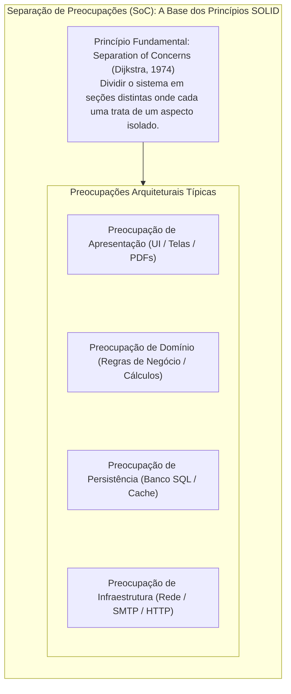
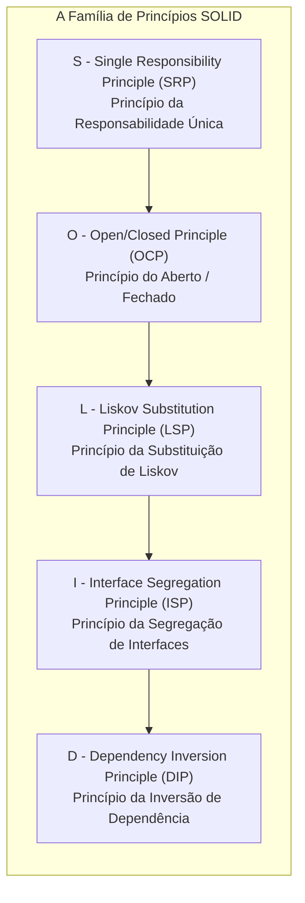
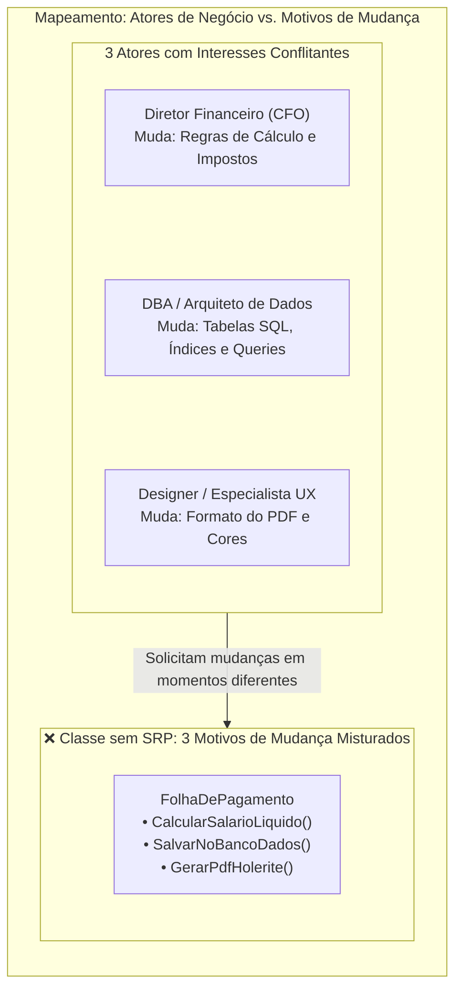
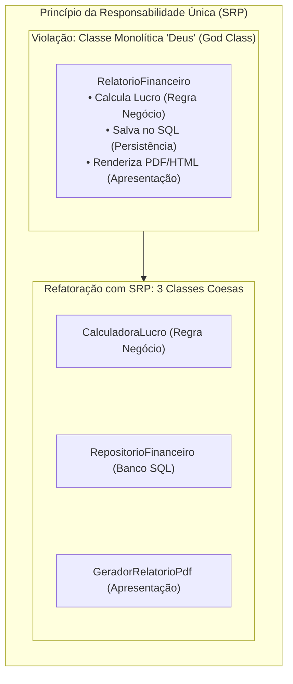
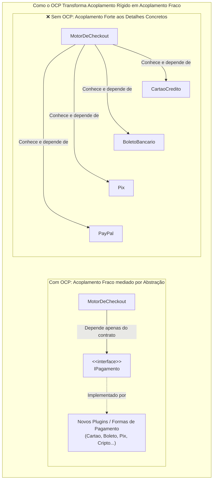
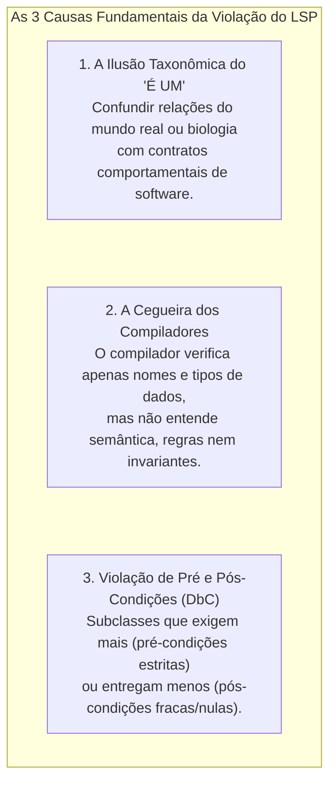
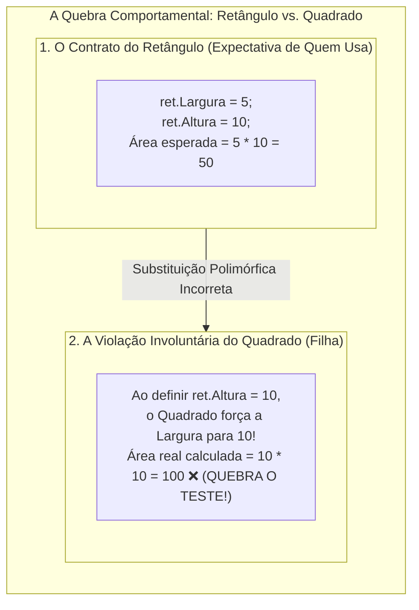
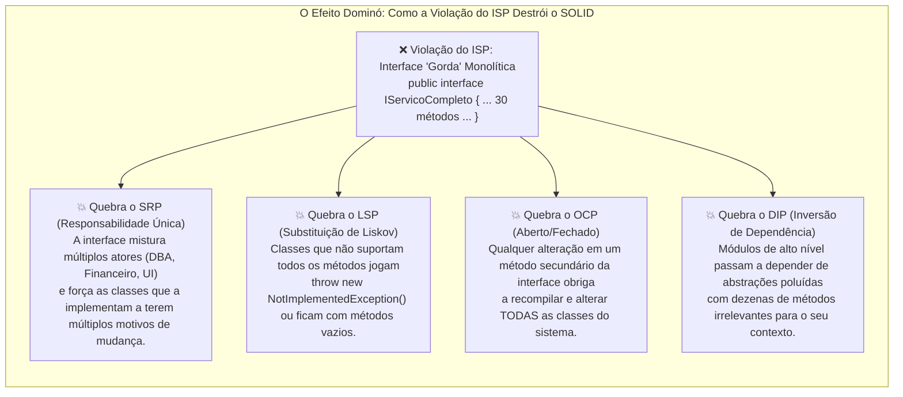
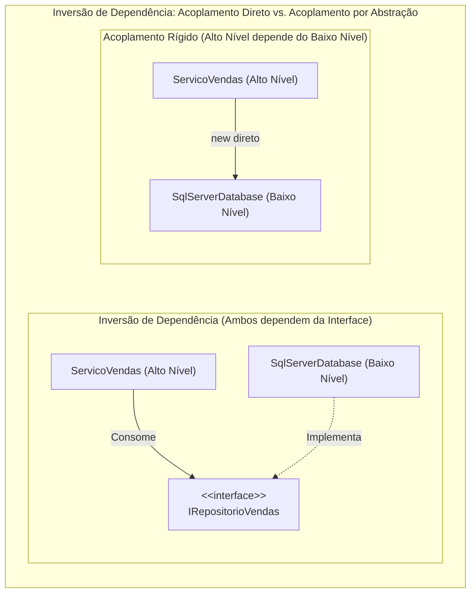

# 23. Princípios SOLID de design orientado a objetos

> **Contexto:** Estudo aprofundado dos cinco princípios fundamentais de **Design Orientado a Objetos (SOLID)** compilados por Robert C. Martin (*Uncle Bob*). Você compreenderá como a aplicação disciplinada desses princípios reduz o acoplamento, maximiza a coesão, previne a fragilidade arquitetural e constrói sistemas extensíveis, testáveis e de fácil manutenção ao longo do ciclo de vida de software.

---

## 1. O que é SOLID e por que ele existe? (Técnica de Feynman)

Criar software funcional que simplesmente "roda na máquina" é a parte fácil da programação. O verdadeiro desafio da Engenharia de Software é **criar sistemas que continuem fáceis de alterar após 1, 5 ou 10 anos de evolução contínua**.

Sem princípios orientadores claros, o código sofre do que chamamos de **Decomposição Arquitetural (*Software Rot*)**:
1. **Rigidez:** Uma pequena alteração exige mudar 20 arquivos diferentes em cascata.
2. **Fragilidade:** Corrigir um bug no módulo de pagamentos quebra o envio de emails sem motivo aparente.
3. **Imobilidade:** Você não consegue reaproveitar um algoritmo de cálculo em outro projeto porque ele está fundido com código de banco de dados e telas.

---

### A analogia de Feynman: O canivete suíço vs. a caixa de ferramentas modular

Imagine que você precisa fazer reparos em casa:
* **Código sem SOLID (O canivete gigante fundido):** É uma ferramenta monolítica com 50 lâminas soldadas juntas. Se a chave de fenda quebrar, você precisa jogar o canivete inteiro no lixo. Se você quiser apenas apertar um parafuso pequeno, terá que segurar um bloco pesado de 5 kg que machuca a sua mão.
* **Código com SOLID (A caixa de ferramentas modular):** Cada ferramenta faz apenas uma coisa com perfeição (o martelo bate, a chave aperta). Os cabos e encaixes seguem um **padrão universal (*Interface*)**: se você precisar trocar uma ponta Phillips por uma ponta Allen, basta desencaixar a ponta antiga e encaixar a nova em 2 segundos, sem quebrar o cabo nem a caixa.

---

### O fundamento arquitetural: Separação de Preocupações (*Separation of Concerns - SoC*)

Antes mesmo do acrônimo SOLID ser cunhado, o princípio mais fundamental de toda a Engenharia de Software já havia sido formalizado por **Edsger W. Dijkstra em 1974**: a **Separação de Preocupações (*Separation of Concerns - SoC*)**.

> **O Princípio de Dijkstra (1974):**
> *"É o que às vezes chamo de 'separação de preocupações', que, mesmo se não for perfeitamente possível, é a única maneira disponível que conhecemos para ordenar nossos pensamentos de forma eficaz... Isso é o que significa focar a atenção em um aspecto de cada vez."* — Edsger W. Dijkstra



#### Como o SoC se relaciona com o SOLID e o SRP?
1. **SoC é o conceito amplo e arquitetural:** Aplica-se a camadas inteiras de software (ex.: arquitetura em camadas MVC, Microsserviços, Clean Architecture).
2. **SRP é a aplicação do SoC no nível de classes e métodos:** O *Single Responsibility Principle* nada mais é do que **a materialização do SoC dentro da Programação Orientada a Objetos**, garantindo que uma classe não misture a preocupação de *armazenar dados* com a preocupação de *calcular regras fiscais*.
3. **Redução da Carga Cognitiva:** Ao isolar preocupações, o desenvolvedor pode focar 100% da sua mente na regra de negócio sem precisar se preocupar com comandos SQL ou tags HTML no mesmo momento.

---

## 2. A anatomia do acrônimo SOLID

O acrônimo **SOLID** sintetiza cinco heurísticas de design de classes formuladas no início dos anos 2000:



---

## 3. Os 5 princípios em detalhes: Teoria, violação e refatoração em C#

---

### 1. SRP: Single Responsibility Principle (Princípio da Responsabilidade Única)

> *"Uma classe deve ter um, e apenas um, motivo para mudar."* — Robert C. Martin

Cada classe deve encapsular uma única responsabilidade de negócio coesa. Se uma classe atende a múltiplos atores (ex.: regras contábeis do Diretor Financeiro e geração de HTML do Web Designer), ela sofrerá alterações conflitantes.

---

#### O que é exatamente um "motivo de mudança" (*Reason to Change*)?

Uma das maiores armadilhas de interpretação do SRP é confundir *"fazer apenas uma coisa no código"* com *"ter apenas um motivo para mudar"*.

> **Definição formal de Robert C. Martin (*Uncle Bob*):**
> Um **motivo de mudança** não é uma linha de código ou um algoritmo técnico; **um motivo de mudança é uma pessoa, grupo ou departamento de negócio (um *Ator / Stakeholder*) que tem autoridade para solicitar alterações no sistema**.
> 
> Em termos práticos: **Uma classe deve ser responsável perante um, e apenas um, Ator de negócio.**



#### Por que misturar múltiplos atores é perigoso?
1. **Conflito de merges no Git (*Merge Hell*):** Se o time financeiro estiver alterando a fórmula do INSS no mesmo arquivo em que o time de DBA está otimizando a query de banco, os programadores sofrerão com conflitos constantes de código.
2. **Efeitos colaterais cruzados (*Fragilidade*):** Uma mudança solicitada pelo setor de UX na formatação do PDF pode quebrar acidentalmente a lógica de cálculo financeiro que estava no mesmo arquivo.
3. **Impossibilidade de testes isolados:** Para testar uma simples regra matemática de desconto, você é obrigado a instanciar drivers de banco de dados e servidores de email.

---



#### Código C# (Antes vs. Depois):

```csharp
// ❌ VIOLAÇÃO DO SRP: A classe faz cálculo de negócio, salva no banco e envia email
public class PedidoInseguro
{
    public decimal ValorTotal { get; set; }

    public void CalcularDesconto() { /* Regra de negócio */ }
    public void SalvarNoBancoDados() { /* Código SQL / Entity Framework */ }
    public void EnviarEmailConfirmacao() { /* Conexão SMTP de rede */ }
}

//  ADERENTE AO SRP: Cada classe com responsabilidade atômica e coesa
public class Pedido
{
    public decimal ValorTotal { get; set; }
    public void CalcularDesconto() { /* Apenas regras do pedido */ }
}

public class RepositorioPedido
{
    public void Salvar(Pedido pedido) { /* Apenas persistência SQL */ }
}

public class ServicoNotificacaoEmail
{
    public void EnviarConfirmacao(Pedido pedido) { /* Apenas transporte de email */ }
}
```

---

### 2. OCP: Open/Closed Principle (Princípio do Aberto / Fechado)

> *"Entidades de software (classes, módulos, funções) devem estar abertas para extensão, mas fechadas para modificação."* — Bertrand Meyer

Você deve ser capaz de **adicionar novos comportamentos e funcionalidades ao sistema sem alterar o código-fonte existente** que já foi testado e homologado em produção.

---

#### A relação direta entre OCP e Acoplamento (Conexão com o [[04. Programação orientada a objetos e acoplamento|Artigo 04]])

O **Princípio do Aberto/Fechado (OCP)** é a materialização máxima da luta contra o **Acoplamento Forte (*Tight Coupling*)**:



1. **Acoplamento por Tipagem Concreta (*Sem OCP*):**
   - Quando uma classe controladora usa estruturas `if/else` ou `switch/case` inspecionando strings ou enums de tipos concretos, ela se torna **acoplada a todas as implementações existentes**.
   - **O custo do acoplamento:** Se a empresa passar a aceitar *Criptomoedas*, o desenvolvedor precisa abrir a classe `MotorDeCheckout` e inserir um novo `case "Cripto"`. Isso gera risco de regressão em código já testado e quebra a **Independência Funcional** estudada no [[06. Fatores internos de qualidade de software|Artigo 06]].
2. **Acoplamento por Contrato Abstrato (*Com OCP*):**
   - Ao aplicar o OCP via **Polimorfismo e Interfaces**, o `MotorDeCheckout` passa a depender apenas de um contrato genérico (`IPagamento`).
   - O acoplamento cai ao nível mínimo indispensável: o motor **não sabe e não quer saber** quantas formas de pagamento existem no mundo. Ele apenas invoca `meioPagamento.Processar(valor)`. Para adicionar *Criptomoedas*, basta criar a classe `PagamentoCripto : IPagamento` sem tocar em uma única vírgula do motor central.

---

#### A relação entre OCP e Herança: A formulação original de Bertrand Meyer vs. POO Moderna

A gênese histórica do OCP está intrinsecamente ligada à **Herança**:

1. **A formulação clássica de Bertrand Meyer (1988 - Extensão por Herança):**
   - Na visão original de Meyer (*Object-Oriented Software Construction*), uma classe é considerada **fechada** quando é compilada, testada e homologada em uma biblioteca (`.dll`).
   - Para estendê-la (*aberta*), os desenvolvedores criam **subclasses herdando da classe original**, sobrescrevendo métodos `virtual` ou implementando métodos `abstract` (como estudado nos [[15. Herança (generalização, especialização e extensibilidade modular)|Artigo 15]] e [[18. Classes abstratas e métodos abstratos (contratos de herança e polimorfismo puro)|Artigo 18]]).
2. **A evolução polimórfica (Uncle Bob: Composição e Interfaces):**
   - A herança de classes cria um **acoplamento forte de implementação** entre a classe pai e o filho. Se a classe pai mudar seus campos internos, todas as filhas podem quebrar.
   - O design moderno do OCP expande a herança para **Polimorfismo de Interfaces e Composição**: estendemos o comportamento não apenas criando subclasses, mas fornecendo novos objetos que cumprem o mesmo contrato de interface.

---

```csharp
// ❌ VIOLAÇÃO DO OCP: Toda vez que surgir um novo tipo de pagamento, temos que MODIFICAR este método
public class ProcessadorPagamentoInseguro
{
    public void Processar(string tipo, decimal valor)
    {
        if (tipo == "Cartao") { /* débito cartão */ }
        else if (tipo == "Boleto") { /* gera boleto */ }
        else if (tipo == "Pix") { /* gera qrcode pix */ } // Modificou código já existente!
    }
}

//  ADERENTE AO OCP: Fechado para alteração, aberto para extensão via polimorfismo
public interface IPagamento
{
    void Processar(decimal valor);
}

public class PagamentoCartao : IPagamento
{
    public void Processar(decimal valor) => Console.WriteLine($"Debitando R$ {valor} no cartão.");
}

public class PagamentoPix : IPagamento
{
    public void Processar(decimal valor) => Console.WriteLine($"Gerando PIX no valor de R$ {valor}.");
}

// O motor está 100% FECHADO para alteração; novos métodos de pagamento são novas classes!
public class MotorDeCheckout
{
    public void FinalizarCompra(IPagamento meioPagamento, decimal valor)
    {
        meioPagamento.Processar(valor);
    }
}
```

---

### 3. LSP: Liskov Substitution Principle (Princípio da Substituição de Liskov)

> *"Se $q(x)$ é uma propriedade demonstrável dos objetos $x$ do tipo $T$, então $q(y)$ deve ser verdadeiro para objetos $y$ do tipo $S$, onde $S$ é um subtipo de $T$."* — Barbara Liskov (1987)

Em termos práticos: **Subclasses devem poder substituir suas superclasses sem quebrar a corretude ou as expectativas do programa**. Uma classe filha não pode enfraquecer pré-condições nem lançar exceções inesperadas para métodos herdados.

---

#### Por que o Princípio de Liskov (LSP) é tão fácil e comum de ser violado?

O LSP é considerado por arquitetos de software como o **mais sutil e frequentemente violado** dos cinco princípios SOLID por três razões fundamentais:



#### 1. A armadilha do modelo mental do mundo real ("É UM" vs. "Comporta-se como")
* **O erro humano:** No mundo real e na taxonomia biológica, dizemos: *"Um Pinguim é uma Ave"*, *"Um Avestruz é um Pássaro"* ou *"Um Quadrado é um Retângulo"*.
* **A realidade do software:** Em POO, herança **não é sobre classificação biológica, mas sobre COMPORTAMENTO**. Se a classe base `Ave` tem o método `Voar()`, quem consome uma referência polimórfica `Ave a` espera que chamar `a.Voar()` faça a ave voar. Se o `Pinguim` lançar `NotSupportedException` ou ficar em branco, **a expectativa do consumidor foi traída em tempo de execução**.

#### 2. O compilador não consegue detectar a quebra do LSP
* O compilador C# (Roslyn) faz a checagem **sintática** e vê que a assinatura é perfeitamente válida:
  `public override void Processar(decimal v)` aceita um `decimal` e devolve `void`.
* Porém, a quebra do LSP é **semântica e comportamental**: o compilador não sabe se a subclasse colocou um `throw new Exception()` ou se violou uma regra matemática. O erro só explode em produção na mão do usuário.

#### 3. As regras de Design by Contract (Bertrand Meyer) para honrar o LSP
Para que uma subclasse respeite formalmente o LSP, ela deve obedecer às regras de **Contrato Comportamental**:
* **Pré-condições não podem ser fortalecidas na subclasse:** Se o pai aceita valores de 0 a 1000, a filha não pode exigir que sejam maiores que 500 (ou quebrará os clientes do pai).
* **Pós-condições não podem ser enfraquecidas na subclasse:** Se o pai garante devolver um relatório formatado não-nulo, a filha não pode devolver `null` ou um arquivo vazio.
* **Invariantes devem ser mantidas:** Todas as regras imutáveis da classe base devem continuar válidas nas filhas.
* **Proibição de exceções surpresa (*No New Exceptions*):** A subclasse não deve lançar novos tipos de exceções que quem consome a classe base não esteja preparado para capturar com `catch`.

---

#### O clássico contraexemplo acadêmico: O Retângulo e o Quadrado

O exemplo mais famoso de violação do LSP em salas de aula e na literatura de Robert C. Martin e Barbara Liskov é o paradoxo da geometria:

* **Na Geometria (Matemática Pura):** Todo quadrado *é um* retângulo especial cujos lados têm comprimentos iguais.
* **Na Programação Orientada a Objetos (Comportamento de Software):** Um `Quadrado` **NÃO PODE herdar de `Retângulo` com propriedades mutáveis independentes** sem quebrar os clientes que consomem a superclasse.



#### Demonstração em código C# (A quebra do contrato):

```csharp
// ❌ VIOLAÇÃO GRAVE DO LSP: Quadrado herda de Retângulo
public class Retangulo
{
    public virtual double Largura { get; set; }
    public virtual double Altura { get; set; }

    public double CalcularArea() => Largura * Altura;
}

public class Quadrado : Retangulo
{
    // Para manter lados iguais, alterar a largura altera a altura e vice-versa:
    public override double Largura
    {
        get => base.Largura;
        set { base.Largura = value; base.Altura = value; }
    }

    public override double Altura
    {
        get => base.Altura;
        set { base.Largura = value; base.Altura = value; }
    }
}

// O CÓDIGO DO CLIENTE QUE QUEBRA EM RUNTIME:
public class TestadorGeometrico
{
    public static void RedimensionarEAvaliar(Retangulo r)
    {
        r.Largura = 5;
        r.Altura = 10;

        // O cliente espera legitimamente que a área seja 50 (5 * 10):
        double area = r.CalcularArea();
        
        // Se r for um Quadrado, a área será 100! O teste falha e o sistema quebra!
        Console.WriteLine($"Área calculada: {area} (Esperado: 50)");
    }
}
```

---

#### A Solução Aderente ao LSP (Segregação por Abstração Imutável ou Interfaces):

Em vez de forçar uma herança espúria de mutabilidade, modelamos uma interface de contrato onde apenas o comportamento comum e verdadeiro (`CalcularArea`) é compartilhado:

```csharp
//  ADERENTE AO LSP: Interface que expressa a capacidade real compartilhada
public interface IFormaGeometrica
{
    double CalcularArea();
}

public class Retangulo : IFormaGeometrica
{
    public double Largura { get; }
    public double Altura { get; }

    public Retangulo(double largura, double altura)
    {
        Largura = largura;
        Altura = altura;
    }

    public double CalcularArea() => Largura * Altura;
}

public class Quadrado : IFormaGeometrica
{
    public double Lado { get; }

    public Quadrado(double lado)
    {
        Lado = lado;
    }

    public double CalcularArea() => Lado * Lado;
}
```

---

### 4. ISP: Interface Segregation Principle (Princípio da Segregação de Interfaces)

> *"Muitas interfaces específicas de clientes são melhores do que uma interface de propósito geral única."* — Robert C. Martin

Nenhuma classe deve ser forçada a depender de métodos que ela não utiliza. É preferível quebrar interfaces volumosas e "gordas" (*Fat Interfaces*) em múltiplas interfaces menores, coesas e granulares (*Role Interfaces*).

---

#### O efeito dominó do ISP: Por que violar o ISP quase sempre destrói os outros princípios?

Na arquitetura de software, o ISP funciona como uma **pedra angular**. Quando uma interface "gorda" e monolítica (*Fat Interface*) é criada, ela dispara uma **reação em cadeia de violações nos outros 4 princípios SOLID**:



#### 1. A violação do ISP quebra o SRP:
Uma interface gorda agrupa comportamentos de **atores de negócio diferentes**. A classe que a implementa é obrigada a conter métodos de banco de dados, regras de negócio e renderização de tela, acumulando **múltiplos motivos de mudança**.

#### 2. A violação do ISP quebra o LSP:
Se a interface `ITrabalhador` exige `void Comer()`, a classe `RoboIndustrial` não tem como implementar esse método. O desenvolvedor é forçado a escrever:
```csharp
public void Comer() => throw new NotImplementedException("Robôs não comem!");
```
Isso **destrói imediatamente o LSP**, pois um cliente que interage polimorficamente com `ITrabalhador t` e chama `t.Comer()` terá o sistema quebrado em tempo de execução.

#### 3. A violação do ISP quebra o OCP e gera Acoplamento Tóxico:
Se um novo cliente precisar de um método a mais na interface gorda (`void EmitirRelatorioPdf()`), **todas as 50 classes que já implementavam essa interface quebrarão**, exigindo alterações em massa em código que já estava testado e estável.

#### 4. A violação do ISP enfraquece o DIP:
O Princípio de Inversão de Dependência diz que devemos depender de abstrações. Mas depender de uma **abstração poluída e gorda** é quase tão prejudicial quanto depender de uma classe concreta, pois acopla seu módulo a contratos desnecessários.

---

```csharp
// ❌ VIOLAÇÃO DO ISP: Interface "gorda" que força robôs a comer e humanos a recarregar bateria
public interface ITrabalhadorInseguro
{
    void Trabalhar();
    void Comer();
    void RecarregarBateria();
}

//  ADERENTE AO ISP: Interfaces segregadas por capacidade de atuação
public interface ITrabalhador
{
    void Trabalhar();
}

public interface IAlimentavel
{
    void Comer();
}

public interface IRecarregavel
{
    void RecarregarBateria();
}

public class OperarioHumano : ITrabalhador, IAlimentavel
{
    public void Trabalhar() => Console.WriteLine("Operário montando peças.");
    public void Comer() => Console.WriteLine("Pausa para o almoço.");
}

public class RoboIndustrial : ITrabalhador, IRecarregavel
{
    public void Trabalhar() => Console.WriteLine("Braço robótico soldando chapa.");
    public void RecarregarBateria() => Console.WriteLine("Conectado na rede 220V.");
}
```

---

### 5. DIP: Dependency Inversion Principle (Princípio da Inversão de Dependência)

> *"1. Módulos de alto nível não devem depender de módulos de baixo nível. Ambos devem depender de abstrações.<br>2. Abstrações não devem depender de detalhes. Detalhes devem depender de abstrações."* — Robert C. Martin

* **Módulo de Alto Nível:** É o coração do negócio (as regras que dão lucro à empresa, ex.: `ProcessadorDeEmprestimos`).
* **Módulo de Baixo Nível:** São os detalhes técnicos de infraestrutura (banco SQL, chamadas HTTP, envio de SMS).
* **Inversão:** O módulo de alto nível nunca deve dar `new SqlServerConnection()` diretamente; ele deve declarar uma **interface abstrata** (`IRepositorio`), e a infraestrutura externa deve se adaptar a ela.



#### Código C# (Injeção de Dependência na Prática):

```csharp
// ❌ VIOLAÇÃO DO DIP: Alto nível engessado em um banco de dados específico
public class ServicoEnvioNotificacaoInseguro
{
    private SmsTwilioDriver _driver = new SmsTwilioDriver(); // Acoplamento direto rígido!

    public void Notificar(string msg) => _driver.EnviarSms(msg);
}

//  ADERENTE AO DIP: Dependência invertida via abstração e injeção por construtor
public interface IServicoMensageria
{
    void Enviar(string destinatario, string mensagem);
}

public class ServicoTwilioSms : IServicoMensageria
{
    public void Enviar(string dest, string msg) => Console.WriteLine($"SMS via Twilio para {dest}: {msg}");
}

public class ServicoAwsSesEmail : IServicoMensageria
{
    public void Enviar(string dest, string msg) => Console.WriteLine($"Email via AWS SES para {dest}: {msg}");
}

// Alto nível 100% isolado de detalhes de fornecedores:
public class ServicoNotificacaoUsuario
{
    private readonly IServicoMensageria _mensageria;

    // Injeção de Dependência via Construtor:
    public ServicoNotificacaoUsuario(IServicoMensageria mensageria)
    {
        _mensageria = mensageria;
    }

    public void EmitirAlerta(string usuario, string aviso)
    {
        _mensageria.Enviar(usuario, aviso);
    }
}
```

---

## 4. Matriz resumo dos princípios SOLID

| Princípio | Sigla | Heurística Central | Pergunta-chave de Diagnóstico | Solução Típica em C# |
| :--- | :--- | :--- | :--- | :--- |
| **Single Responsibility** | **SRP** | Uma classe, uma única razão para mudar. | *"Esta classe está misturando regras de negócio com persistência ou apresentação?"* | Quebrar em classes menores e especializadas. |
| **Open/Closed** | **OCP** | Aberto para extensão, fechado para modificação. | *"Toda vez que adiciono uma opção preciso alterar `switch` ou `if` existente?"* | Interfaces, classes abstratas e polimorfismo. |
| **Liskov Substitution** | **LSP** | Filhas devem honrar todos os contratos dos pais. | *"Alguma subclasse está lançando `NotImplementedException` em métodos herdados?"* | Refatorar a hierarquia ou segregar interfaces. |
| **Interface Segregation** | **ISP** | Clientes não devem depender de métodos inúteis. | *"Minha classe é obrigada a implementar métodos em branco para satisfazer a interface?"* | Criar interfaces menores e específicas de papel. |
| **Dependency Inversion** | **DIP** | Dependa de abstrações, não de implementações. | *"Estou usando `new ClasseConcreta()` dentro das classes centrais de negócio?"* | Injeção de dependência via interfaces no construtor. |

---

## 5. Exemplo completo e integrado em C# (Sistema bancário aderente ao SOLID)

O exemplo a seguir reúne os 5 princípios SOLID em um sistema corporativo compilável e executável:

```csharp
using System;
using System.Collections.Generic;

namespace ExemploIntegradoSOLID
{
    // ==========================================
    // 1. DOMÍNIO E RESPONSABILIDADE ÚNICA (SRP)
    // ==========================================
    public class ContaBancaria
    {
        public string Numero { get; }
        public decimal Saldo { get; private set; }

        public ContaBancaria(string numero, decimal saldoInicial)
        {
            Numero = numero;
            Saldo = saldoInicial;
        }

        public void Creditar(decimal valor) => Saldo += valor;

        public bool Debitar(decimal valor)
        {
            if (Saldo < valor) return false;
            Saldo -= valor;
            return true;
        }
    }

    // ==========================================
    // 2. ABERTO/FECHADO (OCP) E LISKOV (LSP)
    // ==========================================
    public interface ITaxaOperacao
    {
        decimal CalcularTaxa(decimal valorOperacao);
    }

    public class TaxaTransferenciaComum : ITaxaOperacao
    {
        public decimal CalcularTaxa(decimal valor) => 2.50m; // Taxa fixa
    }

    public class TaxaTransferenciaVip : ITaxaOperacao
    {
        public decimal CalcularTaxa(decimal valor) => 0.00m; // Isento
    }

    // ==========================================
    // 3. SEGREGAÇÃO DE INTERFACES (ISP)
    // ==========================================
    public interface IAuditoriaLogger
    {
        void RegistrarLog(string mensagem);
    }

    public interface IComprovanteImpressor
    {
        void ImprimirComprovante(string detalhes);
    }

    public class ConsoleAuditoriaLogger : IAuditoriaLogger
    {
        public void RegistrarLog(string msg) => Console.WriteLine($"[AUDITORIA LOG]: {msg}");
    }

    // ==========================================
    // 4. INVERSÃO DE DEPENDÊNCIA (DIP)
    // ==========================================
    public class ServicoTransferencia
    {
        private readonly IAuditoriaLogger _logger;

        // Injeção de Dependência: Não acoplado a nenhum logger específico
        public ServicoTransferencia(IAuditoriaLogger logger)
        {
            _logger = logger;
        }

        public bool Executar(ContaBancaria origem, ContaBancaria destino, decimal valor, ITaxaOperacao regraTaxa)
        {
            decimal taxa = regraTaxa.CalcularTaxa(valor);
            decimal totalNecessario = valor + taxa;

            if (!origem.Debitar(totalNecessario))
            {
                _logger.RegistrarLog($"Falha na transferência de R$ {valor} da conta {origem.Numero}: Saldo insuficiente.");
                return false;
            }

            destino.Creditar(valor);
            _logger.RegistrarLog($"Sucesso: R$ {valor} transferidos de {origem.Numero} para {destino.Numero}. Taxa: R$ {taxa}.");
            return true;
        }
    }

    // ==========================================
    // 5. PROGRAMA PRINCIPAL EXECUTÁVEL
    // ==========================================
    class Program
    {
        static void Main()
        {
            Console.WriteLine("=== SISTEMA BANCÁRIO ADERENTE AOS PRINCÍPIOS SOLID ===\n");

            // Instanciação e injeção de dependências
            IAuditoriaLogger logger = new ConsoleAuditoriaLogger();
            ServicoTransferencia servico = new ServicoTransferencia(logger);

            ContaBancaria contaAna = new ContaBancaria("001-A", 1000.00m);
            ContaBancaria contaBruno = new ContaBancaria("002-B", 250.00m);

            // Operação 1: Cliente Comum (Paga taxa de R$ 2,50 - Regra OCP)
            ITaxaOperacao regraComum = new TaxaTransferenciaComum();
            servico.Executar(contaAna, contaBruno, 200.00m, regraComum);

            // Operação 2: Cliente VIP (Isento de taxa - Regra OCP)
            ITaxaOperacao regraVip = new TaxaTransferenciaVip();
            servico.Executar(contaAna, contaBruno, 150.00m, regraVip);

            Console.WriteLine($"\nSaldo final da Ana: R$ {contaAna.Saldo:F2}");
            Console.WriteLine($"Saldo final do Bruno: R$ {contaBruno.Saldo:F2}");
        }
    }
}
```

---

## 6. Resumo conceitual e pontos-chave

1. **SOLID combate a decomposição de software:** Previne que pequenas alterações causem efeitos colaterais catastróficos em partes não relacionadas do sistema.
2. **SRP foca em coesão:** Garante que cada classe tenha uma fronteira de responsabilidade atômica e clara.
3. **OCP privilegia o polimorfismo:** Permite plugar novas funcionalidades criando novas classes, sem tocar no código antigo já homologado.
4. **LSP garante a integridade da herança:** Subclasses devem honrar os contratos de suas superclasses sem exceções surpresa.
5. **ISP elimina interfaces monolíticas:** Segrega contratos em interfaces compactas e específicas para cada papel.
6. **DIP liberta o domínio das amarras da infraestrutura:** Regras de negócio de alto nível dependem de interfaces abstratas, nunca de implementações concretas de bancos ou drivers externos.

---

## Referências bibliográficas

### Bibliografia básica
* MARTIN, Robert C. **Agile Software Development: Principles, Patterns, and Practices**. Upper Saddle River: Prentice Hall, 2003. Disponível em: [https://bib.pucminas.br/acervo/398875/](https://bib.pucminas.br/acervo/398875/).
* MARTIN, Robert C. **Código Limpo: Habilidades Práticas do Agile Software**. Rio de Janeiro: Alta Books, 2009.
* MARTIN, Robert C. **Arquitetura Limpa: O Guia do Artesão para Estrutura e Design de Software**. Rio de Janeiro: Alta Books, 2019.
* MEYER, Bertrand. **Object-Oriented Software Construction**. 2. ed. Upper Saddle River: Prentice Hall, 1997. *(Origem do Princípio Open/Closed)*.

### Bibliografia complementar
* LISKOV, Barbara. **Keynote Address: Data Abstraction and Hierarchy**. ACM SIGPLAN Notices, v. 23, n. 5, p. 17–34, maio 1988. DOI: [10.1145/62139.62141](https://dl.acm.org/doi/10.1145/62139.62141).
* MARTIN, Robert C. **Design Principles and Design Patterns**. Object Mentor, 2000. Disponível em: [https://staff.cs.utu.fi/~jounsmed/doos_06/material/DesignPrinciplesAndPatterns.pdf](https://staff.cs.utu.fi/~jounsmed/doos_06/material/DesignPrinciplesAndPatterns.pdf).
* WHITNEY, Roger. **Advanced Object-Oriented Design & Programming**. San Diego State University, 2016.
* FOWLER, Martin. **Refatoração: Aperfeiçoando o Design de Códigos Existentes**. 2. ed. São Paulo: Novatec, 2019.
* GAMMA, Erich et al. **Padrões de Projeto: Soluções Reutilizáveis de Software Orientado a Objetos**. Porto Alegre: Bookman, 2000.
* MICROSOFT. **Diretrizes de Design do .NET Framework**. Microsoft Learn, 2023. Disponível em: [https://learn.microsoft.com/pt-br/dotnet/standard/design-guidelines/](https://learn.microsoft.com/pt-br/dotnet/standard/design-guidelines/).

---

## Artigos relacionados e navegação

* **Artigo anterior:** [[22. Delegates, funções anônimas, expressões lambda e eventos em C#]]
* **Resumo da disciplina:** [[00. Programação modular - Resumo]]
* **Glossário da disciplina:** [[Glossário de conceitos]]
* **Guia de sintaxe multilinguagem (Abstração e Classes):** [[00. Sintaxe Multilinguagem/05. Abstração e encapsulamento com classes (TADs)]]
* **Guia de sintaxe multilinguagem (Herança e Polimorfismo):** [[00. Sintaxe Multilinguagem/11. Herança, superclasses e subclasses (sintaxe comparada e extensibilidade)]]
* **Índice geral do vault:** [[index.md|Página inicial do vault]]
